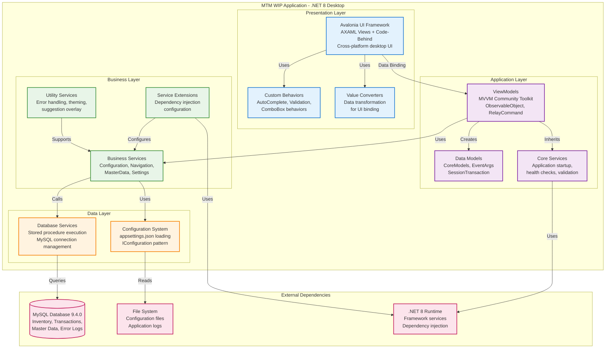
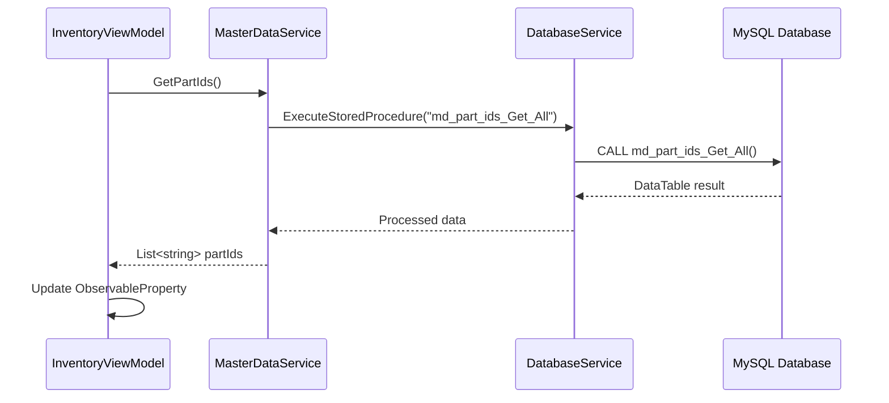
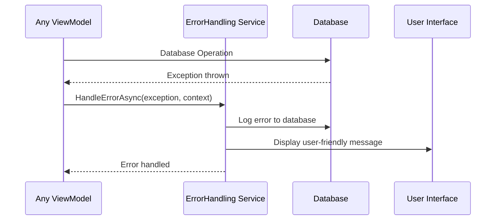
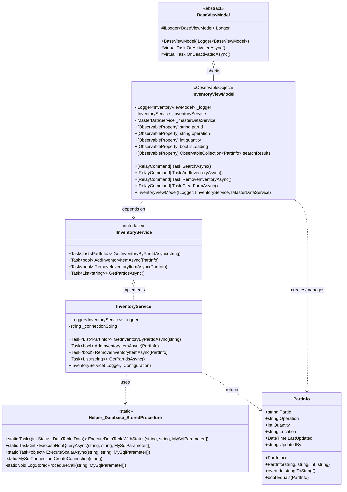
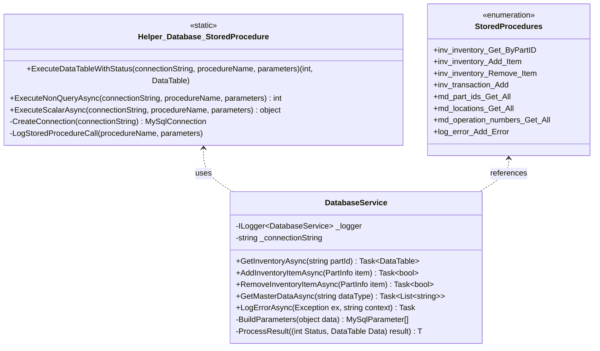
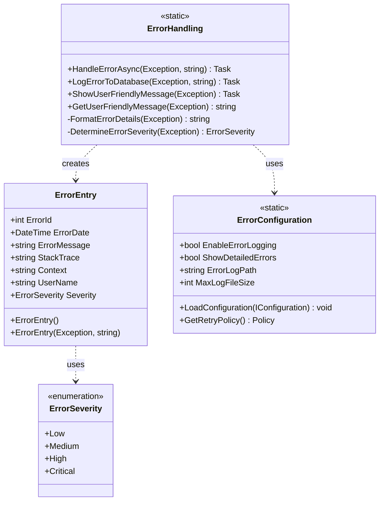
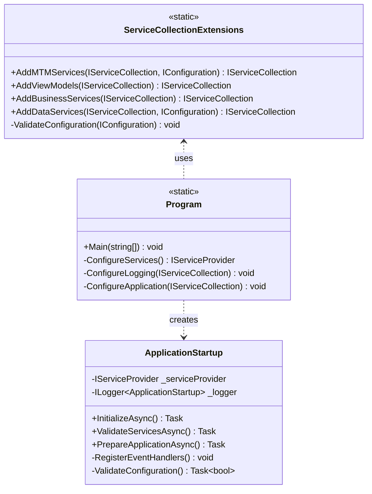

# MTM WIP Application - C4 Architecture Model

This document presents the C4 (Context, Containers, Components, Code) architecture model for the MTM Work-in-Process (WIP) Application, providing a comprehensive view of the system architecture from high-level context down to detailed code structure.

## Table of Contents

1. [C1 - System Context](#c1---system-context)
2. [C2 - Container Diagram](#c2---container-diagram)  
3. [C3 - Component Diagram](#c3---component-diagram)
4. [C4 - Code Diagram](#c4---code-diagram)
5. [Architecture Decision Records](#architecture-decision-records)

---

## C1 - System Context

The System Context diagram shows the MTM WIP Application in its operational environment, highlighting the key users and external systems it interacts with.

```mermaid
graph TB
    subgraph "Manufacturing Environment"
        User[Manufacturing Operator<br/>Manages inventory and operations]
        Supervisor[Production Supervisor<br/>Monitors and reports]
        Admin[System Administrator<br/>Configures system]
    end
    
    subgraph "MTM WIP System"
        MTMApp[MTM WIP Application<br/>Desktop inventory management<br/>and transaction processing]
    end
    
    subgraph "External Systems"
        Database[MySQL Database<br/>Stores inventory, transactions,<br/>and master data]
        FileSystem[Local File System<br/>Configuration files,<br/>logs, and exports]
        Network[Network Resources<br/>Shared drives,<br/>backup systems]
    end
    
    User -->|Uses| MTMApp
    Supervisor -->|Uses| MTMApp
    Admin -->|Configures| MTMApp
    
    MTMApp -->|Reads/Writes| Database
    MTMApp -->|Stores/Loads| FileSystem
    MTMApp -->|Accesses| Network
    
    Database -->|Returns Data| MTMApp
    FileSystem -->|Provides Config| MTMApp
    Network -->|Provides Resources| MTMApp
    
    classDef user fill:#e1f5fe,stroke:#01579b,stroke-width:2px
    classDef system fill:#f3e5f5,stroke:#4a148c,stroke-width:3px
    classDef external fill:#e8f5e8,stroke:#2e7d32,stroke-width:2px
    
    class User,Supervisor,Admin user
    class MTMApp system  
    class Database,FileSystem,Network external
```

### Key Relationships

| Actor/System | Relationship | Description |
|--------------|--------------|-------------|
| **Manufacturing Operator** | Primary User | Performs daily inventory transactions, adds/removes items, checks quantities |
| **Production Supervisor** | Secondary User | Reviews transaction history, generates reports, monitors operations |
| **System Administrator** | Admin User | Configures application settings, manages database connections, maintains system |
| **MySQL Database** | Data Store | Persists all inventory data, transactions, master data via stored procedures |
| **Local File System** | Configuration | Stores appsettings.json, logs, and temporary export files |
| **Network Resources** | Infrastructure | Provides access to shared drives and backup systems |

### System Scope and Boundaries

The MTM WIP Application operates within these boundaries:
- **Manufacturing Floor Operations**: Real-time inventory tracking and transaction processing
- **Desktop Environment**: Runs on Windows workstations with .NET 8 runtime
- **Local Network**: Accesses MySQL database server and shared network resources
- **Single-User Sessions**: Each instance serves one operator at a time

---

## C2 - Container Diagram

The Container diagram breaks down the MTM WIP Application into its major technological containers, showing how responsibilities are distributed and how containers communicate.



### Container Responsibilities

| Container | Technology | Responsibilities |
|-----------|------------|------------------|
| **Avalonia UI** | .NET 8 + Avalonia 11.3.4 | Cross-platform desktop UI, AXAML markup, user interaction handling |
| **ViewModels** | MVVM Community Toolkit 8.3.2 | Presentation logic, data binding, command handling with source generators |
| **Business Services** | .NET 8 Services | Business logic, workflow management, data transformation |
| **Database Services** | MySql.Data 9.4.0 | Data access via stored procedures, connection management |
| **Configuration System** | Microsoft.Extensions.Configuration | Application settings, connection strings, feature flags |
| **MySQL Database** | MySQL 9.4.0 | Data persistence, business rules enforcement, transaction integrity |

### Communication Patterns

- **UI ↔ ViewModels**: Two-way data binding via INotifyPropertyChanged and MVVM Community Toolkit
- **ViewModels ↔ Services**: Dependency injection with constructor injection pattern
- **Services ↔ Database**: Stored procedure calls only via `Helper_Database_StoredProcedure`
- **Configuration**: Loaded at startup and injected throughout application layers

---

## C3 - Component Diagram

The Component diagram shows the internal structure of key containers, focusing on the most complex parts of the system - the Business Services and ViewModels containers.

```mermaid
graph TB
    subgraph "ViewModels Container - 42 Components"
        subgraph "MainForm ViewModels"
            MainVM[MainFormViewModel<br/>Primary application interface]
            InventoryVM[InventoryViewModel<br/>Inventory management operations]
            QuickActionVM[QuickActionViewModel<br/>Rapid transaction processing]
            TransactionVM[TransactionViewModel<br/>Transaction history and management]
        end
        
        subgraph "Settings ViewModels"
            SettingsVM[SettingsViewModel<br/>Application configuration]
            ThemeVM[ThemeSelectionViewModel<br/>UI theme management]
            DatabaseVM[DatabaseSettingsViewModel<br/>Connection configuration]
        end
        
        subgraph "Shared ViewModels"
            BaseVM[BaseViewModel<br/>Common ViewModel functionality]
            DialogVM[DialogViewModel<br/>Modal dialog management]
        end
        
        subgraph "Overlay ViewModels"
            SuggestionVM[SuggestionOverlayViewModel<br/>Auto-complete suggestions]
        end
    end
    
    subgraph "Business Services Container - 12 Components"
        subgraph "Core Services"
            ConfigService[ConfigurationService<br/>Settings and configuration management]
            NavService[NavigationService<br/>View navigation and routing]
            ErrorService[ErrorHandling<br/>Centralized error management]
        end
        
        subgraph "Data Services"
            MasterDataService[MasterDataService<br/>Reference data management]
            DatabaseService[Database Service<br/>Stored procedure execution]
        end
        
        subgraph "UI Services"
            ThemeService[ThemeService<br/>Dynamic theme switching]
            SuggestionService[SuggestionOverlay Service<br/>Auto-complete functionality]
            QuickButtonService[QuickButtons Service<br/>Rapid action management]
        end
        
        subgraph "State Management"
            SettingsService[SettingsService<br/>User preference persistence]
            StateManager[SettingsPanelStateManager<br/>UI state management]
            VirtualPanelManager[VirtualPanelManager<br/>Dynamic panel management]
            StartupDialog[StartupDialog Service<br/>Application initialization]
        end
    end
    
    subgraph "Data Models Container"
        CoreModels[CoreModels<br/>Inventory, Transaction,<br/>Part, Location entities]
        EventArgs[Custom EventArgs<br/>InventoryEventArgs,<br/>QuickActionExecutedEventArgs]
        SessionTransaction[SessionTransaction<br/>Current transaction state]
    end
    
    %% ViewModel Dependencies
    MainVM -->|Uses| ConfigService
    MainVM -->|Uses| NavService
    MainVM -->|Uses| ErrorService
    
    InventoryVM -->|Uses| MasterDataService  
    InventoryVM -->|Uses| DatabaseService
    InventoryVM -->|Uses| ErrorService
    
    QuickActionVM -->|Uses| QuickButtonService
    QuickActionVM -->|Uses| DatabaseService
    
    TransactionVM -->|Uses| DatabaseService
    TransactionVM -->|Uses| MasterDataService
    
    SettingsVM -->|Uses| SettingsService
    SettingsVM -->|Uses| ConfigService
    
    ThemeVM -->|Uses| ThemeService
    
    SuggestionVM -->|Uses| SuggestionService
    SuggestionVM -->|Uses| MasterDataService
    
    %% All ViewModels inherit from BaseVM
    MainVM -.->|inherits| BaseVM
    InventoryVM -.->|inherits| BaseVM
    QuickActionVM -.->|inherits| BaseVM
    TransactionVM -.->|inherits| BaseVM
    SettingsVM -.->|inherits| BaseVM
    ThemeVM -.->|inherits| BaseVM
    SuggestionVM -.->|inherits| BaseVM
    DialogVM -.->|inherits| BaseVM
    
    %% Service Dependencies  
    MasterDataService -->|Uses| DatabaseService
    SuggestionService -->|Uses| MasterDataService
    QuickButtonService -->|Uses| ConfigService
    StateManager -->|Uses| SettingsService
    
    %% Data Model Usage
    InventoryVM -->|Creates/Uses| CoreModels
    TransactionVM -->|Creates/Uses| CoreModels
    QuickActionVM -->|Publishes| EventArgs
    MainVM -->|Manages| SessionTransaction
    
    classDef vm fill:#e1f5fe,stroke:#01579b,stroke-width:2px
    classDef service fill:#e8f5e8,stroke:#2e7d32,stroke-width:2px
    classDef model fill:#fff3e0,stroke:#f57c00,stroke-width:2px
    classDef base fill:#f3e5f5,stroke:#7b1fa2,stroke-width:2px
    
    class MainVM,InventoryVM,QuickActionVM,TransactionVM,SettingsVM,ThemeVM,SuggestionVM,DialogVM vm
    class ConfigService,NavService,ErrorService,MasterDataService,DatabaseService,ThemeService,SuggestionService,QuickButtonService,SettingsService,StateManager,VirtualPanelManager,StartupDialog service
    class CoreModels,EventArgs,SessionTransaction model
    class BaseVM base
```



### Component Interaction Patterns

#### 1. ViewModel-Service Communication


#### 2. Error Handling Flow


### Key Component Responsibilities

| Component Type | Count | Primary Responsibilities |
|----------------|-------|-------------------------|
| **MainForm ViewModels** | 4 | Core business operations, user interactions, primary workflows |
| **Settings ViewModels** | 3 | Configuration management, user preferences, system setup |
| **Shared ViewModels** | 2 | Common functionality, reusable dialog patterns |
| **Overlay ViewModels** | 1 | Auto-complete suggestions, search assistance |
| **Core Services** | 3 | Configuration, navigation, error handling |
| **Data Services** | 2 | Database operations, master data management |
| **UI Services** | 3 | Theme management, suggestions, quick actions |
| **State Management** | 4 | User preferences, UI state, panel management |

---

## C4 - Code Diagram

The Code diagram provides detailed views of critical classes and their relationships, focusing on the most important patterns in the MTM application.

### MVVM Community Toolkit Pattern Implementation



### Database Access Pattern



### Error Handling Pattern



### Dependency Injection Configuration



### Key Code Patterns

#### 1. MVVM Community Toolkit Usage
```csharp
[ObservableObject]
public partial class InventoryViewModel : BaseViewModel
{
    [ObservableProperty]
    private string partId = string.Empty;
    
    [ObservableProperty] 
    private bool isLoading;

    [RelayCommand]
    private async Task SearchAsync()
    {
        IsLoading = true;
        try
        {
            var results = await _inventoryService.GetInventoryByPartIdAsync(PartId);
            SearchResults.Clear();
            foreach (var item in results)
            {
                SearchResults.Add(item);
            }
        }
        catch (Exception ex)
        {
            await ErrorHandling.HandleErrorAsync(ex, "Inventory search failed");
        }
        finally
        {
            IsLoading = false;
        }
    }
}
```

#### 2. Stored Procedure Pattern
```csharp
public async Task<List<PartInfo>> GetInventoryByPartIdAsync(string partId)
{
    var parameters = new MySqlParameter[]
    {
        new("p_PartID", partId),
        new("p_Operation", operation)
    };

    var result = await Helper_Database_StoredProcedure.ExecuteDataTableWithStatus(
        _connectionString,
        "inv_inventory_Get_ByPartIDandOperation",
        parameters
    );

    if (result.Status == 1)
    {
        return ProcessDataTableToPartInfoList(result.Data);
    }
    
    throw new DatabaseException($"Stored procedure failed with status: {result.Status}");
}
```

#### 3. Dependency Injection Pattern
```csharp
public static class ServiceCollectionExtensions
{
    public static IServiceCollection AddMTMServices(
        this IServiceCollection services, 
        IConfiguration configuration)
    {
        // Core Services
        services.TryAddSingleton<IConfigurationService, ConfigurationService>();
        services.TryAddSingleton<IThemeService, ThemeService>();
        services.TryAddSingleton<INavigationService, NavigationService>();
        
        // Business Services
        services.TryAddScoped<IInventoryService, InventoryService>();
        services.TryAddScoped<IMasterDataService, MasterDataService>();
        
        // ViewModels
        services.TryAddTransient<MainFormViewModel>();
        services.TryAddTransient<InventoryViewModel>();
        services.TryAddTransient<SettingsViewModel>();
        
        return services;
    }
}
```

---

## Architecture Decision Records

### ADR-001: MVVM Community Toolkit Adoption
**Status**: Accepted  
**Date**: 2025-09-04

**Decision**: Use MVVM Community Toolkit instead of ReactiveUI for ViewModel implementation.

**Rationale**:
- Source generator-based approach reduces boilerplate code
- Better performance with compile-time property generation
- Smaller runtime footprint
- Better integration with .NET 8 and dependency injection
- Microsoft-supported toolkit with active development

**Consequences**:
- All ViewModels use `[ObservableObject]` and `[ObservableProperty]` attributes
- Commands implemented with `[RelayCommand]` attribute
- Consistent pattern across all 42 ViewModels
- Simplified testing with generated properties

### ADR-002: Stored Procedures Only Data Access
**Status**: Accepted  
**Date**: 2025-09-04

**Decision**: All database operations must use stored procedures via `Helper_Database_StoredProcedure.ExecuteDataTableWithStatus()`.

**Rationale**:
- Enhanced security against SQL injection attacks
- Better performance with compiled execution plans
- Centralized business logic in database layer
- Easier database versioning and migration
- Clear separation between application and data layers

**Consequences**:
- No direct SQL queries allowed in application code
- All database operations must have corresponding stored procedures
- Database schema changes require stored procedure updates
- Consistent error handling through standardized return patterns

### ADR-003: Avalonia UI Framework Selection
**Status**: Accepted  
**Date**: 2025-09-04

**Decision**: Use Avalonia UI 11.3.4 for cross-platform desktop application development.

**Rationale**:
- Cross-platform compatibility (Windows, Linux, macOS)
- XAML-based UI definition familiar to WPF developers
- Modern .NET 8 support with good performance
- Active community and commercial support
- Suitable for manufacturing environment requirements

**Consequences**:
- AXAML syntax differences from WPF require developer training
- Custom controls and behaviors needed for specific manufacturing workflows
- Theme system implementation for MTM branding requirements
- Platform-specific testing required for cross-platform deployment

### ADR-004: Dependency Injection Throughout Application
**Status**: Accepted  
**Date**: 2025-09-04

**Decision**: Use Microsoft.Extensions.DependencyInjection throughout the application for service management.

**Rationale**:
- Loose coupling between components
- Easier unit testing with mock services
- Consistent service lifetime management
- Integration with .NET 8 hosting model
- Industry standard pattern for .NET applications

**Consequences**:
- All services must implement interfaces
- Constructor injection required for all dependencies
- Service registration centralized in `ServiceCollectionExtensions`
- Potential complexity in service dependency graphs

### ADR-005: Centralized Error Handling
**Status**: Accepted  
**Date**: 2025-09-04

**Decision**: Implement centralized error handling through `Services.ErrorHandling.HandleErrorAsync()`.

**Rationale**:
- Consistent error logging and user messaging
- Centralized error analytics and monitoring
- Reduced code duplication in error handling
- Easier maintenance and updates to error policies
- Better user experience with contextual error messages

**Consequences**:
- All exceptions must be routed through centralized handler
- Error handling becomes a shared dependency
- Requires careful design for error context preservation
- Database logging adds dependency on database availability

---

## Summary

The MTM WIP Application follows a layered architecture pattern with clear separation of concerns:

- **Presentation Layer**: Avalonia UI with MVVM Community Toolkit for modern, responsive user interfaces
- **Application Layer**: ViewModels managing presentation logic and user interactions
- **Business Layer**: Services implementing business rules and workflows
- **Data Layer**: Stored procedure-based database access with MySQL integration

Key architectural principles:
- **Dependency Injection**: Consistent throughout all layers
- **Separation of Concerns**: Clear layer boundaries and responsibilities  
- **Error Handling**: Centralized and consistent error management
- **Data Access**: Stored procedures only for security and performance
- **Testing**: Designed for easy unit testing and mocking

This architecture supports the manufacturing environment requirements while maintaining flexibility for future enhancements and cross-platform deployment scenarios.

---

*Document Version: 1.0*  
*Last Updated: 2025-09-04*  
*Next Review: 2025-12-04*
