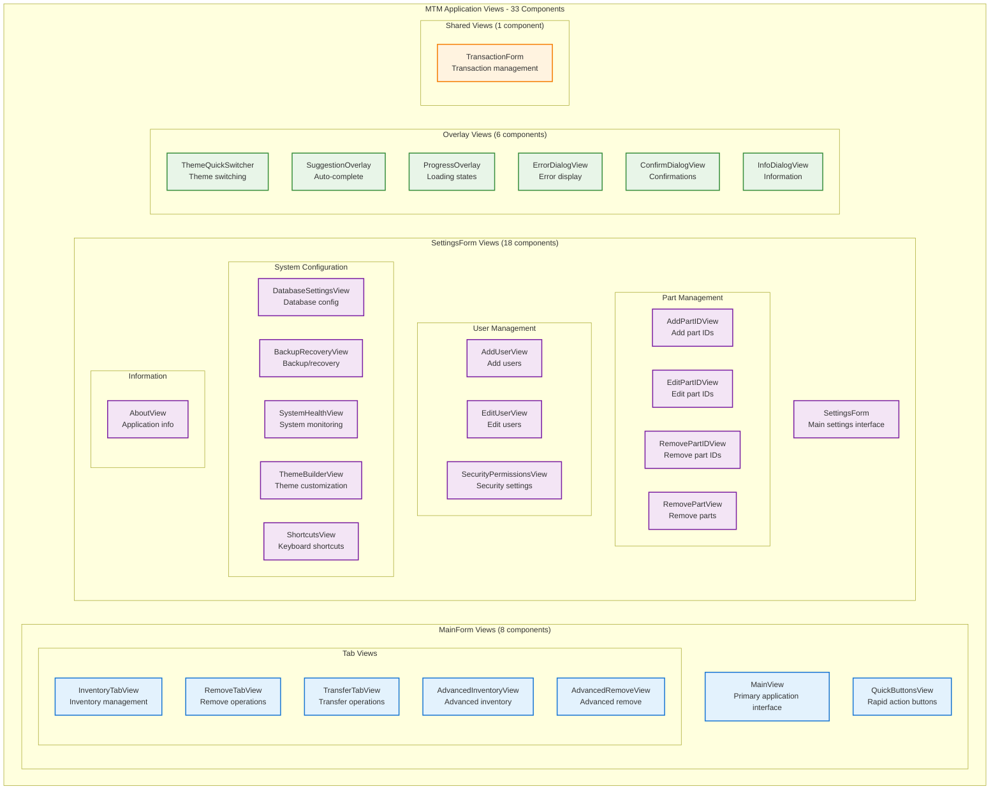
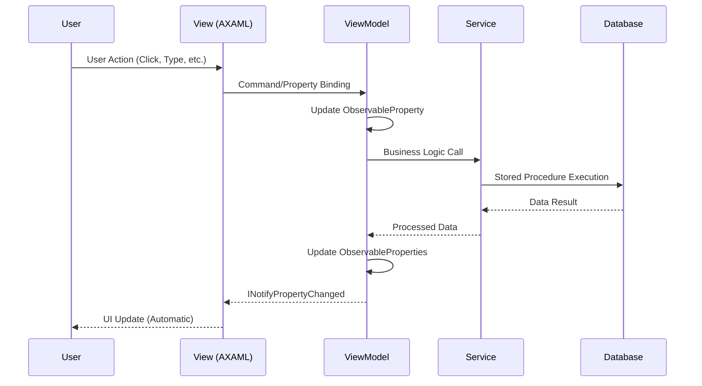
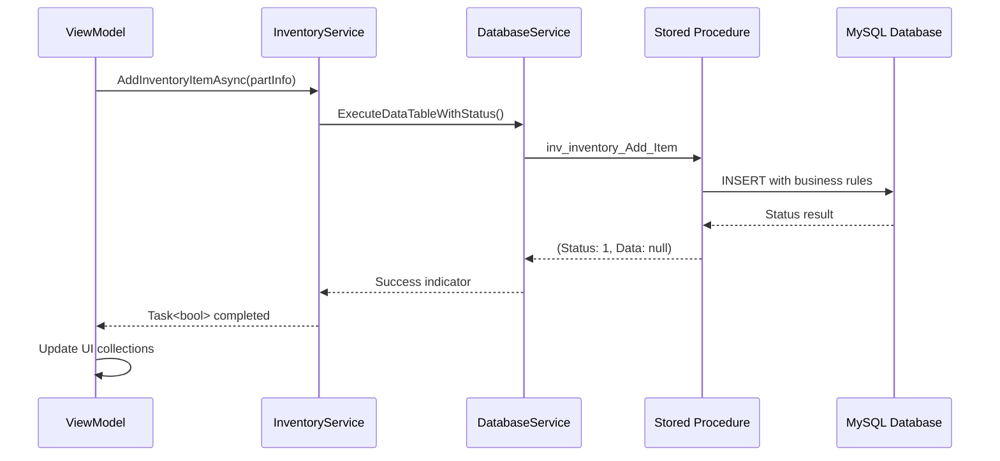
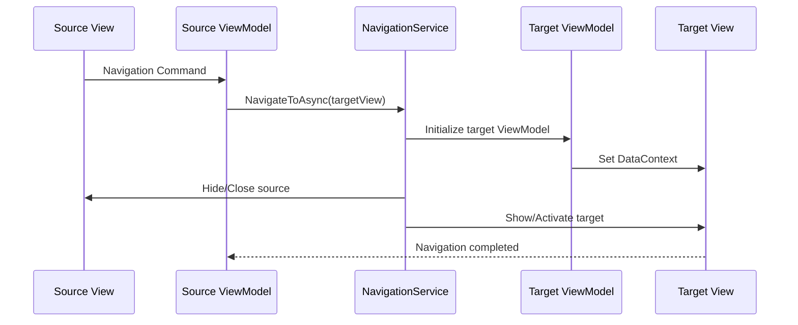

# MTM WIP Application - Component Relationship Diagrams

This document provides detailed component relationship diagrams for all Views, ViewModels, and Services in the MTM WIP Application, showing how the 32+ Views connect to their corresponding ViewModels and the underlying service architecture.

## Table of Contents

1. [View Architecture Overview](#view-architecture-overview)
2. [MainForm View Components](#mainform-view-components)
3. [SettingsForm View Components](#settingsform-view-components)
4. [Overlay View Components](#overlay-view-components)
5. [View-ViewModel-Service Relationships](#view-viewmodel-service-relationships)
6. [Data Flow Patterns](#data-flow-patterns)

---

## View Architecture Overview

The MTM WIP Application contains **33 View components** organized in a hierarchical structure that supports the manufacturing workflow requirements.



### View Component Summary

| Category | Count | Primary Purpose |
|----------|-------|-----------------|
| **MainForm Views** | 8 | Core manufacturing operations, inventory management |
| **SettingsForm Views** | 18 | System configuration, user management, maintenance |
| **Overlay Views** | 6 | UI overlays, dialogs, suggestions, theme switching |
| **Shared Views** | 1 | Reusable transaction components |
| **Total Views** | 33 | Complete application interface coverage |

---

## MainForm View Components

The MainForm contains the primary operational views used by manufacturing operators for daily inventory management tasks.

```mermaid
graph TB
    subgraph "MainForm View Hierarchy"
        MainView[MainView.axaml<br/>Main application container]
        
        subgraph "Embedded Components"
            QuickButtonsView[QuickButtonsView.axaml<br/>Rapid action toolbar]
            
            subgraph "Tab Container"
                InventoryTab[InventoryTabView.axaml<br/>Primary inventory operations]
                RemoveTab[RemoveTabView.axaml<br/>Inventory removal operations]
                TransferTab[TransferTabView.axaml<br/>Location transfer operations]
                AdvancedInventory[AdvancedInventoryView.axaml<br/>Complex inventory queries]
                AdvancedRemove[AdvancedRemoveView.axaml<br/>Bulk remove operations]
            end
        end
        
        subgraph "Overlay Components (Within MainForm)"
            ThemeQuickSwitcher[ThemeQuickSwitcher.axaml<br/>Embedded in MainView]
            SuggestionOverlay[SuggestionOverlay<br/>Auto-complete assistance]
        end
    end
    
    subgraph "Connected ViewModels"
        MainFormVM[MainFormViewModel<br/>Coordinates main view operations]
        InventoryVM[InventoryViewModel<br/>Inventory management logic]
        QuickActionVM[QuickActionViewModel<br/>Rapid transaction processing]
        TransactionVM[TransactionViewModel<br/>Transaction history and tracking]
        SuggestionVM[SuggestionOverlayViewModel<br/>Search suggestions]
    end
    
    %% View to ViewModel connections
    MainView -.->|DataContext| MainFormVM
    QuickButtonsView -.->|DataContext| QuickActionVM
    InventoryTab -.->|DataContext| InventoryVM
    RemoveTab -.->|DataContext| InventoryVM
    TransferTab -.->|DataContext| TransactionVM
    AdvancedInventory -.->|DataContext| InventoryVM
    AdvancedRemove -.->|DataContext| InventoryVM
    SuggestionOverlay -.->|DataContext| SuggestionVM
    
    %% Embedded relationships
    MainView -->|Contains| QuickButtonsView
    MainView -->|Contains| InventoryTab
    MainView -->|Contains| RemoveTab
    MainView -->|Contains| TransferTab
    MainView -->|Contains| AdvancedInventory
    MainView -->|Contains| AdvancedRemove
    MainView -->|Embeds| ThemeQuickSwitcher
    MainView -->|Hosts| SuggestionOverlay
    
    classDef view fill:#e1f5fe,stroke:#01579b,stroke-width:2px
    classDef viewmodel fill:#f3e5f5,stroke:#7b1fa2,stroke-width:2px
    classDef overlay fill:#e8f5e8,stroke:#2e7d32,stroke-width:2px
    
    class MainView,QuickButtonsView,InventoryTab,RemoveTab,TransferTab,AdvancedInventory,AdvancedRemove view
    class MainFormVM,InventoryVM,QuickActionVM,TransactionVM,SuggestionVM viewmodel
    class ThemeQuickSwitcher,SuggestionOverlay overlay
```



### MainForm View Responsibilities

| View Component | File Path | Primary Responsibilities |
|----------------|-----------|-------------------------|
| **MainView** | `Views/MainForm/MainView.axaml` | Application shell, theme management, tab coordination |
| **QuickButtonsView** | `Views/MainForm/QuickButtonsView.axaml` | Rapid inventory actions, frequently used operations |
| **InventoryTabView** | `Views/MainForm/Panels/InventoryTabView.axaml` | Primary inventory add/search operations |
| **RemoveTabView** | `Views/MainForm/Panels/RemoveTabView.axaml` | Inventory removal operations |
| **TransferTabView** | `Views/MainForm/Panels/TransferTabView.axaml` | Location-to-location transfers |
| **AdvancedInventoryView** | `Views/MainForm/Panels/AdvancedInventoryView.axaml` | Complex queries and bulk operations |
| **AdvancedRemoveView** | `Views/MainForm/Panels/AdvancedRemoveView.axaml` | Bulk removal and advanced filtering |
| **ThemeQuickSwitcher** | `Views/MainForm/Overlays/ThemeQuickSwitcher.axaml` | Real-time theme switching |

---

## SettingsForm View Components

The SettingsForm contains 18 specialized views for system administration, configuration, and maintenance tasks.

```mermaid
graph TB
    subgraph "SettingsForm View Hierarchy - 18 Components"
        SettingsForm[SettingsForm.axaml<br/>Settings container and navigation]
        
        subgraph "Part Management Views (4 components)"
            AddPartID[AddPartIDView.axaml<br/>Add new part IDs to system]
            EditPartID[EditPartIDView.axaml<br/>Modify existing part IDs]
            RemovePartID[RemovePartIDView.axaml<br/>Remove part IDs from system]
            RemovePart[RemovePartView.axaml<br/>Remove complete parts]
        end
        
        subgraph "User Management Views (3 components)"
            AddUser[AddUserView.axaml<br/>Create user accounts]
            EditUser[EditUserView.axaml<br/>Modify user properties]
            SecurityPerms[SecurityPermissionsView.axaml<br/>Manage user permissions]
        end
        
        subgraph "System Configuration Views (5 components)"
            DatabaseSettings[DatabaseSettingsView.axaml<br/>Database connection config]
            BackupRecovery[BackupRecoveryView.axaml<br/>Backup and recovery operations]
            SystemHealth[SystemHealthView.axaml<br/>System monitoring dashboard]
            ThemeBuilder[ThemeBuilderView.axaml<br/>Theme customization tools]
            Shortcuts[ShortcutsView.axaml<br/>Keyboard shortcut management]
        end
        
        subgraph "Location Management Views (5 components)"
            AddLocation[AddLocationView.axaml<br/>Add new locations]
            EditLocation[EditLocationView.axaml<br/>Modify location properties]
            RemoveLocation[RemoveLocationView.axaml<br/>Remove locations]
            AddOperation[AddOperationView.axaml<br/>Add operation numbers]
            EditOperation[EditOperationView.axaml<br/>Modify operations]
        end
        
        subgraph "Information Views (1 component)"
            About[AboutView.axaml<br/>Application information and version]
        end
    end
    
    subgraph "Connected ViewModels"
        SettingsMainVM[SettingsViewModel<br/>Main settings coordination]
        PartManagementVM[PartManagementViewModel<br/>Part CRUD operations]
        UserManagementVM[UserManagementViewModel<br/>User administration]
        SystemConfigVM[SystemConfigurationViewModel<br/>System settings]
        LocationManagementVM[LocationManagementViewModel<br/>Location management]
        ThemeBuilderVM[ThemeBuilderViewModel<br/>Theme customization]
        AboutVM[AboutViewModel<br/>Application information]
    end
    
    %% View to ViewModel connections
    SettingsForm -.->|DataContext| SettingsMainVM
    AddPartID -.->|DataContext| PartManagementVM
    EditPartID -.->|DataContext| PartManagementVM
    RemovePartID -.->|DataContext| PartManagementVM
    RemovePart -.->|DataContext| PartManagementVM
    AddUser -.->|DataContext| UserManagementVM
    EditUser -.->|DataContext| UserManagementVM
    SecurityPerms -.->|DataContext| UserManagementVM
    DatabaseSettings -.->|DataContext| SystemConfigVM
    BackupRecovery -.->|DataContext| SystemConfigVM
    SystemHealth -.->|DataContext| SystemConfigVM
    ThemeBuilder -.->|DataContext| ThemeBuilderVM
    Shortcuts -.->|DataContext| SystemConfigVM
    AddLocation -.->|DataContext| LocationManagementVM
    EditLocation -.->|DataContext| LocationManagementVM
    RemoveLocation -.->|DataContext| LocationManagementVM
    AddOperation -.->|DataContext| LocationManagementVM
    EditOperation -.->|DataContext| LocationManagementVM
    About -.->|DataContext| AboutVM
    
    %% Container relationships
    SettingsForm -->|Navigates to| AddPartID
    SettingsForm -->|Navigates to| EditPartID
    SettingsForm -->|Navigates to| RemovePartID
    SettingsForm -->|Navigates to| RemovePart
    SettingsForm -->|Navigates to| AddUser
    SettingsForm -->|Navigates to| EditUser
    SettingsForm -->|Navigates to| SecurityPerms
    SettingsForm -->|Navigates to| DatabaseSettings
    SettingsForm -->|Navigates to| BackupRecovery
    SettingsForm -->|Navigates to| SystemHealth
    SettingsForm -->|Navigates to| ThemeBuilder
    SettingsForm -->|Navigates to| Shortcuts
    SettingsForm -->|Navigates to| AddLocation
    SettingsForm -->|Navigates to| EditLocation
    SettingsForm -->|Navigates to| RemoveLocation
    SettingsForm -->|Navigates to| AddOperation
    SettingsForm -->|Navigates to| EditOperation
    SettingsForm -->|Navigates to| About
    
    classDef settings fill:#f3e5f5,stroke:#7b1fa2,stroke-width:2px
    classDef partmgmt fill:#e8f5e8,stroke:#388e3c,stroke-width:2px
    classDef usermgmt fill:#fff3e0,stroke:#f57c00,stroke-width:2px
    classDef sysconfig fill:#fce4ec,stroke:#c2185b,stroke-width:2px
    classDef viewmodel fill:#e3f2fd,stroke:#1976d2,stroke-width:2px
    
    class SettingsForm settings
    class AddPartID,EditPartID,RemovePartID,RemovePart partmgmt
    class AddUser,EditUser,SecurityPerms usermgmt
    class DatabaseSettings,BackupRecovery,SystemHealth,ThemeBuilder,Shortcuts,AddLocation,EditLocation,RemoveLocation,AddOperation,EditOperation sysconfig
    class About settings
    class SettingsMainVM,PartManagementVM,UserManagementVM,SystemConfigVM,LocationManagementVM,ThemeBuilderVM,AboutVM viewmodel
```



### SettingsForm View Categories

| Category | Views | Primary Functions |
|----------|--------|------------------|
| **Part Management** | AddPartIDView, EditPartIDView, RemovePartIDView, RemovePartView | CRUD operations for part master data |
| **User Management** | AddUserView, EditUserView, SecurityPermissionsView | User administration and security |
| **System Configuration** | DatabaseSettingsView, BackupRecoveryView, SystemHealthView, ThemeBuilderView, ShortcutsView | System setup and maintenance |
| **Location Management** | AddLocationView, EditLocationView, RemoveLocationView, AddOperationView, EditOperationView | Manufacturing location and operation setup |
| **Information** | AboutView | Application information and diagnostics |

---

## View-ViewModel-Service Relationships

This diagram shows the complete data flow from Views through ViewModels to Services and ultimately to the database layer.

```mermaid
graph TB
    subgraph "Presentation Layer - Views (33 components)"
        MainViews[MainForm Views<br/>8 operational views]
        SettingsViews[SettingsForm Views<br/>18 configuration views]
        OverlayViews[Overlay Views<br/>6 dialog/overlay views]
        SharedViews[Shared Views<br/>1 transaction component]
    end
    
    subgraph "Application Layer - ViewModels (42 components)"
        MainFormVM[MainFormViewModel<br/>Application coordination]
        InventoryVM[InventoryViewModel<br/>Inventory operations]
        QuickActionVM[QuickActionViewModel<br/>Rapid actions]
        TransactionVM[TransactionViewModel<br/>Transaction management]
        
        SettingsMainVM[SettingsViewModel<br/>Settings coordination]
        PartMgmtVM[PartManagementViewModel<br/>Part management]
        UserMgmtVM[UserManagementViewModel<br/>User administration]
        SystemConfigVM[SystemConfigurationViewModel<br/>System configuration]
        
        ThemeVM[ThemeSelectionViewModel<br/>Theme management]
        SuggestionVM[SuggestionOverlayViewModel<br/>Auto-complete]
        DialogVMs[Various Dialog ViewModels<br/>Modal dialogs]
        
        BaseVM[BaseViewModel<br/>Shared functionality]
    end
    
    subgraph "Business Layer - Services (12 components)"
        subgraph "Data Services"
            MasterDataService[MasterDataService<br/>Reference data management]
            InventoryService[InventoryService<br/>Inventory business logic]
            TransactionService[TransactionService<br/>Transaction processing]
            UserService[UserService<br/>User management]
        end
        
        subgraph "System Services"
            ConfigService[ConfigurationService<br/>Application settings]
            ThemeService[ThemeService<br/>Theme management]
            ErrorService[ErrorHandling<br/>Error management]
            NavigationService[NavigationService<br/>View navigation]
        end
        
        subgraph "UI Services"
            SuggestionService[SuggestionOverlay<br/>Auto-complete logic]
            QuickButtonService[QuickButtons<br/>Rapid actions]
            StateManager[SettingsPanelStateManager<br/>UI state]
            VirtualPanelManager[VirtualPanelManager<br/>Dynamic panels]
        end
    end
    
    subgraph "Data Layer"
        DatabaseService[Database Service<br/>Stored procedure execution]
        StoredProcs[45+ Stored Procedures<br/>inv_*, md_*, log_*]
        MySQL[(MySQL Database 9.4.0<br/>Persistent storage)]
    end
    
    %% View to ViewModel connections
    MainViews -.->|DataBinding| MainFormVM
    MainViews -.->|DataBinding| InventoryVM
    MainViews -.->|DataBinding| QuickActionVM
    MainViews -.->|DataBinding| TransactionVM
    
    SettingsViews -.->|DataBinding| SettingsMainVM
    SettingsViews -.->|DataBinding| PartMgmtVM
    SettingsViews -.->|DataBinding| UserMgmtVM
    SettingsViews -.->|DataBinding| SystemConfigVM
    
    OverlayViews -.->|DataBinding| ThemeVM
    OverlayViews -.->|DataBinding| SuggestionVM
    OverlayViews -.->|DataBinding| DialogVMs
    
    %% ViewModel inheritance
    MainFormVM -.->|inherits| BaseVM
    InventoryVM -.->|inherits| BaseVM
    QuickActionVM -.->|inherits| BaseVM
    TransactionVM -.->|inherits| BaseVM
    SettingsMainVM -.->|inherits| BaseVM
    PartMgmtVM -.->|inherits| BaseVM
    UserMgmtVM -.->|inherits| BaseVM
    SystemConfigVM -.->|inherits| BaseVM
    ThemeVM -.->|inherits| BaseVM
    SuggestionVM -.->|inherits| BaseVM
    DialogVMs -.->|inherits| BaseVM
    
    %% ViewModel to Service connections
    InventoryVM -->|DI| MasterDataService
    InventoryVM -->|DI| InventoryService
    QuickActionVM -->|DI| QuickButtonService
    TransactionVM -->|DI| TransactionService
    
    PartMgmtVM -->|DI| MasterDataService
    UserMgmtVM -->|DI| UserService
    SystemConfigVM -->|DI| ConfigService
    
    ThemeVM -->|DI| ThemeService
    SuggestionVM -->|DI| SuggestionService
    
    %% All ViewModels use common services
    MainFormVM -->|DI| ConfigService
    MainFormVM -->|DI| NavigationService
    MainFormVM -->|DI| ErrorService
    
    %% Service to Data Layer
    MasterDataService -->|Uses| DatabaseService
    InventoryService -->|Uses| DatabaseService
    TransactionService -->|Uses| DatabaseService
    UserService -->|Uses| DatabaseService
    
    DatabaseService -->|Executes| StoredProcs
    StoredProcs -->|Queries| MySQL
    
    classDef view fill:#e1f5fe,stroke:#01579b,stroke-width:2px
    classDef viewmodel fill:#f3e5f5,stroke:#7b1fa2,stroke-width:2px
    classDef service fill:#e8f5e8,stroke:#2e7d32,stroke-width:2px
    classDef data fill:#fff3e0,stroke:#f57c00,stroke-width:2px
    classDef db fill:#fce4ec,stroke:#c2185b,stroke-width:2px
    
    class MainViews,SettingsViews,OverlayViews,SharedViews view
    class MainFormVM,InventoryVM,QuickActionVM,TransactionVM,SettingsMainVM,PartMgmtVM,UserMgmtVM,SystemConfigVM,ThemeVM,SuggestionVM,DialogVMs,BaseVM viewmodel
    class MasterDataService,InventoryService,TransactionService,UserService,ConfigService,ThemeService,ErrorService,NavigationService,SuggestionService,QuickButtonService,StateManager,VirtualPanelManager service
    class DatabaseService,StoredProcs data
    class MySQL db
```



---

## Data Flow Patterns

### 1. User Interaction Flow



### 2. Data Persistence Flow



### 3. Navigation Flow



---

## View Component Technical Details

### File Organization Patterns

```
Views/
├── MainForm/                    # 8 operational views
│   ├── MainView.axaml          # Application shell
│   ├── QuickButtonsView.axaml  # Rapid actions toolbar
│   └── Panels/
│       ├── InventoryTabView.axaml      # Primary inventory UI
│       ├── RemoveTabView.axaml         # Remove operations
│       ├── TransferTabView.axaml       # Transfer operations
│       ├── AdvancedInventoryView.axaml # Complex inventory
│       └── AdvancedRemoveView.axaml    # Advanced remove
├── SettingsForm/               # 18 configuration views
│   ├── SettingsForm.axaml      # Settings navigation shell
│   ├── AddPartIDView.axaml     # Part management
│   ├── AddUserView.axaml       # User management
│   ├── DatabaseSettingsView.axaml # System configuration
│   └── ... (15+ additional settings views)
└── MainForm/Overlays/          # 6 overlay components
    ├── ThemeQuickSwitcher.axaml    # Theme switching
    └── ... (5+ additional overlays)
```

### Common View Patterns

#### 1. Minimal Code-Behind Pattern
All Views follow the minimal code-behind pattern:

```csharp
public partial class InventoryTabView : UserControl
{
    public InventoryTabView()
    {
        InitializeComponent();
    }
    
    // Minimal cleanup if needed
    protected override void OnDetachedFromVisualTree(VisualTreeAttachmentEventArgs e)
    {
        base.OnDetachedFromVisualTree(e);
    }
}
```

#### 2. MVVM Community Toolkit Binding
Views use data binding exclusively:

```xml
<UserControl xmlns="https://github.com/avaloniaui"
             x:Class="MTM_WIP_Application_Avalonia.Views.InventoryTabView">
    <Grid>
        <TextBox Text="{Binding PartId}" />
        <Button Command="{Binding SearchCommand}" Content="Search" />
        <DataGrid ItemsSource="{Binding SearchResults}" />
    </Grid>
</UserControl>
```

#### 3. Theme Integration
All Views integrate with the MTM theme system:

```xml
<Border Background="{DynamicResource MTM_Shared_Logic.CardBackgroundBrush}"
        BorderBrush="{DynamicResource MTM_Shared_Logic.BorderAccentBrush}"
        CornerRadius="8">
    <StackPanel Margin="16">
        <!-- Content using theme resources -->
    </StackPanel>
</Border>
```

---

## Summary

The MTM WIP Application View architecture demonstrates:

- **33 View Components** organized in logical functional groups
- **Clear Separation**: Views handle only presentation, business logic in ViewModels/Services
- **Consistent Patterns**: All Views follow MVVM Community Toolkit patterns
- **Theme Integration**: Comprehensive theme support across all components
- **Manufacturing Focus**: Views designed for industrial workflow requirements
- **Scalable Architecture**: Easy to add new Views following established patterns

The component relationships ensure maintainable, testable, and extensible code while supporting the complex requirements of manufacturing inventory management.

---

*Document Version: 1.0*  
*Last Updated: 2025-09-04*  
*Total Views Documented: 33*  
*ViewModels: 42*  
*Services: 12*
