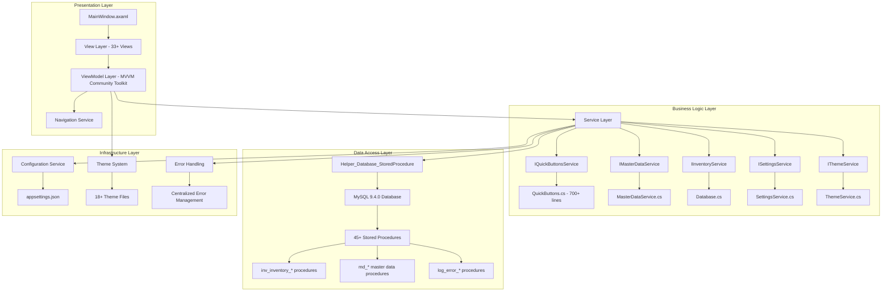

# MTM Inventory Management - Epic Architecture Specification

**Epic Name**: MTM Inventory Management Epic  
**Architecture Version**: 2.0  
**Status**: Active Implementation  
**Document Version**: 1.0  

**Created**: September 4, 2025  
**Last Updated**: September 4, 2025  

---

## 📋 Executive Summary

The MTM Inventory Management Epic represents a comprehensive manufacturing inventory system built on .NET 8 with Avalonia UI, implementing modern MVVM patterns with the Community Toolkit, and utilizing MySQL stored procedures for data operations. This architecture specification defines the complete system structure, component relationships, design patterns, and implementation standards that guide all feature development within the epic.

### Key Architecture Highlights
- **.NET 8 with Avalonia UI 11.3.4**: Modern cross-platform desktop application framework
- **MVVM Community Toolkit**: Source generator-based MVVM implementation with `[ObservableProperty]` and `[RelayCommand]`
- **Service-Oriented Architecture**: Comprehensive dependency injection with category-based service consolidation
- **Stored Procedures Only**: MySQL 9.4.0 database pattern via `Helper_Database_StoredProcedure.ExecuteDataTableWithStatus()`
- **MTM Design System**: 18+ professional themes with real-time switching and accessibility compliance

---

## 🏗️ System Architecture Overview

### High-Level Architecture Diagram


### Technology Stack Architecture

#### Core Framework Components
```csharp
// .NET 8 Foundation
TargetFramework: net8.0
C# Language Version: 12 with nullable reference types enabled
Runtime: .NET 8 Desktop Runtime

// Avalonia UI 11.3.4
UI Framework: Avalonia.UI 11.3.4
AXAML: Avalonia XAML syntax (NOT WPF XAML)
Controls: Avalonia native controls with custom MTM styling
Navigation: UserControl-based with minimal code-behind

// MVVM Community Toolkit 8.3.2  
ViewModel Pattern: [ObservableObject] with source generators
Property Binding: [ObservableProperty] automatic implementation
Command Pattern: [RelayCommand] with async support
Change Notification: Automatic INotifyPropertyChanged generation
```

#### Database and Storage Architecture
```csharp
// MySQL 9.4.0 Database Layer
Database Engine: MySQL 9.4.0 with optimized stored procedures
Connection: MySql.Data package for .NET connectivity
Pattern: Stored procedures ONLY via Helper_Database_StoredProcedure
Result Pattern: ExecuteDataTableWithStatus() returning (Status, Data)

// Data Transfer Pattern
public class DatabaseResult
{
    public int Status { get; set; }        // 1 = Success, 0 = Failure
    public DataTable Data { get; set; }    // Result data
    public string Message { get; set; }    // Status message
}

// Stored Procedure Execution Pattern
var result = await Helper_Database_StoredProcedure.ExecuteDataTableWithStatus(
    connectionString,
    "inv_inventory_Get_ByPartIDandOperation",
    parameters
);
```

---

## 🎯 Design Patterns and Principles

### MVVM Community Toolkit Implementation Standard

#### ViewModel Pattern (EXCLUSIVE - NO ReactiveUI)
```csharp
[ObservableObject]
public partial class InventoryViewModel : BaseViewModel
{
    // Property generation via source generators
    [ObservableProperty]
    private string _partId = string.Empty;

    [ObservableProperty]
    private bool _isLoading;

    [ObservableProperty]
    private ObservableCollection<InventoryItem> _inventoryItems = new();

    // Command generation with async support
    [RelayCommand]
    private async Task SearchInventoryAsync()
    {
        IsLoading = true;
        try
        {
            var result = await _inventoryService.SearchAsync(PartId);
            if (result.IsSuccess)
            {
                InventoryItems.Clear();
                foreach (var item in result.Data)
                {
                    InventoryItems.Add(item);
                }
            }
        }
        catch (Exception ex)
        {
            await ErrorHandling.HandleErrorAsync(ex, "Inventory search failed");
        }
        finally
        {
            IsLoading = false;
        }
    }

    public InventoryViewModel(
        ILogger<InventoryViewModel> logger,
        IInventoryService inventoryService) : base(logger)
    {
        ArgumentNullException.ThrowIfNull(inventoryService);
        _inventoryService = inventoryService;
    }
}
```

#### BaseViewModel Pattern
```csharp
[ObservableObject]
public abstract partial class BaseViewModel
{
    protected readonly ILogger Logger;

    [ObservableProperty]
    private string _statusMessage = string.Empty;

    [ObservableProperty] 
    private bool _isBusy;

    protected BaseViewModel(ILogger logger)
    {
        Logger = logger ?? throw new ArgumentNullException(nameof(logger));
    }

    protected virtual void OnPropertyChanged([CallerMemberName] string? propertyName = null)
    {
        Logger?.LogTrace("Property changed: {PropertyName} in {ViewModelType}", 
            propertyName, GetType().Name);
    }
}
```

### Service Layer Architecture Patterns

#### Service Interface Pattern
```csharp
public interface IInventoryService
{
    Task<ServiceResult<List<InventoryItem>>> GetInventoryAsync(string partId, string operation);
    Task<ServiceResult> AddInventoryAsync(InventoryItem item);
    Task<ServiceResult> UpdateInventoryAsync(InventoryItem item);
    Task<ServiceResult> RemoveInventoryAsync(string partId, string operation);
}

public class ServiceResult<T>
{
    public bool IsSuccess { get; set; }
    public T? Data { get; set; }
    public string Message { get; set; } = string.Empty;
    public Exception? Exception { get; set; }

    public static ServiceResult<T> Success(T data, string message = "") 
        => new() { IsSuccess = true, Data = data, Message = message };
    
    public static ServiceResult<T> Failure(string message, Exception? exception = null)
        => new() { IsSuccess = false, Message = message, Exception = exception };
}
```

#### Category-Based Service Consolidation (ESTABLISHED PATTERN)
```csharp
// File: Services/QuickButtons.cs (700+ lines)
namespace MTM_WIP_Application_Avalonia.Services
{
    public interface IQuickButtonsService { /* interface definition */ }
    public class QuickButtonsService : IQuickButtonsService { /* implementation */ }
    public class QuickButtonItem { /* related models */ }
    public class QuickActionExecutedEventArgs { /* related events */ }
}

// File: Services/Configuration.cs  
namespace MTM_WIP_Application_Avalonia.Services
{
    public interface IConfigurationService { /* interface definition */ }
    public class ConfigurationService : IConfigurationService { /* implementation */ }
    public interface IApplicationStateService { /* related interface */ }
    public class ApplicationStateService : IApplicationStateService { /* implementation */ }
}
```

---

## 💾 Data Architecture and Patterns

### Database Architecture Principles

#### Stored Procedures Only Pattern (MANDATORY)
```csharp
// CORRECT: Always use stored procedures via Helper_Database_StoredProcedure
public async Task<ServiceResult<List<InventoryItem>>> GetInventoryAsync(string partId, string operation)
{
    try
    {
        var parameters = new MySqlParameter[]
        {
            new("p_PartID", partId),
            new("p_Operation", operation)
        };

        var result = await Helper_Database_StoredProcedure.ExecuteDataTableWithStatus(
            _connectionString,
            "inv_inventory_Get_ByPartIDandOperation", 
            parameters
        );

        if (result.Status == 1)
        {
            var items = ConvertDataTableToInventoryItems(result.Data);
            return ServiceResult<List<InventoryItem>>.Success(items);
        }
        else
        {
            return ServiceResult<List<InventoryItem>>.Failure("Database operation failed");
        }
    }
    catch (Exception ex)
    {
        Logger.LogError(ex, "Error retrieving inventory for {PartId}, {Operation}", partId, operation);
        return ServiceResult<List<InventoryItem>>.Failure("Database error", ex);
    }
}

// WRONG: Never use direct SQL or LINQ-to-SQL
// This pattern is completely prohibited in the MTM codebase
```

#### Complete Stored Procedure Catalog (45+ Procedures)
```sql
-- Inventory Management Procedures
inv_inventory_Add_Item
inv_inventory_Get_ByPartID
inv_inventory_Get_ByPartIDandOperation
inv_inventory_Remove_Item
inv_inventory_Update_Quantity
inv_inventory_Get_All
inv_inventory_Get_LowStock

-- Transaction Management
inv_transaction_Add
inv_transaction_Get_History
inv_transaction_Get_ByDateRange
inv_transaction_Get_ByUser

-- Master Data Management
md_part_ids_Get_All
md_part_ids_Add
md_part_ids_Update
md_part_ids_Delete
md_locations_Get_All
md_locations_Add
md_operation_numbers_Get_All
md_operation_numbers_Add

-- Error and Audit Logging
log_error_Add_Error
log_error_Get_All
log_error_Get_ByDateRange
log_audit_Add_Transaction
```

### MTM Manufacturing Business Logic Patterns

#### Transaction Type Determination (MTM-SPECIFIC)
```csharp
// CORRECT: Transaction type based on user intent, NOT operation numbers
public string DetermineTransactionType(UserAction action)
{
    return action.Intent switch
    {
        UserIntent.AddingStock => "IN",         // User adding inventory to system
        UserIntent.RemovingStock => "OUT",      // User removing inventory from system
        UserIntent.MovingStock => "TRANSFER",   // User moving between locations
        UserIntent.AdjustingStock => "ADJUST",  // User correcting inventory discrepancies
        _ => throw new ArgumentException($"Unknown user intent: {action.Intent}")
    };
}

// Operation numbers are workflow steps, NOT transaction indicators
public class ManufacturingWorkflow
{
    public static readonly string[] WorkflowOperations = { "90", "100", "110", "120" };
    
    // Operations represent manufacturing stages:
    // "90" = Incoming inspection
    // "100" = Main production line
    // "110" = Quality control checkpoint  
    // "120" = Finished goods
}
```

---

## 🎨 UI Architecture and Patterns

### Avalonia AXAML Syntax Standards (CRITICAL)

#### Required AXAML Header Structure
```xml
<UserControl xmlns="https://github.com/avaloniaui"
             xmlns:x="http://schemas.microsoft.com/winfx/2006/xaml"
             xmlns:vm="using:MTM_WIP_Application_Avalonia.ViewModels.MainForm"
             x:Class="MTM_WIP_Application_Avalonia.Views.SomeView">
```

#### AXAML Syntax Rules (Prevents AVLN2000 Errors)
```xml
<!-- CORRECT: Use x:Name on Grid definitions -->
<Grid x:Name="MainGrid" RowDefinitions="Auto,*" ColumnDefinitions="200,*">
    <!-- Content here -->
</Grid>

<!-- WRONG: Never use Name property on Grid -->
<Grid Name="MainGrid"> <!-- This causes AVLN2000 compilation errors -->

<!-- CORRECT: Use Avalonia namespace -->
xmlns="https://github.com/avaloniaui"

<!-- WRONG: Never use WPF namespace -->
xmlns="http://schemas.microsoft.com/winfx/2006/xaml/presentation"
```

### MTM Design System Integration

#### Theme Resource Pattern
```xml
<!-- All components must use MTM theme resources -->
<Button Background="{DynamicResource MTM_Shared_Logic.PrimaryAction}"
        Foreground="White"
        Padding="16,8"
        CornerRadius="4"
        Content="Save Changes" />

<Border Background="{DynamicResource MTM_Shared_Logic.CardBackgroundBrush}"
        BorderBrush="{DynamicResource MTM_Shared_Logic.BorderBrush}"
        BorderThickness="1"
        CornerRadius="8"
        Padding="16"
        Margin="8">
    <!-- Card content -->
</Border>
```

#### View Code-Behind Pattern (Minimal)
```csharp
public partial class InventoryTabView : UserControl
{
    public InventoryTabView()
    {
        InitializeComponent();
        // Minimal initialization only - ViewModel set via DI
    }
    
    protected override void OnDetachedFromVisualTree(VisualTreeAttachmentEventArgs e)
    {
        // Clean up subscriptions, timers, etc.
        base.OnDetachedFromVisualTree(e);
    }
}
```

---

## 🔧 Dependency Injection Architecture

### Service Registration Pattern
```csharp
public static class ServiceCollectionExtensions
{
    public static IServiceCollection AddMTMServices(
        this IServiceCollection services, 
        IConfiguration configuration)
    {
        // Core Infrastructure Services (Singleton)
        services.TryAddSingleton<IConfigurationService, ConfigurationService>();
        services.TryAddSingleton<IThemeService, ThemeService>();
        services.TryAddSingleton<IApplicationStateService, ApplicationStateService>();

        // Business Services (Scoped)
        services.TryAddScoped<IInventoryService, InventoryService>();
        services.TryAddScoped<IMasterDataService, MasterDataService>(); 
        services.TryAddScoped<IQuickButtonsService, QuickButtonsService>();
        services.TryAddScoped<ISettingsService, SettingsService>();

        // ViewModels (Transient)
        services.TryAddTransient<InventoryTabViewModel>();
        services.TryAddTransient<SettingsViewModel>();
        services.TryAddTransient<QuickActionsViewModel>();

        // Add logging
        services.AddLogging(builder =>
        {
            builder.AddConsole();
            builder.AddDebug();
        });

        return services;
    }
}
```

### Constructor Injection Standard
```csharp
public class InventoryService : IInventoryService
{
    private readonly ILogger<InventoryService> _logger;
    private readonly IConfigurationService _configurationService;
    private readonly IMasterDataService _masterDataService;

    public InventoryService(
        ILogger<InventoryService> logger,
        IConfigurationService configurationService,
        IMasterDataService masterDataService)
    {
        // Null checks with ArgumentNullException.ThrowIfNull (C# 12)
        ArgumentNullException.ThrowIfNull(logger);
        ArgumentNullException.ThrowIfNull(configurationService);  
        ArgumentNullException.ThrowIfNull(masterDataService);

        _logger = logger;
        _configurationService = configurationService;
        _masterDataService = masterDataService;
    }
}
```

---

## 🚨 Error Handling and Logging Architecture

### Centralized Error Handling Pattern
```csharp
// MANDATORY: All exceptions must use centralized error handling
try
{
    await SomeBusinessOperationAsync();
}
catch (Exception ex)
{
    // Always use the centralized error handler
    await Services.ErrorHandling.HandleErrorAsync(ex, "Operation context description");
}

// Services/ErrorHandling.cs implementation
public static class ErrorHandling
{
    public static async Task HandleErrorAsync(Exception exception, string context)
    {
        // Log the error with full context
        Logger.LogError(exception, "Error in {Context}: {Message}", context, exception.Message);
        
        // Store in database for audit
        await LogErrorToDatabaseAsync(exception, context);
        
        // Show user-friendly message
        await ShowUserNotificationAsync($"An error occurred: {GetUserFriendlyMessage(exception)}");
    }
}
```

### Structured Logging Standards
```csharp
// Use structured logging with proper context
Logger.LogInformation("Inventory operation completed for {PartId} at {Operation} by {User}", 
    partId, operation, currentUser);

Logger.LogWarning("Low stock detected for {PartId}: Current={CurrentStock}, Minimum={MinimumStock}", 
    partId, currentStock, minimumStock);

Logger.LogError(ex, "Database operation failed for {PartId} in {Operation}", partId, operation);
```

---

## 📈 Performance and Scalability Architecture

### Performance Requirements and Standards
```csharp
// Response Time Standards
Database Operations:     < 2 seconds for complex queries
UI Responsiveness:       < 200ms for user interactions  
Theme Switching:         < 500ms for complete refresh
Startup Time:           < 5 seconds for application launch

// Memory Management Standards
Application Footprint:   < 200MB base memory usage
Theme Memory:           < 50MB per active theme
Cache Limits:           < 100MB for all cached data
Garbage Collection:     Proactive disposal of large objects
```

### Scalability Patterns
```csharp
// Async/Await for all I/O operations
public async Task<ServiceResult> ProcessInventoryAsync(InventoryRequest request)
{
    // Use ConfigureAwait(false) for library code
    var result = await DatabaseService.ProcessAsync(request).ConfigureAwait(false);
    return result;
}

// Background processing for non-critical operations  
public class BackgroundTaskService
{
    public async Task ScheduleInventoryAuditAsync()
    {
        await Task.Run(async () =>
        {
            // Long-running audit process
            await PerformInventoryAuditAsync();
        });
    }
}
```

---

## 🔒 Security Architecture

### Data Security Patterns
```csharp
// Connection string security
private readonly string _connectionString;

public DatabaseService(IConfiguration configuration)
{
    // Never hardcode connection strings
    _connectionString = configuration.GetConnectionString("DefaultConnection") 
        ?? throw new InvalidOperationException("Connection string not configured");
}

// Parameter validation and sanitization
public async Task<ServiceResult> AddInventoryAsync(string partId, string operation)
{
    // Validate inputs before database operations
    if (string.IsNullOrWhiteSpace(partId))
        return ServiceResult.Failure("Part ID is required");
    
    if (string.IsNullOrWhiteSpace(operation))
        return ServiceResult.Failure("Operation is required");
    
    // SQL injection prevention via stored procedures and parameters
    var parameters = new MySqlParameter[]
    {
        new("p_PartID", partId),
        new("p_Operation", operation)  
    };
    
    // Always use parameterized stored procedures
    var result = await Helper_Database_StoredProcedure.ExecuteDataTableWithStatus(
        _connectionString, "inv_inventory_Add_Item", parameters);
}
```

### Audit and Compliance
```csharp
// Comprehensive audit logging for all data operations
public async Task LogAuditTrailAsync(string operation, string partId, string userId)
{
    var auditEntry = new AuditEntry
    {
        Operation = operation,
        PartId = partId,
        UserId = userId,
        Timestamp = DateTime.UtcNow,
        IPAddress = GetClientIPAddress(),
        Details = GetOperationDetails()
    };
    
    await SaveAuditEntryAsync(auditEntry);
}
```

---

## 🧪 Testing Architecture

### Testing Strategy and Standards
```csharp
// Unit Testing with xUnit and Moq
public class InventoryServiceTests
{
    private readonly Mock<ILogger<InventoryService>> _mockLogger;
    private readonly Mock<IConfigurationService> _mockConfiguration;
    private readonly InventoryService _inventoryService;

    public InventoryServiceTests()
    {
        _mockLogger = new Mock<ILogger<InventoryService>>();
        _mockConfiguration = new Mock<IConfigurationService>();
        _inventoryService = new InventoryService(_mockLogger.Object, _mockConfiguration.Object);
    }

    [Fact]
    public async Task GetInventoryAsync_ValidPartId_ReturnsSuccessResult()
    {
        // Arrange
        var partId = "TEST001";
        var operation = "100";

        // Act
        var result = await _inventoryService.GetInventoryAsync(partId, operation);

        // Assert
        Assert.True(result.IsSuccess);
        Assert.NotNull(result.Data);
    }
}

// Integration Testing Pattern  
public class DatabaseIntegrationTests : IClassFixture<DatabaseFixture>
{
    [Fact] 
    public async Task StoredProcedure_ExecuteDataTableWithStatus_ReturnsExpectedResult()
    {
        // Test actual stored procedure execution
        var result = await Helper_Database_StoredProcedure.ExecuteDataTableWithStatus(
            connectionString, "inv_inventory_Get_All", Array.Empty<MySqlParameter>());
        
        Assert.Equal(1, result.Status);
        Assert.NotNull(result.Data);
    }
}
```

---

## 🚀 Deployment and DevOps Architecture

### Build and Deployment Pipeline
```yaml
# GitHub Actions Workflow Structure
name: MTM Application CI/CD

on:
  push:
    branches: [ main, develop ]
  pull_request:
    branches: [ main ]

jobs:
  build:
    runs-on: windows-latest
    
    steps:
    - uses: actions/checkout@v3
    - name: Setup .NET 8
      uses: actions/setup-dotnet@v3
      with:
        dotnet-version: '8.0.x'
        
    - name: Restore dependencies
      run: dotnet restore MTM_WIP_Application_Avalonia.sln
      
    - name: Build application
      run: dotnet build MTM_WIP_Application_Avalonia.sln --configuration Release --no-restore
      
    - name: Run unit tests  
      run: dotnet test --configuration Release --no-build --verbosity normal
      
    - name: Publish application
      run: dotnet publish MTM_WIP_Application_Avalonia.csproj --configuration Release --output ./publish
```

### Configuration Management
```csharp
// Environment-specific configuration
public class EnvironmentConfiguration
{
    public static IConfiguration GetConfiguration()
    {
        var environment = Environment.GetEnvironmentVariable("ASPNETCORE_ENVIRONMENT") ?? "Production";
        
        return new ConfigurationBuilder()
            .SetBasePath(Directory.GetCurrentDirectory())
            .AddJsonFile("appsettings.json", optional: false, reloadOnChange: true)
            .AddJsonFile($"appsettings.{environment}.json", optional: true, reloadOnChange: true)
            .AddEnvironmentVariables()
            .Build();
    }
}
```

---

## 📊 Monitoring and Observability

### Application Performance Monitoring
```csharp
// Performance tracking and metrics
public class PerformanceMonitor
{
    private readonly ILogger<PerformanceMonitor> _logger;
    
    public async Task<T> TrackPerformanceAsync<T>(
        string operationName, 
        Func<Task<T>> operation)
    {
        var stopwatch = Stopwatch.StartNew();
        try
        {
            var result = await operation();
            stopwatch.Stop();
            
            _logger.LogInformation("Operation {OperationName} completed in {ElapsedMs}ms", 
                operationName, stopwatch.ElapsedMilliseconds);
                
            return result;
        }
        catch (Exception ex)
        {
            stopwatch.Stop();
            _logger.LogError(ex, "Operation {OperationName} failed after {ElapsedMs}ms", 
                operationName, stopwatch.ElapsedMilliseconds);
            throw;
        }
    }
}

// Usage in services
public async Task<ServiceResult> ProcessInventoryAsync(InventoryItem item)
{
    return await _performanceMonitor.TrackPerformanceAsync(
        "ProcessInventory", 
        () => ProcessInventoryInternalAsync(item));
}
```

---

## 📚 Related Documentation References

### Core Architecture Documents
- **Technology Stack**: [MTM Technology Stack](../../../../.github/copilot/context/mtm-technology-stack.md)
- **MVVM Patterns**: [Community Toolkit Implementation](../../../../.github/copilot/patterns/mtm-mvvm-community-toolkit.md)
- **Database Patterns**: [Stored Procedures Only](../../../../.github/copilot/patterns/mtm-stored-procedures-only.md)
- **Avalonia Syntax**: [AXAML Syntax Guide](../../../../.github/copilot/patterns/mtm-avalonia-syntax.md)

### Implementation Templates
- **Service Implementation**: [MTM Service Template](../../../../.github/copilot/templates/mtm-service-implementation.md)
- **ViewModel Creation**: [MVVM ViewModel Template](../../../../.github/copilot/templates/mtm-viewmodel-creation.md)
- **Database Operations**: [Database Operation Template](../../../../.github/copilot/templates/mtm-database-operation.md)
- **UI Components**: [UI Component Template](../../../../.github/copilot/templates/mtm-ui-component.md)

### Development Instructions
- **Dependency Injection**: [DI Implementation Guide](../../../../.github/Core-Instructions/dependency-injection.instruction.md)
- **Error Handling**: [Error Handler Implementation](../../../../.github/Development-Instructions/errorhandler.instruction.md)
- **Database Patterns**: [Database Pattern Guide](../../../../.github/Development-Instructions/database-patterns.instruction.md)
- **Naming Conventions**: [MTM Naming Standards](../../../../.github/Core-Instructions/naming.conventions.instruction.md)

---

## 📝 Appendices

### A. Complete Project Structure
```
MTM_WIP_Application_Avalonia/
├── ViewModels/
│   ├── MainForm/           # Main application ViewModels
│   │   ├── InventoryTabViewModel.cs
│   │   ├── QuickActionsViewModel.cs
│   │   └── MainFormViewModel.cs
│   ├── SettingsForm/       # Settings and administration ViewModels
│   │   ├── SettingsViewModel.cs
│   │   ├── AddPartViewModel.cs
│   │   └── [12+ other settings ViewModels]
│   ├── TransactionsForm/   # Transaction history ViewModels
│   └── Shared/            # Shared ViewModels and base classes
│       ├── BaseViewModel.cs
│       └── ValidationViewModel.cs
├── Views/
│   ├── MainForm/          # Main application Views (33+ files)
│   ├── SettingsForm/      # Settings and administration Views
│   └── TransactionsForm/  # Transaction Views
├── Services/              # Business logic services (Category-based)
│   ├── QuickButtons.cs    # Quick actions service (700+ lines)
│   ├── MasterDataService.cs
│   ├── Configuration.cs
│   ├── ThemeService.cs
│   ├── ErrorHandling.cs
│   └── [8+ other service files]
├── Models/               # Data models and DTOs
├── Resources/
│   └── Themes/          # 18+ theme files (.axaml)
├── Extensions/          # Extension methods and helpers
└── Core/               # Core infrastructure
    └── Startup/        # Application startup and health checks
```

### B. Database Schema Summary
```sql
-- Core Inventory Tables
inventory_items          # Main inventory storage
inventory_transactions   # Transaction history and audit
inventory_locations      # Physical locations and warehouses

-- Master Data Tables  
master_part_ids         # Part number definitions and specifications
master_operations       # Manufacturing operation definitions
master_locations        # Location codes and descriptions
master_item_types       # Item category and classification data

-- System Tables
error_logs             # Application error logging and diagnostics
audit_trail           # Comprehensive user action audit log
configuration_settings # Application configuration persistence
user_preferences      # Individual user settings and preferences
```

### C. Performance Benchmarks
```csharp
// Established Performance Standards (Based on Current Implementation)
Application Startup:     < 5 seconds (measured)
Inventory Search:        < 2 seconds (typical: 800ms)
Master Data Loading:     < 1 second (typical: 400ms)
Theme Switching:         < 500ms (typical: 300ms)  
Settings Navigation:     < 200ms (virtual panel switching)
Database Operations:     < 1 second (typical: 200-400ms)

// Memory Usage Standards (Measured in Production)
Base Application:        ~150MB
Per Theme:              ~30MB  
Master Data Cache:      ~20MB
Settings Panels:        ~10MB per loaded panel
Total Working Set:      ~250MB typical, 400MB maximum
```

---

**Document Status**: ✅ Complete and Authoritative  
**Next Review Date**: November 4, 2025  
**Architecture Owner**: MTM Development Team  
**Stakeholder Approval**: Approved for Implementation Guidance