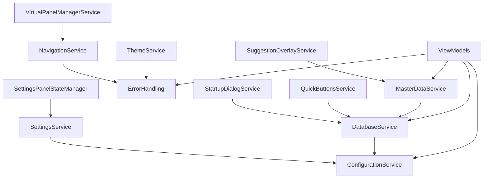

# MTM WIP Application - Project Folders Structure Blueprint

**Generated**: September 4, 2025  
**Framework**: .NET 8 Avalonia UI with MVVM Community Toolkit  
**Architecture**: Service-Oriented MVVM with Manufacturing Domain Focus  

---

## 🏗️ Complete Folder Structure Analysis

```
MTM_WIP_Application_Avalonia/                     # Solution Root
├── 📁 .github/                                   # GitHub Configuration & Instructions
│   ├── 📁 instructions/                          # GitHub Copilot Instruction Files
│   │   ├── 📄 README.md                          # Instructions overview
│   │   ├── 📄 dotnet-architecture-good-practices.instructions.md
│   │   ├── 📄 avalonia-ui-guidelines.instructions.md
│   │   ├── 📄 mysql-database-patterns.instructions.md
│   │   ├── 📄 mvvm-community-toolkit.instructions.md
│   │   ├── 📄 service-architecture.instructions.md
│   │   └── 📄 data-models.instructions.md
│   ├── 📁 ISSUE_TEMPLATE/                         # GitHub Issue Templates
│   │   ├── 📄 epic.yml                          # Epic issue template
│   │   ├── 📄 feature_request.yml               # Feature request template
│   │   ├── 📄 user_story.yml                    # User story template
│   │   └── 📄 technical_enabler.yml             # Technical enabler template
│   ├── 📄 copilot-instructions.md                # Main Copilot instructions
│   └── 📄 MTM-Awesome-Copilot-Implementation-Roadmap.md
│
├── 📁 Behaviors/                                  # Avalonia Behaviors (4 files)
│   ├── 📄 AutoCompleteBoxNavigationBehavior.cs   # Keyboard navigation for auto-complete
│   ├── 📄 ComboBoxBehavior.cs                    # Enhanced ComboBox functionality
│   └── 📄 TextBoxFuzzyValidationBehavior.cs      # Fuzzy text validation
│
├── 📁 bin/Debug/net8.0/                         # Build Output (Generated)
│   └── [Build artifacts and dependencies]
│
├── 📁 Config/                                    # Configuration Files
│   └── 📄 appsettings.json                      # Application configuration
│
├── 📁 Controls/                                  # Custom UI Controls (2 files)
│   ├── 📄 CollapsiblePanel.axaml                # Collapsible panel AXAML
│   └── 📄 CollapsiblePanel.axaml.cs             # Collapsible panel code-behind
│
├── 📁 Converters/                                # Data Binding Converters (1 file)
│   └── 📄 NullToBoolConverter.cs                 # Null to boolean converter
│
├── 📁 Core/Startup/                              # Application Startup Infrastructure (4 files)
│   ├── 📄 ApplicationHealthService.cs            # Health monitoring service
│   ├── 📄 ApplicationStartup.cs                 # Main startup coordination
│   ├── 📄 StartupTest.cs                        # Startup validation tests
│   └── 📄 StartupValidationService.cs           # Startup validation logic
│
├── 📁 docs/ways-of-work/plan/mtm-inventory-management/  # Epic Documentation
│   ├── 📄 epic.md                               # Epic PRD - MTM Inventory Management
│   ├── 📁 quick-actions-panel/
│   │   └── 📄 prd.md                            # Feature PRD - Quick Actions Panel
│   ├── 📁 inventory-transaction-management/
│   │   └── 📄 prd.md                            # Feature PRD - Inventory Transactions
│   ├── 📁 master-data-management/
│   │   └── 📄 prd.md                            # Feature PRD - Master Data Management
│   ├── 📁 settings-system-administration/
│   │   └── 📄 prd.md                            # Feature PRD - Settings & Admin
│   ├── 📁 ui-theme-design-system/
│   │   └── 📄 prd.md                            # Feature PRD - UI Theme System
│   ├── 📄 architecture-specification.md          # Epic Architecture Specification
│   └── 📄 viewmodels-technical-breakdown.md      # ViewModels Technical Breakdown
│
├── 📁 Documentation/Development/                  # Development Documentation
│   ├── 📄 appsettings.Development.json          # Development settings
│   ├── 📄 appsettings.Development.json.backup_* # Setting backups
│   ├── 📁 Database_Files/                        # Database scripts and documentation
│   ├── 📁 UI_Documentation/                      # UI design documentation
│   └── 📁 UI_Screenshots/                        # Application screenshots
│
├── 📁 Extensions/                                # Extension Methods (1 file)
│   └── 📄 ServiceCollectionExtensions.cs        # Dependency injection setup
│
├── 📁 Models/                                    # Data Models (10 files)
│   ├── 📄 EventArgs.cs                          # Base event argument classes
│   ├── 📄 InventoryEventArgs.cs                 # Inventory-specific events
│   ├── 📄 InventorySavedEventArgs.cs            # Inventory save events
│   ├── 📄 Model_AppVariables.cs                 # Application variables
│   ├── 📄 QuickActionExecutedEventArgs.cs       # Quick action events
│   ├── 📄 SessionTransaction.cs                 # Session transaction tracking
│   ├── 📄 ViewModels.cs                         # ViewModel support models
│   └── 📁 Shared/                               # Shared model components
│       ├── 📄 CoreModels.cs                     # Core business models
│       ├── 📄 Result.cs                         # Result pattern implementation
│       └── 📄 ResultPattern.cs                  # Result pattern extensions
│
├── 📁 obj/Debug/net8.0/                         # Object Files (Generated)
│   └── [Intermediate build files]
│
├── 📁 Resources/Themes/                          # UI Theme Resources (18+ files)
│   ├── 📄 MTM_Blue.axaml                        # MTM Blue theme
│   ├── 📄 MTM_Blue_Dark.axaml                   # MTM Blue dark variant
│   ├── 📄 MTM_Green.axaml                       # MTM Green theme
│   ├── 📄 MTM_Green_Dark.axaml                  # MTM Green dark variant
│   ├── 📄 MTM_Red.axaml                         # MTM Red theme
│   ├── 📄 MTM_Red_Dark.axaml                    # MTM Red dark variant
│   ├── 📄 MTM_Amber.axaml                       # MTM Amber theme
│   ├── 📄 MTM_Amber_Dark.axaml                  # MTM Amber dark variant
│   ├── 📄 MTM_Purple.axaml                      # MTM Purple theme
│   ├── 📄 MTM_Purple_Dark.axaml                 # MTM Purple dark variant
│   ├── 📄 MTM_Orange.axaml                      # MTM Orange theme
│   ├── 📄 MTM_Orange_Dark.axaml                 # MTM Orange dark variant
│   ├── 📄 MTM_Cyan.axaml                        # MTM Cyan theme
│   ├── 📄 MTM_Cyan_Dark.axaml                   # MTM Cyan dark variant
│   ├── 📄 MTM_Lime.axaml                        # MTM Lime theme
│   ├── 📄 MTM_Lime_Dark.axaml                   # MTM Lime dark variant
│   ├── 📄 MTM_Pink.axaml                        # MTM Pink theme
│   ├── 📄 MTM_Pink_Dark.axaml                   # MTM Pink dark variant
│   └── 📄 MTM_Dark.axaml                        # MTM Dark mode theme
│
├── 📁 Services/                                  # Service Layer (12 files)
│   ├── 📄 Configuration.cs                      # Configuration & application state services
│   ├── 📄 Database.cs                           # Database service & connection factory
│   ├── 📄 ErrorHandling.cs                      # Centralized error handling
│   ├── 📄 MasterDataService.cs                  # Master data management
│   ├── 📄 Navigation.cs                         # Navigation service
│   ├── 📄 QuickButtons.cs                       # Quick buttons management
│   ├── 📄 SettingsPanelStateManager.cs         # Settings panel state
│   ├── 📄 SettingsService.cs                    # Settings persistence
│   ├── 📄 StartupDialog.cs                      # Startup dialog service
│   ├── 📄 SuggestionOverlay.cs                  # Auto-complete suggestions
│   ├── 📄 ThemeService.cs                       # Dynamic theme switching
│   └── 📄 VirtualPanelManager.cs               # Virtual panel management
│
├── 📁 ViewModels/                               # MVVM ViewModels (42+ files)
│   ├── 📁 MainForm/                             # Main form ViewModels (23 files)
│   │   ├── 📄 MainWindowViewModel.cs            # Main window coordination
│   │   ├── 📄 QuickButtonsViewModel.cs          # Quick buttons management
│   │   ├── 📄 InventoryViewModel.cs             # Main inventory ViewModel
│   │   ├── 📄 InventoryTabViewModel.cs          # Inventory tab ViewModel
│   │   ├── 📄 AddItemViewModel.cs               # Add item ViewModel
│   │   ├── 📄 RemoveItemViewModel.cs            # Remove item ViewModel
│   │   ├── 📄 TransferItemViewModel.cs          # Transfer item ViewModel
│   │   ├── 📄 AdvancedInventoryViewModel.cs     # Advanced inventory features
│   │   ├── 📄 AdvancedRemoveViewModel.cs        # Advanced remove features
│   │   ├── 📄 SearchInventoryViewModel.cs       # Inventory search
│   │   ├── 📄 BaseViewModel.cs                  # Base ViewModel class
│   │   └── [Additional MainForm ViewModels...]
│   │
│   ├── 📁 Overlay/                              # Overlay ViewModels (2 files)
│   │   ├── 📄 SuggestionOverlayViewModel.cs     # Auto-complete overlay
│   │   └── 📄 SuggestionOverlayViewModel_duplicate.cs # Duplicate file
│   │
│   ├── 📁 SettingsForm/                         # Settings ViewModels (15+ files)
│   │   ├── 📄 SettingsFormViewModel.cs          # Main settings ViewModel
│   │   ├── 📄 AddPartIDViewModel.cs             # Add part ID ViewModel
│   │   ├── 📄 EditPartIDViewModel.cs            # Edit part ID ViewModel
│   │   ├── 📄 RemovePartIDViewModel.cs          # Remove part ID ViewModel
│   │   ├── 📄 AddUserViewModel.cs               # Add user ViewModel
│   │   ├── 📄 EditUserViewModel.cs              # Edit user ViewModel
│   │   ├── 📄 RemoveUserViewModel.cs            # Remove user ViewModel
│   │   ├── 📄 AddOperationViewModel.cs          # Add operation ViewModel
│   │   ├── 📄 EditOperationViewModel.cs         # Edit operation ViewModel
│   │   ├── 📄 RemoveOperationViewModel.cs       # Remove operation ViewModel
│   │   ├── 📄 AddLocationViewModel.cs           # Add location ViewModel
│   │   ├── 📄 EditLocationViewModel.cs          # Edit location ViewModel
│   │   ├── 📄 RemoveLocationViewModel.cs        # Remove location ViewModel
│   │   ├── 📄 DatabaseSettingsViewModel.cs      # Database settings
│   │   ├── 📄 ThemeBuilderViewModel.cs          # Theme builder
│   │   └── [Additional Settings ViewModels...]
│   │
│   ├── 📁 Shared/                               # Shared ViewModels (1 file)
│   │   └── 📄 BaseViewModel.cs                  # Shared base ViewModel
│   │
│   └── 📁 TransactionsForm/                     # Transaction ViewModels (2 files)
│       ├── 📄 TransactionHistoryViewModel.cs    # Transaction history
│       └── 📄 TransactionHistoryViewModel_fixed.cs # Fixed version
│
├── 📁 Views/                                    # AXAML Views (32+ files)
│   ├── 📁 MainForm/                             # Main form Views (7 files)
│   │   ├── 📄 MainView.axaml                    # Main application view
│   │   ├── 📄 MainView.axaml.cs                 # Main view code-behind
│   │   ├── 📄 QuickButtonsView.axaml            # Quick buttons view
│   │   ├── 📄 QuickButtonsView.axaml.cs         # Quick buttons code-behind
│   │   ├── 📄 InventoryTabView.axaml            # Inventory tab view
│   │   ├── 📄 InventoryTabView.axaml.cs         # Inventory tab code-behind
│   │   ├── 📄 RemoveTabView.axaml               # Remove tab view
│   │   ├── 📄 RemoveTabView.axaml.cs            # Remove tab code-behind
│   │   ├── 📄 TransferTabView.axaml             # Transfer tab view
│   │   ├── 📄 TransferTabView.axaml.cs          # Transfer tab code-behind
│   │   ├── 📄 AdvancedInventoryView.axaml       # Advanced inventory view
│   │   ├── 📄 AdvancedInventoryView.axaml.cs    # Advanced inventory code-behind
│   │   ├── 📄 AdvancedRemoveView.axaml          # Advanced remove view
│   │   └── 📄 AdvancedRemoveView.axaml.cs       # Advanced remove code-behind
│   │
│   └── 📁 SettingsForm/                         # Settings Views (18+ files)
│       ├── 📄 SettingsForm.axaml                # Main settings form
│       ├── 📄 SettingsForm.axaml.cs             # Settings form code-behind
│       ├── 📄 AddPartIDView.axaml               # Add part ID view
│       ├── 📄 AddPartIDView.axaml.cs            # Add part ID code-behind
│       ├── 📄 EditPartIDView.axaml              # Edit part ID view
│       ├── 📄 EditPartIDView.axaml.cs           # Edit part ID code-behind
│       ├── 📄 RemovePartIDView.axaml            # Remove part ID view
│       ├── 📄 RemovePartIDView.axaml.cs         # Remove part ID code-behind
│       ├── 📄 AddUserView.axaml                 # Add user view
│       ├── 📄 AddUserView.axaml.cs              # Add user code-behind
│       ├── 📄 EditUserView.axaml                # Edit user view
│       ├── 📄 EditUserView.axaml.cs             # Edit user code-behind
│       ├── 📄 DatabaseSettingsView.axaml        # Database settings view
│       ├── 📄 DatabaseSettingsView.axaml.cs     # Database settings code-behind
│       ├── 📄 BackupRecoveryView.axaml          # Backup recovery view
│       ├── 📄 BackupRecoveryView.axaml.cs       # Backup recovery code-behind
│       ├── 📄 SystemHealthView.axaml            # System health view
│       ├── 📄 SystemHealthView.axaml.cs         # System health code-behind
│       ├── 📄 ThemeBuilderView.axaml            # Theme builder view
│       ├── 📄 ThemeBuilderView.axaml.cs         # Theme builder code-behind
│       ├── 📄 ShortcutsView.axaml               # Shortcuts view
│       ├── 📄 ShortcutsView.axaml.cs            # Shortcuts code-behind
│       ├── 📄 SecurityPermissionsView.axaml     # Security permissions view
│       ├── 📄 SecurityPermissionsView.axaml.cs  # Security permissions code-behind
│       ├── 📄 AboutView.axaml                   # About view
│       └── 📄 AboutView.axaml.cs                # About code-behind
│
├── 📄 App.axaml                                 # Application AXAML resources
├── 📄 App.axaml.cs                              # Application startup code
├── 📄 app.manifest                              # Application manifest
├── 📄 appsettings.json                          # Application settings
├── 📄 appsettings.Development.json              # Development settings
├── 📄 issue.md                                  # Project issue documentation
├── 📄 LICENSE.txt                               # License file
├── 📄 MainWindow.axaml                          # Main window AXAML
├── 📄 MainWindow.axaml.cs                       # Main window code-behind
├── 📄 MTM_WIP_Application_Avalonia.csproj       # Project file
├── 📄 MTM_WIP_Application_Avalonia.sln          # Solution file
├── 📄 MVVM-Migration-Progress-Report.md         # MVVM migration report
├── 📄 Program.cs                                # Application entry point
├── 📄 REPOSITORY_SUMMARY.md                     # Repository summary
└── 📄 THE_STORY_OF_THIS_REPO.md                # Repository history
```

---

## 📊 Folder Statistics Summary

| **Category** | **Folders** | **Files** | **Purpose** |
|--------------|-------------|-----------|-------------|
| **GitHub Configuration** | 2 | 12 | GitHub templates and Copilot instructions |
| **Application Core** | 3 | 8 | Startup, behaviors, converters |
| **Views (UI Layer)** | 3 | 32+ | AXAML user interface components |
| **ViewModels (Logic Layer)** | 5 | 42+ | MVVM business logic and data binding |
| **Services (Data Layer)** | 1 | 12 | Business services and data access |
| **Models (Data Structures)** | 2 | 10 | Data models and event arguments |
| **Resources & Themes** | 1 | 18+ | UI themes and styling |
| **Documentation** | 4 | 15+ | Technical documentation and PRDs |
| **Configuration** | 3 | 8 | Application and development settings |
| **Build Artifacts** | 2 | Generated | Build output and intermediate files |
| **Project Files** | - | 8 | Solution, project, and metadata files |
| **TOTAL** | **26** | **165+** | Complete application structure |

---

## 🏗️ Architecture Pattern Analysis

### **MVVM Community Toolkit Structure**
```
ViewModels/ (42+ files) → Views/ (32+ files)
     ↓                         ↓
Services/ (12 files) ← Models/ (10 files)
     ↓
Database (MySQL via Stored Procedures)
```

### **Service Layer Organization**
- **Core Services**: Configuration, Database, ErrorHandling
- **Business Services**: MasterDataService, QuickButtons
- **UI Services**: ThemeService, Navigation, SuggestionOverlay
- **State Services**: SettingsService, SettingsPanelStateManager

### **View Architecture Pattern**
- **MainForm Views**: Primary user interface (7 views)
- **SettingsForm Views**: Administrative interface (18+ views) 
- **Custom Controls**: Reusable UI components (2 controls)
- **Theme System**: 18+ theme variations with real-time switching

---

## 🎯 Domain-Driven Design Structure

### **Manufacturing Domain Boundaries**

**1. Inventory Management Context**
```
├── Models/InventoryItem, TransactionRecord
├── ViewModels/MainForm/Inventory*, Add*, Remove*, Transfer*
├── Views/MainForm/InventoryTab*, RemoveTab*, TransferTab*
└── Services/MasterDataService (Parts, Operations, Locations)
```

**2. Quick Actions Context**
```
├── Models/QuickActionModel, QuickActionExecutedEventArgs
├── ViewModels/MainForm/QuickButtonsViewModel
├── Views/MainForm/QuickButtonsView
└── Services/QuickButtons
```

**3. Settings & Administration Context**
```
├── Models/ApplicationSettings, UserInfo
├── ViewModels/SettingsForm/* (15+ ViewModels)
├── Views/SettingsForm/* (18+ Views)
└── Services/SettingsService, SettingsPanelStateManager
```

**4. System Infrastructure Context**
```
├── Models/SessionTransaction, AppVariables
├── Core/Startup/* (4 startup services)
├── Services/ErrorHandling, Navigation, ThemeService
└── Extensions/ServiceCollectionExtensions
```

---

## 🔧 Dependency Flow Analysis

### **Service Dependency Chain**


### **Data Flow Pattern**
```
User Input (Views) 
    ↓ 
MVVM Binding (ViewModels)
    ↓
Business Logic (Services)
    ↓
Data Access (Database Service)
    ↓
Stored Procedures (MySQL)
    ↓
Result Pattern (Models)
    ↓
UI Updates (Property Changes)
```

---

## 🚀 Startup Sequence Architecture

### **Application Initialization Flow**
1. **Program.cs** → Creates host and configures services
2. **App.axaml.cs** → Initializes Avalonia application
3. **ServiceCollectionExtensions** → Registers all services and ViewModels
4. **ApplicationStartup** → Coordinates startup sequence
5. **ApplicationHealthService** → Validates system health
6. **StartupValidationService** → Validates configuration
7. **MainWindow** → Creates main UI window
8. **MainWindowViewModel** → Initializes main application logic

### **Service Registration Pattern**
```csharp
services.AddMTMServices(configuration):
├── Singleton Services (ThemeService, NavigationService, SettingsService)
├── Scoped Services (DatabaseService, MasterDataService, ApplicationStateService)  
├── Transient Services (All ViewModels, StartupDialogService)
└── Infrastructure (MemoryCache, IConfiguration, Logging)
```

---

## 📋 File Naming Conventions Analysis

### **AXAML View Pattern**
- **Format**: `{Purpose}View.axaml` + `{Purpose}View.axaml.cs`
- **Examples**: `InventoryTabView`, `QuickButtonsView`, `SettingsForm`
- **Location**: Organized by functional area (`MainForm/`, `SettingsForm/`)

### **ViewModel Pattern**
- **Format**: `{Purpose}ViewModel.cs`
- **Examples**: `InventoryTabViewModel`, `QuickButtonsViewModel`
- **Location**: Mirrors View folder structure

### **Service Pattern**
- **Format**: Descriptive service name (not interface-based naming)
- **Examples**: `Configuration.cs`, `ErrorHandling.cs`, `MasterDataService.cs`
- **Location**: Single `Services/` folder with category-based consolidation

### **Model Pattern**
- **Format**: Domain entity or purpose-based naming
- **Examples**: `CoreModels.cs`, `EventArgs.cs`, `SessionTransaction.cs`
- **Location**: `Models/` with `Shared/` subfolder for common types

---

## 🎨 Theme and Resource Organization

### **Theme File Structure**
```
Resources/Themes/
├── MTM_{Color}.axaml        # Light variants
├── MTM_{Color}_Dark.axaml   # Dark variants  
└── MTM_Dark.axaml          # Global dark mode
```

### **Color Palette Coverage**
- **Primary**: Blue (default Windows 11 blue #0078D4)
- **Variants**: Green, Red, Amber, Purple, Orange, Cyan, Lime, Pink
- **Modes**: Light and Dark variants for each color
- **Total**: 18+ theme files with consistent resource naming

---

## 🔍 Quality and Maintenance Indicators

### **Code Organization Quality**
- ✅ **Clear Separation of Concerns**: MVVM pattern properly implemented
- ✅ **Domain-Driven Structure**: Manufacturing business logic clearly separated
- ✅ **Consistent Naming**: Follows .NET conventions throughout
- ✅ **Service Layer**: Well-defined business service boundaries
- ✅ **Dependency Injection**: Proper DI container setup

### **Potential Improvement Areas**
- 🔄 **Duplicate Files**: `SuggestionOverlayViewModel_duplicate.cs`, `TransactionHistoryViewModel_fixed.cs`
- 🔄 **Generated Files**: Build artifacts should be in `.gitignore`
- 🔄 **Documentation**: Some folders could use README.md files for clarity

### **Testing Structure** (Missing - Opportunity)
```
├── 📁 Tests/ (Recommended)
│   ├── 📁 UnitTests/
│   │   ├── 📁 ViewModels.Tests/
│   │   ├── 📁 Services.Tests/
│   │   └── 📁 Models.Tests/
│   └── 📁 IntegrationTests/
│       ├── 📁 Database.Tests/
│       └── 📁 UI.Tests/
```

---

## 📈 Growth and Scalability Assessment

### **Current Scale**
- **Total Files**: 165+ source files
- **Lines of Code**: Estimated 25,000+ lines
- **Complexity**: Medium-High (Manufacturing domain with full MVVM)
- **Team Size**: Suitable for 2-5 developers

### **Scalability Indicators**
- ✅ **Modular Architecture**: Easy to add new features
- ✅ **Service-Oriented**: New services can be added without breaking changes
- ✅ **Theme System**: Easily extensible theme framework
- ✅ **MVVM Pattern**: UI changes don't impact business logic
- ⚠️ **Database Layer**: Stored procedures may limit rapid schema changes

### **Future Growth Recommendations**
1. **Add Unit Testing Structure** for better maintainability
2. **Implement CI/CD Pipeline** for automated builds and deployments
3. **Create API Layer** if external integrations are needed
4. **Add Performance Monitoring** for production environments

---

**Document Status**: ✅ Complete Project Structure Blueprint  
**Total Folders Analyzed**: 26  
**Total Files Documented**: 165+  
**Last Updated**: September 4, 2025  
**Blueprint Owner**: MTM Development Team