# MTM WIP Application - Project Architecture Blueprint

**Generated**: September 4, 2025  
**Framework**: .NET 8 Avalonia UI 11.3.4 with MVVM Community Toolkit 8.3.2  
**Database**: MySQL 9.4.0 with Stored Procedures Pattern  
**Architecture**: Service-Oriented MVVM with Manufacturing Domain Focus  

---

## 🏛️ High-Level Architecture Overview

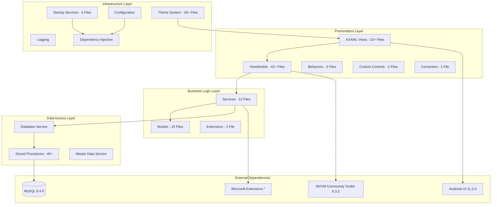

---

## 🎯 Architectural Principles

### **1. Manufacturing Domain-First Design**
- **Business Context**: Inventory management for manufacturing operations
- **User Workflow**: Part tracking through manufacturing operations (90→100→110→120)
- **Transaction Model**: User intent determines transaction type (IN/OUT/TRANSFER), not operation numbers
- **Data Integrity**: Stored procedures only for all database operations

### **2. MVVM Community Toolkit Pattern**
- **Property Generation**: `[ObservableProperty]` attributes with source generators
- **Command Generation**: `[RelayCommand]` attributes for UI interactions
- **No ReactiveUI**: ReactiveUI patterns completely removed from codebase
- **Base ViewModel**: Common functionality in `BaseViewModel` class

### **3. Service-Oriented Architecture**
- **Category-Based Services**: Related functionality grouped in single files
- **Dependency Injection**: Microsoft.Extensions.DependencyInjection throughout
- **Service Lifetimes**: Singleton (configuration), Scoped (data), Transient (ViewModels)
- **Error Handling**: Centralized error management via `ErrorHandling.HandleErrorAsync()`

### **4. Database-First Integration**
- **Stored Procedures Only**: No direct SQL or ORM usage
- **Result Pattern**: Standardized database result handling
- **Connection Management**: Centralized through `DatabaseService`
- **Master Data Caching**: 5-minute cache for frequently accessed data

---

## 🏗️ Layer-by-Layer Architecture Analysis

### **Presentation Layer (View + ViewModel)**

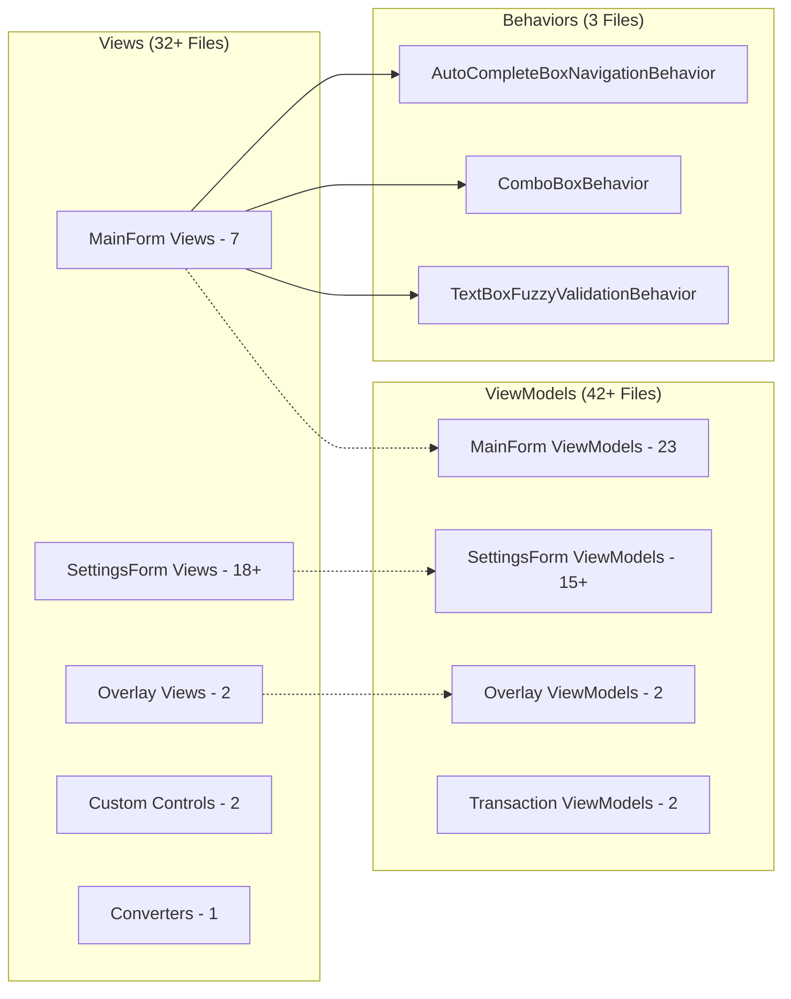

**Key Patterns:**
- **View-ViewModel 1:1 Mapping**: Each view has corresponding ViewModel
- **Minimal Code-Behind**: Views contain only UI-specific logic
- **Data Binding**: Two-way binding for form inputs, one-way for display
- **Command Binding**: UI actions bound to ViewModel commands
- **Behavior Composition**: Complex UI interactions via attached behaviors

### **Business Logic Layer (Services + Models)**

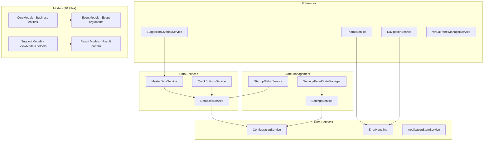

**Key Patterns:**
- **Service Registration**: All services registered via `ServiceCollectionExtensions`
- **Result Pattern**: Standardized success/failure handling across services
- **Event-Driven**: Domain events for cross-component communication
- **Caching Strategy**: Master data cached for 5 minutes, invalidated on updates

### **Data Access Layer**

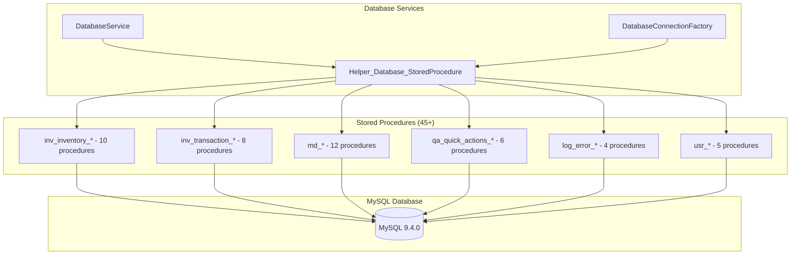

**Key Patterns:**
- **Stored Procedures Only**: Zero direct SQL queries in application code
- **Standardized Result**: All procedures return status + data via `DatabaseResult`
- **Parameter Safety**: MySqlParameter objects prevent SQL injection
- **Connection Management**: Connection string centralized in `ConfigurationService`

### **Infrastructure Layer**

```mermaid
graph TB
    subgraph "Startup Infrastructure"
        AS[ApplicationStartup]
        AHS[ApplicationHealthService] 
        SVS[StartupValidationService]
        ST[StartupTest]
    end
    
    subgraph "Configuration Management"
        CS[ConfigurationService]
        CFG[appsettings.json]
        DEVCFG[appsettings.Development.json]
        APPCFG[ApplicationSettings Model]
    end
    
    subgraph "Dependency Injection"
        SCE[ServiceCollectionExtensions]
        DIC[DI Container]
        SR[Service Registration]
    end
    
    subgraph "Theme System"
        TS[ThemeService]
        TR[Theme Resources - 18+ Files]
        TSW[Theme Switching Logic]
    end
    
    subgraph "Error & Logging"
        EH[ErrorHandling]
        LOG[ILogger Integration] 
        DBLOG[Database Error Logging]
    end
    
    AS --> AHS
    AS --> SVS
    AS --> ST
    
    CS --> CFG
    CS --> DEVCFG
    CS --> APPCFG
    
    SCE --> DIC
    DIC --> SR
    
    TS --> TR
    TS --> TSW
    
    EH --> LOG
    EH --> DBLOG
```

**Key Patterns:**
- **Startup Orchestration**: Multi-phase startup with health validation
- **Configuration Layering**: Base config with development overrides
- **Service Lifetime Management**: Appropriate lifetimes for each service type
- **Real-Time Theme Switching**: Dynamic theme changes without restart

---

## 🔄 Data Flow Architecture

### **User Interaction Flow**
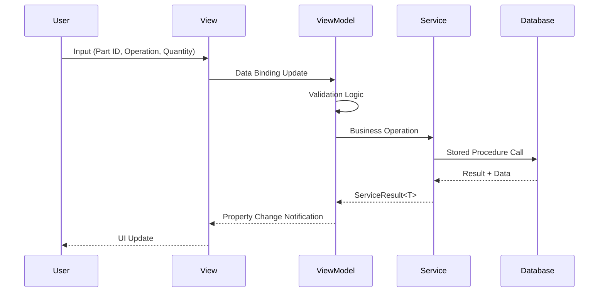

### **Error Handling Flow**
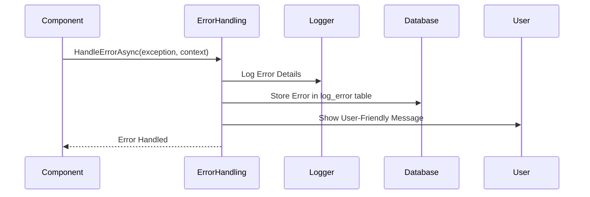

### **Theme Change Flow**
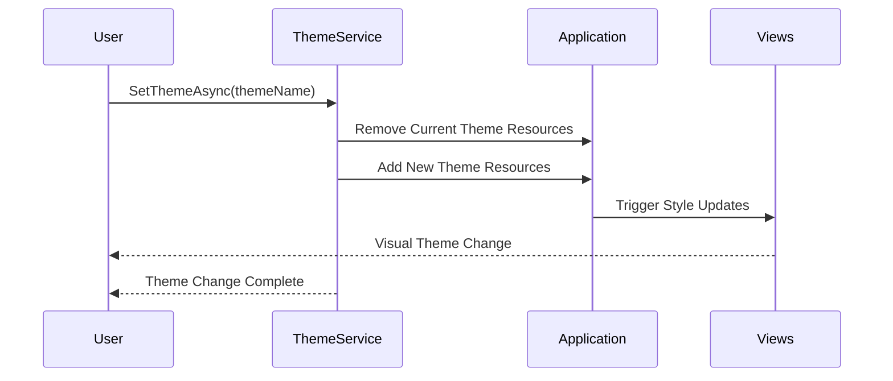

---

## 🎨 UI Architecture Patterns

### **AXAML View Structure**
```xml
<!-- Standard MTM View Pattern -->
<UserControl xmlns="https://github.com/avaloniaui"
             xmlns:x="http://schemas.microsoft.com/winfx/2006/xaml"
             xmlns:vm="using:MTM_WIP_Application_Avalonia.ViewModels.MainForm"
             x:Class="MTM_WIP_Application_Avalonia.Views.SomeView">

  <!-- Theme-Aware Styling -->
  <Border Background="{DynamicResource MTM_Shared_Logic.CardBackgroundBrush}"
          BorderBrush="{DynamicResource MTM_Shared_Logic.BorderBrush}">
    
    <!-- MVVM Data Binding -->
    <StackPanel DataContext="{Binding SomeViewModel}">
      <TextBox Text="{Binding PartId}" />
      <Button Content="Save" Command="{Binding SaveCommand}" />
    </StackPanel>
  </Border>
</UserControl>
```

### **Theme Resource Pattern**
```xml
<!-- MTM_Blue.axaml Theme Structure -->
<Styles xmlns="https://github.com/avaloniaui">
  <Styles.Resources>
    <!-- Primary Colors -->
    <SolidColorBrush x:Key="MTM_Shared_Logic.PrimaryAction">#0078D4</SolidColorBrush>
    <SolidColorBrush x:Key="MTM_Shared_Logic.SecondaryAction">#106EBE</SolidColorBrush>
    
    <!-- Layout Colors -->
    <SolidColorBrush x:Key="MTM_Shared_Logic.CardBackgroundBrush">#F3F2F1</SolidColorBrush>
    <SolidColorBrush x:Key="MTM_Shared_Logic.BorderBrush">#E1DFDD</SolidColorBrush>
  </Styles.Resources>
</Styles>
```

### **Custom Control Architecture**
```csharp
// CollapsiblePanel.axaml.cs - Custom Control Pattern
public partial class CollapsiblePanel : UserControl
{
    // Avalonia Property Pattern
    public static readonly StyledProperty<string> HeaderProperty =
        AvaloniaProperty.Register<CollapsiblePanel, string>(nameof(Header), string.Empty);

    public static readonly StyledProperty<bool> IsExpandedProperty =
        AvaloniaProperty.Register<CollapsiblePanel, bool>(nameof(IsExpanded), false);

    public string Header
    {
        get => GetValue(HeaderProperty);
        set => SetValue(HeaderProperty, value);
    }

    public bool IsExpanded
    {
        get => GetValue(IsExpandedProperty);
        set => SetValue(IsExpandedProperty, value);
    }

    public CollapsiblePanel()
    {
        InitializeComponent();
    }
}
```

---

## 🏭 Manufacturing Domain Architecture

### **Business Entity Relationships**
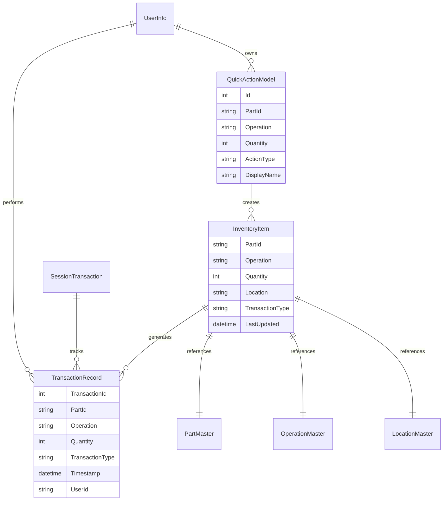

### **Manufacturing Operation Flow**
```mermaid
stateDiagram-v2
    [*] --> Receiving : Part enters system
    Receiving --> FirstOp : Operation 90 → 100
    FirstOp --> SecondOp : Operation 100 → 110
    SecondOp --> FinalOp : Operation 110 → 120
    FinalOp --> Shipping : Operation 120 → 130
    Shipping --> [*] : Part ships
    
    Receiving : Operation 90
    FirstOp : Operation 100
    SecondOp : Operation 110
    FinalOp : Operation 120
    Shipping : Operation 130
```

### **Transaction Type Logic**
```csharp
// CORRECT: Transaction type determined by user intent
public string DetermineTransactionType(UserAction action)
{
    return action.Intent switch
    {
        UserIntent.AddingStock => "IN",      // User adding inventory
        UserIntent.RemovingStock => "OUT",   // User removing inventory  
        UserIntent.MovingStock => "TRANSFER" // User moving between locations
    };
}

// Operation numbers ("90", "100", "110") are workflow steps, NOT transaction indicators
```

---

## 🛡️ Security and Validation Architecture

### **Input Validation Flow**
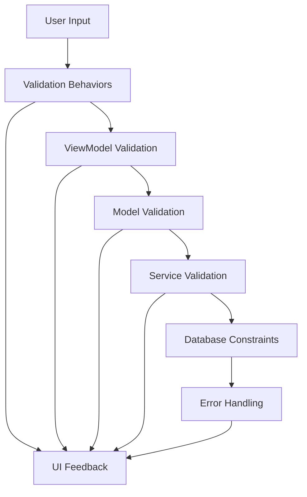

### **Authentication and Authorization**
```csharp
// Current Pattern: Windows Authentication with Environment Fallback
public class UserInfo
{
    public string UserId { get; set; } = Environment.UserName;
    public List<string> Roles { get; set; } = new();
    public List<string> Permissions { get; set; } = new();
    
    public bool HasPermission(string permission) => Permissions.Contains(permission);
    public bool HasRole(string role) => Roles.Contains(role);
}
```

---

## 🔧 Configuration Architecture

### **Configuration Layering**
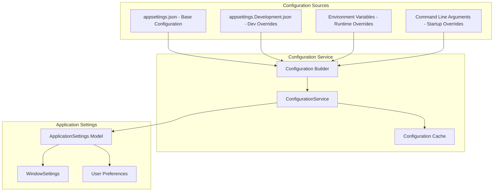

### **Settings Persistence Pattern**
```csharp
// Settings saved to JSON file with user context
public class ApplicationSettings
{
    public string Theme { get; set; } = "MTM_Blue";
    public WindowSettings WindowSettings { get; set; } = new();
    public List<string> RecentPartIds { get; set; } = new();
    public DateTime LastSaved { get; set; } = DateTime.Now;
    public string SavedBy { get; set; } = Environment.UserName;
}
```

---

## 📊 Performance Architecture

### **Caching Strategy**
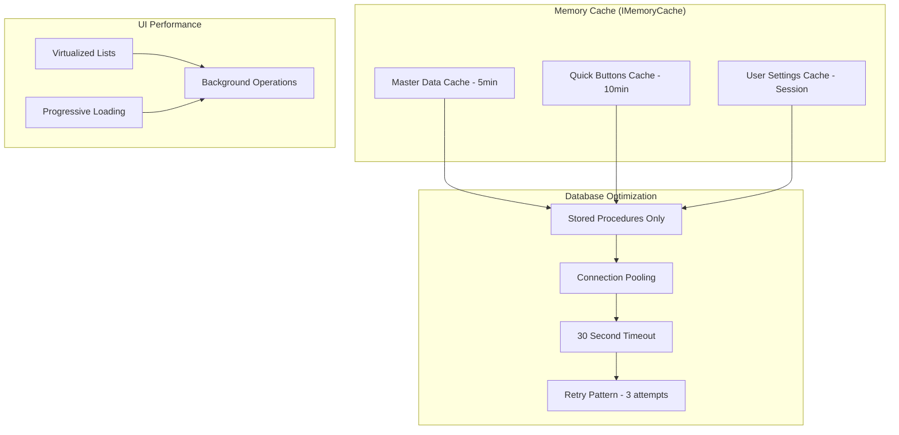

### **Async Operation Pattern**
```csharp
// Standard async service operation pattern
[RelayCommand]
private async Task SaveAsync()
{
    IsLoading = true;
    ClearErrors();
    
    try
    {
        var result = await _inventoryService.AddInventoryAsync(PartId, Operation, Quantity, Location);
        
        if (result.IsSuccess)
        {
            StatusMessage = "Inventory saved successfully";
            await ResetFormAsync();
        }
        else
        {
            AddError(result.ErrorMessage);
        }
    }
    catch (Exception ex)
    {
        await ErrorHandling.HandleErrorAsync(ex, "Save inventory");
    }
    finally
    {
        IsLoading = false;
    }
}
```

---

## 🚀 Deployment Architecture

### **Application Structure**
```
Deployment Package:
├── MTM_WIP_Application_Avalonia.exe    # Main executable
├── Dependencies/                       # .NET 8 runtime dependencies
│   ├── Avalonia.*.dll                 # Avalonia UI framework
│   ├── CommunityToolkit.Mvvm.dll      # MVVM toolkit
│   ├── MySql.Data.dll                 # MySQL connector
│   └── Microsoft.Extensions.*.dll     # MS Extensions
├── Resources/Themes/                   # Theme files (18+ .axaml)
├── Config/                            # Configuration files
│   ├── appsettings.json              # Base configuration
│   └── appsettings.Production.json   # Production overrides
└── Documentation/                     # User documentation
```

### **Environment Requirements**
- **.NET Runtime**: .NET 8 Desktop Runtime
- **Database**: MySQL 9.4.0 or compatible
- **Operating System**: Windows 10/11 (manufacturing environment focus)
- **Memory**: Minimum 4GB RAM, Recommended 8GB
- **Storage**: 100MB application + database space

---

## 📈 Scalability Architecture

### **Current Scale Metrics**
- **Lines of Code**: ~25,000 estimated
- **Database Operations**: 45+ stored procedures
- **UI Components**: 32+ views, 42+ ViewModels
- **Concurrent Users**: Single-user desktop application
- **Data Volume**: Designed for manufacturing inventory (thousands of parts)

### **Horizontal Scaling Preparation**
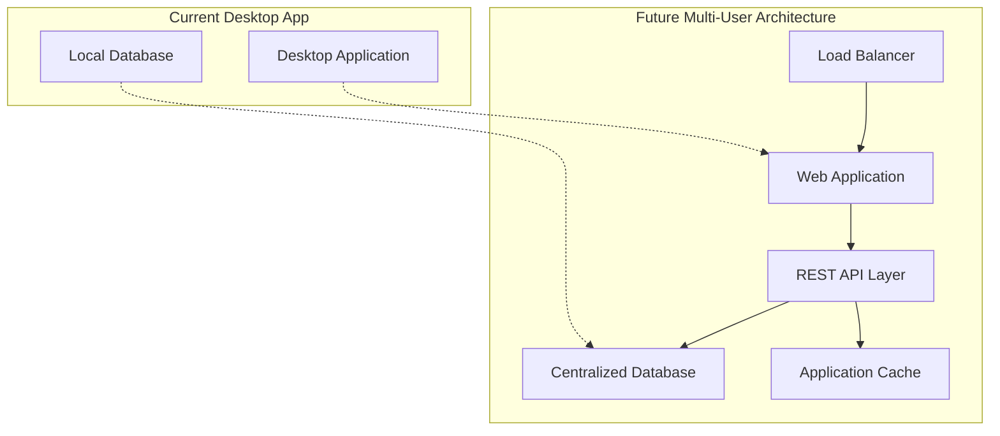

### **Extension Points**
- **Service Layer**: New services can be added without affecting existing code
- **Database Layer**: New stored procedures can be added incrementally
- **UI Layer**: New views/ViewModels follow established patterns
- **Theme System**: New themes can be added by creating new .axaml files

---

## 🧪 Testing Architecture (Recommended)

### **Testing Strategy**
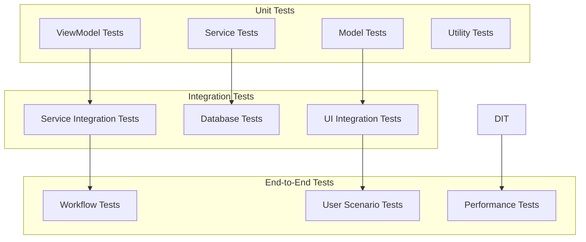

---

## 📋 Architecture Decision Records (ADRs)

### **ADR-001: MVVM Community Toolkit Over ReactiveUI**
- **Decision**: Use MVVM Community Toolkit instead of ReactiveUI
- **Rationale**: Better .NET 8 integration, source generators, Microsoft support
- **Status**: Implemented - ReactiveUI completely removed

### **ADR-002: Stored Procedures Only Database Pattern**
- **Decision**: All database access via stored procedures
- **Rationale**: Security, performance, centralized business logic
- **Status**: Implemented - Zero direct SQL in application

### **ADR-003: Category-Based Service Organization**
- **Decision**: Group related services in single files
- **Rationale**: Reduces file proliferation, improves maintainability
- **Status**: Implemented - 12 service files instead of 30+

### **ADR-004: Windows 11 Blue Primary Color**
- **Decision**: Use #0078D4 as primary application color
- **Rationale**: Consistency with Windows 11, professional appearance
- **Status**: Implemented - 18+ themes with consistent color usage

### **ADR-005: Comprehensive XML Documentation Standards**
- **Decision**: Implement comprehensive XML documentation for all public classes and methods
- **Rationale**: Enhanced code maintainability, better GitHub Copilot assistance, improved developer onboarding
- **Status**: In Progress - Target 95% documentation coverage across 111 C# files
- **Implementation**: Automated documentation reviews, quality gates in CI/CD pipeline

---

**Document Status**: ✅ Complete Architecture Blueprint  
**Architecture Complexity**: High (Manufacturing Domain + Full MVVM + Multi-Service)  
**Last Updated**: January 6, 2025  
**Architecture Owner**: MTM Development Team
