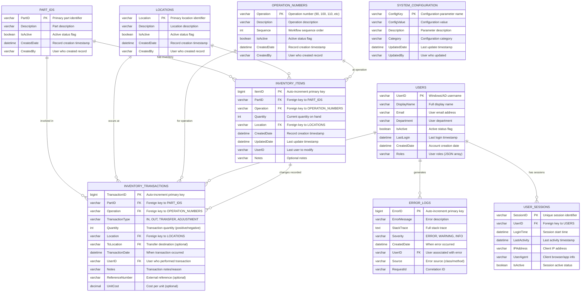

# MTM Database - Entity Relationship Diagram

## 📊 Database Schema Overview

The MTM WIP Application uses a **normalized relational database** design optimized for manufacturing inventory management with complete audit trails.

## 🏗️ Core Entity Relationships



## 🔗 **Relationship Details**

### **One-to-Many Relationships**

#### **PART_IDS → INVENTORY_ITEMS**
- One part can have multiple inventory records (different operations/locations)
- Cascade: Restrict delete if inventory exists
- Index: `idx_inventory_partid` on INVENTORY_ITEMS.PartID

#### **LOCATIONS → INVENTORY_ITEMS**
- One location can store multiple parts/operations
- Cascade: Restrict delete if inventory exists  
- Index: `idx_inventory_location` on INVENTORY_ITEMS.Location

#### **OPERATION_NUMBERS → INVENTORY_ITEMS**
- One operation can apply to multiple parts/locations
- Cascade: Restrict delete if inventory exists
- Index: `idx_inventory_operation` on INVENTORY_ITEMS.Operation

#### **INVENTORY_ITEMS ← INVENTORY_TRANSACTIONS**
- Each transaction references the inventory item affected
- Cascade: Allow delete (maintain audit trail)
- Index: `idx_transactions_itemid` on INVENTORY_TRANSACTIONS.ItemID

### **Composite Relationships**

#### **Part + Operation + Location Uniqueness**
```sql
UNIQUE INDEX idx_inventory_unique 
ON INVENTORY_ITEMS (PartID, Operation, Location)
```
- Ensures only one inventory record per part/operation/location combination
- Critical for maintaining data integrity

#### **Transaction Audit Trail**
```sql
INDEX idx_transactions_audit 
ON INVENTORY_TRANSACTIONS (PartID, Operation, TransactionDate)
```
- Optimizes queries for transaction history by part and operation
- Supports efficient audit reporting

## 📋 **Data Integrity Rules**

### **Business Logic Constraints**

#### **Inventory Quantities**
- `Quantity >= 0` - No negative inventory allowed
- Enforced through stored procedures and application logic

#### **Transaction Types**
- `TransactionType IN ('IN', 'OUT', 'TRANSFER', 'ADJUSTMENT')`
- Enforced through CHECK constraint and stored procedures

#### **Operation Workflow Sequence**
- Operations must follow logical sequence (90 → 100 → 110 → 120)
- Enforced through stored procedure validation

### **Referential Integrity**

#### **Foreign Key Constraints**
```sql
-- Inventory foreign keys
FOREIGN KEY (PartID) REFERENCES PART_IDS(PartID)
FOREIGN KEY (Operation) REFERENCES OPERATION_NUMBERS(Operation)  
FOREIGN KEY (Location) REFERENCES LOCATIONS(Location)

-- Transaction foreign keys
FOREIGN KEY (PartID) REFERENCES PART_IDS(PartID)
FOREIGN KEY (Operation) REFERENCES OPERATION_NUMBERS(Operation)
FOREIGN KEY (Location) REFERENCES LOCATIONS(Location)
FOREIGN KEY (UserID) REFERENCES USERS(UserID)

-- Error logging foreign keys
FOREIGN KEY (UserID) REFERENCES USERS(UserID)
```

### **Audit Trail Requirements**
- All modifications logged in INVENTORY_TRANSACTIONS
- User identification required for all changes
- Timestamp precision to milliseconds
- Immutable transaction records (no updates/deletes)

## 🔍 **Indexing Strategy**

### **Primary Indexes**
```sql
-- Primary keys (clustered indexes)
PRIMARY KEY (ItemID) ON INVENTORY_ITEMS
PRIMARY KEY (TransactionID) ON INVENTORY_TRANSACTIONS  
PRIMARY KEY (PartID) ON PART_IDS
PRIMARY KEY (Location) ON LOCATIONS
PRIMARY KEY (Operation) ON OPERATION_NUMBERS
```

### **Query Optimization Indexes**
```sql
-- Inventory lookup optimization
INDEX idx_inventory_part_operation ON INVENTORY_ITEMS (PartID, Operation)
INDEX idx_inventory_location_active ON INVENTORY_ITEMS (Location, IsActive)

-- Transaction history optimization  
INDEX idx_transactions_date ON INVENTORY_TRANSACTIONS (TransactionDate DESC)
INDEX idx_transactions_user ON INVENTORY_TRANSACTIONS (UserID, TransactionDate)
INDEX idx_transactions_type ON INVENTORY_TRANSACTIONS (TransactionType, TransactionDate)

-- Master data optimization
INDEX idx_parts_active ON PART_IDS (IsActive, PartID)
INDEX idx_locations_active ON LOCATIONS (IsActive, Location)
INDEX idx_operations_sequence ON OPERATION_NUMBERS (Sequence, Operation)
```

## 📊 **Data Volume Estimates**

### **Expected Record Counts** (Production Environment)
| Table | Records | Growth Rate | Retention |
|-------|---------|-------------|-----------|
| PART_IDS | 10,000-50,000 | Low (1-5% annually) | Permanent |
| LOCATIONS | 100-500 | Minimal | Permanent |
| OPERATION_NUMBERS | 10-50 | Minimal | Permanent |
| INVENTORY_ITEMS | 50,000-200,000 | Medium (10-20% annually) | Active records only |
| INVENTORY_TRANSACTIONS | 1M-10M | High (100-500K monthly) | 7 years |
| USERS | 100-1,000 | Low | Permanent |
| ERROR_LOGS | 100K-1M | Medium | 90 days |

### **Storage Considerations**
- **Hot Data**: Current inventory (INVENTORY_ITEMS) - SSD storage
- **Warm Data**: Recent transactions (1 year) - SSD storage  
- **Cold Data**: Historical transactions (2-7 years) - Standard storage
- **Archive Data**: >7 years - Compressed archive storage

## 🔧 **Maintenance Procedures**

### **Regular Maintenance Tasks**
```sql
-- Daily: Update statistics for query optimization
ANALYZE TABLE INVENTORY_ITEMS, INVENTORY_TRANSACTIONS;

-- Weekly: Rebuild indexes for optimal performance
OPTIMIZE TABLE INVENTORY_TRANSACTIONS;

-- Monthly: Archive old transactions
CALL sys_maintenance_Archive_Old_Transactions('2023-01-01');

-- Quarterly: Comprehensive database health check
CALL sys_maintenance_Get_Database_Stats();
```

### **Performance Monitoring**
- Query response time monitoring via slow query log
- Index usage analysis via performance_schema
- Connection pool monitoring
- Deadlock detection and resolution

This ERD documentation provides the complete database structure foundation for the MTM WIP Application, ensuring proper understanding of relationships, constraints, and optimization strategies.
