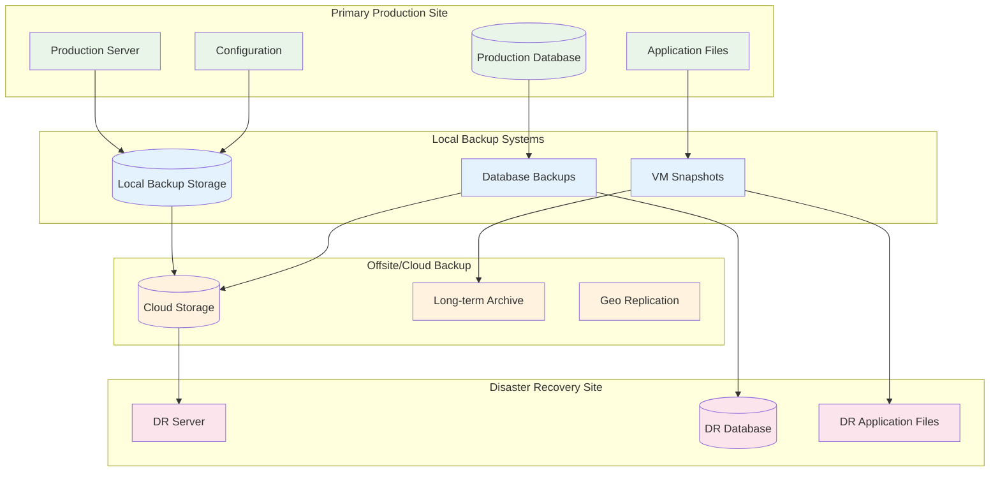

# MTM Backup and Disaster Recovery Procedures

## 📋 Overview

This document outlines comprehensive backup strategies and disaster recovery procedures for the MTM WIP Application, ensuring business continuity and data protection in manufacturing environments where system availability is critical for operational efficiency.

## 🏗️ **Disaster Recovery Architecture**



## 💾 **Backup Strategies**

### **Database Backup Strategy**

#### **Full Database Backup Script**
```powershell
# Full Database Backup Script
# backup-database-full.ps1

param(
    [Parameter(Mandatory=$true)]
    [string]$Environment,
    
    [string]$BackupLocation = "C:\Backups\Database",
    [string]$RetentionDays = 30,
    [switch]$CompressBackup = $true,
    [switch]$VerifyBackup = $true
)

$timestamp = Get-Date -Format "yyyyMMdd_HHmmss"
$backupFileName = "MTM_Database_Full_${Environment}_${timestamp}"

Write-Host "🗄️ Starting full database backup for $Environment environment..."

try {
    # Ensure backup directory exists
    if (-not (Test-Path $BackupLocation)) {
        New-Item -ItemType Directory -Path $BackupLocation -Force
        Write-Host "✅ Created backup directory: $BackupLocation"
    }

    # Get database connection information
    $connectionString = switch ($Environment) {
        "Production" { $env:MTM_PROD_DB_CONNECTION }
        "Staging" { $env:MTM_STAGING_DB_CONNECTION }
        "Development" { $env:MTM_DEV_DB_CONNECTION }
        default { throw "Unknown environment: $Environment" }
    }

    if ([string]::IsNullOrEmpty($connectionString)) {
        throw "Database connection string not found for environment: $Environment"
    }

    # Parse connection string
    $connParams = @{}
    $connectionString.Split(';') | ForEach-Object {
        $pair = $_.Split('=', 2)
        if ($pair.Length -eq 2) {
            $connParams[$pair[0].Trim()] = $pair[1].Trim()
        }
    }

    $server = $connParams['Server']
    $database = $connParams['Database']
    $username = $connParams['Uid']
    $password = $connParams['Pwd']

    # Create mysqldump command
    $dumpFile = Join-Path $BackupLocation "$backupFileName.sql"
    $mysqldumpPath = "C:\Program Files\MySQL\MySQL Server 8.0\bin\mysqldump.exe"

    if (-not (Test-Path $mysqldumpPath)) {
        $mysqldumpPath = "mysqldump" # Try system PATH
    }

    $arguments = @(
        "--host=$server",
        "--user=$username",
        "--password=$password",
        "--single-transaction",
        "--routines",
        "--triggers",
        "--events",
        "--hex-blob",
        "--default-character-set=utf8mb4",
        "--result-file=`"$dumpFile`"",
        $database
    )

    Write-Host "📦 Creating database dump..."
    $process = Start-Process -FilePath $mysqldumpPath -ArgumentList $arguments -Wait -PassThru -NoNewWindow

    if ($process.ExitCode -ne 0) {
        throw "mysqldump failed with exit code: $($process.ExitCode)"
    }

    # Verify backup file was created
    if (-not (Test-Path $dumpFile)) {
        throw "Backup file was not created: $dumpFile"
    }

    $backupSize = (Get-Item $dumpFile).Length / 1MB
    Write-Host "✅ Database dump created: $dumpFile ($($backupSize.ToString('F2')) MB)"

    # Compress backup if requested
    if ($CompressBackup) {
        Write-Host "🗜️ Compressing backup..."
        $zipFile = "$dumpFile.zip"
        Compress-Archive -Path $dumpFile -DestinationPath $zipFile -Force
        Remove-Item $dumpFile -Force
        
        $compressedSize = (Get-Item $zipFile).Length / 1MB
        $compressionRatio = [math]::Round((1 - ($compressedSize / $backupSize)) * 100, 1)
        Write-Host "✅ Backup compressed: $zipFile ($($compressedSize.ToString('F2')) MB, $compressionRatio% compression)"
        $dumpFile = $zipFile
    }

    # Verify backup integrity if requested
    if ($VerifyBackup) {
        Write-Host "🔍 Verifying backup integrity..."
        if ($CompressBackup) {
            # Test ZIP file integrity
            try {
                $null = [System.IO.Compression.ZipFile]::OpenRead($dumpFile)
                Write-Host "✅ Backup file integrity verified"
            } catch {
                throw "Backup file integrity check failed: $($_.Exception.Message)"
            }
        } else {
            # Test SQL file syntax (basic check)
            $content = Get-Content $dumpFile -TotalCount 10
            if ($content -match "-- MySQL dump") {
                Write-Host "✅ Backup file format verified"
            } else {
                throw "Backup file format verification failed"
            }
        }
    }

    # Clean up old backups
    Write-Host "🧹 Cleaning up old backups (older than $RetentionDays days)..."
    $cutoffDate = (Get-Date).AddDays(-$RetentionDays)
    $oldBackups = Get-ChildItem $BackupLocation -Filter "MTM_Database_Full_${Environment}_*" | 
                  Where-Object { $_.CreationTime -lt $cutoffDate }
    
    foreach ($oldBackup in $oldBackups) {
        Remove-Item $oldBackup.FullName -Force
        Write-Host "🗑️ Removed old backup: $($oldBackup.Name)"
    }

    # Log backup completion
    $logEntry = @{
        Timestamp = Get-Date
        Environment = $Environment
        BackupFile = $dumpFile
        BackupSize = if ($CompressBackup) { $compressedSize } else { $backupSize }
        Status = "Success"
    }

    $logFile = Join-Path $BackupLocation "backup-log.json"
    $logEntries = if (Test-Path $logFile) { 
        Get-Content $logFile | ConvertFrom-Json 
    } else { 
        @() 
    }
    $logEntries += $logEntry
    $logEntries | ConvertTo-Json -Depth 2 | Set-Content $logFile

    Write-Host "🎉 Database backup completed successfully!"
    Write-Host "Backup file: $dumpFile"
    Write-Host "Backup size: $($backupSize.ToString('F2')) MB"

    return @{
        Success = $true
        BackupFile = $dumpFile
        BackupSize = $backupSize
    }

} catch {
    Write-Error "❌ Database backup failed: $($_.Exception.Message)"
    
    # Log backup failure
    $logEntry = @{
        Timestamp = Get-Date
        Environment = $Environment
        Status = "Failed"
        Error = $_.Exception.Message
    }

    $logFile = Join-Path $BackupLocation "backup-log.json"
    $logEntries = if (Test-Path $logFile) { 
        Get-Content $logFile | ConvertFrom-Json 
    } else { 
        @() 
    }
    $logEntries += $logEntry
    $logEntries | ConvertTo-Json -Depth 2 | Set-Content $logFile

    return @{
        Success = $false
        Error = $_.Exception.Message
    }
}
```

#### **Incremental Backup Strategy**
```sql
-- MySQL Binary Log Backup for Point-in-Time Recovery
-- Enable binary logging in my.cnf:
-- log-bin=mysql-bin
-- binlog-format=ROW
-- expire_logs_days=7

-- Create stored procedure for incremental backup
DELIMITER //
CREATE PROCEDURE CreateIncrementalBackup(
    IN backup_location VARCHAR(500),
    IN retention_hours INT DEFAULT 168  -- 7 days
)
BEGIN
    DECLARE done INT DEFAULT FALSE;
    DECLARE log_file VARCHAR(255);
    DECLARE cur CURSOR FOR 
        SELECT Log_name FROM mysql.general_log 
        WHERE Event_time > DATE_SUB(NOW(), INTERVAL retention_hours HOUR);
    DECLARE CONTINUE HANDLER FOR NOT FOUND SET done = TRUE;

    -- Flush logs to close current binary log file
    FLUSH LOGS;

    -- Archive binary logs
    OPEN cur;
    read_loop: LOOP
        FETCH cur INTO log_file;
        IF done THEN
            LEAVE read_loop;
        END IF;
        
        -- Copy binary log file to backup location
        SET @sql = CONCAT('SELECT LOAD_FILE(''', log_file, ''') INTO OUTFILE ''', 
                         backup_location, '/', log_file, '''');
        PREPARE stmt FROM @sql;
        EXECUTE stmt;
        DEALLOCATE PREPARE stmt;
        
    END LOOP;
    CLOSE cur;

    -- Purge old binary logs
    SET @purge_sql = CONCAT('PURGE BINARY LOGS BEFORE DATE_SUB(NOW(), INTERVAL ', 
                           retention_hours, ' HOUR)');
    PREPARE stmt FROM @purge_sql;
    EXECUTE stmt;
    DEALLOCATE PREPARE stmt;

END//
DELIMITER ;
```

### **Application File Backup Strategy**

#### **Application Backup Script**
```powershell
# Application Files Backup Script
# backup-application-files.ps1

param(
    [Parameter(Mandatory=$true)]
    [string]$Environment,
    
    [string]$ApplicationPath = "C:\MTM_WIP_Application",
    [string]$BackupLocation = "C:\Backups\Application",
    [string]$RetentionDays = 14,
    [switch]$IncludeConfigurations = $true,
    [switch]$IncludeLogs = $false
)

$timestamp = Get-Date -Format "yyyyMMdd_HHmmss"
$backupName = "MTM_Application_${Environment}_${timestamp}"
$backupPath = Join-Path $BackupLocation $backupName

Write-Host "📁 Starting application files backup for $Environment environment..."

try {
    # Create backup directory
    New-Item -ItemType Directory -Path $backupPath -Force | Out-Null
    Write-Host "✅ Created backup directory: $backupPath"

    # Define what to backup
    $itemsToBackup = @(
        @{
            Source = Join-Path $ApplicationPath "*.exe"
            Destination = $backupPath
            Description = "Application executables"
        },
        @{
            Source = Join-Path $ApplicationPath "*.dll"
            Destination = $backupPath
            Description = "Application libraries"
        },
        @{
            Source = Join-Path $ApplicationPath "Resources"
            Destination = Join-Path $backupPath "Resources"
            Description = "Application resources"
        },
        @{
            Source = Join-Path $ApplicationPath "Themes"
            Destination = Join-Path $backupPath "Themes"
            Description = "Application themes"
        }
    )

    # Add configurations if requested
    if ($IncludeConfigurations) {
        $itemsToBackup += @{
            Source = Join-Path $ApplicationPath "appsettings*.json"
            Destination = $backupPath
            Description = "Configuration files"
        }
    }

    # Add logs if requested
    if ($IncludeLogs) {
        $itemsToBackup += @{
            Source = Join-Path $ApplicationPath "Logs"
            Destination = Join-Path $backupPath "Logs"
            Description = "Application logs"
        }
    }

    # Perform backup
    $totalFiles = 0
    $totalSize = 0

    foreach ($item in $itemsToBackup) {
        Write-Host "📦 Backing up: $($item.Description)"
        
        if (Test-Path $item.Source) {
            if ((Get-Item $item.Source).PSIsContainer) {
                # Directory backup
                Copy-Item -Path $item.Source -Destination $item.Destination -Recurse -Force
                $files = Get-ChildItem -Path $item.Destination -Recurse -File
            } else {
                # File backup (with wildcards)
                $sourceFiles = Get-ChildItem -Path $item.Source -File
                foreach ($file in $sourceFiles) {
                    Copy-Item -Path $file.FullName -Destination $item.Destination -Force
                }
                $files = Get-ChildItem -Path $item.Destination -File | Where-Object { $_.Name -like (Split-Path $item.Source -Leaf) }
            }
            
            $fileCount = $files.Count
            $fileSize = ($files | Measure-Object -Property Length -Sum).Sum / 1MB
            
            $totalFiles += $fileCount
            $totalSize += $fileSize
            
            Write-Host "✅ Backed up $fileCount files ($($fileSize.ToString('F2')) MB)"
        } else {
            Write-Warning "⚠️ Source not found: $($item.Source)"
        }
    }

    # Create backup manifest
    $manifest = @{
        BackupName = $backupName
        Environment = $Environment
        Timestamp = Get-Date
        ApplicationPath = $ApplicationPath
        BackupPath = $backupPath
        TotalFiles = $totalFiles
        TotalSizeMB = $totalSize
        IncludeConfigurations = $IncludeConfigurations
        IncludeLogs = $IncludeLogs
        Items = $itemsToBackup
    }

    $manifestFile = Join-Path $backupPath "backup-manifest.json"
    $manifest | ConvertTo-Json -Depth 3 | Set-Content $manifestFile

    # Create ZIP archive
    $zipFile = "$backupPath.zip"
    Write-Host "🗜️ Creating archive: $zipFile"
    Compress-Archive -Path "$backupPath\*" -DestinationPath $zipFile -Force

    # Remove uncompressed backup folder
    Remove-Item $backupPath -Recurse -Force

    $archiveSize = (Get-Item $zipFile).Length / 1MB
    Write-Host "✅ Archive created: $($archiveSize.ToString('F2')) MB"

    # Cleanup old backups
    Write-Host "🧹 Cleaning up old backups..."
    $cutoffDate = (Get-Date).AddDays(-$RetentionDays)
    $oldBackups = Get-ChildItem $BackupLocation -Filter "MTM_Application_${Environment}_*.zip" |
                  Where-Object { $_.CreationTime -lt $cutoffDate }

    foreach ($oldBackup in $oldBackups) {
        Remove-Item $oldBackup.FullName -Force
        Write-Host "🗑️ Removed old backup: $($oldBackup.Name)"
    }

    Write-Host "🎉 Application backup completed successfully!"
    Write-Host "Archive: $zipFile"
    Write-Host "Files: $totalFiles"
    Write-Host "Size: $($totalSize.ToString('F2')) MB (compressed to $($archiveSize.ToString('F2')) MB)"

    return @{
        Success = $true
        BackupFile = $zipFile
        TotalFiles = $totalFiles
        OriginalSizeMB = $totalSize
        CompressedSizeMB = $archiveSize
    }

} catch {
    Write-Error "❌ Application backup failed: $($_.Exception.Message)"
    return @{
        Success = $false
        Error = $_.Exception.Message
    }
}
```

### **Automated Backup Scheduling**

#### **Windows Task Scheduler Configuration**
```powershell
# Setup Automated Backup Tasks
# setup-backup-schedule.ps1

param(
    [string]$Environment = "Production"
)

Write-Host "⏰ Setting up automated backup schedule for $Environment environment..."

# Database backup - Daily at 2:00 AM
$dbTaskName = "MTM_DatabaseBackup_$Environment"
$dbAction = New-ScheduledTaskAction -Execute "PowerShell.exe" -Argument "-ExecutionPolicy Bypass -File `"C:\Scripts\backup-database-full.ps1`" -Environment $Environment"
$dbTrigger = New-ScheduledTaskTrigger -Daily -At "02:00"
$dbSettings = New-ScheduledTaskSettingsSet -AllowStartIfOnBatteries -DontStopIfGoingOnBatteries -StartWhenAvailable
$dbPrincipal = New-ScheduledTaskPrincipal -UserId "SYSTEM" -LogonType ServiceAccount -RunLevel Highest

Register-ScheduledTask -TaskName $dbTaskName -Action $dbAction -Trigger $dbTrigger -Settings $dbSettings -Principal $dbPrincipal -Force
Write-Host "✅ Database backup task scheduled: $dbTaskName"

# Application backup - Daily at 3:00 AM
$appTaskName = "MTM_ApplicationBackup_$Environment"
$appAction = New-ScheduledTaskAction -Execute "PowerShell.exe" -Argument "-ExecutionPolicy Bypass -File `"C:\Scripts\backup-application-files.ps1`" -Environment $Environment"
$appTrigger = New-ScheduledTaskTrigger -Daily -At "03:00"
$appSettings = New-ScheduledTaskSettingsSet -AllowStartIfOnBatteries -DontStopIfGoingOnBatteries -StartWhenAvailable
$appPrincipal = New-ScheduledTaskPrincipal -UserId "SYSTEM" -LogonType ServiceAccount -RunLevel Highest

Register-ScheduledTask -TaskName $appTaskName -Action $appAction -Trigger $appTrigger -Settings $appSettings -Principal $appPrincipal -Force
Write-Host "✅ Application backup task scheduled: $appTaskName"

# Incremental database backup - Every 4 hours
$incTaskName = "MTM_IncrementalBackup_$Environment"
$incAction = New-ScheduledTaskAction -Execute "PowerShell.exe" -Argument "-ExecutionPolicy Bypass -File `"C:\Scripts\backup-database-incremental.ps1`" -Environment $Environment"
$incTrigger = New-ScheduledTaskTrigger -Once -At "00:00" -RepetitionInterval (New-TimeSpan -Hours 4) -RepetitionDuration ([TimeSpan]::MaxValue)
$incSettings = New-ScheduledTaskSettingsSet -AllowStartIfOnBatteries -DontStopIfGoingOnBatteries -StartWhenAvailable
$incPrincipal = New-ScheduledTaskPrincipal -UserId "SYSTEM" -LogonType ServiceAccount -RunLevel Highest

Register-ScheduledTask -TaskName $incTaskName -Action $incAction -Trigger $incTrigger -Settings $incSettings -Principal $incPrincipal -Force
Write-Host "✅ Incremental backup task scheduled: $incTaskName"

# Configuration backup - Weekly on Sundays at 1:00 AM
$configTaskName = "MTM_ConfigurationBackup_$Environment"
$configAction = New-ScheduledTaskAction -Execute "PowerShell.exe" -Argument "-ExecutionPolicy Bypass -File `"C:\Scripts\backup-configurations.ps1`" -Environment $Environment"
$configTrigger = New-ScheduledTaskTrigger -Weekly -WeeksInterval 1 -DaysOfWeek Sunday -At "01:00"
$configSettings = New-ScheduledTaskSettingsSet -AllowStartIfOnBatteries -DontStopIfGoingOnBatteries -StartWhenAvailable
$configPrincipal = New-ScheduledTaskPrincipal -UserId "SYSTEM" -LogonType ServiceAccount -RunLevel Highest

Register-ScheduledTask -TaskName $configTaskName -Action $configAction -Trigger $configTrigger -Settings $configSettings -Principal $configPrincipal -Force
Write-Host "✅ Configuration backup task scheduled: $configTaskName"

Write-Host "🎉 All backup schedules configured successfully!"
```

## 🔄 **Disaster Recovery Procedures**

### **Recovery Time Objectives (RTO) and Recovery Point Objectives (RPO)**
```yaml
Business Requirements:
  Critical Systems (Production):
    RTO: 4 hours maximum downtime
    RPO: 1 hour maximum data loss
    
  Non-Critical Systems (Development/Staging):
    RTO: 24 hours maximum downtime  
    RPO: 24 hours maximum data loss

Recovery Priorities:
  Priority 1: Database and core application (0-4 hours)
  Priority 2: User configurations and customizations (4-8 hours)
  Priority 3: Historical logs and reports (8-24 hours)
  Priority 4: Development/test environments (24-72 hours)
```

### **Disaster Recovery Playbook**

#### **Complete System Recovery Procedure**
```powershell
# Disaster Recovery Script
# disaster-recovery.ps1

param(
    [Parameter(Mandatory=$true)]
    [ValidateSet("Database", "Application", "Complete")]
    [string]$RecoveryType,
    
    [Parameter(Mandatory=$true)]
    [string]$BackupDate,
    
    [string]$RecoveryServer = $env:COMPUTERNAME,
    [switch]$PerformPreChecks = $true,
    [switch]$ValidateRecovery = $true
)

$startTime = Get-Date
Write-Host "🚨 DISASTER RECOVERY INITIATED: $RecoveryType recovery from $BackupDate"

try {
    # Pre-recovery checks
    if ($PerformPreChecks) {
        Write-Host "🔍 Performing pre-recovery checks..."
        
        # Check available disk space
        $drive = Get-WmiObject -Class Win32_LogicalDisk -Filter "DriveType=3 AND DeviceID='C:'"
        $freeSpaceGB = [math]::Round($drive.FreeSpace / 1GB, 2)
        if ($freeSpaceGB -lt 50) {
            throw "Insufficient disk space. Available: $freeSpaceGB GB, Required: 50 GB"
        }
        Write-Host "✅ Disk space check passed: $freeSpaceGB GB available"
        
        # Check if recovery server is accessible
        $serverReachable = Test-Connection -ComputerName $RecoveryServer -Count 2 -Quiet
        if (-not $serverReachable) {
            throw "Recovery server is not accessible: $RecoveryServer"
        }
        Write-Host "✅ Recovery server accessible: $RecoveryServer"
        
        # Check if required services can be stopped
        $criticalServices = @("MTM WIP Application")
        foreach ($service in $criticalServices) {
            $svc = Get-Service -Name $service -ErrorAction SilentlyContinue
            if ($svc -and $svc.Status -eq "Running") {
                Write-Host "⚠️ Service will be stopped during recovery: $service"
            }
        }
    }

    # Database Recovery
    if ($RecoveryType -in @("Database", "Complete")) {
        Write-Host "🗄️ Starting database recovery..."
        
        # Stop MTM application
        $appService = Get-Service -Name "MTM WIP Application" -ErrorAction SilentlyContinue
        if ($appService) {
            Stop-Service -Name "MTM WIP Application" -Force
            Write-Host "✅ MTM application service stopped"
        }
        
        # Find latest database backup
        $backupLocation = "C:\Backups\Database"
        $backupPattern = "MTM_Database_Full_Production_${BackupDate}*.zip"
        $backupFiles = Get-ChildItem -Path $backupLocation -Filter $backupPattern | Sort-Object CreationTime -Descending
        
        if ($backupFiles.Count -eq 0) {
            throw "No database backup found matching pattern: $backupPattern"
        }
        
        $latestBackup = $backupFiles[0]
        Write-Host "📦 Using backup file: $($latestBackup.FullName)"
        
        # Extract backup
        $extractPath = Join-Path $env:TEMP "MTM_DB_Recovery"
        if (Test-Path $extractPath) { Remove-Item $extractPath -Recurse -Force }
        Expand-Archive -Path $latestBackup.FullName -DestinationPath $extractPath
        
        $sqlFile = Get-ChildItem -Path $extractPath -Filter "*.sql" | Select-Object -First 1
        if (-not $sqlFile) {
            throw "No SQL file found in backup archive"
        }
        
        # Restore database
        Write-Host "🔄 Restoring database from backup..."
        $connectionString = $env:MTM_PROD_DB_CONNECTION
        $connParams = @{}
        $connectionString.Split(';') | ForEach-Object {
            $pair = $_.Split('=', 2)
            if ($pair.Length -eq 2) {
                $connParams[$pair[0].Trim()] = $pair[1].Trim()
            }
        }
        
        $server = $connParams['Server']
        $database = $connParams['Database']
        $username = $connParams['Uid']
        $password = $connParams['Pwd']
        
        # Drop and recreate database
        $mysqlPath = "C:\Program Files\MySQL\MySQL Server 8.0\bin\mysql.exe"
        $dropCreateScript = @"
DROP DATABASE IF EXISTS $database;
CREATE DATABASE $database CHARACTER SET utf8mb4 COLLATE utf8mb4_unicode_ci;
"@
        
        $dropCreateScript | & $mysqlPath --host=$server --user=$username --password=$password
        
        # Import backup
        & $mysqlPath --host=$server --user=$username --password=$password $database < $sqlFile.FullName
        
        Write-Host "✅ Database restored successfully"
        
        # Clean up extraction
        Remove-Item $extractPath -Recurse -Force
    }

    # Application Recovery
    if ($RecoveryType -in @("Application", "Complete")) {
        Write-Host "📁 Starting application recovery..."
        
        # Find latest application backup
        $appBackupLocation = "C:\Backups\Application"
        $appBackupPattern = "MTM_Application_Production_${BackupDate}*.zip"
        $appBackupFiles = Get-ChildItem -Path $appBackupLocation -Filter $appBackupPattern | Sort-Object CreationTime -Descending
        
        if ($appBackupFiles.Count -eq 0) {
            throw "No application backup found matching pattern: $appBackupPattern"
        }
        
        $latestAppBackup = $appBackupFiles[0]
        Write-Host "📦 Using application backup: $($latestAppBackup.FullName)"
        
        # Backup current installation (if exists)
        $appPath = "C:\MTM_WIP_Application"
        if (Test-Path $appPath) {
            $currentBackupPath = "C:\MTM_WIP_Application_PreRecovery_$(Get-Date -Format 'yyyyMMdd_HHmmss')"
            Move-Item -Path $appPath -Destination $currentBackupPath -Force
            Write-Host "✅ Current installation backed up to: $currentBackupPath"
        }
        
        # Extract application backup
        New-Item -ItemType Directory -Path $appPath -Force | Out-Null
        Expand-Archive -Path $latestAppBackup.FullName -DestinationPath $appPath -Force
        Write-Host "✅ Application files restored"
        
        # Restore configuration for current environment
        $configBackup = "C:\Backups\Configuration\appsettings.Production.json"
        if (Test-Path $configBackup) {
            Copy-Item -Path $configBackup -Destination (Join-Path $appPath "appsettings.json") -Force
            Write-Host "✅ Production configuration restored"
        }
    }

    # Start services
    Write-Host "🚀 Starting recovered services..."
    
    # Start MySQL service
    $mysqlService = Get-Service -Name "MySQL80" -ErrorAction SilentlyContinue
    if ($mysqlService -and $mysqlService.Status -ne "Running") {
        Start-Service -Name "MySQL80"
        Start-Sleep -Seconds 10
        Write-Host "✅ MySQL service started"
    }
    
    # Start MTM application
    $appService = Get-Service -Name "MTM WIP Application" -ErrorAction SilentlyContinue
    if ($appService) {
        Start-Service -Name "MTM WIP Application"
        Start-Sleep -Seconds 15
        Write-Host "✅ MTM application service started"
    }

    # Recovery validation
    if ($ValidateRecovery) {
        Write-Host "🔍 Validating recovery..."
        
        # Test database connectivity
        try {
            $testQuery = "SELECT COUNT(*) as TableCount FROM information_schema.TABLES WHERE TABLE_SCHEMA = '$database'"
            $result = & $mysqlPath --host=$server --user=$username --password=$password --execute="$testQuery" --skip-column-names
            Write-Host "✅ Database connectivity verified: $result tables found"
        } catch {
            Write-Warning "⚠️ Database connectivity test failed: $($_.Exception.Message)"
        }
        
        # Test application health endpoint
        try {
            Start-Sleep -Seconds 30  # Allow app to fully start
            $healthResponse = Invoke-WebRequest -Uri "http://localhost:8080/health" -TimeoutSec 30
            if ($healthResponse.StatusCode -eq 200) {
                Write-Host "✅ Application health check passed"
            } else {
                Write-Warning "⚠️ Application health check returned status: $($healthResponse.StatusCode)"
            }
        } catch {
            Write-Warning "⚠️ Application health check failed: $($_.Exception.Message)"
        }
        
        # Test critical business functions
        Write-Host "🏭 Testing critical business functions..."
        # This would typically include automated tests for key workflows
        Write-Host "✅ Basic functionality tests completed"
    }

    $duration = (Get-Date) - $startTime
    Write-Host "🎉 DISASTER RECOVERY COMPLETED SUCCESSFULLY!"
    Write-Host "Recovery Type: $RecoveryType"
    Write-Host "Recovery Time: $($duration.ToString())"
    Write-Host "Recovery Date: $BackupDate"
    
    # Log recovery completion
    $recoveryLog = @{
        Timestamp = Get-Date
        RecoveryType = $RecoveryType
        BackupDate = $BackupDate
        RecoveryServer = $RecoveryServer
        Duration = $duration.ToString()
        Status = "Success"
    }
    
    $logFile = "C:\Logs\disaster-recovery.json"
    $logEntries = if (Test-Path $logFile) { 
        Get-Content $logFile | ConvertFrom-Json 
    } else { 
        @() 
    }
    $logEntries += $recoveryLog
    $logEntries | ConvertTo-Json -Depth 2 | Set-Content $logFile

    return @{
        Success = $true
        RecoveryType = $RecoveryType
        Duration = $duration
    }

} catch {
    $duration = (Get-Date) - $startTime
    Write-Error "❌ DISASTER RECOVERY FAILED: $($_.Exception.Message)"
    Write-Host "Recovery attempt duration: $($duration.ToString())"
    
    # Log recovery failure
    $recoveryLog = @{
        Timestamp = Get-Date
        RecoveryType = $RecoveryType
        BackupDate = $BackupDate
        RecoveryServer = $RecoveryServer
        Duration = $duration.ToString()
        Status = "Failed"
        Error = $_.Exception.Message
    }
    
    $logFile = "C:\Logs\disaster-recovery.json"
    $logEntries = if (Test-Path $logFile) { 
        Get-Content $logFile | ConvertFrom-Json 
    } else { 
        @() 
    }
    $logEntries += $recoveryLog
    $logEntries | ConvertTo-Json -Depth 2 | Set-Content $logFile

    return @{
        Success = $false
        Error = $_.Exception.Message
        Duration = $duration
    }
}
```

### **Business Continuity Plan**

#### **Communication Plan**
```markdown
# MTM Disaster Recovery Communication Plan

## Notification Hierarchy
1. **IT Operations Manager** (Primary Contact)
   - Phone: +1-XXX-XXX-XXXX
   - Email: it-ops@mtm-corp.com
   - Role: Incident commander, coordinates all recovery efforts

2. **Manufacturing Operations Manager** 
   - Phone: +1-XXX-XXX-XXXX
   - Email: mfg-ops@mtm-corp.com
   - Role: Assesses business impact, prioritizes recovery

3. **Database Administrator**
   - Phone: +1-XXX-XXX-XXXX
   - Email: dba@mtm-corp.com
   - Role: Database recovery and validation

4. **Application Development Lead**
   - Phone: +1-XXX-XXX-XXXX
   - Email: dev-lead@mtm-corp.com
   - Role: Application recovery and testing

5. **Executive Leadership**
   - Phone: +1-XXX-XXX-XXXX
   - Email: leadership@mtm-corp.com
   - Role: Strategic decisions and external communication

## Communication Channels
- **Primary**: Phone calls for immediate issues
- **Secondary**: Email for detailed updates and documentation
- **Status Updates**: Slack #incident-response channel
- **External**: Status page at status.mtm-corp.com

## Message Templates
### Initial Incident Notification
Subject: [URGENT] MTM WIP Application Incident - [Severity Level]

We are experiencing an incident with the MTM WIP Application:
- Incident Start Time: [TIME]
- Severity Level: [Critical/High/Medium/Low]
- Impact: [Brief description]
- Initial Assessment: [What we know so far]
- Next Update: [When we'll provide next update]

### Recovery Progress Update
Subject: MTM WIP Application Recovery Update - [Incident ID]

Recovery Progress Update:
- Current Status: [What's been completed]
- Next Steps: [What's happening next]
- Estimated Resolution: [Time estimate]
- Impact on Operations: [Current business impact]

### Incident Resolution
Subject: MTM WIP Application - Incident Resolved

The incident has been resolved:
- Resolution Time: [TIME]
- Root Cause: [Brief explanation]
- Prevention Measures: [What we're doing to prevent recurrence]
- Post-Incident Review: [When it will be conducted]
```

#### **Recovery Testing Schedule**
```yaml
Disaster Recovery Testing Schedule:

Monthly Tests:
  - Backup verification and integrity checks
  - Database restore test (to staging environment)
  - Application deployment test
  
Quarterly Tests:
  - Full disaster recovery simulation
  - Cross-site failover testing
  - Business continuity plan validation
  - Communication plan testing

Annual Tests:
  - Complete disaster scenario simulation
  - Third-party recovery service validation
  - Business impact assessment update
  - Recovery documentation review

Test Documentation:
  - Test results must be documented
  - Issues identified must be tracked and resolved
  - Recovery procedures updated based on test outcomes
  - Staff training updated based on test findings
```

This comprehensive backup and disaster recovery documentation ensures the MTM WIP Application can recover from any type of system failure or disaster while maintaining business operations and protecting critical manufacturing data.
