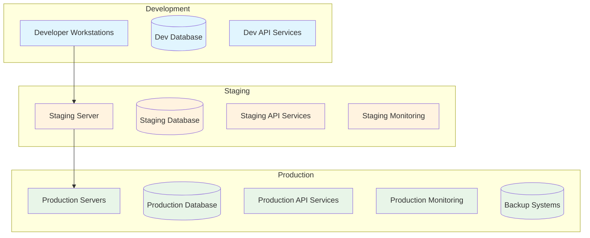

# MTM Environment Configuration Guidelines

## 📋 Overview

This document provides comprehensive guidelines for configuring and managing different environments in the MTM WIP Application ecosystem, ensuring consistency, security, and optimal performance across development, staging, and production environments.

## 🏗️ **Environment Architecture**



## 🛠️ **Environment Configurations**

### **Development Environment**

#### **Hardware Requirements**
```yaml
System Requirements:
  OS: Windows 10/11 (64-bit) or Windows Server 2019+
  CPU: Intel i5-8400 / AMD Ryzen 5 2600 (6 cores, 2.8+ GHz)
  Memory: 16 GB RAM minimum, 32 GB recommended
  Storage: 500 GB SSD (NVMe preferred)
  Network: 100 Mbps+ internet connection
  
Development Tools:
  Visual Studio 2022 Professional or Community
  Visual Studio Code (optional)
  Git for Windows
  MySQL Workbench
  Postman or similar API testing tool
```

#### **Software Stack**
```yaml
Runtime Environment:
  .NET: 8.0.x (latest stable)
  MySQL: 9.4.0 (development instance)
  Node.js: 18.x+ (for tooling)
  
Development Dependencies:
  Avalonia UI: 11.3.4
  MVVM Community Toolkit: 8.3.2
  MySQL Connector: MySql.Data 9.4.0
  Microsoft Extensions: 9.0.8
  
Optional Tools:
  Docker Desktop (for containerized development)
  Fiddler/Charles Proxy (for network debugging)
  dotMemory/PerfView (for performance profiling)
```

#### **Configuration Files**
```json
// appsettings.Development.json
{
  "Logging": {
    "LogLevel": {
      "Default": "Information",
      "Microsoft": "Warning",
      "Microsoft.Hosting.Lifetime": "Information",
      "MTM_WIP_Application_Avalonia": "Debug"
    },
    "Console": {
      "IncludeScopes": true,
      "TimestampFormat": "HH:mm:ss.fff "
    }
  },
  "Database": {
    "ConnectionString": "Server=localhost;Port=3306;Database=mtm_development;Uid=dev_user;Pwd=dev_password;Allow User Variables=True;",
    "CommandTimeout": 30,
    "EnableDetailedErrors": true,
    "EnableSensitiveDataLogging": true
  },
  "Application": {
    "Environment": "Development",
    "EnableHotReload": true,
    "EnableDebugMode": true,
    "MockExternalServices": true,
    "SkipAuthenticationInDev": true
  },
  "Features": {
    "EnableTestData": true,
    "EnableDiagnosticsUI": true,
    "EnableSwagger": true,
    "BypassSSLValidation": true
  },
  "Performance": {
    "EnableProfiling": true,
    "DetailedExceptions": true,
    "TrackMemoryUsage": true
  },
  "Security": {
    "RequireHttps": false,
    "EnableCORS": true,
    "AllowedOrigins": ["http://localhost:3000", "http://localhost:8080"]
  }
}
```

#### **Development Database Setup**
```sql
-- Development Database Configuration
CREATE DATABASE mtm_development CHARACTER SET utf8mb4 COLLATE utf8mb4_unicode_ci;

-- Create development user
CREATE USER 'dev_user'@'localhost' IDENTIFIED BY 'dev_password';
GRANT ALL PRIVILEGES ON mtm_development.* TO 'dev_user'@'localhost';

-- Enable query logging for development
SET GLOBAL general_log = 'ON';
SET GLOBAL general_log_file = '/var/log/mysql/mysql-dev.log';

-- Development-specific settings
SET GLOBAL slow_query_log = 1;
SET GLOBAL long_query_time = 1;
SET GLOBAL slow_query_log_file = '/var/log/mysql/slow-query-dev.log';
```

### **Staging Environment**

#### **Hardware Requirements**
```yaml
System Requirements:
  OS: Windows Server 2022 Standard
  CPU: Intel Xeon E-2288G / AMD EPYC 7262 (8 cores, 3.2+ GHz)
  Memory: 32 GB RAM
  Storage: 1 TB SSD + 2 TB HDD (for backups)
  Network: 1 Gbps dedicated connection
  
Infrastructure:
  Load Balancer: Not required (single instance)
  Backup: Daily automated backups
  Monitoring: Basic application monitoring
  SSL Certificate: Valid wildcard certificate
```

#### **Configuration Files**
```json
// appsettings.Staging.json
{
  "Logging": {
    "LogLevel": {
      "Default": "Information",
      "Microsoft": "Warning",
      "MTM_WIP_Application_Avalonia": "Information"
    },
    "EventLog": {
      "LogLevel": {
        "Default": "Warning"
      }
    },
    "File": {
      "Path": "C:\\Logs\\MTM_WIP_Staging\\app-.txt",
      "RollingInterval": "Day",
      "RetainedFileCountLimit": 30
    }
  },
  "Database": {
    "ConnectionString": "Server=staging-db.mtm-internal.com;Port=3306;Database=mtm_staging;Uid=staging_user;Pwd=${DB_PASSWORD};SslMode=Required;",
    "CommandTimeout": 60,
    "EnableDetailedErrors": false,
    "EnableRetryOnFailure": true,
    "MaxRetryCount": 3
  },
  "Application": {
    "Environment": "Staging",
    "EnableDebugMode": false,
    "MockExternalServices": true,
    "BaseUrl": "https://staging.mtm-corp.com"
  },
  "Features": {
    "EnableTestData": true,
    "EnableDiagnosticsUI": false,
    "EnableSwagger": true,
    "EnablePerformanceCounters": true
  },
  "Security": {
    "RequireHttps": true,
    "HstsMaxAge": 31536000,
    "EnableCORS": false,
    "JwtSecret": "${JWT_SECRET}",
    "EncryptionKey": "${ENCRYPTION_KEY}"
  },
  "Monitoring": {
    "EnableHealthChecks": true,
    "HealthCheckPath": "/health",
    "EnableMetrics": true,
    "MetricsPath": "/metrics"
  }
}
```

#### **Staging Infrastructure Setup**
```powershell
# Staging Environment Setup Script
# staging-setup.ps1

param(
    [string]$DatabasePassword,
    [string]$JwtSecret,
    [string]$EncryptionKey
)

Write-Host "🏗️ Setting up MTM Staging Environment..."

# 1. Create application directories
$appPath = "C:\MTM_WIP_Application"
$logsPath = "C:\Logs\MTM_WIP_Staging"
$backupPath = "C:\Backups\MTM_WIP_Staging"
$configPath = "C:\Config\MTM_WIP_Staging"

foreach ($path in @($appPath, $logsPath, $backupPath, $configPath)) {
    if (-not (Test-Path $path)) {
        New-Item -ItemType Directory -Path $path -Force
        Write-Host "✅ Created directory: $path"
    }
}

# 2. Set up Windows Service
$serviceName = "MTM_WIP_Application_Staging"
$serviceDisplayName = "MTM WIP Application - Staging"
$serviceDescription = "Manufacturing workflow management application (Staging Environment)"

# Install service if it doesn't exist
$service = Get-Service -Name $serviceName -ErrorAction SilentlyContinue
if (-not $service) {
    New-Service -Name $serviceName `
                -DisplayName $serviceDisplayName `
                -Description $serviceDescription `
                -BinaryPathName "$appPath\MTM_WIP_Application_Avalonia.exe" `
                -StartupType Automatic
    Write-Host "✅ Windows Service created: $serviceName"
}

# 3. Configure firewall rules
$firewallRules = @(
    @{Name="MTM WIP HTTP"; Port=80; Protocol="TCP"},
    @{Name="MTM WIP HTTPS"; Port=443; Protocol="TCP"},
    @{Name="MTM WIP App"; Port=8080; Protocol="TCP"}
)

foreach ($rule in $firewallRules) {
    $existingRule = Get-NetFirewallRule -DisplayName $rule.Name -ErrorAction SilentlyContinue
    if (-not $existingRule) {
        New-NetFirewallRule -DisplayName $rule.Name `
                           -Direction Inbound `
                           -Protocol $rule.Protocol `
                           -LocalPort $rule.Port `
                           -Action Allow
        Write-Host "✅ Firewall rule created: $($rule.Name)"
    }
}

# 4. Set up SSL certificate
Write-Host "📜 SSL Certificate configuration..."
# This would typically import a certificate or configure Let's Encrypt
Write-Host "⚠️ Manual SSL certificate configuration required"

# 5. Configure environment variables
[Environment]::SetEnvironmentVariable("ASPNETCORE_ENVIRONMENT", "Staging", "Machine")
[Environment]::SetEnvironmentVariable("MTM_DB_PASSWORD", $DatabasePassword, "Machine")
[Environment]::SetEnvironmentVariable("MTM_JWT_SECRET", $JwtSecret, "Machine")
[Environment]::SetEnvironmentVariable("MTM_ENCRYPTION_KEY", $EncryptionKey, "Machine")

Write-Host "✅ Environment variables configured"

# 6. Set up scheduled tasks for maintenance
$taskName = "MTM_Staging_Maintenance"
$taskAction = New-ScheduledTaskAction -Execute "PowerShell.exe" -Argument "-File C:\Scripts\staging-maintenance.ps1"
$taskTrigger = New-ScheduledTaskTrigger -Daily -At "02:00"
$taskSettings = New-ScheduledTaskSettingsSet -AllowStartIfOnBatteries -DontStopIfGoingOnBatteries

Register-ScheduledTask -TaskName $taskName -Action $taskAction -Trigger $taskTrigger -Settings $taskSettings -Force
Write-Host "✅ Maintenance scheduled task created"

Write-Host "🎉 Staging environment setup completed!"
```

### **Production Environment**

#### **Hardware Requirements**
```yaml
System Requirements:
  OS: Windows Server 2022 Datacenter
  CPU: Intel Xeon Gold 6248R / AMD EPYC 7443 (24+ cores, 3.0+ GHz)
  Memory: 64 GB RAM (128 GB for high-volume operations)
  Storage: 2 TB NVMe SSD + 10 TB enterprise HDD
  Network: 10 Gbps dedicated connection with redundancy
  
Infrastructure:
  Load Balancer: Hardware load balancer with SSL termination
  Database: MySQL Cluster or InnoDB Cluster
  Backup: Real-time replication + daily full backups
  Monitoring: Comprehensive monitoring with alerting
  SSL Certificate: Extended Validation (EV) certificate
  
High Availability:
  Primary Server: Active production instance
  Secondary Server: Hot standby with real-time sync
  Database: Master-slave replication with automatic failover
```

#### **Configuration Files**
```json
// appsettings.Production.json
{
  "Logging": {
    "LogLevel": {
      "Default": "Warning",
      "Microsoft": "Error",
      "MTM_WIP_Application_Avalonia": "Information"
    },
    "EventLog": {
      "LogLevel": {
        "Default": "Error",
        "MTM_WIP_Application_Avalonia": "Warning"
      }
    },
    "File": {
      "Path": "C:\\Logs\\MTM_WIP_Production\\app-.txt",
      "RollingInterval": "Day",
      "RetainedFileCountLimit": 90,
      "FileSizeLimitMB": 100
    },
    "Syslog": {
      "Host": "log-server.mtm-corp.com",
      "Port": 514,
      "Format": "RFC3164"
    }
  },
  "Database": {
    "ConnectionString": "Server=prod-db-cluster.mtm-corp.com;Port=3306;Database=mtm_production;Uid=prod_user;Pwd=${DB_PASSWORD};SslMode=Required;ConnectionTimeout=30;CommandTimeout=300;",
    "ReadOnlyConnectionString": "Server=prod-db-replica.mtm-corp.com;Port=3306;Database=mtm_production;Uid=readonly_user;Pwd=${DB_RO_PASSWORD};SslMode=Required;",
    "EnableDetailedErrors": false,
    "EnableRetryOnFailure": true,
    "MaxRetryCount": 5,
    "MaxRetryDelay": "00:00:30"
  },
  "Application": {
    "Environment": "Production",
    "EnableDebugMode": false,
    "MockExternalServices": false,
    "BaseUrl": "https://mtm-wip.mtm-corp.com",
    "MaxConcurrentUsers": 1000
  },
  "Features": {
    "EnableTestData": false,
    "EnableDiagnosticsUI": false,
    "EnableSwagger": false,
    "EnablePerformanceCounters": true,
    "EnableAuditLogging": true
  },
  "Security": {
    "RequireHttps": true,
    "HstsMaxAge": 63072000,
    "EnableCORS": false,
    "JwtSecret": "${JWT_SECRET}",
    "EncryptionKey": "${ENCRYPTION_KEY}",
    "RequireStrongPasswords": true,
    "SessionTimeout": 480,
    "MaxLoginAttempts": 5,
    "LockoutDuration": 900
  },
  "Performance": {
    "EnableResponseCaching": true,
    "CacheDuration": 300,
    "EnableCompression": true,
    "EnableResponseBuffering": false,
    "MaxRequestSize": 10485760,
    "RequestTimeout": 300
  },
  "Monitoring": {
    "EnableHealthChecks": true,
    "HealthCheckPath": "/health",
    "EnableMetrics": true,
    "MetricsPath": "/metrics",
    "AlertingEndpoint": "https://monitoring.mtm-corp.com/alerts",
    "PingInterval": 60
  },
  "Backup": {
    "EnableAutomaticBackup": true,
    "BackupInterval": "06:00:00",
    "RetentionDays": 30,
    "BackupLocation": "\\\\backup-server\\mtm-backups\\production"
  }
}
```

#### **Production Deployment Checklist**
```markdown
# Production Deployment Checklist

## Pre-Deployment (T-24 hours)
- [ ] **Security Scan**: Complete security vulnerability scan
- [ ] **Performance Test**: Load testing completed successfully
- [ ] **Database Backup**: Full database backup with verification
- [ ] **Configuration Review**: Production config reviewed and approved
- [ ] **Rollback Plan**: Rollback procedures tested and documented
- [ ] **Team Notification**: All stakeholders notified of deployment window
- [ ] **Change Management**: Change request approved and logged

## Deployment Day (T-2 hours)
- [ ] **System Health**: All systems running normally
- [ ] **Database Status**: Database cluster healthy and synchronized
- [ ] **Network Status**: Network connectivity and load balancer functional
- [ ] **Monitoring**: Monitoring systems active and alerting enabled
- [ ] **Support Team**: On-call team available and briefed
- [ ] **Communication**: Status page updated with maintenance window

## Deployment Execution
- [ ] **Traffic Diversion**: Redirect traffic to maintenance page
- [ ] **Service Stop**: Stop application services gracefully
- [ ] **Database Migration**: Execute database schema updates
- [ ] **Application Deploy**: Deploy new application version
- [ ] **Configuration Update**: Update production configuration
- [ ] **Service Start**: Start application services
- [ ] **Health Verification**: Verify all health checks pass
- [ ] **Smoke Tests**: Execute critical path smoke tests

## Post-Deployment (T+2 hours)
- [ ] **Full Traffic**: Resume full traffic to application
- [ ] **Performance Monitoring**: Monitor response times and throughput
- [ ] **Error Monitoring**: Monitor error rates and logs
- [ ] **User Acceptance**: Validate key user workflows
- [ ] **Database Performance**: Monitor database performance metrics
- [ ] **Security Validation**: Verify security controls are functional
- [ ] **Documentation**: Update deployment logs and documentation

## 24-Hour Monitoring
- [ ] **System Stability**: Monitor system stability over 24 hours
- [ ] **User Feedback**: Collect and address user feedback
- [ ] **Performance Trends**: Analyze performance trend data
- [ ] **Error Analysis**: Review and address any new errors
- [ ] **Capacity Planning**: Update capacity planning based on usage
```

## 🔒 **Security Configuration**

### **Environment Security Matrix**
| Security Control | Development | Staging | Production |
|-----------------|------------|---------|------------|
| HTTPS Required | Optional | Required | Required |
| SSL Certificate | Self-signed | Valid cert | EV Certificate |
| Authentication | Disabled | Enabled | Enforced |
| Audit Logging | Minimal | Standard | Comprehensive |
| Data Encryption | Optional | Required | Required |
| Network Isolation | None | Basic | Full isolation |
| Backup Encryption | No | Yes | Yes (AES-256) |
| Access Controls | Developer | Role-based | Strict RBAC |

### **Secrets Management**
```yaml
Development:
  Storage: appsettings.Development.json (local only)
  Encryption: None required
  Access: Developer workstations only

Staging:
  Storage: Azure Key Vault / Environment Variables
  Encryption: Required for sensitive data
  Access: CI/CD pipeline + authorized personnel
  Rotation: Monthly

Production:
  Storage: Azure Key Vault with HSM
  Encryption: Required for all secrets
  Access: Automated systems only
  Rotation: Weekly for critical secrets
  Audit: Full audit trail required
```

## 📊 **Monitoring and Alerting**

### **Environment-Specific Monitoring**
```yaml
Development:
  Monitoring: Local debugging tools only
  Alerting: None required
  Metrics: Performance counters for optimization

Staging:
  Monitoring: Application health checks
  Alerting: Email notifications for failures
  Metrics: Response time, error rate, throughput
  Retention: 30 days

Production:
  Monitoring: Comprehensive monitoring suite
  Alerting: Multiple channels (email, SMS, Slack)
  Metrics: Full application and infrastructure metrics
  Retention: 1 year
  SLA: 99.9% uptime target
```

### **Key Performance Indicators (KPIs)**
```yaml
Application Performance:
  - Response Time: <500ms (95th percentile)
  - Throughput: >1000 requests/minute
  - Error Rate: <0.1%
  - Availability: >99.9%

Database Performance:
  - Query Response Time: <100ms (average)
  - Connection Pool Usage: <80%
  - Database CPU: <70%
  - Storage Usage: <85%

System Performance:
  - CPU Utilization: <75%
  - Memory Usage: <80%
  - Disk I/O: <85%
  - Network Utilization: <70%
```

## 🚀 **Environment Promotion Process**

### **Code Promotion Pipeline**
```
Feature Branch → Development → Staging → Production

Promotion Criteria:
1. Development: All unit tests pass
2. Staging: Integration tests pass + manual testing complete
3. Production: Staging validation + change approval

Rollback Strategy:
- Development: Git reset/revert
- Staging: Automated rollback script
- Production: Blue-green deployment with instant rollback
```

### **Data Promotion Guidelines**
```yaml
Development to Staging:
  - Anonymized production data subset
  - Test data generation scripts
  - Database schema synchronized

Staging to Production:
  - Configuration-only changes
  - Database migrations (forward-only)
  - Feature flags for gradual rollout

Data Protection:
  - No production data in development
  - Anonymization required for staging
  - Encryption in transit and at rest
```

This comprehensive environment configuration guide ensures consistent, secure, and optimized deployments across all stages of the MTM WIP Application lifecycle.
