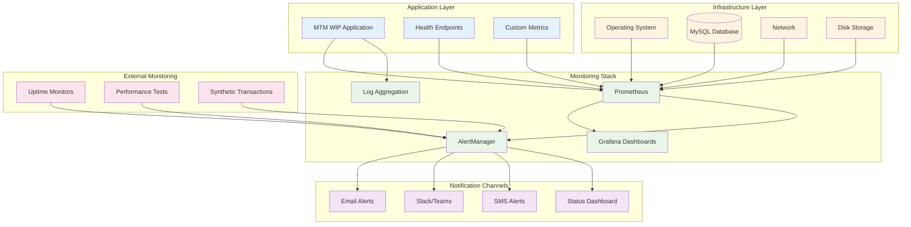

# MTM Monitoring Strategies Documentation

## 📋 Overview

This document outlines comprehensive monitoring strategies for the MTM WIP Application, covering application performance monitoring (APM), infrastructure monitoring, business metrics tracking, and alerting strategies to ensure optimal system performance and reliability.

## 🏗️ **Monitoring Architecture**



## 📊 **Application Performance Monitoring (APM)**

### **Health Check Endpoints**
```csharp
// Health Check Implementation
// Services/HealthChecks.cs
using Microsoft.Extensions.Diagnostics.HealthChecks;

public class MTMApplicationHealthCheck : IHealthCheck
{
    private readonly ILogger<MTMApplicationHealthCheck> _logger;
    private readonly IConfigurationService _configurationService;
    private readonly IInventoryService _inventoryService;

    public MTMApplicationHealthCheck(
        ILogger<MTMApplicationHealthCheck> logger,
        IConfigurationService configurationService,
        IInventoryService inventoryService)
    {
        _logger = logger;
        _configurationService = configurationService;
        _inventoryService = inventoryService;
    }

    public async Task<HealthCheckResult> CheckHealthAsync(
        HealthCheckContext context,
        CancellationToken cancellationToken = default)
    {
        try
        {
            var healthData = new Dictionary<string, object>();

            // Check application configuration
            var connectionString = await _configurationService.GetConnectionStringAsync();
            healthData.Add("ConfigurationLoaded", !string.IsNullOrEmpty(connectionString));

            // Check database connectivity
            var dbHealthy = await CheckDatabaseHealthAsync();
            healthData.Add("DatabaseConnectivity", dbHealthy);

            // Check critical services
            var servicesHealthy = await CheckCriticalServicesAsync();
            healthData.Add("CriticalServices", servicesHealthy);

            // Check system resources
            var systemHealth = await CheckSystemResourcesAsync();
            healthData.Add("SystemResources", systemHealth);

            // Determine overall health status
            var isHealthy = dbHealthy && servicesHealthy && systemHealth.IsHealthy;

            return isHealthy 
                ? HealthCheckResult.Healthy("All systems operational", healthData)
                : HealthCheckResult.Degraded("Some systems experiencing issues", healthData);
        }
        catch (Exception ex)
        {
            _logger.LogError(ex, "Health check failed");
            return HealthCheckResult.Unhealthy("Health check execution failed", ex);
        }
    }

    private async Task<bool> CheckDatabaseHealthAsync()
    {
        try
        {
            // Simple database connectivity test
            var result = await Helper_Database_StoredProcedure.ExecuteDataTableWithStatus(
                await _configurationService.GetConnectionStringAsync(),
                "system_health_check_basic",
                Array.Empty<MySqlParameter>()
            );
            return result.Status == 1;
        }
        catch
        {
            return false;
        }
    }

    private async Task<bool> CheckCriticalServicesAsync()
    {
        try
        {
            // Test critical business operations
            var testResult = await _inventoryService.GetPartCountAsync();
            return testResult >= 0; // Basic service functionality test
        }
        catch
        {
            return false;
        }
    }

    private async Task<SystemHealthStatus> CheckSystemResourcesAsync()
    {
        var status = new SystemHealthStatus();

        try
        {
            // Check available memory
            var memoryInfo = GC.GetTotalMemory(false);
            status.MemoryUsageMB = memoryInfo / 1024 / 1024;

            // Check disk space
            var driveInfo = new DriveInfo("C:");
            status.DiskFreeSpaceGB = driveInfo.AvailableFreeSpace / 1024 / 1024 / 1024;

            // Check CPU usage (simplified)
            using var process = Process.GetCurrentProcess();
            status.CpuUsagePercent = process.TotalProcessorTime.TotalMilliseconds;

            // Determine if resources are healthy
            status.IsHealthy = 
                status.MemoryUsageMB < 4000 && // < 4GB memory usage
                status.DiskFreeSpaceGB > 5 &&  // > 5GB free space
                status.CpuUsagePercent < 80;   // < 80% CPU usage

            return status;
        }
        catch
        {
            status.IsHealthy = false;
            return status;
        }
    }
}

public class SystemHealthStatus
{
    public long MemoryUsageMB { get; set; }
    public long DiskFreeSpaceGB { get; set; }
    public double CpuUsagePercent { get; set; }
    public bool IsHealthy { get; set; }
}
```

### **Custom Metrics Collection**
```csharp
// Custom Metrics Implementation
// Services/MetricsCollectionService.cs
using System.Diagnostics.Metrics;

public class MTMMetricsService : IDisposable
{
    private readonly Meter _meter;
    private readonly Counter<long> _inventoryTransactionCounter;
    private readonly Histogram<double> _databaseQueryDuration;
    private readonly Counter<long> _errorCounter;
    private readonly ObservableGauge<int> _activeUsersGauge;
    private readonly ObservableGauge<long> _totalInventoryItems;

    public MTMMetricsService()
    {
        _meter = new Meter("MTM.WIP.Application", "1.0.0");

        // Transaction metrics
        _inventoryTransactionCounter = _meter.CreateCounter<long>(
            "mtm_inventory_transactions_total",
            "Count of inventory transactions processed");

        // Performance metrics
        _databaseQueryDuration = _meter.CreateHistogram<double>(
            "mtm_database_query_duration_seconds",
            "Duration of database queries in seconds");

        // Error metrics
        _errorCounter = _meter.CreateCounter<long>(
            "mtm_errors_total",
            "Total number of errors encountered");

        // Business metrics
        _activeUsersGauge = _meter.CreateObservableGauge<int>(
            "mtm_active_users",
            "Number of currently active users");

        _totalInventoryItems = _meter.CreateObservableGauge<long>(
            "mtm_inventory_items_total",
            "Total number of items in inventory");
    }

    public void RecordInventoryTransaction(string transactionType, string operation)
    {
        _inventoryTransactionCounter.Add(1, 
            new KeyValuePair<string, object?>("transaction_type", transactionType),
            new KeyValuePair<string, object?>("operation", operation));
    }

    public void RecordDatabaseQuery(double durationSeconds, string operation, bool success)
    {
        _databaseQueryDuration.Record(durationSeconds,
            new KeyValuePair<string, object?>("operation", operation),
            new KeyValuePair<string, object?>("success", success));
    }

    public void RecordError(string errorType, string component)
    {
        _errorCounter.Add(1,
            new KeyValuePair<string, object?>("error_type", errorType),
            new KeyValuePair<string, object?>("component", component));
    }

    public void Dispose()
    {
        _meter?.Dispose();
    }
}

// Usage in services
public class InventoryService : IInventoryService
{
    private readonly MTMMetricsService _metrics;
    private readonly ILogger<InventoryService> _logger;

    public async Task<InventoryOperationResult> ProcessInventoryTransactionAsync(
        InventoryTransaction transaction)
    {
        using var activity = ActivitySource.StartActivity("ProcessInventoryTransaction");
        var stopwatch = Stopwatch.StartNew();

        try
        {
            var result = await ExecuteInventoryOperationAsync(transaction);
            
            // Record metrics
            _metrics.RecordInventoryTransaction(transaction.Type, transaction.Operation);
            _metrics.RecordDatabaseQuery(stopwatch.Elapsed.TotalSeconds, "inventory_transaction", true);

            return result;
        }
        catch (Exception ex)
        {
            _metrics.RecordError(ex.GetType().Name, "InventoryService");
            _metrics.RecordDatabaseQuery(stopwatch.Elapsed.TotalSeconds, "inventory_transaction", false);
            throw;
        }
    }
}
```

## 🖥️ **Infrastructure Monitoring**

### **System Performance Metrics**
```yaml
CPU Metrics:
  - cpu_usage_percent: Current CPU utilization
  - cpu_load_average: System load average (1m, 5m, 15m)
  - cpu_time_user: Time spent in user mode
  - cpu_time_system: Time spent in system mode
  - cpu_context_switches: Number of context switches per second

Memory Metrics:
  - memory_total_bytes: Total system memory
  - memory_available_bytes: Available system memory
  - memory_used_percent: Memory utilization percentage
  - memory_cached_bytes: Cached memory
  - memory_swap_used_bytes: Swap space utilization

Disk Metrics:
  - disk_total_bytes: Total disk space
  - disk_available_bytes: Available disk space
  - disk_used_percent: Disk utilization percentage
  - disk_read_bytes_per_second: Disk read throughput
  - disk_write_bytes_per_second: Disk write throughput
  - disk_io_operations_per_second: Disk I/O operations

Network Metrics:
  - network_bytes_received_per_second: Network ingress
  - network_bytes_sent_per_second: Network egress
  - network_packets_received_per_second: Incoming packets
  - network_packets_sent_per_second: Outgoing packets
  - network_errors_per_second: Network errors
```

### **Database Monitoring**
```sql
-- MySQL Performance Monitoring Queries
-- Create monitoring stored procedure
DELIMITER //
CREATE PROCEDURE GetDatabaseMetrics()
BEGIN
    -- Connection metrics
    SELECT 
        'connections' as metric_name,
        VARIABLE_VALUE as metric_value
    FROM performance_schema.global_status 
    WHERE VARIABLE_NAME = 'Threads_connected'
    
    UNION ALL
    
    -- Query performance
    SELECT 
        'slow_queries' as metric_name,
        VARIABLE_VALUE as metric_value
    FROM performance_schema.global_status 
    WHERE VARIABLE_NAME = 'Slow_queries'
    
    UNION ALL
    
    -- InnoDB metrics
    SELECT 
        'innodb_buffer_pool_hit_rate' as metric_name,
        ROUND(
            (1 - (VARIABLE_VALUE / 
                (SELECT VARIABLE_VALUE 
                 FROM performance_schema.global_status 
                 WHERE VARIABLE_NAME = 'Innodb_buffer_pool_read_requests'))) * 100, 2
        ) as metric_value
    FROM performance_schema.global_status 
    WHERE VARIABLE_NAME = 'Innodb_buffer_pool_reads'
    
    UNION ALL
    
    -- Table size metrics
    SELECT 
        CONCAT('table_size_', TABLE_SCHEMA, '_', TABLE_NAME) as metric_name,
        ROUND((DATA_LENGTH + INDEX_LENGTH) / 1024 / 1024, 2) as metric_value
    FROM information_schema.TABLES 
    WHERE TABLE_SCHEMA = 'mtm_production'
    AND TABLE_TYPE = 'BASE TABLE';
END//
DELIMITER ;
```

### **Application-Specific Metrics**
```csharp
// Manufacturing-specific metrics
public class ManufacturingMetrics
{
    public static readonly Counter<long> PartsProcessed = Metrics
        .CreateCounter("mtm_parts_processed_total", "Total parts processed");

    public static readonly Counter<long> OperationsCompleted = Metrics
        .CreateCounter("mtm_operations_completed_total", "Operations completed by type");

    public static readonly Histogram<double> OperationDuration = Metrics
        .CreateHistogram("mtm_operation_duration_seconds", "Duration of manufacturing operations");

    public static readonly Gauge ActiveWorkOrders = Metrics
        .CreateGauge("mtm_active_work_orders", "Currently active work orders");

    public static readonly Counter<long> QualityChecks = Metrics
        .CreateCounter("mtm_quality_checks_total", "Quality checks performed");

    public static readonly Histogram<double> InventoryTurnover = Metrics
        .CreateHistogram("mtm_inventory_turnover_days", "Inventory turnover time in days");
}

// Usage in business logic
public async Task ProcessWorkOrderAsync(WorkOrder workOrder)
{
    using var timer = ManufacturingMetrics.OperationDuration.NewTimer();
    
    try
    {
        await ExecuteWorkOrderAsync(workOrder);
        
        ManufacturingMetrics.PartsProcessed.WithLabels(
            workOrder.PartId, 
            workOrder.Operation
        ).Inc(workOrder.Quantity);
        
        ManufacturingMetrics.OperationsCompleted.WithLabels(
            workOrder.Operation,
            "completed"
        ).Inc();
        
    }
    catch (Exception ex)
    {
        ManufacturingMetrics.OperationsCompleted.WithLabels(
            workOrder.Operation,
            "failed"
        ).Inc();
        throw;
    }
}
```

## 📈 **Grafana Dashboard Configuration**

### **Executive Dashboard**
```json
{
  "dashboard": {
    "id": null,
    "title": "MTM WIP Application - Executive Dashboard",
    "tags": ["mtm", "executive", "overview"],
    "timezone": "browser",
    "panels": [
      {
        "title": "System Health Overview",
        "type": "stat",
        "targets": [
          {
            "expr": "up{job=\"mtm-application\"}",
            "legendFormat": "Application Status"
          },
          {
            "expr": "mysql_up{instance=\"production-db\"}",
            "legendFormat": "Database Status"
          }
        ],
        "fieldConfig": {
          "defaults": {
            "color": {
              "mode": "thresholds"
            },
            "thresholds": {
              "steps": [
                {"color": "red", "value": 0},
                {"color": "green", "value": 1}
              ]
            }
          }
        }
      },
      {
        "title": "Daily Transactions",
        "type": "stat",
        "targets": [
          {
            "expr": "increase(mtm_inventory_transactions_total[24h])",
            "legendFormat": "Total Transactions Today"
          }
        ],
        "fieldConfig": {
          "defaults": {
            "unit": "short",
            "color": {"mode": "palette-classic"}
          }
        }
      },
      {
        "title": "Response Time Trend",
        "type": "timeseries",
        "targets": [
          {
            "expr": "histogram_quantile(0.95, mtm_database_query_duration_seconds_bucket)",
            "legendFormat": "95th Percentile"
          },
          {
            "expr": "histogram_quantile(0.50, mtm_database_query_duration_seconds_bucket)",
            "legendFormat": "50th Percentile"
          }
        ]
      }
    ],
    "time": {
      "from": "now-24h",
      "to": "now"
    },
    "refresh": "30s"
  }
}
```

### **Technical Dashboard**
```json
{
  "dashboard": {
    "title": "MTM WIP Application - Technical Details",
    "panels": [
      {
        "title": "Application Performance",
        "type": "timeseries",
        "targets": [
          {
            "expr": "rate(mtm_inventory_transactions_total[5m])",
            "legendFormat": "Transactions/sec"
          },
          {
            "expr": "rate(mtm_errors_total[5m])",
            "legendFormat": "Errors/sec"
          }
        ]
      },
      {
        "title": "System Resources",
        "type": "timeseries",
        "targets": [
          {
            "expr": "100 - (avg(rate(cpu_idle[5m])) * 100)",
            "legendFormat": "CPU Usage %"
          },
          {
            "expr": "(1 - (node_memory_MemAvailable_bytes / node_memory_MemTotal_bytes)) * 100",
            "legendFormat": "Memory Usage %"
          },
          {
            "expr": "100 - ((node_filesystem_avail_bytes / node_filesystem_size_bytes) * 100)",
            "legendFormat": "Disk Usage %"
          }
        ]
      },
      {
        "title": "Database Performance",
        "type": "timeseries",
        "targets": [
          {
            "expr": "mysql_global_status_threads_connected",
            "legendFormat": "Active Connections"
          },
          {
            "expr": "rate(mysql_global_status_slow_queries[5m])",
            "legendFormat": "Slow Queries/sec"
          },
          {
            "expr": "mysql_global_status_innodb_buffer_pool_read_requests",
            "legendFormat": "Buffer Pool Reads"
          }
        ]
      }
    ]
  }
}
```

## 🚨 **Alerting Configuration**

### **Alert Rules**
```yaml
# prometheus-alerts.yml
groups:
  - name: mtm-application-alerts
    rules:
      # Application availability
      - alert: MTMApplicationDown
        expr: up{job="mtm-application"} == 0
        for: 1m
        labels:
          severity: critical
          component: application
        annotations:
          summary: "MTM Application is down"
          description: "MTM WIP Application has been down for more than 1 minute"
          runbook_url: "https://wiki.mtm-corp.com/runbooks/application-down"

      # Database connectivity
      - alert: DatabaseConnectionFailure
        expr: mysql_up == 0
        for: 2m
        labels:
          severity: critical
          component: database
        annotations:
          summary: "Database connection failure"
          description: "Unable to connect to MySQL database for {{ $value }} minutes"

      # High error rate
      - alert: HighErrorRate
        expr: rate(mtm_errors_total[5m]) > 10
        for: 3m
        labels:
          severity: warning
          component: application
        annotations:
          summary: "High error rate detected"
          description: "Error rate is {{ $value }} errors/sec over the last 5 minutes"

      # High response time
      - alert: HighResponseTime
        expr: histogram_quantile(0.95, mtm_database_query_duration_seconds_bucket) > 2
        for: 5m
        labels:
          severity: warning
          component: database
        annotations:
          summary: "High database response time"
          description: "95th percentile response time is {{ $value }}s"

      # System resource alerts
      - alert: HighCPUUsage
        expr: 100 - (avg(rate(node_cpu_seconds_total{mode="idle"}[5m])) * 100) > 80
        for: 10m
        labels:
          severity: warning
          component: system
        annotations:
          summary: "High CPU usage"
          description: "CPU usage is above 80% for more than 10 minutes"

      - alert: HighMemoryUsage
        expr: (1 - (node_memory_MemAvailable_bytes / node_memory_MemTotal_bytes)) * 100 > 90
        for: 5m
        labels:
          severity: critical
          component: system
        annotations:
          summary: "High memory usage"
          description: "Memory usage is above 90%"

      - alert: LowDiskSpace
        expr: 100 - ((node_filesystem_avail_bytes / node_filesystem_size_bytes) * 100) > 90
        for: 5m
        labels:
          severity: critical
          component: system
        annotations:
          summary: "Low disk space"
          description: "Disk usage is above 90%"

  - name: mtm-business-alerts
    rules:
      # Business metric alerts
      - alert: LowTransactionVolume
        expr: increase(mtm_inventory_transactions_total[1h]) < 100
        for: 2h
        labels:
          severity: warning
          component: business
        annotations:
          summary: "Low transaction volume"
          description: "Only {{ $value }} transactions processed in the last hour"

      - alert: QualityCheckFailure
        expr: rate(mtm_quality_checks_total{result="failed"}[10m]) > 0.1
        for: 5m
        labels:
          severity: warning
          component: quality
        annotations:
          summary: "High quality check failure rate"
          description: "Quality check failure rate is {{ $value }}/min"
```

### **Notification Configuration**
```yaml
# alertmanager.yml
global:
  smtp_smarthost: 'smtp.mtm-corp.com:587'
  smtp_from: 'monitoring@mtm-corp.com'

route:
  group_by: ['alertname', 'severity']
  group_wait: 30s
  group_interval: 5m
  repeat_interval: 4h
  receiver: 'default'
  routes:
    # Critical alerts - immediate notification
    - match:
        severity: critical
      receiver: 'critical-alerts'
      group_wait: 0s
      repeat_interval: 1h
    
    # Business hours warnings
    - match:
        severity: warning
      receiver: 'business-hours'
      active_time_intervals:
        - business-hours
    
    # Database alerts to DBA team
    - match:
        component: database
      receiver: 'dba-team'

receivers:
  - name: 'default'
    email_configs:
      - to: 'devops@mtm-corp.com'
        subject: '[MTM Alert] {{ .GroupLabels.alertname }}'
        body: |
          Alert: {{ .GroupLabels.alertname }}
          Severity: {{ .GroupLabels.severity }}
          
          {{ range .Alerts }}
          Description: {{ .Annotations.description }}
          Runbook: {{ .Annotations.runbook_url }}
          {{ end }}

  - name: 'critical-alerts'
    email_configs:
      - to: 'oncall@mtm-corp.com'
        subject: '[CRITICAL] {{ .GroupLabels.alertname }}'
    slack_configs:
      - api_url: 'https://hooks.slack.com/services/...'
        channel: '#alerts-critical'
        title: 'Critical Alert: {{ .GroupLabels.alertname }}'
        text: '{{ range .Alerts }}{{ .Annotations.summary }}{{ end }}'
    pagerduty_configs:
      - service_key: 'your-pagerduty-service-key'

  - name: 'business-hours'
    email_configs:
      - to: 'support@mtm-corp.com'
        subject: '[Warning] {{ .GroupLabels.alertname }}'

  - name: 'dba-team'
    email_configs:
      - to: 'dba@mtm-corp.com'
        subject: '[DB Alert] {{ .GroupLabels.alertname }}'

time_intervals:
  - name: business-hours
    time_intervals:
      - times:
          - start_time: '08:00'
            end_time: '18:00'
        weekdays: ['monday:friday']
```

## 🔍 **Log Management Strategy**

### **Structured Logging Configuration**
```csharp
// Structured logging setup
public static class LoggingConfiguration
{
    public static IServiceCollection AddMTMLogging(
        this IServiceCollection services, 
        IConfiguration configuration)
    {
        services.AddLogging(builder =>
        {
            builder.ClearProviders();
            
            // Console logging for development
            if (Environment.GetEnvironmentVariable("ASPNETCORE_ENVIRONMENT") == "Development")
            {
                builder.AddConsole(options =>
                {
                    options.IncludeScopes = true;
                    options.TimestampFormat = "HH:mm:ss.fff ";
                });
            }
            
            // File logging with Serilog
            builder.AddSerilog(new LoggerConfiguration()
                .ReadFrom.Configuration(configuration)
                .Enrich.FromLogContext()
                .Enrich.WithProperty("Application", "MTM_WIP_Application")
                .Enrich.WithProperty("Version", Assembly.GetExecutingAssembly().GetName().Version)
                .Enrich.WithProperty("MachineName", Environment.MachineName)
                .WriteTo.File(
                    path: "logs/mtm-application-.txt",
                    rollingInterval: RollingInterval.Day,
                    retainedFileCountLimit: 30,
                    outputTemplate: "{Timestamp:yyyy-MM-dd HH:mm:ss.fff zzz} [{Level:u3}] [{SourceContext}] {Message:lj} {Properties:j}{NewLine}{Exception}")
                .WriteTo.Conditional(
                    evt => evt.Level >= LogEventLevel.Warning,
                    wt => wt.File(
                        path: "logs/mtm-errors-.txt",
                        rollingInterval: RollingInterval.Day,
                        retainedFileCountLimit: 90))
                .CreateLogger());
        });

        return services;
    }
}

// Usage in services with structured logging
public class InventoryService : IInventoryService
{
    private readonly ILogger<InventoryService> _logger;

    public async Task<InventoryResult> ProcessTransactionAsync(InventoryTransaction transaction)
    {
        using var scope = _logger.BeginScope(new Dictionary<string, object>
        {
            ["TransactionId"] = transaction.Id,
            ["PartId"] = transaction.PartId,
            ["Operation"] = transaction.Operation,
            ["Quantity"] = transaction.Quantity,
            ["User"] = transaction.UserId
        });

        _logger.LogInformation("Starting inventory transaction processing");

        var stopwatch = Stopwatch.StartNew();
        try
        {
            var result = await ExecuteTransactionAsync(transaction);
            
            _logger.LogInformation("Transaction completed successfully in {Duration}ms", 
                stopwatch.ElapsedMilliseconds);
            
            return result;
        }
        catch (BusinessLogicException ex)
        {
            _logger.LogWarning(ex, "Business logic error during transaction processing");
            throw;
        }
        catch (Exception ex)
        {
            _logger.LogError(ex, "Unexpected error during transaction processing");
            throw;
        }
    }
}
```

### **Log Aggregation and Analysis**
```yaml
# ELK Stack Configuration for Log Analysis
elasticsearch:
  cluster.name: "mtm-logs"
  node.name: "mtm-log-node"
  path.data: /var/lib/elasticsearch
  network.host: 0.0.0.0
  discovery.type: single-node

logstash:
  input:
    beats:
      port: 5044
  filter:
    if [fields][application] == "mtm-wip-application":
      grok:
        match:
          message: "%{TIMESTAMP_ISO8601:timestamp} \[%{LOGLEVEL:level}\] \[%{DATA:logger}\] %{GREEDYDATA:message}"
      date:
        match: ["timestamp", "yyyy-MM-dd HH:mm:ss.SSS zzz"]
      mutate:
        add_field:
          application: "MTM WIP Application"
  output:
    elasticsearch:
      hosts: ["elasticsearch:9200"]
      index: "mtm-logs-%{+YYYY.MM.dd}"

kibana:
  server.name: "mtm-kibana"
  server.host: "0.0.0.0"
  elasticsearch.hosts: ["http://elasticsearch:9200"]
  elasticsearch.username: "kibana_system"
```

This comprehensive monitoring strategy ensures complete visibility into the MTM WIP Application's performance, health, and business metrics, enabling proactive issue detection and rapid response to any problems.
