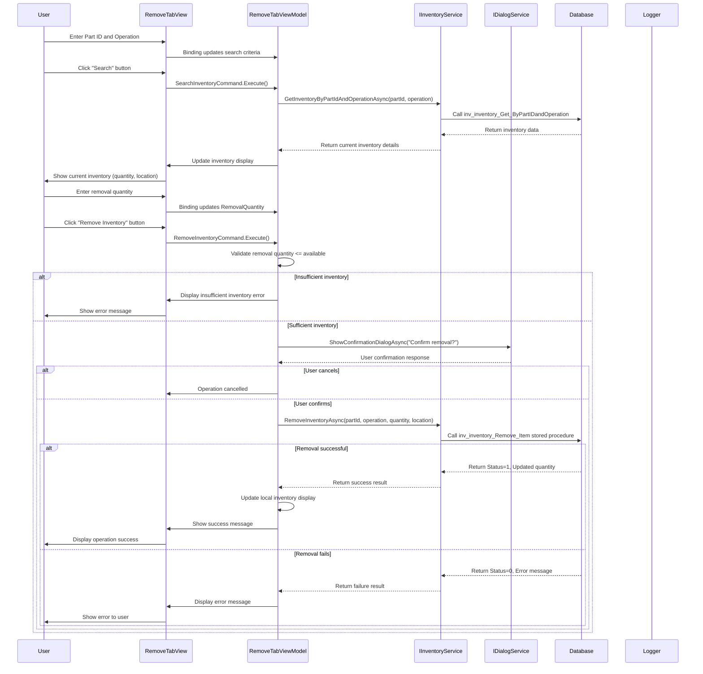
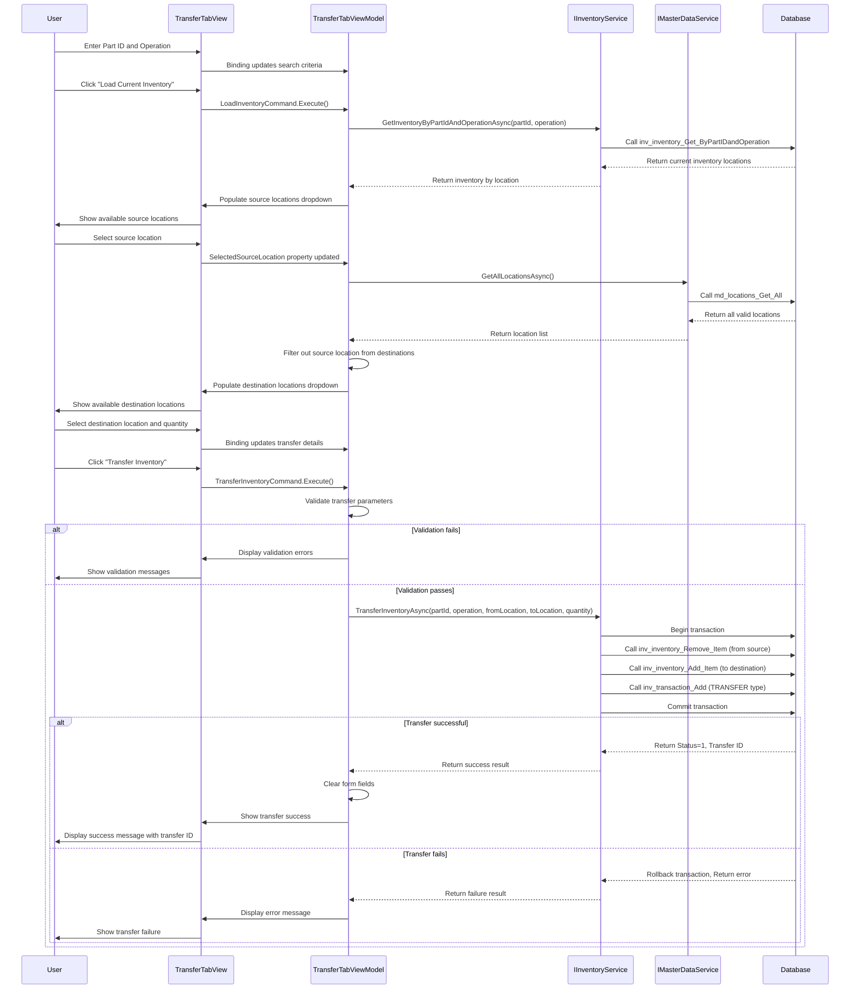
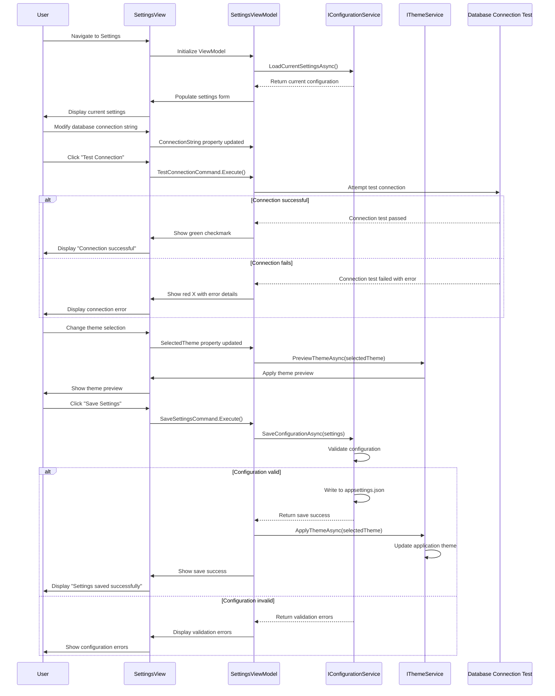
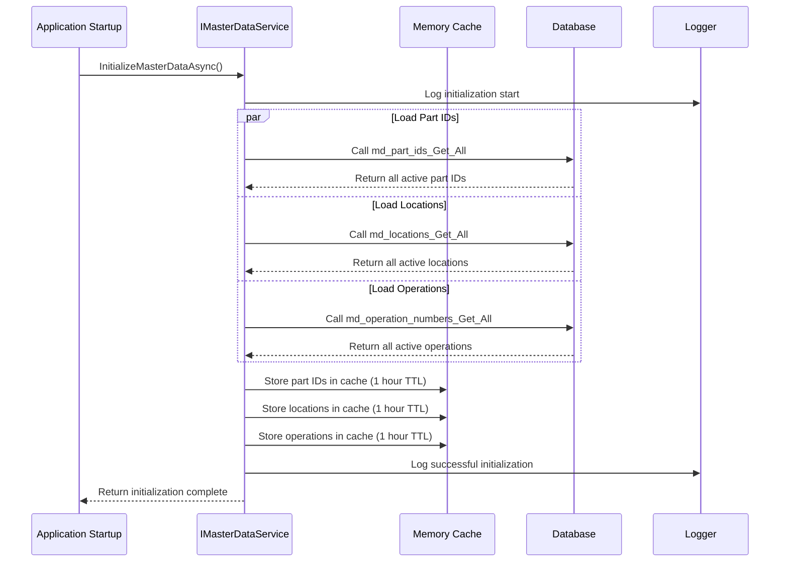
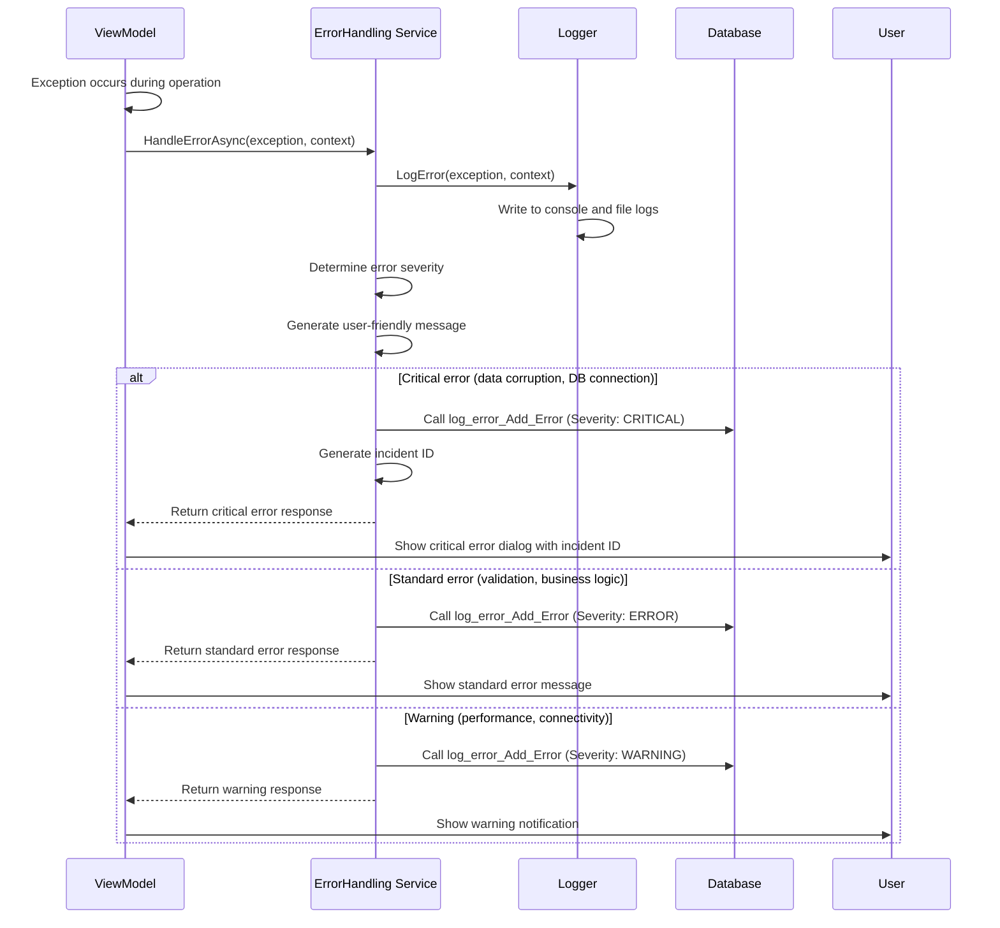
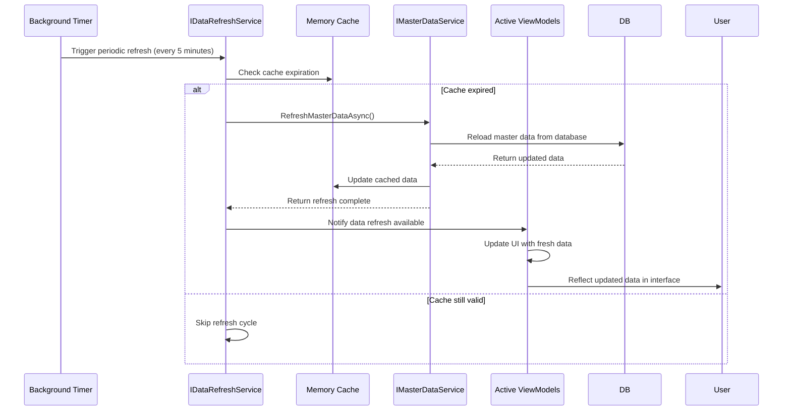
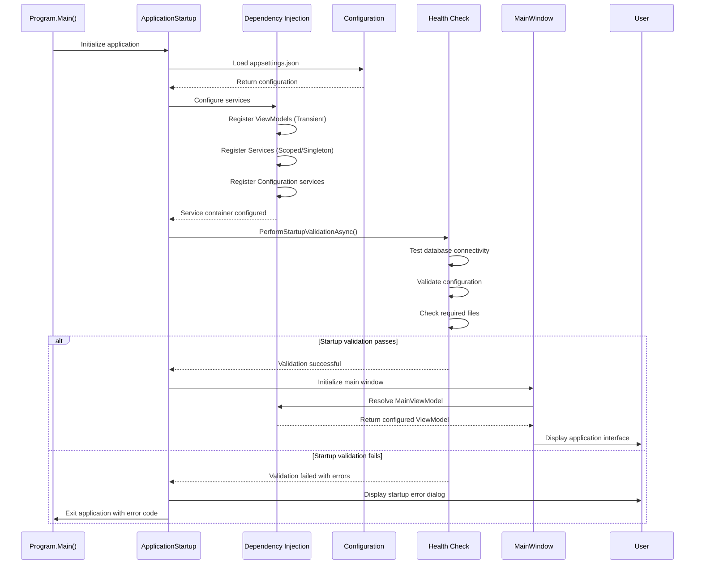
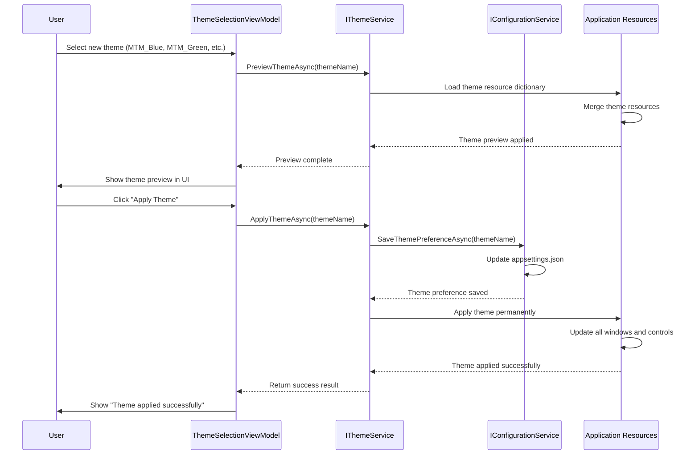

# MTM Sequence Diagrams - Manufacturing Workflow Documentation

## 📋 Overview

This document provides comprehensive sequence diagrams for all major workflows in the MTM WIP Application, illustrating the interactions between Views, ViewModels, Services, and the Database layer.

## 🏭 **Core Manufacturing Workflows**

### **1. Add Inventory Workflow**

```mermaid
sequenceDiagram
    participant U as User
    participant V as InventoryTabView
    participant VM as InventoryTabViewModel
    participant IS as IInventoryService
    parameter DB as Database (Stored Procedures)
    participant EH as ErrorHandling Service
    participant L as Logger

    U->>V: Enter Part ID, Operation, Quantity, Location
    V->>VM: Binding updates properties
    U->>V: Click "Add Inventory" button
    V->>VM: AddInventoryCommand.Execute()
    
    VM->>VM: Validate input data
    alt Input validation fails
        VM->>V: Display validation error
        V->>U: Show error message
    else Input validation passes
        VM->>VM: Set IsLoading = true
        VM->>L: Log operation start
        VM->>IS: AddInventoryAsync(partId, operation, quantity, location)
        
        IS->>DB: Helper_Database_StoredProcedure.ExecuteDataTableWithStatus()
        DB->>DB: Call inv_inventory_Add_Item stored procedure
        
        alt Database operation successful
            DB-->>IS: Return Status=1, ItemID
            IS-->>VM: Return Result.Success with data
            VM->>VM: Clear form fields
            VM->>V: Update UI with success state
            VM->>L: Log successful operation
            V->>U: Display success message
        else Database operation fails
            DB-->>IS: Return Status=0, Error message
            IS-->>VM: Return Result.Failure with error
            VM->>EH: HandleErrorAsync(exception, context)
            EH->>L: Log error details
            EH->>DB: Call log_error_Add_Error stored procedure
            VM->>V: Display error message
            V->>U: Show error to user
        end
        
        VM->>VM: Set IsLoading = false
    end
```

### **2. Remove Inventory Workflow**



### **3. Transfer Inventory Workflow**



### **4. Settings Configuration Workflow**



## 📊 **Data Flow Workflows**

### **5. Master Data Loading Workflow**



### **6. Error Handling Workflow**



## 🔄 **Background Process Workflows**

### **7. Periodic Data Refresh Workflow**



### **8. Application Startup Sequence**



## 🎯 **Integration Workflows**

### **9. Theme Change Workflow**



These sequence diagrams provide comprehensive documentation of all major workflows in the MTM WIP Application, ensuring developers understand the complete interaction patterns between components in the manufacturing inventory management system.


## 🚀 Joyride Development Enhancement

**Priority Directive**: Leverage Joyride automation for enhanced MTM development workflows.

### Core Joyride Tools
- **`joyride_evaluate_code`**: Execute ClojureScript in VS Code Extension Host
- **`joyride_request_human_input`**: Interactive decision-making workflows
- **`joyride_basics_for_agents`**: Access automation patterns and capabilities
- **`joyride_assisting_users_guide`**: User assistance automation

### MTM-Optimized Automation
- **Pattern Enforcement**: Automated MVVM Community Toolkit validation
- **Domain Validation**: Manufacturing operation codes and business rules
- **UI Consistency**: Avalonia theme system and component standards
- **Database Integration**: MySQL connection testing and stored procedure validation
- **Cross-Platform**: Automated testing across Windows/macOS/Linux

**Implementation**: Use Joyride first when safe, fall back to traditional tools as needed.