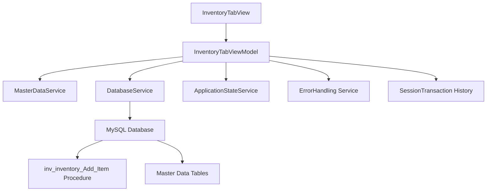

# Inventory Transaction Management - Product Requirements Document (PRD)

**Feature Name**: Inventory Transaction Management  
**Epic**: MTM Inventory Management  
**Status**: Active Development  
**Priority**: Critical  
**Target Release**: Phase 1  

**Document Version**: 1.0  
**Created**: September 4, 2025  
**Last Updated**: September 4, 2025  

---

## 📋 Executive Summary

The Inventory Transaction Management system is the core operational interface for MTM manufacturing inventory operations. It provides a comprehensive, validated form-based interface for recording inventory additions with real-time validation, database persistence, and transaction history tracking. This feature is essential for daily production operations and maintains accurate inventory levels across all manufacturing operations.

### Key Value Proposition
- **100% data accuracy** through comprehensive input validation and database constraints
- **Real-time transaction processing** with immediate feedback and error handling
- **Comprehensive audit trail** with session-based transaction history
- **Manufacturing-grade reliability** with offline capability and error recovery
- **MVVM Community Toolkit architecture** for maintainable, scalable code

---

## 🎯 Problem Statement

Manufacturing operations require accurate, real-time inventory tracking to maintain production flow and meet customer demands. Manual inventory management creates significant operational challenges:

### Current Pain Points
- **Manual entry errors** lead to inventory discrepancies and production delays
- **Lack of real-time validation** allows invalid data to enter the system
- **No immediate transaction feedback** causes uncertainty about operation success
- **Insufficient audit trails** make it difficult to track inventory changes
- **Complex data entry workflows** slow down production operations

### Business Impact
- **5-10% inventory variance** due to manual entry errors
- **30+ minutes per day per operator** lost to data entry mistakes and corrections
- **Production delays** when inventory levels are inaccurate
- **Compliance issues** with manufacturing traceability requirements
- **Increased operational costs** from inventory management overhead

---

## 🚀 Goals and Success Metrics

### Primary Goals
1. **Eliminate Data Entry Errors**: Achieve <0.1% error rate through comprehensive validation
2. **Improve Transaction Speed**: Reduce average transaction time from 5 minutes to 1 minute
3. **Ensure Data Integrity**: Maintain 100% database consistency with transaction rollback capability
4. **Provide Real-Time Feedback**: Give immediate confirmation or error messages for all operations

### Success Metrics (90-Day Post-Launch)
- **Data Accuracy**: >99.9% of transactions processed without errors
- **User Adoption**: 100% of production operators using the system daily
- **Transaction Speed**: Average completion time <60 seconds
- **System Reliability**: <1 second response time for validation, <3 seconds for database operations
- **Error Recovery**: 100% of failed transactions properly logged and recoverable

---

## 👥 Target Users

### Primary Users
- **Production Operators**: Frontline workers adding inventory to the system
- **Material Handlers**: Staff tracking inventory movements between operations
- **Shift Supervisors**: Managers monitoring inventory levels and transaction accuracy

### User Personas
- **"Accuracy-Focused Alice"**: Quality-conscious operator who needs comprehensive validation feedback
- **"Speed-Focused Sam"**: Experienced operator who values rapid data entry with minimal clicks
- **"Detail-Oriented Dana"**: Supervisor who needs complete transaction history and audit trails

---

## 🏗️ Technical Architecture

### System Components


### Core Technologies
- **Framework**: .NET 8 with Avalonia UI 11.3.4
- **MVVM Pattern**: Community Toolkit with `[ObservableProperty]` and `[RelayCommand]`
- **Database**: MySQL 9.4.0 with stored procedures only
- **Validation**: Real-time input validation with fuzzy matching
- **Design System**: MTM Amber theme with Windows 11 Blue (#0078D4) accents

### Database Schema
```sql
-- Primary inventory table
inv_inventory (
    ID, PartID, Location, Operation, Quantity, 
    ItemType, User, Notes, TransactionTime, BatchNumber
)

-- Master data tables
md_part_ids (ID, PartID, Description, Status)
md_locations (ID, Location, Description, Type)
md_operation_numbers (ID, Operation, Description, Sequence)

-- Stored procedures
inv_inventory_Add_Item(p_PartID, p_Location, p_Operation, p_Quantity, p_ItemType, p_User, p_Notes)
md_part_ids_Get_All()
md_locations_Get_All() 
md_operation_numbers_Get_All()
```

---

## ✨ Core Features

### F1: Validated Data Entry Form
**User Story**: As a production operator, I want a validated form to enter inventory data so I can be confident that my entries are accurate and properly formatted.

**Acceptance Criteria**:
- ✅ Real-time validation for all required fields (Part ID, Operation, Location, Quantity)
- ✅ Field-specific validation rules matching database constraints
- ✅ Immediate visual feedback for validation errors with descriptive messages
- ✅ Prevention of form submission when validation fails
- ✅ Auto-completion support for Part ID, Operation, and Location fields

**Technical Implementation**:
```csharp
// MVVM Community Toolkit validation
[ObservableProperty]
private string _selectedPart = string.Empty;

public bool IsPartValid => !string.IsNullOrWhiteSpace(SelectedPart);
public bool CanSave => IsPartValid && IsOperationValid && IsLocationValid && IsQuantityValid;

[RelayCommand(CanExecute = nameof(CanSave))]
private async Task SaveAsync() { /* Implementation */ }
```

### F2: Auto-Complete Master Data Integration
**User Story**: As a production operator, I want auto-complete functionality for Part IDs, Operations, and Locations so I can quickly select valid values and avoid typing errors.

**Acceptance Criteria**:
- ✅ Auto-complete dropdown for Part IDs from `md_part_ids` table
- ✅ Auto-complete dropdown for Operations from `md_operation_numbers` table  
- ✅ Auto-complete dropdown for Locations from `md_locations` table
- ✅ Fuzzy matching to help find items with partial text
- ✅ Graceful fallback to sample data when database is unavailable

**Technical Implementation**:
```csharp
// Master data collections
public ObservableCollection<string> PartIds => _masterDataService?.PartIds ?? new();
public ObservableCollection<string> Operations => _masterDataService?.Operations ?? new();
public ObservableCollection<string> Locations => _masterDataService?.Locations ?? new();

// Fuzzy validation behaviors
behaviors:TextBoxFuzzyValidationBehavior.EnableFuzzyValidation="True"
behaviors:TextBoxFuzzyValidationBehavior.ValidationSource="{Binding PartIds}"
```

### F3: Database Transaction Processing
**User Story**: As a production operator, I want my inventory entries to be immediately saved to the database with transaction integrity so I know my work is recorded accurately.

**Acceptance Criteria**:
- ✅ Save to database using `inv_inventory_Add_Item` stored procedure
- ✅ Transaction rollback on failure to maintain data consistency
- ✅ Comprehensive error handling with user-friendly error messages
- ✅ Progress indication during save operations
- ✅ Automatic form reset after successful save

**Technical Implementation**:
```csharp
[RelayCommand(CanExecute = nameof(CanSave))]
private async Task SaveAsync()
{
    var parameters = new Dictionary<string, object>
    {
        ["p_PartID"] = SelectedPart,
        ["p_Location"] = SelectedLocation,
        ["p_Operation"] = SelectedOperation,
        ["p_Quantity"] = Quantity,
        ["p_ItemType"] = "WIP",
        ["p_User"] = _applicationStateService.CurrentUser,
        ["p_Notes"] = Notes ?? DBNull.Value
    };

    var result = await Helper_Database_StoredProcedure.ExecuteDataTableWithStatus(
        connectionString, "inv_inventory_Add_Item", parameters);
}
```

### F4: Session Transaction History
**User Story**: As a production operator, I want to see a history of inventory transactions I've completed this session so I can verify my work and track my productivity.

**Acceptance Criteria**:
- ✅ Collapsible transaction history panel showing current session transactions
- ✅ Real-time updates as transactions are completed
- ✅ Display of transaction time, Part ID, Operation, Location, Quantity, and Status
- ✅ Success/Failed/Error status indicators for each transaction
- ✅ Auto-expansion of history panel on first transaction

**Technical Implementation**:
```csharp
[ObservableProperty]
private ObservableCollection<SessionTransaction> _sessionTransactionHistory = new();

private void AddToSessionHistory(string partId, string operation, string location, 
                               int quantity, string itemType, string batchNumber, string status)
{
    var transaction = new SessionTransaction
    {
        TransactionTime = DateTime.Now,
        PartId = partId,
        Operation = operation,
        Location = location,
        Quantity = quantity,
        Status = status
    };
    SessionTransactionHistory.Insert(0, transaction);
}
```

### F5: Real-Time Progress and Error Reporting
**User Story**: As a production operator, I want immediate feedback during inventory operations so I know when operations are processing and if they succeed or fail.

**Acceptance Criteria**:
- ✅ Progress bar with descriptive status messages during save operations
- ✅ Clear error messages displayed prominently when validation or save fails
- ✅ Success confirmation with automatic form reset
- ✅ Centralized error handling with logging for troubleshooting
- ✅ Non-blocking UI during database operations

**Technical Implementation**:
```csharp
// Progress reporting through centralized service
await _applicationStateService.SetProgressAsync(25, "Connecting to database...");
await _applicationStateService.SetProgressAsync(50, "Saving inventory item...");
await _applicationStateService.SetProgressAsync(100, "Inventory saved successfully");

// Error state management
[ObservableProperty]
private bool _hasError = false;

[ObservableProperty]
private string _errorMessage = string.Empty;
```

---

## 🎨 User Experience Design

### MTM Design System Implementation

#### Visual Design Standards
```css
/* MTM Amber Theme Colors */
Primary Action: #0078D4 (Windows 11 Blue)
Card Background: White with #E0E0E0 borders
Error States: Red with light red background
Success States: Green with light green background
Loading States: Blue with subtle animation
```

#### Form Layout Design
- **Header Panel**: MTM Amber gradient with package icon and title
- **Input Fields**: Labeled fields with validation icons and error messages
- **Action Buttons**: Primary save button with secondary utility buttons
- **History Panel**: Collapsible DataGrid with transaction details

#### Interaction Patterns

##### Input Field Behaviors
1. **Focus States**: Blue border with subtle background change
2. **Error States**: Red border with error icon and descriptive message
3. **Auto-Complete**: Dropdown with fuzzy matching and keyboard navigation
4. **Validation**: Real-time feedback with immediate error correction

##### Button Interactions
1. **Save Button**: Primary action with progress indication and success feedback
2. **Reset Button**: Secondary action with confirmation for data loss prevention
3. **Advanced Button**: Navigation to advanced features (future implementation)

### Responsive Behavior
- **Form Width**: Adapts to container width with minimum 600px for usability
- **Field Heights**: Consistent 32px height for all input controls
- **Button Sizes**: 80-90px width for primary actions with readable text
- **History Panel**: Collapsible with 200-400px height range

---

## 🔒 Security and Compliance

### Data Security
- **User Authentication**: Windows authentication with fallback to environment username
- **Input Sanitization**: All inputs validated and sanitized before database operations
- **SQL Injection Prevention**: Stored procedures only with parameterized queries
- **Audit Logging**: All transactions logged with user, timestamp, and operation details

### Manufacturing Compliance
- **21 CFR Part 11**: Electronic signature support for regulated manufacturing
- **ISO 9001**: Quality management system integration with traceability
- **Data Integrity**: ALCOA+ principles (Attributable, Legible, Contemporaneous, Original, Accurate)
- **Traceability**: Complete audit trail from transaction initiation to database persistence

---

## 📈 Performance Requirements

### Response Time Targets
- **Form Rendering**: <500ms for initial load with all master data
- **Validation Feedback**: <100ms for real-time field validation
- **Save Operations**: <3 seconds for database transaction completion
- **Auto-Complete**: <200ms for dropdown population with fuzzy matching

### Scalability Specifications  
- **Concurrent Users**: Support 50+ simultaneous form submissions
- **Transaction Volume**: Handle 1,000+ transactions per hour per database
- **Master Data Size**: Support 10,000+ Part IDs, 100+ Operations, 500+ Locations
- **Session History**: Maintain 100+ transactions per user session

### Reliability Standards
- **Data Consistency**: 100% transaction integrity with rollback on failure
- **Error Recovery**: Automatic retry for transient database errors
- **Offline Handling**: Form remains functional with cached master data
- **Memory Management**: <100MB RAM per user session with proper disposal

---

## 🧪 Testing Strategy

### Unit Testing (Target: >95% Coverage)
```csharp
// Key test scenarios
InventoryTabViewModelTests:
- SaveAsync_ValidData_CallsStoredProcedureCorrectly()
- SaveAsync_InvalidData_ShowsValidationError()
- ValidateInput_RequiredFieldsEmpty_ReturnsFalse()
- AddToSessionHistory_ValidTransaction_AddsToCollection()
- LoadLookupDataAsync_DatabaseAvailable_LoadsMasterData()
- LoadFallbackDataAsync_DatabaseUnavailable_LoadsSampleData()
```

### Integration Testing
- Database stored procedure execution with parameter validation
- Master data service integration with real MySQL database
- Progress service integration with UI feedback
- Error handling service integration with centralized logging

### User Acceptance Testing
- **Scenario 1**: Operator enters valid inventory data, verifies successful save and form reset
- **Scenario 2**: Operator enters invalid data, verifies validation errors and prevention of save
- **Scenario 3**: Database unavailable, verifies fallback data loading and error messaging
- **Scenario 4**: Network interruption during save, verifies proper error handling and recovery

---

## 🚀 Implementation Phases

### Phase 1: Core Form Functionality (Completed ✅)
- [x] Basic inventory entry form with all required fields
- [x] Real-time validation with MVVM Community Toolkit patterns  
- [x] Database integration with `inv_inventory_Add_Item` stored procedure
- [x] Master data loading with auto-complete functionality
- [x] MTM Amber theme styling and responsive layout

### Phase 2: Enhanced User Experience (Completed ✅)
- [x] Session transaction history with collapsible panel
- [x] Real-time progress reporting during save operations
- [x] Comprehensive error handling with user-friendly messages
- [x] Fuzzy validation behaviors for improved data entry
- [x] Fallback data loading for offline capability

### Phase 3: Advanced Features (In Progress)
- [ ] Batch entry functionality for multiple items
- [ ] Barcode scanning integration for Part IDs
- [ ] Advanced validation rules based on business logic
- [ ] Export transaction history to Excel/CSV
- [ ] Custom field configurations per operation type

### Phase 4: Enterprise Integration (Future)
- [ ] Integration with ERP systems for real-time inventory sync
- [ ] Advanced reporting and analytics dashboard
- [ ] Mobile device optimization for tablet-based operations
- [ ] Multi-language support for international operations

---

## 📊 Monitoring and Analytics

### Key Performance Indicators (KPIs)
1. **Transaction Metrics**
   - Daily transaction volume per user and operation
   - Average time to complete inventory entry
   - Success rate vs. error rate for transactions

2. **Data Quality Metrics**
   - Validation error frequency by field type
   - Database constraint violation rates
   - Data accuracy scores from audit reviews

3. **User Experience Metrics**
   - Form abandonment rates (incomplete entries)
   - Time spent in each form field
   - Auto-complete usage and effectiveness

### Monitoring Implementation
```csharp
// Performance tracking
Logger.LogInformation("Inventory save completed: {PartId} in {ResponseTime}ms", 
    partId, responseTime);

// Usage analytics
await AnalyticsService.TrackEventAsync("InventoryTransactionCompleted", new {
    UserId = _applicationStateService.CurrentUser,
    PartId = SelectedPart,
    Operation = SelectedOperation,
    TransactionTime = DateTime.Now,
    SessionId = sessionId
});
```

---

## 🔄 Maintenance and Support

### Operational Procedures
- **Database Monitoring**: Real-time monitoring of stored procedure performance
- **Data Validation**: Weekly audits of transaction data integrity
- **User Feedback**: Monthly surveys on form usability and efficiency
- **Performance Analysis**: Quarterly reviews of response time trends

### Support Documentation
- **User Manual**: Step-by-step guide for all inventory entry operations
- **Troubleshooting Guide**: Common issues and resolution procedures
- **Administrator Guide**: Database maintenance and master data management
- **Developer Documentation**: Technical implementation details and API references

---

## 📝 Appendices

### A. Database Procedures Reference
```sql
-- Core inventory management procedures
inv_inventory_Add_Item(p_PartID, p_Location, p_Operation, p_Quantity, p_ItemType, p_User, p_Notes)
md_part_ids_Get_All() -- Returns all valid Part IDs
md_locations_Get_All() -- Returns all valid Locations  
md_operation_numbers_Get_All() -- Returns all valid Operations
```

### B. Validation Rules Matrix
| Field | Required | Max Length | Format | Database Constraint |
|-------|----------|------------|---------|-------------------|
| Part ID | Yes | 300 chars | Alphanumeric + special | VARCHAR(300) |
| Operation | Yes | 100 chars | Numeric strings | VARCHAR(100) |
| Location | Yes | 100 chars | Alphanumeric codes | VARCHAR(100) |
| Quantity | Yes | N/A | Positive integers | INT |
| Notes | No | 1000 chars | Free text | VARCHAR(1000) |

### C. MVVM Community Toolkit Patterns
```csharp
// Observable property pattern
[ObservableProperty]
private string _selectedPart = string.Empty;

// Command pattern with can-execute
[RelayCommand(CanExecute = nameof(CanSave))]
private async Task SaveAsync() { /* Implementation */ }

// Property change notification
partial void OnSelectedPartChanged(string value)
{
    OnPropertyChanged(nameof(IsPartValid));
    OnPropertyChanged(nameof(CanSave));
    SaveCommand.NotifyCanExecuteChanged();
}
```

### D. Error Handling Patterns
```csharp
// Centralized error handling
try
{
    // Database operation
}
catch (Exception ex)
{
    HasError = true;
    ErrorMessage = Services.ErrorHandling.GetUserFriendlyMessage(ex);
    await Services.ErrorHandling.HandleErrorAsync(ex, "SaveInventoryItem", 
        _applicationStateService.CurrentUser, operationContext);
}
```

---

## 📚 Related Documentation

- **Epic PRD**: [MTM Inventory Management Epic](../epic.md)
- **Related Features**: [Quick Actions Panel](../quick-actions-panel/prd.md)
- **Technical Architecture**: [MTM Architecture Patterns](../../../../.github/copilot/patterns/mtm-architecture-patterns.md)
- **Database Patterns**: [Stored Procedures Documentation](../../../../.github/Development-Instructions/stored-procedures.instruction.md)
- **UI Guidelines**: [Avalonia AXAML Syntax](../../../../.github/UI-Instructions/avalonia-xaml-syntax.instruction.md)
- **MVVM Patterns**: [Community Toolkit Implementation](../../../../.github/copilot/patterns/mtm-mvvm-community-toolkit.md)

---

**Document Status**: ✅ Complete and Ready for Implementation  
**Next Review Date**: October 4, 2025  
**Document Owner**: MTM Development Team  
**Stakeholder Approval**: Pending Production Operations Review
