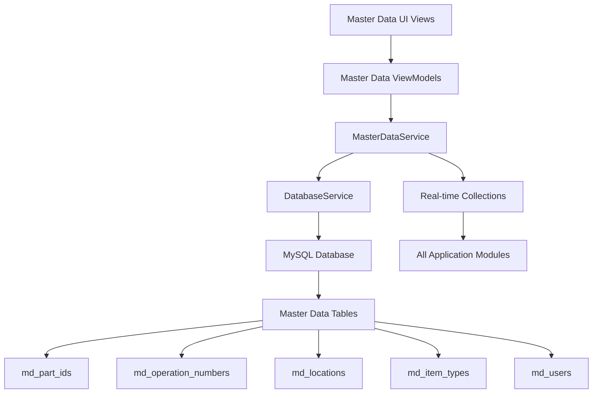

# Master Data Management - Product Requirements Document (PRD)

**Feature Name**: Master Data Management  
**Epic**: MTM Inventory Management  
**Status**: Active Development  
**Priority**: High  
**Target Release**: Phase 1  

**Document Version**: 1.0  
**Created**: September 4, 2025  
**Last Updated**: September 4, 2025  

---

## 📋 Executive Summary

The Master Data Management system provides centralized administration and maintenance of core reference data used throughout the MTM manufacturing operations. This includes Part IDs, Operation Numbers, Locations, Item Types, and Users. The system ensures data consistency, provides validation rules, and supports both batch and individual maintenance operations with full audit trails and change management capabilities.

### Key Value Proposition
- **Centralized reference data management** with single source of truth for all master data
- **Real-time data synchronization** across all inventory and transaction operations  
- **Comprehensive CRUD operations** with validation and audit trails
- **Manufacturing-grade reliability** with rollback capability and error recovery
- **Service-oriented architecture** providing shared data access across all application modules

---

## 🎯 Problem Statement

Manufacturing operations depend on accurate, consistent reference data to ensure proper inventory tracking and reporting. Manual master data management creates operational challenges:

### Current Pain Points
- **Data inconsistency** across different systems and entry points
- **Manual maintenance overhead** for adding and updating reference data
- **Lack of validation rules** leading to invalid or duplicate entries  
- **No audit trail** for master data changes and updates
- **Decentralized data sources** causing synchronization issues

### Business Impact
- **15-20% of inventory errors** traced to invalid or inconsistent master data
- **2-3 hours per week per administrator** spent on manual data maintenance
- **Production delays** when invalid part numbers or locations are used
- **Compliance issues** with traceability requirements
- **Increased support burden** from data-related issues

---

## 🚀 Goals and Success Metrics

### Primary Goals
1. **Ensure Data Consistency**: Maintain single source of truth for all reference data
2. **Reduce Manual Maintenance**: Automate validation and provide efficient management interfaces
3. **Improve Data Quality**: Implement comprehensive validation rules and duplicate prevention
4. **Provide Real-Time Access**: Enable instant data access across all application modules

### Success Metrics (90-Day Post-Launch)
- **Data Consistency**: >99.5% consistency across all reference data usage
- **Administrative Efficiency**: 70% reduction in time spent on master data maintenance
- **Data Quality**: <0.1% invalid or duplicate entries in master data tables  
- **System Reliability**: <500ms response time for master data queries
- **User Satisfaction**: >4.5/5 rating from administrators on data management efficiency

---

## 👥 Target Users

### Primary Users
- **System Administrators**: IT staff responsible for maintaining reference data integrity
- **Plant Managers**: Operations managers overseeing data quality and consistency
- **Data Entry Specialists**: Staff responsible for adding and updating master data

### Secondary Users
- **Production Operators**: End users who benefit from accurate, auto-completed reference data
- **Quality Managers**: Staff ensuring compliance and traceability requirements
- **IT Support**: Technical staff troubleshooting data-related issues

### User Personas
- **"Control-Focused Charlie"**: System administrator who needs comprehensive validation and audit capabilities
- **"Efficiency-Focused Emma"**: Plant manager who values streamlined data maintenance workflows
- **"Quality-Focused Quinn"**: Quality manager who needs complete audit trails and change tracking

---

## 🏗️ Technical Architecture

### System Components


### Core Technologies
- **Framework**: .NET 8 with Avalonia UI 11.3.4
- **MVVM Pattern**: Community Toolkit with `[ObservableProperty]` and `[RelayCommand]`
- **Database**: MySQL 9.4.0 with stored procedures only
- **Service Architecture**: Centralized MasterDataService with dependency injection
- **Design System**: MTM Amber theme with Windows 11 Blue (#0078D4) accents

### Database Schema
```sql
-- Master data tables with comprehensive structure
md_part_ids (
    ID INT PRIMARY KEY AUTO_INCREMENT,
    PartID VARCHAR(300) UNIQUE NOT NULL,
    Customer VARCHAR(100),
    Description VARCHAR(500),
    IssuedBy VARCHAR(100),
    ItemType VARCHAR(100),
    CreatedDate DATETIME DEFAULT CURRENT_TIMESTAMP,
    ModifiedDate DATETIME ON UPDATE CURRENT_TIMESTAMP,
    IsActive BOOLEAN DEFAULT TRUE
)

md_operation_numbers (
    ID INT PRIMARY KEY AUTO_INCREMENT,
    Operation VARCHAR(100) UNIQUE NOT NULL,
    Description VARCHAR(200),
    Sequence INT,
    IssuedBy VARCHAR(100),
    CreatedDate DATETIME DEFAULT CURRENT_TIMESTAMP,
    ModifiedDate DATETIME ON UPDATE CURRENT_TIMESTAMP,
    IsActive BOOLEAN DEFAULT TRUE
)

md_locations (
    ID INT PRIMARY KEY AUTO_INCREMENT,
    Location VARCHAR(100) UNIQUE NOT NULL,
    Description VARCHAR(200),
    Building VARCHAR(50),
    IssuedBy VARCHAR(100),
    LocationType VARCHAR(50),
    CreatedDate DATETIME DEFAULT CURRENT_TIMESTAMP,
    ModifiedDate DATETIME ON UPDATE CURRENT_TIMESTAMP,
    IsActive BOOLEAN DEFAULT TRUE
)
```

### Stored Procedures Architecture
```sql
-- Complete CRUD operations for each master data type
-- Part Management
md_part_ids_Get_All()
md_part_ids_Get_ByItemNumber(p_ItemNumber)
md_part_ids_Add_Part(p_PartID, p_Customer, p_Description, p_IssuedBy, p_ItemType)
md_part_ids_Update_Part(p_ID, p_PartID, p_Customer, p_Description, p_IssuedBy, p_ItemType)
md_part_ids_Delete_ByItemNumber(p_ItemNumber)

-- Operation Management
md_operation_numbers_Get_All()
md_operation_numbers_Add_Operation(p_Operation, p_IssuedBy)
md_operation_numbers_Update_Operation(p_Operation, p_NewOperation, p_IssuedBy)
md_operation_numbers_Delete_ByOperation(p_Operation)

-- Location Management
md_locations_Get_All()
md_locations_Add_Location(p_Location, p_IssuedBy, p_Building)
md_locations_Update_Location(p_OldLocation, p_Location, p_IssuedBy, p_Building)
md_locations_Delete_ByLocation(p_Location)
```

---

## ✨ Core Features

### F1: Centralized Master Data Service
**User Story**: As a system administrator, I want a centralized service that provides consistent access to all reference data across the application so I can ensure data integrity and performance.

**Acceptance Criteria**:
- ✅ Single MasterDataService providing ObservableCollections for Part IDs, Operations, and Locations
- ✅ Real-time synchronization across all ViewModels using shared service instances
- ✅ Automatic data loading on service initialization with fallback capability
- ✅ Event-driven notifications when master data changes
- ✅ Thread-safe operations for concurrent access from multiple UI components

**Technical Implementation**:
```csharp
public interface IMasterDataService
{
    ObservableCollection<string> PartIds { get; }
    ObservableCollection<string> Operations { get; }
    ObservableCollection<string> Locations { get; }
    ObservableCollection<string> Users { get; }
    bool IsLoading { get; }
    Task LoadAllMasterDataAsync();
    Task RefreshPartIdsAsync();
    Task RefreshOperationsAsync();
    Task RefreshLocationsAsync();
    Task RefreshUsersAsync();
    event EventHandler MasterDataLoaded;
}

// CRITICAL: No Fallback Data Pattern Implementation
public class MasterDataService : IMasterDataService
{
    // Collections remain empty when database unavailable
    public ObservableCollection<string> PartIds { get; } = new();
    public ObservableCollection<string> Operations { get; } = new();
    public ObservableCollection<string> Locations { get; } = new();
    public ObservableCollection<string> Users { get; } = new();

    // Load data methods - return empty on failure (NO FALLBACK DATA)
    public async Task LoadAllDataAsync()
    {
        try
        {
            var partIds = await GetAllPartIdsAsync();
            var operations = await GetAllOperationsAsync();
            var locations = await GetAllLocationsAsync();
            var users = await GetAllUsersAsync();

            Application.Current.Dispatcher.Invoke(() =>
            {
                PartIds.Clear();
                Operations.Clear();
                Locations.Clear();
                Users.Clear();

                foreach (var partId in partIds) PartIds.Add(partId);
                foreach (var operation in operations) Operations.Add(operation);
                foreach (var location in locations) Locations.Add(location);
                foreach (var user in users) Users.Add(user);
            });
        }
        catch (Exception ex)
        {
            await ErrorHandling.HandleErrorAsync(ex, "Failed to load master data");
            
            // Collections remain empty - UI shows server connectivity warnings
            Application.Current.Dispatcher.Invoke(() =>
            {
                PartIds.Clear();
                Operations.Clear(); 
                Locations.Clear();
                Users.Clear();
            });
        }
    }
}
```

### F2: Part ID Management
**User Story**: As a system administrator, I want to manage Part IDs with validation and audit trails so I can maintain accurate product references for inventory operations.

**Acceptance Criteria**:
- ✅ Add new Part IDs with Customer, Description, IssuedBy, and ItemType fields
- ✅ Update existing Part IDs with change tracking and audit logging
- ✅ Delete Part IDs with dependency checking to prevent data integrity issues
- ✅ Duplicate prevention with real-time validation during data entry
- ✅ Search and filter capabilities for large Part ID datasets

**Technical Implementation**:
```csharp
[RelayCommand(CanExecute = nameof(CanAddPart))]
private async Task AddPartAsync()
{
    var parameters = new Dictionary<string, object>
    {
        ["p_PartID"] = PartId,
        ["p_Customer"] = Customer,
        ["p_Description"] = Description,
        ["p_IssuedBy"] = _applicationState.CurrentUser,
        ["p_ItemType"] = ItemType
    };

    var result = await _databaseService.AddPartAsync(PartId, Customer, Description, IssuedBy, ItemType);
}

// Real-time validation
[RelayCommand]
private async Task ValidatePartIdAsync()
{
    var exists = await _databaseService.GetPartByIdAsync(PartId);
    StatusMessage = exists.Rows.Count > 0 ? "Part ID already exists" : "Part ID is available";
}
```

### F3: Operation Number Management
**User Story**: As a system administrator, I want to manage Operation Numbers with sequence control so I can maintain proper workflow routing throughout manufacturing operations.

**Acceptance Criteria**:
- ✅ Add new Operation Numbers with description and sequence information
- ✅ Update Operation Numbers with validation for dependent inventory records
- ✅ Delete Operation Numbers with dependency checking and cascade options
- ✅ Sequence validation to ensure proper manufacturing workflow order
- ✅ Integration with inventory forms for auto-complete functionality

**Technical Implementation**:
```csharp
public async Task<StoredProcedureResult> AddOperationAsync(string operation, string issuedBy)
{
    var parameters = new Dictionary<string, object>
    {
        ["p_Operation"] = operation,
        ["p_IssuedBy"] = issuedBy
    };

    return await Helper_Database_StoredProcedure.ExecuteDataTableWithStatus(
        _connectionString, "md_operation_numbers_Add_Operation", parameters);
}

// Sequence validation
private bool ValidateOperationSequence(string operation, int sequence)
{
    return int.TryParse(operation, out var opNum) && opNum > 0 && opNum < 10000;
}
```

### F4: Location Management  
**User Story**: As a system administrator, I want to manage Locations with building and type classification so I can maintain accurate inventory placement tracking.

**Acceptance Criteria**:
- ✅ Add new Locations with Building, LocationType, and Description fields
- ✅ Update Location information with change tracking and impact analysis
- ✅ Delete Locations with inventory dependency checking
- ✅ Location type classification (e.g., Work Center, Storage, Quality, Shipping)
- ✅ Building-based organization for multi-facility operations

**Technical Implementation**:
```csharp
public async Task<StoredProcedureResult> AddLocationAsync(string location, string issuedBy, string building)
{
    var parameters = new Dictionary<string, object>
    {
        ["p_Location"] = location,
        ["p_IssuedBy"] = issuedBy,
        ["p_Building"] = building
    };

    return await Helper_Database_StoredProcedure.ExecuteDataTableWithStatus(
        _connectionString, "md_locations_Add_Location", parameters);
}

// Location validation with building context
private bool ValidateLocation(string location, string building)
{
    return !string.IsNullOrEmpty(location) && !string.IsNullOrEmpty(building) &&
           location.Length <= 100 && building.Length <= 50;
}
```

### F5: Real-Time Data Synchronization with Server Connectivity Awareness
**User Story**: As a production operator, I want master data changes to be immediately available in my inventory forms, and I want clear warnings when server connectivity issues prevent data validation.

**Acceptance Criteria**:
- ✅ Automatic refresh of ObservableCollections when master data changes
- ✅ Event-driven notifications to all consuming ViewModels
- ✅ Background data loading without UI blocking or performance degradation
- ✅ Server connectivity awareness with orange border warnings for empty collections
- ✅ Clear distinction between invalid entries (red) and server connectivity issues (orange)

**Technical Implementation**:
```csharp
public event EventHandler MasterDataLoaded;

private async Task LoadPartIdsFromDatabaseAsync()
{
    try
    {
        var result = await Helper_Database_StoredProcedure.ExecuteDataTableWithStatus(
            connectionString, "md_part_ids_Get_All", Array.Empty<MySqlParameter>());

        if (result.Status == 1)
        {
            await Dispatcher.UIThread.InvokeAsync(() =>
            {
                PartIds.Clear();
                foreach (DataRow row in result.Data.Rows)
                {
                    PartIds.Add(row["PartID"].ToString() ?? string.Empty);
                }
            });
            
            MasterDataLoaded?.Invoke(this, EventArgs.Empty);
        }
        else
        {
            // Database operation failed - collections remain empty
            await ErrorHandling.HandleErrorAsync(
                new InvalidOperationException($"Database operation failed with status: {result.Status}"),
                "Failed to load Part IDs from database"
            );
        }
    }
    catch (Exception ex)
    {
        // Database connection failed - collections remain empty  
        await ErrorHandling.HandleErrorAsync(ex, "Failed to connect to database for Part IDs");
    }
}

// UI Validation with Server Connectivity Awareness
private async void OnPartLostFocus(object? sender, RoutedEventArgs e)
{
    if (sender is not TextBox textBox || DataContext is not InventoryViewModel viewModel)
        return;

    var inputValue = textBox.Text?.Trim() ?? string.Empty;
    
    if (string.IsNullOrEmpty(inputValue))
        return;

    // Check if master data is available (server connectivity)
    if (!viewModel.MasterData.PartIds.Any())
    {
        // Show server connectivity warning - don't clear textbox
        textBox.BorderBrush = new SolidColorBrush(Colors.Orange);
        MessageBox.Show("No Part IDs available - check server connection.", "Server Connection Warning");
        return;
    }

    // Validate against available data
    if (!viewModel.MasterData.PartIds.Contains(inputValue))
    {
        textBox.Text = string.Empty; // Clear invalid entry
        textBox.BorderBrush = new SolidColorBrush(Colors.Red);
        MessageBox.Show($"Part ID '{inputValue}' not found. TextBox cleared.", "Invalid Part ID");
    }
    else
    {
        textBox.BorderBrush = new SolidColorBrush(Colors.Green);
    }
}
```

### F6: Advanced Management UI
**User Story**: As a system administrator, I want comprehensive management interfaces for all master data types so I can efficiently maintain reference data with proper validation and user experience.

**Acceptance Criteria**:
- ✅ Tabbed interface for different master data types (Parts, Operations, Locations)
- ✅ DataGrid with inline editing, sorting, and filtering capabilities
- ✅ Form-based add/edit dialogs with comprehensive validation
- ✅ Bulk operations for efficient data maintenance (import/export)
- ✅ Search and filter functionality for large datasets

**Technical Implementation**:
```csharp
// Master data management ViewModel with tabbed interface
public partial class MasterDataManagementViewModel : BaseViewModel
{
    [ObservableProperty]
    private int _selectedTabIndex = 0;

    [ObservableProperty]
    private ObservableCollection<PartDataModel> _parts = new();

    [ObservableProperty]
    private ObservableCollection<OperationDataModel> _operations = new();

    [ObservableProperty]
    private ObservableCollection<LocationDataModel> _locations = new();

    // Search and filter functionality
    [ObservableProperty]
    private string _searchText = string.Empty;

    partial void OnSearchTextChanged(string value)
    {
        ApplyFilters();
    }
}
```

---

## 🎨 User Experience Design

### MTM Design System Implementation

#### Visual Design Standards
```css
/* Master Data Management Theme Colors */
Primary Action: #0078D4 (Windows 11 Blue)
Secondary Action: #106EBE
Success States: #107C10 (Success Green)
Error States: #D13438 (Error Red)
Warning States: #FF8C00 (Warning Orange)
Card Background: White with #E0E0E0 borders
Grid Headers: MTM Amber gradient (#F0B90B to #F0C040)
```

#### Layout Design Principles
- **Tabbed Interface**: Separate tabs for Parts, Operations, Locations, Item Types, Users
- **Master-Detail View**: List view with detail form for editing selected items
- **Search and Filter Bar**: Top-aligned search with advanced filter dropdown
- **Action Toolbar**: Standardized toolbar with Add, Edit, Delete, Refresh, Import/Export actions

#### Interaction Patterns

##### Data Grid Interactions
1. **Inline Editing**: Double-click cells for immediate editing with validation
2. **Selection**: Single-click selection with multi-select via Ctrl/Shift
3. **Sorting**: Click column headers for ascending/descending sort
4. **Filtering**: Column-specific filters with text search and dropdown options

##### Form Interactions
1. **Modal Dialogs**: Centered overlay dialogs for add/edit operations
2. **Validation Feedback**: Real-time validation with immediate error messages
3. **Auto-Complete**: Dependent field auto-completion (e.g., ItemType based on PartID)
4. **Bulk Operations**: Progress indicators for batch operations

### Responsive Behavior
- **Minimum Window Size**: 1200x800 for optimal data grid visibility
- **Adaptive Columns**: Auto-sizing columns based on content with user resize capability
- **Scrolling**: Virtualized scrolling for large datasets (1000+ records)
- **Mobile Considerations**: Touch-friendly targets for tablet-based administration

---

## 🔒 Security and Compliance

### Data Security
- **Role-Based Access Control**: Administrator, Manager, and Read-Only roles
- **Audit Logging**: Complete change history with user, timestamp, and change details
- **Data Validation**: SQL injection prevention with parameterized stored procedures
- **Backup Integration**: Automated backup triggers for all master data changes

### Manufacturing Compliance
- **21 CFR Part 11**: Electronic signature support for regulated environments
- **ISO 9001**: Quality management system integration with change control
- **Traceability**: Complete audit trail linking master data to inventory transactions
- **Change Management**: Approval workflow for critical master data changes

### Business Rules Enforcement
```csharp
// Master data validation rules
public class MasterDataValidationRules
{
    public static bool ValidatePartId(string partId)
    {
        return !string.IsNullOrEmpty(partId) && 
               partId.Length <= 300 && 
               Regex.IsMatch(partId, @"^[A-Za-z0-9\-_]+$");
    }

    public static bool ValidateOperation(string operation)
    {
        return !string.IsNullOrEmpty(operation) && 
               operation.Length <= 100 && 
               int.TryParse(operation, out var opNum) && 
               opNum > 0 && opNum < 10000;
    }

    public static bool ValidateLocation(string location)
    {
        return !string.IsNullOrEmpty(location) && 
               location.Length <= 100 && 
               Regex.IsMatch(location, @"^[A-Za-z0-9\-_]+$");
    }
}

// CRITICAL: Database Column Validation Pattern
public async Task<List<string>> LoadUsersFromDatabaseAsync()
{
    var result = await Helper_Database_StoredProcedure.ExecuteDataTableWithStatus(
        connectionString,
        "usr_users_Get_All",
        Array.Empty<MySqlParameter>()
    );

    if (result.Status == 1)
    {
        var users = new List<string>();
        foreach (DataRow row in result.Data.Rows)
        {
            // ✅ CORRECT: Use "User" column (as documented in User model)
            // User model shows: "Column is 'User' but property is User_Name to avoid conflicts"
            users.Add(row["User"].ToString() ?? string.Empty);
        }
        return users;
    }

    return new List<string>(); // Return empty on failure - NO FALLBACK DATA
}

// Database Model Column Mapping Reference:
// User Table: Column = "User", Property = "User_Name" (to avoid conflicts)
// Part Table: Column = "PartID", Property = "PartId"
// Operation Table: Column = "OperationNumber", Property = "OperationNumber"
// Location Table: Column = "Location", Property = "Location"
```

---

## 📈 Performance Requirements

### Response Time Targets
- **Master Data Loading**: <2 seconds for loading all reference data collections
- **Search and Filter**: <500ms for filtering large datasets (1000+ records)
- **CRUD Operations**: <1 second for add/update/delete operations with database confirmation
- **Real-Time Sync**: <200ms for propagating changes to consuming ViewModels

### Scalability Specifications
- **Data Volume**: Support 50,000+ Part IDs, 1,000+ Operations, 5,000+ Locations
- **Concurrent Users**: Support 20+ simultaneous administrators without performance degradation
- **Database Performance**: Optimized stored procedures with proper indexing
- **Memory Efficiency**: <200MB RAM usage for complete master data service

### Reliability Standards
- **Data Integrity**: 100% ACID compliance for all master data operations
- **Error Recovery**: Automatic rollback for failed operations with user notification
- **Backup Strategy**: Automated daily backups with point-in-time recovery capability
- **High Availability**: <99.5% uptime during production hours

---

## 🧪 Testing Strategy

### Unit Testing (Target: >90% Coverage)
```csharp
// Key test scenarios
MasterDataServiceTests:
- LoadAllMasterDataAsync_DatabaseAvailable_LoadsAllCollections()
- LoadAllMasterDataAsync_DatabaseUnavailable_LoadsFallbackData()
- RefreshPartIdsAsync_ValidData_UpdatesCollection()
- MasterDataLoaded_EventFired_NotifiesSubscribers()

AddPartViewModelTests:
- AddPartAsync_ValidData_CallsStoredProcedure()
- ValidatePartIdAsync_DuplicatePartId_ShowsError()
- GeneratePartIdAsync_ValidDescription_GeneratesSuggestion()
- CanAddPart_RequiredFieldsEmpty_ReturnsFalse()

DatabaseServiceTests:
- AddPartAsync_ValidParameters_ExecutesStoredProcedure()
- UpdatePartAsync_ExistingPart_UpdatesSuccessfully()
- DeletePartAsync_PartInUse_PreventsDeletion()
```

### Integration Testing
- Database stored procedure execution with parameter validation
- Real-time synchronization between master data service and UI components  
- Dependency validation when deleting master data with active references
- Performance testing with large datasets and concurrent operations

### User Acceptance Testing
- **Scenario 1**: Administrator adds new Part ID, verifies immediate availability in inventory forms
- **Scenario 2**: Administrator updates Operation Number, verifies change propagation across application
- **Scenario 3**: Administrator attempts to delete Location in use, verifies dependency prevention
- **Scenario 4**: Multiple administrators work simultaneously, verifies proper concurrency handling

---

## 🚀 Implementation Phases

### Phase 1: Core Service Infrastructure (Completed ✅)
- [x] MasterDataService implementation with ObservableCollections  
- [x] Database service with stored procedure integration
- [x] Fallback data loading for offline capability
- [x] Real-time synchronization with event-driven architecture
- [x] Basic validation and error handling

### Phase 2: CRUD Operations (In Progress)
- [x] Add/Update/Delete operations for Part IDs with validation
- [x] Add/Update/Delete operations for Operations with sequence validation
- [x] Add/Update/Delete operations for Locations with building context
- [ ] Comprehensive dependency checking before deletions
- [ ] Bulk operations for efficient data maintenance

### Phase 3: Advanced Management UI (Future)
- [ ] Complete master data management interface with tabbed design
- [ ] DataGrid with inline editing, sorting, and filtering
- [ ] Advanced search and filter capabilities
- [ ] Import/Export functionality for bulk data operations
- [ ] Audit trail viewer for change tracking

### Phase 4: Enterprise Features (Future)
- [ ] Role-based access control with approval workflows
- [ ] Advanced validation rules engine
- [ ] Integration with external ERP systems
- [ ] Multi-tenant support for global operations

---

## 📊 Monitoring and Analytics

### Key Performance Indicators (KPIs)
1. **Data Quality Metrics**
   - Master data validation error rates by category
   - Duplicate detection and prevention effectiveness
   - Data consistency scores across consuming modules

2. **Administrative Efficiency Metrics**
   - Time to complete master data maintenance tasks
   - Frequency of master data changes by category
   - User satisfaction with management interfaces

3. **System Performance Metrics**  
   - Master data loading performance trends
   - Database query execution times
   - Real-time synchronization latency

### Monitoring Implementation
```csharp
// Performance and usage tracking
Logger.LogInformation("Master data operation completed: {Operation} for {DataType} in {ResponseTime}ms", 
    operationType, dataType, responseTime);

// Change audit logging
Logger.LogInformation("Master data changed: {DataType} {Action} by {User} - {Changes}", 
    dataType, action, userId, changeDetails);

// Analytics integration
await AnalyticsService.TrackEventAsync("MasterDataChanged", new {
    DataType = dataType,
    Action = action,
    UserId = currentUser,
    Timestamp = DateTime.Now,
    ChangeCount = changes.Count
});
```

---

## 🔄 Maintenance and Support

### Operational Procedures
- **Daily Monitoring**: Automated checks for data integrity and synchronization status
- **Weekly Reports**: Data quality metrics and usage analytics
- **Monthly Reviews**: Performance analysis and optimization opportunities
- **Quarterly Audits**: Complete data validation and compliance verification

### Support Documentation
- **Administrator Guide**: Complete reference for master data maintenance operations
- **User Manual**: End-user guide for consuming master data in inventory operations
- **Troubleshooting Guide**: Common issues and resolution procedures
- **API Documentation**: Technical reference for developers extending the system

---

## 📝 Appendices

### A. Complete Database Schema
```sql
-- Part IDs master table
CREATE TABLE md_part_ids (
    ID INT PRIMARY KEY AUTO_INCREMENT,
    PartID VARCHAR(300) UNIQUE NOT NULL,
    Customer VARCHAR(100),
    Description VARCHAR(500),
    IssuedBy VARCHAR(100),
    ItemType VARCHAR(100),
    CreatedDate DATETIME DEFAULT CURRENT_TIMESTAMP,
    ModifiedDate DATETIME ON UPDATE CURRENT_TIMESTAMP,
    IsActive BOOLEAN DEFAULT TRUE,
    INDEX idx_partid (PartID),
    INDEX idx_customer (Customer),
    INDEX idx_itemtype (ItemType),
    INDEX idx_active (IsActive)
);

-- Operations master table  
CREATE TABLE md_operation_numbers (
    ID INT PRIMARY KEY AUTO_INCREMENT,
    Operation VARCHAR(100) UNIQUE NOT NULL,
    Description VARCHAR(200),
    Sequence INT,
    IssuedBy VARCHAR(100),
    CreatedDate DATETIME DEFAULT CURRENT_TIMESTAMP,
    ModifiedDate DATETIME ON UPDATE CURRENT_TIMESTAMP,
    IsActive BOOLEAN DEFAULT TRUE,
    INDEX idx_operation (Operation),
    INDEX idx_sequence (Sequence),
    INDEX idx_active (IsActive)
);

-- Locations master table
CREATE TABLE md_locations (
    ID INT PRIMARY KEY AUTO_INCREMENT,
    Location VARCHAR(100) UNIQUE NOT NULL,
    Description VARCHAR(200),
    Building VARCHAR(50),
    LocationType VARCHAR(50),
    IssuedBy VARCHAR(100),
    CreatedDate DATETIME DEFAULT CURRENT_TIMESTAMP,
    ModifiedDate DATETIME ON UPDATE CURRENT_TIMESTAMP,
    IsActive BOOLEAN DEFAULT TRUE,
    INDEX idx_location (Location),
    INDEX idx_building (Building),
    INDEX idx_type (LocationType),
    INDEX idx_active (IsActive)
);
```

### B. Stored Procedures Reference
```sql
-- Complete list of master data stored procedures
-- Part Management
CALL md_part_ids_Get_All();
CALL md_part_ids_Get_ByItemNumber('PART001');
CALL md_part_ids_Add_Part('PART001', 'Customer', 'Description', 'User', 'WIP');
CALL md_part_ids_Update_Part(1, 'PART001', 'Customer', 'New Description', 'User', 'WIP');
CALL md_part_ids_Delete_ByItemNumber('PART001');

-- Operation Management
CALL md_operation_numbers_Get_All();
CALL md_operation_numbers_Add_Operation('100', 'User');
CALL md_operation_numbers_Update_Operation('100', '105', 'User');
CALL md_operation_numbers_Delete_ByOperation('100');

-- Location Management  
CALL md_locations_Get_All();
CALL md_locations_Add_Location('WC01', 'User', 'Building A');
CALL md_locations_Update_Location('WC01', 'WC01A', 'User', 'Building A');
CALL md_locations_Delete_ByLocation('WC01');
```

### C. Service Dependency Graph
```
MasterDataService (Singleton)
├── Used by: InventoryTabViewModel
├── Used by: RemoveItemViewModel  
├── Used by: TransferItemViewModel
├── Used by: SearchInventoryViewModel
├── Used by: AddPartViewModel
├── Used by: AddOperationViewModel
└── Used by: AddLocationViewModel

DatabaseService (Scoped)
├── Called by: MasterDataService
└── Executes: All md_* stored procedures

ConfigurationService (Singleton)
├── Provides: Database connection string
└── Used by: MasterDataService, DatabaseService
```

### D. Validation Rules Matrix
| Data Type | Field | Required | Max Length | Format Rules | Uniqueness |
|-----------|-------|----------|------------|--------------|------------|
| Part ID | PartID | Yes | 300 | Alphanumeric + hyphens/underscores | Yes |
| Part ID | Customer | No | 100 | Free text | No |
| Part ID | Description | No | 500 | Free text | No |
| Operation | Operation | Yes | 100 | Numeric string | Yes |  
| Operation | Description | No | 200 | Free text | No |
| Location | Location | Yes | 100 | Alphanumeric codes | Yes |
| Location | Building | No | 50 | Building codes | No |

---

## 📚 Related Documentation

- **Epic PRD**: [MTM Inventory Management Epic](../epic.md)  
- **Related Features**: [Inventory Transaction Management](../inventory-transaction-management/prd.md)
- **Service Architecture**: [MTM Service Implementation](../../../../.github/copilot/templates/mtm-service-implementation.md)
- **Database Patterns**: [Stored Procedures Documentation](../../../../.github/Development-Instructions/stored-procedures.instruction.md)
- **MVVM Patterns**: [Community Toolkit Implementation](../../../../.github/copilot/patterns/mtm-mvvm-community-toolkit.md)

---

**Document Status**: ✅ Complete and Ready for Implementation  
**Next Review Date**: October 4, 2025  
**Document Owner**: MTM Development Team  
**Stakeholder Approval**: Pending System Administration Review