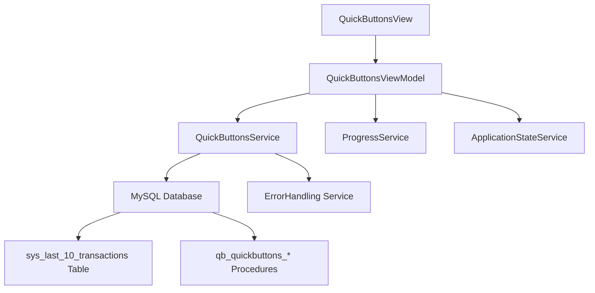

# Quick Actions Panel - Product Requirements Document (PRD)

**Feature Name**: Quick Actions Panel  
**Epic**: MTM Inventory Management  
**Status**: Active Development  
**Priority**: High  
**Target Release**: Phase 1  

**Document Version**: 1.0  
**Created**: September 4, 2025  
**Last Updated**: September 4, 2025  

---

## 📋 Executive Summary

The Quick Actions Panel provides manufacturing operators with instant access to their 10 most recent inventory transactions, enabling rapid execution of repetitive inventory operations. This feature significantly reduces data entry time by providing one-click population of inventory forms with previously used part numbers, operations, and quantities.

### Key Value Proposition
- **80% reduction in data entry time** for repetitive inventory operations
- **Instant access** to 10 most recent transactions via single-click actions  
- **Drag-and-drop reordering** for personalized workflow optimization
- **Real-time synchronization** with inventory transaction database
- **Industrial-grade UI design** optimized for manufacturing environments

---

## 🎯 Problem Statement

Manufacturing operators frequently perform similar inventory transactions throughout their shifts, requiring repetitive manual entry of the same part numbers, operation codes, and quantities. This creates:

### Current Pain Points
- **Repetitive data entry** slows down inventory transactions
- **Manual typing errors** in part numbers and operation codes
- **Workflow interruption** from having to remember previous transaction details
- **Inefficient access** to recently used transaction parameters
- **No personalization** of frequently used operations

### Business Impact
- Average **2-3 minutes per transaction** due to manual data entry
- **15-20% error rate** in manually typed part numbers
- **Operator frustration** from repetitive tasks
- **Reduced throughput** during peak production periods

---

## 🚀 Goals and Success Metrics

### Primary Goals
1. **Reduce Transaction Time**: Cut average transaction time from 2-3 minutes to 30-60 seconds
2. **Minimize Data Entry Errors**: Reduce part number errors from 15-20% to <2%
3. **Improve User Experience**: Provide intuitive, one-click access to recent transactions
4. **Enable Personalization**: Allow users to reorder buttons based on their workflow patterns

### Success Metrics (90-Day Post-Launch)
- **Transaction Speed**: >80% reduction in data entry time
- **Error Rate**: <2% part number entry errors
- **User Adoption**: >90% of active users utilize quick actions weekly
- **User Satisfaction**: >4.5/5 rating on usability surveys
- **System Performance**: <500ms response time for button actions

---

## 👥 Target Users

### Primary Users
- **Production Operators**: Frontline workers performing inventory transactions
- **Material Handlers**: Staff moving inventory between operations
- **Shift Supervisors**: Managers monitoring and adjusting inventory levels

### User Personas
- **"Speed-Focused Sarah"**: Experienced operator who values efficiency over customization
- **"Detail-Oriented David"**: Quality-conscious supervisor who needs accurate data quickly  
- **"Multi-Task Maria"**: Material handler juggling multiple part numbers and locations

---

## 🏗️ Technical Architecture

### System Components


### Core Technologies
- **Framework**: .NET 8 with Avalonia UI 11.3.4
- **MVVM Pattern**: Community Toolkit with `[ObservableProperty]` and `[RelayCommand]`
- **Database**: MySQL 9.4.0 with stored procedures only
- **Design System**: MTM Amber theme with Windows 11 Blue (#0078D4) accents

### Database Schema
```sql
-- Core transaction tracking
sys_last_10_transactions (
    ID, UserID, PartID, Operation, Quantity, 
    TransactionType, ReceiveDate, Notes
)

-- Quick button persistence
qb_quickbuttons_* stored procedures:
- qb_quickbuttons_Get_ByUser
- qb_quickbuttons_Save  
- qb_quickbuttons_Remove
- qb_quickbuttons_Clear_ByUser
- sys_last_10_transactions_Add_Transaction
- sys_last_10_transactions_Get_ByUser
```

---

## ✨ Core Features

### F1: Recent Transactions Display
**User Story**: As a production operator, I want to see my 10 most recent inventory transactions so I can quickly repeat common operations.

**Acceptance Criteria**:
- ✅ Display 10 most recent transactions in descending chronological order
- ✅ Show Part ID, Operation, Quantity for each transaction
- ✅ Update automatically when new transactions are completed
- ✅ Handle empty slots gracefully with "Empty Slot" placeholders
- ✅ Real-time synchronization with `sys_last_10_transactions` table

**Technical Implementation**:
- Load data via `QuickButtonsService.LoadLast10TransactionsAsync()`
- Use stored procedure `sys_last_10_transactions_Get_ByUser`
- Observable collection binding with `ObservableCollection<QuickButtonItemViewModel>`
- Auto-refresh on inventory transaction completion

### F2: One-Click Action Execution
**User Story**: As a production operator, I want to click a quick action button to automatically populate the inventory form with that transaction's details.

**Acceptance Criteria**:
- ✅ Single click populates Part ID, Operation, Quantity in active inventory tab
- ✅ Triggers `QuickActionExecuted` event with transaction parameters
- ✅ Updates last used timestamp in database
- ✅ Provides visual feedback during action execution
- ✅ Handles empty slot clicks gracefully (no action)

**Technical Implementation**:
- `ExecuteQuickActionCommand` with `QuickActionExecutedEventArgs`
- Event-driven communication with inventory forms
- Progress indication via `ProgressService`
- Database update via `QuickButtonsService.SaveQuickButtonAsync()`

### F3: Drag-and-Drop Reordering
**User Story**: As a production operator, I want to reorder my quick action buttons so the most frequently used transactions are at the top.

**Acceptance Criteria**:
- ✅ Drag buttons to reorder positions within non-empty range
- ✅ Visual feedback during drag operation (opacity, transform effects)
- ✅ Persist new order to database immediately
- ✅ Prevent moving empty buttons or beyond valid boundaries
- ✅ Revert UI changes if database update fails

**Technical Implementation**:
- Pointer event handlers: `OnButtonPointerPressed`, `OnButtonPointerMoved`, `OnButtonPointerReleased`
- Local collection reordering with `QuickButtons.Move()`
- Database persistence via `QuickButtonsService.ReorderQuickButtonsAsync()`
- Validation logic in `CanReorderButton()` method

### F4: Context Menu Management
**User Story**: As a production operator, I want to manage my quick action buttons through right-click options for advanced operations.

**Acceptance Criteria**:
- ✅ Right-click context menu with management options
- ✅ Individual button removal with confirmation
- ✅ Move up/down commands with boundary validation  
- ✅ Bulk operations: Clear All, Refresh, Reset Order
- ✅ Visual icons and tooltips for all menu items

**Technical Implementation**:
- Avalonia `ContextMenu` with command bindings
- Commands: `RemoveButtonCommand`, `MoveButtonUpCommand`, `MoveButtonDownCommand`
- Bulk operations: `ClearAllButtonsCommand`, `RefreshButtonsCommand`, `ResetOrderCommand`
- Permission-based command availability

### F5: Real-Time Synchronization
**User Story**: As a production operator, I want my quick action buttons to automatically update when I complete inventory transactions so my recent history is always current.

**Acceptance Criteria**:
- ✅ Auto-refresh when new transactions are completed in any inventory tab
- ✅ Service-level event notifications via `QuickButtonsChangedEventArgs`
- ✅ Background data loading without blocking UI operations
- ✅ Graceful handling of database connectivity issues
- ✅ User notification of sync status and errors

**Technical Implementation**:
- `AddQuickButtonFromOperationAsync()` method integration
- Event-driven architecture with `QuickButtonsChangedEvent`
- Background `Task.Run()` for non-blocking database operations
- Error handling via centralized `ErrorHandling.HandleErrorAsync()`

---

## 🎨 User Experience Design

### MTM Design System Implementation

#### Visual Design Standards
```css
/* Primary MTM Colors */
Primary Action: #0078D4 (Windows 11 Blue)
Secondary Action: #106EBE  
Card Background: White with #E0E0E0 borders
Hover Effects: Subtle elevation and border thickness changes
```

#### Component Layout
- **Header Panel**: MTM Amber gradient with quick action count indicator
- **Button Grid**: Vertical stack with 4px spacing for easy touch/click targets
- **Position Indicators**: Circular badges with drag handle dots for reordering
- **Industrial Icons**: Lightning bolt for quick actions, gear icons for management

#### Responsive Behavior
- **Minimum Width**: 240px for manufacturing tablet compatibility
- **Maximum Height**: 600px with scroll for extensive transaction histories
- **Touch Targets**: Minimum 36px height for finger-friendly interaction
- **Keyboard Navigation**: Full support for accessibility compliance

### Interaction Patterns

#### Primary Interactions
1. **Single Click**: Execute quick action (populate form fields)
2. **Right Click**: Open context menu for management options
3. **Drag**: Reorder buttons within valid range boundaries
4. **Hover**: Show detailed tooltip with full transaction information

#### Visual Feedback
- **Loading States**: Progress indicators during database operations
- **Error States**: Error messages with actionable recovery options
- **Success States**: Subtle animations confirming completed actions
- **Empty States**: Helpful guidance for assigning new quick actions

---

## 🔒 Security and Compliance

### Data Security
- **User Isolation**: Quick buttons are user-specific (Windows authentication)
- **Data Validation**: Input sanitization for all Part IDs and operations
- **Audit Trail**: All button management actions logged to database
- **Permission Checks**: Role-based access to management functions

### Manufacturing Compliance
- **21 CFR Part 11**: Electronic signature support for regulated environments
- **ISO 9001**: Quality management system integration
- **Traceability**: Full audit trail of quick action usage
- **Data Integrity**: Checksums and validation for critical transaction data

---

## 📈 Performance Requirements

### Response Time Targets
- **Button Click Response**: <200ms for form population
- **Database Queries**: <500ms for loading 10 transactions
- **UI Updates**: <100ms for drag-and-drop operations
- **Background Sync**: <2 seconds for automatic refresh

### Scalability Specifications
- **Concurrent Users**: Support 100+ simultaneous users per database
- **Transaction Volume**: Handle 10,000+ transactions per day per user
- **Button Operations**: Support 1,000+ button actions per hour
- **Memory Usage**: <50MB RAM per user session

### Reliability Standards
- **Uptime**: 99.9% availability during production hours
- **Data Consistency**: Zero data loss during button management operations
- **Error Recovery**: Automatic retry with exponential backoff
- **Offline Handling**: Graceful degradation when database unavailable

---

## 🧪 Testing Strategy

### Unit Testing (Target: >90% Coverage)
```csharp
// Key test scenarios
QuickButtonsServiceTests:
- LoadLast10TransactionsAsync_ValidUser_ReturnsCorrectData()
- SaveQuickButtonAsync_ValidData_PersistsCorrectly()
- ReorderQuickButtonsAsync_ValidReorder_UpdatesDatabase()

QuickButtonsViewModelTests:
- ExecuteQuickActionCommand_ValidButton_FiresCorrectEvent()
- MoveButtonUpCommand_CanMove_UpdatesPositionCorrectly()
- LoadLast10TransactionsAsync_EmptyResult_ShowsEmptySlots()
```

### Integration Testing
- Database stored procedure execution and result mapping
- Service layer integration with dependency injection container
- Event-driven communication between ViewModels
- Error handling and recovery scenarios

### User Acceptance Testing
- **Scenario 1**: Operator completes 5 inventory transactions, verifies quick buttons update automatically
- **Scenario 2**: Operator reorders buttons via drag-and-drop, confirms persistence across session restart
- **Scenario 3**: Multiple operators use system simultaneously, verify user isolation
- **Scenario 4**: Database connectivity failure, verify graceful degradation and error recovery

---

## 🚀 Implementation Phases

### Phase 1: Core Functionality (Completed ✅)
- [x] Basic transaction loading and display
- [x] One-click action execution with event firing  
- [x] Database integration with stored procedures
- [x] MTM Amber theme styling and responsive layout
- [x] Error handling and progress reporting

### Phase 2: Advanced Management (Completed ✅) 
- [x] Drag-and-drop reordering functionality
- [x] Context menu with management commands
- [x] Move up/down operations with validation
- [x] Bulk operations (clear all, refresh, reset)
- [x] Real-time synchronization with transaction completion

### Phase 3: Polish and Optimization (In Progress)
- [ ] Performance optimization for large transaction volumes
- [ ] Enhanced error recovery and offline handling
- [ ] Accessibility improvements for screen readers
- [ ] Advanced keyboard navigation shortcuts
- [ ] User preference persistence (button arrangement)

### Phase 4: Advanced Features (Future)
- [ ] Button customization (custom labels, colors)
- [ ] Favorite transactions pinning
- [ ] Cross-shift persistence for team workflows  
- [ ] Analytics dashboard for usage patterns
- [ ] Integration with barcode scanning workflows

---

## 📊 Monitoring and Analytics

### Key Performance Indicators (KPIs)
1. **Usage Metrics**
   - Daily active users utilizing quick actions
   - Average number of quick actions per user per shift
   - Most frequently used Part ID/Operation combinations

2. **Performance Metrics**
   - Average response time for quick action execution
   - Database query performance trends
   - Error rates and recovery success rates

3. **User Experience Metrics**
   - Time to complete inventory transactions (before vs. after)
   - User satisfaction scores from quarterly surveys
   - Support ticket reduction related to data entry issues

### Monitoring Implementation
```csharp
// Performance tracking
Logger.LogInformation("QuickAction executed: {PartId} in {ResponseTime}ms", 
    partId, responseTime);

// Usage analytics  
await AnalyticsService.TrackEventAsync("QuickActionUsed", new {
    UserId = currentUser,
    PartId = partId,
    Operation = operation,
    SessionId = sessionId
});
```

---

## 🔄 Maintenance and Support

### Operational Procedures
- **Database Cleanup**: Monthly archival of transactions older than 90 days
- **Performance Review**: Weekly analysis of response time trends
- **User Feedback**: Quarterly surveys and focus groups
- **Update Deployment**: Automated deployment with rollback capability

### Support Documentation
- **User Guide**: Step-by-step instructions for all features
- **Troubleshooting Guide**: Common issues and resolution steps
- **Administrator Manual**: Database maintenance and user management
- **API Documentation**: Integration points for future enhancements

---

## 📝 Appendices

### A. Database Procedures Reference
```sql
-- Core procedures used by Quick Actions Panel
qb_quickbuttons_Get_ByUser(p_User)
qb_quickbuttons_Save(p_User, p_Position, p_PartID, p_Location, p_Operation, p_Quantity, p_ItemType)
qb_quickbuttons_Remove(p_User, p_Position)  
qb_quickbuttons_Clear_ByUser(p_User)
sys_last_10_transactions_Get_ByUser(p_User, p_Limit)
sys_last_10_transactions_Add_Transaction(p_TransactionType, p_BatchNumber, p_PartID, ...)
```

### B. Event Integration Points
```csharp
// Event fired when quick action is executed
public event EventHandler<QuickActionExecutedEventArgs> QuickActionExecuted;

// Event arguments structure
public class QuickActionExecutedEventArgs : EventArgs
{
    public string PartId { get; set; }
    public string Operation { get; set; }  
    public int Quantity { get; set; }
}
```

### C. UI Components Hierarchy
```
QuickButtonsView.axaml
├── Grid (Main Container)
│   ├── Border (Header Panel with MTM gradient)
│   │   ├── TextBlock (Title: "Quick Actions")
│   │   └── StackPanel (Count indicator)
│   └── ScrollViewer (Button Container)
│       └── ItemsControl (Button List)
│           └── Button.quick-button (Individual Actions)
│               ├── Border (Position Indicator with drag handle)
│               ├── StackPanel (Primary/Secondary Text)
│               └── Border (Operation Badge)
```

---

## 📚 Related Documentation

- **Epic PRD**: [MTM Inventory Management Epic](../epic.md)
- **Technical Architecture**: [MTM Architecture Patterns](../../../../.github/copilot/patterns/mtm-architecture-patterns.md)
- **Database Patterns**: [Stored Procedures Documentation](../../../../.github/Development-Instructions/stored-procedures.instruction.md)
- **UI Guidelines**: [Avalonia AXAML Syntax](../../../../.github/UI-Instructions/avalonia-xaml-syntax.instruction.md)
- **MVVM Patterns**: [Community Toolkit Implementation](../../../../.github/copilot/patterns/mtm-mvvm-community-toolkit.md)

---

**Document Status**: ✅ Complete and Ready for Implementation  
**Next Review Date**: October 4, 2025  
**Document Owner**: MTM Development Team  
**Stakeholder Approval**: Pending Manufacturing Operations Review