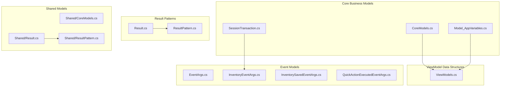
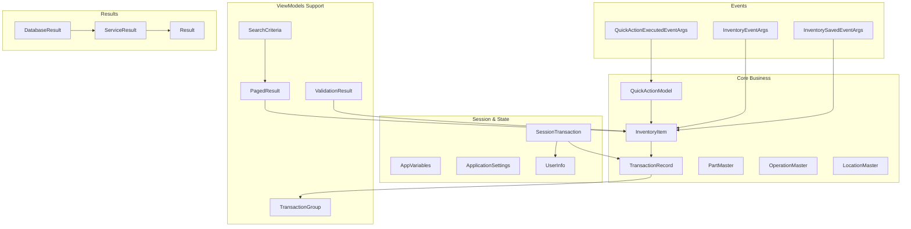

# Data Models - MTM WIP Application Instructions

**Framework**: .NET 8 with C# 12  
**Pattern**: Domain-Driven Design with Manufacturing Context  
**Created**: September 4, 2025  

---

## 🏗️ MTM Data Model Architecture

### Model Organization Philosophy
MTM application uses **domain-driven model organization** where data structures are grouped by business capability and technical purpose. Models are designed specifically for manufacturing inventory management with emphasis on part tracking, operation workflows, and transaction history.



---

## 📋 Core Business Models Documentation

### 1. Core Models (`Models/CoreModels.cs`)

```csharp
// Primary business entities for MTM manufacturing domain
namespace MTM_WIP_Application_Avalonia.Models
{
    // Central inventory item representation
    public class InventoryItem
    {
        public string PartId { get; set; } = string.Empty;        // "PART001", "ABC-123"
        public string Operation { get; set; } = string.Empty;     // "90", "100", "110", "120" (workflow steps)
        public int Quantity { get; set; }                         // Integer quantity only (no decimals)
        public string Location { get; set; } = string.Empty;      // Physical location identifier
        public string TransactionType { get; set; } = string.Empty; // "IN", "OUT", "TRANSFER" (user intent)
        public DateTime LastUpdated { get; set; } = DateTime.Now;
        public string LastUpdatedBy { get; set; } = string.Empty;
        
        // Manufacturing-specific properties
        public string WorkOrder { get; set; } = string.Empty;     // Work order reference
        public string BatchNumber { get; set; } = string.Empty;   // Batch tracking
        public bool IsActive { get; set; } = true;               // Soft delete flag
        
        // Calculated properties
        public bool IsLowStock => Quantity <= MinimumQuantity;
        public int MinimumQuantity { get; set; } = 0;
        
        // Display formatting
        public string DisplayName => $"{PartId} - Op {Operation} ({Quantity} @ {Location})";
        public string QuantityDisplay => Quantity.ToString("N0");
        
        // Validation
        public bool IsValid => 
            !string.IsNullOrWhiteSpace(PartId) && 
            !string.IsNullOrWhiteSpace(Operation) && 
            Quantity >= 0 && 
            !string.IsNullOrWhiteSpace(Location);
    }

    // Transaction history record
    public class TransactionRecord
    {
        public int TransactionId { get; set; }
        public string PartId { get; set; } = string.Empty;
        public string Operation { get; set; } = string.Empty;
        public int Quantity { get; set; }
        public string TransactionType { get; set; } = string.Empty; // "IN", "OUT", "TRANSFER"
        public string Location { get; set; } = string.Empty;
        public string UserId { get; set; } = string.Empty;
        public DateTime Timestamp { get; set; }
        public string Notes { get; set; } = string.Empty;
        public string WorkOrder { get; set; } = string.Empty;
        public string BatchNumber { get; set; } = string.Empty;
        
        // Reference data
        public string UserDisplayName { get; set; } = string.Empty;
        public bool IsReversed { get; set; }
        public int? ReversedByTransactionId { get; set; }
        
        // Display properties
        public string TransactionTypeDisplay => TransactionType switch
        {
            "IN" => "Stock Added",
            "OUT" => "Stock Removed", 
            "TRANSFER" => "Stock Transferred",
            _ => TransactionType
        };
        
        public string TimestampDisplay => Timestamp.ToString("yyyy-MM-dd HH:mm:ss");
        public string QuantityDisplay => $"{(TransactionType == "OUT" ? "-" : "+")}{Quantity:N0}";
    }

    // Quick action button model
    public class QuickActionModel
    {
        public int Id { get; set; }
        public string PartId { get; set; } = string.Empty;
        public string Operation { get; set; } = string.Empty;
        public int Quantity { get; set; } = 1;
        public string Location { get; set; } = string.Empty;
        public string ActionType { get; set; } = string.Empty;    // "IN", "OUT", "TRANSFER"
        public string DisplayName { get; set; } = string.Empty;   // User-friendly name
        public int UsageCount { get; set; }                       // How often used
        public DateTime LastUsed { get; set; } = DateTime.Now;
        public bool IsActive { get; set; } = true;
        public string UserId { get; set; } = string.Empty;
        
        // Display properties
        public string ButtonText => string.IsNullOrWhiteSpace(DisplayName) 
            ? $"{PartId} - {Operation} ({Quantity})" 
            : DisplayName;
            
        public string ActionTypeDisplay => ActionType switch
        {
            "IN" => "Add Stock",
            "OUT" => "Remove Stock",
            "TRANSFER" => "Transfer Stock",
            _ => ActionType
        };
        
        // Sorting properties
        public double RelevanceScore => UsageCount * 0.7 + (DateTime.Now - LastUsed).TotalDays * -0.3;
    }

    // Master data entities
    public class PartMaster
    {
        public string PartId { get; set; } = string.Empty;
        public string Description { get; set; } = string.Empty;
        public string Category { get; set; } = string.Empty;
        public string UnitOfMeasure { get; set; } = "EA";          // Each, LBS, FT, etc.
        public decimal StandardCost { get; set; }
        public int MinimumStock { get; set; }
        public int MaximumStock { get; set; }
        public bool IsActive { get; set; } = true;
        public DateTime CreatedDate { get; set; } = DateTime.Now;
        public string CreatedBy { get; set; } = string.Empty;
        
        public string DisplayText => $"{PartId} - {Description}";
    }

    public class OperationMaster
    {
        public string OperationNumber { get; set; } = string.Empty; // "90", "100", "110"
        public string Description { get; set; } = string.Empty;      // "Receiving", "First Op", etc.
        public int Sequence { get; set; }                           // Workflow order
        public bool IsActive { get; set; } = true;
        public string WorkCenter { get; set; } = string.Empty;      // Physical work location
        public decimal StandardHours { get; set; }                  // Standard operation time
        
        public string DisplayText => $"{OperationNumber} - {Description}";
    }

    public class LocationMaster
    {
        public string LocationId { get; set; } = string.Empty;
        public string Description { get; set; } = string.Empty;
        public string Zone { get; set; } = string.Empty;            // Warehouse zone
        public string Aisle { get; set; } = string.Empty;
        public string Shelf { get; set; } = string.Empty;
        public int Capacity { get; set; }                          // Maximum capacity
        public bool IsActive { get; set; } = true;
        
        public string FullLocation => $"{Zone}-{Aisle}-{Shelf}".Trim('-');
        public string DisplayText => $"{LocationId} - {Description}";
    }

    // User and security models
    public class UserInfo
    {
        public string UserId { get; set; } = string.Empty;
        public string UserName { get; set; } = string.Empty;
        public string DisplayName { get; set; } = string.Empty;
        public string Email { get; set; } = string.Empty;
        public List<string> Roles { get; set; } = new();
        public List<string> Permissions { get; set; } = new();
        public bool IsActive { get; set; } = true;
        public DateTime LastLogin { get; set; }
        
        public bool HasPermission(string permission) => Permissions.Contains(permission);
        public bool HasRole(string role) => Roles.Contains(role);
    }
}
```

**Dependencies**: System.ComponentModel.DataAnnotations  
**Usage**: All ViewModels, Services, and UI components  
**Pattern**: Domain entities with business logic and display properties

---

### 2. Application Variables (`Models/Model_AppVariables.cs`)

```csharp
// Global application state and configuration
namespace MTM_WIP_Application_Avalonia.Models
{
    public static class AppVariables
    {
        // Application metadata
        public static string ApplicationName { get; } = "MTM WIP Application";
        public static string Version { get; } = Assembly.GetExecutingAssembly().GetName().Version?.ToString() ?? "1.0.0";
        public static string BuildDate { get; } = GetBuildDate();
        
        // User context
        public static string CurrentUser { get; set; } = Environment.UserName;
        public static string CurrentMachine { get; } = Environment.MachineName;
        public static UserInfo? CurrentUserInfo { get; set; }
        
        // Application state
        public static bool IsInitialized { get; set; } = false;
        public static bool IsDatabaseConnected { get; set; } = false;
        public static DateTime ApplicationStartTime { get; } = DateTime.Now;
        
        // UI state
        public static string CurrentTheme { get; set; } = "MTM_Blue";
        public static bool ShowAdvancedFeatures { get; set; } = false;
        public static bool EnableAutoSave { get; set; } = true;
        public static int AutoSaveIntervalMinutes { get; set; } = 5;
        
        // Manufacturing context
        public static string DefaultLocation { get; set; } = string.Empty;
        public static string DefaultOperation { get; set; } = "90";  // Receiving
        public static int DefaultQuantity { get; set; } = 1;
        
        // Performance settings
        public static int MaxRecentTransactions { get; set; } = 100;
        public static int MaxQuickButtons { get; set; } = 20;
        public static TimeSpan CacheExpirationTime { get; set; } = TimeSpan.FromMinutes(5);
        
        // Database settings
        public static int DatabaseTimeoutSeconds { get; set; } = 30;
        public static int MaxRetryAttempts { get; set; } = 3;
        public static TimeSpan RetryDelay { get; set; } = TimeSpan.FromSeconds(2);
        
        // Validation rules
        public static int MaxPartIdLength { get; } = 50;
        public static int MaxDescriptionLength { get; } = 200;
        public static int MaxNotesLength { get; } = 1000;
        public static int MinQuantity { get; } = 1;
        public static int MaxQuantity { get; } = 999999;
        
        // Display settings
        public static string DateTimeFormat { get; set; } = "yyyy-MM-dd HH:mm:ss";
        public static string DateFormat { get; set; } = "yyyy-MM-dd";
        public static string TimeFormat { get; set; } = "HH:mm:ss";
        public static string QuantityFormat { get; set; } = "N0";
        
        private static string GetBuildDate()
        {
            var assembly = Assembly.GetExecutingAssembly();
            var fileInfo = new FileInfo(assembly.Location);
            return fileInfo.LastWriteTime.ToString("yyyy-MM-dd HH:mm:ss");
        }
        
        // Runtime calculated properties
        public static TimeSpan ApplicationUptime => DateTime.Now - ApplicationStartTime;
        public static string UptimeDisplay => ApplicationUptime.ToString(@"hh\:mm\:ss");
    }

    // Configuration model for settings persistence
    public class ApplicationSettings
    {
        public string Theme { get; set; } = "MTM_Blue";
        public string DefaultLocation { get; set; } = string.Empty;
        public string DefaultOperation { get; set; } = "90";
        public int DefaultQuantity { get; set; } = 1;
        public bool ShowAdvancedFeatures { get; set; } = false;
        public bool EnableAutoSave { get; set; } = true;
        public int AutoSaveIntervalMinutes { get; set; } = 5;
        public WindowSettings WindowSettings { get; set; } = new();
        public List<string> RecentPartIds { get; set; } = new();
        public List<string> RecentOperations { get; set; } = new();
        
        public DateTime LastSaved { get; set; } = DateTime.Now;
        public string SavedBy { get; set; } = Environment.UserName;
    }

    public class WindowSettings
    {
        public double Width { get; set; } = 1200;
        public double Height { get; set; } = 800;
        public double Left { get; set; } = 100;
        public double Top { get; set; } = 100;
        public bool IsMaximized { get; set; } = false;
        public string WindowState { get; set; } = "Normal";
    }
}
```

**Dependencies**: System.Reflection, System.IO  
**Usage**: Global access across all components  
**Pattern**: Static configuration with runtime state management

---

### 3. Session Transaction (`Models/SessionTransaction.cs`)

```csharp
// Current user session and active transactions
namespace MTM_WIP_Application_Avalonia.Models
{
    public class SessionTransaction
    {
        public Guid SessionId { get; } = Guid.NewGuid();
        public string UserId { get; set; } = string.Empty;
        public DateTime SessionStartTime { get; } = DateTime.Now;
        public DateTime LastActivity { get; set; } = DateTime.Now;
        
        // Current transaction being built
        public string CurrentPartId { get; set; } = string.Empty;
        public string CurrentOperation { get; set; } = string.Empty;
        public int CurrentQuantity { get; set; } = 1;
        public string CurrentLocation { get; set; } = string.Empty;
        public string CurrentTransactionType { get; set; } = string.Empty;
        public string CurrentNotes { get; set; } = string.Empty;
        
        // Transaction state
        public bool HasPendingTransaction { get; set; } = false;
        public bool IsTransactionValid => 
            !string.IsNullOrWhiteSpace(CurrentPartId) &&
            !string.IsNullOrWhiteSpace(CurrentOperation) &&
            CurrentQuantity > 0 &&
            !string.IsNullOrWhiteSpace(CurrentLocation) &&
            !string.IsNullOrWhiteSpace(CurrentTransactionType);
        
        // Session statistics
        public int TransactionsCompleted { get; set; } = 0;
        public int TransactionsFailed { get; set; } = 0;
        public List<string> PartsAccessed { get; set; } = new();
        public List<string> OperationsUsed { get; set; } = new();
        
        // Recent activity tracking
        public Queue<TransactionRecord> RecentTransactions { get; } = new();
        public Dictionary<string, int> PartFrequency { get; } = new();
        public Dictionary<string, int> OperationFrequency { get; } = new();
        
        // Methods
        public void UpdateActivity()
        {
            LastActivity = DateTime.Now;
        }
        
        public void RecordTransaction(TransactionRecord transaction)
        {
            TransactionsCompleted++;
            UpdateActivity();
            
            // Track recent transactions (keep last 50)
            RecentTransactions.Enqueue(transaction);
            if (RecentTransactions.Count > 50)
            {
                RecentTransactions.Dequeue();
            }
            
            // Update frequency tracking
            PartFrequency[transaction.PartId] = PartFrequency.GetValueOrDefault(transaction.PartId, 0) + 1;
            OperationFrequency[transaction.Operation] = OperationFrequency.GetValueOrDefault(transaction.Operation, 0) + 1;
            
            // Track unique parts and operations
            if (!PartsAccessed.Contains(transaction.PartId))
            {
                PartsAccessed.Add(transaction.PartId);
            }
            
            if (!OperationsUsed.Contains(transaction.Operation))
            {
                OperationsUsed.Add(transaction.Operation);
            }
        }
        
        public void RecordFailedTransaction()
        {
            TransactionsFailed++;
            UpdateActivity();
        }
        
        public void ClearCurrentTransaction()
        {
            CurrentPartId = string.Empty;
            CurrentOperation = string.Empty;
            CurrentQuantity = 1;
            CurrentLocation = string.Empty;
            CurrentTransactionType = string.Empty;
            CurrentNotes = string.Empty;
            HasPendingTransaction = false;
        }
        
        public TimeSpan SessionDuration => DateTime.Now - SessionStartTime;
        public bool IsSessionExpired(TimeSpan timeout) => DateTime.Now - LastActivity > timeout;
        
        // Most frequently used items
        public List<string> MostUsedParts => PartFrequency
            .OrderByDescending(kv => kv.Value)
            .Select(kv => kv.Key)
            .Take(10)
            .ToList();
            
        public List<string> MostUsedOperations => OperationFrequency
            .OrderByDescending(kv => kv.Value)
            .Select(kv => kv.Key)
            .Take(10)
            .ToList();
    }

    // Session manager for application-wide session tracking
    public static class SessionManager
    {
        private static SessionTransaction? _currentSession;
        
        public static SessionTransaction CurrentSession
        {
            get => _currentSession ?? throw new InvalidOperationException("No active session");
            private set => _currentSession = value;
        }
        
        public static bool HasActiveSession => _currentSession != null;
        
        public static SessionTransaction StartNewSession(string userId)
        {
            CurrentSession = new SessionTransaction { UserId = userId };
            return CurrentSession;
        }
        
        public static void EndCurrentSession()
        {
            _currentSession = null;
        }
        
        public static void UpdateActivity()
        {
            CurrentSession?.UpdateActivity();
        }
    }
}
```

**Dependencies**: System.Collections.Generic  
**Usage**: MainWindow, ViewModels, transaction tracking  
**Pattern**: Session state pattern with activity tracking

---

### 4. ViewModel Data Structures (`Models/ViewModels.cs`)

```csharp
// Data structures specifically designed for ViewModel consumption
namespace MTM_WIP_Application_Avalonia.Models
{
    // Search criteria for various operations
    public class SearchCriteria
    {
        public string? PartId { get; set; }
        public string? Operation { get; set; }
        public string? Location { get; set; }
        public DateTime? StartDate { get; set; }
        public DateTime? EndDate { get; set; }
        public string? TransactionType { get; set; }
        public string? UserId { get; set; }
        public int? MinQuantity { get; set; }
        public int? MaxQuantity { get; set; }
        
        public bool IsEmpty => 
            string.IsNullOrWhiteSpace(PartId) &&
            string.IsNullOrWhiteSpace(Operation) &&
            string.IsNullOrWhiteSpace(Location) &&
            !StartDate.HasValue &&
            !EndDate.HasValue &&
            string.IsNullOrWhiteSpace(TransactionType) &&
            string.IsNullOrWhiteSpace(UserId) &&
            !MinQuantity.HasValue &&
            !MaxQuantity.HasValue;
    }

    // Paged result wrapper
    public class PagedResult<T>
    {
        public List<T> Items { get; set; } = new();
        public int TotalCount { get; set; }
        public int PageNumber { get; set; }
        public int PageSize { get; set; }
        public int TotalPages { get; set; }
        
        public bool HasPreviousPage => PageNumber > 1;
        public bool HasNextPage => PageNumber < TotalPages;
        public int StartIndex => (PageNumber - 1) * PageSize + 1;
        public int EndIndex => Math.Min(StartIndex + Items.Count - 1, TotalCount);
        
        public string DisplayText => $"Showing {StartIndex}-{EndIndex} of {TotalCount} items";
    }

    // Validation result
    public class ValidationResult
    {
        public bool IsValid { get; set; } = true;
        public List<string> Errors { get; set; } = new();
        public List<string> Warnings { get; set; } = new();
        
        public void AddError(string error)
        {
            Errors.Add(error);
            IsValid = false;
        }
        
        public void AddWarning(string warning)
        {
            Warnings.Add(warning);
        }
        
        public string ErrorMessage => string.Join("; ", Errors);
        public string WarningMessage => string.Join("; ", Warnings);
    }

    // Transaction group for display
    public class TransactionGroup
    {
        public DateTime Date { get; set; }
        public ObservableCollection<TransactionRecord> Transactions { get; set; } = new();
        
        public string DateDisplay => Date.ToString("yyyy-MM-dd dddd");
        public int TotalTransactions => Transactions.Count;
        public int TotalQuantityIn => Transactions.Where(t => t.TransactionType == "IN").Sum(t => t.Quantity);
        public int TotalQuantityOut => Transactions.Where(t => t.TransactionType == "OUT").Sum(t => t.Quantity);
        public int NetQuantity => TotalQuantityIn - TotalQuantityOut;
        
        public string SummaryText => $"{TotalTransactions} transactions, Net: {NetQuantity:+#;-#;0}";
    }

    // Settings panel model
    public class SettingsPanel
    {
        public string Id { get; set; } = string.Empty;
        public string Title { get; set; } = string.Empty;
        public string Description { get; set; } = string.Empty;
        public bool IsExpanded { get; set; } = false;
        public bool IsEnabled { get; set; } = true;
        public int Order { get; set; }
        public string Category { get; set; } = string.Empty;
        public object? Content { get; set; }
        
        public string DisplayTitle => $"{Title} {(IsExpanded ? "▼" : "▶")}";
    }

    // Export/Import models
    public class ExportRequest
    {
        public string Format { get; set; } = "CSV";  // CSV, Excel, JSON
        public DateTime? StartDate { get; set; }
        public DateTime? EndDate { get; set; }
        public List<string> Columns { get; set; } = new();
        public string FileName { get; set; } = string.Empty;
        public bool IncludeHeaders { get; set; } = true;
    }

    public class ImportResult
    {
        public int RecordsProcessed { get; set; }
        public int RecordsSuccessful { get; set; }
        public int RecordsFailed { get; set; }
        public List<string> Errors { get; set; } = new();
        public TimeSpan ProcessingTime { get; set; }
        
        public bool IsSuccessful => RecordsFailed == 0;
        public string SummaryText => $"Processed: {RecordsProcessed}, Success: {RecordsSuccessful}, Failed: {RecordsFailed}";
    }
}
```

**Dependencies**: System.Collections.ObjectModel  
**Usage**: ViewModels for data binding and UI operations  
**Pattern**: UI-focused data structures with display properties

---

## 🎭 Event Models Documentation

### 5. Base Event Args (`Models/EventArgs.cs`)

```csharp
// Custom event argument classes for application events
namespace MTM_WIP_Application_Avalonia.Models
{
    public class BaseEventArgs : EventArgs
    {
        public DateTime Timestamp { get; } = DateTime.Now;
        public string UserId { get; set; } = Environment.UserName;
        public Guid EventId { get; } = Guid.NewGuid();
    }

    public class DataChangedEventArgs<T> : BaseEventArgs
    {
        public T? OldValue { get; set; }
        public T? NewValue { get; set; }
        public string PropertyName { get; set; } = string.Empty;
        public string ChangeType { get; set; } = string.Empty; // "Add", "Update", "Delete"
        
        public bool IsValueChanged => !EqualityComparer<T>.Default.Equals(OldValue, NewValue);
    }

    public class ValidationEventArgs : BaseEventArgs
    {
        public string PropertyName { get; set; } = string.Empty;
        public object? Value { get; set; }
        public ValidationResult ValidationResult { get; set; } = new();
        public bool Cancel { get; set; } = false;
    }

    public class NavigationEventArgs : BaseEventArgs
    {
        public string FromView { get; set; } = string.Empty;
        public string ToView { get; set; } = string.Empty;
        public object? Parameter { get; set; }
        public bool Cancel { get; set; } = false;
    }
}
```

### 6. Inventory Event Args (`Models/InventoryEventArgs.cs`)

```csharp
namespace MTM_WIP_Application_Avalonia.Models
{
    public class InventoryEventArgs : BaseEventArgs
    {
        public string PartId { get; set; } = string.Empty;
        public string Operation { get; set; } = string.Empty;
        public int Quantity { get; set; }
        public string Location { get; set; } = string.Empty;
        public string TransactionType { get; set; } = string.Empty;
        public string Notes { get; set; } = string.Empty;
        
        public InventoryItem ToInventoryItem() => new()
        {
            PartId = PartId,
            Operation = Operation,
            Quantity = Quantity,
            Location = Location,
            TransactionType = TransactionType,
            LastUpdated = Timestamp,
            LastUpdatedBy = UserId
        };
    }

    public class InventoryTransactionEventArgs : InventoryEventArgs
    {
        public int TransactionId { get; set; }
        public bool IsSuccessful { get; set; }
        public string ErrorMessage { get; set; } = string.Empty;
        public TransactionRecord? TransactionRecord { get; set; }
    }

    public class InventoryValidationEventArgs : InventoryEventArgs
    {
        public ValidationResult ValidationResult { get; set; } = new();
        public bool Cancel { get; set; } = false;
        public List<string> SuggestedCorrections { get; set; } = new();
    }
}
```

### 7. Inventory Saved Event Args (`Models/InventorySavedEventArgs.cs`)

```csharp
namespace MTM_WIP_Application_Avalonia.Models
{
    public class InventorySavedEventArgs : BaseEventArgs
    {
        public InventoryItem SavedItem { get; set; } = new();
        public TransactionRecord TransactionRecord { get; set; } = new();
        public bool IsNewItem { get; set; }
        public string SaveType { get; set; } = string.Empty; // "Create", "Update", "Delete"
        public TimeSpan SaveDuration { get; set; }
        
        public string SummaryMessage => 
            $"Inventory {SaveType.ToLowerInvariant()}: {SavedItem.PartId} - {SavedItem.Operation} " +
            $"({SavedItem.Quantity} @ {SavedItem.Location}) in {SaveDuration.TotalMilliseconds:F0}ms";
    }

    public class BulkInventorySavedEventArgs : BaseEventArgs
    {
        public List<InventoryItem> SavedItems { get; set; } = new();
        public List<TransactionRecord> TransactionRecords { get; set; } = new();
        public int SuccessfulSaves { get; set; }
        public int FailedSaves { get; set; }
        public TimeSpan TotalSaveDuration { get; set; }
        public List<string> Errors { get; set; } = new();
        
        public bool AllSuccessful => FailedSaves == 0;
        public string SummaryMessage => 
            $"Bulk save completed: {SuccessfulSaves} successful, {FailedSaves} failed " +
            $"in {TotalSaveDuration.TotalSeconds:F1} seconds";
    }
}
```

### 8. Quick Action Executed Event Args (`Models/QuickActionExecutedEventArgs.cs`)

```csharp
namespace MTM_WIP_Application_Avalonia.Models
{
    public class QuickActionExecutedEventArgs : BaseEventArgs
    {
        public QuickActionModel QuickAction { get; set; } = new();
        public bool IsSuccessful { get; set; }
        public string ErrorMessage { get; set; } = string.Empty;
        public TransactionRecord? ResultingTransaction { get; set; }
        public TimeSpan ExecutionTime { get; set; }
        
        public string SummaryMessage => IsSuccessful
            ? $"Quick action executed: {QuickAction.DisplayName} in {ExecutionTime.TotalMilliseconds:F0}ms"
            : $"Quick action failed: {QuickAction.DisplayName} - {ErrorMessage}";
    }

    public class QuickActionCreatedEventArgs : BaseEventArgs
    {
        public QuickActionModel CreatedAction { get; set; } = new();
        public string Source { get; set; } = string.Empty; // "Manual", "Auto-Generated", "Import"
        
        public string SummaryMessage => 
            $"Quick action created: {CreatedAction.DisplayName} (Source: {Source})";
    }

    public class QuickActionDeletedEventArgs : BaseEventArgs
    {
        public QuickActionModel DeletedAction { get; set; } = new();
        public string DeleteReason { get; set; } = string.Empty;
        
        public string SummaryMessage => 
            $"Quick action deleted: {DeletedAction.DisplayName} (Reason: {DeleteReason})";
    }
}
```

---

## ✅ Result Pattern Models

### 9. Result Pattern (`Models/Result.cs`)

```csharp
// Standard result pattern for service operations
namespace MTM_WIP_Application_Avalonia.Models
{
    public class Result
    {
        public bool IsSuccess { get; protected set; }
        public bool IsFailure => !IsSuccess;
        public string ErrorMessage { get; protected set; } = string.Empty;
        public List<string> Errors { get; protected set; } = new();
        
        protected Result(bool isSuccess, string errorMessage)
        {
            IsSuccess = isSuccess;
            ErrorMessage = errorMessage;
            if (!string.IsNullOrWhiteSpace(errorMessage))
            {
                Errors.Add(errorMessage);
            }
        }

        public static Result Success() => new(true, string.Empty);
        public static Result Failure(string error) => new(false, error);
        public static Result Failure(List<string> errors) => new(false, string.Join("; ", errors)) 
        { 
            Errors = errors 
        };

        public static implicit operator bool(Result result) => result.IsSuccess;
    }

    public class Result<T> : Result
    {
        public T? Data { get; private set; }
        
        protected Result(bool isSuccess, T? data, string errorMessage) 
            : base(isSuccess, errorMessage)
        {
            Data = data;
        }

        public static Result<T> Success(T data) => new(true, data, string.Empty);
        public static Result<T> Failure(string error) => new(false, default, error);
        public static Result<T> Failure(T? data, string error) => new(false, data, error);

        public static implicit operator T?(Result<T> result) => result.Data;
    }

    // Service-specific result types
    public class ServiceResult<T> : Result<T>
    {
        public DateTime Timestamp { get; } = DateTime.Now;
        public TimeSpan ExecutionTime { get; set; }
        public string ServiceName { get; set; } = string.Empty;
        
        protected ServiceResult(bool isSuccess, T? data, string errorMessage, string serviceName) 
            : base(isSuccess, data, errorMessage)
        {
            ServiceName = serviceName;
        }

        public static ServiceResult<T> Success(T data, string serviceName = "") => 
            new(true, data, string.Empty, serviceName);
            
        public static ServiceResult<T> Failure(string error, string serviceName = "") => 
            new(false, default, error, serviceName);
    }

    public class DatabaseResult<T> : ServiceResult<T>
    {
        public int RowsAffected { get; set; }
        public string StoredProcedure { get; set; } = string.Empty;
        
        protected DatabaseResult(bool isSuccess, T? data, string errorMessage, string storedProcedure, int rowsAffected) 
            : base(isSuccess, data, errorMessage, "DatabaseService")
        {
            StoredProcedure = storedProcedure;
            RowsAffected = rowsAffected;
        }

        public static DatabaseResult<T> Success(T data, string storedProcedure, int rowsAffected) => 
            new(true, data, string.Empty, storedProcedure, rowsAffected);
            
        public static DatabaseResult<T> Failure(string error, string storedProcedure) => 
            new(false, default, error, storedProcedure, 0);
    }
}
```

### 10. Result Pattern Extensions (`Models/ResultPattern.cs`)

```csharp
// Extension methods and utilities for Result pattern
namespace MTM_WIP_Application_Avalonia.Models
{
    public static class ResultExtensions
    {
        public static Result<U> Map<T, U>(this Result<T> result, Func<T, U> mapper)
        {
            if (result.IsFailure)
                return Result<U>.Failure(result.ErrorMessage);
                
            try
            {
                var mappedValue = mapper(result.Data!);
                return Result<U>.Success(mappedValue);
            }
            catch (Exception ex)
            {
                return Result<U>.Failure($"Mapping failed: {ex.Message}");
            }
        }

        public static async Task<Result<U>> MapAsync<T, U>(this Result<T> result, Func<T, Task<U>> mapper)
        {
            if (result.IsFailure)
                return Result<U>.Failure(result.ErrorMessage);
                
            try
            {
                var mappedValue = await mapper(result.Data!);
                return Result<U>.Success(mappedValue);
            }
            catch (Exception ex)
            {
                return Result<U>.Failure($"Async mapping failed: {ex.Message}");
            }
        }

        public static Result<T> OnSuccess<T>(this Result<T> result, Action<T> action)
        {
            if (result.IsSuccess && result.Data != null)
            {
                action(result.Data);
            }
            return result;
        }

        public static Result<T> OnFailure<T>(this Result<T> result, Action<string> action)
        {
            if (result.IsFailure)
            {
                action(result.ErrorMessage);
            }
            return result;
        }

        public static T GetValueOrDefault<T>(this Result<T> result, T defaultValue = default!)
        {
            return result.IsSuccess ? result.Data! : defaultValue;
        }

        public static T GetValueOrThrow<T>(this Result<T> result)
        {
            if (result.IsFailure)
                throw new InvalidOperationException(result.ErrorMessage);
                
            return result.Data!;
        }
    }

    // Result builder for complex operations
    public class ResultBuilder<T>
    {
        private readonly List<string> _errors = new();
        private T? _data;
        private bool _hasData = false;

        public ResultBuilder<T> WithData(T data)
        {
            _data = data;
            _hasData = true;
            return this;
        }

        public ResultBuilder<T> AddError(string error)
        {
            if (!string.IsNullOrWhiteSpace(error))
                _errors.Add(error);
            return this;
        }

        public ResultBuilder<T> AddErrorIf(bool condition, string error)
        {
            if (condition)
                AddError(error);
            return this;
        }

        public Result<T> Build()
        {
            if (_errors.Count > 0)
                return Result<T>.Failure(_errors);
                
            if (!_hasData)
                return Result<T>.Failure("No data provided");
                
            return Result<T>.Success(_data!);
        }
    }

    // Validation result builder
    public static class ValidationResultBuilder
    {
        public static ValidationResult ForModel<T>(T model)
        {
            var result = new ValidationResult();
            var context = new ValidationContext(model!);
            var validationResults = new List<ValidationResult>();

            if (!Validator.TryValidateObject(model!, context, validationResults, true))
            {
                foreach (var validationResult in validationResults)
                {
                    if (validationResult.ErrorMessage != null)
                        result.AddError(validationResult.ErrorMessage);
                }
            }

            return result;
        }
    }
}
```

---

## 🔗 Model Relationship Diagram



---

## 🧪 Model Testing Patterns

```csharp
public class InventoryItemTests
{
    [Fact]
    public void InventoryItem_IsValid_ReturnsTrueForValidItem()
    {
        // Arrange
        var item = new InventoryItem
        {
            PartId = "PART001",
            Operation = "100",
            Quantity = 5,
            Location = "A01"
        };

        // Act & Assert
        Assert.True(item.IsValid);
    }

    [Theory]
    [InlineData("", "100", 5, "A01", false)]    // Empty part ID
    [InlineData("PART001", "", 5, "A01", false)] // Empty operation
    [InlineData("PART001", "100", -1, "A01", false)] // Negative quantity
    [InlineData("PART001", "100", 5, "", false)]     // Empty location
    [InlineData("PART001", "100", 5, "A01", true)]   // Valid item
    public void InventoryItem_IsValid_ValidatesCorrectly(
        string partId, string operation, int quantity, string location, bool expected)
    {
        var item = new InventoryItem
        {
            PartId = partId,
            Operation = operation,
            Quantity = quantity,
            Location = location
        };

        Assert.Equal(expected, item.IsValid);
    }
}
```

---

## 📚 Related Model Documentation

- **Service Integration**: [Service Architecture](./service-architecture.instructions.md)
- **Database Models**: [MySQL Database Patterns](./mysql-database-patterns.instructions.md)
- **MVVM Integration**: [Community Toolkit Patterns](./mvvm-community-toolkit.instructions.md)
- **UI Data Binding**: [Avalonia UI Guidelines](./avalonia-ui-guidelines.instructions.md)

---

**Document Status**: ✅ Complete Data Model Reference  
**Model Count**: 10 Model Files Documented  
**Last Updated**: September 4, 2025  
**Data Architecture Owner**: MTM Development Team
