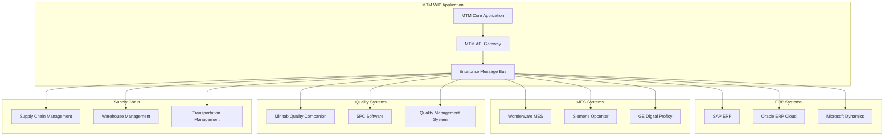

# Enterprise Integration Patterns - MTM WIP Application Instructions

**Framework**: .NET 8 with Enterprise System Integration  
**Pattern**: Multi-System Integration and Data Synchronization  
**Created**: 2025-09-15  

---

## 🏢 Enterprise System Architecture

### Multi-System Integration Overview



---

## 🔌 ERP System Integration Patterns

### SAP ERP Integration Service

```csharp
// SAP ERP integration for manufacturing data synchronization
public class SAPERPIntegrationService : IERPIntegrationService
{
    private readonly ISAPConnectorService _sapConnector;
    private readonly IDataTransformationService _dataTransformation;
    private readonly ICircuitBreakerService _circuitBreaker;
    private readonly IRetryPolicyService _retryPolicy;
    private readonly IManufacturingEventBus _eventBus;
    private readonly ILogger<SAPERPIntegrationService> _logger;
    
    public SAPERPIntegrationService(
        ISAPConnectorService sapConnector,
        IDataTransformationService dataTransformation,
        ICircuitBreakerService circuitBreaker,
        IRetryPolicyService retryPolicy,
        IManufacturingEventBus eventBus,
        ILogger<SAPERPIntegrationService> logger)
    {
        _sapConnector = sapConnector;
        _dataTransformation = dataTransformation;
        _circuitBreaker = circuitBreaker;
        _retryPolicy = retryPolicy;
        _eventBus = eventBus;
        _logger = logger;
    }
    
    public async Task<ERPSyncResult> SynchronizeWorkOrdersAsync(WorkOrderSyncRequest request)
    {
        try
        {
            using var activity = EnterpriseIntegrationTelemetry.StartActivity("SynchronizeWorkOrders");
            activity?.SetTag("erp.system", "SAP");
            activity?.SetTag("sync.type", "WorkOrders");
            
            // Apply circuit breaker pattern for ERP connectivity
            var workOrders = await _circuitBreaker.ExecuteAsync(async () =>
            {
                return await _retryPolicy.ExecuteAsync(async () =>
                {
                    return await _sapConnector.GetWorkOrdersAsync(new SAPWorkOrderQuery
                    {
                        PlantCode = request.PlantCode,
                        DateFrom = request.FromDate,
                        DateTo = request.ToDate,
                        Status = request.StatusFilter,
                        MaterialFilter = request.MaterialFilter
                    });
                });
            });
            
            var synchronizedCount = 0;
            var errorCount = 0;
            var syncResults = new List<WorkOrderSyncDetail>();
            
            // Process each work order with transformation
            foreach (var sapWorkOrder in workOrders)
            {
                try
                {
                    // Transform SAP data model to MTM data model
                    var mtmWorkOrder = await _dataTransformation.TransformSAPWorkOrderToMTMAsync(sapWorkOrder);
                    
                    // Validate transformed data
                    var validationResult = await ValidateWorkOrderDataAsync(mtmWorkOrder);
                    if (!validationResult.IsValid)
                    {
                        syncResults.Add(new WorkOrderSyncDetail
                        {
                            WorkOrderNumber = sapWorkOrder.OrderNumber,
                            Status = SyncStatus.ValidationFailed,
                            ErrorMessage = string.Join("; ", validationResult.Errors)
                        });
                        errorCount++;
                        continue;
                    }
                    
                    // Synchronize with MTM database
                    var syncResult = await SynchronizeWorkOrderToMTMAsync(mtmWorkOrder);
                    
                    syncResults.Add(new WorkOrderSyncDetail
                    {
                        WorkOrderNumber = sapWorkOrder.OrderNumber,
                        Status = syncResult.IsSuccess ? SyncStatus.Success : SyncStatus.Failed,
                        ErrorMessage = syncResult.ErrorMessage,
                        RecordsAffected = syncResult.RecordsAffected
                    });
                    
                    if (syncResult.IsSuccess)
                    {
                        synchronizedCount++;
                        
                        // Publish integration event
                        await _eventBus.PublishAsync(new WorkOrderSynchronizedEvent
                        {
                            WorkOrderNumber = mtmWorkOrder.WorkOrderNumber,
                            ERPSystem = "SAP",
                            SynchronizedAt = DateTime.UtcNow,
                            DataSource = "ERP_SYNC"
                        });
                    }
                    else
                    {
                        errorCount++;
                    }
                }
                catch (Exception ex)
                {
                    _logger.LogError(ex, "Failed to sync work order {WorkOrderNumber} from SAP", 
                        sapWorkOrder.OrderNumber);
                    
                    syncResults.Add(new WorkOrderSyncDetail
                    {
                        WorkOrderNumber = sapWorkOrder.OrderNumber,
                        Status = SyncStatus.Failed,
                        ErrorMessage = ex.Message
                    });
                    errorCount++;
                }
            }
            
            // Log sync summary
            _logger.LogInformation("SAP Work Order sync completed: {Success} successful, {Errors} errors, {Total} total",
                synchronizedCount, errorCount, workOrders.Count);
            
            return new ERPSyncResult
            {
                IsSuccess = errorCount == 0,
                TotalRecords = workOrders.Count,
                SuccessfulRecords = synchronizedCount,
                FailedRecords = errorCount,
                SyncDetails = syncResults,
                SyncDuration = activity?.Duration ?? TimeSpan.Zero,
                CompletedAt = DateTime.UtcNow
            };
        }
        catch (Exception ex)
        {
            _logger.LogError(ex, "SAP Work Order synchronization failed");
            
            return new ERPSyncResult
            {
                IsSuccess = false,
                ErrorMessage = $"SAP synchronization failed: {ex.Message}",
                CompletedAt = DateTime.UtcNow
            };
        }
    }
    
    public async Task<ERPSyncResult> SynchronizeMaterialMasterAsync(MaterialMasterSyncRequest request)
    {
        try
        {
            using var activity = EnterpriseIntegrationTelemetry.StartActivity("SynchronizeMaterialMaster");
            activity?.SetTag("erp.system", "SAP");
            activity?.SetTag("sync.type", "MaterialMaster");
            
            // Retrieve material master data from SAP
            var materialMasterData = await _circuitBreaker.ExecuteAsync(async () =>
            {
                return await _sapConnector.GetMaterialMasterAsync(new SAPMaterialQuery
                {
                    PlantCode = request.PlantCode,
                    MaterialTypeFilter = request.MaterialTypeFilter,
                    ChangedSince = request.LastSyncDate,
                    IncludeInactive = false
                });
            });
            
            var syncResults = new List<MaterialSyncDetail>();
            var successCount = 0;
            var errorCount = 0;
            
            // Batch processing for large material master datasets
            var batches = materialMasterData.Batch(100); // Process in batches of 100
            
            foreach (var batch in batches)
            {
                var batchResults = await ProcessMaterialBatchAsync(batch);
                syncResults.AddRange(batchResults);
                
                successCount += batchResults.Count(r => r.Status == SyncStatus.Success);
                errorCount += batchResults.Count(r => r.Status != SyncStatus.Success);
                
                // Small delay between batches to avoid overwhelming the system
                await Task.Delay(100);
            }
            
            return new ERPSyncResult
            {
                IsSuccess = errorCount == 0,
                TotalRecords = materialMasterData.Count,
                SuccessfulRecords = successCount,
                FailedRecords = errorCount,
                SyncDetails = syncResults.Cast<SyncDetail>().ToList(),
                CompletedAt = DateTime.UtcNow
            };
        }
        catch (Exception ex)
        {
            _logger.LogError(ex, "SAP Material Master synchronization failed");
            
            return new ERPSyncResult
            {
                IsSuccess = false,
                ErrorMessage = $"Material Master sync failed: {ex.Message}",
                CompletedAt = DateTime.UtcNow
            };
        }
    }
    
    public async Task<ERPPostResult> PostProductionConfirmationAsync(ProductionConfirmationData confirmationData)
    {
        try
        {
            using var activity = EnterpriseIntegrationTelemetry.StartActivity("PostProductionConfirmation");
            activity?.SetTag("erp.system", "SAP");
            activity?.SetTag("work.order", confirmationData.WorkOrderNumber);
            
            // Transform MTM production data to SAP format
            var sapConfirmation = await _dataTransformation.TransformMTMToSAPConfirmationAsync(confirmationData);
            
            // Validate SAP confirmation data
            var validationResult = await ValidateSAPConfirmationAsync(sapConfirmation);
            if (!validationResult.IsValid)
            {
                return new ERPPostResult
                {
                    IsSuccess = false,
                    ErrorMessage = $"Validation failed: {string.Join("; ", validationResult.Errors)}"
                };
            }
            
            // Post confirmation to SAP
            var postResult = await _circuitBreaker.ExecuteAsync(async () =>
            {
                return await _retryPolicy.ExecuteAsync(async () =>
                {
                    return await _sapConnector.PostProductionConfirmationAsync(sapConfirmation);
                });
            });
            
            if (postResult.IsSuccess)
            {
                // Update local confirmation status
                await UpdateConfirmationStatusAsync(confirmationData.ConfirmationId, "POSTED_TO_SAP", postResult.SAPDocumentNumber);
                
                // Publish success event
                await _eventBus.PublishAsync(new ProductionConfirmationPostedEvent
                {
                    WorkOrderNumber = confirmationData.WorkOrderNumber,
                    ConfirmationId = confirmationData.ConfirmationId,
                    ERPSystem = "SAP",
                    ERPDocumentNumber = postResult.SAPDocumentNumber,
                    PostedAt = DateTime.UtcNow
                });
            }
            
            return new ERPPostResult
            {
                IsSuccess = postResult.IsSuccess,
                ERPDocumentNumber = postResult.SAPDocumentNumber,
                ErrorMessage = postResult.ErrorMessage,
                PostedAt = DateTime.UtcNow
            };
        }
        catch (Exception ex)
        {
            _logger.LogError(ex, "Failed to post production confirmation {ConfirmationId} to SAP", 
                confirmationData.ConfirmationId);
            
            return new ERPPostResult
            {
                IsSuccess = false,
                ErrorMessage = $"SAP posting failed: {ex.Message}"
            };
        }
    }
}
```

### Oracle ERP Cloud Integration

```csharp
// Oracle ERP Cloud integration with REST API
public class OracleERPCloudIntegrationService : IERPIntegrationService
{
    private readonly HttpClient _httpClient;
    private readonly IOracleAuthenticationService _authService;
    private readonly IDataTransformationService _dataTransformation;
    private readonly ILogger<OracleERPCloudIntegrationService> _logger;
    
    public OracleERPCloudIntegrationService(
        HttpClient httpClient,
        IOracleAuthenticationService authService,
        IDataTransformationService dataTransformation,
        ILogger<OracleERPCloudIntegrationService> logger)
    {
        _httpClient = httpClient;
        _authService = authService;
        _dataTransformation = dataTransformation;
        _logger = logger;
    }
    
    public async Task<ERPSyncResult> SynchronizeInventoryTransactionsAsync(InventoryTransactionSyncRequest request)
    {
        try
        {
            // Authenticate with Oracle ERP Cloud
            var authToken = await _authService.GetAccessTokenAsync();
            _httpClient.DefaultRequestHeaders.Authorization = new AuthenticationHeaderValue("Bearer", authToken);
            
            // Prepare Oracle REST API request
            var inventoryQuery = new
            {
                q = $"CreationDate >= '{request.FromDate:yyyy-MM-dd}' AND CreationDate <= '{request.ToDate:yyyy-MM-dd}'",
                onlyData = true,
                expand = "InventoryItemId,SubinventoryCode,Locator,TransactionType",
                limit = 1000,
                offset = request.Offset
            };
            
            var queryString = string.Join("&", inventoryQuery.GetType().GetProperties()
                .Select(p => $"{p.Name}={Uri.EscapeDataString(p.GetValue(inventoryQuery)?.ToString() ?? "")}"));
            
            // Call Oracle Inventory Transactions REST API
            var response = await _httpClient.GetAsync(
                $"/fscmRestApi/resources/11.13.18.05/inventoryTransactions?{queryString}");
            
            response.EnsureSuccessStatusCode();
            
            var responseContent = await response.Content.ReadAsStringAsync();
            var oracleResponse = JsonSerializer.Deserialize<OracleInventoryTransactionsResponse>(responseContent);
            
            var syncResults = new List<InventoryTransactionSyncDetail>();
            var successCount = 0;
            var errorCount = 0;
            
            // Process Oracle inventory transactions
            foreach (var oracleTransaction in oracleResponse.Items)
            {
                try
                {
                    // Transform Oracle data to MTM format
                    var mtmTransaction = await _dataTransformation.TransformOracleToMTMTransactionAsync(oracleTransaction);
                    
                    // Synchronize with MTM database
                    var syncResult = await SynchronizeInventoryTransactionToMTMAsync(mtmTransaction);
                    
                    syncResults.Add(new InventoryTransactionSyncDetail
                    {
                        OracleTransactionId = oracleTransaction.TransactionId,
                        MTMTransactionId = mtmTransaction.TransactionId,
                        Status = syncResult.IsSuccess ? SyncStatus.Success : SyncStatus.Failed,
                        ErrorMessage = syncResult.ErrorMessage
                    });
                    
                    if (syncResult.IsSuccess)
                    {
                        successCount++;
                    }
                    else
                    {
                        errorCount++;
                    }
                }
                catch (Exception ex)
                {
                    _logger.LogError(ex, "Failed to sync Oracle inventory transaction {TransactionId}",
                        oracleTransaction.TransactionId);
                    
                    syncResults.Add(new InventoryTransactionSyncDetail
                    {
                        OracleTransactionId = oracleTransaction.TransactionId,
                        Status = SyncStatus.Failed,
                        ErrorMessage = ex.Message
                    });
                    errorCount++;
                }
            }
            
            return new ERPSyncResult
            {
                IsSuccess = errorCount == 0,
                TotalRecords = oracleResponse.Items.Count,
                SuccessfulRecords = successCount,
                FailedRecords = errorCount,
                SyncDetails = syncResults.Cast<SyncDetail>().ToList(),
                CompletedAt = DateTime.UtcNow
            };
        }
        catch (Exception ex)
        {
            _logger.LogError(ex, "Oracle ERP Cloud inventory synchronization failed");
            
            return new ERPSyncResult
            {
                IsSuccess = false,
                ErrorMessage = $"Oracle synchronization failed: {ex.Message}",
                CompletedAt = DateTime.UtcNow
            };
        }
    }
}
```

---

## 🏭 MES System Integration Patterns

### Wonderware MES Integration

```csharp
// Wonderware MES integration for real-time manufacturing data
public class WonderwareMESIntegrationService : IMESIntegrationService
{
    private readonly IWonderwareConnector _wonderwareConnector;
    private readonly IManufacturingDataService _manufacturingDataService;
    private readonly ISignalRHubContext _signalRHub;
    private readonly ILogger<WonderwareMESIntegrationService> _logger;
    
    public async Task<MESIntegrationResult> SynchronizeProductionDataAsync(ProductionDataSyncRequest request)
    {
        try
        {
            using var activity = EnterpriseIntegrationTelemetry.StartActivity("SynchronizeProductionData");
            activity?.SetTag("mes.system", "Wonderware");
            
            // Connect to Wonderware MES system
            var connection = await _wonderwareConnector.ConnectAsync();
            
            // Query production data from Wonderware
            var productionData = await connection.QueryProductionDataAsync(new WonderwareProductionQuery
            {
                StartTime = request.FromDateTime,
                EndTime = request.ToDateTime,
                ProductionLines = request.ProductionLines,
                IncludeQualityData = true,
                IncludeDowntimeData = true
            });
            
            var syncResults = new List<ProductionDataSyncDetail>();
            var realTimeUpdates = new List<RealTimeProductionUpdate>();
            
            // Process production events
            foreach (var productionEvent in productionData.ProductionEvents)
            {
                var mtmProductionEvent = await TransformWonderwareProductionEventAsync(productionEvent);
                var syncResult = await _manufacturingDataService.RecordProductionEventAsync(mtmProductionEvent);
                
                syncResults.Add(new ProductionDataSyncDetail
                {
                    WonderwareEventId = productionEvent.EventId,
                    MTMEventId = mtmProductionEvent.EventId,
                    Status = syncResult.IsSuccess ? SyncStatus.Success : SyncStatus.Failed,
                    ErrorMessage = syncResult.ErrorMessage
                });
                
                if (syncResult.IsSuccess)
                {
                    // Prepare real-time update for UI
                    realTimeUpdates.Add(new RealTimeProductionUpdate
                    {
                        ProductionLineId = productionEvent.ProductionLineId,
                        EventType = productionEvent.EventType,
                        Timestamp = productionEvent.Timestamp,
                        Value = productionEvent.Value,
                        UpdatedAt = DateTime.UtcNow
                    });
                }
            }
            
            // Process quality data
            foreach (var qualityEvent in productionData.QualityEvents)
            {
                await ProcessWonderwareQualityEventAsync(qualityEvent, syncResults);
            }
            
            // Process downtime data
            foreach (var downtimeEvent in productionData.DowntimeEvents)
            {
                await ProcessWonderwareDowntimeEventAsync(downtimeEvent, syncResults);
            }
            
            // Send real-time updates to UI clients
            await SendRealTimeUpdatesAsync(realTimeUpdates);
            
            return new MESIntegrationResult
            {
                IsSuccess = syncResults.All(r => r.Status == SyncStatus.Success),
                TotalEvents = productionData.TotalEventCount,
                SyncDetails = syncResults,
                CompletedAt = DateTime.UtcNow
            };
        }
        catch (Exception ex)
        {
            _logger.LogError(ex, "Wonderware MES integration failed");
            throw;
        }
    }
    
    private async Task SendRealTimeUpdatesAsync(List<RealTimeProductionUpdate> updates)
    {
        if (!updates.Any()) return;
        
        // Group updates by production line for efficient transmission
        var updatesByLine = updates.GroupBy(u => u.ProductionLineId);
        
        foreach (var lineUpdates in updatesByLine)
        {
            await _signalRHub.Clients.Group($"ProductionLine_{lineUpdates.Key}")
                .SendAsync("ProductionDataUpdated", lineUpdates.ToList());
        }
        
        // Send summary to dashboard clients
        var summary = new ProductionSummaryUpdate
        {
            TotalUpdates = updates.Count,
            UpdatedLines = updates.Select(u => u.ProductionLineId).Distinct().Count(),
            LastUpdateTime = updates.Max(u => u.Timestamp)
        };
        
        await _signalRHub.Clients.Group("Dashboard")
            .SendAsync("ProductionSummaryUpdated", summary);
    }
}
```

---

## 🔬 Quality Management System Integration

### Minitab Quality Companion Integration

```csharp
// Minitab Quality Companion integration for statistical quality control
public class MinitabQualityIntegrationService : IQualitySystemIntegrationService
{
    private readonly IMinitabConnector _minitabConnector;
    private readonly IStatisticalAnalysisService _statisticalAnalysis;
    private readonly IQualityDataService _qualityDataService;
    private readonly ILogger<MinitabQualityIntegrationService> _logger;
    
    public async Task<QualityIntegrationResult> SynchronizeQualityDataAsync(QualityDataSyncRequest request)
    {
        try
        {
            // Connect to Minitab Quality Companion
            var connection = await _minitabConnector.ConnectAsync();
            
            // Retrieve quality measurement data
            var qualityMeasurements = await connection.GetQualityMeasurementsAsync(new MinitabQualityQuery
            {
                StartDate = request.FromDate,
                EndDate = request.ToDate,
                PartNumbers = request.PartNumbers,
                QualityCharacteristics = request.QualityCharacteristics,
                IncludeSPCData = true,
                IncludeCapabilityData = true
            });
            
            var syncResults = new List<QualityDataSyncDetail>();
            var spcAlerts = new List<SPCAlert>();
            
            // Process quality measurements
            foreach (var measurement in qualityMeasurements)
            {
                try
                {
                    // Transform Minitab data to MTM format
                    var mtmQualityData = await TransformMinitabQualityDataAsync(measurement);
                    
                    // Perform SPC analysis
                    var spcAnalysis = await _statisticalAnalysis.PerformSPCAnalysisAsync(mtmQualityData);
                    
                    // Record quality data in MTM system
                    var recordResult = await _qualityDataService.RecordQualityMeasurementAsync(mtmQualityData, spcAnalysis);
                    
                    syncResults.Add(new QualityDataSyncDetail
                    {
                        MinitabMeasurementId = measurement.MeasurementId,
                        MTMQualityRecordId = mtmQualityData.RecordId,
                        Status = recordResult.IsSuccess ? SyncStatus.Success : SyncStatus.Failed,
                        SPCStatus = spcAnalysis.ControlStatus,
                        ErrorMessage = recordResult.ErrorMessage
                    });
                    
                    // Check for SPC alerts
                    if (spcAnalysis.HasAlerts)
                    {
                        foreach (var alert in spcAnalysis.Alerts)
                        {
                            spcAlerts.Add(new SPCAlert
                            {
                                PartNumber = measurement.PartNumber,
                                QualityCharacteristic = measurement.CharacteristicName,
                                AlertType = alert.Type,
                                AlertMessage = alert.Message,
                                MeasurementValue = measurement.Value,
                                ControlLimits = spcAnalysis.ControlLimits,
                                Timestamp = measurement.Timestamp
                            });
                        }
                    }
                }
                catch (Exception ex)
                {
                    _logger.LogError(ex, "Failed to process quality measurement {MeasurementId} from Minitab",
                        measurement.MeasurementId);
                    
                    syncResults.Add(new QualityDataSyncDetail
                    {
                        MinitabMeasurementId = measurement.MeasurementId,
                        Status = SyncStatus.Failed,
                        ErrorMessage = ex.Message
                    });
                }
            }
            
            // Process SPC alerts
            await ProcessSPCAlertsAsync(spcAlerts);
            
            return new QualityIntegrationResult
            {
                IsSuccess = syncResults.All(r => r.Status == SyncStatus.Success),
                TotalMeasurements = qualityMeasurements.Count,
                SyncDetails = syncResults,
                SPCAlerts = spcAlerts,
                CompletedAt = DateTime.UtcNow
            };
        }
        catch (Exception ex)
        {
            _logger.LogError(ex, "Minitab Quality Companion integration failed");
            throw;
        }
    }
    
    public async Task<CapabilityAnalysisResult> PerformProcessCapabilityAnalysisAsync(
        CapabilityAnalysisRequest request)
    {
        try
        {
            // Connect to Minitab for advanced capability analysis
            var connection = await _minitabConnector.ConnectAsync();
            
            // Retrieve historical quality data
            var historicalData = await connection.GetHistoricalQualityDataAsync(new MinitabHistoricalQuery
            {
                PartNumber = request.PartNumber,
                QualityCharacteristic = request.QualityCharacteristic,
                StartDate = request.AnalysisStartDate,
                EndDate = request.AnalysisEndDate,
                MinimumSampleSize = 30 // Minimum for reliable capability analysis
            });
            
            if (historicalData.Count < 30)
            {
                return new CapabilityAnalysisResult
                {
                    IsSuccess = false,
                    ErrorMessage = $"Insufficient data for capability analysis. Required: 30, Available: {historicalData.Count}"
                };
            }
            
            // Perform capability analysis using Minitab algorithms
            var capabilityResult = await connection.PerformCapabilityAnalysisAsync(new MinitabCapabilityAnalysis
            {
                Data = historicalData,
                SpecificationLimits = request.SpecificationLimits,
                AnalysisType = request.AnalysisType,
                ConfidenceLevel = 0.95,
                IncludeGraphs = true
            });
            
            // Transform results to MTM format
            var mtmCapabilityResult = new CapabilityAnalysisResult
            {
                IsSuccess = true,
                PartNumber = request.PartNumber,
                QualityCharacteristic = request.QualityCharacteristic,
                SampleSize = historicalData.Count,
                ProcessMean = capabilityResult.ProcessMean,
                ProcessStandardDeviation = capabilityResult.ProcessStandardDeviation,
                Cp = capabilityResult.Cp,
                Cpk = capabilityResult.Cpk,
                Pp = capabilityResult.Pp,
                Ppk = capabilityResult.Ppk,
                ProcessSigma = capabilityResult.ProcessSigma,
                DefectRatePPM = capabilityResult.DefectRatePPM,
                CapabilityInterpretation = InterpretCapabilityResults(capabilityResult),
                AnalysisDate = DateTime.UtcNow
            };
            
            // Record capability analysis results
            await _qualityDataService.RecordCapabilityAnalysisAsync(mtmCapabilityResult);
            
            return mtmCapabilityResult;
        }
        catch (Exception ex)
        {
            _logger.LogError(ex, "Process capability analysis failed for part {PartNumber}, characteristic {Characteristic}",
                request.PartNumber, request.QualityCharacteristic);
            
            return new CapabilityAnalysisResult
            {
                IsSuccess = false,
                ErrorMessage = $"Capability analysis failed: {ex.Message}"
            };
        }
    }
}
```

---

## 🚚 Supply Chain Integration Patterns

### Supply Chain Management Integration

```csharp
// Supply chain integration for demand planning and inventory optimization
public class SupplyChainIntegrationService : ISupplyChainIntegrationService
{
    private readonly ISupplyChainConnector _scmConnector;
    private readonly IDemandPlanningService _demandPlanning;
    private readonly IInventoryOptimizationService _inventoryOptimization;
    private readonly ILogger<SupplyChainIntegrationService> _logger;
    
    public async Task<SupplyChainSyncResult> SynchronizeDemandForecastAsync(DemandForecastSyncRequest request)
    {
        try
        {
            // Connect to supply chain management system
            var connection = await _scmConnector.ConnectAsync();
            
            // Retrieve demand forecast data
            var demandForecasts = await connection.GetDemandForecastsAsync(new SCMForecastQuery
            {
                ForecastHorizon = request.ForecastHorizonWeeks,
                PartNumbers = request.PartNumbers,
                CustomerSegments = request.CustomerSegments,
                IncludeStatisticalForecast = true,
                IncludeOverrideForecast = true
            });
            
            var syncResults = new List<DemandForecastSyncDetail>();
            var inventoryActions = new List<InventoryAction>();
            
            // Process demand forecasts
            foreach (var forecast in demandForecasts)
            {
                try
                {
                    // Transform SCM forecast to MTM format
                    var mtmForecast = await TransformSCMForecastToMTMAsync(forecast);
                    
                    // Update demand planning data
                    var planningResult = await _demandPlanning.UpdateDemandForecastAsync(mtmForecast);
                    
                    syncResults.Add(new DemandForecastSyncDetail
                    {
                        SCMForecastId = forecast.ForecastId,
                        MTMForecastId = mtmForecast.ForecastId,
                        PartNumber = forecast.PartNumber,
                        Status = planningResult.IsSuccess ? SyncStatus.Success : SyncStatus.Failed,
                        ForecastAccuracy = forecast.ForecastAccuracy,
                        ErrorMessage = planningResult.ErrorMessage
                    });
                    
                    if (planningResult.IsSuccess)
                    {
                        // Generate inventory optimization recommendations
                        var optimizationResult = await _inventoryOptimization.OptimizeInventoryLevelsAsync(
                            new InventoryOptimizationRequest
                            {
                                PartNumber = forecast.PartNumber,
                                DemandForecast = mtmForecast,
                                CurrentInventoryLevel = await GetCurrentInventoryLevelAsync(forecast.PartNumber),
                                ServiceLevelTarget = request.ServiceLevelTarget
                            });
                        
                        if (optimizationResult.RequiresAction)
                        {
                            inventoryActions.AddRange(optimizationResult.RecommendedActions);
                        }
                    }
                }
                catch (Exception ex)
                {
                    _logger.LogError(ex, "Failed to sync demand forecast {ForecastId} for part {PartNumber}",
                        forecast.ForecastId, forecast.PartNumber);
                    
                    syncResults.Add(new DemandForecastSyncDetail
                    {
                        SCMForecastId = forecast.ForecastId,
                        PartNumber = forecast.PartNumber,
                        Status = SyncStatus.Failed,
                        ErrorMessage = ex.Message
                    });
                }
            }
            
            // Execute approved inventory actions
            await ExecuteInventoryActionsAsync(inventoryActions);
            
            return new SupplyChainSyncResult
            {
                IsSuccess = syncResults.All(r => r.Status == SyncStatus.Success),
                TotalForecasts = demandForecasts.Count,
                SyncDetails = syncResults,
                InventoryActions = inventoryActions,
                CompletedAt = DateTime.UtcNow
            };
        }
        catch (Exception ex)
        {
            _logger.LogError(ex, "Supply chain demand forecast synchronization failed");
            throw;
        }
    }
}
```

---

## 📊 Enterprise Data Transformation Patterns

### Universal Data Transformation Service

```csharp
// Universal data transformation service for cross-system data mapping
public class EnterpriseDataTransformationService : IDataTransformationService
{
    private readonly ITransformationRulesRepository _rulesRepository;
    private readonly IDataMappingService _dataMappingService;
    private readonly IDataValidationService _dataValidation;
    private readonly ILogger<EnterpriseDataTransformationService> _logger;
    
    public async Task<T> TransformDataAsync<TSource, T>(
        TSource sourceData, 
        string sourceSystemId, 
        string targetSystemId)
        where TSource : class
        where T : class, new()
    {
        try
        {
            // Load transformation rules
            var transformationRules = await _rulesRepository.GetTransformationRulesAsync(
                sourceSystemId, targetSystemId, typeof(TSource).Name, typeof(T).Name);
            
            if (transformationRules == null || !transformationRules.Rules.Any())
            {
                throw new InvalidOperationException(
                    $"No transformation rules found for {sourceSystemId} -> {targetSystemId} : {typeof(TSource).Name} -> {typeof(T).Name}");
            }
            
            // Create target object
            var targetData = new T();
            
            // Apply field mappings
            foreach (var rule in transformationRules.Rules)
            {
                await ApplyTransformationRuleAsync(sourceData, targetData, rule);
            }
            
            // Apply data validation
            var validationResult = await _dataValidation.ValidateAsync(targetData);
            if (!validationResult.IsValid)
            {
                throw new DataTransformationException(
                    $"Transformed data validation failed: {string.Join("; ", validationResult.Errors)}");
            }
            
            return targetData;
        }
        catch (Exception ex)
        {
            _logger.LogError(ex, "Data transformation failed: {SourceSystem} -> {TargetSystem}",
                sourceSystemId, targetSystemId);
            throw;
        }
    }
    
    private async Task ApplyTransformationRuleAsync<TSource, TTarget>(
        TSource sourceData,
        TTarget targetData,
        DataTransformationRule rule)
    {
        try
        {
            var sourceValue = GetSourceValue(sourceData, rule.SourceField);
            var transformedValue = await ApplyTransformationLogicAsync(sourceValue, rule);
            SetTargetValue(targetData, rule.TargetField, transformedValue);
        }
        catch (Exception ex)
        {
            _logger.LogError(ex, "Failed to apply transformation rule: {Rule}", rule.RuleName);
            
            if (rule.IsRequired)
            {
                throw;
            }
            
            // Continue with default value for optional fields
            if (rule.DefaultValue != null)
            {
                SetTargetValue(targetData, rule.TargetField, rule.DefaultValue);
            }
        }
    }
    
    private async Task<object?> ApplyTransformationLogicAsync(object? sourceValue, DataTransformationRule rule)
    {
        if (sourceValue == null)
        {
            return rule.DefaultValue;
        }
        
        return rule.TransformationType switch
        {
            TransformationType.DirectMapping => sourceValue,
            TransformationType.DataTypeConversion => ConvertDataType(sourceValue, rule.TargetDataType),
            TransformationType.ValueMapping => await ApplyValueMappingAsync(sourceValue, rule.ValueMappingRules),
            TransformationType.FormulaTransformation => await ApplyFormulaTransformationAsync(sourceValue, rule.Formula),
            TransformationType.LookupTransformation => await ApplyLookupTransformationAsync(sourceValue, rule.LookupConfiguration),
            TransformationType.CustomTransformation => await ApplyCustomTransformationAsync(sourceValue, rule.CustomTransformationCode),
            _ => throw new NotSupportedException($"Transformation type {rule.TransformationType} not supported")
        };
    }
}
```

---

## 📚 Related Documentation

- **Advanced Manufacturing Workflows**: [Complex Manufacturing Processes](./advanced-manufacturing-workflows.instructions.md)
- **Industry 4.0 Integration**: [IoT and ML Integration](./industry-40-integration.instructions.md)
- **Service Integration**: [Cross-Service Communication](./service-integration.instructions.md)
- **Database Integration**: [Advanced Database Patterns](./database-integration.instructions.md)

---

**Document Status**: ✅ Complete Enterprise Integration Reference  
**Framework Version**: .NET 8 with Enterprise System Integration  
**Last Updated**: 2025-09-15  
**Enterprise Integration Owner**: MTM Development Team