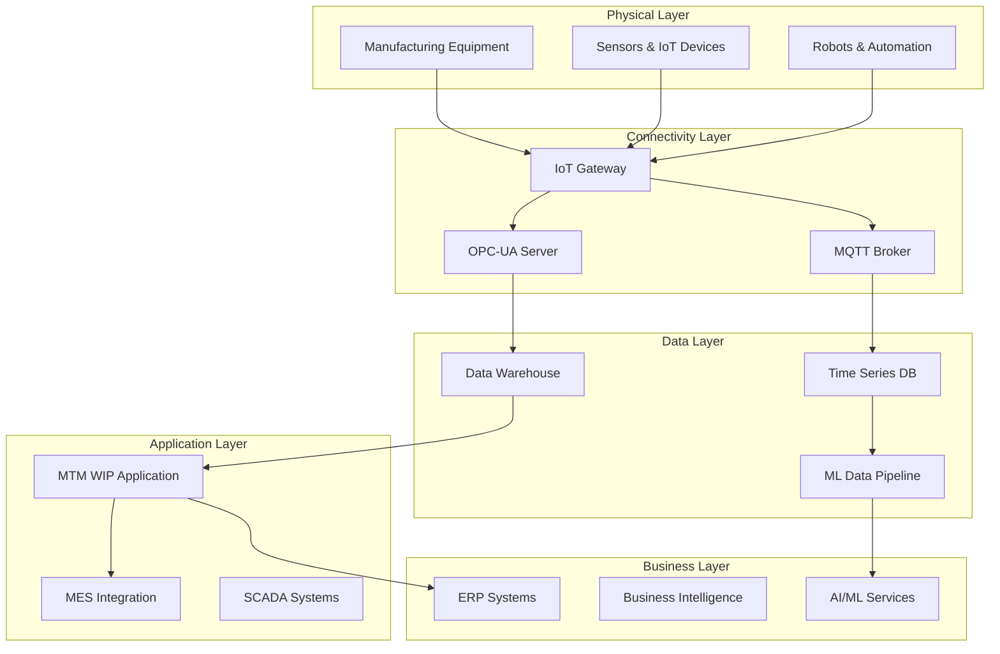

# Industry 4.0 Integration - MTM WIP Application Instructions

**Framework**: .NET 8 with IoT and Machine Learning Integration  
**Pattern**: Smart Manufacturing and Digital Transformation  
**Created**: 2025-09-15  

---

## 🏭 Industry 4.0 Architecture Overview

### Smart Manufacturing Ecosystem Integration



---

## 🌐 IoT Device Integration Patterns

### IoT Device Connection Manager

```csharp
// Comprehensive IoT device management for manufacturing
public class IoTDeviceConnectionManager : IIoTConnectionManager, IDisposable
{
    private readonly IMqttClientFactory _mqttClientFactory;
    private readonly IOpcUaClientFactory _opcUaClientFactory;
    private readonly IDeviceConfigurationRepository _deviceRepository;
    private readonly ICircuitBreaker _circuitBreaker;
    private readonly ILogger<IoTDeviceConnectionManager> _logger;
    
    private readonly ConcurrentDictionary<string, IDeviceConnection> _activeConnections;
    private readonly SemaphoreSlim _connectionSemaphore;
    
    public IoTDeviceConnectionManager(
        IMqttClientFactory mqttClientFactory,
        IOpcUaClientFactory opcUaClientFactory,
        IDeviceConfigurationRepository deviceRepository,
        ICircuitBreaker circuitBreaker,
        ILogger<IoTDeviceConnectionManager> logger)
    {
        _mqttClientFactory = mqttClientFactory;
        _opcUaClientFactory = opcUaClientFactory;
        _deviceRepository = deviceRepository;
        _circuitBreaker = circuitBreaker;
        _logger = logger;
        
        _activeConnections = new ConcurrentDictionary<string, IDeviceConnection>();
        _connectionSemaphore = new SemaphoreSlim(10, 10); // Limit concurrent connections
    }
    
    public async Task<IDeviceConnection> ConnectAsync(DeviceConfiguration device)
    {
        await _connectionSemaphore.WaitAsync();
        
        try
        {
            if (_activeConnections.TryGetValue(device.DeviceId, out var existingConnection))
            {
                if (existingConnection.IsConnected)
                {
                    return existingConnection;
                }
                
                // Remove stale connection
                _activeConnections.TryRemove(device.DeviceId, out _);
                existingConnection.Dispose();
            }
            
            // Create new connection based on protocol
            var connection = await _circuitBreaker.ExecuteAsync(async () =>
            {
                return device.Protocol switch
                {
                    IoTProtocol.MQTT => await CreateMqttConnectionAsync(device),
                    IoTProtocol.OpcUA => await CreateOpcUaConnectionAsync(device),
                    IoTProtocol.ModbusTCP => await CreateModbusConnectionAsync(device),
                    IoTProtocol.EthernetIP => await CreateEthernetIpConnectionAsync(device),
                    _ => throw new NotSupportedException($"Protocol {device.Protocol} not supported")
                };
            });
            
            if (connection.IsConnected)
            {
                _activeConnections[device.DeviceId] = connection;
                await InitializeDeviceMonitoringAsync(device, connection);
                
                _logger.LogInformation("Successfully connected to IoT device {DeviceId} using {Protocol}",
                    device.DeviceId, device.Protocol);
            }
            
            return connection;
        }
        catch (Exception ex)
        {
            _logger.LogError(ex, "Failed to connect to IoT device {DeviceId}", device.DeviceId);
            throw;
        }
        finally
        {
            _connectionSemaphore.Release();
        }
    }
    
    private async Task<IDeviceConnection> CreateMqttConnectionAsync(DeviceConfiguration device)
    {
        var mqttClient = _mqttClientFactory.CreateMqttClient();
        
        var options = new MqttClientOptionsBuilder()
            .WithTcpServer(device.EndpointUrl, device.Port)
            .WithCredentials(device.Username, device.Password)
            .WithClientId($"MTM_WIP_{device.DeviceId}")
            .WithCleanSession()
            .WithKeepAlivePeriod(TimeSpan.FromSeconds(30))
            .WithCommunicationTimeout(TimeSpan.FromSeconds(10))
            .Build();
        
        await mqttClient.ConnectAsync(options);
        
        return new MqttDeviceConnection(mqttClient, device);
    }
    
    private async Task<IDeviceConnection> CreateOpcUaConnectionAsync(DeviceConfiguration device)
    {
        var opcClient = _opcUaClientFactory.CreateClient();
        
        var config = new ApplicationConfiguration
        {
            ApplicationName = "MTM WIP OPC UA Client",
            ApplicationType = ApplicationType.Client,
            SecurityConfiguration = new SecurityConfiguration
            {
                ApplicationCertificate = new CertificateIdentifier(),
                TrustedPeerCertificates = new CertificateTrustList(),
                TrustedIssuerCertificates = new CertificateTrustList(),
                RejectedCertificateStore = new CertificateStoreIdentifier()
            }
        };
        
        await config.Validate(ApplicationType.Client);
        
        var endpoint = new EndpointDescription
        {
            EndpointUrl = device.EndpointUrl,
            SecurityMode = MessageSecurityMode.SignAndEncrypt,
            SecurityPolicyUri = SecurityPolicies.Basic256Sha256,
            Server = new ApplicationDescription
            {
                ApplicationUri = device.EndpointUrl
            }
        };
        
        await opcClient.Connect(endpoint, new UserIdentity(device.Username, device.Password));
        
        return new OpcUaDeviceConnection(opcClient, device);
    }
    
    private async Task InitializeDeviceMonitoringAsync(
        DeviceConfiguration device, 
        IDeviceConnection connection)
    {
        // Subscribe to device status changes
        connection.OnConnectionStatusChanged += async (status) =>
        {
            await HandleConnectionStatusChangeAsync(device, status);
        };
        
        // Subscribe to device errors
        connection.OnError += async (error) =>
        {
            await HandleDeviceErrorAsync(device, error);
        };
        
        // Configure data collection based on device capabilities
        foreach (var dataPoint in device.DataPoints)
        {
            await connection.SubscribeToDataPointAsync(dataPoint);
        }
        
        // Start periodic health check
        _ = Task.Run(async () => await PeriodicHealthCheckAsync(device, connection));
    }
    
    private async Task PeriodicHealthCheckAsync(DeviceConfiguration device, IDeviceConnection connection)
    {
        while (connection.IsConnected && !_disposedValue)
        {
            try
            {
                var healthStatus = await connection.CheckHealthAsync();
                
                if (healthStatus.Status != DeviceHealthStatus.Healthy)
                {
                    _logger.LogWarning("Device {DeviceId} health check failed: {Status} - {Message}",
                        device.DeviceId, healthStatus.Status, healthStatus.Message);
                        
                    // Attempt reconnection if unhealthy
                    if (healthStatus.Status == DeviceHealthStatus.Disconnected)
                    {
                        await AttemptReconnectionAsync(device, connection);
                    }
                }
                
                await Task.Delay(TimeSpan.FromMinutes(5)); // Health check every 5 minutes
            }
            catch (Exception ex)
            {
                _logger.LogError(ex, "Health check failed for device {DeviceId}", device.DeviceId);
                await Task.Delay(TimeSpan.FromMinutes(1)); // Retry after 1 minute on error
            }
        }
    }
}
```

### Real-Time Data Processing Pipeline

```csharp
// Real-time manufacturing data processing with stream analytics
public class RealTimeManufacturingDataProcessor : IDataProcessor
{
    private readonly IStreamProcessor _streamProcessor;
    private readonly ITimeSeriesDatabase _timeSeriesDb;
    private readonly IManufacturingEventBus _eventBus;
    private readonly IAlertingService _alertingService;
    private readonly ILogger<RealTimeManufacturingDataProcessor> _logger;
    
    public async Task ProcessManufacturingDataStreamAsync(IAsyncEnumerable<ManufacturingDataPoint> dataStream)
    {
        await foreach (var dataPoint in dataStream)
        {
            try
            {
                // Process data point through analytics pipeline
                var processedData = await ProcessDataPointAsync(dataPoint);
                
                // Store in time series database
                await _timeSeriesDb.WriteAsync(processedData);
                
                // Apply real-time analytics
                var analyticsResult = await ApplyRealTimeAnalyticsAsync(processedData);
                
                // Check for alerts and anomalies
                await CheckForAlertsAsync(dataPoint, analyticsResult);
                
                // Publish processed data event
                await _eventBus.PublishAsync(new ManufacturingDataProcessedEvent(processedData, analyticsResult));
            }
            catch (Exception ex)
            {
                _logger.LogError(ex, "Failed to process manufacturing data point from device {DeviceId}",
                    dataPoint.DeviceId);
                
                // Continue processing other data points
                continue;
            }
        }
    }
    
    private async Task<ProcessedManufacturingData> ProcessDataPointAsync(ManufacturingDataPoint dataPoint)
    {
        var processedData = new ProcessedManufacturingData
        {
            DeviceId = dataPoint.DeviceId,
            Timestamp = dataPoint.Timestamp,
            RawValue = dataPoint.Value,
            DataType = dataPoint.DataType,
            Quality = dataPoint.Quality
        };
        
        // Apply data validation
        var validationResult = await ValidateDataPointAsync(dataPoint);
        processedData.IsValid = validationResult.IsValid;
        processedData.ValidationErrors = validationResult.Errors;
        
        if (!validationResult.IsValid)
        {
            return processedData;
        }
        
        // Apply data transformations based on data type
        processedData.ProcessedValue = dataPoint.DataType switch
        {
            ManufacturingDataType.Temperature => ConvertTemperature(dataPoint.Value, dataPoint.Unit),
            ManufacturingDataType.Pressure => ConvertPressure(dataPoint.Value, dataPoint.Unit),
            ManufacturingDataType.Flow => ConvertFlowRate(dataPoint.Value, dataPoint.Unit),
            ManufacturingDataType.ProductionCount => ValidateProductionCount(dataPoint.Value),
            ManufacturingDataType.Quality => NormalizeQualityMeasurement(dataPoint.Value, dataPoint.SpecLimits),
            _ => dataPoint.Value
        };
        
        // Calculate derived metrics
        processedData.DerivedMetrics = await CalculateDerivedMetricsAsync(dataPoint);
        
        // Apply statistical process control
        processedData.SPCAnalysis = await ApplySPCAnalysisAsync(dataPoint);
        
        return processedData;
    }
    
    private async Task<RealTimeAnalyticsResult> ApplyRealTimeAnalyticsAsync(ProcessedManufacturingData data)
    {
        var result = new RealTimeAnalyticsResult
        {
            DeviceId = data.DeviceId,
            Timestamp = data.Timestamp,
            AnalyticsApplied = new List<string>()
        };
        
        // Moving average calculation
        var movingAverage = await CalculateMovingAverageAsync(data.DeviceId, data.DataType, TimeSpan.FromMinutes(30));
        result.MovingAverage = movingAverage;
        result.AnalyticsApplied.Add("MovingAverage");
        
        // Trend analysis
        var trendAnalysis = await AnalyzeTrendAsync(data.DeviceId, data.DataType, TimeSpan.FromHours(4));
        result.TrendDirection = trendAnalysis.Direction;
        result.TrendStrength = trendAnalysis.Strength;
        result.AnalyticsApplied.Add("TrendAnalysis");
        
        // Anomaly detection
        var anomalyResult = await DetectAnomaliesAsync(data);
        result.IsAnomaly = anomalyResult.IsAnomaly;
        result.AnomalyScore = anomalyResult.Score;
        result.AnomalyType = anomalyResult.Type;
        result.AnalyticsApplied.Add("AnomalyDetection");
        
        // Predictive analytics (if model available)
        if (await HasPredictiveModelAsync(data.DeviceId, data.DataType))
        {
            var prediction = await MakePredictionAsync(data);
            result.PredictedValue = prediction.Value;
            result.PredictionConfidence = prediction.Confidence;
            result.AnalyticsApplied.Add("PredictiveAnalytics");
        }
        
        return result;
    }
    
    private async Task CheckForAlertsAsync(ManufacturingDataPoint dataPoint, RealTimeAnalyticsResult analytics)
    {
        var alerts = new List<ManufacturingAlert>();
        
        // Threshold-based alerts
        var thresholds = await GetDeviceThresholdsAsync(dataPoint.DeviceId, dataPoint.DataType);
        if (thresholds != null)
        {
            if (dataPoint.Value > thresholds.HighAlarm)
            {
                alerts.Add(new ManufacturingAlert
                {
                    AlertType = AlertType.HighAlarm,
                    Severity = AlertSeverity.Critical,
                    Message = $"{dataPoint.DataType} value {dataPoint.Value} exceeds high alarm threshold {thresholds.HighAlarm}",
                    DeviceId = dataPoint.DeviceId,
                    Timestamp = dataPoint.Timestamp
                });
            }
            else if (dataPoint.Value > thresholds.HighWarning)
            {
                alerts.Add(new ManufacturingAlert
                {
                    AlertType = AlertType.HighWarning,
                    Severity = AlertSeverity.Warning,
                    Message = $"{dataPoint.DataType} value {dataPoint.Value} exceeds high warning threshold {thresholds.HighWarning}",
                    DeviceId = dataPoint.DeviceId,
                    Timestamp = dataPoint.Timestamp
                });
            }
        }
        
        // Anomaly-based alerts
        if (analytics.IsAnomaly && analytics.AnomalyScore > 0.8)
        {
            alerts.Add(new ManufacturingAlert
            {
                AlertType = AlertType.Anomaly,
                Severity = AlertSeverity.Warning,
                Message = $"Anomaly detected for {dataPoint.DataType}: {analytics.AnomalyType} (Score: {analytics.AnomalyScore:F2})",
                DeviceId = dataPoint.DeviceId,
                Timestamp = dataPoint.Timestamp
            });
        }
        
        // SPC-based alerts
        if (analytics.SPCViolation.HasValue)
        {
            alerts.Add(new ManufacturingAlert
            {
                AlertType = AlertType.SPCViolation,
                Severity = AlertSeverity.High,
                Message = $"SPC violation detected: {analytics.SPCViolation}",
                DeviceId = dataPoint.DeviceId,
                Timestamp = dataPoint.Timestamp
            });
        }
        
        // Send alerts
        foreach (var alert in alerts)
        {
            await _alertingService.SendAlertAsync(alert);
            await _eventBus.PublishAsync(new ManufacturingAlertEvent(alert));
        }
    }
}
```

---

## 🤖 Machine Learning Integration Patterns

### Manufacturing ML Model Service

```csharp
// Machine learning model service for manufacturing optimization
public class ManufacturingMLModelService : IMLModelService
{
    private readonly ITensorFlowModelManager _tensorFlowManager;
    private readonly IMLModelRepository _modelRepository;
    private readonly IFeatureEngineeringService _featureEngineering;
    private readonly IModelTrainingService _trainingService;
    private readonly ILogger<ManufacturingMLModelService> _logger;
    
    private readonly ConcurrentDictionary<string, LoadedModel> _loadedModels;
    private readonly SemaphoreSlim _modelLoadSemaphore;
    
    public ManufacturingMLModelService(
        ITensorFlowModelManager tensorFlowManager,
        IMLModelRepository modelRepository,
        IFeatureEngineeringService featureEngineering,
        IModelTrainingService trainingService,
        ILogger<ManufacturingMLModelService> logger)
    {
        _tensorFlowManager = tensorFlowManager;
        _modelRepository = modelRepository;
        _featureEngineering = featureEngineering;
        _trainingService = trainingService;
        _logger = logger;
        
        _loadedModels = new ConcurrentDictionary<string, LoadedModel>();
        _modelLoadSemaphore = new SemaphoreSlim(5, 5);
    }
    
    public async Task<QualityPredictionResult> PredictQualityAsync(QualityPredictionInput input)
    {
        try
        {
            // Load quality prediction model
            var model = await GetOrLoadModelAsync("quality_prediction", "v2.1");
            
            // Engineer features from input
            var features = await _featureEngineering.CreateQualityFeaturesAsync(input);
            
            // Validate feature completeness
            var featureValidation = ValidateFeatures(features, model.RequiredFeatures);
            if (!featureValidation.IsValid)
            {
                return new QualityPredictionResult
                {
                    IsSuccess = false,
                    ErrorMessage = $"Feature validation failed: {string.Join(", ", featureValidation.MissingFeatures)}"
                };
            }
            
            // Run inference
            var prediction = await _tensorFlowManager.PredictAsync(model.TensorFlowModel, features);
            
            // Extract and interpret results
            var qualityScore = prediction.GetOutput<float>("quality_score");
            var defectProbability = prediction.GetOutput<float>("defect_probability");
            var featureImportance = prediction.GetOutput<float[]>("feature_importance");
            var confidenceInterval = prediction.GetOutput<float[]>("confidence_interval");
            
            // Generate actionable insights
            var insights = GenerateQualityInsights(qualityScore, defectProbability, featureImportance, input);
            
            // Log prediction for model monitoring
            await LogPredictionAsync("quality_prediction", input, qualityScore, defectProbability);
            
            return new QualityPredictionResult
            {
                IsSuccess = true,
                QualityScore = qualityScore,
                DefectProbability = defectProbability,
                ConfidenceInterval = new ConfidenceInterval
                {
                    Lower = confidenceInterval[0],
                    Upper = confidenceInterval[1],
                    ConfidenceLevel = 0.95f
                },
                FeatureImportance = MapFeatureImportance(features.FeatureNames, featureImportance),
                Insights = insights,
                ModelVersion = model.Version,
                PredictionTimestamp = DateTime.UtcNow
            };
        }
        catch (Exception ex)
        {
            _logger.LogError(ex, "Quality prediction failed for part {PartId} at operation {Operation}",
                input.PartId, input.OperationNumber);
                
            return new QualityPredictionResult
            {
                IsSuccess = false,
                ErrorMessage = $"Prediction failed: {ex.Message}"
            };
        }
    }
    
    public async Task<OptimizationRecommendations> OptimizeProcessParametersAsync(
        ProcessOptimizationInput input)
    {
        try
        {
            // Load process optimization model
            var model = await GetOrLoadModelAsync("process_optimization", "v1.3");
            
            // Create optimization features
            var features = await _featureEngineering.CreateOptimizationFeaturesAsync(input);
            
            // Run optimization inference
            var prediction = await _tensorFlowManager.PredictAsync(model.TensorFlowModel, features);
            
            // Extract optimization recommendations
            var recommendedParameters = prediction.GetOutput<Dictionary<string, float>>("recommended_parameters");
            var expectedImpact = prediction.GetOutput<float>("expected_improvement");
            var implementationRisk = prediction.GetOutput<float>("implementation_risk");
            
            // Validate recommended parameters against operational constraints
            var constraintValidation = await ValidateParameterConstraintsAsync(recommendedParameters, input);
            
            // Generate implementation plan
            var implementationPlan = await GenerateImplementationPlanAsync(
                recommendedParameters, constraintValidation, input);
            
            return new OptimizationRecommendations
            {
                IsSuccess = true,
                RecommendedParameters = recommendedParameters,
                ExpectedImprovement = expectedImpact,
                ImplementationRisk = implementationRisk,
                ConstraintViolations = constraintValidation.Violations,
                ImplementationPlan = implementationPlan,
                ModelVersion = model.Version,
                OptimizationTimestamp = DateTime.UtcNow
            };
        }
        catch (Exception ex)
        {
            _logger.LogError(ex, "Process optimization failed for part {PartId}", input.PartId);
            
            return new OptimizationRecommendations
            {
                IsSuccess = false,
                ErrorMessage = $"Optimization failed: {ex.Message}"
            };
        }
    }
    
    private async Task<LoadedModel> GetOrLoadModelAsync(string modelName, string version)
    {
        var modelKey = $"{modelName}:{version}";
        
        if (_loadedModels.TryGetValue(modelKey, out var existingModel))
        {
            // Check if model is still fresh (reload every hour)
            if (DateTime.UtcNow - existingModel.LoadedAt < TimeSpan.FromHours(1))
            {
                return existingModel;
            }
        }
        
        await _modelLoadSemaphore.WaitAsync();
        try
        {
            // Double-check after acquiring semaphore
            if (_loadedModels.TryGetValue(modelKey, out existingModel))
            {
                if (DateTime.UtcNow - existingModel.LoadedAt < TimeSpan.FromHours(1))
                {
                    return existingModel;
                }
            }
            
            // Load model from repository
            var modelMetadata = await _modelRepository.GetModelAsync(modelName, version);
            var tensorFlowModel = await _tensorFlowManager.LoadModelAsync(modelMetadata.ModelPath);
            
            var loadedModel = new LoadedModel
            {
                Name = modelName,
                Version = version,
                TensorFlowModel = tensorFlowModel,
                RequiredFeatures = modelMetadata.RequiredFeatures,
                LoadedAt = DateTime.UtcNow,
                Metadata = modelMetadata
            };
            
            // Cache loaded model
            _loadedModels[modelKey] = loadedModel;
            
            _logger.LogInformation("Loaded ML model {ModelName} version {Version}", modelName, version);
            
            return loadedModel;
        }
        finally
        {
            _modelLoadSemaphore.Release();
        }
    }
    
    private List<QualityInsight> GenerateQualityInsights(
        float qualityScore, 
        float defectProbability, 
        float[] featureImportance,
        QualityPredictionInput input)
    {
        var insights = new List<QualityInsight>();
        
        // Overall quality assessment
        if (qualityScore >= 0.95f)
        {
            insights.Add(new QualityInsight
            {
                Type = InsightType.Positive,
                Message = $"Excellent quality prediction ({qualityScore:P1}). Current process parameters are optimal.",
                Confidence = 0.95f
            });
        }
        else if (qualityScore < 0.85f)
        {
            insights.Add(new QualityInsight
            {
                Type = InsightType.Warning,
                Message = $"Below-target quality prediction ({qualityScore:P1}). Process adjustment recommended.",
                Confidence = 0.90f
            });
        }
        
        // Defect probability insights
        if (defectProbability > 0.1f)
        {
            insights.Add(new QualityInsight
            {
                Type = InsightType.Risk,
                Message = $"Elevated defect probability ({defectProbability:P1}). Consider increased inspection.",
                Confidence = 0.88f
            });
        }
        
        // Feature importance insights
        var topFeatures = GetTopInfluentialFeatures(featureImportance, 3);
        foreach (var feature in topFeatures)
        {
            insights.Add(new QualityInsight
            {
                Type = InsightType.Information,
                Message = $"Parameter '{feature.Name}' has high impact on quality (importance: {feature.Importance:P1}).",
                Confidence = 0.85f
            });
        }
        
        return insights;
    }
}
```

### Predictive Maintenance System

```csharp
// Predictive maintenance system with ML and IoT integration
public class PredictiveMaintenanceSystem : IPredictiveMaintenanceService
{
    private readonly IMLModelService _mlModelService;
    private readonly IVibrationAnalysisService _vibrationAnalysis;
    private readonly IMaintenanceSchedulingService _schedulingService;
    private readonly IWorkOrderService _workOrderService;
    private readonly INotificationService _notificationService;
    private readonly ILogger<PredictiveMaintenanceSystem> _logger;
    
    public async Task<MaintenancePrediction> AnalyzeMachineConditionAsync(
        string machineId,
        MaintenanceAnalysisType analysisType = MaintenanceAnalysisType.Comprehensive)
    {
        try
        {
            using var activity = ManufacturingTelemetry.StartActivity("AnalyzeMachineCondition");
            activity?.SetTag("machine.id", machineId);
            activity?.SetTag("analysis.type", analysisType.ToString());
            
            // Collect multi-source data for analysis
            var sensorData = await CollectSensorDataAsync(machineId);
            var historicalData = await GetMaintenanceHistoryAsync(machineId);
            var operationalData = await GetOperationalDataAsync(machineId);
            
            // Apply ML-based condition assessment
            var conditionAssessment = await _mlModelService.AssessMachineConditionAsync(
                new ConditionAssessmentInput
                {
                    MachineId = machineId,
                    SensorData = sensorData,
                    HistoricalData = historicalData,
                    OperationalData = operationalData,
                    AnalysisType = analysisType
                });
            
            // Perform specialized analysis based on machine type
            var specializedAnalysis = await PerformSpecializedAnalysisAsync(machineId, sensorData);
            
            // Generate maintenance prediction
            var prediction = new MaintenancePrediction
            {
                MachineId = machineId,
                AnalysisTimestamp = DateTime.UtcNow,
                OverallCondition = conditionAssessment.OverallCondition,
                HealthScore = conditionAssessment.HealthScore,
                RemainingUsefulLife = conditionAssessment.RemainingUsefulLife,
                FailureProbability = conditionAssessment.FailureProbability,
                ComponentAnalysis = await AnalyzeIndividualComponentsAsync(machineId, sensorData),
                MaintenanceRecommendations = GenerateMaintenanceRecommendations(conditionAssessment, specializedAnalysis),
                PredictionConfidence = conditionAssessment.Confidence
            };
            
            // Schedule maintenance actions if needed
            await ScheduleMaintenanceActionsAsync(prediction);
            
            // Send notifications for critical conditions
            await SendConditionNotificationsAsync(prediction);
            
            return prediction;
        }
        catch (Exception ex)
        {
            _logger.LogError(ex, "Failed to analyze machine condition for {MachineId}", machineId);
            throw;
        }
    }
    
    private async Task<SpecializedAnalysisResult> PerformSpecializedAnalysisAsync(
        string machineId, 
        SensorDataCollection sensorData)
    {
        var machineType = await GetMachineTypeAsync(machineId);
        
        return machineType switch
        {
            MachineType.RotatingEquipment => await AnalyzeRotatingEquipmentAsync(machineId, sensorData),
            MachineType.HydraulicSystem => await AnalyzeHydraulicSystemAsync(machineId, sensorData),
            MachineType.PneumaticSystem => await AnalyzePneumaticSystemAsync(machineId, sensorData),
            MachineType.ElectricalMotor => await AnalyzeElectricalMotorAsync(machineId, sensorData),
            MachineType.Conveyor => await AnalyzeConveyorSystemAsync(machineId, sensorData),
            _ => new SpecializedAnalysisResult { AnalysisType = "Generic", Status = "No specialized analysis available" }
        };
    }
    
    private async Task<SpecializedAnalysisResult> AnalyzeRotatingEquipmentAsync(
        string machineId, 
        SensorDataCollection sensorData)
    {
        var vibrationData = sensorData.GetVibrationData();
        if (vibrationData == null)
        {
            return new SpecializedAnalysisResult 
            { 
                AnalysisType = "Rotating Equipment", 
                Status = "No vibration data available" 
            };
        }
        
        // Perform FFT analysis on vibration data
        var fftResult = await _vibrationAnalysis.PerformFFTAnalysisAsync(vibrationData);
        
        // Analyze frequency spectrum for common rotating equipment faults
        var faultAnalysis = new Dictionary<string, FaultSeverity>
        {
            ["Imbalance"] = AnalyzeImbalanceFault(fftResult),
            ["Misalignment"] = AnalyzeMisalignmentFault(fftResult),
            ["BearingWear"] = AnalyzeBearingFaults(fftResult),
            ["LooseFoundation"] = AnalyzeFoundationIssues(fftResult),
            ["BeltIssues"] = AnalyzeBeltProblems(fftResult)
        };
        
        // Calculate overall rotating equipment health
        var overallSeverity = faultAnalysis.Values.Max();
        
        // Generate specific recommendations for rotating equipment
        var recommendations = GenerateRotatingEquipmentRecommendations(faultAnalysis, overallSeverity);
        
        return new SpecializedAnalysisResult
        {
            AnalysisType = "Rotating Equipment",
            Status = "Analysis Complete",
            FaultAnalysis = faultAnalysis,
            OverallSeverity = overallSeverity,
            Recommendations = recommendations,
            TechnicalDetails = new Dictionary<string, object>
            {
                ["FFTAnalysis"] = fftResult,
                ["VibrationType"] = vibrationData.MeasurementType,
                ["SamplingRate"] = vibrationData.SamplingRate,
                ["AnalysisFrequencyRange"] = fftResult.FrequencyRange
            }
        };
    }
    
    private List<MaintenanceRecommendation> GenerateMaintenanceRecommendations(
        ConditionAssessmentResult conditionAssessment,
        SpecializedAnalysisResult specializedAnalysis)
    {
        var recommendations = new List<MaintenanceRecommendation>();
        
        // Critical condition recommendations
        if (conditionAssessment.OverallCondition == MachineCondition.Critical)
        {
            recommendations.Add(new MaintenanceRecommendation
            {
                Type = MaintenanceType.Emergency,
                Priority = MaintenancePriority.Critical,
                Description = "Machine condition is critical. Immediate inspection and maintenance required.",
                EstimatedDuration = TimeSpan.FromHours(4),
                EstimatedCost = 5000m,
                RecommendedDate = DateTime.UtcNow,
                SafetyRisk = SafetyRiskLevel.High
            });
        }
        
        // Condition-based recommendations
        if (conditionAssessment.HealthScore < 60)
        {
            recommendations.Add(new MaintenanceRecommendation
            {
                Type = MaintenanceType.Condition,
                Priority = MaintenancePriority.High,
                Description = $"Health score ({conditionAssessment.HealthScore}) below acceptable threshold. Proactive maintenance recommended.",
                EstimatedDuration = TimeSpan.FromHours(2),
                EstimatedCost = 1500m,
                RecommendedDate = DateTime.UtcNow.AddDays(7),
                SafetyRisk = SafetyRiskLevel.Medium
            });
        }
        
        // Remaining useful life recommendations
        if (conditionAssessment.RemainingUsefulLife < TimeSpan.FromDays(30))
        {
            recommendations.Add(new MaintenanceRecommendation
            {
                Type = MaintenanceType.Replacement,
                Priority = MaintenancePriority.High,
                Description = $"Remaining useful life ({conditionAssessment.RemainingUsefulLife.Days} days) requires replacement planning.",
                EstimatedDuration = TimeSpan.FromHours(8),
                EstimatedCost = 25000m,
                RecommendedDate = DateTime.UtcNow.AddDays(conditionAssessment.RemainingUsefulLife.Days - 14),
                SafetyRisk = SafetyRiskLevel.Medium
            });
        }
        
        // Specialized analysis recommendations
        if (specializedAnalysis?.Recommendations != null)
        {
            recommendations.AddRange(specializedAnalysis.Recommendations);
        }
        
        return recommendations.OrderByDescending(r => r.Priority).ToList();
    }
}
```

---

## 📊 Digital Twin and Simulation Integration

### Digital Twin Factory Model

```csharp
// Digital twin implementation for manufacturing facility
public class DigitalTwinFactory : IDigitalTwinService
{
    private readonly IPhysicalAssetRepository _assetRepository;
    private readonly IRealTimeDataService _realTimeData;
    private readonly ISimulationEngine _simulationEngine;
    private readonly IVisualizationService _visualization;
    private readonly ILogger<DigitalTwinFactory> _logger;
    
    private readonly ConcurrentDictionary<string, DigitalAsset> _digitalAssets;
    
    public DigitalTwinFactory(
        IPhysicalAssetRepository assetRepository,
        IRealTimeDataService realTimeData,
        ISimulationEngine simulationEngine,
        IVisualizationService visualization,
        ILogger<DigitalTwinFactory> logger)
    {
        _assetRepository = assetRepository;
        _realTimeData = realTimeData;
        _simulationEngine = simulationEngine;
        _visualization = visualization;
        _logger = logger;
        
        _digitalAssets = new ConcurrentDictionary<string, DigitalAsset>();
    }
    
    public async Task<DigitalTwinModel> CreateFactoryDigitalTwinAsync()
    {
        try
        {
            // Load physical factory layout
            var factoryLayout = await _assetRepository.GetFactoryLayoutAsync();
            
            // Create digital assets for all physical equipment
            var digitalAssets = new List<DigitalAsset>();
            foreach (var physicalAsset in factoryLayout.Assets)
            {
                var digitalAsset = await CreateDigitalAssetAsync(physicalAsset);
                digitalAssets.Add(digitalAsset);
                _digitalAssets[physicalAsset.Id] = digitalAsset;
            }
            
            // Create digital twin model
            var digitalTwin = new DigitalTwinModel
            {
                FactoryId = factoryLayout.FactoryId,
                CreatedAt = DateTime.UtcNow,
                Assets = digitalAssets,
                Layout = MapPhysicalToDigitalLayout(factoryLayout),
                ProcessFlows = await MapProcessFlowsAsync(factoryLayout),
                MaterialFlows = await MapMaterialFlowsAsync(factoryLayout)
            };
            
            // Initialize real-time synchronization
            await InitializeRealTimeSynchronizationAsync(digitalTwin);
            
            // Start continuous simulation
            _ = Task.Run(() => RunContinuousSimulationAsync(digitalTwin));
            
            _logger.LogInformation("Created digital twin for factory {FactoryId} with {AssetCount} assets",
                factoryLayout.FactoryId, digitalAssets.Count);
            
            return digitalTwin;
        }
        catch (Exception ex)
        {
            _logger.LogError(ex, "Failed to create factory digital twin");
            throw;
        }
    }
    
    private async Task<DigitalAsset> CreateDigitalAssetAsync(PhysicalAsset physicalAsset)
    {
        var digitalAsset = new DigitalAsset
        {
            Id = physicalAsset.Id,
            Name = physicalAsset.Name,
            Type = physicalAsset.Type,
            Location = physicalAsset.Location,
            Properties = new Dictionary<string, object>(physicalAsset.Properties),
            Status = AssetStatus.Active,
            CreatedAt = DateTime.UtcNow
        };
        
        // Load asset-specific behavior models
        var behaviorModels = await LoadAssetBehaviorModelsAsync(physicalAsset.Type);
        digitalAsset.BehaviorModels = behaviorModels;
        
        // Initialize physics simulation parameters
        digitalAsset.PhysicsParameters = await LoadPhysicsParametersAsync(physicalAsset);
        
        // Create real-time data bindings
        digitalAsset.DataBindings = await CreateDataBindingsAsync(physicalAsset);
        
        return digitalAsset;
    }
    
    public async Task<SimulationResult> RunProductionSimulationAsync(
        ProductionSimulationInput input)
    {
        try
        {
            // Prepare simulation environment
            var simulationEnvironment = await PrepareSimulationEnvironmentAsync(input);
            
            // Configure simulation parameters
            var simulationConfig = new SimulationConfiguration
            {
                SimulationDuration = input.SimulationDuration,
                TimeStep = input.TimeStep,
                RandomSeed = input.RandomSeed,
                IncludeVariability = input.IncludeVariability,
                VariabilityLevel = input.VariabilityLevel
            };
            
            // Run discrete event simulation
            var simulationResult = await _simulationEngine.RunSimulationAsync(
                simulationEnvironment, simulationConfig);
            
            // Analyze simulation results
            var analysis = await AnalyzeSimulationResultsAsync(simulationResult, input);
            
            // Generate optimization recommendations
            var optimizations = await GenerateOptimizationRecommendationsAsync(analysis);
            
            return new SimulationResult
            {
                SimulationId = Guid.NewGuid().ToString(),
                Input = input,
                Configuration = simulationConfig,
                Results = simulationResult,
                Analysis = analysis,
                Optimizations = optimizations,
                ExecutionTime = simulationResult.ExecutionTime,
                CompletedAt = DateTime.UtcNow
            };
        }
        catch (Exception ex)
        {
            _logger.LogError(ex, "Production simulation failed");
            throw;
        }
    }
    
    private async Task RunContinuousSimulationAsync(DigitalTwinModel digitalTwin)
    {
        var simulationInterval = TimeSpan.FromSeconds(10);
        
        while (!_disposedValue)
        {
            try
            {
                // Update digital assets with real-time data
                await UpdateDigitalAssetsAsync(digitalTwin);
                
                // Run micro-simulation to predict next state
                var microSimResult = await _simulationEngine.RunMicroSimulationAsync(digitalTwin);
                
                // Update predictions and alerts
                await UpdatePredictionsAsync(digitalTwin, microSimResult);
                
                // Update visualizations
                await _visualization.UpdateDigitalTwinVisualizationAsync(digitalTwin);
                
                await Task.Delay(simulationInterval);
            }
            catch (Exception ex)
            {
                _logger.LogError(ex, "Continuous simulation error for digital twin {FactoryId}",
                    digitalTwin.FactoryId);
                
                // Continue running despite errors
                await Task.Delay(TimeSpan.FromMinutes(1));
            }
        }
    }
}
```

---

## 📚 Related Documentation

- **Advanced Manufacturing Workflows**: [Complex Manufacturing Processes](./advanced-manufacturing-workflows.instructions.md)
- **Service Integration**: [Cross-Service Communication](./service-integration.instructions.md)
- **Performance Optimization**: [Manufacturing Performance Standards](./performance-optimization.instructions.md)
- **Quality Assurance**: [Manufacturing Quality Gates](../templates/qa/manufacturing-quality-gates.template.md)

---

**Document Status**: ✅ Complete Industry 4.0 Integration Reference  
**Framework Version**: .NET 8 with IoT and ML Integration  
**Last Updated**: 2025-09-15  
**Industry 4.0 Integration Owner**: MTM Development Team