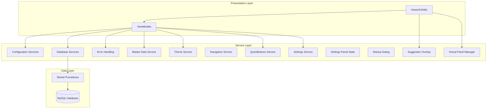
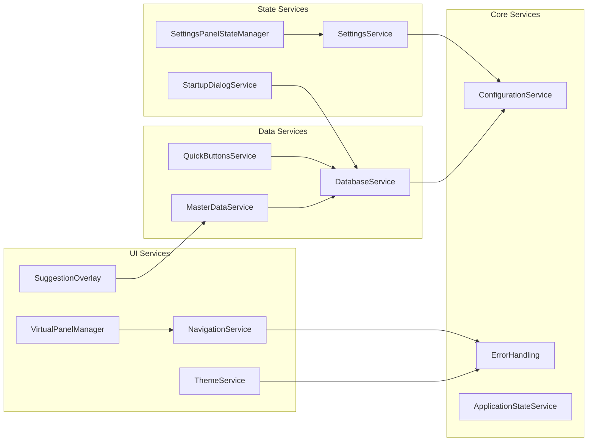

# Service Architecture - MTM WIP Application Instructions

**Framework**: .NET 8 with Microsoft.Extensions DI  
**Pattern**: Service-Oriented Architecture with Category-Based Consolidation  
**Created**: September 4, 2025  

---

## 🏗️ MTM Service Architecture Overview

### Service Organization Philosophy
MTM application uses **category-based service consolidation** where related functionality is grouped into single files rather than individual service classes. This reduces file proliferation while maintaining clear separation of concerns.



---

## 📋 Core Services Documentation

### 1. Configuration Services (`Services/Configuration.cs`)

```csharp
// Service consolidation pattern - multiple related services in one file
namespace MTM_WIP_Application_Avalonia.Services
{
    // Primary configuration service
    public class ConfigurationService : IConfigurationService
    {
        private readonly IConfiguration _configuration;
        private readonly ILogger<ConfigurationService> _logger;

        public ConfigurationService(IConfiguration configuration, ILogger<ConfigurationService> logger)
        {
            _configuration = configuration ?? throw new ArgumentNullException(nameof(configuration));
            _logger = logger ?? throw new ArgumentNullException(nameof(logger));
        }

        public string GetConnectionString() => 
            _configuration.GetConnectionString("DefaultConnection") ?? 
            throw new InvalidOperationException("Connection string not configured");

        public T GetValue<T>(string key) => _configuration.GetValue<T>(key);
        public string GetValue(string key) => _configuration.GetValue<string>(key) ?? string.Empty;
    }

    // Application state management service (co-located)
    public class ApplicationStateService : IApplicationStateService
    {
        private readonly Dictionary<string, object> _state = new();
        private readonly ILogger<ApplicationStateService> _logger;

        public ApplicationStateService(ILogger<ApplicationStateService> logger)
        {
            _logger = logger ?? throw new ArgumentNullException(nameof(logger));
        }

        public void SetValue<T>(string key, T value)
        {
            _state[key] = value ?? throw new ArgumentNullException(nameof(value));
            _logger.LogDebug("Application state updated: {Key}", key);
        }

        public T GetValue<T>(string key) => _state.TryGetValue(key, out var value) ? (T)value : default(T);
        public bool HasValue(string key) => _state.ContainsKey(key);
    }
}
```

**Dependencies**: IConfiguration, Microsoft.Extensions.Logging  
**Lifecycle**: Singleton (ConfigurationService), Scoped (ApplicationStateService)  
**Usage**: All ViewModels and Services that need configuration access

---

### 2. Database Services (`Services/Database.cs`)

```csharp
namespace MTM_WIP_Application_Avalonia.Services
{
    public class DatabaseService : IDatabaseService
    {
        private readonly string _connectionString;
        private readonly ILogger<DatabaseService> _logger;

        public DatabaseService(IConfigurationService configurationService, ILogger<DatabaseService> logger)
        {
            _connectionString = configurationService.GetConnectionString();
            _logger = logger ?? throw new ArgumentNullException(nameof(logger));
        }

        // Standard database operation pattern
        public async Task<ServiceResult<DataTable>> ExecuteStoredProcedureAsync(
            string procedureName, 
            MySqlParameter[] parameters)
        {
            try
            {
                _logger.LogDebug("Executing stored procedure: {ProcedureName}", procedureName);

                var result = await Helper_Database_StoredProcedure.ExecuteDataTableWithStatus(
                    _connectionString,
                    procedureName,
                    parameters
                );

                if (result.Status == 1)
                {
                    _logger.LogDebug("Stored procedure successful: {ProcedureName}, Rows: {RowCount}", 
                        procedureName, result.Data.Rows.Count);
                    return ServiceResult<DataTable>.Success(result.Data);
                }
                else
                {
                    _logger.LogWarning("Stored procedure failed: {ProcedureName}, Status: {Status}, Message: {Message}", 
                        procedureName, result.Status, result.Message);
                    return ServiceResult<DataTable>.Failure($"Database operation failed: {result.Message}");
                }
            }
            catch (Exception ex)
            {
                _logger.LogError(ex, "Error executing stored procedure: {ProcedureName}", procedureName);
                return ServiceResult<DataTable>.Failure($"Database error: {ex.Message}");
            }
        }

        // Health check functionality
        public async Task<bool> TestConnectionAsync()
        {
            try
            {
                var result = await ExecuteStoredProcedureAsync("sys_health_check", Array.Empty<MySqlParameter>());
                return result.IsSuccess;
            }
            catch
            {
                return false;
            }
        }
    }

    // Database connection factory (co-located)
    public class DatabaseConnectionFactory : IDatabaseConnectionFactory
    {
        private readonly string _connectionString;

        public DatabaseConnectionFactory(IConfigurationService configurationService)
        {
            _connectionString = configurationService.GetConnectionString();
        }

        public MySqlConnection CreateConnection() => new MySqlConnection(_connectionString);
    }
}
```

**Dependencies**: IConfigurationService, MySql.Data, Helper_Database_StoredProcedure  
**Lifecycle**: Scoped  
**Usage**: All data-access operations across the application

---

### 3. Error Handling Service (`Services/ErrorHandling.cs`)

```csharp
namespace MTM_WIP_Application_Avalonia.Services
{
    // Centralized error handling (static for easy access)
    public static class ErrorHandling
    {
        private static readonly ILogger Logger = LoggerFactory.Create(builder => 
            builder.AddConsole()).CreateLogger(typeof(ErrorHandling));

        public static async Task HandleErrorAsync(Exception exception, string context)
        {
            Logger.LogError(exception, "Error in {Context}: {Message}", context, exception.Message);

            // Log to database if possible
            await LogErrorToDatabaseAsync(exception, context);

            // Show user-friendly message (in production, avoid technical details)
            var userMessage = GetUserFriendlyMessage(exception);
            await ShowErrorToUserAsync(userMessage, context);
        }

        private static async Task LogErrorToDatabaseAsync(Exception exception, string context)
        {
            try
            {
                var parameters = new MySqlParameter[]
                {
                    new("p_ErrorMessage", exception.Message),
                    new("p_StackTrace", exception.StackTrace ?? string.Empty),
                    new("p_Context", context),
                    new("p_UserID", Environment.UserName),
                    new("p_Timestamp", DateTime.Now),
                    new("p_MachineName", Environment.MachineName)
                };

                await Helper_Database_StoredProcedure.ExecuteDataTableWithStatus(
                    ConfigurationService.GetConnectionString(),
                    "log_error_Add_Error",
                    parameters
                );
            }
            catch (Exception dbEx)
            {
                Logger.LogError(dbEx, "Failed to log error to database");
            }
        }

        private static string GetUserFriendlyMessage(Exception exception) =>
            exception switch
            {
                MySqlException => "Database operation failed. Please try again or contact support.",
                TimeoutException => "The operation took too long to complete. Please try again.",
                UnauthorizedAccessException => "You don't have permission to perform this operation.",
                ArgumentException => "Invalid input provided. Please check your data and try again.",
                _ => "An unexpected error occurred. Please contact support if the problem persists."
            };

        private static async Task ShowErrorToUserAsync(string message, string context)
        {
            // Integration with UI notification system would go here
            await Task.Delay(1); // Placeholder for async UI operation
        }
    }

    // Error data models (co-located)
    public class ErrorEntry
    {
        public int Id { get; set; }
        public string ErrorMessage { get; set; } = string.Empty;
        public string StackTrace { get; set; } = string.Empty;
        public string Context { get; set; } = string.Empty;
        public string UserId { get; set; } = string.Empty;
        public DateTime Timestamp { get; set; }
        public string MachineName { get; set; } = string.Empty;
    }

    public static class ErrorConfiguration
    {
        public const int MaxErrorMessageLength = 1000;
        public const int MaxStackTraceLength = 4000;
        public const int ErrorRetentionDays = 90;
    }
}
```

**Dependencies**: Microsoft.Extensions.Logging, MySql.Data  
**Lifecycle**: Static (globally accessible)  
**Usage**: All ViewModels and Services for centralized error handling

---

### 4. Master Data Service (`Services/MasterDataService.cs`)

```csharp
namespace MTM_WIP_Application_Avalonia.Services
{
    public class MasterDataService : IMasterDataService
    {
        private readonly IDatabaseService _databaseService;
        private readonly ILogger<MasterDataService> _logger;
        private readonly IMemoryCache _cache;

        public MasterDataService(
            IDatabaseService databaseService, 
            ILogger<MasterDataService> logger,
            IMemoryCache cache)
        {
            _databaseService = databaseService ?? throw new ArgumentNullException(nameof(databaseService));
            _logger = logger ?? throw new ArgumentNullException(nameof(logger));
            _cache = cache ?? throw new ArgumentNullException(nameof(cache));
        }

        // Cached master data retrieval
        public async Task<List<string>> GetPartIdsAsync()
        {
            const string cacheKey = "master_data_part_ids";
            
            if (_cache.TryGetValue(cacheKey, out List<string> cachedPartIds))
            {
                return cachedPartIds;
            }

            try
            {
                var result = await _databaseService.ExecuteStoredProcedureAsync(
                    "md_part_ids_Get_All", 
                    Array.Empty<MySqlParameter>()
                );

                if (result.IsSuccess)
                {
                    var partIds = new List<string>();
                    foreach (DataRow row in result.Data.Rows)
                    {
                        partIds.Add(row["PartID"].ToString() ?? string.Empty);
                    }

                    // Cache for 5 minutes
                    _cache.Set(cacheKey, partIds, TimeSpan.FromMinutes(5));
                    
                    _logger.LogDebug("Retrieved {Count} part IDs from database", partIds.Count);
                    return partIds;
                }

                return new List<string>();
            }
            catch (Exception ex)
            {
                _logger.LogError(ex, "Error retrieving part IDs");
                return new List<string>();
            }
        }

        public async Task<List<string>> GetOperationsAsync()
        {
            const string cacheKey = "master_data_operations";
            
            if (_cache.TryGetValue(cacheKey, out List<string> cachedOperations))
            {
                return cachedOperations;
            }

            var result = await _databaseService.ExecuteStoredProcedureAsync(
                "md_operation_numbers_Get_All",
                Array.Empty<MySqlParameter>()
            );

            if (result.IsSuccess)
            {
                var operations = new List<string>();
                foreach (DataRow row in result.Data.Rows)
                {
                    operations.Add(row["OperationNumber"].ToString() ?? string.Empty);
                }

                _cache.Set(cacheKey, operations, TimeSpan.FromMinutes(5));
                return operations;
            }

            return new List<string>();
        }

        public async Task<List<string>> GetLocationsAsync()
        {
            const string cacheKey = "master_data_locations";
            
            if (_cache.TryGetValue(cacheKey, out List<string> cachedLocations))
            {
                return cachedLocations;
            }

            var result = await _databaseService.ExecuteStoredProcedureAsync(
                "md_locations_Get_All",
                Array.Empty<MySqlParameter>()
            );

            if (result.IsSuccess)
            {
                var locations = new List<string>();
                foreach (DataRow row in result.Data.Rows)
                {
                    locations.Add(row["Location"].ToString() ?? string.Empty);
                }

                _cache.Set(cacheKey, locations, TimeSpan.FromMinutes(5));
                return locations;
            }

            return new List<string>();
        }

        // Cache invalidation methods
        public void InvalidateCache()
        {
            _cache.Remove("master_data_part_ids");
            _cache.Remove("master_data_operations");
            _cache.Remove("master_data_locations");
            _logger.LogDebug("Master data cache invalidated");
        }

        public async Task<bool> AddPartIdAsync(string partId)
        {
            var parameters = new MySqlParameter[]
            {
                new("p_PartID", partId),
                new("p_UserID", Environment.UserName),
                new("p_Timestamp", DateTime.Now)
            };

            var result = await _databaseService.ExecuteStoredProcedureAsync(
                "md_part_ids_Add",
                parameters
            );

            if (result.IsSuccess)
            {
                InvalidateCache(); // Clear cache so next request gets fresh data
                return true;
            }

            return false;
        }
    }
}
```

**Dependencies**: IDatabaseService, IMemoryCache, Microsoft.Extensions.Logging  
**Lifecycle**: Scoped  
**Usage**: All ViewModels that need master data (part IDs, operations, locations)

---

### 5. Theme Service (`Services/ThemeService.cs`)

```csharp
namespace MTM_WIP_Application_Avalonia.Services
{
    public class ThemeService : IThemeService, INotifyPropertyChanged
    {
        private readonly ILogger<ThemeService> _logger;
        private readonly Application _application;
        private string _currentTheme = "MTM_Blue";

        public event PropertyChangedEventHandler? PropertyChanged;

        public ThemeService(ILogger<ThemeService> logger)
        {
            _logger = logger ?? throw new ArgumentNullException(nameof(logger));
            _application = Application.Current ?? throw new InvalidOperationException("Application.Current is null");
        }

        public string CurrentTheme
        {
            get => _currentTheme;
            private set
            {
                if (_currentTheme != value)
                {
                    _currentTheme = value;
                    PropertyChanged?.Invoke(this, new PropertyChangedEventArgs(nameof(CurrentTheme)));
                }
            }
        }

        public List<string> AvailableThemes { get; } = new()
        {
            "MTM_Blue", "MTM_Blue_Dark", "MTM_Green", "MTM_Green_Dark",
            "MTM_Red", "MTM_Red_Dark", "MTM_Amber", "MTM_Amber_Dark",
            "MTM_Purple", "MTM_Purple_Dark", "MTM_Orange", "MTM_Orange_Dark",
            "MTM_Cyan", "MTM_Cyan_Dark", "MTM_Lime", "MTM_Lime_Dark",
            "MTM_Pink", "MTM_Pink_Dark", "MTM_Dark"
        };

        public async Task<bool> SetThemeAsync(string themeName)
        {
            if (!AvailableThemes.Contains(themeName))
            {
                _logger.LogWarning("Unknown theme requested: {ThemeName}", themeName);
                return false;
            }

            try
            {
                _logger.LogDebug("Switching theme from {CurrentTheme} to {NewTheme}", CurrentTheme, themeName);

                // Remove current theme resource
                var currentResource = _application.Styles
                    .OfType<StyleInclude>()
                    .FirstOrDefault(s => s.Source?.ToString().Contains($"Themes/{CurrentTheme}.axaml") == true);

                if (currentResource != null)
                {
                    _application.Styles.Remove(currentResource);
                }

                // Add new theme resource
                var newThemeUri = new Uri($"avares://MTM_WIP_Application_Avalonia/Resources/Themes/{themeName}.axaml");
                var newResource = new StyleInclude(newThemeUri) { Source = newThemeUri };
                _application.Styles.Add(newResource);

                CurrentTheme = themeName;
                
                _logger.LogInformation("Theme successfully changed to: {ThemeName}", themeName);
                return true;
            }
            catch (Exception ex)
            {
                _logger.LogError(ex, "Error switching to theme: {ThemeName}", themeName);
                await ErrorHandling.HandleErrorAsync(ex, $"Theme switch to {themeName}");
                return false;
            }
        }

        public async Task<bool> SetNextThemeAsync()
        {
            var currentIndex = AvailableThemes.IndexOf(CurrentTheme);
            var nextIndex = (currentIndex + 1) % AvailableThemes.Count;
            var nextTheme = AvailableThemes[nextIndex];

            return await SetThemeAsync(nextTheme);
        }

        public string GetThemeDisplayName(string themeName) =>
            themeName switch
            {
                "MTM_Blue" => "MTM Blue",
                "MTM_Blue_Dark" => "MTM Blue Dark",
                "MTM_Green" => "MTM Green",
                "MTM_Green_Dark" => "MTM Green Dark",
                "MTM_Red" => "MTM Red",
                "MTM_Red_Dark" => "MTM Red Dark",
                "MTM_Dark" => "MTM Dark Mode",
                _ => themeName.Replace("MTM_", "MTM ").Replace("_", " ")
            };
    }
}
```

**Dependencies**: Avalonia.Controls.ApplicationLifetimes, System.ComponentModel  
**Lifecycle**: Singleton (shared across application)  
**Usage**: MainWindow, Settings ViewModels, Theme switcher UI

---

### 6. Navigation Service (`Services/Navigation.cs`)

```csharp
namespace MTM_WIP_Application_Avalonia.Services
{
    public class NavigationService : INavigationService
    {
        private readonly IServiceProvider _serviceProvider;
        private readonly ILogger<NavigationService> _logger;
        private readonly Stack<object> _navigationHistory = new();
        private ContentControl? _contentHost;

        public NavigationService(IServiceProvider serviceProvider, ILogger<NavigationService> logger)
        {
            _serviceProvider = serviceProvider ?? throw new ArgumentNullException(nameof(serviceProvider));
            _logger = logger ?? throw new ArgumentNullException(nameof(logger));
        }

        public void SetContentHost(ContentControl contentHost)
        {
            _contentHost = contentHost ?? throw new ArgumentNullException(nameof(contentHost));
        }

        public async Task<bool> NavigateToAsync<TView>() where TView : UserControl
        {
            try
            {
                if (_contentHost == null)
                {
                    _logger.LogError("Content host not set for navigation");
                    return false;
                }

                _logger.LogDebug("Navigating to view: {ViewType}", typeof(TView).Name);

                // Get view from DI container
                var view = _serviceProvider.GetRequiredService<TView>();
                
                // Store current view in history
                if (_contentHost.Content != null)
                {
                    _navigationHistory.Push(_contentHost.Content);
                }

                // Set new view
                _contentHost.Content = view;

                _logger.LogDebug("Successfully navigated to: {ViewType}", typeof(TView).Name);
                return true;
            }
            catch (Exception ex)
            {
                _logger.LogError(ex, "Error navigating to view: {ViewType}", typeof(TView).Name);
                await ErrorHandling.HandleErrorAsync(ex, $"Navigation to {typeof(TView).Name}");
                return false;
            }
        }

        public async Task<bool> NavigateToAsync<TView, TViewModel>() 
            where TView : UserControl 
            where TViewModel : class
        {
            try
            {
                var view = _serviceProvider.GetRequiredService<TView>();
                var viewModel = _serviceProvider.GetRequiredService<TViewModel>();
                
                view.DataContext = viewModel;

                if (_contentHost?.Content != null)
                {
                    _navigationHistory.Push(_contentHost.Content);
                }

                _contentHost!.Content = view;

                _logger.LogDebug("Navigated to {ViewType} with {ViewModelType}", 
                    typeof(TView).Name, typeof(TViewModel).Name);
                return true;
            }
            catch (Exception ex)
            {
                _logger.LogError(ex, "Error navigating to view with ViewModel");
                await ErrorHandling.HandleErrorAsync(ex, "Navigation with ViewModel");
                return false;
            }
        }

        public bool CanGoBack() => _navigationHistory.Count > 0;

        public async Task<bool> GoBackAsync()
        {
            if (!CanGoBack() || _contentHost == null)
            {
                return false;
            }

            try
            {
                var previousContent = _navigationHistory.Pop();
                _contentHost.Content = previousContent;

                _logger.LogDebug("Navigated back in history");
                return true;
            }
            catch (Exception ex)
            {
                _logger.LogError(ex, "Error navigating back");
                await ErrorHandling.HandleErrorAsync(ex, "Back navigation");
                return false;
            }
        }

        public void ClearHistory()
        {
            _navigationHistory.Clear();
            _logger.LogDebug("Navigation history cleared");
        }
    }
}
```

**Dependencies**: IServiceProvider, Avalonia.Controls  
**Lifecycle**: Singleton  
**Usage**: ViewModels that need to navigate between views

---

## 🔧 Utility and State Management Services

### 7. QuickButtons Service (`Services/QuickButtons.cs`)
```csharp
public class QuickButtonsService : IQuickButtonsService
{
    // Manages recent transactions and quick action buttons
    // Dependencies: IDatabaseService, IMemoryCache
    // Lifecycle: Scoped
    // Usage: QuickButtonsViewModel, MainForm views
}
```

### 8. Settings Service (`Services/SettingsService.cs`)
```csharp
public class SettingsService : ISettingsService
{
    // Persists application settings to JSON file
    // Dependencies: IConfiguration, ILogger
    // Lifecycle: Singleton
    // Usage: Settings ViewModels, application preferences
}
```

### 9. Settings Panel State Manager (`Services/SettingsPanelStateManager.cs`)
```csharp
public class SettingsPanelStateManager : ISettingsPanelStateManager
{
    // Manages expanded/collapsed state of settings panels
    // Dependencies: IMemoryCache
    // Lifecycle: Singleton
    // Usage: Settings form, collapsible panels
}
```

### 10. Startup Dialog Service (`Services/StartupDialog.cs`)
```csharp
public class StartupDialogService : IStartupDialogService
{
    // Manages application startup workflow and dialogs
    // Dependencies: IDatabaseService, ILogger
    // Lifecycle: Transient
    // Usage: Application startup sequence
}
```

### 11. Suggestion Overlay Service (`Services/SuggestionOverlay.cs`)
```csharp
public class SuggestionOverlayService : ISuggestionOverlayService
{
    // Provides auto-complete suggestions for input fields
    // Dependencies: IMasterDataService, ILogger
    // Lifecycle: Scoped
    // Usage: Auto-complete behaviors, text input validation
}
```

### 12. Virtual Panel Manager (`Services/VirtualPanelManager.cs`)
```csharp
public class VirtualPanelManagerService : IVirtualPanelManagerService
{
    // Manages dynamic panel creation and lifecycle
    // Dependencies: IServiceProvider, ILogger
    // Lifecycle: Singleton
    // Usage: Dynamic UI generation, settings panels
}
```

---

## 🔗 Service Dependency Graph



---

## 📋 Service Registration Pattern

```csharp
// ServiceCollectionExtensions.cs
public static class ServiceCollectionExtensions
{
    public static IServiceCollection AddMTMServices(
        this IServiceCollection services, 
        IConfiguration configuration)
    {
        // Core Services (Singleton)
        services.TryAddSingleton<IConfigurationService, ConfigurationService>();
        services.TryAddSingleton<IThemeService, ThemeService>();
        services.TryAddSingleton<INavigationService, NavigationService>();
        services.TryAddSingleton<ISettingsService, SettingsService>();
        services.TryAddSingleton<ISettingsPanelStateManager, SettingsPanelStateManager>();
        services.TryAddSingleton<IVirtualPanelManagerService, VirtualPanelManagerService>();

        // Data Services (Scoped)
        services.TryAddScoped<IDatabaseService, DatabaseService>();
        services.TryAddScoped<IMasterDataService, MasterDataService>();
        services.TryAddScoped<IQuickButtonsService, QuickButtonsService>();
        services.TryAddScoped<ISuggestionOverlayService, SuggestionOverlayService>();
        services.TryAddScoped<IApplicationStateService, ApplicationStateService>();

        // Transient Services
        services.TryAddTransient<IStartupDialogService, StartupDialogService>();

        // Memory Cache for Master Data
        services.AddMemoryCache();

        // Register all ViewModels
        services.AddMTMViewModels();

        return services;
    }

    private static IServiceCollection AddMTMViewModels(this IServiceCollection services)
    {
        // All ViewModels registered as Transient
        services.TryAddTransient<MainWindowViewModel>();
        services.TryAddTransient<InventoryTabViewModel>();
        services.TryAddTransient<QuickButtonsViewModel>();
        // ... register all 42+ ViewModels
        
        return services;
    }
}
```

---

## 🧪 Service Testing Patterns

```csharp
public class MasterDataServiceTests
{
    private readonly Mock<IDatabaseService> _mockDatabaseService;
    private readonly Mock<IMemoryCache> _mockCache;
    private readonly Mock<ILogger<MasterDataService>> _mockLogger;
    private readonly MasterDataService _service;

    public MasterDataServiceTests()
    {
        _mockDatabaseService = new Mock<IDatabaseService>();
        _mockCache = new Mock<IMemoryCache>();
        _mockLogger = new Mock<ILogger<MasterDataService>>();
        
        _service = new MasterDataService(_mockDatabaseService.Object, _mockLogger.Object, _mockCache.Object);
    }

    [Fact]
    public async Task GetPartIdsAsync_DatabaseSuccess_ReturnsParts()
    {
        // Arrange
        var expectedData = CreateTestDataTable("PartID", new[] { "PART001", "PART002" });
        var result = ServiceResult<DataTable>.Success(expectedData);
        
        _mockDatabaseService
            .Setup(s => s.ExecuteStoredProcedureAsync("md_part_ids_Get_All", It.IsAny<MySqlParameter[]>()))
            .ReturnsAsync(result);

        // Act
        var partIds = await _service.GetPartIdsAsync();

        // Assert
        Assert.Equal(2, partIds.Count);
        Assert.Contains("PART001", partIds);
        Assert.Contains("PART002", partIds);
    }
}
```

---

## 📚 Related Service Documentation

- **.NET Architecture**: [Good Practices](./dotnet-architecture-good-practices.instructions.md)
- **Database Integration**: [MySQL Database Patterns](./mysql-database-patterns.instructions.md)
- **MVVM Integration**: [Community Toolkit Patterns](./mvvm-community-toolkit.instructions.md)
- **Dependency Injection**: [DI Container Setup](../Extensions/ServiceCollectionExtensions.cs)

---

**Document Status**: ✅ Complete Service Architecture Reference  
**Service Count**: 12 Services Documented  
**Last Updated**: September 4, 2025  
**Architecture Owner**: MTM Development Team
