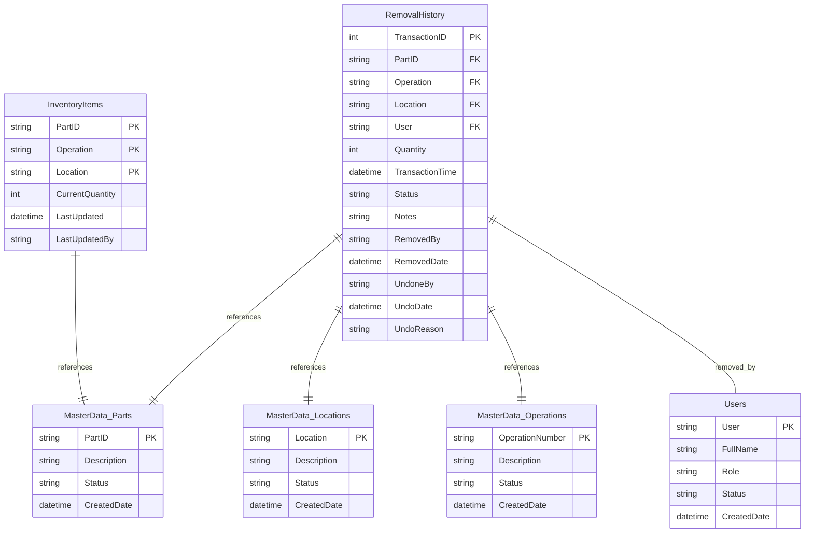
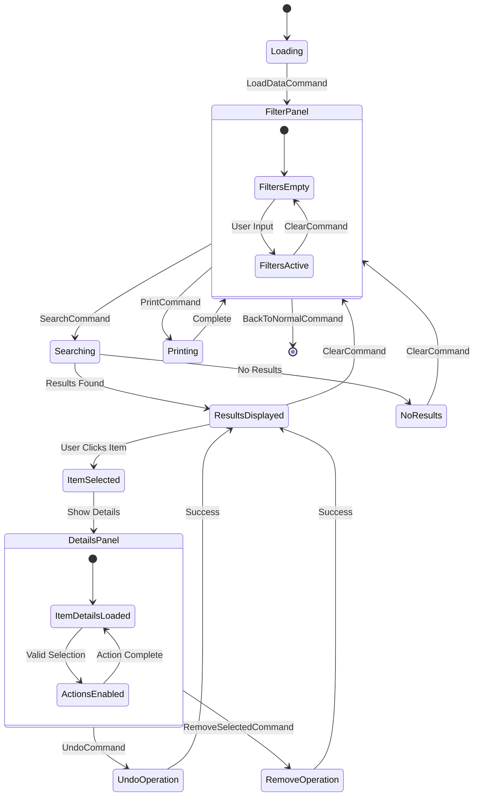

# Advanced Remove View - Complete Implementation Plan

**Generated by**: Industry-Veteran Software Engineer  
**Feature**: Advanced Remove View - Enhanced Removal Operations Interface  
**Epic**: Advanced Inventory Management  
**Documentation Date**: 2025-01-27  
**Architecture Pattern**: MVVM with Avalonia UI  

## Goal

Transform the existing WinForms Control_AdvancedRemove into a modern Avalonia-based AdvancedRemoveView that provides sophisticated removal operations beyond standard inventory removal functionality. This includes implementing bulk removal operations, removal history tracking, undo capabilities, specialized reporting for removal analytics, and a new enhanced right panel for detailed item management. The implementation follows MTM's established design patterns including MVVM Community Toolkit, stored procedure database operations, and the three-panel CollapsiblePanel layout system.

## Requirements

### Core Functionality Requirements
- **Three-Panel Layout**: Left filter panel, center results grid, right details/actions panel using CollapsiblePanel controls
- **Advanced Filtering System**: Multi-criteria filtering with Part ID, Location, Operation, User, Notes, Quantity Range, and Date Range
- **Bulk Removal Operations**: Batch processing with progress tracking and validation
- **Removal History Management**: Complete audit trail with DataGrid display and search capabilities  
- **Undo System**: Transaction-based undo with business rule validation and state restoration
- **Analytics & Reporting**: Removal reports, data export, and print functionality
- **Real-time Progress Feedback**: Visual progress indicators for bulk operations
- **Enhanced Right Panel**: New detailed item information and quick actions (not in original WinForms)

### UI/UX Requirements
- **MTM Design System Compliance**: Windows 11 Blue theme with dynamic resource bindings
- **Responsive Layout**: ScrollViewer container with minimum dimensions and overflow handling
- **Accessibility**: Full keyboard navigation, tooltips, and screen reader support
- **Performance**: Efficient DataGrid virtualization for large datasets
- **Theme Integration**: Complete ThemeService integration with all color resources

### Technical Requirements
- **MVVM Community Toolkit**: Source generator patterns with [ObservableProperty] and [RelayCommand]
- **Stored Procedures Only**: Database operations via Helper_Database_StoredProcedure.ExecuteDataTableWithStatus()
- **Dependency Injection**: Constructor injection with proper lifetime management
- **Error Handling**: Centralized error handling via Services.ErrorHandling.HandleErrorAsync()
- **Logging**: Structured logging with Microsoft.Extensions.Logging throughout

## Technical Considerations

### System Architecture Overview

```mermaid
graph TB
    subgraph "Frontend Layer - Avalonia UI"
        ARV[AdvancedRemoveView.axaml]
        CP1[CollapsiblePanel - Filters]
        DG[DataGrid - History]
        CP2[CollapsiblePanel - Details]
        AB[Action Buttons Panel]
    end
    
    subgraph "MVVM Layer"
        ARVM[AdvancedRemoveViewModel]
        BVM[BaseViewModel]
        INC[INotifyPropertyChanged]
        MVVMCT[MVVM Community Toolkit]
    end
    
    subgraph "Business Logic Layer"
        SC[Search Commands]
        RC[Removal Commands]
        UC[Undo Commands]
        PC[Print Commands]
        FC[Filter Commands]
    end
    
    subgraph "Service Layer"
        EH[ErrorHandling Service]
        TS[ThemeService]
        FMS[FocusManagementService]
        MDS[MasterDataService]
    end
    
    subgraph "Data Layer"
        HDBSP[Helper_Database_StoredProcedure]
        SP1[inv_remove_history_Get]
        SP2[inv_remove_bulk_Execute]
        SP3[inv_remove_undo_Execute]
        SP4[md_locations_Get_All]
        SP5[md_part_ids_Get_All]
    end
    
    subgraph "Infrastructure Layer"
        DI[Dependency Injection]
        LOG[ILogger System]
        DISP[Dispatcher.UIThread]
    end

    ARV --> ARVM
    CP1 --> FC
    DG --> SC
    CP2 --> RC
    AB --> UC
    AB --> PC
    
    ARVM --> BVM
    ARVM --> MVVMCT
    BVM --> INC
    
    SC --> HDBSP
    RC --> HDBSP
    UC --> HDBSP
    FC --> MDS
    
    HDBSP --> SP1
    HDBSP --> SP2
    HDBSP --> SP3
    HDBSP --> SP4
    HDBSP --> SP5
    
    ARVM --> EH
    ARVM --> TS
    ARVM --> FMS
    ARVM --> LOG
    
    ARVM --> DI
    ARVM --> DISP

    classDef avaloniaClass fill:#0078D4,stroke:#106EBE,color:#fff
    classDef mvvmClass fill:#2E7D32,stroke:#1B5E20,color:#fff  
    classDef serviceClass fill:#F57C00,stroke:#E65100,color:#fff
    classDef dataClass fill:#7B1FA2,stroke:#4A148C,color:#fff
    
    class ARV,CP1,DG,CP2,AB avaloniaClass
    class ARVM,BVM,INC,MVVMCT mvvmClass
    class EH,TS,FMS,MDS serviceClass
    class HDBSP,SP1,SP2,SP3,SP4,SP5 dataClass
```



### Database Schema Design



**Key Stored Procedures**:
- `inv_removal_history_Get_ByFilters` - Advanced filtering with multiple criteria
- `inv_removal_bulk_Execute` - Batch removal with transaction management
- `inv_removal_undo_Execute` - Undo operations with audit trail
- `inv_removal_analytics_Get` - Reporting and analytics data
- `md_parts_Get_All`, `md_locations_Get_All`, `md_operations_Get_All` - Master data

### API Design

**AdvancedRemoveViewModel Command Interface**:

```typescript
// Search and Filter Operations
interface ISearchCommands {
  SearchCommand: IAsyncRelayCommand;
  ClearCommand: IRelayCommand;
  LoadDataCommand: IAsyncRelayCommand;
}

// Removal Operations  
interface IRemovalCommands {
  RemoveSelectedCommand: IAsyncRelayCommand;
  UndoRemovalCommand: IAsyncRelayCommand;
  ViewHistoryCommand: IAsyncRelayCommand;
}

// Reporting Operations
interface IReportingCommands {
  PrintRemovalSummaryCommand: IAsyncRelayCommand;
  GenerateRemovalReportCommand: IAsyncRelayCommand;
  ExportRemovalDataCommand: IAsyncRelayCommand;
}

// Navigation Operations
interface INavigationCommands {
  BackToNormalCommand: IRelayCommand;
  ToggleFilterPanelCommand: IRelayCommand;
}
```

**Property Binding Model**:

```typescript
interface IAdvancedRemoveProperties {
  // Filter Properties
  FilterPartIDText: string;
  FilterLocationText: string;
  FilterUserText: string;
  FilterOperation: string;
  QuantityMin: int?;
  QuantityMax: int?;
  RemovalDateRangeStart: DateTimeOffset;
  RemovalDateRangeEnd: DateTimeOffset;
  
  // State Properties
  IsFilterPanelExpanded: bool;
  IsBusy: bool;
  StatusMessage: string;
  SelectedHistoryItem: SessionTransaction;
  
  // Collections
  RemovalHistory: ObservableCollection<SessionTransaction>;
  LocationOptions: ObservableCollection<string>;
  PartIDOptions: ObservableCollection<string>;
  UserOptions: ObservableCollection<string>;
  OperationOptions: ObservableCollection<string>;
}
```

### Frontend Architecture

#### Component Hierarchy Documentation

The AdvancedRemoveView follows the established MTM three-panel layout pattern using CollapsiblePanel controls:

**Layout Structure:**

```
AdvancedRemoveView (UserControl)
├── ScrollViewer (Overflow Management)
│   └── Grid (MainContainer: RowDefinitions="*,Auto")
│       ├── Border (Grid.Row="0" - Main Content Area)
│       │   └── Grid (Three Column Layout: Auto,*,Auto)
│       │       ├── CollapsiblePanel (Grid.Column="0" - Left Filter Panel)
│       │       │   ├── StackPanel (Filter Controls Container)
│       │       │   ├── TextBox (Part ID Filter with Fuzzy Validation)
│       │       │   ├── AutoCompleteBox (Location Filter)
│       │       │   ├── AutoCompleteBox (Operation Filter)
│       │       │   ├── AutoCompleteBox (User Filter)
│       │       │   ├── TextBox (Notes Filter)
│       │       │   ├── NumericUpDown (Quantity Min/Max Range)
│       │       │   └── DatePicker (Date Range Selection)
│       │       ├── Border (Grid.Column="1" - Center Results Grid)
│       │       │   └── Grid (RowDefinitions="Auto,*")
│       │       │       ├── Border (Grid.Row="0" - Results Header)
│       │       │       └── DataGrid (Grid.Row="1" - Removal History)
│       │       │           ├── DataGridColumn (Part ID)
│       │       │           ├── DataGridColumn (Operation)
│       │       │           ├── DataGridColumn (Location)
│       │       │           ├── DataGridColumn (User)
│       │       │           ├── DataGridColumn (Quantity)
│       │       │           ├── DataGridColumn (Date/Time)
│       │       │           └── DataGridColumn (Status)
│       │       └── CollapsiblePanel (Grid.Column="2" - Right Details Panel)
│       │           └── StackPanel (Details Container)
│       │               ├── Border (Selected Item Details Card)
│       │               │   ├── TextBlock (Part ID Display)
│       │               │   ├── TextBlock (Operation Display)
│       │               │   ├── TextBlock (Location Display)
│       │               │   ├── TextBlock (Quantity Display)
│       │               │   ├── TextBlock (User Display)
│       │               │   ├── TextBlock (Date/Time Display)
│       │               │   └── TextBlock (Status Display)
│       │               ├── Border (Quick Actions Card)
│       │               │   ├── Button (View Details)
│       │               │   ├── Button (Undo This Removal)
│       │               │   ├── Button (Export Item Data)
│       │               │   └── Button (Print Item Details)
│       │               └── Border (Summary Statistics Card)
│       │                   ├── TextBlock (Total Items Removed)
│       │                   ├── TextBlock (Total Quantity Removed)
│       │                   ├── TextBlock (Date Range Summary)
│       │                   └── TextBlock (Most Active User)
│       └── Border (Grid.Row="1" - Action Buttons Panel)
│           └── Grid (ColumnDefinitions="*,Auto")
│               ├── StackPanel (Grid.Column="0" - Primary Actions)
│               │   ├── Button (Search - Primary)
│               │   ├── Button (Undo Selected - Secondary)
│               │   ├── Button (Remove Selected - Danger)
│               │   ├── Button (Clear Filters - Secondary)
│               │   └── Button (Print Summary - Secondary)
│               └── Button (Grid.Column="1" - Back to Normal)
```

#### State Flow Diagram



#### Component Integration Patterns

**MVVM Community Toolkit Integration**:
```csharp
[ObservableObject]
public partial class AdvancedRemoveViewModel : BaseViewModel
{
    [ObservableProperty] private string _filterPartIDText = string.Empty;
    [ObservableProperty] private bool _isFilterPanelExpanded = true;
    [ObservableProperty] private SessionTransaction? _selectedHistoryItem;
    
    [RelayCommand] private async Task SearchAsync() { /* Implementation */ }
    [RelayCommand(CanExecute = nameof(CanUndo))] private async Task UndoRemovalAsync() { /* Implementation */ }
}
```

**CollapsiblePanel State Management**:
```csharp
// Left panel - Filter controls
IsFilterPanelExpanded = true; // Default expanded for immediate use

// Right panel - Details and actions  
IsDetailsPanelExpanded = true; // Default expanded for enhanced functionality
```

**DataGrid Configuration**:
```xml
<DataGrid ItemsSource="{Binding RemovalHistory}" 
          SelectedItem="{Binding SelectedHistoryItem, Mode=TwoWay}"
          AutoGenerateColumns="False"
          GridLinesVisibility="Horizontal"
          HeadersVisibility="Column"
          IsReadOnly="True"
          SelectionMode="Extended">
```

### Security & Performance

#### Authentication & Authorization
- **User Context**: All operations track current user via Model_AppVariables.User
- **Operation Validation**: Business rules validate user permissions for undo operations
- **Audit Trail**: Complete logging of all removal and undo activities with user attribution
- **Data Security**: Stored procedure parameters prevent SQL injection attacks

#### Data Validation & Sanitization  
- **Input Validation**: Client-side validation with server-side verification
- **Fuzzy Validation**: TextBoxFuzzyValidationBehavior for Part ID input with suggestion overlay integration
- **Range Validation**: Quantity and date range validation with user feedback
- **Business Rule Validation**: Comprehensive validation before bulk operations

#### Performance Optimization Strategies
- **DataGrid Virtualization**: Efficient rendering of large removal history datasets
- **Async Operations**: All database operations use async/await patterns
- **UI Thread Management**: Dispatcher.UIThread.Post() for collection updates
- **Memory Management**: Proper disposal of resources and event subscriptions
- **Batch Loading**: Efficient loading of master data with caching

#### Caching Mechanisms
- **Master Data Caching**: Location, Part ID, Operation, and User options cached in collections
- **View State Caching**: CollapsiblePanel states preserved across sessions
- **Search Results Caching**: Recent search results cached for improved performance
- **Static Resource Caching**: Theme resources loaded once and reused

## Implementation Phases

### Phase 1: Core Infrastructure (Week 1)
**Deliverables:**
- AdvancedRemoveView.axaml complete implementation
- AdvancedRemoveViewModel enhancements for right panel
- CollapsiblePanel integration for three-panel layout
- Basic DataGrid configuration with columns
- MTM theme integration with DynamicResource bindings

**Technical Tasks:**
- Implement three-column Grid layout with proper CollapsiblePanel usage
- Configure DataGrid with removal history columns and styling
- Implement right panel with selected item details and quick actions
- Add all required observable properties and relay commands
- Integrate MTM design system colors and styling

### Phase 2: Advanced Filtering System (Week 2)
**Deliverables:**
- Complete filter panel with all criteria controls
- Advanced search functionality with multi-criteria filtering
- Master data loading for dropdown populations
- Filter state persistence and management
- Clear filters functionality

**Technical Tasks:**
- Implement AutoCompleteBox controls for Location, Operation, User filters
- Add TextBoxFuzzyValidationBehavior for Part ID filtering
- Implement quantity range filtering with NumericUpDown controls
- Add date range filtering with DatePicker controls
- Create LoadOptionsAsync method for master data population

### Phase 3: Removal Operations & History (Week 3)
**Deliverables:**
- Bulk removal operations with progress tracking
- Removal history loading and display
- Undo system with transaction management
- Search results display and selection handling
- Real-time status updates and progress feedback

**Technical Tasks:**
- Implement SearchCommand with database stored procedure integration
- Create RemoveSelectedCommand with bulk processing capabilities
- Implement UndoRemovalCommand with business rule validation
- Add progress tracking with IsBusy state management
- Integrate error handling with centralized ErrorHandling service

### Phase 4: Analytics & Reporting (Week 4)
**Deliverables:**
- Print removal summary functionality
- Data export capabilities
- Removal analytics and reporting
- Enhanced right panel with detailed statistics
- Performance optimization and testing

**Technical Tasks:**
- Implement PrintRemovalSummaryCommand with file generation
- Create GenerateRemovalReportCommand for comprehensive analytics
- Add ExportRemovalDataCommand for data export functionality
- Enhance right panel with summary statistics display
- Performance testing and optimization for large datasets

### Phase 5: Integration & Polish (Week 5)
**Deliverables:**
- Complete integration with MainViewViewModel
- Enhanced right panel functionality (new feature)
- Accessibility improvements and keyboard navigation
- Final testing and bug fixes
- Documentation and code review

**Technical Tasks:**
- Final integration testing with MainView tab switching
- Right panel quick actions implementation
- Accessibility testing and improvements
- Performance profiling and optimization
- Code review and documentation updates

## Validation Criteria

### Functional Validation
- [ ] Three-panel layout functions correctly with CollapsiblePanel controls
- [ ] All filter criteria work independently and in combination
- [ ] Bulk removal operations complete successfully with progress tracking
- [ ] Undo functionality restores items correctly with audit trail
- [ ] DataGrid displays removal history with proper sorting and selection
- [ ] Right panel shows detailed item information and quick actions
- [ ] Print and export functionality generates correct output files
- [ ] Navigation between normal and advanced modes works seamlessly

### Technical Validation  
- [ ] MVVM Community Toolkit patterns implemented correctly
- [ ] All database operations use stored procedures exclusively
- [ ] Error handling integrates with centralized ErrorHandling service
- [ ] Logging provides comprehensive debugging information
- [ ] Memory usage remains efficient with large datasets
- [ ] UI responsiveness maintained during bulk operations
- [ ] Theme integration follows MTM design system standards

### User Experience Validation
- [ ] Interface follows established MTM design patterns
- [ ] Keyboard navigation works throughout all controls
- [ ] Tooltips provide helpful context for all interactive elements
- [ ] Progress feedback keeps users informed during operations
- [ ] CollapsiblePanel states enhance workflow efficiency
- [ ] Right panel provides valuable additional functionality
- [ ] Accessibility standards met for screen readers and keyboard users

### Performance Validation
- [ ] DataGrid handles 10,000+ removal history records efficiently
- [ ] Filter operations complete within 2 seconds
- [ ] Bulk removal operations provide real-time progress updates
- [ ] Memory usage stays within acceptable limits during operations
- [ ] UI thread remains responsive during background operations
- [ ] Database queries execute within performance thresholds

## Risk Mitigation

### Technical Risks
- **Database Performance**: Large removal history datasets may impact DataGrid performance
  - *Mitigation*: Implement pagination and lazy loading strategies
- **Memory Usage**: Bulk operations may consume excessive memory
  - *Mitigation*: Process items in batches with proper disposal
- **UI Responsiveness**: Long-running operations may freeze UI
  - *Mitigation*: Use async/await patterns with progress tracking

### Integration Risks  
- **MainView Integration**: Complex tab switching between normal and advanced modes
  - *Mitigation*: Thorough testing of cached view instances and state management
- **Theme Integration**: Dynamic resource bindings may not update correctly
  - *Mitigation*: Comprehensive testing across all theme variations
- **Service Dependencies**: Complex dependency injection chain may cause issues
  - *Mitigation*: Proper lifetime management and null checking

### User Experience Risks
- **Learning Curve**: Advanced interface may be overwhelming for basic users
  - *Mitigation*: Maintain clear navigation to normal mode and provide contextual help
- **Data Loss**: Accidental bulk removal operations
  - *Mitigation*: Confirmation dialogs and comprehensive undo system
- **Performance Perception**: Slow operations may appear as application freezing
  - *Mitigation*: Clear progress indicators and status messages

---

This implementation plan provides a comprehensive roadmap for transitioning the WinForms Control_AdvancedRemove to a modern Avalonia-based AdvancedRemoveView while enhancing functionality with the new right panel and maintaining consistency with established MTM patterns.
