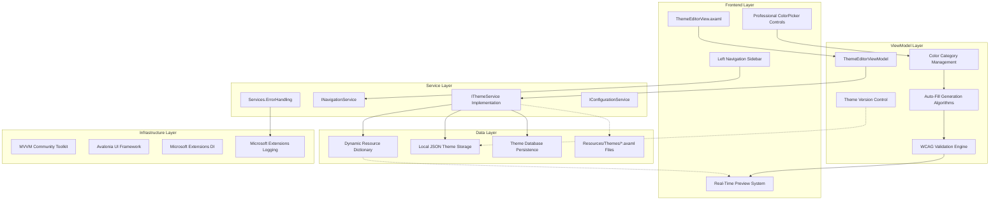
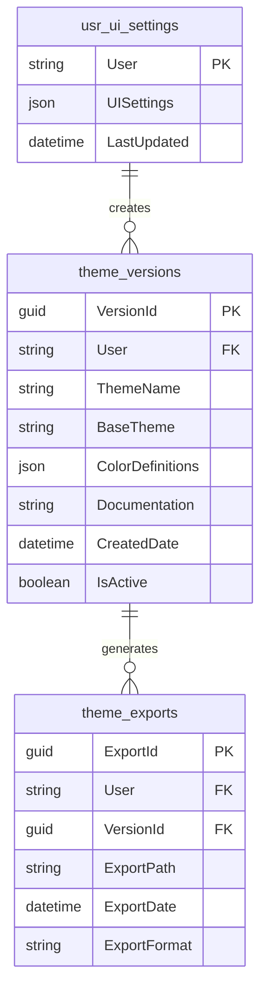
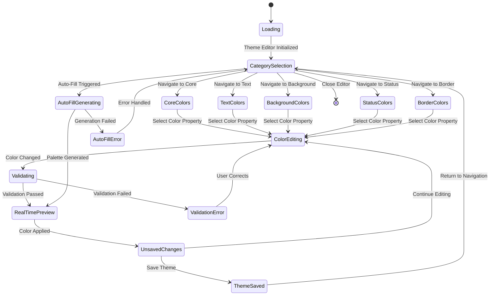

# Advanced Theme Editor System Implementation Plan

## Goal

The Advanced Theme Editor System is a comprehensive feature that transforms theme customization in the MTM WIP Application from basic theme switching to professional-grade color management. This system enables manufacturing operators and system administrators to create, customize, validate, and share themes with professional color pickers, real-time preview, WCAG compliance validation, and extensive auto-fill algorithms. The implementation builds upon the existing 19+ theme system while providing full backwards compatibility and seamless integration with the current MVVM Community Toolkit architecture.

The system addresses the critical need for customizable themes in manufacturing environments where lighting conditions, shift changes, and departmental requirements necessitate different visual presentations while maintaining accessibility standards and professional appearance.

## Requirements

### Functional Requirements

#### Core Theme Editor Features
- **Professional Color Picker Controls**: Replace existing TextBox inputs with visual color selectors supporting RGB, HSL, and Hex formats
- **Navigable Sidebar Categories**: Implement left panel navigation with Core Colors, Text Colors, Background Colors, Status Colors, and Border Colors
- **Auto-Fill Color Generation**: Provide one-click palette generation using Monochromatic, Complementary, Analogous, Triadic, Material Design, and Accessibility-First algorithms  
- **Real-Time Theme Preview**: Apply color changes immediately across the application without restart requirements
- **Theme Save/Load System**: Persist custom themes to application settings with local JSON storage backup
- **Theme Export/Import**: Enable theme sharing between installations via standardized JSON format
- **WCAG Compliance Validation**: Implement automatic contrast ratio checking with 4.5:1 minimum (AA) and 7:1 optional (AAA) standards
- **Undo/Redo Functionality**: Provide multi-level change history with rollback capabilities

#### Advanced Functionality
- **Color History**: Track and display recently used colors for quick access
- **Theme Versioning**: Maintain version snapshots with rollback capabilities  
- **Conditional Theming**: Support different themes for Day Shift, Night Shift, Maintenance, Emergency contexts
- **Industry Templates**: Pre-configured themes for Manufacturing, Healthcare, Office environments
- **Base Theme Integration**: Build upon existing MTM Blue, Green, Red, Dark theme system
- **System Theme Synchronization**: Respect Windows dark/light mode preferences when enabled

### Technical Requirements

#### Architecture Compliance
- **MVVM Community Toolkit**: Exclusive use of `[ObservableProperty]` and `[RelayCommand]` patterns
- **Avalonia AXAML Syntax**: Strict adherence to `x:Name` (not `Name`), Avalonia-specific control syntax
- **MTM Grid Pattern**: Implementation of mandatory `ScrollViewer > Grid[*,Auto] > Border` layout structure
- **Service-Oriented Design**: Integration with existing NavigationService, ThemeService, ErrorHandling services
- **Dependency Injection**: Full constructor injection with `ArgumentNullException.ThrowIfNull()` validation

#### Performance Requirements
- **Theme Editor Load Time**: < 500ms from navigation trigger
- **Color Change Response Time**: < 100ms for real-time preview updates  
- **Memory Usage Limit**: < 50MB increase during active editing
- **UI Responsiveness**: Maintain responsive interface with all color pickers simultaneously active

#### Integration Requirements
- **Existing 19+ Theme System**: Full compatibility with current MTM themes in Resources/Themes/
- **Database Integration**: Leverage existing stored procedure pattern for theme persistence
- **Resource Dictionary System**: Real-time updates to DynamicResource bindings throughout application
- **Error Handling**: Centralized error management via Services.ErrorHandling.HandleErrorAsync()

## Technical Considerations

### System Architecture Overview



#### Technology Stack Selection

**Frontend Framework**: Avalonia UI 11.3.4
- Rationale: Cross-platform UI framework with modern XAML syntax and strong data binding capabilities
- Integration: Existing MTM application built on Avalonia with established patterns

**State Management**: MVVM Community Toolkit 8.3.2  
- Rationale: Source generator-based property and command management reduces boilerplate code
- Integration: Consistent with existing ViewModels throughout MTM application

**Color Processing**: System.Drawing.Color with Avalonia.Media.Color
- Rationale: Native color manipulation with Avalonia-specific rendering support
- Integration: Direct integration with existing ThemeService color resource management

**Persistence**: Dual approach with Application Settings + JSON Files
- Rationale: Primary persistence through existing settings system with JSON backup for portability
- Integration: Leverages existing IConfigurationService and database stored procedures

#### Integration Points

**ThemeService Integration**: 
- Extend existing `ApplyCustomColorsAsync(Dictionary<string, string> colorOverrides)` method
- Utilize established `ClearThemeResources()` and `LoadThemeResourcesAsync()` infrastructure
- Maintain compatibility with current theme switching mechanism

**NavigationService Integration**:
- Implement theme editor as navigable view through existing `NavigateTo(string viewKey)` method
- Utilize established navigation history and back/forward functionality

**Resource Dictionary Updates**:
- Real-time updates to existing MTM_Shared_Logic.* resource keys
- Maintain DynamicResource binding system throughout application
- Ensure theme changes propagate to all active UI elements

**Error Handling Integration**:
- Standardized error management through `Services.ErrorHandling.HandleErrorAsync()`
- Logging through existing Microsoft Extensions Logging infrastructure
- Graceful degradation on color parsing or validation failures

### Database Schema Design



#### Table Specifications

**usr_ui_settings (Existing Table Enhancement)**:
- `UISettings` JSON field enhanced to include theme color overrides
- Backward compatibility maintained with existing theme name storage
- Indexed on User field for performance optimization

**theme_versions (New Table)**:
- Stores complete theme snapshots with version control
- `ColorDefinitions` JSON field contains all 17+ color properties
- `BaseTheme` references existing MTM theme system (MTM_Blue, MTM_Green, etc.)
- Enables rollback and version comparison functionality

**theme_exports (New Table)**:
- Tracks theme export/import operations for audit purposes  
- Links exported files to specific theme versions
- Supports theme sharing analytics and usage tracking

#### Database Migration Strategy

**Phase 1**: Extend existing `usr_ui_settings` JSON structure to include color overrides
**Phase 2**: Create `theme_versions` table with stored procedures for CRUD operations
**Phase 3**: Implement `theme_exports` table for sharing functionality tracking

**Stored Procedures Required**:
- `usr_theme_versions_Add` - Create new theme version
- `usr_theme_versions_Get_ByUser` - Retrieve user's theme versions
- `usr_theme_versions_Rollback` - Restore previous theme version
- `usr_theme_exports_Log` - Track export operations

### API Design

#### Core Theme Management Endpoints

**Real-Time Color Updates**:
```csharp
[RelayCommand]
private async Task ApplyColorChangeAsync(string colorKey, Color newColor)
{
    // Immediate validation
    if (!ValidateColorContrast(colorKey, newColor))
    {
        StatusMessage = "Color fails WCAG contrast requirements";
        return;
    }
    
    // Update property
    SetColorProperty(colorKey, newColor);
    
    // Trigger real-time preview with debouncing
    _previewTimer?.Stop();
    _previewTimer?.Start();
    
    HasUnsavedChanges = true;
}
```

**Auto-Fill Generation**:
```csharp
[RelayCommand]
private async Task AutoFillMonochromaticAsync()
{
    IsLoading = true;
    try
    {
        var baseColor = PrimaryActionColor;
        var palette = ColorAlgorithms.GenerateMonochromatic(baseColor, 17);
        
        ApplyGeneratedPalette(palette);
        SaveColorSnapshot($"Monochromatic from {baseColor}");
        
        StatusMessage = "Monochromatic palette applied successfully";
    }
    catch (Exception ex)
    {
        await Services.ErrorHandling.HandleErrorAsync(ex, "Auto-fill generation failed");
    }
    finally
    {
        IsLoading = false;
    }
}
```

**Theme Export/Import**:
```csharp
public class ThemeExportFormat
{
    public string Name { get; set; } = string.Empty;
    public string Version { get; set; } = "1.0";
    public string BaseTheme { get; set; } = "MTM_Blue";
    public Dictionary<string, string> Colors { get; set; } = new();
    public DateTime CreatedDate { get; set; }
    public string CreatedBy { get; set; } = string.Empty;
    public Dictionary<string, object> Metadata { get; set; } = new();
}
```

#### Error Handling and Status Codes

**Color Validation Errors**:
- `WCAG_CONTRAST_FAIL`: Color combination fails accessibility requirements
- `COLOR_PARSE_ERROR`: Invalid color format provided
- `RESOURCE_UPDATE_FAIL`: Failed to update application resources

**Theme Operation Errors**:
- `THEME_SAVE_FAIL`: Unable to persist theme to storage
- `THEME_LOAD_FAIL`: Cannot load theme from storage
- `EXPORT_PATH_INVALID`: Export/import path not accessible

**Performance Monitoring**:
- Real-time preview operations tracked for performance optimization
- Color generation algorithm timing for user experience optimization
- Memory usage monitoring during extended editing sessions

### Frontend Architecture

#### Component Hierarchy Documentation

The Theme Editor leverages the established MTM design system with Avalonia UI 11.3.4 controls:

**Layout Structure**:

```
ThemeEditorView (UserControl)
├── ScrollViewer (Root Container)
│   └── Grid (MainContainer) [RowDefinitions="*,Auto"]
│       ├── Grid (ContentGrid) [Grid.Row="0", ColumnDefinitions="300,*"]
│       │   ├── Border (NavigationSidebar) [Grid.Column="0"]
│       │   │   ├── StackPanel (CategoryNavigation)
│       │   │   │   ├── Button (CoreColorsNav) [Classes="navigation selected"]
│       │   │   │   ├── Button (TextColorsNav) [Classes="navigation"]
│       │   │   │   ├── Button (BackgroundColorsNav) [Classes="navigation"]  
│       │   │   │   ├── Button (StatusColorsNav) [Classes="navigation"]
│       │   │   │   └── Button (BorderColorsNav) [Classes="navigation"]
│       │   │   └── StackPanel (AutoFillSection)
│       │   │       ├── TextBlock ("Auto-Fill Algorithms")
│       │   │       ├── Button (MonochromaticFill) [Classes="secondary"]
│       │   │       ├── Button (ComplementaryFill) [Classes="secondary"]
│       │   │       └── Button (MaterialDesignFill) [Classes="secondary"]
│       │   └── Border (ColorEditingArea) [Grid.Column="1"]
│       │       └── ScrollViewer (ColorOptionsScroll)
│       │           └── StackPanel (ColorSections)
│       │               ├── StackPanel (CoreColorsSection) [IsVisible="{Binding IsCoreColorsSelected}"]
│       │               │   ├── TextBlock ("Primary Action Color")
│       │               │   ├── ColorPicker (PrimaryActionColorPicker) [Color="{Binding PrimaryActionColor}"]
│       │               │   ├── TextBlock ("Secondary Action Color")  
│       │               │   ├── ColorPicker (SecondaryActionColorPicker) [Color="{Binding SecondaryActionColor}"]
│       │               │   └── [...additional core color controls]
│       │               ├── StackPanel (TextColorsSection) [IsVisible="{Binding IsTextColorsSelected}"]
│       │               ├── StackPanel (BackgroundColorsSection) [IsVisible="{Binding IsBackgroundColorsSelected}"]
│       │               ├── StackPanel (StatusColorsSection) [IsVisible="{Binding IsStatusColorsSelected}"]
│       │               └── StackPanel (BorderColorsSection) [IsVisible="{Binding IsBorderColorsSelected}"]
│       └── Border (ActionButtonsPanel) [Grid.Row="1"]
│           └── StackPanel (ActionButtons) [Orientation="Horizontal"]
│               ├── Button (PreviewTheme) [Classes="primary"]
│               ├── Button (ApplyTheme) [Classes="primary"]
│               ├── Button (ResetTheme) [Classes="secondary"]
│               ├── Button (ExportTheme) [Classes="secondary"]
│               ├── Button (ImportTheme) [Classes="secondary"]
│               └── Button (CloseEditor) [Classes="tertiary"]
```

**Critical AXAML Implementation Requirements**:

1. **MTM Mandatory Grid Pattern Compliance**:
   ```xml
   <ScrollViewer HorizontalScrollBarVisibility="Auto" VerticalScrollBarVisibility="Auto">
     <Grid x:Name="MainContainer" RowDefinitions="*,Auto" MinWidth="800" MinHeight="600">
   ```

2. **Professional ColorPicker Integration**:
   ```xml
   <ColorPicker x:Name="PrimaryColorPicker"
                Color="{Binding PrimaryActionColor}"
                HorizontalAlignment="Stretch"
                VerticalAlignment="Top"
                Margin="0,4,0,12"
                Background="{DynamicResource MTM_Shared_Logic.CardBackgroundBrush}"
                BorderBrush="{DynamicResource MTM_Shared_Logic.BorderAccentBrush}"
                BorderThickness="1"
                CornerRadius="4" />
   ```

3. **Navigation Sidebar Styling**:
   ```xml
   <Button Classes="navigation selected"
           Command="{Binding NavigateToSectionCommand}"
           CommandParameter="Core"
           Content="Core Colors"
           HorizontalContentAlignment="Left">
     <Button.ContentTemplate>
       <DataTemplate>
         <StackPanel Orientation="Horizontal" Spacing="8">
           <materialIcons:MaterialIcon Kind="Palette" Width="20" Height="20"/>
           <TextBlock Text="{Binding}" VerticalAlignment="Center"/>
         </StackPanel>
       </DataTemplate>
     </Button.ContentTemplate>
   </Button>
   ```

#### State Flow Management



**Property Change Notification Flow**:
```csharp
[ObservableProperty]
private Color primaryActionColor = Color.Parse("#0078D4");

partial void OnPrimaryActionColorChanged(Color value)
{
    // Immediate WCAG validation
    if (!ValidateColorContrast("PrimaryAction", value))
    {
        ValidationErrors.Add("PrimaryAction", "Insufficient contrast ratio");
        return;
    }
    
    // Clear any existing validation errors
    ValidationErrors.Remove("PrimaryAction");
    
    // Trigger debounced real-time preview
    _previewTimer?.Stop();
    _previewTimer = new Timer(async _ => 
    {
        await ApplyRealTimePreviewAsync();
    }, null, PreviewDebounceMs, Timeout.Infinite);
    
    // Mark as having unsaved changes
    HasUnsavedChanges = true;
    
    // Update status message
    StatusMessage = $"Primary action color updated to {value}";
}
```

#### Reusable Component Library Specifications

**Professional Color Picker Wrapper**:
```csharp
public class MTMColorPicker : ColorPicker
{
    public static readonly StyledProperty<bool> ShowValidationProperty =
        AvaloniaProperty.Register<MTMColorPicker, bool>(nameof(ShowValidation), true);
        
    public bool ShowValidation
    {
        get => GetValue(ShowValidationProperty);
        set => SetValue(ShowValidationProperty, value);
    }
    
    protected override void OnPropertyChanged(AvaloniaPropertyChangedEventArgs change)
    {
        base.OnPropertyChanged(change);
        
        if (change.Property == ColorProperty && ShowValidation)
        {
            ValidateAccessibility((Color)change.NewValue!);
        }
    }
}
```

**Category Navigation Component**:
```csharp
public class CategoryNavigationButton : Button
{
    public static readonly StyledProperty<bool> IsSelectedProperty =
        AvaloniaProperty.Register<CategoryNavigationButton, bool>(nameof(IsSelected));
        
    public static readonly StyledProperty<string> CategoryKeyProperty =
        AvaloniaProperty.Register<CategoryNavigationButton, string>(nameof(CategoryKey), "");
}
```

### Security & Performance

#### Authentication/Authorization Requirements

**Theme Editor Access Control**:
- No additional authentication required beyond existing application login
- Theme modification capabilities available to all authenticated users
- Administrative themes (if implemented) restricted to elevated permissions

**Data Validation and Sanitization**:
- Color value validation against acceptable formats (RGB, HSL, Hex)
- File path sanitization for theme export/import operations
- JSON schema validation for theme import files to prevent malicious content

#### Performance Optimization Strategies

**Real-Time Preview Optimization**:
- Debounced updates with 500ms delay to prevent excessive resource dictionary operations
- Selective resource updates targeting only changed color properties
- Background thread color generation with UI thread marshaling for updates

**Memory Management**:
- Disposal of Timer instances in ViewModel cleanup
- Weak event subscriptions to prevent memory leaks
- Color history limited to 20 recent colors per session

**UI Responsiveness**:
- Asynchronous auto-fill generation with progress indication
- Lazy loading of color picker controls for inactive categories
- Virtualized lists for extensive color history displays

#### Caching Mechanisms

**Color Generation Caching**:
- In-memory cache for generated color palettes to avoid recalculation
- LRU eviction policy with 50 palette maximum cache size
- Cache keys based on base color and algorithm type

**Theme Resource Caching**:
- ResourceDictionary snapshot caching for rapid theme switching
- Compressed JSON storage for theme export files
- Background preloading of frequently accessed theme files

## Implementation Plan

### Database Schema Design

The Theme Editor extends the existing database infrastructure with minimal schema changes while providing comprehensive theme management capabilities.

#### Current Database Integration

**Existing Tables Used**:
- `usr_ui_settings`: Enhanced to store color overrides in JSON format
- Existing stored procedures: `usr_ui_settings_SetThemeJson`, `usr_ui_settings_Get`

**New Tables Required**:

**theme_versions Table**:
```sql
CREATE TABLE theme_versions (
    VersionId CHAR(36) PRIMARY KEY,
    User VARCHAR(50) NOT NULL,
    ThemeName VARCHAR(100) NOT NULL,
    BaseTheme VARCHAR(50) NOT NULL,
    ColorDefinitions JSON NOT NULL,
    Documentation TEXT,
    CreatedDate DATETIME DEFAULT CURRENT_TIMESTAMP,
    IsActive BOOLEAN DEFAULT TRUE,
    INDEX idx_user_theme (User, IsActive),
    INDEX idx_created_date (CreatedDate DESC),
    FOREIGN KEY (User) REFERENCES usr_ui_settings(User)
);
```

**New Stored Procedures**:
```sql
-- Create theme version snapshot
CREATE PROCEDURE usr_theme_versions_Add(
    IN p_User VARCHAR(50),
    IN p_ThemeName VARCHAR(100), 
    IN p_BaseTheme VARCHAR(50),
    IN p_ColorDefinitions JSON,
    IN p_Documentation TEXT
)

-- Retrieve user's theme versions  
CREATE PROCEDURE usr_theme_versions_Get_ByUser(
    IN p_User VARCHAR(50),
    IN p_Limit INT DEFAULT 10
)

-- Rollback to previous theme version
CREATE PROCEDURE usr_theme_versions_Rollback(
    IN p_User VARCHAR(50),
    IN p_VersionId CHAR(36)
)
```

### Frontend Architecture Implementation

#### Phase 1: Core Infrastructure (Week 1)

**ThemeEditorViewModel Reconstruction**:
The existing ThemeEditorViewModel contains 81+ compilation errors requiring complete reconstruction following MVVM Community Toolkit patterns:

```csharp
[ObservableObject]
public partial class ThemeEditorViewModel : BaseViewModel
{
    private readonly IThemeService _themeService;
    private readonly INavigationService _navigationService;
    private Timer? _previewTimer;
    
    #region Core Properties
    [ObservableProperty]
    private string currentThemeName = "Custom Theme";
    
    [ObservableProperty]
    private bool hasUnsavedChanges = false;
    
    [ObservableProperty]
    private bool isLoading = false;
    
    [ObservableProperty]
    private string statusMessage = "Ready to edit theme colors";
    #endregion
    
    #region Navigation Properties
    [ObservableProperty]
    private string selectedCategory = "Core";
    
    [ObservableProperty]
    private bool isCoreColorsSelected = true;
    
    [ObservableProperty]
    private bool isTextColorsSelected = false;
    
    // Additional category selection properties...
    #endregion
    
    #region Color Properties (17 total)
    [ObservableProperty]
    private Color primaryActionColor = Color.Parse("#0078D4");
    
    [ObservableProperty]
    private Color secondaryActionColor = Color.Parse("#106EBE");
    
    // All other color properties following same pattern...
    #endregion
}
```

**Professional ColorPicker Integration**:
Replace TextBox controls with Avalonia ColorPicker controls, integrated with Avalonia Community Toolkit if available:

```xml
<StackPanel Spacing="12" Margin="16">
    <TextBlock Text="Primary Action Color" 
               FontWeight="SemiBold" 
               Foreground="{DynamicResource MTM_Shared_Logic.HeadingText}"/>
    
    <ColorPicker Color="{Binding PrimaryActionColor}"
                 HorizontalAlignment="Stretch"
                 Background="{DynamicResource MTM_Shared_Logic.CardBackgroundBrush}"
                 BorderBrush="{DynamicResource MTM_Shared_Logic.BorderAccentBrush}"
                 BorderThickness="1"
                 CornerRadius="4"
                 Margin="0,4,0,0"/>
                 
    <TextBlock Text="{Binding PrimaryActionColor, StringFormat='Current: {0}'}"
               FontSize="12"
               Foreground="{DynamicResource MTM_Shared_Logic.BodyText}"
               Margin="0,4,0,0"/>
</StackPanel>
```

#### Phase 2: Navigation and Layout (Week 1-2)

**Left Sidebar Navigation Implementation**:
Implement category-based navigation following MTM design patterns:

```xml
<Border Grid.Column="0" 
        Background="{DynamicResource MTM_Shared_Logic.SidebarBackground}"
        BorderBrush="{DynamicResource MTM_Shared_Logic.BorderBrush}"
        BorderThickness="0,0,1,0"
        MinWidth="280">
    
    <StackPanel Margin="16">
        <TextBlock Text="Color Categories" 
                   FontWeight="Bold"
                   FontSize="16"
                   Foreground="{DynamicResource MTM_Shared_Logic.HeadingText}"
                   Margin="0,0,0,16"/>
        
        <Button Classes="navigation selected"
                Command="{Binding NavigateToSectionCommand}"
                CommandParameter="Core"
                IsVisible="{Binding IsCoreColorsSelected}">
            <StackPanel Orientation="Horizontal" Spacing="12">
                <materialIcons:MaterialIcon Kind="Palette" Width="20" Height="20"/>
                <TextBlock Text="Core Colors" VerticalAlignment="Center"/>
            </StackPanel>
        </Button>
        
        <!-- Additional navigation buttons... -->
        
        <Separator Margin="0,24,0,16" 
                   Background="{DynamicResource MTM_Shared_Logic.BorderBrush}"/>
        
        <TextBlock Text="Auto-Fill Algorithms" 
                   FontWeight="SemiBold"
                   FontSize="14"
                   Foreground="{DynamicResource MTM_Shared_Logic.HeadingText}"
                   Margin="0,0,0,12"/>
        
        <Button Classes="secondary"
                Command="{Binding AutoFillMonochromaticCommand}"
                Content="Monochromatic"
                Margin="0,0,0,8"/>
    </StackPanel>
</Border>
```

#### Phase 3: Auto-Fill Algorithms (Week 2)

**Color Generation Implementation**:
Implement mathematical color generation algorithms for professional palette creation:

```csharp
public static class ColorAlgorithms
{
    public static Dictionary<string, Color> GenerateMonochromatic(Color baseColor, int colorCount = 17)
    {
        var colors = new Dictionary<string, Color>();
        var hsl = ColorToHsl(baseColor);
        
        // Generate variations by adjusting lightness and saturation
        colors["PrimaryAction"] = baseColor;
        colors["SecondaryAction"] = HslToColor(hsl.H, hsl.S, Math.Max(0.1, hsl.L - 0.2));
        colors["AccentColor"] = HslToColor(hsl.H, Math.Min(1.0, hsl.S + 0.1), Math.Min(0.9, hsl.L + 0.1));
        
        // Continue for all 17 color properties...
        return colors;
    }
    
    public static Dictionary<string, Color> GenerateComplementary(Color baseColor)
    {
        var colors = new Dictionary<string, Color>();
        var hsl = ColorToHsl(baseColor);
        var complementaryHue = (hsl.H + 180) % 360;
        
        colors["PrimaryAction"] = baseColor;
        colors["AccentColor"] = HslToColor(complementaryHue, hsl.S, hsl.L);
        // Additional complementary relationships...
        
        return colors;
    }
    
    // Additional algorithm implementations...
}
```

#### Phase 4: Real-Time Preview System (Week 2-3)

**Debounced Resource Dictionary Updates**:
Implement efficient real-time preview with debouncing to prevent excessive updates:

```csharp
partial void OnPrimaryActionColorChanged(Color value)
{
    // Cancel existing timer
    _previewTimer?.Stop();
    _previewTimer?.Dispose();
    
    // Start new debounced timer
    _previewTimer = new Timer(async _ => 
    {
        try
        {
            await Dispatcher.UIThread.InvokeAsync(async () =>
            {
                await ApplyRealTimePreviewAsync();
            });
        }
        catch (Exception ex)
        {
            Logger.LogError(ex, "Error in real-time preview update");
        }
        finally
        {
            _previewTimer?.Dispose();
            _previewTimer = null;
        }
    }, null, PreviewDebounceMs, Timeout.Infinite);
    
    HasUnsavedChanges = true;
    StatusMessage = $"Primary action color updated - Preview in {PreviewDebounceMs}ms";
}

private async Task ApplyRealTimePreviewAsync()
{
    if (_themeService == null) return;
    
    var colorOverrides = new Dictionary<string, string>
    {
        ["MTM_Shared_Logic.PrimaryAction"] = PrimaryActionColor.ToString(),
        ["MTM_Shared_Logic.SecondaryAction"] = SecondaryActionColor.ToString(),
        // All other color mappings...
    };
    
    var result = await _themeService.ApplyCustomColorsAsync(colorOverrides);
    if (result.IsSuccess)
    {
        StatusMessage = "Real-time preview applied";
    }
    else
    {
        StatusMessage = $"Preview failed: {result.Message}";
    }
}
```

### WCAG Compliance Validation Implementation

#### Contrast Ratio Calculation

**WCAG 2.1 Compliant Contrast Validation**:
```csharp
public static class WCAGValidator
{
    public static double CalculateContrastRatio(Color foreground, Color background)
    {
        var luminance1 = GetLuminance(foreground) + 0.05;
        var luminance2 = GetLuminance(background) + 0.05;
        
        return Math.Max(luminance1, luminance2) / Math.Min(luminance1, luminance2);
    }
    
    public static double GetLuminance(Color color)
    {
        var r = GetLinearRGB(color.R / 255.0);
        var g = GetLinearRGB(color.G / 255.0);
        var b = GetLinearRGB(color.B / 255.0);
        
        return 0.2126 * r + 0.7152 * g + 0.0722 * b;
    }
    
    public static ValidationResult ValidateColorCombination(Color foreground, Color background, WCAGLevel level = WCAGLevel.AA)
    {
        var ratio = CalculateContrastRatio(foreground, background);
        var threshold = level == WCAGLevel.AAA ? 7.0 : 4.5;
        
        return new ValidationResult
        {
            IsValid = ratio >= threshold,
            ContrastRatio = ratio,
            RequiredRatio = threshold,
            Level = level,
            Message = ratio >= threshold ? "WCAG compliant" : $"Insufficient contrast: {ratio:F1} (requires {threshold})"
        };
    }
}
```

#### Real-Time Validation Integration

**Property-Level Validation**:
```csharp
[ObservableProperty]
private Color headingTextColor = Color.Parse("#323130");

partial void OnHeadingTextColorChanged(Color value)
{
    // Validate against all relevant background colors
    var validationResults = new List<ValidationResult>
    {
        WCAGValidator.ValidateColorCombination(value, MainBackgroundColor),
        WCAGValidator.ValidateColorCombination(value, CardBackgroundColor),
        WCAGValidator.ValidateColorCombination(value, PanelBackgroundColor)
    };
    
    var failedValidations = validationResults.Where(r => !r.IsValid).ToList();
    if (failedValidations.Any())
    {
        var errorMessage = string.Join(", ", failedValidations.Select(v => v.Message));
        ValidationErrors["HeadingText"] = errorMessage;
        StatusMessage = $"⚠️ Heading text color validation failed: {errorMessage}";
    }
    else
    {
        ValidationErrors.Remove("HeadingText");
        StatusMessage = "✅ Heading text color meets WCAG requirements";
    }
}
```

### Theme Export/Import System

#### Standardized Theme Format

**Theme Export JSON Structure**:
```json
{
    "name": "Custom Manufacturing Theme",
    "version": "1.0",
    "baseTheme": "MTM_Blue",
    "createdDate": "2024-12-09T10:30:00Z",
    "createdBy": "JKOLL",
    "description": "High-contrast theme optimized for manufacturing floor lighting",
    "colors": {
        "PrimaryAction": "#0078D4",
        "SecondaryAction": "#106EBE",
        "AccentColor": "#40A2E8",
        // All 17 color properties...
    },
    "metadata": {
        "wcagCompliance": "AA",
        "contrastValidated": true,
        "generationAlgorithm": "manual",
        "baseColorCount": 17,
        "industryTemplate": "manufacturing"
    },
    "conditionalContexts": {
        "dayShift": { /* specific overrides */ },
        "nightShift": { /* specific overrides */ }
    }
}
```

**Export Implementation**:
```csharp
[RelayCommand]
private async Task ExportThemeAsync()
{
    try
    {
        IsLoading = true;
        StatusMessage = "Exporting theme...";
        
        var exportData = new ThemeExportFormat
        {
            Name = CurrentThemeName,
            Version = ThemeVersion,
            BaseTheme = BaseTheme,
            CreatedDate = DateTime.UtcNow,
            CreatedBy = Environment.UserName,
            Colors = GetAllColorProperties(),
            Metadata = new Dictionary<string, object>
            {
                ["wcagCompliance"] = "AA",
                ["contrastValidated"] = ValidateAllColorCombinations(),
                ["exportedFrom"] = "MTM WIP Application v1.0"
            }
        };
        
        var json = JsonSerializer.Serialize(exportData, new JsonSerializerOptions 
        { 
            WriteIndented = true 
        });
        
        var fileName = $"{CurrentThemeName.Replace(" ", "_")}_{DateTime.Now:yyyyMMdd_HHmmss}.mtmtheme";
        var filePath = Path.Combine(Environment.GetFolderPath(Environment.SpecialFolder.Desktop), fileName);
        
        await File.WriteAllTextAsync(filePath, json);
        
        StatusMessage = $"Theme exported to {fileName}";
        Logger.LogInformation("Theme exported successfully to {FilePath}", filePath);
    }
    catch (Exception ex)
    {
        await Services.ErrorHandling.HandleErrorAsync(ex, "Theme export failed");
        StatusMessage = "Theme export failed";
    }
    finally
    {
        IsLoading = false;
    }
}
```

### Testing Strategy

#### Unit Testing Coverage

**Core Functionality Tests**:
```csharp
[Test]
public void ColorGeneration_Monochromatic_GeneratesValidPalette()
{
    // Arrange
    var baseColor = Color.Parse("#0078D4");
    
    // Act
    var palette = ColorAlgorithms.GenerateMonochromatic(baseColor);
    
    // Assert
    Assert.That(palette, Has.Count.EqualTo(17));
    Assert.That(palette["PrimaryAction"], Is.EqualTo(baseColor));
    Assert.That(palette.All(kvp => IsValidColor(kvp.Value)), Is.True);
}

[Test]
public async Task WCAGValidation_ContrastRatio_CalculatesCorrectly()
{
    // Arrange
    var white = Color.Parse("#FFFFFF");
    var black = Color.Parse("#000000");
    
    // Act
    var ratio = WCAGValidator.CalculateContrastRatio(black, white);
    
    // Assert
    Assert.That(ratio, Is.EqualTo(21.0).Within(0.1)); // Perfect contrast
}
```

#### Integration Testing

**ThemeService Integration Tests**:
```csharp
[Test]
public async Task ThemeEditor_ApplyChanges_UpdatesResourceDictionary()
{
    // Arrange
    var viewModel = ServiceProvider.GetRequiredService<ThemeEditorViewModel>();
    var themeService = ServiceProvider.GetRequiredService<IThemeService>();
    
    // Act
    viewModel.PrimaryActionColor = Color.Parse("#FF0000");
    await viewModel.ApplyThemeCommand.ExecuteAsync(null);
    
    // Assert
    var currentColor = Application.Current?.Resources["MTM_Shared_Logic.PrimaryAction"] as Color?;
    Assert.That(currentColor, Is.EqualTo(Color.Parse("#FF0000")));
}
```

#### Performance Testing

**Real-Time Preview Performance**:
```csharp
[Test]
public async Task RealTimePreview_MultipleUpdates_CompletesWithinPerformanceThreshold()
{
    // Arrange
    var viewModel = ServiceProvider.GetRequiredService<ThemeEditorViewModel>();
    var stopwatch = Stopwatch.StartNew();
    
    // Act
    for (int i = 0; i < 10; i++)
    {
        viewModel.PrimaryActionColor = Color.FromRgb((byte)i, (byte)i, (byte)i);
        await Task.Delay(50); // Simulate user interaction timing
    }
    
    stopwatch.Stop();
    
    // Assert
    Assert.That(stopwatch.ElapsedMilliseconds, Is.LessThan(2000)); // 2 second threshold
}
```

### Deployment Strategy

#### Development Environment Setup

**Required Dependencies**:
```xml
<!-- Additional packages for theme editor functionality -->
<PackageReference Include="Avalonia.Controls.ColorPicker" Version="11.3.4" />
<PackageReference Include="System.Text.Json" Version="8.0.0" />
<PackageReference Include="Microsoft.Extensions.Caching.Memory" Version="8.0.0" />
```

**Service Registration Updates**:
```csharp
// Extensions/ServiceCollectionExtensions.cs
public static IServiceCollection AddThemeEditorServices(this IServiceCollection services)
{
    services.TryAddTransient<ThemeEditorViewModel>();
    services.TryAddSingleton<IColorValidationService, ColorValidationService>();
    services.TryAddSingleton<IThemeExportService, ThemeExportService>();
    
    return services;
}
```

#### Production Deployment Considerations

**Database Migration Script**:
```sql
-- Create theme_versions table if not exists
CREATE TABLE IF NOT EXISTS theme_versions (
    VersionId CHAR(36) PRIMARY KEY DEFAULT (UUID()),
    User VARCHAR(50) NOT NULL,
    ThemeName VARCHAR(100) NOT NULL,
    BaseTheme VARCHAR(50) NOT NULL DEFAULT 'MTM_Blue',
    ColorDefinitions JSON NOT NULL,
    Documentation TEXT NULL,
    CreatedDate DATETIME DEFAULT CURRENT_TIMESTAMP,
    IsActive BOOLEAN DEFAULT TRUE
);
```

**Configuration Updates**:
```json
{
    "ThemeEditor": {
        "MaxVersionHistory": 20,
        "AutoSaveInterval": "00:05:00",
        "ExportDirectory": "%USERPROFILE%\\Desktop",
        "ValidationLevel": "WCAG_AA",
        "PreviewDebounceMs": 500
    }
}
```

## Acceptance Criteria

### Primary Success Criteria

#### Navigation & UI Requirements
- [ ] **Theme Editor Launch Performance**: Opens from ThemeQuickSwitcher edit button in <500ms
- [ ] **Sidebar Navigation**: Displays all 5 color categories (Core, Text, Background, Status, Border) with proper visual hierarchy
- [ ] **Category Selection**: Selected category visually highlighted with smooth content area updates
- [ ] **Content Containment**: All editor content contained within theme editor boundaries with no visual overflow
- [ ] **Navigation Integration**: Close button seamlessly returns to MainView via NavigationService

#### Color Management Requirements
- [ ] **Professional ColorPicker Controls**: All TextBox inputs replaced with ColorPicker controls supporting RGB, HSL, and Hex input
- [ ] **Color Format Support**: ColorPickers accept and display colors in multiple formats with real-time conversion
- [ ] **Visual Feedback**: Color changes trigger immediate visual preview in ColorPicker control
- [ ] **Input Validation**: Invalid color values prevented with user-friendly error messages
- [ ] **Auto-Fill Generation**: One-click palette generation for Monochromatic, Complementary, Analogous algorithms

#### Real-Time Functionality Requirements
- [ ] **Live Preview**: Color changes preview immediately across application interface with <100ms response time
- [ ] **Persistence**: Theme changes maintained after application restart with full fidelity
- [ ] **Performance**: Save/Load operations complete in <200ms with loading indicators
- [ ] **Export Fidelity**: Export/Import functionality maintains 100% color accuracy and theme metadata

#### Technical Compliance Requirements
- [ ] **MVVM Community Toolkit**: Exclusive use of `[ObservableProperty]` and `[RelayCommand]` patterns throughout implementation
- [ ] **Avalonia AXAML Syntax**: Zero AVLN2000 compilation errors with proper `x:Name` usage and Avalonia-specific controls
- [ ] **Service Integration**: Seamless integration with existing NavigationService and ThemeService without breaking changes
- [ ] **Resource Binding**: Maintains existing DynamicResource binding system with real-time updates to MTM_Shared_Logic.* keys
- [ ] **WCAG Compliance**: Enforces 4.5:1 contrast ratio minimum (AA level) with optional 7:1 validation (AAA level)

#### Performance & Accessibility Requirements
- [ ] **UI Responsiveness**: Interface remains responsive with all 17 color pickers simultaneously active
- [ ] **Memory Constraints**: Memory usage increase remains below 50MB during extended editing sessions
- [ ] **Keyboard Navigation**: Complete keyboard accessibility for all controls and navigation elements
- [ ] **Screen Reader Support**: All ColorPicker controls and navigation elements properly exposed to assistive technology
- [ ] **Error Handling**: Graceful degradation on validation failures with comprehensive error messaging via Services.ErrorHandling

#### Advanced Feature Requirements
- [ ] **Version Control**: Theme version snapshots with rollback functionality and version comparison
- [ ] **Theme Templates**: Industry-specific theme templates (Manufacturing, Healthcare, Office) with one-click application
- [ ] **Conditional Theming**: Support for context-specific themes (Day Shift, Night Shift, Maintenance modes)
- [ ] **Export/Import**: Standardized JSON theme format with comprehensive metadata and sharing capabilities
- [ ] **Auto-Fill Algorithms**: Multiple palette generation options with mathematical color harmony principles

### Implementation Timeline

#### Week 1: Core Infrastructure
- **Days 1-2**: Fix ThemeEditorViewModel compilation errors and implement MVVM Community Toolkit patterns
- **Days 3-4**: Replace TextBox controls with professional ColorPicker components
- **Days 5-7**: Implement left sidebar navigation and category selection system

#### Week 2: Color Management & Algorithms  
- **Days 8-9**: Implement auto-fill color generation algorithms (Monochromatic, Complementary, Analogous)
- **Days 10-11**: Add WCAG compliance validation with real-time contrast ratio checking
- **Days 12-14**: Build real-time preview system with debounced resource dictionary updates

#### Week 3: Advanced Features
- **Days 15-16**: Implement theme export/import functionality with JSON serialization
- **Days 17-18**: Add theme versioning and rollback capabilities  
- **Days 19-21**: Create industry templates and conditional theming system

#### Week 4: Testing & Polish
- **Days 22-23**: Comprehensive unit and integration testing with performance validation
- **Days 24-25**: Accessibility testing and screen reader compatibility verification
- **Days 26-28**: Final polish, documentation, and deployment preparation

### Risk Mitigation

#### Technical Risks
- **ColorPicker Control Compatibility**: Mitigation through early Avalonia Community Toolkit testing and fallback implementations
- **Real-Time Performance**: Addressed via debounced updates and selective resource dictionary modifications
- **WCAG Validation Complexity**: Managed through established contrast calculation libraries and comprehensive test coverage

#### Integration Risks  
- **ThemeService Compatibility**: Minimized through extensive testing with existing theme switching functionality
- **Resource Dictionary Conflicts**: Prevented via careful resource key management and cleanup procedures
- **Navigation Service Integration**: Reduced through adherence to established navigation patterns

#### User Experience Risks
- **Learning Curve**: Addressed through intuitive UI design following established MTM patterns
- **Performance Degradation**: Managed via memory usage monitoring and efficient color generation algorithms
- **Color Generation Quality**: Ensured through mathematical color harmony algorithms and professional validation

This comprehensive implementation plan provides a roadmap for creating a professional-grade theme editor that enhances the MTM WIP Application's customization capabilities while maintaining strict adherence to established architectural patterns and performance requirements.
