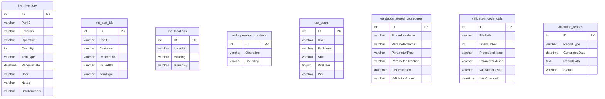

# Database Consistency and Error Handling Standardization - Implementation Plan

## Goal

Implement a comprehensive validation and standardization system for all stored procedures and their calling code in the MTM WIP Application. This will ensure consistent error handling patterns (-1 = error, 0 = no data, 1 = success), validate parameter matching between C# code and stored procedures, and establish a reliable foundation for all database operations.

## Requirements

### Technical Implementation Requirements

- **Phase 1**: Complete audit and validation of all stored procedure calls versus actual stored procedure definitions
- **Phase 2**: Systematic correction of parameter mismatches in C# calling code
- **Phase 3**: Standardization of all stored procedures to follow consistent error handling patterns
- **Phase 4**: File synchronization and documentation of all changes
- **Phase 5**: Comprehensive testing and validation of the standardized system

### Implementation Plan Specifics

- Maintain 100% backward compatibility during the transition process
- Implement detailed logging and reporting for all validation and correction activities
- Ensure all changes are atomic and can be rolled back if issues are discovered
- Provide comprehensive documentation of all modifications made

## Technical Considerations

### System Architecture Overview


### Technology Stack Selection

**Core Technologies (Fixed)**
- **.NET 8.0**: Primary application framework with C# 12 language features
- **Avalonia 11.3.4**: Cross-platform UI framework for desktop applications  
- **MySQL 9.4.0**: Database server with MySql.Data connector
- **Microsoft Extensions 9.0.8**: Dependency injection, logging, and configuration

**Database Access Pattern**
- **Helper_Database_StoredProcedure**: Centralized stored procedure execution with status return pattern
- **StoredProcedureResult**: Standardized result object with Status, Message, and Data properties
- **MySqlConnection/MySqlCommand**: Direct database connectivity using MySQL .NET connector

**Validation and Analysis Tools**
- **Roslyn Code Analysis**: For parsing C# code and extracting stored procedure calls
- **SQL Parser**: For analyzing stored procedure definitions and parameter structures
- **Reflection-based Validation**: For runtime parameter type validation
- **File System Monitoring**: For tracking changes to stored procedure files

### Integration Points

**Clear Boundaries and Communication Protocols**

1. **ViewModel ↔ Service Layer**
   ```csharp
   // Standardized error handling pattern
   try 
   {
       var result = await _inventoryService.AddInventoryAsync(parameters);
       if (result.Status == 1) 
       {
           // Success - process data
       }
       else if (result.Status == 0)
       {
           // No data returned
       }
       else 
       {
           // Error occurred - result.Status == -1
           await ErrorHandling.HandleErrorAsync(new InvalidOperationException(result.Message));
       }
   }
   catch (Exception ex)
   {
       await ErrorHandling.HandleErrorAsync(ex, "Database operation failed");
   }
   ```

2. **Service Layer ↔ Helper_Database_StoredProcedure**
   ```csharp
   // Standardized stored procedure call pattern
   var parameters = new Dictionary<string, object>
   {
       ["p_PartID"] = partId,      // Validated parameter names
       ["p_Location"] = location,   // Validated parameter types
       ["p_Operation"] = operation  // Consistent naming convention
   };
   
   var result = await Helper_Database_StoredProcedure.ExecuteDataTableWithStatus(
       connectionString, 
       "inv_inventory_Get_ByPartIDandOperation", 
       parameters);
   ```

3. **Helper_Database_StoredProcedure ↔ Stored Procedures**
   ```sql
   -- Standardized stored procedure pattern
   CREATE PROCEDURE `sp_name`(
       IN p_Parameter1 VARCHAR(300),
       IN p_Parameter2 INT,
       OUT p_Status INT,           -- Standard status output
       OUT p_ErrorMsg VARCHAR(255) -- Standard error message output
   )
   BEGIN
       -- Status codes: -1 = Error, 0 = No Data, 1 = Success with Data
       SET p_Status = 1;
       SET p_ErrorMsg = NULL;
   END
   ```

### Database Schema Design



**Indexing Strategy**
- Primary indexes on all ID fields for fast lookups
- Composite indexes on frequently queried combinations (PartID + Operation)
- Text indexes on procedure names for validation queries
- Temporal indexes on validation timestamps for reporting

**Database Migration Strategy**
- No schema changes to existing tables
- New validation tables for implementation tracking only
- All changes tracked in validation_reports table
- Rollback capability through stored procedure versioning

### API Design

**Internal Service Endpoints**

```csharp
// Validation Service Interface
public interface IStoredProcedureValidationService
{
    Task<ValidationReport> ValidateAllStoredProceduresAsync();
    Task<ValidationReport> ValidateSpecificProcedureAsync(string procedureName);
    Task<CorrectionReport> CorrectParameterMismatchesAsync();
    Task<StandardizationReport> StandardizeStoredProceduresAsync();
    Task<bool> ValidateStatusCodeImplementationAsync();
}

// Configuration Service Integration
public interface IValidationConfigurationService  
{
    Task<List<string>> GetActiveStoredProceduresAsync();
    Task<Dictionary<string, StoredProcedureDefinition>> GetStoredProcedureDefinitionsAsync();
    Task<ValidationSettings> GetValidationSettingsAsync();
    Task SaveValidationReportAsync(ValidationReport report);
}

// File Management Service
public interface IStoredProcedureFileService
{
    Task<string> ReadStoredProcedureFileAsync(string fileName);
    Task WriteStoredProcedureFileAsync(string fileName, string content);
    Task<bool> SynchronizeStoredProcedureFilesAsync();
    Task<FileComparisonResult> CompareStoredProcedureFilesAsync();
}
```

**Request/Response Formats**

```csharp
// Validation Report Structure
public class ValidationReport
{
    public DateTime GeneratedOn { get; set; }
    public List<ProcedureValidationResult> Results { get; set; }
    public ValidationSummary Summary { get; set; }
    public List<ValidationError> Errors { get; set; }
}

public class ProcedureValidationResult  
{
    public string ProcedureName { get; set; }
    public List<ParameterMismatch> ParameterMismatches { get; set; }
    public bool IsStandardized { get; set; }
    public StatusCodeImplementation StatusImplementation { get; set; }
}

public class ParameterMismatch
{
    public string ExpectedName { get; set; }
    public string ActualName { get; set; }
    public string ExpectedType { get; set; }
    public string ActualType { get; set; }
    public string FilePath { get; set; }
    public int LineNumber { get; set; }
}
```

**Error Handling Strategies**

```csharp
// Standardized Error Response
public class ValidationException : Exception
{
    public string ValidationContext { get; set; }
    public List<ValidationError> ValidationErrors { get; set; }
    
    public ValidationException(string message, List<ValidationError> errors) 
        : base(message)
    {
        ValidationErrors = errors;
    }
}

// Status Code Standards
public enum StoredProcedureStatus
{
    Error = -1,      // Database error, exception, or invalid operation
    NoData = 0,      // Operation successful but no data to return
    Success = 1      // Operation successful with data returned
}
```

### Frontend Architecture

**Component Integration with Existing MTM Architecture**

```csharp
// Validation Dashboard ViewModel (New)
[ObservableObject]
public partial class ValidationDashboardViewModel : BaseViewModel
{
    [ObservableProperty]
    private ValidationReport? currentReport;
    
    [ObservableProperty]
    private bool isValidationRunning;
    
    [ObservableProperty]
    private string validationProgress = "";
    
    [RelayCommand]
    private async Task RunValidationAsync()
    {
        IsValidationRunning = true;
        try
        {
            CurrentReport = await _validationService.ValidateAllStoredProceduresAsync();
            ValidationProgress = "Validation completed successfully";
        }
        catch (Exception ex)
        {
            await ErrorHandling.HandleErrorAsync(ex, "Validation process failed");
        }
        finally
        {
            IsValidationRunning = false;
        }
    }
}
```

**State Flow Diagram**


**Reusable Component Library Integration**

```xml
<!-- Validation Dashboard View (New) -->
<UserControl xmlns="https://github.com/avaloniaui"
             xmlns:x="http://schemas.microsoft.com/winfx/2006/xaml"
             x:Class="MTM_WIP_Application_Avalonia.Views.ValidationDashboardView">
             
  <ScrollViewer HorizontalScrollBarVisibility="Auto" VerticalScrollBarVisibility="Auto">
    <Grid x:Name="MainContainer" RowDefinitions="Auto,*,Auto" MinWidth="800" MinHeight="500" Margin="8">
      
      <!-- Header Section -->
      <Border Grid.Row="0" Background="{DynamicResource MTM_Shared_Logic.CardBackgroundBrush}"
              BorderBrush="{DynamicResource MTM_Shared_Logic.BorderLightBrush}" 
              BorderThickness="1" CornerRadius="8" Padding="16" Margin="0,0,0,8">
        <StackPanel Orientation="Horizontal" Spacing="16">
          <TextBlock Text="Database Validation Dashboard" 
                     FontSize="20" FontWeight="Bold" 
                     VerticalAlignment="Center"/>
          <Button Content="Run Validation" 
                  Command="{Binding RunValidationCommand}"
                  IsEnabled="{Binding !IsValidationRunning}"
                  Background="#0078D4" Foreground="White"/>
        </StackPanel>
      </Border>
      
      <!-- Content Area -->
      <Border Grid.Row="1" Background="{DynamicResource MTM_Shared_Logic.CardBackgroundBrush}"
              BorderBrush="{DynamicResource MTM_Shared_Logic.BorderLightBrush}" 
              BorderThickness="1" CornerRadius="8" Padding="16" Margin="0,0,0,8">
        <!-- Validation results display -->
      </Border>
      
      <!-- Action Buttons -->
      <Border Grid.Row="2" Background="{DynamicResource MTM_Shared_Logic.PanelBackgroundBrush}">
        <StackPanel Orientation="Horizontal" Spacing="8" HorizontalAlignment="Right">
          <Button Content="Correct Issues" Command="{Binding CorrectIssuesCommand}"/>
          <Button Content="Standardize Procedures" Command="{Binding StandardizeProceduresCommand}"/>
          <Button Content="Generate Report" Command="{Binding GenerateReportCommand}"/>
        </StackPanel>
      </Border>
      
    </Grid>
  </ScrollViewer>
</UserControl>
```

### Security & Performance

**Authentication/Authorization Requirements**
- Leverage existing MTM user authentication system
- Validation operations require administrative privileges
- All validation activities logged with user context
- File modification operations require elevated permissions

**Data Validation and Sanitization**
- All stored procedure names validated against whitelist
- Parameter values sanitized before comparison
- SQL injection prevention in validation queries
- File path validation for stored procedure file operations

**Performance Optimization Strategies**
- Asynchronous validation operations to prevent UI blocking
- Chunked processing of large stored procedure collections
- Cached stored procedure definitions to reduce file I/O
- Parallel validation of independent stored procedures
- Progress reporting for long-running operations

**Caching Mechanisms**
- In-memory cache of stored procedure definitions
- Cached validation results with configurable expiration
- File system watcher for automatic cache invalidation
- Lazy loading of validation reports and detailed results

## Implementation Phases

### Phase 1: Foundation and Analysis Infrastructure

**Duration**: 2-3 days

**Deliverables**:
1. **StoredProcedureValidator Service**
   - Scan all C# files for stored procedure calls
   - Extract procedure names and parameter usage
   - Build comprehensive inventory of active procedures

2. **StoredProcedureAnalyzer Service**  
   - Parse stored procedure SQL files
   - Extract parameter definitions and types
   - Build stored procedure definition cache

3. **ValidationReporter Service**
   - Generate detailed validation reports
   - Track validation history and changes
   - Provide export capabilities for documentation

**Technical Tasks**:
- Create validation service interfaces and implementations
- Implement Roslyn-based C# code analysis
- Build SQL parsing capabilities for stored procedure definitions
- Establish validation database tables and data structures
- Create comprehensive logging and error handling

### Phase 2: Parameter Validation and Correction

**Duration**: 3-4 days

**Deliverables**:
1. **Parameter Mismatch Detection**
   - Compare C# parameter usage against stored procedure definitions
   - Identify type mismatches and naming inconsistencies
   - Generate detailed mismatch reports with file locations

2. **Automated Parameter Correction**
   - Update C# code to use correct parameter names
   - Fix type compatibility issues
   - Maintain backward compatibility during transitions

3. **Code Correction Verification**
   - Validate that all parameter corrections compile successfully
   - Test corrected code against actual stored procedures
   - Generate before/after comparison reports

**Technical Tasks**:
- Implement parameter comparison algorithms
- Build automated code modification capabilities using Roslyn
- Create comprehensive test suite for parameter corrections
- Establish rollback mechanisms for failed corrections
- Document all parameter changes made

### Phase 3: Stored Procedure Standardization

**Duration**: 4-5 days

**Deliverables**:
1. **Status Code Standardization**
   - Update all stored procedures to implement -1/0/1 status pattern
   - Ensure consistent @p_Status and @p_ErrorMsg output parameters
   - Implement proper error handling in all procedures

2. **Output Parameter Standardization**
   - Standardize parameter naming conventions across all procedures
   - Ensure consistent parameter types and sizes
   - Update procedure documentation and comments

3. **Error Handling Enhancement**
   - Implement robust error handling in all stored procedures
   - Ensure proper transaction management and rollback
   - Add comprehensive error logging and reporting

**Technical Tasks**:
- Update all 45+ stored procedures systematically
- Implement automated testing for each updated procedure
- Create stored procedure templates for future development
- Update documentation and developer guidelines
- Verify compatibility with existing application code

### Phase 4: File Synchronization and Documentation

**Duration**: 1-2 days

**Deliverables**:
1. **File Synchronization System**
   - Synchronize Updated_Stored_Procedures.sql with all changes
   - Replace Development_Stored_Procedures.sql with updated content
   - Implement file comparison and validation tools

2. **Comprehensive Documentation**
   - Document all changes made to stored procedures
   - Create migration documentation for deployment
   - Update developer guidelines and coding standards

3. **Change Tracking System**
   - Maintain detailed logs of all modifications
   - Provide audit trail for compliance and troubleshooting
   - Create rollback procedures for emergency situations

**Technical Tasks**:
- Implement file synchronization automation
- Create comprehensive documentation generation tools
- Build change tracking and audit capabilities
- Establish deployment and rollback procedures
- Update development workflow documentation

### Phase 5: Testing and Validation

**Duration**: 2-3 days

**Deliverables**:
1. **Comprehensive Testing Suite**
   - Test all stored procedure calls with new standardized patterns
   - Verify error handling behaves consistently across operations
   - Validate status code implementation accuracy

2. **Performance Validation**
   - Ensure no performance degradation from changes
   - Test database operations under load
   - Verify connection handling and resource management

3. **End-to-End Integration Testing**
   - Test complete user workflows with standardized procedures
   - Verify UI responsiveness and error display
   - Validate logging and monitoring functionality

**Technical Tasks**:
- Create automated test suite for all stored procedures
- Implement performance testing and monitoring
- Build integration test scenarios covering major workflows
- Establish continuous validation procedures
- Document testing procedures and expected results

## Risk Mitigation and Rollback Strategy

### Identified Risks and Mitigation Plans

1. **Parameter Mismatch Errors**
   - Risk: Automatic corrections may introduce new errors
   - Mitigation: Comprehensive testing before deployment, staged rollout approach

2. **Performance Degradation**
   - Risk: Standardized error handling may impact database performance  
   - Mitigation: Performance testing at each phase, optimization of stored procedures

3. **Application Downtime**
   - Risk: Database changes may cause temporary unavailability
   - Mitigation: Off-hours deployment, blue-green deployment strategy

4. **Data Integrity Issues**
   - Risk: Stored procedure changes may affect data consistency
   - Mitigation: Transaction-based updates, comprehensive backup strategy

### Rollback Procedures

1. **Code Rollback**: Maintain Git branches for each phase with ability to revert changes
2. **Database Rollback**: Keep versioned copies of all stored procedures before modifications
3. **Configuration Rollback**: Backup all configuration files and restore points
4. **Data Rollback**: Full database backup before any modifications begin

### Success Metrics

1. **Validation Accuracy**: 100% of stored procedure calls validated and corrected
2. **Error Consistency**: All stored procedures implement -1/0/1 status pattern
3. **Performance Maintenance**: No measurable performance degradation
4. **Documentation Quality**: Complete documentation of all changes and new standards
5. **Developer Experience**: Improved error handling and debugging capabilities

This implementation plan provides a systematic approach to achieving database consistency and error handling standardization while maintaining application stability and performance throughout the process.
