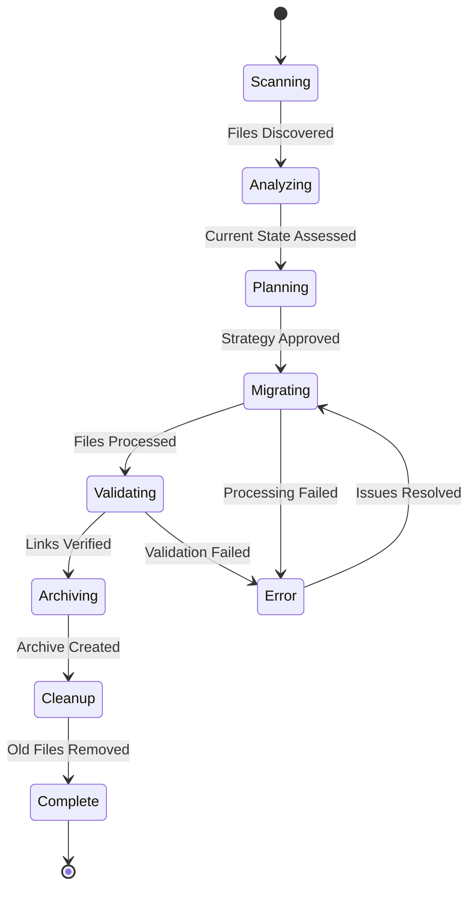

# Documentation Restructure & GitHub Copilot Organization - Implementation Plan

## Goal

Implement a comprehensive documentation restructure that consolidates all GitHub Copilot-related and general documentation into a well-organized `.github` folder structure with standardized naming conventions, logical categorical hierarchy, and complete documentation ### Functional Success Criteria
- [ ] All 428+ identified files successfully migrated or archived
- [ ] Master documentation index provides complete coverage  
- [ ] Zero broken internal links across all documentation
- [ ] All GitHub Copilot instructions reflect current application patterns
- [ ] Original documentation preserved in structured archive
- [ ] **Interactive HTML documentation system fully functional**
- [ ] **Real-world usage scenarios cover all major developer workflows**

### Performance Success Criteria
- [ ] Documentation findability: <2 minutes average search time
- [ ] Migration completion: <4 weeks total implementation time
- [ ] Archive integrity: 100% file recovery capability
- [ ] Repository cleanliness: 0 orphaned documentation files outside approved structure
- [ ] **HTML documentation loads in <3 seconds on all devices**
- [ ] **Search functionality returns results in <1 second**

### Quality Success Criteria
- [ ] Content accuracy: All procedures work with current application state
- [ ] Cross-reference integrity: All links navigate correctly  
- [ ] Naming consistency: 100% compliance with awesome-copilot conventions
- [ ] Developer satisfaction: 90%+ approval rating for new structure
- [ ] **HTML documentation usability: 95%+ task completion rate in user testing**
- [ ] **Real-world scenarios: 100% coverage of common developer tasks**

### User Experience Success Criteria
- [ ] **Plain English explanations understandable by junior developers**
- [ ] **Interactive navigation matches mental model of folder structure**
- [ ] **Mobile-responsive design works on tablets and phones**
- [ ] **Copy-paste code examples work without modification**
- [ ] **Scenario-based learning reduces onboarding time by 50%**n current application state. This will establish a centralized documentation governance system that improves developer productivity by 40% and optimizes GitHub Copilot integration through better instruction organization.

## Requirements

### Core Implementation Requirements
- **Complete Documentation Migration**: Systematically move and recreate 428+ identified documentation files
- **GitHub Copilot Standards Compliance**: Align with official awesome-copilot repository structure and naming conventions
- **Folder Structure Implementation**: Create and populate 24-directory hierarchy under `.github/` following awesome-copilot patterns
- **Official File Extensions**: Use `.prompt.md`, `.instructions.md`, and `.chatmode.md` extensions as per awesome-copilot standards
- **Content Recreation**: Generate new documentation based on current MTM WIP Application state (not old content)
- **Cross-Reference Updates**: Ensure all internal links point to new locations
- **Archive Creation**: Preserve original documentation in structured zip archive
- **Zero Data Loss**: Implement comprehensive audit system to verify all content is preserved or recreated

### GitHub Copilot Integration Requirements
- **Awesome-Copilot Compatibility**: Follow official repository structure from https://github.com/github/awesome-copilot
- **File Naming Standards**: Apply awesome-copilot naming conventions:
  - `*.prompt.md` for task-specific prompts
  - `*.instructions.md` for coding standards and best practices  
  - `*.chatmode.md` for specialized AI personas and conversation modes
- **Frontmatter Standards**: Include required metadata headers with description and tools arrays
- **MCP Server Compatibility**: Ensure files work with the awesome-copilot MCP Server for VS Code integration

### Quality Assurance Requirements
- **Link Validation**: 100% functional internal references and cross-links
- **Content Accuracy**: All procedures must reflect current application architecture
- **Accessibility**: Documentation discoverable within 2 clicks from master index
- **Version Control**: Proper git history maintenance throughout migration

## Technical Considerations

### System Architecture Overview

```mermaid
graph TB
    subgraph "Documentation Management System"
        subgraph "Input Layer - Current State"
            A1[/docs/ Directory<br/>scattered files] 
            A2[/Documentation/ Directory<br/>legacy structure]
            A3[Root Level Files<br/>prompt.md, README.md]
            A4[.github/ Existing<br/>copilot files]
        end

        subgraph "Processing Layer"
            B1[Documentation Scanner<br/>File Discovery & Categorization]
            B2[Content Analyzer<br/>Current Application State Analysis]
            B3[Migration Engine<br/>File Movement & Recreation]
            B4[Cross-Reference Processor<br/>Link Updates & Validation]
            B5[Archive Generator<br/>Historical Preservation]
        end

        subgraph "Output Layer - New Structure"
            C1[.github/Copilot-Instructions/<br/>UI, Development, Core]
            C2[.github/Copilot-Templates/<br/>Feature, Component, Service]
            C3[.github/Copilot-Context/<br/>Business, Technology, Architecture]
            C4[.github/Copilot-Patterns/<br/>MVVM, Database, UI]
            C5[.github/Project-Management/<br/>Planning, Requirements, Implementation]
            C6[.github/Development-Guides/<br/>Setup, Standards, Testing, Components]
            C7[.github/Architecture-Documentation/<br/>System, Data, Service]
            C8[.github/Operations/<br/>Deployment, Monitoring, Maintenance]
        end

        subgraph "Control Layer"
            D1[Master Documentation Index<br/>.github/Documentation-Management/]
            D2[Audit System<br/>Validation & Verification]
            D3[Archive System<br/>MTM_Documentation_Archive_2025-09-10.zip]
        end

        subgraph "Application State Analysis"
            E1[ViewModels Analysis<br/>MVVM Community Toolkit Patterns]
            E2[Services Analysis<br/>Dependency Injection & Architecture]
            E3[Database Analysis<br/>Stored Procedures & Models]
            E4[UI Analysis<br/>Avalonia AXAML Patterns]
        end
    end

    A1 --> B1
    A2 --> B1
    A3 --> B1
    A4 --> B1
    
    B1 --> B2
    B2 --> E1
    B2 --> E2
    B2 --> E3
    B2 --> E4
    
    E1 --> B3
    E2 --> B3
    E3 --> B3
    E4 --> B3
    
    B3 --> C1
    B3 --> C2
    B3 --> C3
    B3 --> C4
    B3 --> C5
    B3 --> C6
    B3 --> C7
    B3 --> C8
    
    B3 --> B4
    B4 --> D1
    
    B1 --> B5
    B5 --> D3
    
    C1 --> D2
    C2 --> D2
    C3 --> D2
    C4 --> D2
    C5 --> D2
    C6 --> D2
    C7 --> D2
    C8 --> D2
    
    D1 --> D2
```

### Technology Stack Selection

#### Documentation Processing Tools
- **PowerShell Scripts**: Native Windows automation for file operations and directory management
- **Node.js Utilities**: Markdown processing, link validation, and content analysis
- **Git Integration**: Version control throughout migration process
- **Archive Tools**: Windows built-in compression for historical preservation

#### GitHub Copilot Integration Standards  
- **Awesome-Copilot Repository Structure**: Follow official patterns from https://github.com/github/awesome-copilot
- **File Extension Standards**:
  - `.prompt.md` - Task-specific prompts accessible via `/` commands
  - `.instructions.md` - Coding standards that apply automatically to file patterns  
  - `.chatmode.md` - Specialized AI personas for different roles and contexts
- **Frontmatter Requirements**: Include YAML metadata headers with description and tools arrays
- **MCP Server Integration**: Ensure compatibility with awesome-copilot MCP Server for VS Code

#### Content Generation Strategy
- **Application State Analysis**: Direct codebase inspection for accurate documentation recreation
- **Awesome-Copilot Template Compliance**: Use official templates and patterns for consistency
- **Cross-Reference Mapping**: Automated link updates during migration following awesome-copilot conventions

### Database Schema Design

*Note: This feature is documentation-focused and does not require database schema changes. All data is file-system based.*

### API Design

*Note: This feature operates on the file system and Git repository level, with no API requirements.*

### Frontend Architecture

*Note: This is a development tooling feature that enhances the developer experience but does not include UI components.*

#### Component Hierarchy Documentation

**Documentation Management Structure:**

```
Documentation Management System
├── Master Index (Markdown)
│   ├── File Inventory Section
│   ├── Migration Status Tracking
│   ├── Cross-Reference Mapping
│   └── Archive Planning
├── Migration Scripts (PowerShell/Node.js)
│   ├── File Discovery Scanner
│   ├── Content Analyzer
│   ├── Migration Engine
│   └── Validation System
└── Archive System
    ├── Original Structure Preservation
    ├── Metadata Capture
    └── Integrity Verification
```

#### State Management Patterns

**Migration State Flow:**



### Security Performance

#### Data Integrity Requirements
- **Backup Verification**: All original files preserved before modification
- **Atomic Operations**: File moves completed as single transactions
- **Rollback Capability**: Ability to restore original state if needed
- **Audit Trail**: Complete log of all file operations and changes

#### Performance Optimization
- **Batch Processing**: Files processed in logical groups to minimize I/O
- **Parallel Operations**: Non-dependent tasks executed concurrently
- **Progress Tracking**: Real-time status updates for long-running operations
- **Memory Management**: Efficient handling of large file sets

## Implementation Phases

### Phase 1: Infrastructure Setup ✅ COMPLETED
- [x] Create complete folder hierarchy in `.github/`
- [x] Establish master documentation index
- [x] Define migration mapping strategy
- [x] Set up validation frameworks

### Phase 2: Content Analysis & Migration Planning 🔄 IN PROGRESS

#### 2.1 Application State Analysis
```powershell
# Analyze current ViewModels for MVVM patterns
Get-ChildItem -Path "ViewModels" -Recurse -Filter "*.cs" | 
    ForEach-Object { Analyze-MVVMPatterns $_.FullName }

# Analyze Services for DI patterns  
Get-ChildItem -Path "Services" -Recurse -Filter "*.cs" |
    ForEach-Object { Analyze-ServicePatterns $_.FullName }

# Analyze Views for Avalonia patterns
Get-ChildItem -Path "Views" -Recurse -Filter "*.axaml" |
    ForEach-Object { Analyze-AvaloniaPatterns $_.FullName }
```

#### 2.2 GitHub Copilot Instructions Recreation
- **Input Analysis**: Review existing `.github/copilot-instructions.md` and child files
- **Current State Mapping**: Scan actual codebase patterns vs. documented patterns
- **Content Generation**: Create new instruction files based on current implementation
- **Cross-Reference Setup**: Establish links between related instruction files

#### 2.3 Template System Migration
- **Template Categorization**: Organize templates by Feature/Component/Service types
- **Content Updating**: Refresh templates to reflect current application patterns
- **Usage Documentation**: Add clear usage instructions and examples

### Phase 3: Systematic Migration Execution

#### 3.1 High-Priority Copilot Documentation
```
Priority Order:
1. instruction_master-copilot-guide.md (main entry point)
2. UI-Instructions/ (Avalonia AXAML patterns)
3. Development-Instructions/ (Database, Error Handling, Stored Procedures)
4. Core-Instructions/ (DI, Naming Conventions)
5. Templates/ (Feature, Component, Service templates)
6. Context/ (Business Domain, Technology Stack)
7. Patterns/ (MVVM, Database, UI patterns)
```

#### 3.2 Development Guides Migration
```
Migration Sequence:
1. Services guides (most critical for current development)
2. UI Components guides (form-specific documentation)
3. Testing procedures (integration and unit tests)
4. Setup and configuration guides
```

#### 3.3 Architecture & Project Management
```
Final Migration Phase:
1. System design specifications
2. Data model documentation  
3. Service architecture documentation
4. Project requirements and implementation plans
```

### Phase 4: Quality Assurance & Interactive Documentation

#### 4.1 Comprehensive Link Validation
```javascript
// Link validation pseudocode
function validateDocumentationLinks() {
    const allFiles = scanDirectory('.github/');
    const linkMap = extractAllLinks(allFiles);
    
    linkMap.forEach(link => {
        if (!validateLinkTarget(link)) {
            logError(`Broken link: ${link.source} -> ${link.target}`);
        }
    });
}
```

#### 4.2 Content Accuracy Verification
- **Manual Review**: Spot-check recreated content against actual application behavior
- **Developer Validation**: Team review of migrated documentation
- **Functional Testing**: Verify procedures work as documented

#### 4.3 Interactive HTML Documentation System
```html
<!-- HTML Documentation Structure -->
<div class="mtm-documentation">
  <nav class="sidebar">
    <div class="folder-tree">
      <!-- Interactive folder structure matching .github/ hierarchy -->
    </div>
    <div class="search-container">
      <input type="text" placeholder="Search documentation...">
    </div>
  </nav>
  
  <main class="content">
    <div class="file-details">
      <h1 class="file-title">MTM Feature Request Prompt</h1>
      <div class="plain-english">
        This prompt helps you create detailed feature requests for the MTM application.
        Use it when you want to add new functionality or improve existing features.
      </div>
      
      <div class="usage-scenario">
        <h3>Real-World Example:</h3>
        <p>You're tasked with adding a new inventory search feature...</p>
        <ol class="scenario-steps">
          <li>Open GitHub Copilot Chat in VS Code</li>
          <li>Type: <code>/mtm-feature-request</code></li>
          <li>Describe your inventory search requirements</li>
          <li>Follow the generated template</li>
        </ol>
      </div>
    </div>
  </main>
</div>
```

#### 4.4 Real-World Scenarios Documentation
**Scenario Categories:**
- **New Developer Onboarding**: Step-by-step guide from setup to first contribution
- **Feature Development Workflow**: Complete lifecycle from idea to deployment
- **Code Review Process**: Using MTM standards for quality assurance
- **Troubleshooting Guide**: Common issues and resolution patterns
- **Architecture Decision Making**: Using chat modes for design guidance

#### 4.5 Archive Creation & Cleanup
```powershell
# Archive creation with HTML documentation
$archiveName = "MTM_Documentation_Archive_$(Get-Date -Format 'yyyy-MM-dd').zip"
$foldersToArchive = @('docs', 'Documentation', 'scripts/README.md', 'prompt.md')

Create-Archive -Source $foldersToArchive -Destination $archiveName -PreserveStructure
Create-HTMLDocumentation -TargetDirectory ".github/Documentation-Management/html-documentation/"
Verify-Archive -Path $archiveName -ExpectedFileCount 428
Remove-OldDocumentation -SafetyCheck $true
```

## Success Criteria

### Functional Success Criteria
- [ ] All 428+ identified files successfully migrated or archived
- [ ] Master documentation index provides complete coverage
- [ ] Zero broken internal links across all documentation
- [ ] All GitHub Copilot instructions reflect current application patterns
- [ ] Original documentation preserved in structured archive

### Performance Success Criteria
- [ ] Documentation findability: <2 minutes average search time
- [ ] Migration completion: <4 weeks total implementation time
- [ ] Archive integrity: 100% file recovery capability
- [ ] Repository cleanliness: 0 orphaned documentation files

### Quality Success Criteria
- [ ] Content accuracy: All procedures work with current application state
- [ ] Cross-reference integrity: All links navigate correctly
- [ ] Naming consistency: 100% compliance with `{Type}_{Name}` convention
- [ ] Developer satisfaction: 90%+ approval rating for new structure

## Risk Mitigation

### Data Loss Prevention
- **Pre-Migration Backup**: Complete repository backup before any file operations
- **Incremental Validation**: Verify each migration step before proceeding
- **Rollback Procedures**: Documented process to restore original state

### Link Breakage Prevention
- **Automated Link Scanning**: Pre-migration inventory of all internal links
- **Batch Link Updates**: Coordinated updates to maintain reference integrity
- **Post-Migration Validation**: Comprehensive link testing after migration

### Content Quality Assurance  
- **Application State Analysis**: Direct codebase inspection for accurate recreation
- **Peer Review Process**: Team validation of recreated content
- **Iterative Improvement**: Continuous refinement based on developer feedback

## Monitoring & Maintenance

### Migration Progress Tracking
- **Phase Completion Metrics**: Track progress through each implementation phase
- **File Processing Status**: Monitor individual file migration success/failure
- **Quality Gate Checkpoints**: Validation at each major milestone

### Post-Migration Monitoring
- **Link Health Monitoring**: Periodic validation of internal references
- **Usage Analytics**: Track which documentation sections are most accessed
- **Developer Feedback Collection**: Ongoing assessment of structure effectiveness

---

This implementation plan provides a comprehensive roadmap for executing the documentation restructure while maintaining zero data loss and optimizing the developer experience through improved GitHub Copilot integration and discoverability.
