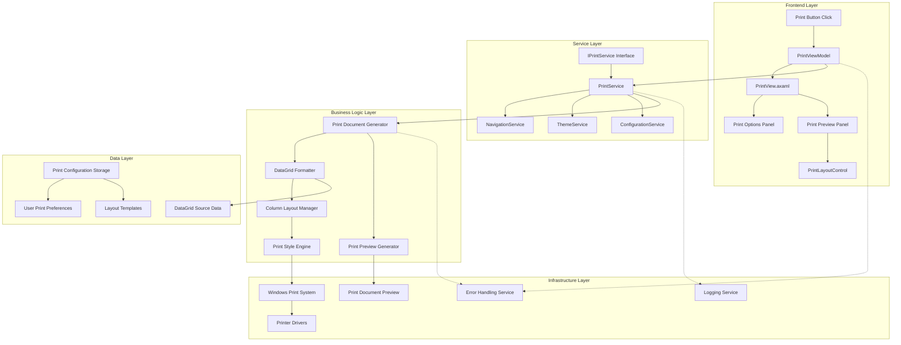
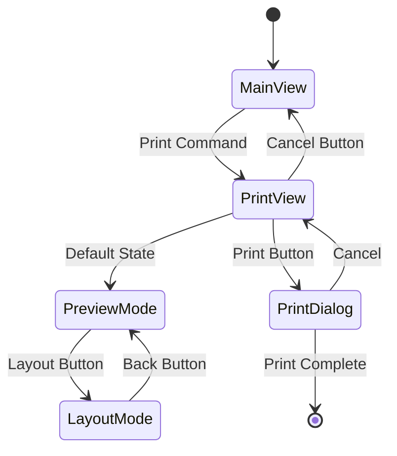

# Print Service Implementation Plan

**Generated by**: Industry-veteran Software Engineer  
**Type**: Feature Implementation Plan  
**Target Framework**: .NET 8 Avalonia MVVM Application  
**Documentation Date**: 2025-01-09

## Goal

Implement a comprehensive Print Service for the MTM WIP Application Avalonia that provides full-window printing capabilities with print options, real-time preview, and advanced layout customization. The service will integrate seamlessly with the existing navigation system, supporting printing of DataGrid contents with professional formatting and user-configurable column visibility and layout styles.

## Requirements

### Functional Requirements
- **Full-Window Print View**: Navigate to a dedicated print interface that occupies the entire MainWindow content area
- **Dual-Panel Layout**: Left panel for print options, right panel for preview and layout controls
- **Print Options Panel**: Standard printing controls including printer selection, page orientation, copy count, and paper options
- **Print Preview System**: Real-time preview of the print output with scrollable viewing area
- **Layout Customization**: PrintLayoutControl for column visibility management and print style selection
- **Navigation Integration**: Seamless integration with existing NavigationService for full-window transitions
- **DataGrid Support**: Primary focus on printing DataGrid content with professional formatting
- **Theme Consistency**: Full integration with MTM design system and theme service

### Technical Requirements
- **MVVM Community Toolkit**: Use established patterns with `[ObservableProperty]` and `[RelayCommand]`
- **Avalonia UI Framework**: Native Avalonia controls and layouts with proper AXAML syntax
- **Service Integration**: Leverage existing services (Navigation, Theme, Error Handling, Configuration)
- **Professional Printing**: High-quality print output with proper formatting and layout
- **Print System Integration**: Native Windows printing system integration with print dialogs

## Technical Considerations

### System Architecture Overview



**Technology Stack Selection**:
- **Frontend**: Avalonia 11.3.4 with AXAML for native cross-platform UI
- **MVVM Framework**: MVVM Community Toolkit 8.3.2 for modern property/command patterns
- **Printing**: System.Drawing.Printing for Windows print integration
- **Preview**: Avalonia Canvas/ScrollViewer for custom print preview rendering
- **Navigation**: Existing NavigationService for full-window transitions

**Integration Points**:
- NavigationService: Full-window view transitions (MainView ↔ PrintView ↔ ThemeEditorView)
- ThemeService: Consistent MTM design system application
- ErrorHandling: Centralized error management for print operations
- ConfigurationService: Print preferences and settings persistence

**Deployment Architecture**:
- Service registration in ServiceCollectionExtensions
- ViewModel registration for dependency injection
- View registration with NavigationService routing

**Scalability Considerations**:
- Asynchronous print preview generation for large datasets
- Memory-efficient DataGrid content rendering
- Configurable print queue management for multiple print jobs

### Database Schema Design

**Note**: Print Service primarily uses in-memory configuration and does not require significant database schema changes.

```mermaid
erDiagram
    USER {
        string User PK
        string Name
        datetime LastLogin
    }
    
    USER_PRINT_PREFERENCES {
        string UserId PK FK
        string PreferenceKey PK
        string PreferenceValue
        datetime LastUpdated
    }
    
    PRINT_LAYOUT_TEMPLATES {
        int TemplateId PK
        string TemplateName
        string UserId FK
        string ColumnConfiguration
        string PrintStyle
        bool IsDefault
        datetime Created
        datetime LastModified
    }
    
    USER ||--o{ USER_PRINT_PREFERENCES : "has preferences"
    USER ||--o{ PRINT_LAYOUT_TEMPLATES : "creates templates"
```

**Table Specifications**:
- `USER_PRINT_PREFERENCES`: Stores user-specific print settings (printer, orientation, etc.)
- `PRINT_LAYOUT_TEMPLATES`: Stores custom column layouts and print styles per user
- Indexes on UserId for efficient preference retrieval
- JSON column storage for flexible configuration options

**Database Migration Strategy**:
- Optional feature - can function without database persistence
- Fallback to local configuration files if database unavailable
- Stored procedures for preference management if needed

### API Design

**Service Interface Design**:

```csharp
public interface IPrintService
{
    // Print operation initiation
    Task<bool> PrintDataGridAsync(DataGrid dataGrid, string title = "");
    Task ShowPrintPreviewAsync(DataGrid dataGrid, string title = "");
    
    // Print configuration management
    Task<PrintConfiguration> GetPrintConfigurationAsync(string userId);
    Task SavePrintConfigurationAsync(string userId, PrintConfiguration config);
    
    // Template management
    Task<List<PrintLayoutTemplate>> GetUserLayoutTemplatesAsync(string userId);
    Task<bool> SaveLayoutTemplateAsync(PrintLayoutTemplate template);
    Task<bool> DeleteLayoutTemplateAsync(int templateId, string userId);
    
    // Print system integration
    Task<List<string>> GetAvailablePrintersAsync();
    Task<PrinterCapabilities> GetPrinterCapabilitiesAsync(string printerName);
    
    // Event notifications
    event EventHandler<PrintStatusEventArgs> PrintStatusChanged;
    event EventHandler<PrintErrorEventArgs> PrintError;
}
```

**Request/Response Formats**:

```csharp
public class PrintConfiguration
{
    public string PrinterName { get; set; } = string.Empty;
    public PrintOrientation Orientation { get; set; } = PrintOrientation.Portrait;
    public int Copies { get; set; } = 1;
    public bool Collate { get; set; } = true;
    public PrintRange PageRange { get; set; } = PrintRange.AllPages;
    public PaperSize PaperSize { get; set; } = PaperSize.Letter;
    public Margins Margins { get; set; } = new Margins(50, 50, 50, 50);
}

public class PrintLayoutTemplate
{
    public int TemplateId { get; set; }
    public string TemplateName { get; set; } = string.Empty;
    public string UserId { get; set; } = string.Empty;
    public List<string> VisibleColumns { get; set; } = new();
    public Dictionary<string, int> ColumnOrder { get; set; } = new();
    public PrintStyle Style { get; set; } = PrintStyle.Simple;
    public bool IsDefault { get; set; }
}

public enum PrintStyle
{
    Simple,     // Minimal formatting, fastest printing
    Stylized    // Enhanced formatting with colors, borders, etc.
}
```

**Error Handling Strategies**:
- Printer not available: Graceful fallback to system default
- Large dataset handling: Chunked processing with progress feedback
- Print queue errors: Retry mechanism with user notification
- Theme integration errors: Fallback to system print styles

### Frontend Architecture

#### Component Hierarchy Documentation

**Layout Structure leveraging Avalonia UI components:**

```
Print View (Full Window)
├── Main Grid (ColumnDefinitions="300,*")
│   ├── Left Panel (Print Options)
│   │   ├── Header Section (Card)
│   │   │   └── Title (TextBlock "Print Options")
│   │   ├── Printer Selection (Card)
│   │   │   ├── Printer Label (TextBlock)
│   │   │   └── Printer ComboBox (Available Printers)
│   │   ├── Page Setup (Card)
│   │   │   ├── Orientation (RadioButton Group)
│   │   │   │   ├── Portrait (RadioButton)
│   │   │   │   └── Landscape (RadioButton)
│   │   │   ├── Paper Size (ComboBox)
│   │   │   └── Margins (NumericUpDown controls)
│   │   ├── Print Options (Card)
│   │   │   ├── Copies (NumericUpDown)
│   │   │   ├── Collate (CheckBox)
│   │   │   └── Page Range (RadioButton Group)
│   │   └── Action Buttons (StackPanel)
│   │       ├── Print Button (Primary)
│   │       └── Cancel Button (Secondary)
│   └── Right Panel (Preview & Layout)
│       ├── Top Section (Preview Area - Grid Row "*")
│       │   ├── Preview Header (DockPanel)
│       │   │   ├── Title (TextBlock)
│       │   │   └── Zoom Controls (StackPanel)
│       │   │       ├── Zoom Out (Button)
│       │   │       ├── Zoom Level (TextBlock)
│       │   │       └── Zoom In (Button)
│       │   └── Preview Content (ScrollViewer)
│       │       └── Print Preview Canvas (Canvas/Border)
│       │           └── [Dynamic Print Preview Content]
│       └── Bottom Section (Action Panel - Grid Row "Auto")
│           ├── Layout Button (Secondary Style)
│           ├── Print Button (Primary Style)
│           └── Cancel Button (Secondary Style)
```

**PrintLayoutControl Structure (Replaces Preview when active):**

```
Print Layout Control (Full Top Panel Replacement)
├── Header Section (DockPanel)
│   ├── Title (TextBlock "Customize Print Layout")
│   └── Back Button (Button with Icon)
├── Main Content (Grid RowDefinitions="Auto,*,Auto")
│   ├── Options Section (StackPanel)
│   │   ├── Style Selection (Card)
│   │   │   ├── Style Label (TextBlock)
│   │   │   └── Style Options (RadioButton Group)
│   │   │       ├── Simple Style (RadioButton)
│   │   │       └── Stylized Style (RadioButton)
│   │   └── Template Management (Card)
│   │       ├── Template Dropdown (ComboBox)
│   │       ├── Save Template Button (Button)
│   │       └── Delete Template Button (Button)
│   ├── Column Management (ScrollViewer)
│   │   └── Column List (ItemsControl)
│   │       └── Column Items (CheckBox + TextBlock per column)
│   │           ├── Visible Toggle (CheckBox)
│   │           ├── Column Name (TextBlock)
│   │           └── Drag Handle (Visual indicator)
│   └── Preview Section (Border)
│       └── Layout Preview (Mini preview of selected options)
```

**State Flow Diagram**:



**Component State Management**:
- PrintViewModel: Central state management with MVVM Community Toolkit
- Print configuration persistence through ConfigurationService
- Layout template management with user-specific storage
- Real-time preview updates through observable properties

#### TypeScript Interfaces and Types

**Note**: While this is a .NET/C# application, the equivalent strongly-typed interfaces:

```csharp
// Print Service Interface Types
public interface IPrintableData
{
    string Title { get; }
    IEnumerable<object> DataSource { get; }
    IEnumerable<ColumnDefinition> Columns { get; }
}

public class ColumnDefinition
{
    public string Name { get; set; } = string.Empty;
    public string Header { get; set; } = string.Empty;
    public Type DataType { get; set; } = typeof(string);
    public bool IsVisible { get; set; } = true;
    public int DisplayIndex { get; set; }
    public double Width { get; set; } = 100;
}

public class PrintDocument
{
    public string Title { get; set; } = string.Empty;
    public DateTime GeneratedAt { get; set; }
    public string GeneratedBy { get; set; } = string.Empty;
    public List<PrintPage> Pages { get; set; } = new();
    public PrintConfiguration Configuration { get; set; } = new();
}
```

### Security Performance

**Authentication/Authorization Requirements**:
- User-based print preferences and template storage
- Print operation logging for audit trails
- Administrative controls for printer access permissions
- Secure handling of sensitive data in print preview

**Data Validation and Sanitization**:
- Input validation for print configuration parameters
- DataGrid content sanitization before preview generation
- Template name validation to prevent injection attacks
- Print queue validation to prevent resource exhaustion

**Performance Optimization Strategies**:
- Lazy loading of print preview content for large datasets
- Virtualized rendering for DataGrid content with thousands of rows
- Asynchronous print preview generation with progress feedback
- Memory-efficient preview caching with automatic cleanup
- Optimized column layout calculation algorithms

**Caching Mechanisms**:
- Print configuration caching per user session
- Layout template caching with change detection
- Printer capabilities caching with refresh intervals
- Preview content caching with smart invalidation

## Implementation Plan Details

### Phase 1: Core Service Infrastructure (Days 1-3)

#### Service Implementation

**File**: `Services/PrintService.cs`

```csharp
namespace MTM_WIP_Application_Avalonia.Services;

public interface IPrintService
{
    Task<bool> PrintDataGridAsync(DataGrid dataGrid, string title = "");
    Task ShowPrintPreviewAsync(DataGrid dataGrid, string title = "");
    Task<PrintConfiguration> GetPrintConfigurationAsync(string userId);
    Task SavePrintConfigurationAsync(string userId, PrintConfiguration config);
    event EventHandler<PrintStatusEventArgs> PrintStatusChanged;
}

public class PrintService : IPrintService
{
    private readonly ILogger<PrintService> _logger;
    private readonly IConfigurationService _configurationService;
    private readonly INavigationService _navigationService;
    private readonly IThemeService _themeService;
    
    public PrintService(
        ILogger<PrintService> logger,
        IConfigurationService configurationService,
        INavigationService navigationService,
        IThemeService themeService)
    {
        _logger = logger;
        _configurationService = configurationService;
        _navigationService = navigationService;
        _themeService = themeService;
    }
    
    // Implementation follows established MTM patterns
}
```

#### Service Registration

**File**: `Extensions/ServiceCollectionExtensions.cs`

```csharp
public static IServiceCollection AddMTMServices(
    this IServiceCollection services, 
    IConfiguration configuration)
{
    // Existing services...
    
    // Print Service Registration
    services.TryAddSingleton<IPrintService, PrintService>();
    
    // Print ViewModels
    services.TryAddTransient<PrintViewModel>();
    services.TryAddTransient<PrintLayoutControlViewModel>();
    
    return services;
}
```

### Phase 2: ViewModel Implementation (Days 4-6)

#### Print ViewModel

**File**: `ViewModels/PrintViewModel.cs`

```csharp
[ObservableObject]
public partial class PrintViewModel : BaseViewModel
{
    private readonly IPrintService _printService;
    private readonly INavigationService _navigationService;
    private readonly IThemeService _themeService;
    
    [ObservableProperty]
    private string _documentTitle = string.Empty;
    
    [ObservableProperty]
    private ObservableCollection<string> _availablePrinters = new();
    
    [ObservableProperty]
    private string _selectedPrinter = string.Empty;
    
    [ObservableProperty]
    private PrintOrientation _orientation = PrintOrientation.Portrait;
    
    [ObservableProperty]
    private int _copies = 1;
    
    [ObservableProperty]
    private bool _collate = true;
    
    [ObservableProperty]
    private bool _isPreviewMode = true;
    
    [ObservableProperty]
    private bool _isLayoutMode = false;
    
    [ObservableProperty]
    private DataGrid? _sourceDataGrid;
    
    public PrintViewModel(
        IPrintService printService,
        INavigationService navigationService,
        IThemeService themeService,
        ILogger<PrintViewModel> logger) : base(logger)
    {
        _printService = printService;
        _navigationService = navigationService;
        _themeService = themeService;
        
        LoadPrintersCommand = new AsyncRelayCommand(LoadPrintersAsync);
        PrintCommand = new AsyncRelayCommand(ExecutePrintAsync);
        CancelCommand = new RelayCommand(ExecuteCancel);
        ShowLayoutCommand = new RelayCommand(ShowLayoutControl);
    }
    
    [RelayCommand]
    private async Task LoadPrintersAsync()
    {
        // Load available printers
    }
    
    [RelayCommand]
    private async Task ExecutePrintAsync()
    {
        // Execute print operation
    }
    
    [RelayCommand]
    private void ExecuteCancel()
    {
        // Navigate back to MainView
        var mainViewModel = Program.GetService<MainViewViewModel>();
        var mainView = new Views.MainView { DataContext = mainViewModel };
        _navigationService.NavigateTo(mainView);
    }
    
    [RelayCommand]
    private void ShowLayoutControl()
    {
        IsPreviewMode = false;
        IsLayoutMode = true;
    }
}
```

#### PrintLayoutControl ViewModel

**File**: `ViewModels/PrintLayoutControlViewModel.cs`

```csharp
[ObservableObject]
public partial class PrintLayoutControlViewModel : BaseViewModel
{
    [ObservableProperty]
    private ObservableCollection<ColumnItemViewModel> _availableColumns = new();
    
    [ObservableProperty]
    private PrintStyle _selectedStyle = PrintStyle.Simple;
    
    [RelayCommand]
    private void BackToPreview()
    {
        // Navigate back to preview mode
    }
    
    [RelayCommand]
    private void SaveTemplate()
    {
        // Save current layout as template
    }
}

public class ColumnItemViewModel : BaseViewModel
{
    [ObservableProperty]
    private string _columnName = string.Empty;
    
    [ObservableProperty]
    private bool _isVisible = true;
    
    [ObservableProperty]
    private int _displayIndex;
}
```

### Phase 3: View Implementation (Days 7-10)

#### Print View

**File**: `Views/PrintView.axaml`

```xml
<UserControl xmlns="https://github.com/avaloniaui"
             xmlns:x="http://schemas.microsoft.com/winfx/2006/xaml"
             xmlns:vm="using:MTM_WIP_Application_Avalonia.ViewModels"
             x:Class="MTM_WIP_Application_Avalonia.Views.PrintView">
    
    <Grid x:Name="MainContainer" ColumnDefinitions="300,*">
        <!-- Left Panel - Print Options -->
        <Border Grid.Column="0" 
                Background="{DynamicResource MTM_Shared_Logic.PanelBackgroundBrush}"
                BorderBrush="{DynamicResource MTM_Shared_Logic.BorderLightBrush}" 
                BorderThickness="0,0,1,0"
                Padding="16">
            
            <ScrollViewer VerticalScrollBarVisibility="Auto">
                <StackPanel Spacing="16">
                    
                    <!-- Header -->
                    <Border Background="{DynamicResource MTM_Shared_Logic.CardBackgroundBrush}"
                            BorderBrush="{DynamicResource MTM_Shared_Logic.BorderLightBrush}"
                            BorderThickness="1" CornerRadius="8" Padding="16">
                        <TextBlock Text="Print Options" 
                                   FontSize="18" FontWeight="Bold"
                                   Foreground="{DynamicResource MTM_Shared_Logic.ForegroundBrush}" />
                    </Border>
                    
                    <!-- Printer Selection -->
                    <Border Background="{DynamicResource MTM_Shared_Logic.CardBackgroundBrush}"
                            BorderBrush="{DynamicResource MTM_Shared_Logic.BorderLightBrush}"
                            BorderThickness="1" CornerRadius="8" Padding="16">
                        <StackPanel Spacing="8">
                            <TextBlock Text="Printer" FontWeight="Bold" />
                            <ComboBox x:Name="PrinterComboBox"
                                      ItemsSource="{Binding AvailablePrinters}"
                                      SelectedItem="{Binding SelectedPrinter}"
                                      HorizontalAlignment="Stretch" />
                        </StackPanel>
                    </Border>
                    
                    <!-- Page Setup -->
                    <Border Background="{DynamicResource MTM_Shared_Logic.CardBackgroundBrush}"
                            BorderBrush="{DynamicResource MTM_Shared_Logic.BorderLightBrush}"
                            BorderThickness="1" CornerRadius="8" Padding="16">
                        <StackPanel Spacing="12">
                            <TextBlock Text="Page Setup" FontWeight="Bold" />
                            
                            <!-- Orientation -->
                            <StackPanel Spacing="8">
                                <TextBlock Text="Orientation" />
                                <StackPanel Orientation="Horizontal" Spacing="16">
                                    <RadioButton Content="Portrait" 
                                                 IsChecked="{Binding Orientation, Converter={StaticResource EnumToBoolConverter}, ConverterParameter=Portrait}" />
                                    <RadioButton Content="Landscape"
                                                 IsChecked="{Binding Orientation, Converter={StaticResource EnumToBoolConverter}, ConverterParameter=Landscape}" />
                                </StackPanel>
                            </StackPanel>
                        </StackPanel>
                    </Border>
                    
                    <!-- Print Options -->
                    <Border Background="{DynamicResource MTM_Shared_Logic.CardBackgroundBrush}"
                            BorderBrush="{DynamicResource MTM_Shared_Logic.BorderLightBrush}"
                            BorderThickness="1" CornerRadius="8" Padding="16">
                        <StackPanel Spacing="12">
                            <TextBlock Text="Print Options" FontWeight="Bold" />
                            
                            <Grid ColumnDefinitions="Auto,*" RowDefinitions="Auto,Auto" 
                                  RowGap="8" ColumnGap="12">
                                <TextBlock Grid.Row="0" Grid.Column="0" Text="Copies:" VerticalAlignment="Center" />
                                <NumericUpDown Grid.Row="0" Grid.Column="1" 
                                               Value="{Binding Copies}" 
                                               Minimum="1" Maximum="999" />
                                
                                <CheckBox Grid.Row="1" Grid.ColumnSpan="2" 
                                          Content="Collate" 
                                          IsChecked="{Binding Collate}" />
                            </Grid>
                        </StackPanel>
                    </Border>
                    
                    <!-- Action Buttons -->
                    <StackPanel Spacing="8">
                        <Button Content="Print" 
                                Command="{Binding PrintCommand}"
                                Background="{DynamicResource MTM_Shared_Logic.PrimaryBrush}"
                                Foreground="White"
                                HorizontalAlignment="Stretch"
                                Padding="12,8" />
                        <Button Content="Cancel" 
                                Command="{Binding CancelCommand}"
                                HorizontalAlignment="Stretch"
                                Padding="12,8" />
                    </StackPanel>
                    
                </StackPanel>
            </ScrollViewer>
        </Border>
        
        <!-- Right Panel - Preview and Layout -->
        <Grid Grid.Column="1" RowDefinitions="*,Auto">
            
            <!-- Top Section - Preview or Layout Control -->
            <Border Grid.Row="0" 
                    Background="{DynamicResource MTM_Shared_Logic.CardBackgroundBrush}"
                    Margin="8">
                
                <!-- Print Preview -->
                <Grid x:Name="PreviewContainer" IsVisible="{Binding IsPreviewMode}">
                    <Grid RowDefinitions="Auto,*">
                        <!-- Preview Header -->
                        <DockPanel Grid.Row="0" Margin="16,16,16,8">
                            <TextBlock Text="{Binding DocumentTitle}" 
                                       FontSize="16" FontWeight="Bold"
                                       DockPanel.Dock="Left" />
                            <StackPanel Orientation="Horizontal" 
                                        HorizontalAlignment="Right"
                                        Spacing="8">
                                <Button Content="−" Width="30" Height="30" />
                                <TextBlock Text="100%" VerticalAlignment="Center" />
                                <Button Content="+" Width="30" Height="30" />
                            </StackPanel>
                        </DockPanel>
                        
                        <!-- Preview Content -->
                        <ScrollViewer Grid.Row="1" 
                                      HorizontalScrollBarVisibility="Auto"
                                      VerticalScrollBarVisibility="Auto"
                                      Background="{DynamicResource MTM_Shared_Logic.SurfaceBrush}">
                            <Border x:Name="PrintPreviewCanvas"
                                    Background="White"
                                    Margin="20"
                                    CornerRadius="4">
                                <!-- Dynamic print preview content goes here -->
                                <TextBlock Text="Print Preview Content" 
                                           HorizontalAlignment="Center" 
                                           VerticalAlignment="Center"
                                           Foreground="Gray" />
                            </Border>
                        </ScrollViewer>
                    </Grid>
                </Grid>
                
                <!-- Print Layout Control -->
                <ContentPresenter x:Name="LayoutControlContainer" 
                                  IsVisible="{Binding IsLayoutMode}"
                                  Content="{Binding LayoutControlContent}" />
                
            </Border>
            
            <!-- Bottom Section - Action Panel -->
            <Border Grid.Row="1" 
                    Background="{DynamicResource MTM_Shared_Logic.PanelBackgroundBrush}"
                    BorderBrush="{DynamicResource MTM_Shared_Logic.BorderLightBrush}"
                    BorderThickness="0,1,0,0"
                    Padding="16,8">
                
                <StackPanel Orientation="Horizontal" 
                            HorizontalAlignment="Right"
                            Spacing="8">
                    <Button Content="Layout" 
                            Command="{Binding ShowLayoutCommand}"
                            IsVisible="{Binding IsPreviewMode}"
                            Padding="12,6" />
                    <Button Content="Print" 
                            Command="{Binding PrintCommand}"
                            Background="{DynamicResource MTM_Shared_Logic.PrimaryBrush}"
                            Foreground="White"
                            Padding="12,6" />
                    <Button Content="Cancel" 
                            Command="{Binding CancelCommand}"
                            Padding="12,6" />
                </StackPanel>
            </Border>
            
        </Grid>
    </Grid>
</UserControl>
```

#### PrintLayoutControl

**File**: `Views/PrintLayoutControl.axaml`

```xml
<UserControl xmlns="https://github.com/avaloniaui"
             xmlns:x="http://schemas.microsoft.com/winfx/2006/xaml"
             x:Class="MTM_WIP_Application_Avalonia.Views.PrintLayoutControl">
    
    <Grid RowDefinitions="Auto,*">
        
        <!-- Header -->
        <DockPanel Grid.Row="0" Margin="16,16,16,8">
            <Button DockPanel.Dock="Right"
                    Content="← Back"
                    Command="{Binding BackToPreviewCommand}"
                    Padding="12,6" />
            <TextBlock Text="Customize Print Layout" 
                       FontSize="16" FontWeight="Bold"
                       VerticalAlignment="Center" />
        </DockPanel>
        
        <!-- Main Content -->
        <Grid Grid.Row="1" ColumnDefinitions="*,300" Margin="16,0,16,16">
            
            <!-- Left Side - Column Management -->
            <Border Grid.Column="0" 
                    Background="{DynamicResource MTM_Shared_Logic.CardBackgroundBrush}"
                    BorderBrush="{DynamicResource MTM_Shared_Logic.BorderLightBrush}"
                    BorderThickness="1" CornerRadius="8" Padding="16"
                    Margin="0,0,8,0">
                
                <Grid RowDefinitions="Auto,*">
                    <TextBlock Grid.Row="0" Text="Column Visibility" 
                               FontWeight="Bold" Margin="0,0,0,12" />
                    
                    <ScrollViewer Grid.Row="1" VerticalScrollBarVisibility="Auto">
                        <ItemsControl ItemsSource="{Binding AvailableColumns}">
                            <ItemsControl.ItemTemplate>
                                <DataTemplate>
                                    <Border Background="{DynamicResource MTM_Shared_Logic.SurfaceBrush}"
                                            BorderBrush="{DynamicResource MTM_Shared_Logic.BorderLightBrush}"
                                            BorderThickness="1" CornerRadius="4"
                                            Padding="8" Margin="0,0,0,4">
                                        <Grid ColumnDefinitions="Auto,*,Auto">
                                            <CheckBox Grid.Column="0" 
                                                      IsChecked="{Binding IsVisible}" 
                                                      Margin="0,0,8,0" />
                                            <TextBlock Grid.Column="1" 
                                                       Text="{Binding ColumnName}" 
                                                       VerticalAlignment="Center" />
                                            <TextBlock Grid.Column="2" 
                                                       Text="⋮⋮" 
                                                       VerticalAlignment="Center"
                                                       Foreground="Gray" />
                                        </Grid>
                                    </Border>
                                </DataTemplate>
                            </ItemsControl.ItemTemplate>
                        </ItemsControl>
                    </ScrollViewer>
                </Grid>
            </Border>
            
            <!-- Right Side - Style Options -->
            <Border Grid.Column="1" 
                    Background="{DynamicResource MTM_Shared_Logic.CardBackgroundBrush}"
                    BorderBrush="{DynamicResource MTM_Shared_Logic.BorderLightBrush}"
                    BorderThickness="1" CornerRadius="8" Padding="16"
                    Margin="8,0,0,0">
                
                <StackPanel Spacing="16">
                    
                    <!-- Print Style -->
                    <StackPanel Spacing="8">
                        <TextBlock Text="Print Style" FontWeight="Bold" />
                        <StackPanel Spacing="8">
                            <RadioButton Content="Simple" 
                                         IsChecked="{Binding SelectedStyle, Converter={StaticResource EnumToBoolConverter}, ConverterParameter=Simple}" />
                            <RadioButton Content="Stylized"
                                         IsChecked="{Binding SelectedStyle, Converter={StaticResource EnumToBoolConverter}, ConverterParameter=Stylized}" />
                        </StackPanel>
                    </StackPanel>
                    
                    <!-- Template Management -->
                    <StackPanel Spacing="8">
                        <TextBlock Text="Layout Templates" FontWeight="Bold" />
                        <ComboBox x:Name="TemplateComboBox"
                                  ItemsSource="{Binding AvailableTemplates}"
                                  SelectedItem="{Binding SelectedTemplate}"
                                  HorizontalAlignment="Stretch" />
                        <StackPanel Orientation="Horizontal" Spacing="8">
                            <Button Content="Save Template" 
                                    Command="{Binding SaveTemplateCommand}"
                                    HorizontalAlignment="Stretch"
                                    MinWidth="120" />
                            <Button Content="Delete" 
                                    Command="{Binding DeleteTemplateCommand}"
                                    HorizontalAlignment="Stretch"
                                    MinWidth="80" />
                        </StackPanel>
                    </StackPanel>
                    
                    <!-- Mini Preview -->
                    <Border Background="White"
                            BorderBrush="{DynamicResource MTM_Shared_Logic.BorderLightBrush}"
                            BorderThickness="1" CornerRadius="4"
                            Height="150">
                        <TextBlock Text="Layout Preview"
                                   HorizontalAlignment="Center"
                                   VerticalAlignment="Center"
                                   Foreground="Gray" />
                    </Border>
                    
                </StackPanel>
            </Border>
            
        </Grid>
    </Grid>
</UserControl>
```

### Phase 4: Integration and Testing (Days 11-12)

#### Command Integration

Update existing ViewModels to include Print commands:

```csharp
// In InventoryTabViewModel, RemoveItemViewModel, etc.
[RelayCommand]
private async Task PrintDataGridAsync()
{
    try
    {
        var printService = Program.GetService<IPrintService>();
        var dataGrid = GetCurrentDataGrid(); // Implementation specific
        await printService.ShowPrintPreviewAsync(dataGrid, "Inventory Report");
    }
    catch (Exception ex)
    {
        await Services.ErrorHandling.HandleErrorAsync(ex, "Print operation failed");
    }
}
```

#### Navigation Service Updates

Ensure NavigationService properly handles PrintView:

```csharp
public void NavigateToPrintView(PrintViewModel printViewModel)
{
    var printView = new Views.PrintView
    {
        DataContext = printViewModel
    };
    NavigateTo(printView);
}
```

### Phase 5: Advanced Features and Polish (Days 13-14)

#### Print Preview Generation

Implement sophisticated print preview using Avalonia Canvas:

```csharp
public class PrintPreviewGenerator
{
    public async Task<Canvas> GeneratePreviewAsync(DataGrid dataGrid, PrintConfiguration config)
    {
        var canvas = new Canvas();
        // Generate visual representation of print output
        // Handle pagination, column formatting, styling
        return canvas;
    }
}
```

#### Printing System Integration

```csharp
public class WindowsPrintingService
{
    public async Task<bool> PrintDocumentAsync(PrintDocument document, PrintConfiguration config)
    {
        // Integration with System.Drawing.Printing
        // Handle actual printer communication
        // Progress reporting and error handling
        return true;
    }
}
```

## Testing Strategy

### Unit Testing
- Service layer testing with mocked dependencies
- ViewModel command execution testing
- Print configuration validation testing
- Layout template management testing

### Integration Testing
- NavigationService integration with PrintView
- ThemeService integration with print styling
- DataGrid data extraction and formatting
- Print preview generation accuracy

### User Acceptance Testing
- Full print workflow testing across different data scenarios
- Layout customization functionality validation
- Print output quality verification
- Cross-printer compatibility testing

## Success Criteria

### Functional Success Metrics
1. **Navigation Integration**: Seamless full-window transitions between MainView and PrintView
2. **Print Options**: Complete printer selection, orientation, copies, and collation functionality
3. **Print Preview**: Real-time, accurate preview of print output with zoom capabilities
4. **Layout Customization**: Full column visibility management and print style selection
5. **Professional Output**: High-quality printed documents with proper formatting

### Technical Success Metrics
1. **Performance**: Print preview generation under 2 seconds for datasets up to 1000 rows
2. **Memory Efficiency**: Memory usage under 100MB for typical print operations
3. **Error Handling**: Graceful handling of all print system errors with user feedback
4. **Theme Integration**: 100% compatibility with all MTM theme variants
5. **MVVM Compliance**: Full adherence to established MVVM Community Toolkit patterns

### User Experience Success Metrics
1. **Intuitive Interface**: Users can complete print workflow without documentation
2. **Layout Flexibility**: Users can easily customize column visibility and print styles
3. **Professional Output**: Print quality meets business documentation standards
4. **Error Recovery**: Clear error messages and recovery paths for all failure scenarios
5. **Performance Perception**: No perceived delays in normal print workflow operations

This comprehensive implementation plan provides a complete roadmap for developing a professional Print Service that integrates seamlessly with the existing MTM WIP Application Avalonia architecture while maintaining consistency with established patterns and design principles.
