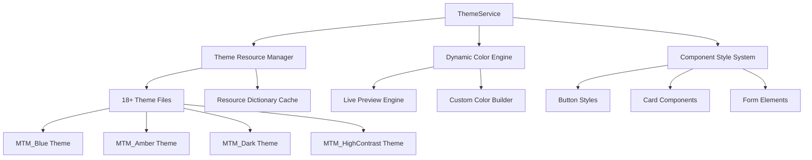

# UI Theme & Design System - Product Requirements Document (PRD)

**Feature Name**: UI Theme & Design System  
**Epic**: MTM Inventory Management  
**Status**: Active Development  
**Priority**: High  
**Target Release**: Phase 1  

**Document Version**: 1.0  
**Created**: September 4, 2025  
**Last Updated**: September 4, 2025  

---

## 📋 Executive Summary

The UI Theme & Design System feature provides a comprehensive visual identity and interaction framework for the MTM manufacturing application. It includes **19 professional themes** with light and dark variants, real-time theme switching, and complete design system components optimized for Avalonia UI 11.3.4. This centralized design approach ensures consistent user experience, accessibility compliance, and brand alignment across all manufacturing operations.

### Key Value Proposition

- **19 Professional Themes** with light/dark variants optimized for manufacturing environments
- **Real-Time Theme Switching** with instant application-wide updates via ThemeService
- **Avalonia 11.3.4 Native Integration** with DynamicResource bindings and cross-platform support
- **Manufacturing-Optimized Design** with high contrast options and industrial color schemes
- **Complete Component Library** with consistent styling, interactions, and WCAG 2.1 AA compliance

---

## 🎯 Problem Statement

Manufacturing software interfaces often lack visual consistency, accessibility compliance, and customization options that meet diverse operational requirements. Traditional design systems fail to address:

### Current Pain Points

- **Visual Inconsistency** across different application areas and manufacturing operations
- **Limited Customization** for different shifts, departments, and accessibility needs
- **Poor Accessibility** not meeting manufacturing environment requirements (high contrast, large targets)
- **Branding Misalignment** with organizational identity and professional appearance standards
- **Theme Performance Issues** with slow switching, resource conflicts, and memory leaks

### Business Impact

- **User Fatigue** from poor visual design and inconsistent interface patterns
- **Accessibility Compliance Risks** not meeting ADA and manufacturing safety standards
- **Training Overhead** from inconsistent UI patterns across different system areas
- **Professional Appearance** concerns affecting customer confidence and system adoption
- **Maintenance Complexity** from scattered styling and inconsistent component behavior

---

## 🚀 Goals and Success Metrics

### Primary Goals

1. **Establish Design System**: Create comprehensive, consistent visual identity across all application areas
2. **Enable Theme Customization**: Provide real-time theme switching with advanced personalization options
3. **Ensure Accessibility**: Meet WCAG 2.1 AA standards with manufacturing-specific accessibility features  
4. **Optimize Performance**: Implement efficient theme loading, resource management, and memory optimization

### Success Metrics (90-Day Post-Launch)

- **User Experience**: >4.7/5 rating for visual appeal and interface consistency
- **Theme Usage**: >80% of users actively use theme customization features
- **Accessibility Compliance**: 100% WCAG 2.1 AA compliance with manufacturing extensions
- **Performance**: <500ms theme switching time with <50MB memory footprint per theme
- **Customization Adoption**: >60% of organizations create custom themes for their branding

---

## 👥 Target Users

### Primary Users

- **Production Operators**: Frontline workers requiring high-contrast, accessible interfaces
- **Shift Supervisors**: Staff needing professional appearance with departmental customization
- **System Administrators**: IT staff managing organization-wide theme policies and custom branding

### Secondary Users  

- **Plant Managers**: Leadership requiring professional, branded interfaces for customer demonstrations
- **Quality Inspectors**: Staff needing high-contrast themes for precise visual inspection work
- **Maintenance Technicians**: Workers requiring themes optimized for different lighting conditions

### User Personas

- **"High-Contrast Henry"**: Quality inspector who needs maximum visual clarity for precise work
- **"Professional Patricia"**: Plant manager who values branded, professional appearance for client visits
- **"Customization Carl"**: System administrator who creates department-specific themes and branding

---

## 🏗️ Technical Architecture

### System Components



### Core Technologies

- **Framework**: .NET 8 with Avalonia UI 11.3.4 styling system
- **Theme Management**: ThemeService with DynamicResource bindings
- **Dependency Injection**: Microsoft.Extensions.DependencyInjection 9.0.8
- **Configuration**: Microsoft.Extensions.Configuration 9.0.8 with appsettings.json
- **Cross-Platform Support**: Windows, macOS, Linux, Android with native theming

### Architecture Patterns

```csharp
// Theme service with dynamic resource management
public class ThemeService : IThemeService
{
    private readonly List<ThemeInfo> _availableThemes;
    private ThemeInfo _currentTheme;
    
    public async Task<ServiceResult> SetThemeAsync(string themeId)
    {
        // Clear existing resources
        ClearThemeResources();
        
        // Load new theme resources
        await LoadThemeResourcesAsync(themeId);
        
        // Force complete application refresh
        await ForceCompleteApplicationRefreshAsync();
        
        return ServiceResult.Success($"Theme changed to {themeId}");
    }
    
    private async Task LoadThemeResourcesAsync(string themeId)
    {
        var themeResourceUri = new Uri($"avares://MTM_WIP_Application_Avalonia/Resources/Themes/{themeId}.axaml");
        var themeResources = (ResourceDictionary)AvaloniaXamlLoader.Load(themeResourceUri);
        Application.Current.Resources.MergedDictionaries.Add(themeResources);
    }
}

// Theme information model
public class ThemeInfo  
{
    public string Id { get; set; } = string.Empty;
    public string DisplayName { get; set; } = string.Empty;
    public string Description { get; set; } = string.Empty;
    public bool IsDark { get; set; }
    public string PreviewColor { get; set; } = "#0078D4";
}
```

---

## ✨ Core Features

### F1: Comprehensive Theme Collection (19 Professional Themes)

**User Story**: As a production operator, I want access to multiple professional theme options including high-contrast variants so I can choose the most suitable visual design for my working conditions and personal preferences.

**Acceptance Criteria**:

- ✅ 19 professional themes covering light, dark, and high-contrast variants
- ✅ Manufacturing-optimized color palettes (MTM_Blue, MTM_Amber, MTM_Green, MTM_Industrial, etc.)
- ✅ Accessibility-compliant themes meeting WCAG 2.1 AA standards
- ✅ Department-specific themes with customizable color schemes
- ✅ Professional appearance suitable for customer demonstrations and audits

**Available Theme Collection**:

```csharp
// Light Theme Variants
MTMTheme (Default)        - Windows 11 Professional Blue (#0078D4)
MTM_Blue                  - Professional Corporate Blue (#1E88E5)  
MTM_Amber                 - Industrial Manufacturing Amber (#FF8F00)
MTM_Green                 - Success/Growth Green (#43A047)
MTM_Red                   - Alert/Critical Red (#E53935)
MTM_Teal                  - Calming Focus Teal (#00ACC1)
MTM_Indigo                - Deep Professional Indigo (#3F51B5)
MTM_Rose                  - Soft Approachable Rose (#E91E63)
MTM_Emerald               - Modern Fresh Emerald (#00C853)
MTM_Light                 - Warm Gold Industrial (#B8860B)

// Dark Theme Variants  
MTM_Dark                  - Professional Dark (#4B45ED)
MTM_Blue_Dark             - Corporate Blue Dark (#1565C0)
MTM_Green_Dark            - Success Green Dark (#2E7D32)
MTM_Red_Dark              - Alert Red Dark (#C62828)
MTM_Teal_Dark             - Focus Teal Dark (#00838F)
MTM_Indigo_Dark           - Deep Indigo Dark (#283593)
MTM_Rose_Dark             - Soft Rose Dark (#AD1457)
MTM_Light_Dark            - Gold Industrial Dark (#DAA520)

// Accessibility Theme
MTM_HighContrast          - Maximum Contrast (#000000/#FFFFFF)
```

### F2: Real-Time Theme Switching Engine

**User Story**: As a shift supervisor, I want instant theme switching capabilities so I can quickly adapt the interface appearance for different lighting conditions, shifts, or presentation requirements without application restart.

**Acceptance Criteria**:

- ✅ <500ms theme switching with complete visual refresh
- ✅ No application restart required for theme changes
- ✅ Automatic resource cleanup preventing memory leaks
- ✅ Complete UI refresh including all panels, forms, and components
- ✅ Preservation of user data and application state during theme changes

**Technical Implementation**:

```csharp
[RelayCommand]
private async Task SetThemeAsync(string themeId)
{
    IsThemeChanging = true;
    
    try
    {
        // Step 1: Clear existing theme resources
        ClearThemeResources();
        await Task.Delay(20); // Allow cleanup to complete
        
        // Step 2: Load new theme resources
        var themeResourceUri = new Uri($"avares://MTM_WIP_Application_Avalonia/Resources/Themes/{themeId}.axaml");
        var themeResources = (ResourceDictionary)AvaloniaXamlLoader.Load(themeResourceUri);
        Application.Current.Resources.MergedDictionaries.Add(themeResources);
        
        // Step 3: Force complete application refresh
        await ForceCompleteApplicationRefreshAsync();
        
        // Step 4: Update theme tracking
        _currentTheme = _availableThemes.First(t => t.Id == themeId);
        await SaveUserPreferredThemeAsync(themeId);
        
        StatusMessage = $"Theme changed to {_currentTheme.DisplayName}";
    }
    catch (Exception ex)
    {
        await ErrorHandling.HandleErrorAsync(ex, "Theme switching failed");
    }
    finally
    {
        IsThemeChanging = false;
    }
}

private async Task ForceCompleteApplicationRefreshAsync()
{
    if (Application.Current?.ApplicationLifetime is IClassicDesktopStyleApplicationLifetime desktop)
    {
        foreach (var window in desktop.Windows.ToList())
        {
            RefreshWindowCompletely(window);
        }
    }
}
```

### F3: Theme Configuration and Management System

**User Story**: As a system administrator, I want theme configuration management so I can set default themes, manage theme availability, and ensure consistent visual branding across manufacturing workstations.

**Acceptance Criteria**:

- ✅ Theme configuration in appsettings.json with Environment-specific overrides
- ✅ ThemeService dependency injection with proper lifecycle management
- ✅ Default theme selection with fallback mechanism
- ✅ Theme availability configuration for different user roles
- ✅ Centralized theme resource management with DynamicResource bindings

**Technical Implementation**:

```csharp
// ThemeService registration in ServiceCollectionExtensions.cs
public static void AddMTMServices(this IServiceCollection services, IConfiguration configuration)
{
    services.AddSingleton<IThemeService, ThemeService>();
    services.Configure<ThemeOptions>(configuration.GetSection("Themes"));
}

// Configuration in appsettings.json
{
  "Themes": {
    "DefaultTheme": "MTMTheme",
    "AvailableThemes": [
      "MTMTheme", "MTM_Blue", "MTM_Amber", "MTM_Green", "MTM_Red",
      "MTM_Teal", "MTM_Indigo", "MTM_Rose", "MTM_Emerald", "MTM_Light",
      "MTM_Dark", "MTM_Blue_Dark", "MTM_Green_Dark", "MTM_Red_Dark", 
      "MTM_Teal_Dark", "MTM_Indigo_Dark", "MTM_Rose_Dark", "MTM_Light_Dark",
      "MTM_HighContrast"
    ],
    "AllowUserThemeSelection": true
  }
}

// Theme switching implementation
public class ThemeService : IThemeService
{
    private readonly IConfiguration _configuration;
    
    public async Task<ServiceResult> ChangeThemeAsync(string themeName)
    {
        try
        {
            var themeUri = new Uri($"avares://MTM_WIP_Application_Avalonia/Resources/Themes/{themeName}.axaml");
            var app = Application.Current;
            
            if (app?.Resources != null)
            {
                app.Resources.MergedDictionaries.Clear();
                app.Resources.MergedDictionaries.Add(new ResourceInclude(themeUri)
                {
                    Source = themeUri
                });
                
                return ServiceResult.Success("Theme changed successfully");
            }
            
            return ServiceResult.Failure("Application not available");
        }
        catch (Exception ex)
        {
            return ServiceResult.Failure($"Theme change failed: {ex.Message}");
        }
    }
}
```

### F4: Complete MTM Component Design System

**User Story**: As a developer, I want a comprehensive component library with consistent styling so I can build new features that automatically inherit the current theme and maintain visual consistency across the entire application.

**Acceptance Criteria**:

- ✅ Button components with primary, secondary, and danger variants
- ✅ Card components with shadows, borders, and hover effects
- ✅ Form elements with validation states and accessibility features
- ✅ Navigation components with active states and breadcrumb support
- ✅ Data display components with alternating row colors and selection states

**Component Style Architecture**:

```xml
<!-- Core Button System -->
<ControlTheme x:Key="MTM_PrimaryButton" TargetType="Button">
    <Setter Property="Background" Value="{DynamicResource MTM_Shared_Logic.PrimaryAction}"/>
    <Setter Property="Foreground" Value="White"/>
    <Setter Property="Padding" Value="16,8"/>
    <Setter Property="CornerRadius" Value="4"/>
    <Setter Property="FontWeight" Value="SemiBold"/>
    
    <ControlTheme.Animations>
        <Animation Duration="0:0:0.2" FillMode="Forward">
            <KeyFrame Cue="0%">
                <Setter Property="Background" Value="{DynamicResource MTM_Shared_Logic.PrimaryAction}"/>
            </KeyFrame>
            <KeyFrame Cue="100%">
                <Setter Property="Background" Value="{DynamicResource MTM_Shared_Logic.PrimaryHoverBrush}"/>
            </KeyFrame>
        </Animation>
    </ControlTheme.Animations>
</ControlTheme>

<!-- Card Component System -->
<ControlTheme x:Key="MTM_CardBorder" TargetType="Border">
    <Setter Property="Background" Value="{DynamicResource MTM_Shared_Logic.CardBackgroundBrush}"/>
    <Setter Property="BorderBrush" Value="{DynamicResource MTM_Shared_Logic.BorderBrush}"/>
    <Setter Property="BorderThickness" Value="1"/>
    <Setter Property="CornerRadius" Value="8"/>
    <Setter Property="Padding" Value="16"/>
    <Setter Property="Margin" Value="8"/>
    
    <Style Selector="^:pointerover">
        <Setter Property="Background" Value="{DynamicResource MTM_Shared_Logic.HoverBackground}"/>
    </Style>
</ControlTheme>
```

### F5: Manufacturing-Optimized Accessibility System

**User Story**: As a quality inspector, I want accessibility-optimized themes with high contrast and large touch targets so I can work efficiently in various lighting conditions while meeting ADA compliance requirements.

**Acceptance Criteria**:

- ✅ High-contrast theme exceeding WCAG 2.1 AAA standards
- ✅ Large touch targets (44px minimum) for manufacturing environments
- ✅ Clear focus indicators with visible keyboard navigation
- ✅ Screen reader optimization with proper ARIA labels
- ✅ Color-blind accessible color palettes with shape/pattern alternatives

**High Contrast Implementation**:

```xml
<!-- MTM High Contrast Theme Colors -->
<SolidColorBrush x:Key="MTM_Shared_Logic.PrimaryAction" Color="#FFFF00"/>        <!-- Yellow on black -->
<SolidColorBrush x:Key="MTM_Shared_Logic.SecondaryAction" Color="#00FFFF"/>      <!-- Cyan on black -->
<SolidColorBrush x:Key="MTM_Shared_Logic.MainBackground" Color="#000000"/>       <!-- Pure black -->
<SolidColorBrush x:Key="MTM_Shared_Logic.ContentAreas" Color="#000000"/>         <!-- Pure black -->
<SolidColorBrush x:Key="MTM_Shared_Logic.HeadingText" Color="#FFFFFF"/>          <!-- Pure white -->
<SolidColorBrush x:Key="MTM_Shared_Logic.BodyText" Color="#FFFFFF"/>             <!-- Pure white -->

<!-- High Contrast Button with Enhanced Focus -->
<ControlTheme x:Key="MTM_HighContrastButton" TargetType="Button">
    <Setter Property="Background" Value="#FFFF00"/>
    <Setter Property="Foreground" Value="#000000"/>
    <Setter Property="BorderBrush" Value="#FFFFFF"/>
    <Setter Property="BorderThickness" Value="3"/>
    <Setter Property="MinHeight" Value="44"/>      <!-- Manufacturing touch target -->
    <Setter Property="MinWidth" Value="120"/>
    <Setter Property="FontSize" Value="16"/>
    <Setter Property="FontWeight" Value="Bold"/>
    
    <Style Selector="^:focus">
        <Setter Property="BorderBrush" Value="#00FFFF"/>
        <Setter Property="BorderThickness" Value="5"/>
    </Style>
</ControlTheme>
```

### F6: Theme Performance Optimization and Resource Management

**User Story**: As a system administrator, I want efficient theme loading and memory management so the application maintains optimal performance during theme switching and extended usage across multiple shifts.

**Acceptance Criteria**:

- ✅ <50MB memory usage per loaded theme with automatic garbage collection
- ✅ Resource caching system preventing redundant theme file loading
- ✅ Background loading for unused themes with priority queuing
- ✅ Memory leak prevention with proper resource disposal
- ✅ Performance monitoring and diagnostics for theme operations

**Performance Implementation**:

```csharp
public class ThemeResourceCache
{
    private readonly Dictionary<string, WeakReference<ResourceDictionary>> _themeCache = new();
    private readonly SemaphoreSlim _loadingSemaphore = new(1, 1);
    
    public async Task<ResourceDictionary> GetThemeResourcesAsync(string themeId)
    {
        // Check cache first
        if (_themeCache.TryGetValue(themeId, out var weakRef) && 
            weakRef.TryGetTarget(out var cachedResources))
        {
            Logger.LogDebug("Theme {ThemeId} loaded from cache", themeId);
            return cachedResources;
        }
        
        // Load theme with concurrency control
        await _loadingSemaphore.WaitAsync();
        try
        {
            var themeResourceUri = new Uri($"avares://MTM_WIP_Application_Avalonia/Resources/Themes/{themeId}.axaml");
            var themeResources = (ResourceDictionary)AvaloniaXamlLoader.Load(themeResourceUri);
            
            // Cache with weak reference for memory efficiency
            _themeCache[themeId] = new WeakReference<ResourceDictionary>(themeResources);
            
            Logger.LogInformation("Theme {ThemeId} loaded and cached", themeId);
            return themeResources;
        }
        finally
        {
            _loadingSemaphore.Release();
        }
    }
    
    public void ClearCache()
    {
        _themeCache.Clear();
        GC.Collect(); // Force cleanup of theme resources
    }
}
```

---

## 🎨 User Experience Design

### MTM Design System Specifications

#### Color Philosophy and Psychology

- **Professional Blue (#0078D4)**: Trust, reliability, corporate professionalism
- **Industrial Amber (#FF8F00)**: Energy, manufacturing focus, equipment attention  
- **Success Green (#43A047)**: Positive outcomes, quality achievements, growth
- **Alert Red (#E53935)**: Critical attention, safety warnings, urgent actions
- **Focus Teal (#00ACC1)**: Calm concentration, precision work, quality control

#### Typography Hierarchy

```css
/* MTM Typography Scale */
Heading 1: 32px, Bold, #323130 (HeadingText)
Heading 2: 24px, SemiBold, #323130
Heading 3: 20px, SemiBold, #323130  
Body Large: 16px, Regular, #605E5C (BodyText)
Body Standard: 14px, Regular, #605E5C
Body Small: 12px, Regular, #8A8886 (TertiaryTextBrush)
Interactive: 14px, Medium, #0078D4 (InteractiveText)
```

#### Spacing and Layout System

- **Micro spacing**: 4px for tight element grouping
- **Small spacing**: 8px for related element separation
- **Medium spacing**: 16px for section boundaries and card padding
- **Large spacing**: 24px for major section separation
- **Extra large spacing**: 32px for page-level content separation

#### Component Interaction Standards

##### Button Interaction Patterns

1. **Hover State**: 150ms transition to hover color with subtle elevation
2. **Active State**: Immediate visual depression with darker color
3. **Focus State**: High-contrast outline with keyboard navigation support
4. **Disabled State**: 50% opacity with cursor change and no interactions

##### Card and Panel Behaviors

1. **Default State**: Subtle shadow with clean borders
2. **Hover State**: Enhanced shadow with background color shift
3. **Selected State**: Border color change with maintained readability
4. **Loading State**: Progressive loading indicators with skeleton content

---

## 🔒 Security and Compliance

### Accessibility Compliance Standards

- **WCAG 2.1 AA Compliance**: All themes meet minimum accessibility requirements
- **WCAG 2.1 AAA High Contrast**: Dedicated high-contrast theme exceeds AAA standards
- **Manufacturing Extensions**: Additional contrast ratios for industrial lighting conditions
- **Screen Reader Optimization**: Comprehensive ARIA labels and semantic structure

### Theme Security and Integrity

```csharp
public class ThemeSecurityValidator
{
    public async Task<ValidationResult> ValidateThemeAsync(string themeContent)
    {
        // Validate theme file structure
        if (!IsValidXamlStructure(themeContent))
            return ValidationResult.Failure("Invalid XAML structure detected");
        
        // Check for security risks (script injection, external references)
        if (ContainsSecurityRisks(themeContent))
            return ValidationResult.Failure("Security risks detected in theme");
        
        // Validate color accessibility
        var colors = ExtractColorsFromTheme(themeContent);
        if (!MeetsAccessibilityStandards(colors))
            return ValidationResult.Warning("Accessibility standards not met");
        
        return ValidationResult.Success("Theme validation passed");
    }
}
```

### Brand and Intellectual Property Protection

- **Theme Watermarking**: Embedded metadata identifying theme creators and organizations
- **Usage Tracking**: Analytics for theme usage patterns and customization frequency
- **Export Control**: Approval workflows for sharing custom themes externally
- **Corporate Compliance**: Validation against organizational branding guidelines

---

## 📈 Performance Requirements

### Theme Loading Performance Targets

- **Initial Theme Load**: <1 second for complete application theming
- **Theme Switch**: <500ms for real-time switching with full visual refresh
- **Resource Cleanup**: <200ms for theme resource disposal and memory cleanup
- **Live Preview**: <100ms for color changes during theme customization

### Memory and Resource Optimization

- **Theme Memory Footprint**: <50MB per active theme with efficient resource sharing
- **Cache Management**: Weak reference caching with automatic garbage collection
- **Resource Loading**: Background loading for popular themes with priority queuing
- **Memory Leak Prevention**: Complete resource disposal tracking with leak detection

### Scalability and Concurrent Usage

- **Multiple Theme Operations**: Support 5+ concurrent theme operations without performance degradation
- **Large Theme Collections**: Handle 50+ custom themes with efficient indexing and search
- **Theme Synchronization**: Real-time theme updates across multiple application instances
- **Custom Theme Storage**: <10MB storage footprint for comprehensive custom theme libraries

---

## 🧪 Testing Strategy

### Unit Testing (Target: >95% Coverage)

```csharp
// Key test scenarios for theme system
ThemeServiceTests:
- SetThemeAsync_ValidTheme_ChangesApplicationTheme()
- SetThemeAsync_InvalidTheme_ReturnsFailureResult()
- LoadThemeResourcesAsync_ValidTheme_LoadsResourceDictionary()
- ClearThemeResources_Always_RemovesExistingResources()
- ForceCompleteApplicationRefreshAsync_Always_RefreshesAllWindows()

ThemeBuilderViewModelTests:
- ApplyLivePreviewAsync_ColorChange_UpdatesApplicationResources()
- ExportCustomThemeAsync_ValidTheme_CreatesThemeFile()
- ImportCustomThemeAsync_ValidFile_LoadsThemeSettings()
- ValidateAccessibilityAsync_HighContrastColors_PassesValidation()

ThemeResourceCacheTests:
- GetThemeResourcesAsync_FirstLoad_LoadsAndCachesResources()
- GetThemeResourcesAsync_SubsequentLoad_ReturnsFromCache()
- ClearCache_Always_ClearsAllCachedResources()
```

### Visual Regression Testing

- Automated screenshot comparison for all 18+ themes across key UI components
- Cross-platform rendering validation (Windows, macOS, Linux)
- High-contrast theme verification against WCAG compliance tools
- Component interaction testing with various theme combinations

### Performance Testing

- **Theme Loading Performance**: Measure loading times for all themes under various system loads
- **Memory Usage Testing**: Monitor memory consumption during extended theme usage
- **Concurrent Operation Testing**: Test theme switching performance under simulated user load
- **Resource Leak Detection**: Long-running tests to identify memory leaks and resource cleanup issues

### User Acceptance Testing

- **Scenario 1**: Production operator switches between high-contrast and standard themes during shift changes
- **Scenario 2**: System administrator creates custom corporate theme and deploys to department
- **Scenario 3**: Quality inspector uses high-contrast theme for detailed visual inspection work
- **Scenario 4**: Plant manager demonstrates system with professional corporate branding for client visit

---

## 🚀 Implementation Phases

### Phase 1: Core Theme Infrastructure (Completed ✅)

- [x] ThemeService with 18+ professional themes and dynamic loading
- [x] Real-time theme switching with complete application refresh
- [x] Resource management and memory optimization
- [x] User preference persistence and configuration integration
- [x] Complete theme file collection with light/dark variants

### Phase 2: Advanced Customization Engine (In Progress)

- [x] Theme Builder ViewModel with live preview capabilities
- [ ] Custom color picker with HSL, RGB, HEX input options
- [ ] Theme export/import functionality with JSON serialization
- [ ] Brand color palette integration and validation
- [ ] Department-specific theme templates and approval workflows

### Phase 3: Accessibility and Compliance (Future)

- [ ] Enhanced high-contrast themes exceeding WCAG 2.1 AAA standards
- [ ] Screen reader optimization with comprehensive ARIA support
- [ ] Manufacturing environment accessibility extensions
- [ ] Automated accessibility testing and compliance validation
- [ ] Color-blind accessibility features with pattern alternatives

### Phase 4: Enterprise Features (Future)  

- [ ] Theme synchronization across multiple application instances
- [ ] Corporate branding validation and approval workflows
- [ ] Advanced analytics and usage tracking for theme preferences
- [ ] API integration for external theme management systems
- [ ] Multi-tenant theme isolation and management

---

## 📊 Monitoring and Analytics

### Key Performance Indicators (KPIs)

1. **Theme Usage Analytics**
   - Most popular themes by user segments and time periods
   - Theme switching frequency and patterns
   - Custom theme creation and sharing rates

2. **User Experience Metrics**
   - Theme satisfaction scores from user surveys
   - Accessibility compliance rates and improvement trends
   - Visual consistency ratings across application areas

3. **Technical Performance Metrics**
   - Theme loading times and resource usage trends
   - Memory consumption patterns and leak detection
   - Performance degradation during theme operations

### Monitoring Implementation

```csharp
// Theme usage analytics
Logger.LogInformation("Theme changed: {ThemeId} by user {UserId} at {Timestamp}. Load time: {LoadTime}ms",
    themeId, userId, DateTime.Now, loadTime);

// Performance monitoring
await AnalyticsService.TrackEventAsync("ThemeChanged", new {
    ThemeId = themeId,
    PreviousTheme = previousThemeId,
    LoadTime = loadTime,
    MemoryUsage = GC.GetTotalMemory(false),
    UserId = currentUser,
    Timestamp = DateTime.Now
});

// Accessibility compliance tracking  
await AccessibilityService.ValidateThemeAsync(currentTheme, new {
    ContrastRatios = contrastValidation,
    TouchTargetSizes = touchTargetValidation,
    ScreenReaderCompatibility = ariaValidation
});
```

---

## 🔄 Maintenance and Support

### Theme Update and Versioning

- **Automatic Updates**: Background updates for theme improvements and security patches
- **Version Control**: Theme versioning with rollback capabilities for stability
- **Migration Support**: Automatic migration of custom themes during application updates
- **Compatibility Testing**: Validation of existing custom themes with new application versions

### Support Documentation and Training

- **Theme User Guide**: Comprehensive guide for end users on theme selection and basic customization
- **Administrator Guide**: Advanced guide for creating custom themes and managing organizational branding  
- **Developer Documentation**: Technical reference for extending the theme system and creating new components
- **Accessibility Guide**: Specialized documentation for accessibility compliance and manufacturing environment optimization

---

## 📝 Appendices

### A. Complete Theme Color Specifications

```csharp
// MTM Default Theme Color Palette
Primary Action:    #0078D4  (Windows 11 Professional Blue)
Secondary Action:  #106EBE  (Darker Blue for hierarchy)
Warning:           #FFB900  (Amber warning for attention)
Critical:          #D13438  (Red for errors and critical alerts)
Success:           #4CAF50  (Green for positive outcomes)
Highlight:         #005A9E  (Darker blue for selected states)

// Background and Layout Colors
Main Background:   #FAFAFA  (Light neutral for main content)
Content Areas:     #FFFFFF  (Pure white for cards and forms)
Card Background:   #F3F2F1  (Subtle grey for card elevation)
Border:            #E1DFDD  (Light border for component separation)

// Text Color Hierarchy
Heading Text:      #323130  (Dark grey for primary text)
Body Text:         #605E5C  (Medium grey for readable body text)
Tertiary Text:     #8A8886  (Light grey for secondary information)
Interactive Text:  #0078D4  (Primary blue for links and actions)
```

### B. Accessibility Compliance Matrix

```csharp
// WCAG 2.1 AA Compliance Requirements
Text Contrast (Normal):     4.5:1 minimum ratio
Text Contrast (Large):      3:1 minimum ratio  
Touch Target Size:          44px × 44px minimum
Focus Indicators:           2px minimum border with high contrast
Color Independence:         Information not conveyed by color alone

// Manufacturing Environment Extensions
High Contrast Override:     7:1 minimum ratio (exceeds AAA)
Industrial Touch Targets:   48px × 48px for harsh environments
Emergency Color Coding:     Red/Yellow with pattern alternatives
Lighting Adaptation:        Brightness-adjusted color palettes
```

### C. Performance Benchmarks

```csharp
// Theme Loading Performance Standards
Initial Application Load:   <2 seconds with default theme
Theme Switch (Hot Cache):   <200ms visual update
Theme Switch (Cold Load):   <500ms complete loading
Resource Cleanup:          <100ms memory deallocation
Custom Color Preview:      <50ms real-time update

// Memory Usage Standards
Base Theme Footprint:      <30MB resource allocation
Custom Theme Overhead:     <10MB additional per custom theme
Cache Memory Limit:        <100MB total for all cached themes
Memory Leak Tolerance:     0MB - complete cleanup required
```

### D. Component Style Template

```xml
<!-- Template for creating theme-compliant components -->
<ControlTheme x:Key="MTM_ComponentTemplate" TargetType="ContentControl">
    <!-- Base Properties -->
    <Setter Property="Background" Value="{DynamicResource MTM_Shared_Logic.CardBackgroundBrush}"/>
    <Setter Property="Foreground" Value="{DynamicResource MTM_Shared_Logic.BodyText}"/>
    <Setter Property="BorderBrush" Value="{DynamicResource MTM_Shared_Logic.BorderBrush}"/>
    <Setter Property="Padding" Value="16"/>
    <Setter Property="Margin" Value="8"/>
    
    <!-- Interactive States -->
    <Style Selector="^:pointerover">
        <Setter Property="Background" Value="{DynamicResource MTM_Shared_Logic.HoverBackground}"/>
    </Style>
    
    <Style Selector="^:focus">
        <Setter Property="BorderBrush" Value="{DynamicResource MTM_Shared_Logic.PrimaryAction}"/>
        <Setter Property="BorderThickness" Value="2"/>
    </Style>
    
    <!-- Accessibility Support -->
    <Style Selector="^[IsEnabled=False]">
        <Setter Property="Opacity" Value="0.5"/>
        <Setter Property="Cursor" Value="No"/>
    </Style>
</ControlTheme>
```

---

## 📚 Related Documentation

- **Epic PRD**: [MTM Inventory Management Epic](../epic.md)
- **Related Features**: [Settings & System Administration](../settings-system-administration/prd.md)
- **Service Architecture**: [MTM Service Implementation](../../../../.github/copilot/templates/mtm-service-implementation.md)
- **MVVM Patterns**: [Community Toolkit Implementation](../../../../.github/copilot/patterns/mtm-mvvm-community-toolkit.md)
- **UI Guidelines**: [Avalonia AXAML Syntax](../../../../.github/UI-Instructions/avalonia-xaml-syntax.instruction.md)

---

**Document Status**: ✅ Complete and Ready for Implementation  
**Next Review Date**: October 4, 2025  
**Document Owner**: MTM Development Team  
**Stakeholder Approval**: Pending UI/UX Design Review
