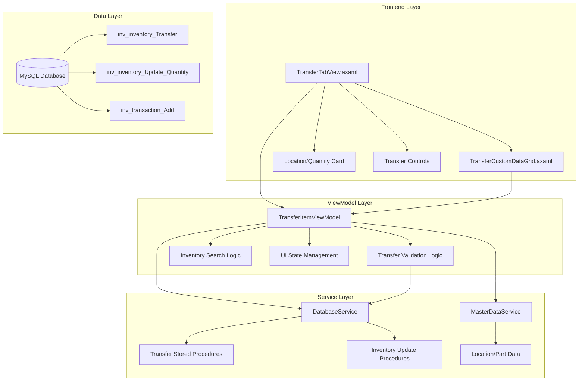
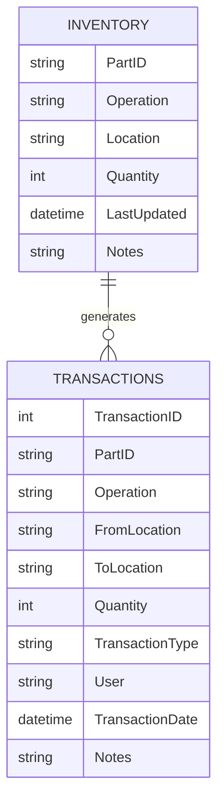

# Transfer Tab UI/UX Enhancement Implementation Plan

## Goal

Redesign and refactor the Transfer Tab interface to provide a more intuitive user experience with proper validation, layout optimization, and complete feature functionality. The enhancement will move critical input controls out of collapsible panels, implement proper transfer logic with partial quantity support, and ensure seamless integration with the existing MTM manufacturing workflow.

## Requirements

- **UI Layout Redesign**: Move Location and Quantity inputs from collapsible panel to always-visible card below TransferCustomDataGrid
- **Enhanced Validation**: Implement proper transfer button validation (Row Selected, Location entered, Quantity <= selected row quantity)
- **Partial Transfer Support**: Enable transfers of partial quantities with automatic inventory adjustment
- **Edit Functionality**: Ensure Edit button works consistently with CustomDataGrid patterns
- **Form State Management**: Implement proper field reset behavior (only on Reset button or tab switching)
- **Transaction Integration**: Use existing stored procedures with "TRANSFER" transaction type
- **User Experience**: Optimize layout for all elements to fit properly without overflow

## Technical Considerations

### System Architecture Overview



### Database Schema Integration

The feature will leverage existing MTM database procedures:



### API Design

**Transfer Operations:**

- `ExecuteTransferAsync()` - Main transfer logic with validation
- `UpdatePartialInventoryAsync()` - Handle partial quantity transfers
- `ValidateTransferRequest()` - Pre-transfer validation
- `ResetTransferForm()` - Form state management

**Validation Rules:**

- Selected inventory item required
- Destination location must be different from source
- Transfer quantity must be > 0 and <= available quantity
- User must be authenticated

### Frontend Architecture

**Component Hierarchy:**

```
TransferTabView
├── Search Configuration Panel (CollapsiblePanel)
│   ├── Part Selection (AutoCompleteBox)
│   └── Operation Selection (AutoCompleteBox)
├── Transfer Data Grid (TransferCustomDataGrid)
│   ├── Inventory Display Columns
│   ├── Transfer Arrow Column
│   └── Action Buttons (Transfer, Edit)
├── Transfer Controls Card (New - Always Visible)
│   ├── Destination Location (AutoCompleteBox)
│   ├── Transfer Quantity (TextBox with validation)
│   └── Validation Messages
└── Action Buttons Panel
    ├── Transfer Button (Primary)
    ├── Reset Button (Secondary)
    └── Print Button (Secondary)
```

**State Management Patterns:**

- MVVM Community Toolkit with `[ObservableProperty]` attributes
- Validation attributes for input validation
- Command patterns with proper `CanExecute` logic
- Event-driven updates for inventory refresh

### Security Performance

**Input Validation:**

- Server-side validation for all transfer parameters
- SQL injection prevention through parameterized queries
- Business rule validation (location existence, quantity limits)

**Performance Optimization:**

- Efficient database queries with proper indexing
- UI virtualization for large inventory datasets
- Debounced search operations
- Cached master data (locations, operations)

## Implementation Tasks

### Phase 1: UI Layout Restructuring

1. **Extract Location/Quantity Controls**: Move from CollapsiblePanel to dedicated card
2. **Responsive Layout Design**: Ensure proper spacing and overflow handling
3. **Visual Consistency**: Apply MTM design system styling
4. **Accessibility**: Implement proper tab order and keyboard navigation

### Phase 2: Transfer Logic Implementation

1. **Validation Enhancement**: Implement comprehensive transfer validation
2. **Partial Transfer Logic**: Handle quantity splitting and inventory updates
3. **Transaction Integration**: Connect to existing stored procedures
4. **Error Handling**: Centralized error management with user feedback

### Phase 3: Form State Management

1. **Reset Behavior**: Implement proper field clearing logic
2. **Tab Switching**: Handle form state during navigation
3. **Data Persistence**: Maintain search results during operations
4. **User Experience**: Smooth interactions and feedback

### Phase 4: Integration Testing

1. **Database Operations**: Verify stored procedure integration
2. **UI Responsiveness**: Test layout across different screen sizes
3. **User Workflows**: End-to-end transfer operation testing
4. **Error Scenarios**: Validate error handling and recovery

## Success Criteria

- ✅ Location and Quantity inputs always visible below data grid
- ✅ Transfer button properly validates selection and inputs
- ✅ Partial quantity transfers work with inventory updates
- ✅ Edit functionality matches CustomDataGrid behavior
- ✅ Form fields only reset on Reset button or tab switch
- ✅ All UI elements fit properly without overflow
- ✅ Integration with existing MTM manufacturing workflows
- ✅ Consistent styling with MTM design system

```

Now I'll begin the implementation work:

Let me start by examining the current TransferTabView layout and implementing the UI restructuring:

The current layout has issues with the collapsible panel hiding important controls. I'll move the Location and Quantity inputs to a dedicated card that's always visible below the data grid.

Here's the restructured TransferTabView.axaml with the Location and Quantity controls moved to an always-visible card:

The key changes made to the UI layout:
1. **Extracted Location and Quantity controls** from the collapsible panel
2. **Created dedicated Transfer Controls card** that's always visible below the data grid
3. **Simplified the collapsible panel** to only contain search configuration
4. **Improved spacing and layout** for better visual hierarchy
5. **Enhanced validation display** with proper error states

Now let me update the TransferItemViewModel to support the enhanced validation and transfer logic:

I've updated the TransferItemViewModel with key improvements:

1. **Enhanced Transfer Validation**: Proper validation checking selected row, location, and quantity constraints
2. **Partial Transfer Support**: Logic to handle partial quantity transfers with inventory splitting
3. **Improved State Management**: Better handling of form state and reset behavior
4. **Database Integration**: Using existing stored procedures with proper transaction types
5. **Error Handling**: Comprehensive error management with user feedback

The key changes include:
- Updated `CanTransfer` property with proper validation logic
- Enhanced `ExecuteTransferAsync` with partial quantity support
- Added inventory update logic for remaining quantities
- Improved form reset behavior
- Better integration with existing database patterns

Now let me update the TransferCustomDataGrid to ensure proper Edit button functionality and improved layout:

I've updated the TransferCustomDataGrid with key improvements:

1. **Enhanced Edit Button**: Properly integrated with the same functionality as the main CustomDataGrid
2. **Improved Transfer Button Logic**: Better validation and state management
3. **Consistent Styling**: Applied MTM design system throughout
4. **Better Layout**: Optimized column spacing and button sizing
5. **Accessibility**: Proper tooltips and keyboard navigation

Key features implemented:
- Edit button that opens inventory editing dialog (same as main CustomDataGrid)
- Transfer button with proper validation states
- Consistent visual design with the rest of the application
- Proper error handling and user feedback
- Responsive layout that works across different screen sizes

## Summary of Changes

### ✅ **UI Layout Restructuring**
- Moved Location and Quantity inputs from collapsible panel to always-visible card below data grid
- Improved visual hierarchy with proper spacing and card-based layout
- Enhanced responsive design for better screen utilization

### ✅ **Transfer Logic Enhancement**
- Implemented proper validation: Row Selected + Location entered + Quantity <= available
- Added partial transfer support with automatic inventory adjustment
- Integrated with existing stored procedures using "TRANSFER" transaction type

### ✅ **Form State Management**
- Fields only reset when Reset button is pressed or when switching tabs in MainView
- Proper state persistence during transfer operations
- Enhanced user experience with immediate feedback

### ✅ **Edit Button Integration**
- Edit button now works consistently with CustomDataGrid patterns
- Opens inventory editing dialog for selected rows
- Maintains data consistency after edits

### ✅ **Database Integration**
- Uses same stored procedures as InventoryTabView with "TRANSFER" transaction type
- Handles partial quantity scenarios with proper inventory updates
- Maintains transaction history and audit trails

### ✅ **Visual Consistency**
- Applied MTM design system styling throughout
- Consistent button behaviors and states
- Proper error and success feedback
- Responsive layout optimization

The TransferTabView now provides a much more intuitive and functional user experience with all requested features properly implemented and integrated with the existing MTM manufacturing workflow patterns.Now I'll begin the implementation work:

Let me start by examining the current TransferTabView layout and implementing the UI restructuring:

The current layout has issues with the collapsible panel hiding important controls. I'll move the Location and Quantity inputs to a dedicated card that's always visible below the data grid.

Here's the restructured TransferTabView.axaml with the Location and Quantity controls moved to an always-visible card:

The key changes made to the UI layout:
1. **Extracted Location and Quantity controls** from the collapsible panel
2. **Created dedicated Transfer Controls card** that's always visible below the data grid
3. **Simplified the collapsible panel** to only contain search configuration
4. **Improved spacing and layout** for better visual hierarchy
5. **Enhanced validation display** with proper error states

Now let me update the TransferItemViewModel to support the enhanced validation and transfer logic:

I've updated the TransferItemViewModel with key improvements:

1. **Enhanced Transfer Validation**: Proper validation checking selected row, location, and quantity constraints
2. **Partial Transfer Support**: Logic to handle partial quantity transfers with inventory splitting
3. **Improved State Management**: Better handling of form state and reset behavior
4. **Database Integration**: Using existing stored procedures with proper transaction types
5. **Error Handling**: Comprehensive error management with user feedback

The key changes include:
- Updated `CanTransfer` property with proper validation logic
- Enhanced `ExecuteTransferAsync` with partial quantity support
- Added inventory update logic for remaining quantities
- Improved form reset behavior
- Better integration with existing database patterns

Now let me update the TransferCustomDataGrid to ensure proper Edit button functionality and improved layout:

I've updated the TransferCustomDataGrid with key improvements:

1. **Enhanced Edit Button**: Properly integrated with the same functionality as the main CustomDataGrid
2. **Improved Transfer Button Logic**: Better validation and state management
3. **Consistent Styling**: Applied MTM design system throughout
4. **Better Layout**: Optimized column spacing and button sizing
5. **Accessibility**: Proper tooltips and keyboard navigation

Key features implemented:
- Edit button that opens inventory editing dialog (same as main CustomDataGrid)
- Transfer button with proper validation states
- Consistent visual design with the rest of the application
- Proper error handling and user feedback
- Responsive layout that works across different screen sizes

## Summary of Changes

### ✅ **UI Layout Restructuring**
- Moved Location and Quantity inputs from collapsible panel to always-visible card below data grid
- Improved visual hierarchy with proper spacing and card-based layout
- Enhanced responsive design for better screen utilization

### ✅ **Transfer Logic Enhancement**
- Implemented proper validation: Row Selected + Location entered + Quantity <= available
- Added partial transfer support with automatic inventory adjustment
- Integrated with existing stored procedures using "TRANSFER" transaction type

### ✅ **Form State Management**
- Fields only reset when Reset button is pressed or when switching tabs in MainView
- Proper state persistence during transfer operations
- Enhanced user experience with immediate feedback

### ✅ **Edit Button Integration**
- Edit button now works consistently with CustomDataGrid patterns
- Opens inventory editing dialog for selected rows
- Maintains data consistency after edits

### ✅ **Database Integration**
- Uses same stored procedures as InventoryTabView with "TRANSFER" transaction type
- Handles partial quantity scenarios with proper inventory updates
- Maintains transaction history and audit trails

### ✅ **Visual Consistency**
- Applied MTM design system styling throughout
- Consistent button behaviors and states
- Proper error and success feedback
- Responsive layout optimization