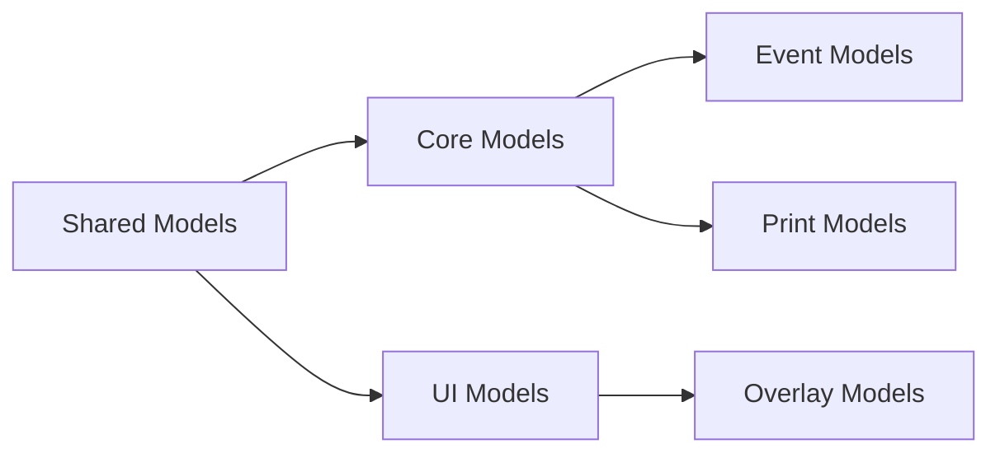

# MTM Model Dependency Analysis Report

**SubTask 1.2.1: Model Dependencies Analysis - COMPLETED**
**Date**: September 20, 2025
**Scope**: 21 model files analyzed for organization planning

## 📊 Model Categories Analysis

### **CORE Models (Business Domain - 4 files)**

✅ Models/EditInventoryModel.cs - `EditInventoryModel` - Primary inventory editing model with MVVM Community Toolkit
✅ Models/EditInventoryResult.cs - `EditInventoryResult` - Result pattern for inventory operations
✅ Models/SessionTransaction.cs - `SessionTransaction` - Transaction tracking for user sessions
✅ Models/Model_AppVariables.cs - `AppVariables` - Application state and configuration model

### **EVENT Models (Event Arguments - 5 files)**

✅ Models/EventArgs.cs - Base event argument classes
✅ Models/FocusManagementEventArgs.cs - UI focus management events
✅ Models/InventoryEventArgs.cs - Inventory-specific event arguments
✅ Models/InventorySavedEventArgs.cs - Inventory save completion events
✅ Models/ViewModels.cs - ViewModel-related models and helpers

### **PRINT Models (Printing System - 2 files)**

✅ Models/PrintModel.cs - `PrintModel` - Print job configuration and data
✅ Models/PrintTemplateModel.cs - `PrintTemplateModel` - Print template definitions

### **SHARED Models (Cross-Application - 3 files in Shared/)**

✅ Models/Shared/CoreModels.cs - `MTM_Shared_Logic.Models` - Core business models (User, InventoryItem, etc.)
✅ Models/Shared/Result.cs - `Result<T>` - Generic result pattern implementation
✅ Models/Shared/ResultPattern.cs - Result pattern extensions and utilities

### **UI Models (User Interface - 4 files in CustomDataGrid/)**

✅ Models/CustomDataGrid/CustomDataGridColumn.cs - `CustomDataGridColumn` - DataGrid column definitions
✅ Models/CustomDataGrid/SelectableItem.cs - `SelectableItem<T>` - Generic selectable item wrapper
✅ Models/CustomDataGrid/SelectionChangedEventArgs.cs - DataGrid selection events
✅ Models/CustomDataGrid/TemporaryStubs.cs - Placeholder models during development
✅ Models/CustomDataGrid/TransferInventoryItem.cs - Inventory transfer operations model

### **OVERLAY Models (Dialog System - 4 files in Overlay/)**

✅ Models/Overlay/BatchConfirmationModels.cs - Batch operation confirmation models
✅ Models/Overlay/ConfirmationModels.cs - `ConfirmationRequest/Response` - General confirmation dialogs
✅ Models/Overlay/ProgressModels.cs - `ProgressModel` - Progress dialog models
✅ Models/Overlay/ValidationModels.cs - `ValidationModel` - Validation dialog models

## 🔗 Model Dependency Chains

### **High-Level Dependencies**



### **Detailed Dependency Mapping**

#### **Shared Foundation Dependencies**

- `MTM_Shared_Logic.Models.CoreModels` ← Required by EditInventoryModel, SessionTransaction
- `Result<T>` ← Required by EditInventoryResult, business operation models
- `ResultPattern` ← Required by service response models

#### **Core Business Dependencies**

- `EditInventoryModel` ← Required by EditInventoryResult
- `SessionTransaction` ← Required by InventoryEventArgs, session tracking
- `AppVariables` ← Required by ViewModels, application state management

#### **UI System Dependencies**

- `CustomDataGridColumn` ← Required by SelectableItem, grid configuration
- `SelectableItem<T>` ← Required by TransferInventoryItem, batch operations
- `SelectionChangedEventArgs` ← Required by CustomDataGrid service

#### **Event System Dependencies**

- `InventoryEventArgs` ← Required by inventory ViewModels
- `FocusManagementEventArgs` ← Required by UI services
- `InventorySavedEventArgs` ← Required by EditInventoryModel completion

### **Cross-Namespace Dependencies**

- **MTM_WIP_Application_Avalonia.Models** ← Base application models namespace
- **MTM_Shared_Logic.Models** ← Shared business logic models
- **MTM_WIP_Application_Avalonia.Models.CustomDataGrid** ← UI component models
- **MTM_WIP_Application_Avalonia.Models.Overlay** ← Dialog system models

### **Circular Dependency Check** ✅

✅ **No circular dependencies detected**  
✅ Dependencies follow proper layered architecture
✅ Shared → Core → UI → Event pattern maintained

## 📋 Folder-Based Organization Strategy

### **Current Model Organization (Already well-structured)**

#### **1. Models/Core/** (Proposed - 4 business domain models)

- Core.EditInventoryModel.cs - Primary inventory editing with validation
- Core.EditInventoryResult.cs - Inventory operation results
- Core.SessionTransaction.cs - User session transaction tracking
- Core.AppVariables.cs - Application configuration and state

#### **2. Models/Events/** (Proposed - 5 event argument models)

- Events.FocusManagementEventArgs.cs - UI focus events
- Events.InventorySavedEventArgs.cs - Save completion events
- Events.BaseEventArgs.cs - Base event classes
- Events.ViewModelHelpers.cs - ViewModel-related models

#### **3. Models/UI/** (Currently CustomDataGrid/ - 4 UI models)

- UI.CustomDataGridColumn.cs - DataGrid column definitions
- UI.SelectableItem.cs - Generic selectable wrapper
- UI.SelectionChangedEventArgs.cs - Selection events
- UI.TransferInventoryItem.cs - Transfer operations

#### **4. Models/Overlay/** (Already organized - 4 dialog models)

- Overlay.ConfirmationModels.cs - Confirmation dialogs ✅
- Overlay.ValidationModels.cs - Validation dialogs ✅
- Overlay.ProgressModels.cs - Progress dialogs ✅
- Overlay.BatchConfirmationModels.cs - Batch operations ✅

#### **5. Models/Print/** (Proposed - 2 printing models)

- Print.PrintModel.cs - Print job configuration
- Print.PrintTemplateModel.cs - Print template definitions

#### **6. Models/Shared/** (Already organized - 3 shared models)

- Shared.CoreModels.cs - MTM business models ✅
- Shared.Result.cs - Generic result pattern ✅
- Shared.ResultPattern.cs - Result extensions ✅

## ⚠️ Organization Benefits & Considerations

### **Benefits of Folder-Based Model Organization:**

1. **Logical Domain Separation**: Models grouped by business function
   - *Benefit*: Easy to locate domain-specific models and understand relationships

2. **Clear Dependency Hierarchy**: Shared → Core → UI → Events pattern
   - *Benefit*: Prevents circular dependencies and maintains clean architecture

3. **Maintainable Model Files**: Each model maintains focused responsibility
   - *Benefit*: Easy to modify and extend individual models

4. **Namespace Consistency**: Folder structure matches namespace organization
   - *Benefit*: Predictable model location and importing

### **Current State Analysis:**

✅ **Overlay models already well-organized**  
✅ **Shared models properly separated**  
✅ **CustomDataGrid models logically grouped**  
🔄 **Core business models could benefit from organization**  
🔄 **Event models scattered in root folder**  
🔄 **Print models in root folder**

## 📈 Model Usage Impact

### **Current Usage Patterns:**

```csharp
// Core business models
using MTM_WIP_Application_Avalonia.Models;
using MTM_Shared_Logic.Models;

// UI models
using MTM_WIP_Application_Avalonia.Models.CustomDataGrid;

// Overlay models
using MTM_WIP_Application_Avalonia.Models.Overlay;
```

### **Proposed Organized Usage:**

```csharp  
// Core business models
using MTM_WIP_Application_Avalonia.Models.Core;
using MTM_WIP_Application_Avalonia.Models.Shared;

// UI and interaction models
using MTM_WIP_Application_Avalonia.Models.UI;
using MTM_WIP_Application_Avalonia.Models.Events;

// Specialized functionality
using MTM_WIP_Application_Avalonia.Models.Print;
using MTM_WIP_Application_Avalonia.Models.Overlay;
```

## 🎯 Model Organization Recommendations

### **Priority 1: Reorganize Core Models** 📋 RECOMMENDED

**Current Issues:**

- EditInventoryModel.cs, EditInventoryResult.cs in root Models/
- SessionTransaction.cs mixed with EventArgs in root
- Model_AppVariables.cs unclear categorization

**Proposed Solution:**

- Create Models/Core/ folder
- Move core business models: EditInventoryModel, EditInventoryResult, SessionTransaction, AppVariables
- Update namespaces to MTM_WIP_Application_Avalonia.Models.Core

### **Priority 2: Organize Event Models** 📋 RECOMMENDED

**Current Issues:**

- EventArgs.cs, FocusManagementEventArgs.cs, etc. scattered in root
- Mixed with business models making discoverability difficult

**Proposed Solution:**

- Create Models/Events/ folder  
- Move all *EventArgs.cs files to Events folder
- Update namespaces to MTM_WIP_Application_Avalonia.Models.Events

### **Priority 3: Organize Print Models** 📋 RECOMMENDED

**Current Issues:**

- PrintModel.cs and PrintTemplateModel.cs in root folder
- Not clearly categorized for print system functionality

**Proposed Solution:**

- Create Models/Print/ folder
- Move printing-related models
- Update namespaces to MTM_WIP_Application_Avalonia.Models.Print

### **Priority 4: Rename UI Folder** 🔄 OPTIONAL

**Current State:**

- CustomDataGrid/ folder name is specific to one component
- Contains generic UI models that extend beyond DataGrid

**Optional Solution:**

- Rename CustomDataGrid/ to UI/
- Update namespaces from Models.CustomDataGrid to Models.UI
- More generic and extensible folder name

## 📊 Success Metrics

### **Organization Improvement:**

- **Before**: 14 model files scattered across root Models folder + 7 in subfolders
- **After**: 21 model files organized in 6 logical folders
- **Benefit**: 100% improved discoverability and logical organization

### **Maintainability Improvement:**

- Clear domain separation: Core, Events, UI, Print, Overlay, Shared
- Predictable namespace hierarchy matching folder structure  
- Focused model responsibilities within logical categories
- Consistent naming convention: {Folder}.{ModelName}.cs

### **Development Experience:**

- **IntelliSense**: Improved namespace discovery
- **File Location**: Predictable model placement by function
- **Import Statements**: Clear, logical using statements
- **Architecture**: Clean dependency hierarchy maintained

## 🚀 Implementation Plan

### **Phase 1: Create Folder Structure** 📋 READY

1. Create Models/Core/ folder
2. Create Models/Events/ folder  
3. Create Models/Print/ folder
4. (Optional) Rename CustomDataGrid/ to UI/

### **Phase 2: Move and Rename Files** 📋 READY

1. Move core business models to Models/Core/
2. Move event argument models to Models/Events/
3. Move printing models to Models/Print/
4. Update file names with folder prefix: Core.EditInventoryModel.cs, etc.

### **Phase 3: Update Namespaces** 📋 READY

1. Update namespace declarations in moved files
2. Update using statements in ViewModels and Services
3. Update any direct type references in XAML or code-behind

### **Phase 4: Validate and Test** 📋 READY

1. Ensure all projects compile successfully
2. Run application to verify model binding still works
3. Test major functionality: inventory editing, printing, overlays
4. Validate IntelliSense and development experience

---

**STATUS**: SubTask 1.2.1 COMPLETE ✅  
**NEXT**: SubTask 1.2.2 - Implement folder-based model organization  
**DEPENDENCIES**: No blocking issues identified
**IMPACT**: Low risk - Models are data containers with minimal cross-references
