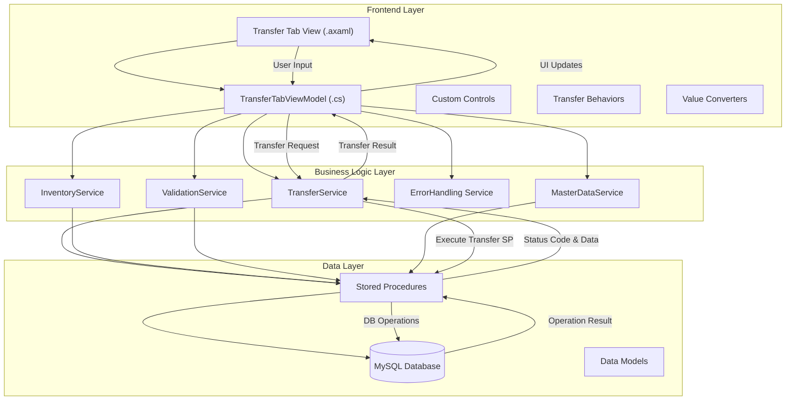
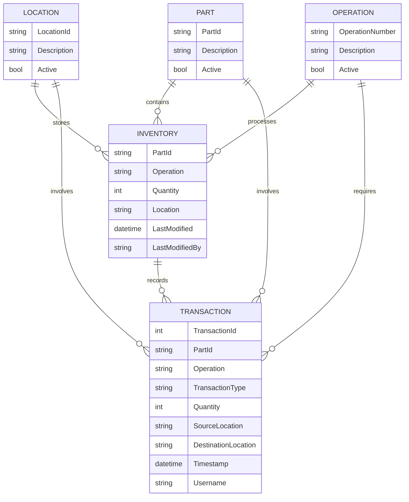
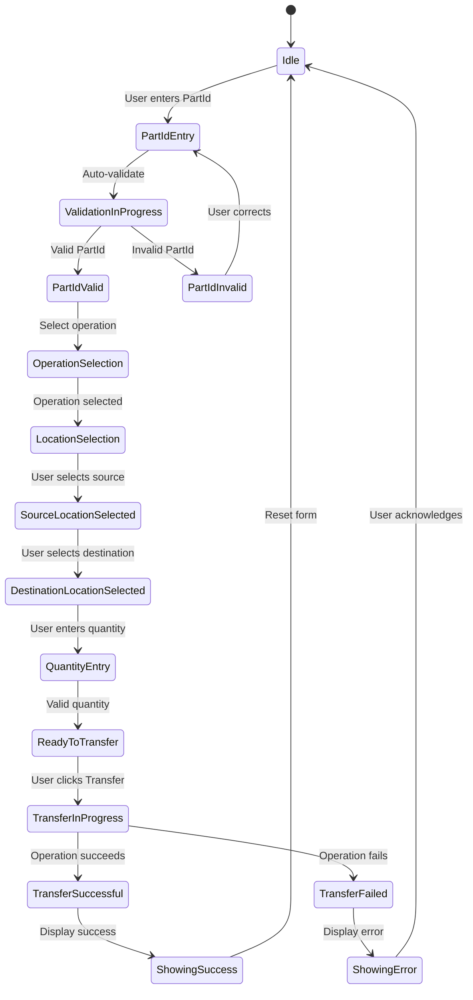

# Transfer Tab Implementation Plan

## Goal

Implement a comprehensive Transfer Tab feature within the MTM WIP Application to enable efficient and error-resistant inventory transfer operations between locations. This feature will streamline material movement tracking, maintain inventory accuracy, and support manufacturing workflow operations with complete transaction history and validation.

## Requirements

- Create a new Transfer Tab view integrated into the main application interface
- Implement inventory transfer functionality between manufacturing locations
- Support barcode scanning for part identification
- Validate source and destination locations based on business rules
- Track all transfer transactions with timestamps and user information
- Support both single-item and batch transfer operations
- Integrate with existing database stored procedures for inventory management
- Maintain consistent UI/UX patterns with the rest of the application
- Provide clear error handling and user feedback for failed operations
- Ensure all operations follow the established MVVM pattern using CommunityToolkit.Mvvm

## Technical Considerations

### System Architecture Overview



#### Technology Stack Selection

- **UI Framework**: Avalonia UI 11.3.4 - Selected for cross-platform capabilities and XAML-based development approach that aligns with existing application architecture
- **MVVM Framework**: MVVM Community Toolkit 8.3.2 - Provides source generators for observable properties and relay commands, maintaining the established pattern
- **Database Access**: MySQL 9.4.0 with stored procedure execution via `Helper_Database_StoredProcedure` - Ensures consistent database interaction patterns
- **Dependency Injection**: Microsoft.Extensions.DependencyInjection 9.0.8 - Maintains application's service registration and lifecycle management
- **Logging**: Microsoft.Extensions.Logging 9.0.8 - Consistent with application's existing logging framework

#### Integration Points

- **MainWindow Integration**: The Transfer Tab will be integrated into the existing tab control in the MainWindow
- **Service Integration**: New TransferService will integrate with existing InventoryService and MasterDataService
- **Database Integration**: Utilizes existing stored procedures for inventory management with potential new procedures for transfer-specific operations
- **Error Handling**: Integrates with centralized error handling via Services.ErrorHandling.HandleErrorAsync()

#### Deployment Architecture

- The feature follows the application's existing deployment model:
  - Windows: Self-contained executable deployment
  - macOS: App bundle with native integration
  - Linux: Executable with Linux compatibility
  - Potential future Android deployment

#### Scalability Considerations

- **Connection Pooling**: Maintain the existing MySQL connection pooling (5-100 connections)
- **Async Operations**: All database and service operations implemented with async/await pattern
- **Memory Management**: Minimize memory footprint by properly disposing resources
- **Performance Optimization**: Cache master data (locations, operations) to reduce database queries

### Database Schema Design



#### Table Specifications

- **INVENTORY**
  - `PartId` (VARCHAR(50), PK): Unique part identifier
  - `Operation` (VARCHAR(10), PK): Manufacturing operation code (90, 100, 110)
  - `Quantity` (INT): Current inventory count
  - `Location` (VARCHAR(50), PK): Storage location identifier
  - `LastModified` (DATETIME): Last update timestamp
  - `LastModifiedBy` (VARCHAR(50)): Username who last updated

- **TRANSACTION**
  - `TransactionId` (INT, PK, AUTO_INCREMENT): Unique transaction identifier
  - `PartId` (VARCHAR(50)): Part involved in transaction
  - `Operation` (VARCHAR(10)): Manufacturing operation code
  - `TransactionType` (VARCHAR(10)): Transaction type (IN, OUT, TRANSFER)
  - `Quantity` (INT): Transaction quantity
  - `SourceLocation` (VARCHAR(50)): Source location for the inventory
  - `DestinationLocation` (VARCHAR(50)): Destination location for transfers
  - `Timestamp` (DATETIME): Transaction timestamp
  - `Username` (VARCHAR(50)): User who performed the transaction

#### Indexing Strategy

- **INVENTORY**: Composite index on (PartId, Operation, Location) for fast lookups
- **TRANSACTION**: Index on PartId and Timestamp for historical queries
- **TRANSACTION**: Index on TransactionType for filtered views

#### Foreign Key Relationships

- TRANSACTION.PartId → PART.PartId
- TRANSACTION.SourceLocation → LOCATION.LocationId
- TRANSACTION.DestinationLocation → LOCATION.LocationId
- TRANSACTION.Operation → OPERATION.OperationNumber
- INVENTORY.PartId → PART.PartId
- INVENTORY.Location → LOCATION.LocationId
- INVENTORY.Operation → OPERATION.OperationNumber

#### Database Migration Strategy

- Implement new stored procedures for transfer operations
- No structural changes to existing tables needed
- Database changes will be applied via SQL scripts in the database_verification.sql file

### API Design

#### Service Methods

**TransferService**

```csharp
// TransferResult with status code and message
public interface ITransferService
{
    // Transfer inventory between locations
    Task<TransferResult> TransferInventoryAsync(
        string partId, 
        string operation, 
        int quantity, 
        string sourceLocation, 
        string destinationLocation);
    
    // Validate transfer parameters
    Task<ValidationResult> ValidateTransferParametersAsync(
        string partId, 
        string operation, 
        int quantity, 
        string sourceLocation, 
        string destinationLocation);
    
    // Get transfer history for a part
    Task<DataTable> GetTransferHistoryAsync(string partId, DateTime? startDate, DateTime? endDate);
}
```

**InventoryService Extensions**

```csharp
// Additional methods for existing InventoryService
public interface IInventoryService
{
    // Check if inventory exists at location
    Task<bool> DoesInventoryExistAsync(string partId, string operation, string location);
    
    // Get current inventory quantity at location
    Task<int> GetInventoryQuantityAsync(string partId, string operation, string location);
}
```

#### Request/Response Formats

**TransferResult**

```csharp
public class TransferResult
{
    public bool Success { get; set; }
    public string Message { get; set; }
    public int AffectedInventory { get; set; }
    public string TransactionId { get; set; }
    public List<ValidationError> Errors { get; set; } = new();
}
```

**ValidationResult**

```csharp
public class ValidationResult
{
    public bool IsValid { get; set; }
    public List<ValidationError> Errors { get; set; } = new();
}

public class ValidationError
{
    public string PropertyName { get; set; }
    public string ErrorMessage { get; set; }
}
```

#### Error Handling

- Use centralized error handling via `Services.ErrorHandling.HandleErrorAsync()`
- Service methods return detailed result objects with success/failure indicators
- Application-specific error codes mapped to user-friendly messages
- Log all errors with context for troubleshooting

### Frontend Architecture

#### Component Hierarchy

```
TransferTabView (UserControl)
├── MainContainer (Grid)
│   ├── Content Border
│   │   ├── TransferFormGrid (Grid)
│   │   │   ├── PartIdSection
│   │   │   │   ├── PartId TextBox
│   │   │   │   └── PartId Lookup Button
│   │   │   ├── OperationSection
│   │   │   │   └── Operation ComboBox
│   │   │   ├── QuantitySection
│   │   │   │   └── Quantity NumericUpDown
│   │   │   ├── LocationSection
│   │   │   │   ├── Source Location ComboBox
│   │   │   │   └── Destination Location ComboBox
│   │   │   └── ValidationSection
│   │   │       └── Validation Messages TextBlock
│   │   └── TransferHistorySection
│   │       └── TransferHistory DataGrid
│   └── Action Buttons Border
│       ├── Transfer Button
│       ├── Clear Button
│       └── Print Button
└── Progress Overlay (when loading)
```

#### State Flow Diagram



#### State Management

- **TransferTabViewModel**: Primary state container using `[ObservableProperty]` attributes
- **Validation Logic**: Implemented through binding validation and service-layer validation
- **Command Execution**: Using `[RelayCommand]` attributes with appropriate can-execute conditions
- **Error State**: Managed through centralized error handling and property binding

### Security & Performance

#### Security Considerations

- **Input Validation**: All user inputs validated at UI and service layers
- **Database Security**: Parameterized stored procedures prevent SQL injection
- **Authentication**: Leverage existing application authentication system
- **Audit Trail**: All transfers logged with user, timestamp, and operation details

#### Performance Optimization

- **Async Operations**: All database and service calls use async/await pattern
- **Caching**: Master data (locations, operations) cached to reduce database queries
- **Lazy Loading**: Transfer history loaded on demand
- **Connection Pooling**: Utilize MySQL connection pooling for database operations
- **UI Responsiveness**: Background processing for long-running operations

## Implementation Approach

### Phase 1: Core Infrastructure

1. Create TransferTabViewModel and skeleton TransferTabView
2. Implement TransferService with required database methods
3. Add required database stored procedures for transfer operations
4. Integrate with error handling and logging services

### Phase 2: User Interface

1. Develop complete TransferTabView with proper AXAML structure
2. Implement form validation and input behaviors
3. Create transfer history display with sorting and filtering
4. Add progress indicators and success/error notifications

### Phase 3: Testing & Integration

1. Implement unit tests for TransferService
2. Create integration tests for database operations
3. Perform cross-platform testing on Windows, macOS, and Linux
4. Test with actual barcode scanning hardware
5. Integrate with MainWindow tab navigation

### Phase 4: Documentation & Deployment

1. Create user documentation for transfer operations
2. Add code documentation for future maintenance
3. Prepare deployment packages for all supported platforms
4. Conduct training sessions for end-users

## Timeline Estimate

- **Phase 1**: 1 week
- **Phase 2**: 1 week
- **Phase 3**: 1 week
- **Phase 4**: 3 days

Total estimated implementation time: **3.5 weeks**
