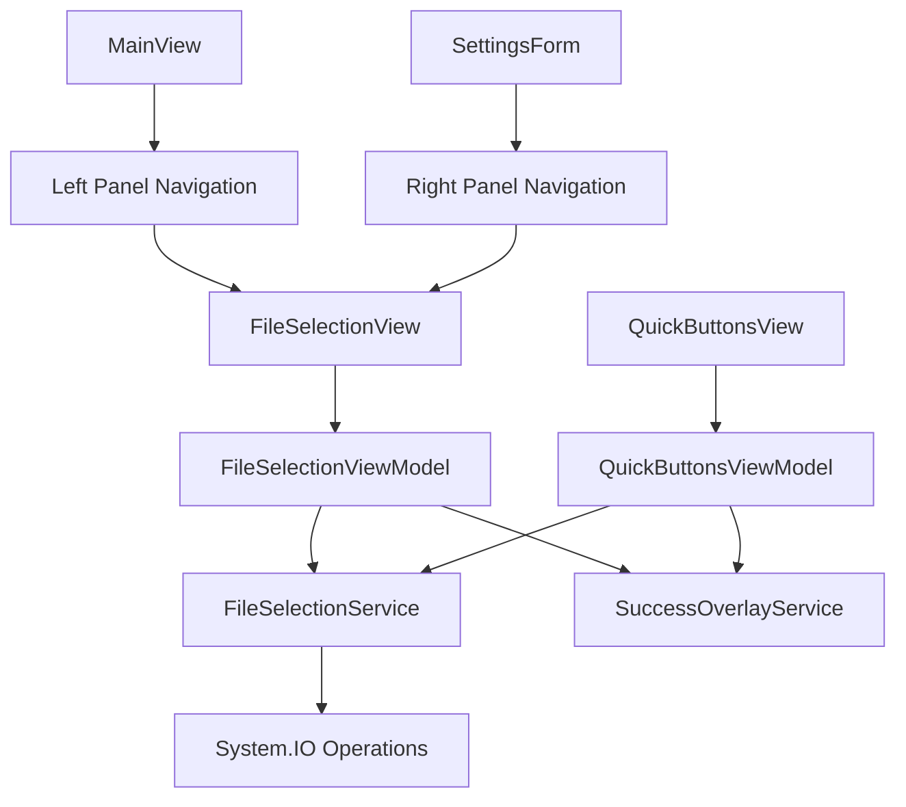

# File Selection Service and Enhanced Export/Import - Product Requirements Document

**Feature Name**: File Selection Service with Enhanced Import/Export  
**Epic**: MTM Inventory Management  
**Status**: Specification Phase  
**Priority**: High  
**Target Release**: Phase 2  

**Document Version**: 1.0  
**Created**: September 13, 2025  
**Last Updated**: September 13, 2025  

---

## 📋 Executive Summary

This feature introduces a unified file selection service and enhances the QuickButtons Import/Export functionality with visual feedback overlays and intelligent panel-based navigation. The implementation provides manufacturers with an intuitive, consistent file management experience across all import/export operations while maintaining the established MTM design patterns.

### Key Value Proposition
- **Unified file selection** across all import/export operations
- **Visual feedback** through SuccessOverlay integration for operation status
- **Smart panel placement** - left panel in MainView, right panel in SettingsForm
- **Enhanced user experience** with consistent file management patterns
- **Future-proof architecture** for additional file operations (save, load, etc.)

---

## 🎯 Problem Statement

The current QuickButtons export/import functionality has several limitations that affect user experience and system extensibility:

### Current Pain Points
- **Hard-coded file paths** in export operations limit user control
- **No visual feedback** during import/export operations
- **Inconsistent file selection** patterns across different features  
- **No dedicated UI space** for file operations in existing layouts
- **Limited extensibility** for future file operations

### Business Impact
- **Reduced user control** over file locations and organization
- **Unclear operation status** leading to repeated attempts
- **Inconsistent user experience** across file operations
- **Limited adoption** of import/export features due to usability issues

---

## 🚀 Goals and Success Metrics

### Primary Goals
1. **Create Universal File Selection Service**: Provide consistent file selection across all operations
2. **Integrate Visual Feedback**: Use SuccessOverlay for operation status indication
3. **Implement Smart Panel Navigation**: Use left panel in MainView, right panel in SettingsForm
4. **Enhance Export/Import UX**: Improve QuickButtons import/export user experience
5. **Establish Extensible Pattern**: Create foundation for future file operations

### Success Metrics (60-Day Post-Launch)
- **User Adoption**: >75% of users utilize new file selection features
- **Error Reduction**: >50% reduction in file operation errors
- **User Satisfaction**: >4.0/5 rating on file operation usability
- **System Performance**: <200ms response time for file dialog operations
- **Development Velocity**: >30% faster implementation of new file features

---

## 👥 Target Users

### Primary Users
- **Production Operators**: Workers exporting/importing QuickButton configurations
- **Shift Supervisors**: Managers sharing team configurations across shifts
- **IT Administrators**: Staff managing system configurations and backups

### User Scenarios
- **Configuration Backup**: Export QuickButtons before system updates
- **Team Setup**: Import proven configurations for new operators
- **Cross-Shift Sharing**: Transfer optimized workflows between teams
- **System Migration**: Move configurations between workstations

---

## 🏗️ Technical Architecture

### System Components


### Core Technologies
- **Framework**: .NET 8 with Avalonia UI 11.3.4
- **MVVM Pattern**: Community Toolkit with `[ObservableProperty]` and `[RelayCommand]`
- **File Operations**: System.IO with async/await patterns
- **Design System**: MTM theme with dynamic resource bindings
- **Panel Navigation**: Context-aware view placement (MainView left, SettingsForm right)

### Service Interfaces
```csharp
public interface IFileSelectionService
{
    Task<string?> SelectFileForImportAsync(FileSelectionOptions options);
    Task<string?> SelectLocationForExportAsync(FileSelectionOptions options);
    Task<bool> ValidateFileAccessAsync(string filePath);
    Task ShowFileSelectionViewAsync(Control parentContainer, FileSelectionOptions options, Action<string?> onFileSelected);
}

public class FileSelectionOptions
{
    public string Title { get; set; } = "Select File";
    public string[] Extensions { get; set; } = new[] { "*.json" };
    public string InitialDirectory { get; set; } = Environment.GetFolderPath(Environment.SpecialFolder.MyDocuments);
    public FileSelectionMode Mode { get; set; } = FileSelectionMode.Import;
    public PanelPlacement PreferredPlacement { get; set; } = PanelPlacement.Auto;
}

public enum PanelPlacement
{
    Auto,       // Automatically determine based on calling context
    LeftPanel,  // Force left panel (MainView style)
    RightPanel, // Force right panel (SettingsForm style) 
    Overlay     // Use overlay if no panel space available
}
```

---

## ✨ Core Features

### F1: File Selection Service Implementation
**User Story**: As a system developer, I want a unified file selection service so that all file operations follow consistent patterns.

**Acceptance Criteria**:
- ✅ Implement `IFileSelectionService` interface with standardized methods
- ✅ Support multiple file selection modes (Import, Export, Save, Load)
- ✅ Provide configurable file type filtering and initial directories
- ✅ Include file validation and error handling
- ✅ Use async/await patterns for non-blocking operations

**Technical Implementation**:
```csharp
// Service: Services/FileSelectionService.cs
public class FileSelectionService : IFileSelectionService
{
    public async Task<string?> SelectFileForImportAsync(FileSelectionOptions options)
    {
        // Implementation with OpenFileDialog equivalent
        // Validation and error handling
    }
    
    public async Task<string?> SelectLocationForExportAsync(FileSelectionOptions options)
    {
        // Implementation with SaveFileDialog equivalent
        // Directory creation and permissions check
    }
}
```

### F2: File Selection View Implementation
**User Story**: As a user, I want a consistent file selection interface that appears in an appropriate panel so that I can easily choose files without disrupting my current workflow.

**Acceptance Criteria**:
- ✅ Create `FileSelectionView.axaml` as a standard UserControl with MTM design patterns
- ✅ Support both file browsing and directory selection modes
- ✅ Include file preview and validation feedback
- ✅ Provide cancel and confirm actions with proper event handling
- ✅ Auto-detect appropriate panel placement based on calling context
- ✅ Display in left panel when called from MainView components
- ✅ Display in right panel when called from SettingsForm components

**Technical Implementation**:
- **Location**: `Views/Shared/FileSelectionView.axaml`
- **ViewModel**: `ViewModels/Shared/FileSelectionViewModel.cs`
- **Pattern**: Standard UserControl view with panel-aware navigation
- **Integration**: Context-sensitive panel placement logic

### F3: Enhanced QuickButtons Export with File Selection
**User Story**: As a production operator, I want to choose where to save my QuickButton configuration so that I can organize my files effectively.

**Acceptance Criteria**:
- ✅ Replace hard-coded export paths with file selection view
- ✅ Show SuccessOverlay with export confirmation and file path
- ✅ Handle export errors with appropriate user feedback
- ✅ Maintain backward compatibility with existing export format
- ✅ Display file selection in left panel when called from MainView

**Technical Implementation**:
```csharp
[RelayCommand]
private async Task ExportQuickButtons()
{
    try
    {
        var options = new FileSelectionOptions
        {
            Title = "Export QuickButtons Configuration",
            Extensions = new[] { "*.json" },
            Mode = FileSelectionMode.Export,
            PreferredPlacement = PanelPlacement.LeftPanel // MainView context
        };

        await _fileSelectionService.ShowFileSelectionViewAsync(this, options, async (filePath) =>
        {
            if (string.IsNullOrEmpty(filePath)) return;

            var success = await _quickButtonsService.ExportQuickButtonsAsync(currentUser, filePath);
            
            if (success)
            {
                await _successOverlayService.ShowSuccessOverlayInMainViewAsync(
                    null, 
                    "QuickButtons exported successfully!",
                    $"Saved to: {filePath}",
                    "Export",
                    3000
                );
            }
        });
    }
    catch (Exception ex)
    {
        await ErrorHandling.HandleErrorAsync(ex, "Export QuickButtons failed");
    }
}
```

### F4: Enhanced QuickButtons Import with File Selection
**User Story**: As a production operator, I want to browse and select QuickButton configuration files so that I can import the correct configuration.

**Acceptance Criteria**:
- ✅ Replace automatic file selection with user-driven file browsing
- ✅ Show file preview and validation before import
- ✅ Display SuccessOverlay with import confirmation and details
- ✅ Handle import errors with detailed error messages
- ✅ Auto-refresh QuickButtons UI after successful import

**Technical Implementation**:
```csharp
[RelayCommand]
private async Task ImportQuickButtons()
{
    try
    {
        var options = new FileSelectionOptions
        {
            Title = "Import QuickButtons Configuration",
            Extensions = new[] { "*.json" },
            Mode = FileSelectionMode.Import,
            PreferredPlacement = PanelPlacement.LeftPanel // MainView context
        };

        await _fileSelectionService.ShowFileSelectionViewAsync(this, options, async (filePath) =>
        {
            if (string.IsNullOrEmpty(filePath)) return;

            var success = await _quickButtonsService.ImportQuickButtonsAsync(currentUser, filePath);
            
            if (success)
            {
                await _successOverlayService.ShowSuccessOverlayInMainViewAsync(
                    null,
                    "QuickButtons imported successfully!",
                    $"Loaded from: {Path.GetFileName(filePath)}",
                    "Import",
                    3000
                );
                
                await RefreshButtons(); // Update UI
            }
        });
    }
    catch (Exception ex)
    {
        await ErrorHandling.HandleErrorAsync(ex, "Import QuickButtons failed");
    }
}
```

### F5: Context-Aware Panel Placement System
**User Story**: As a user, I want the file selection view to appear in the most appropriate location based on where I'm working so that my workflow is not disrupted.

**Acceptance Criteria**:
- ✅ Display file selection in left panel when called from MainView components
- ✅ Display file selection in right panel when called from SettingsForm components  
- ✅ Auto-detect calling context and choose appropriate panel
- ✅ Maintain existing panel content and restore after file selection
- ✅ Provide manual override for specific placement requirements

**Technical Implementation**:
```csharp
// In FileSelectionService.cs
public async Task ShowFileSelectionViewAsync(Control sourceControl, FileSelectionOptions options, Action<string?> onFileSelected)
{
    // Determine appropriate panel placement
    var placement = DeterminePanelPlacement(sourceControl, options.PreferredPlacement);
    
    switch (placement)
    {
        case PanelPlacement.LeftPanel:
            await ShowInMainViewLeftPanel(sourceControl, options, onFileSelected);
            break;
            
        case PanelPlacement.RightPanel:
            await ShowInSettingsFormRightPanel(sourceControl, options, onFileSelected);
            break;
            
        default:
            await ShowInOverlay(sourceControl, options, onFileSelected);
            break;
    }
}

private PanelPlacement DeterminePanelPlacement(Control sourceControl, PanelPlacement preferred)
{
    if (preferred != PanelPlacement.Auto) return preferred;
    
    // Walk up visual tree to find context
    var parent = sourceControl;
    while (parent != null)
    {
        if (parent is Views.MainView) return PanelPlacement.LeftPanel;
        if (parent is Views.SettingsView) return PanelPlacement.RightPanel;
        parent = parent.Parent as Control;
    }
    
    return PanelPlacement.Overlay; // Fallback
}
```

---

## 🎨 User Experience Design

### MTM Design System Integration

#### Visual Design Standards
- **Primary Color**: Windows 11 Blue (#0078D4) for action buttons
- **File Selection UI**: Card-based layout with file preview area
- **Success Feedback**: Green success overlay with file operation details
- **Error Handling**: Red error overlay with actionable recovery options

#### File Selection View Layout
```xml
<UserControl xmlns="https://github.com/avaloniaui"
             x:Class="MTM_WIP_Application_Avalonia.Views.Shared.FileSelectionView">
  <Border Background="{DynamicResource MTM_Shared_Logic.CardBackgroundBrush}"
          BorderBrush="{DynamicResource MTM_Shared_Logic.BorderLightBrush}"
          BorderThickness="1" CornerRadius="8" Padding="16">
    <Grid RowDefinitions="Auto,*,Auto">
      <!-- Title and Mode Display -->
      <Grid Grid.Row="0" ColumnDefinitions="*,Auto">
        <TextBlock Text="{Binding Title}" FontSize="16" FontWeight="Bold"/>
        <TextBlock Text="{Binding Mode}" FontSize="12" Opacity="0.7"/>
      </Grid>
      
      <!-- File Browser Area -->
      <ScrollViewer Grid.Row="1" Margin="0,8">
        <StackPanel Spacing="8">
          <!-- Directory Navigation -->
          <Grid ColumnDefinitions="*,Auto">
            <TextBox Text="{Binding CurrentDirectory}" IsReadOnly="True"/>
            <Button Content="Browse..." Command="{Binding BrowseCommand}"/>
          </Grid>
          
          <!-- File List with Preview -->
          <ListBox Items="{Binding AvailableFiles}" SelectedItem="{Binding SelectedFile}"/>
          
          <!-- File Validation Messages -->
          <TextBlock Text="{Binding ValidationMessage}" 
                     Foreground="{DynamicResource MTM_Shared_Logic.ErrorBrush}"
                     IsVisible="{Binding HasValidationError}"/>
        </StackPanel>
      </ScrollViewer>
      
      <!-- Action Buttons -->
      <StackPanel Grid.Row="2" Orientation="Horizontal" HorizontalAlignment="Right" Spacing="8">
        <Button Content="Cancel" Command="{Binding CancelCommand}" Classes="secondary-button"/>
        <Button Content="Select" Command="{Binding SelectCommand}" Classes="primary-button"/>
      </StackPanel>
    </Grid>
  </Border>
</UserControl>
```

#### Panel Placement Behavior
- **MainView Context**: File selection appears in left panel (tab area replacement)
  - Temporarily replaces current tab content
  - Maintains tab header for return navigation
  - Returns to previous tab content after file selection
- **SettingsForm Context**: File selection appears in right panel (content area)
  - Replaces current settings panel content
  - Maintains navigation tree on left for context
  - Returns to previous settings panel after file selection
- **Fallback**: Uses overlay if no suitable panel space is available

### Interaction Flow

1. **Export Trigger**: User clicks Export button in QuickButtons
2. **Context Detection**: System determines calling context (MainView vs SettingsForm)
3. **Panel Navigation**: File selection view opens in appropriate panel (left for MainView)
4. **File Selection**: User browses and selects export location
5. **Export Process**: Background export with progress indication
6. **Success Feedback**: SuccessOverlay shows export confirmation
7. **Panel Restore**: Panel returns to previous content
8. **Cleanup**: All temporary UI states reset to normal

---

## 🔒 Security and Compliance

### File System Security
- **Path Validation**: Prevent directory traversal attacks
- **Permission Checks**: Validate read/write permissions before operations
- **File Type Validation**: Enforce allowed file extensions and MIME types
- **Size Limits**: Prevent extremely large file operations

### Data Protection
- **Sensitive Data Filtering**: Remove user-specific paths from export files
- **Access Logging**: Log all file operations for audit trails
- **Error Handling**: Prevent information disclosure through error messages
- **Temporary File Cleanup**: Secure deletion of temporary files

---

## 📈 Performance Requirements

### Response Time Targets
- **Panel Navigation**: <100ms for view replacement
- **File Validation**: <500ms for file existence and permissions
- **Export Operations**: <2 seconds for typical QuickButton configurations
- **Import Operations**: <3 seconds including UI refresh
- **Panel Transitions**: <200ms for smooth content replacement

### Resource Management
- **Memory Usage**: <5MB additional RAM for file operations
- **File Handle Management**: Proper disposal of all file streams
- **Background Operations**: Non-blocking UI during file I/O
- **Error Recovery**: Graceful handling of file system exceptions
- **Panel State Management**: Clean restoration of previous panel content

---

## 🧪 Testing Strategy

### Unit Testing Scenarios
```csharp
[TestFixture]
public class FileSelectionServiceTests
{
    [Test]
    public async Task SelectFileForImportAsync_ValidOptions_ReturnsFilePath()
    {
        // Test file selection with valid options
        // Verify path validation and existence checks
    }

    [Test]
    public async Task SelectLocationForExportAsync_InvalidDirectory_CreatesDirectory()
    {
        // Test export location selection with directory creation
        // Verify permission handling
    }

    [Test]
    public async Task ValidateFileAccessAsync_ReadOnlyFile_ReturnsFalse()
    {
        // Test file access validation
        // Verify permission detection
    }
}
```

### Integration Testing
- **Service Integration**: FileSelectionService with QuickButtonsService
- **UI Integration**: Panel navigation and content replacement
- **Event Integration**: Success/error overlay triggering from file operations
- **Cross-Platform Testing**: File selection behavior on Windows/Linux
- **Context Detection**: Proper panel placement based on calling context

### User Acceptance Testing
- **Export Flow**: Complete export operation with custom file location
- **Import Flow**: Browse and select file for import with validation
- **Error Scenarios**: Handle file access errors and invalid file formats
- **Performance Testing**: Large configuration export/import timing
- **Accessibility Testing**: Keyboard navigation and screen reader support

---

## 🚀 Implementation Plan

### Phase 1: Core File Selection Service (Week 1)
- [ ] Create `IFileSelectionService` interface and implementation
- [ ] Implement file selection options and validation logic
- [ ] Add service registration to dependency injection container
- [ ] Create unit tests for core service functionality
- [ ] Document service API and usage patterns

### Phase 2: File Selection View Implementation (Week 2)
- [ ] Create `FileSelectionView.axaml` with MTM styling
- [ ] Implement `FileSelectionViewModel` with MVVM Community Toolkit
- [ ] Add panel placement logic to determine context-appropriate display
- [ ] Implement show/hide view methods with panel content management
- [ ] Test view display and interaction functionality in both contexts

### Phase 3: QuickButtons Integration (Week 3)
- [ ] Enhance `QuickButtonsViewModel.ExportQuickButtons()` with view-based file selection
- [ ] Enhance `QuickButtonsViewModel.ImportQuickButtons()` with view-based file selection
- [ ] Integrate SuccessOverlay feedback for both operations
- [ ] Update `QuickButtonsService` to support custom file paths
- [ ] Test complete export/import workflow with panel-based file selection

### Phase 4: Panel Integration and Context Detection (Week 4)
- [ ] Implement context detection logic for MainView vs SettingsForm
- [ ] Add panel content replacement logic for both left and right panels
- [ ] Create panel state management for clean restoration
- [ ] Test panel behavior with multiple view types and contexts
- [ ] Ensure responsive behavior across screen sizes

### Phase 5: Testing and Polish (Week 5)
- [ ] Complete unit test coverage for all new components
- [ ] Integration testing of full workflow
- [ ] User acceptance testing with manufacturing operators
- [ ] Performance optimization and error handling refinement
- [ ] Documentation updates and deployment preparation

---

## 📊 Technical Specifications

### File Selection Service Implementation
```csharp
// Services/FileSelectionService.cs
namespace MTM_WIP_Application_Avalonia.Services
{
    public interface IFileSelectionService
    {
        Task<string?> SelectFileForImportAsync(FileSelectionOptions options);
        Task<string?> SelectLocationForExportAsync(FileSelectionOptions options);
        Task<bool> ValidateFileAccessAsync(string filePath);
        Task<FileInfo?> GetFileInfoAsync(string filePath);
        Task ShowFileSelectionViewAsync(Control sourceControl, FileSelectionOptions options, Action<string?> onFileSelected);
    }

    public class FileSelectionService : IFileSelectionService
    {
        private readonly ILogger<FileSelectionService> _logger;
        private readonly INavigationService _navigationService;
        
        public FileSelectionService(ILogger<FileSelectionService> logger, INavigationService navigationService)
        {
            _logger = logger;
            _navigationService = navigationService;
        }

        public async Task ShowFileSelectionViewAsync(Control sourceControl, FileSelectionOptions options, Action<string?> onFileSelected)
        {
            // Determine appropriate panel placement
            var placement = DeterminePanelPlacement(sourceControl, options.PreferredPlacement);
            
            // Create and configure file selection view
            var viewModel = Program.GetService<ViewModels.Shared.FileSelectionViewModel>();
            viewModel.Initialize(options, onFileSelected);
            
            var view = new Views.Shared.FileSelectionView { DataContext = viewModel };
            
            // Navigate to appropriate panel
            switch (placement)
            {
                case PanelPlacement.LeftPanel:
                    await _navigationService.NavigateToLeftPanel(view);
                    break;
                    
                case PanelPlacement.RightPanel:
                    await _navigationService.NavigateToRightPanel(view);
                    break;
                    
                default:
                    await _navigationService.NavigateToOverlay(view);
                    break;
            }
        }
        
        private PanelPlacement DeterminePanelPlacement(Control sourceControl, PanelPlacement preferred)
        {
            if (preferred != PanelPlacement.Auto) return preferred;
            
            // Walk up visual tree to find context
            var parent = sourceControl;
            while (parent != null)
            {
                if (parent is Views.MainView) return PanelPlacement.LeftPanel;
                if (parent is Views.SettingsView) return PanelPlacement.RightPanel;
                parent = parent.Parent as Control;
            }
            
            return PanelPlacement.Overlay; // Fallback
        }
    }

    public class FileSelectionOptions
    {
        public string Title { get; set; } = "Select File";
        public string[] Extensions { get; set; } = new[] { "*.json" };
        public string InitialDirectory { get; set; } = Environment.GetFolderPath(Environment.SpecialFolder.MyDocuments);
        public FileSelectionMode Mode { get; set; } = FileSelectionMode.Import;
        public PanelPlacement PreferredPlacement { get; set; } = PanelPlacement.Auto;
        public bool AllowMultipleSelection { get; set; } = false;
        public long MaxFileSize { get; set; } = 10 * 1024 * 1024; // 10MB default
    }

    public enum FileSelectionMode
    {
        Import,
        Export,
        Save,
        Load
    }
    
    public enum PanelPlacement
    {
        Auto,       // Automatically determine based on calling context
        LeftPanel,  // Force left panel (MainView tab area)
        RightPanel, // Force right panel (SettingsForm content area)
        Overlay     // Use overlay if no panel space available
    }
}
```

### Panel Navigation Implementation
```csharp
// MainView.axaml.cs additions
public async void ShowFileSelectionInLeftPanel(Views.Shared.FileSelectionView fileSelectionView)
{
    try
    {
        // Find the main tab control
        var tabControl = this.FindControl<TabControl>("MainForm_TabControl");
        if (tabControl != null)
        {
            // Store current tab content for restoration
            var currentTabIndex = tabControl.SelectedIndex;
            var currentTab = tabControl.Items[currentTabIndex] as TabItem;
            
            if (currentTab != null)
            {
                // Store original content
                var originalContent = currentTab.Content;
                
                // Replace with file selection view
                currentTab.Content = fileSelectionView;
                
                // Subscribe to completion event for restoration
                if (fileSelectionView.DataContext is ViewModels.Shared.FileSelectionViewModel viewModel)
                {
                    viewModel.Completed += (sender, e) =>
                    {
                        // Restore original content
                        currentTab.Content = originalContent;
                    };
                }
            }
        }
    }
    catch (Exception ex)
    {
        System.Diagnostics.Debug.WriteLine($"Error showing file selection in left panel: {ex.Message}");
    }
}

// SettingsForm.axaml.cs additions
public async void ShowFileSelectionInRightPanel(Views.Shared.FileSelectionView fileSelectionView)
{
    try
    {
        // Find the content presenter for the dynamic content area
        var contentPresenter = this.FindControl<ContentPresenter>("DynamicContentPresenter");
        if (contentPresenter != null)
        {
            // Store current content for restoration
            var originalContent = contentPresenter.Content;
            
            // Replace with file selection view
            contentPresenter.Content = fileSelectionView;
            
            // Subscribe to completion event for restoration
            if (fileSelectionView.DataContext is ViewModels.Shared.FileSelectionViewModel viewModel)
            {
                viewModel.Completed += (sender, e) =>
                {
                    // Restore original content
                    contentPresenter.Content = originalContent;
                };
            }
        }
    }
    catch (Exception ex)
    {
        System.Diagnostics.Debug.WriteLine($"Error showing file selection in right panel: {ex.Message}");
    }
}

---

## 📚 Dependencies and Integration Points

### External Dependencies
- **Avalonia.Controls.OpenFileDialog**: For native file selection dialogs
- **System.IO**: For file system operations and validation
- **Microsoft.Extensions.Logging**: For comprehensive operation logging
- **Material.Icons.Avalonia**: For consistent iconography

### Internal Integration Points
- **SuccessOverlayService**: For operation feedback and status indication
- **QuickButtonsService**: Enhanced with custom file path support
- **ErrorHandling**: Centralized error management for file operations
- **MainView Overlay System**: Following established NewQuickButton pattern

### Service Registration
```csharp
// Extensions/ServiceCollectionExtensions.cs
public static IServiceCollection AddMTMServices(this IServiceCollection services, IConfiguration configuration)
{
    // Existing services...
    services.TryAddScoped<IFileSelectionService, FileSelectionService>();
    services.TryAddTransient<ViewModels.Shared.FileSelectionViewModel>();
    
    return services;
}
```

---

## 📝 Documentation Requirements

### User Documentation
- **File Selection Guide**: Step-by-step instructions for import/export operations
- **Troubleshooting Guide**: Common file operation issues and solutions
- **Configuration Management**: Best practices for organizing exported files

### Developer Documentation
- **Service API Reference**: Complete IFileSelectionService documentation
- **Integration Patterns**: How to use the service in other components
- **Extension Points**: Adding new file operation modes and types

### Operational Documentation
- **File System Requirements**: Permissions and directory structure
- **Performance Monitoring**: Key metrics and troubleshooting
- **Security Configuration**: File access restrictions and validation

---

## 🔄 Future Enhancements

### Phase 6: Extended File Operations (Future)
- **Batch Import/Export**: Multiple file selection and processing
- **Cloud Storage Integration**: Support for cloud file storage providers
- **File Versioning**: Configuration version management and rollback
- **Template System**: Predefined configuration templates

### Phase 7: Advanced Features (Future)
- **File Preview**: Configuration content preview before import
- **Diff Visualization**: Compare configurations before import
- **Backup Automation**: Scheduled configuration backups
- **Team Collaboration**: Shared configuration repositories

---

## ✅ Success Criteria and Acceptance

### Technical Acceptance Criteria
- [ ] FileSelectionService passes 100% of unit tests
- [ ] File operations complete within performance targets
- [ ] View displays correctly in both MainView and SettingsForm contexts
- [ ] Panel content replacement and restoration works seamlessly
- [ ] Error handling covers all identified failure scenarios

### Business Acceptance Criteria
- [ ] Users can export QuickButton configurations to custom locations
- [ ] Users can import configurations from any accessible file path
- [ ] Success and error feedback is clear and actionable
- [ ] File operations integrate seamlessly with existing workflows
- [ ] System maintains existing performance and reliability standards
- [ ] Panel placement is intuitive and does not disrupt user workflow

### Quality Assurance Checklist
- [ ] Cross-platform compatibility (Windows primary, Linux secondary)
- [ ] Accessibility compliance (keyboard navigation, screen readers)
- [ ] Internationalization ready (localizable strings)
- [ ] Error messages are user-friendly and actionable
- [ ] All file handles and resources are properly disposed
- [ ] Panel state restoration works correctly in all scenarios

---

## 📊 Monitoring and Success Metrics

### Operational Metrics
- **File Operation Success Rate**: >98% successful completions
- **User Adoption Rate**: >75% of users utilize new file selection features
- **Error Rate Reduction**: >50% reduction in file operation failures
- **Support Ticket Reduction**: >40% fewer file-related support requests

### Performance Metrics
- **Panel Navigation Time**: <100ms average for view replacement
- **Export Operation Time**: <2 seconds for typical configurations
- **Import Operation Time**: <3 seconds including UI refresh
- **Panel Restoration Time**: <50ms for content replacement

### User Experience Metrics
- **Task Completion Time**: >30% improvement in export/import workflow time
- **Error Recovery Time**: <1 minute average for common file operation errors
- **User Satisfaction Score**: >4.0/5 for file operation usability
- **Context Appropriateness**: >95% of users find panel placement intuitive
- **Feature Discovery Rate**: >60% of users discover new file features within first week

---

**Document Status**: ✅ Complete Specification Ready for Implementation  
**Next Milestone**: Phase 1 Implementation Start  
**Document Owner**: MTM Development Team  
**Stakeholder Approval**: Pending Manufacturing Operations and IT Security Review  
**Implementation Timeline**: 5-week development cycle with weekly milestones

---

*This specification provides comprehensive guidance for implementing the File Selection Service and Enhanced Export/Import functionality while maintaining consistency with established MTM application patterns and ensuring optimal user experience for manufacturing operators.*