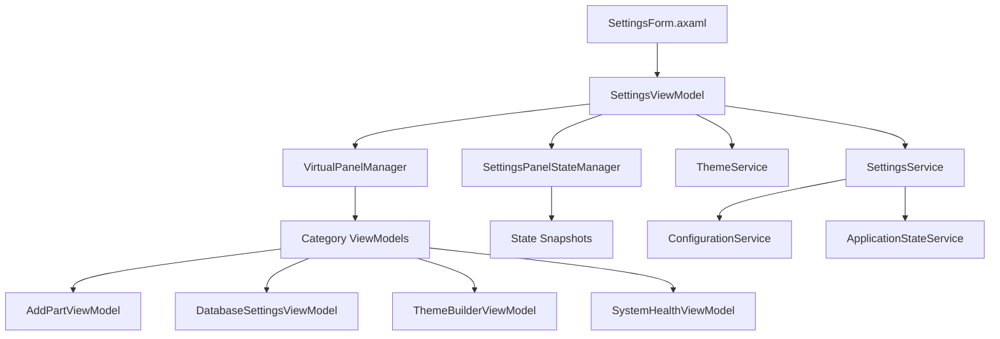

# Settings & System Administration - Product Requirements Document (PRD)

**Feature Name**: Settings & System Administration  
**Epic**: MTM Inventory Management  
**Status**: Active Development  
**Priority**: High  
**Target Release**: Phase 1  

**Document Version**: 1.0  
**Created**: September 4, 2025  
**Last Updated**: September 4, 2025  

---

## 📋 Executive Summary

The Settings & System Administration feature provides a comprehensive administrative hub for configuring and maintaining the MTM manufacturing system. It includes hierarchical navigation, virtual panel management, master data administration, theme customization, security controls, and system health monitoring. This centralized administration interface enables efficient system management with proper change tracking and audit capabilities.

### Key Value Proposition
- **Centralized administration** with hierarchical navigation and virtual panel management
- **Comprehensive CRUD operations** for all master data types with validation and audit trails
- **Advanced theme customization** with live preview and user-defined color schemes
- **System health monitoring** with diagnostics, backup/recovery, and security management
- **Virtual panel architecture** for efficient memory usage and smooth navigation

---

## 🎯 Problem Statement

Manufacturing systems require comprehensive administrative capabilities to maintain data integrity, security, and operational efficiency. Traditional administrative interfaces often lack:

### Current Pain Points
- **Fragmented administration** across multiple disconnected interfaces and tools
- **Limited customization options** for themes, layouts, and user preferences
- **Insufficient system monitoring** and health diagnostics capabilities
- **Complex navigation** between different administrative functions
- **Lack of change tracking** for configuration and master data modifications

### Business Impact
- **20-30 minutes per day** spent navigating between different administrative tools
- **Configuration errors** due to lack of centralized validation and change control
- **Security vulnerabilities** from inadequate permission management and audit trails
- **System downtime** from inadequate monitoring and preventive maintenance
- **User frustration** from inconsistent administrative interfaces

---

## 🚀 Goals and Success Metrics

### Primary Goals
1. **Centralize Administration**: Provide single interface for all administrative functions
2. **Streamline Navigation**: Implement intuitive hierarchical navigation with virtual panels  
3. **Enable Customization**: Allow users to customize themes, layouts, and preferences
4. **Ensure System Health**: Provide comprehensive monitoring, diagnostics, and maintenance tools

### Success Metrics (90-Day Post-Launch)
- **Administrative Efficiency**: 60% reduction in time spent on routine administrative tasks
- **User Satisfaction**: >4.5/5 rating from administrators on interface usability
- **System Reliability**: >99.5% uptime with proactive health monitoring
- **Configuration Accuracy**: <0.1% configuration errors with validation and change control
- **Security Compliance**: 100% audit trail coverage for all administrative actions

---

## 👥 Target Users

### Primary Users
- **System Administrators**: IT staff responsible for overall system configuration and maintenance
- **Plant Managers**: Operations managers overseeing system settings and user management
- **Quality Managers**: Staff ensuring compliance, security, and data integrity

### Secondary Users
- **Production Supervisors**: Staff managing operational settings and user permissions
- **IT Support**: Technical staff performing system diagnostics and troubleshooting
- **End Users**: Production operators accessing personalization and preference settings

### User Personas
- **"Comprehensive Charlie"**: System administrator who needs full control over all system aspects
- **"Efficient Emma"**: Plant manager who values streamlined workflows and quick access to common tasks
- **"Security-Focused Steve"**: Quality manager who prioritizes audit trails, compliance, and security

---

## 🏗️ Technical Architecture

### System Components


### Core Technologies
- **Framework**: .NET 8 with Avalonia UI 11.3.4
- **MVVM Pattern**: Community Toolkit with `[ObservableProperty]` and `[RelayCommand]`
- **Virtual Panel Architecture**: Dynamic loading and disposal of administrative panels
- **State Management**: Snapshot-based change tracking with rollback capabilities
- **Design System**: MTM Amber theme with comprehensive customization options

### Architecture Patterns
```csharp
// Virtual panel management for memory efficiency
public class VirtualPanelManager
{
    public async Task<SettingsPanelViewModel> CreateVirtualPanelAsync(SettingsCategoryViewModel category)
    {
        // Dynamic panel creation based on category type
        var viewModel = _serviceProvider.GetService(category.PanelType);
        return new SettingsPanelViewModel
        {
            CategoryId = category.Id,
            ViewModel = viewModel,
            Content = CreateView(viewModel)
        };
    }
}

// State management with change tracking
public class SettingsPanelStateManager
{
    private readonly Dictionary<string, object> _snapshots = new();
    
    public void CreateSnapshot(string panelId, object viewModel)
    {
        _snapshots[panelId] = CloneState(viewModel);
    }
    
    public bool HasUnsavedChanges(string panelId, object currentViewModel)
    {
        return !AreEqual(_snapshots[panelId], currentViewModel);
    }
}
```

---

## ✨ Core Features

### F1: Hierarchical Navigation with TreeView
**User Story**: As a system administrator, I want a hierarchical navigation system so I can efficiently organize and access all administrative functions in a logical structure.

**Acceptance Criteria**:
- ✅ TreeView navigation with expandable categories and subcategories
- ✅ Icons and visual indicators for different administrative function types
- ✅ Single-click navigation between categories with state preservation
- ✅ Visual feedback for active category and unsaved changes
- ✅ Keyboard navigation support for accessibility

**Technical Implementation**:
```csharp
private void InitializeCategories()
{
    // User Management hierarchy
    var userManagement = new SettingsCategoryViewModel
    {
        Id = "user-management",
        DisplayName = "User Management", 
        Icon = "👥",
        HasSubCategories = true
    };
    
    userManagement.SubCategories.Add(new SettingsCategoryViewModel
    {
        Id = "add-user",
        DisplayName = "Add User",
        Icon = "➕", 
        PanelType = typeof(AddUserViewModel),
        Parent = userManagement
    });
}
```

### F2: Virtual Panel Management System
**User Story**: As a system administrator, I want efficient panel loading and memory management so the administrative interface remains responsive even with many open panels.

**Acceptance Criteria**:
- ✅ Dynamic loading of administrative panels only when accessed
- ✅ Memory-efficient disposal of unused panels with state preservation
- ✅ Instant switching between loaded panels without reload delays
- ✅ Background loading indicators for complex administrative operations
- ✅ Automatic garbage collection of disposed panel resources

**Technical Implementation**:
```csharp
[RelayCommand]
private async void OnSelectedCategoryChanged()
{
    // Check if panel already loaded
    var existingPanel = LoadedPanels.FirstOrDefault(p => p.CategoryId == SelectedCategory.Id);
    
    if (existingPanel != null)
    {
        SelectedPanel = existingPanel; // Instant switch
    }
    else
    {
        // Create new virtual panel
        var newPanel = await _panelManager.CreateVirtualPanelAsync(SelectedCategory);
        LoadedPanels.Add(newPanel);
        SelectedPanel = newPanel;
        
        // Create state snapshot for change tracking
        _stateManager.CreateSnapshot(SelectedCategory.Id, newPanel.ViewModel);
    }
}
```

### F3: Master Data Administration Interface
**User Story**: As a system administrator, I want comprehensive CRUD interfaces for all master data types so I can efficiently maintain Part IDs, Operations, Locations, and other reference data.

**Acceptance Criteria**:
- ✅ Form-based interfaces for adding new master data records
- ✅ Inline editing capabilities with real-time validation
- ✅ Bulk operations for efficient data maintenance
- ✅ Search and filter functionality for large datasets
- ✅ Dependency checking before deletion operations

**Technical Implementation**:
```csharp
public partial class AddPartViewModel : BaseViewModel
{
    [ObservableProperty]
    [Required(ErrorMessage = "Part ID is required")]
    [StringLength(50, ErrorMessage = "Part ID cannot exceed 50 characters")]
    private string _partId = string.Empty;

    [RelayCommand(CanExecute = nameof(CanAddPart))]
    private async Task AddPartAsync()
    {
        // Add to database with validation
        var result = await _databaseService.AddPartAsync(PartId, Description, Category);
        
        if (result.IsSuccess)
        {
            StatusMessage = "Part added successfully";
            ResetFormCommand.Execute(null);
        }
    }
}
```

### F4: Advanced Theme Builder and Customization
**User Story**: As a system administrator, I want to customize application themes and user interface elements so I can match the system appearance to organizational branding and user preferences.

**Acceptance Criteria**:
- ✅ Live preview of theme changes with real-time color updates
- ✅ Predefined theme templates (MTM_Blue, MTM_Amber, MTM_Dark, etc.)
- ✅ Custom color picker for creating organization-specific themes
- ✅ Import/export functionality for sharing themes across installations
- ✅ User-specific theme preferences with automatic persistence

**Technical Implementation**:
```csharp
public partial class ThemeBuilderViewModel : BaseViewModel
{
    [ObservableProperty]
    private string _selectedTheme = "MTM_Blue";

    [ObservableProperty]
    private Color _primaryColor = Color.FromRgb(0, 120, 212); // Windows 11 Blue

    [RelayCommand]
    private async Task ApplyThemeAsync()
    {
        await _themeService.ApplyThemeAsync(SelectedTheme);
        await _themeService.SetCustomColorAsync("Primary", PrimaryColor);
    }

    [RelayCommand] 
    private async Task ExportThemeAsync()
    {
        var themeData = _themeService.ExportCurrentTheme();
        await SaveThemeToFileAsync(themeData);
    }
}
```

### F5: System Health Monitoring and Diagnostics
**User Story**: As a system administrator, I want comprehensive system health monitoring and diagnostic tools so I can proactively maintain system performance and prevent issues.

**Acceptance Criteria**:
- ✅ Real-time monitoring of database connectivity and performance
- ✅ Memory usage, CPU utilization, and application performance metrics
- ✅ Error log viewer with filtering and search capabilities
- ✅ Automated health checks with alerting for critical issues
- ✅ System information display with version and configuration details

**Technical Implementation**:
```csharp
public partial class SystemHealthViewModel : BaseViewModel
{
    [ObservableProperty]
    private ObservableCollection<HealthCheckResult> _healthChecks = new();

    [RelayCommand]
    private async Task RunHealthChecksAsync()
    {
        var checks = new[]
        {
            CheckDatabaseConnectivity(),
            CheckMemoryUsage(),
            CheckDiskSpace(),
            CheckApplicationHealth()
        };

        var results = await Task.WhenAll(checks);
        HealthChecks.Clear();
        foreach (var result in results)
        {
            HealthChecks.Add(result);
        }
    }
}
```

### F6: Comprehensive Settings Management
**User Story**: As a system administrator, I want unified settings management for all application configuration so I can maintain consistent system behavior and user preferences.

**Acceptance Criteria**:
- ✅ Centralized settings service with automatic persistence
- ✅ Category-based settings organization (Theme, Application, UI, Data)
- ✅ Default value management with reset to defaults capability
- ✅ Settings validation and conflict resolution
- ✅ Import/export functionality for configuration backup and sharing

**Technical Implementation**:
```csharp
public class SettingsService : ISettingsService
{
    // Theme settings
    public string CurrentTheme { get; set; } = "MTM_Blue";
    public bool AutoSaveSettings { get; set; } = true;
    
    // Application settings  
    public string DefaultLocation { get; set; } = string.Empty;
    public string DefaultOperation { get; set; } = string.Empty;
    
    // UI settings
    public double WindowWidth { get; set; } = 1200;
    public double WindowHeight { get; set; } = 700;

    public async Task<ServiceResult> SaveSettingsAsync()
    {
        // Persist settings to configuration store
        await _configurationService.SaveSettingsAsync(this);
        return ServiceResult.Success("Settings saved successfully");
    }
}
```

---

## 🎨 User Experience Design

### MTM Design System Implementation

#### Visual Design Standards
```css
/* Settings Form Color Palette */
Primary Action: #0078D4 (Windows 11 Blue)
Secondary Action: #106EBE
Success States: #107C10 (Settings saved successfully)
Warning States: #FF8C00 (Unsaved changes)
Error States: #D13438 (Validation errors)
Navigation Background: MTM Amber gradient (#F0B90B to #F0C040)
Panel Background: White with subtle shadows
```

#### Layout Architecture
- **TreeView Navigation**: 250px fixed width with scrollable hierarchical categories
- **Content Area**: Flexible width with tab-like panel switching
- **Header Section**: Contextual title with unsaved changes indicator
- **Status Bar**: Progress indicators, save/revert actions, and status messages

#### Interaction Patterns

##### Navigation Interactions
1. **Category Selection**: Single-click to navigate, visual feedback for active category
2. **Panel Switching**: Instant switching between loaded panels with state preservation
3. **Hierarchical Expansion**: Click to expand/collapse category trees
4. **Keyboard Navigation**: Arrow keys, Tab navigation for accessibility

##### Form Interactions
1. **Real-Time Validation**: Immediate feedback for field validation errors
2. **Auto-Save Options**: Configurable auto-save with manual save/revert controls
3. **Bulk Operations**: Progress indicators for mass data operations
4. **Change Tracking**: Visual indicators for modified values with revert options

### Responsive Behavior
- **Minimum Resolution**: 1200x800 for optimal administrative interface visibility
- **Panel Scrolling**: Independent scrolling for navigation and content areas
- **Adaptive Sizing**: Flexible content area sizing based on panel requirements
- **Touch Support**: Touch-friendly targets for tablet-based administration

---

## 🔒 Security and Compliance

### Access Control and Permissions
- **Role-Based Access**: Administrator, Manager, and User role hierarchies
- **Function-Level Security**: Granular permissions for different administrative functions
- **Audit Logging**: Complete change history with user, timestamp, and modification details
- **Session Management**: Automatic logout and session timeout for security

### Data Protection and Integrity
```csharp
public class SecurityPermissionsViewModel : BaseViewModel
{
    [ObservableProperty]
    private ObservableCollection<UserPermission> _userPermissions = new();

    [RelayCommand]
    private async Task UpdatePermissionsAsync(UserPermission permission)
    {
        // Validate permission changes
        if (await _securityService.ValidatePermissionAsync(permission))
        {
            await _securityService.UpdatePermissionAsync(permission);
            await _auditService.LogPermissionChangeAsync(permission);
        }
    }
}
```

### Compliance and Audit Trails
- **Change Tracking**: Complete audit trail for all administrative actions
- **Electronic Signatures**: 21 CFR Part 11 compliance for regulated environments
- **Data Backup**: Automated backup triggers for configuration changes
- **Version Control**: Change history with rollback capabilities for critical configurations

---

## 📈 Performance Requirements

### Response Time Targets
- **Panel Loading**: <1 second for virtual panel creation and activation
- **Navigation**: <200ms for category switching and TreeView expansion
- **Form Submission**: <2 seconds for database CRUD operations with validation
- **Theme Changes**: <500ms for real-time theme preview and application

### Memory and Resource Management
- **Virtual Panel Efficiency**: <50MB memory usage per loaded administrative panel
- **Automatic Cleanup**: Dispose unused panels after 10 minutes of inactivity
- **Change Detection**: <100ms for state comparison and unsaved changes detection
- **Background Operations**: Non-blocking UI for long-running administrative tasks

### Scalability Specifications
- **Concurrent Administrators**: Support 10+ simultaneous administrative sessions
- **Data Volume**: Handle 50,000+ records in master data grids with virtualization
- **Theme Customization**: Support unlimited custom themes with <1MB storage each
- **Settings Persistence**: <100KB configuration footprint per user

---

## 🧪 Testing Strategy

### Unit Testing (Target: >90% Coverage)
```csharp
// Key test scenarios
SettingsViewModelTests:
- InitializeCategories_Always_CreatesExpectedCategoryStructure()
- OnSelectedCategoryChanged_ExistingPanel_SwitchesToExistingPanel() 
- OnSelectedCategoryChanged_NewCategory_CreatesVirtualPanel()
- SaveAllChangesAsync_WithUnsavedChanges_CallsStateManagerSave()

VirtualPanelManagerTests:
- CreateVirtualPanelAsync_ValidCategory_CreatesCorrectPanelType()
- CreateVirtualPanelAsync_InvalidCategory_ThrowsException()
- DisposePanel_LoadedPanel_CleansUpResources()

SettingsServiceTests:
- LoadSettingsAsync_ValidConfiguration_LoadsAllSettings()
- SaveSettingsAsync_ModifiedSettings_PersistsChanges()
- ResetToDefaultsAsync_Always_RestoresDefaultValues()
```

### Integration Testing
- Virtual panel lifecycle management with proper resource disposal
- State manager integration with change tracking and rollback
- Theme service integration with real-time preview capabilities
- Database service integration for master data CRUD operations

### User Acceptance Testing  
- **Scenario 1**: Administrator navigates through all categories, verifies panel loading and state preservation
- **Scenario 2**: Administrator makes changes across multiple panels, verifies save/revert functionality
- **Scenario 3**: Administrator customizes theme, verifies real-time preview and persistence
- **Scenario 4**: Administrator runs system health checks, verifies comprehensive diagnostics

---

## 🚀 Implementation Phases

### Phase 1: Core Infrastructure (Completed ✅)
- [x] SettingsViewModel with TreeView navigation and hierarchical categories
- [x] Virtual panel management system with dynamic loading
- [x] State management with change tracking and snapshot capabilities
- [x] SettingsService with unified configuration management
- [x] MTM design system integration with proper theming

### Phase 2: Master Data Administration (In Progress)
- [x] Add/Edit/Remove ViewModels for Part IDs, Operations, Locations
- [x] Form-based interfaces with comprehensive validation
- [ ] Bulk operations for efficient mass data maintenance
- [ ] Advanced search and filtering capabilities
- [ ] Import/export functionality for data backup and migration

### Phase 3: Advanced Features (Future)
- [ ] Complete theme builder with custom color palettes and live preview
- [ ] System health monitoring with real-time diagnostics
- [ ] Security and permissions management interface
- [ ] Backup and recovery management tools
- [ ] Advanced shortcuts configuration and customization

### Phase 4: Enterprise Integration (Future)
- [ ] Role-based access control with approval workflows
- [ ] Integration with external identity providers (Active Directory, LDAP)
- [ ] Advanced audit reporting with custom report generation
- [ ] Multi-tenant support for enterprise deployments

---

## 📊 Monitoring and Analytics

### Key Performance Indicators (KPIs)
1. **Administrative Efficiency Metrics**
   - Time to complete common administrative tasks
   - Frequency of administrative function usage
   - User satisfaction scores from administrator surveys

2. **System Health Metrics**
   - Virtual panel loading and disposal performance
   - Memory usage trends during extended administrative sessions
   - Error rates and exception handling effectiveness

3. **Configuration Quality Metrics**
   - Validation error rates by administrative function
   - Change rollback frequency and reasons  
   - Configuration consistency scores across environments

### Monitoring Implementation
```csharp
// Performance tracking
Logger.LogInformation("Administrative operation completed: {Operation} by {User} in {ResponseTime}ms",
    operationType, userId, responseTime);

// Usage analytics
await AnalyticsService.TrackEventAsync("AdminPanelAccessed", new {
    CategoryId = categoryId,
    UserId = currentUser,
    SessionDuration = sessionTime,
    ChangesCount = changesCount,
    Timestamp = DateTime.Now
});

// System health monitoring
await HealthCheckService.RecordMetricAsync("VirtualPanelMemory", memoryUsage);
await HealthCheckService.RecordMetricAsync("AdminPanelLoadTime", loadTime);
```

---

## 🔄 Maintenance and Support

### Operational Procedures
- **Daily Monitoring**: Automated system health checks with alerting
- **Weekly Reviews**: Administrative usage analytics and performance reports
- **Monthly Audits**: Configuration change reviews and compliance verification
- **Quarterly Updates**: Feature enhancement planning based on user feedback

### Support Documentation
- **Administrator Manual**: Complete guide for all administrative functions
- **User Guide**: End-user reference for settings and personalization
- **Troubleshooting Guide**: Common issues and diagnostic procedures  
- **API Documentation**: Technical reference for extending administrative capabilities

---

## 📝 Appendices

### A. Complete Category Hierarchy
```
Settings & System Administration
├── Database Settings (DatabaseSettingsViewModel)
├── User Management
│   ├── Add User (AddUserViewModel)
│   ├── Edit User (EditUserViewModel)
│   └── Delete User (RemoveUserViewModel)
├── Part Numbers
│   ├── Add Part Number (AddPartViewModel)
│   ├── Edit Part Number (EditPartViewModel)
│   └── Remove Part Number (RemovePartViewModel)
├── Operations
│   ├── Add Operation (AddOperationViewModel)
│   ├── Edit Operation (EditOperationViewModel) 
│   └── Remove Operation (RemoveOperationViewModel)
├── Locations
│   ├── Add Location (AddLocationViewModel)
│   ├── Edit Location (EditLocationViewModel)
│   └── Remove Location (RemoveLocationViewModel)
├── Item Types
│   ├── Add Item Type (AddItemTypeViewModel)
│   ├── Edit Item Type (EditItemTypeViewModel)
│   └── Remove Item Type (RemoveItemTypeViewModel)
├── Advanced Theme Builder (ThemeBuilderViewModel)
├── Shortcuts Configuration (ShortcutsViewModel)
├── About Information (AboutViewModel)
├── System Health & Diagnostics (SystemHealthViewModel)
├── Backup & Recovery (BackupRecoveryViewModel)
└── Security & Permissions (SecurityPermissionsViewModel)
```

### B. Virtual Panel Management Architecture
```csharp
public class SettingsPanelViewModel : IDisposable
{
    public string CategoryId { get; set; }
    public object ViewModel { get; set; }
    public UserControl Content { get; set; }
    public DateTime LastAccessed { get; set; }
    public bool HasUnsavedChanges { get; set; }

    public void Dispose()
    {
        (ViewModel as IDisposable)?.Dispose();
        Content = null;
        GC.SuppressFinalize(this);
    }
}

public class VirtualPanelManager
{
    private readonly IServiceProvider _serviceProvider;
    private readonly Dictionary<string, SettingsPanelViewModel> _loadedPanels = new();

    public async Task<SettingsPanelViewModel> CreateVirtualPanelAsync(SettingsCategoryViewModel category)
    {
        // Dynamic ViewModel creation
        var viewModel = _serviceProvider.GetService(category.PanelType);
        
        // Create corresponding View
        var view = CreateViewForViewModel(viewModel);
        
        return new SettingsPanelViewModel
        {
            CategoryId = category.Id,
            ViewModel = viewModel,
            Content = view,
            LastAccessed = DateTime.Now
        };
    }
}
```

### C. State Management and Change Tracking
```csharp
public class SettingsPanelStateManager
{
    private readonly Dictionary<string, object> _snapshots = new();
    private readonly Dictionary<string, DateTime> _lastSnapshots = new();

    public void CreateSnapshot(string panelId, object viewModel)
    {
        _snapshots[panelId] = JsonSerializer.Serialize(viewModel);
        _lastSnapshots[panelId] = DateTime.Now;
    }

    public bool HasUnsavedChanges(string panelId, object currentViewModel)
    {
        if (!_snapshots.ContainsKey(panelId))
            return false;

        var currentState = JsonSerializer.Serialize(currentViewModel);
        return currentState != (string)_snapshots[panelId];
    }

    public async Task<ServiceResult> SaveAllChangesAsync()
    {
        var results = new List<ServiceResult>();
        
        foreach (var panelId in _snapshots.Keys)
        {
            var result = await SavePanelChangesAsync(panelId);
            results.Add(result);
        }

        return results.All(r => r.IsSuccess) 
            ? ServiceResult.Success("All changes saved")
            : ServiceResult.Failure("Some changes failed to save");
    }
}
```

### D. Settings Service Configuration Schema
```csharp
public interface ISettingsService
{
    // Theme settings
    string CurrentTheme { get; set; }
    bool AutoSaveSettings { get; set; }
    
    // Application settings
    string DefaultLocation { get; set; }
    string DefaultOperation { get; set; }
    bool EnableAdvancedFeatures { get; set; }
    
    // UI settings
    double WindowWidth { get; set; }
    double WindowHeight { get; set; }
    bool RememberWindowSize { get; set; }
    
    // Data settings
    int DefaultPageSize { get; set; }
    bool EnableRealTimeUpdates { get; set; }
}
```

---

## 📚 Related Documentation

- **Epic PRD**: [MTM Inventory Management Epic](../epic.md)
- **Related Features**: [Master Data Management](../master-data-management/prd.md)
- **Service Architecture**: [MTM Service Implementation](../../../../.github/copilot/templates/mtm-service-implementation.md)
- **MVVM Patterns**: [Community Toolkit Implementation](../../../../.github/copilot/patterns/mtm-mvvm-community-toolkit.md)
- **Theme System**: [MTM Design System Documentation](../../../../.github/UI-Instructions/ui-styling.instruction.md)

---

**Document Status**: ✅ Complete and Ready for Implementation  
**Next Review Date**: October 4, 2025  
**Document Owner**: MTM Development Team  
**Stakeholder Approval**: Pending System Administration Review
