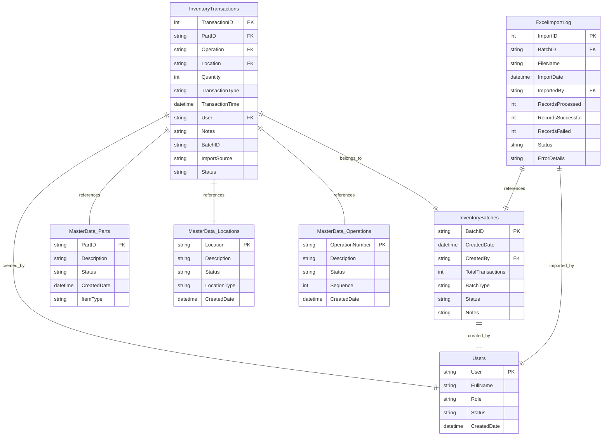
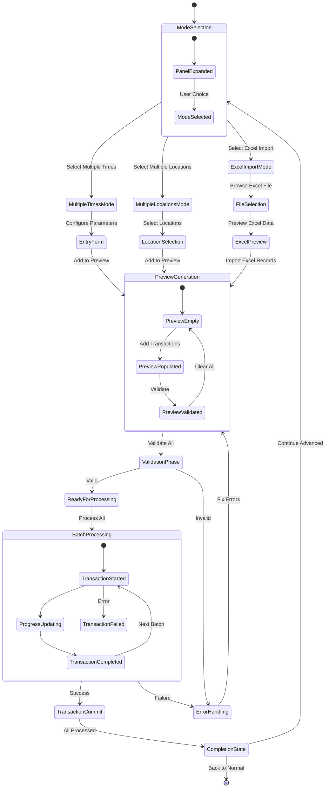

# Advanced Inventory View - Complete Implementation Plan

**Generated by**: Industry-Veteran Software Engineer  
**Feature**: Advanced Inventory View - Enhanced Multi-Mode Inventory Operations  
**Epic**: Advanced Inventory Management  
**Documentation Date**: 2025-01-27  
**Architecture Pattern**: MVVM with Avalonia UI  

## Goal

Transform the existing WinForms Control_AdvancedInventory into a modern Avalonia-based AdvancedInventoryView that eliminates tab-based navigation in favor of a unified multi-panel interface using CollapsiblePanels. The implementation provides three specialized inventory operation modes: Single Item Multiple Times, Single Item Multiple Locations, and Excel Import functionality. This redesign creates a more fluid, space-efficient interface that leverages MTM's established design patterns including MVVM Community Toolkit, stored procedure database operations, and FuzzyText validation for enhanced user experience.

## Requirements

### Core Functionality Requirements
- **Unified Multi-Panel Interface**: Replace tabs with CollapsiblePanel-based layout for seamless workflow
- **Single Item Multiple Times Mode**: Add the same part/operation to multiple transactions with quantity control
- **Single Item Multiple Locations Mode**: Add the same part/operation to multiple locations simultaneously  
- **Excel Import Mode**: Import inventory data from Excel files with validation and preview
- **Advanced Preview System**: Live preview grid showing pending transactions before commit
- **Batch Transaction Processing**: Process multiple transactions atomically with rollback capabilities
- **FuzzyText Integration**: Leverage TextBoxFuzzyValidationBehavior for all Part ID inputs
- **Real-time Validation**: Comprehensive validation with immediate user feedback
- **Progress Tracking**: Visual progress indicators for bulk operations

### UI/UX Requirements
- **MTM Design System Compliance**: Windows 11 Blue theme with complete DynamicResource integration
- **CollapsiblePanel Layout**: Multiple expandable/collapsible panels for workflow optimization
- **Responsive Design**: ScrollViewer container with proper overflow handling and minimum dimensions
- **Enhanced Preview Grid**: Professional DataGrid with sorting, filtering, and selection capabilities
- **Accessibility**: Full keyboard navigation, ARIA compliance, and screen reader support
- **Performance**: Efficient rendering for large transaction sets and Excel data

### Technical Requirements
- **MVVM Community Toolkit**: Exclusive use of [ObservableProperty] and [RelayCommand] patterns
- **Stored Procedures Only**: All database operations via Helper_Database_StoredProcedure.ExecuteDataTableWithStatus()
- **No Tab Controls**: Replace WinForms tab paradigm with modern panel-based interface
- **Excel Integration**: ClosedXML-based Excel import with comprehensive error handling
- **Dependency Injection**: Constructor injection with proper service lifetime management
- **Error Handling**: Centralized error handling via Services.ErrorHandling.HandleErrorAsync()
- **Structured Logging**: Microsoft.Extensions.Logging with comprehensive debugging information

## Technical Considerations

### System Architecture Overview

```mermaid
graph TB
    subgraph "Frontend Layer - Unified Panel Interface"
        AIV[AdvancedInventoryView.axaml]
        CP1[CollapsiblePanel - Mode Selection]
        CP2[CollapsiblePanel - Entry Forms]  
        CP3[CollapsiblePanel - Transaction Preview]
        PG[Preview DataGrid]
        AB[Action Buttons Panel]
        FT[FuzzyText Controls]
    end
    
    subgraph "MVVM Layer"
        AIVM[AdvancedInventoryViewModel]
        BVM[BaseViewModel]
        MVVMCT[MVVM Community Toolkit]
        INC[INotifyPropertyChanged]
    end
    
    subgraph "Business Logic Layer"
        MTM[Multi-Transaction Mode]
        MLM[Multi-Location Mode]
        EIM[Excel Import Mode]
        PVC[Preview Validation]
        BTC[Batch Transaction Controller]
    end
    
    subgraph "Service Layer"
        EH[ErrorHandling Service]
        MDS[MasterDataService]
        FMS[FocusManagementService]
        EXS[Excel Processing Service]
        VPS[Validation Processing Service]
    end
    
    subgraph "Data Layer"
        HDBSP[Helper_Database_StoredProcedure]
        SP1[inv_inventory_Add_Bulk]
        SP2[inv_inventory_Add_MultiLocation]
        SP3[inv_transactions_Add_Batch]
        SP4[md_masterdata_Get_All]
        SP5[inv_validation_Execute]
    end
    
    subgraph "Infrastructure Layer"
        DI[Dependency Injection]
        LOG[ILogger System]
        DISP[Dispatcher.UIThread]
        EXCEL[ClosedXML Engine]
    end

    AIV --> AIVM
    CP1 --> MTM
    CP2 --> MLM
    CP3 --> EIM
    PG --> PVC
    AB --> BTC
    FT --> VPS
    
    AIVM --> BVM
    AIVM --> MVVMCT
    BVM --> INC
    
    MTM --> HDBSP
    MLM --> HDBSP
    EIM --> EXS
    PVC --> HDBSP
    BTC --> HDBSP
    
    HDBSP --> SP1
    HDBSP --> SP2
    HDBSP --> SP3
    HDBSP --> SP4
    HDBSP --> SP5
    
    AIVM --> EH
    AIVM --> MDS
    AIVM --> FMS
    AIVM --> LOG
    
    EXS --> EXCEL
    AIVM --> DI
    AIVM --> DISP

    classDef avaloniaClass fill:#0078D4,stroke:#106EBE,color:#fff
    classDef mvvmClass fill:#2E7D32,stroke:#1B5E20,color:#fff  
    classDef serviceClass fill:#F57C00,stroke:#E65100,color:#fff
    classDef dataClass fill:#7B1FA2,stroke:#4A148C,color:#fff
    
    class AIV,CP1,CP2,CP3,PG,AB,FT avaloniaClass
    class AIVM,BVM,MVVMCT,INC mvvmClass
    class EH,MDS,FMS,EXS,VPS serviceClass
    class HDBSP,SP1,SP2,SP3,SP4,SP5 dataClass
```



### Database Schema Design



**Enhanced Stored Procedures**:
- `inv_inventory_Add_MultipleTransactions` - Single item, multiple transactions
- `inv_inventory_Add_MultipleLocations` - Single item, multiple locations  
- `inv_inventory_Import_FromExcel` - Excel import with validation
- `inv_transactions_Preview_Validate` - Preview validation before commit
- `inv_batch_Create_AndExecute` - Atomic batch transaction processing

### API Design

**AdvancedInventoryViewModel Command Interface**:

```typescript
// Mode Management Commands
interface IModeCommands {
  SwitchToMultipleTimesCommand: IRelayCommand;
  SwitchToMultipleLocationsCommand: IRelayCommand; 
  SwitchToExcelImportCommand: IRelayCommand;
  BackToNormalCommand: IRelayCommand;
}

// Transaction Operations
interface ITransactionCommands {
  AddToPreviewCommand: IAsyncRelayCommand;
  ProcessAllTransactionsCommand: IAsyncRelayCommand;
  ClearPreviewCommand: IRelayCommand;
  ValidatePreviewCommand: IAsyncRelayCommand;
}

// Excel Operations
interface IExcelCommands {
  ImportFromExcelCommand: IAsyncRelayCommand;
  SelectExcelFileCommand: IAsyncRelayCommand;
  PreviewExcelDataCommand: IAsyncRelayCommand;
  ProcessExcelImportCommand: IAsyncRelayCommand;
}

// Location Management
interface ILocationCommands {
  AddLocationCommand: IRelayCommand;
  RemoveLocationCommand: IRelayCommand;
  ClearAllLocationsCommand: IRelayCommand;
  SelectAllLocationsCommand: IRelayCommand;
}
```

**Property Binding Model**:

```typescript
interface IAdvancedInventoryProperties {
  // Mode Selection
  CurrentMode: AdvancedInventoryMode;
  
  // Common Entry Properties
  SelectedPart: string;
  SelectedOperation: string;
  SelectedLocation: string;
  Quantity: int;
  Notes: string;
  
  // Multiple Times Mode
  TransactionCount: int;
  QuantityPerTransaction: int;
  
  // Multiple Locations Mode
  SelectedLocations: ObservableCollection<string>;
  AvailableLocations: ObservableCollection<string>;
  
  // Excel Import Mode
  ExcelFilePath: string;
  ExcelPreviewData: ObservableCollection<ExcelInventoryRecord>;
  ImportValidationResults: ObservableCollection<ImportValidationResult>;
  
  // Preview System
  PreviewTransactions: ObservableCollection<PreviewTransaction>;
  TotalPreviewQuantity: int;
  
  // UI State
  IsBusy: bool;
  StatusMessage: string;
  ProgressValue: int;
  
  // Panel States
  IsModeSelectionExpanded: bool;
  IsEntryFormsExpanded: bool;
  IsPreviewExpanded: bool;
}
```

### Frontend Architecture

#### Component Hierarchy Documentation

The AdvancedInventoryView eliminates tab controls in favor of a unified CollapsiblePanel-based interface:

**Layout Structure:**

```
AdvancedInventoryView (UserControl)
├── ScrollViewer (Overflow Management)
│   └── Grid (MainContainer: RowDefinitions="*,Auto")
│       ├── Border (Grid.Row="0" - Main Content Area)
│       │   └── Grid (Multi-Panel Layout: ColumnDefinitions="Auto,*,Auto")
│       │       ├── CollapsiblePanel (Grid.Column="0" - Mode & Entry Forms)
│       │       │   ├── Border (Mode Selection Card)
│       │       │   │   ├── RadioButton (Multiple Times Mode)
│       │       │   │   ├── RadioButton (Multiple Locations Mode)  
│       │       │   │   └── RadioButton (Excel Import Mode)
│       │       │   ├── Border (Common Entry Fields Card)
│       │       │   │   ├── TextBox (Part ID with FuzzyValidation)
│       │       │   │   ├── TextBox (Operation with FuzzyValidation)
│       │       │   │   ├── TextBox (Base Location with FuzzyValidation)
│       │       │   │   ├── NumericUpDown (Base Quantity)
│       │       │   │   └── TextBox (Notes - Multiline)
│       │       │   ├── Border (Mode-Specific Controls - Conditional)
│       │       │   │   ├── StackPanel (Multiple Times - Visible when Mode=MultiTimes)
│       │       │   │   │   ├── NumericUpDown (Transaction Count)
│       │       │   │   │   ├── NumericUpDown (Quantity Per Transaction)
│       │       │   │   │   └── Button (Add to Preview)
│       │       │   │   ├── StackPanel (Multiple Locations - Visible when Mode=MultiLoc)
│       │       │   │   │   ├── ListBox (Available Locations)
│       │       │   │   │   ├── Button (Add Selected Locations)
│       │       │   │   │   ├── Button (Remove Selected)
│       │       │   │   │   └── Button (Select All/Clear All)
│       │       │   │   └── StackPanel (Excel Import - Visible when Mode=Excel)
│       │       │   │       ├── TextBox (File Path - ReadOnly)
│       │       │   │       ├── Button (Browse Excel File)
│       │       │   │       ├── Button (Preview Excel Data)
│       │       │   │       └── DataGrid (Excel Preview - Compact)
│       │       │   └── Border (Quick Actions Card)
│       │       │       ├── Button (Validate All Entries)
│       │       │       ├── Button (Reset Current Mode)
│       │       │       └── Button (Switch Mode)
│       │       ├── Border (Grid.Column="1" - Transaction Preview)
│       │       │   └── Grid (RowDefinitions="Auto,*,Auto")
│       │       │       ├── Border (Grid.Row="0" - Preview Header)
│       │       │       │   ├── TextBlock (Preview Title)
│       │       │       │   ├── TextBlock (Transaction Count)
│       │       │       │   └── TextBlock (Total Quantity)
│       │       │       ├── DataGrid (Grid.Row="1" - Preview Transactions)
│       │       │       │   ├── DataGridColumn (Part ID)
│       │       │       │   ├── DataGridColumn (Operation)
│       │       │       │   ├── DataGridColumn (Location)
│       │       │       │   ├── DataGridColumn (Quantity)
│       │       │       │   ├── DataGridColumn (Transaction Type)
│       │       │       │   ├── DataGridColumn (Notes)
│       │       │       │   └── DataGridColumn (Validation Status)
│       │       │       └── Border (Grid.Row="2" - Preview Actions)
│       │       │           ├── Button (Select All)
│       │       │           ├── Button (Remove Selected)
│       │       │           ├── Button (Clear All)
│       │       │           └── Button (Export Preview)
│       │       └── CollapsiblePanel (Grid.Column="2" - Analytics & Status)
│       │           └── StackPanel (Analytics Container)
│       │               ├── Border (Transaction Summary Card)
│       │               │   ├── TextBlock (Total Transactions)
│       │               │   ├── TextBlock (Unique Parts)
│       │               │   ├── TextBlock (Unique Locations)
│       │               │   └── TextBlock (Total Quantity)
│       │               ├── Border (Validation Status Card)
│       │               │   ├── TextBlock (Validation Status)
│       │               │   ├── TextBlock (Warnings Count)
│       │               │   ├── TextBlock (Errors Count)
│       │               │   └── ListBox (Validation Messages - Compact)
│       │               ├── Border (Progress Status Card)
│       │               │   ├── ProgressBar (Current Operation)
│       │               │   ├── TextBlock (Progress Percentage)
│       │               │   ├── TextBlock (Current Operation)
│       │               │   └── TextBlock (Estimated Time)
│       │               └── Border (Mode Information Card)
│       │                   ├── TextBlock (Current Mode)
│       │                   ├── TextBlock (Mode Description)
│       │                   └── TextBlock (Usage Tips)
│       └── Border (Grid.Row="1" - Action Buttons Panel)
│           └── Grid (ColumnDefinitions="*,Auto,*")
│               ├── StackPanel (Grid.Column="0" - Primary Actions)
│               │   ├── Button (Process All Transactions - Primary)
│               │   ├── Button (Validate Preview - Secondary)
│               │   ├── Button (Save as Template - Secondary)
│               │   └── Button (Reset All - Warning)
│               ├── Separator (Grid.Column="1")
│               └── StackPanel (Grid.Column="2" - Navigation Actions)
│                   ├── Button (Back to Normal Inventory)
│                   ├── Button (Switch to Advanced Remove)
│                   └── Button (View Inventory Reports)
```

#### State Flow Diagram



#### CollapsiblePanel State Management

**Advanced Panel Configuration**:
```csharp
// Left panel - Mode selection and entry forms
IsModeSelectionExpanded = true;  // Always visible for workflow clarity

// Center panel - Preview is static and always visible
// No CollapsiblePanel needed - critical for user feedback

// Right panel - Analytics and status information
IsAnalyticsExpanded = true;      // Default expanded for comprehensive feedback
```

**Mode-Specific Panel Behavior**:
```xml
<!-- Mode-specific content visibility -->
<Border IsVisible="{Binding CurrentMode, Converter={StaticResource EnumVisibilityConverter}, ConverterParameter='MultipleTimes'}">
  <!-- Multiple Times specific controls -->
</Border>

<Border IsVisible="{Binding CurrentMode, Converter={StaticResource EnumVisibilityConverter}, ConverterParameter='MultipleLocations'}">
  <!-- Multiple Locations specific controls -->
</Border>

<Border IsVisible="{Binding CurrentMode, Converter={StaticResource EnumVisibilityConverter}, ConverterParameter='ExcelImport'}">
  <!-- Excel Import specific controls -->
</Border>
```

#### FuzzyText Integration

**Enhanced TextBox Configuration**:
```xml
<!-- Part ID with FuzzyValidation -->
<TextBox x:Name="PartTextBox" 
         Text="{Binding SelectedPart, Mode=TwoWay}"
         Classes="input-field"
         behaviors:TextBoxFuzzyValidationBehavior.EnableFuzzyValidation="True"
         behaviors:TextBoxFuzzyValidationBehavior.ValidationSource="{Binding PartIDOptions}"
         behaviors:TextBoxFuzzyValidationBehavior.MinimumPrefixLength="1"
         behaviors:TextBoxFuzzyValidationBehavior.MaxSuggestions="10" />

<!-- Operation with FuzzyValidation -->
<TextBox x:Name="OperationTextBox"
         Text="{Binding SelectedOperation, Mode=TwoWay}" 
         Classes="input-field"
         behaviors:TextBoxFuzzyValidationBehavior.EnableFuzzyValidation="True"
         behaviors:TextBoxFuzzyValidationBehavior.ValidationSource="{Binding OperationOptions}" />

<!-- Location with FuzzyValidation -->
<TextBox x:Name="LocationTextBox"
         Text="{Binding SelectedLocation, Mode=TwoWay}"
         Classes="input-field" 
         behaviors:TextBoxFuzzyValidationBehavior.EnableFuzzyValidation="True"
         behaviors:TextBoxFuzzyValidationBehavior.ValidationSource="{Binding LocationOptions}" />
```

### Security & Performance

#### Data Validation & Sanitization
- **Multi-Mode Validation**: Mode-specific validation rules for each operation type
- **FuzzyText Validation**: Comprehensive suggestion-based validation for all master data
- **Excel Import Validation**: Multi-phase validation for imported data with detailed error reporting
- **Preview Validation**: Real-time validation of pending transactions before commit
- **Batch Validation**: Comprehensive validation of entire transaction sets

#### Performance Optimization Strategies
- **Lazy Loading**: Master data loaded on-demand with caching
- **Virtual DataGrid**: Efficient rendering of large transaction preview sets
- **Async Batch Processing**: Non-blocking UI during large transaction processing
- **Memory Management**: Proper disposal of Excel resources and large data structures
- **Progressive Enhancement**: UI updates in chunks for smooth user experience

#### Excel Security & Performance
- **File Size Limits**: Configurable limits for Excel file sizes
- **Memory Management**: Streaming Excel processing for large files
- **Validation Pipeline**: Multi-stage validation with early error detection
- **Virus Scanning**: Integration with system security for uploaded files
- **Format Validation**: Strict Excel format validation with user feedback

#### Caching Mechanisms
- **Master Data Caching**: Part IDs, Operations, Locations cached with refresh capabilities
- **Preview State Caching**: Transaction preview preserved across mode switches
- **Excel Template Caching**: Common Excel templates cached for performance
- **Validation Cache**: Recent validation results cached to avoid recomputation

## Implementation Phases

### Phase 1: Core Infrastructure & Panel Layout (Week 1)
**Deliverables:**
- AdvancedInventoryView.axaml complete implementation with CollapsiblePanel layout
- AdvancedInventoryViewModel enhancements for mode-based operations
- Multi-panel interface with proper CollapsiblePanel integration
- Basic mode selection and switching functionality
- MTM theme integration with comprehensive DynamicResource bindings

**Technical Tasks:**
- Implement three-column Grid layout with CollapsiblePanel controls
- Create mode selection radio buttons with proper binding
- Implement common entry form with FuzzyText integration
- Add preview DataGrid with proper column configuration
- Integrate MTM design system with complete theme support

### Phase 2: Multiple Times Mode Implementation (Week 2)
**Deliverables:**
- Single Item Multiple Times functionality
- Transaction count and quantity per transaction controls
- Preview generation and validation for multiple transactions
- Batch processing with progress tracking
- Comprehensive error handling and validation

**Technical Tasks:**
- Implement AddMultipleTimesCommand with database integration
- Create transaction preview generation logic
- Add batch processing with stored procedure integration
- Implement progress tracking with real-time UI updates
- Add validation pipeline for multiple transaction scenarios

### Phase 3: Multiple Locations Mode Implementation (Week 3) 
**Deliverables:**
- Single Item Multiple Locations functionality
- Location selection interface with multi-select capabilities
- Location management (add, remove, clear all, select all)
- Cross-location validation and conflict resolution
- Batch location processing with atomic transactions

**Technical Tasks:**
- Implement location selection UI with ListBox controls
- Create AddToMultipleLocationsCommand with database operations
- Add location validation and conflict detection
- Implement batch location processing with rollback capabilities
- Integrate location-specific business rules and validation

### Phase 4: Excel Import Mode Implementation (Week 4)
**Deliverables:**
- Excel file selection and validation
- Excel data preview with comprehensive error detection
- Excel import processing with progress tracking
- Import validation results and error reporting
- Excel template support and format validation

**Technical Tasks:**
- Implement Excel file selection with OpenFileDialog integration
- Create Excel data preview with ClosedXML integration
- Add import validation pipeline with detailed error reporting
- Implement batch Excel processing with progress tracking
- Create Excel template system for standardized imports

### Phase 5: Integration & Advanced Features (Week 5)
**Deliverables:**
- Complete integration with MainViewViewModel
- Analytics and status panel implementation
- Advanced validation and error handling
- Performance optimization and testing
- Accessibility improvements and final polish

**Technical Tasks:**
- Final integration testing with MainView navigation
- Implementation of analytics panel with real-time statistics
- Comprehensive testing of all modes and edge cases
- Performance profiling and optimization
- Accessibility testing and improvements

## Validation Criteria

### Functional Validation
- [ ] All three modes (Multiple Times, Multiple Locations, Excel Import) function correctly
- [ ] CollapsiblePanel interface provides efficient workflow navigation
- [ ] FuzzyText validation works correctly for all master data inputs
- [ ] Preview system accurately reflects pending transactions
- [ ] Batch processing completes successfully with proper error handling
- [ ] Excel import handles various file formats and sizes correctly
- [ ] Navigation between normal and advanced modes works seamlessly
- [ ] Real-time validation provides immediate user feedback

### Technical Validation
- [ ] MVVM Community Toolkit patterns implemented correctly throughout
- [ ] All database operations use stored procedures exclusively
- [ ] Error handling integrates with centralized ErrorHandling service
- [ ] Logging provides comprehensive debugging information
- [ ] Memory usage remains efficient with large datasets and Excel files
- [ ] UI responsiveness maintained during bulk operations
- [ ] Theme integration follows MTM design system standards

### User Experience Validation
- [ ] Interface eliminates tab confusion with intuitive panel-based navigation
- [ ] Mode selection is clear and switching between modes is seamless
- [ ] FuzzyText suggestions enhance data entry efficiency
- [ ] Preview system provides clear transaction visibility before commit
- [ ] Progress indicators keep users informed during long operations
- [ ] Error messages are clear and actionable
- [ ] Accessibility standards met for keyboard navigation and screen readers

### Performance Validation
- [ ] Preview DataGrid handles 1,000+ pending transactions efficiently
- [ ] Excel import processes files up to 50MB without performance degradation
- [ ] Mode switching occurs instantaneously without UI lag
- [ ] Batch processing provides smooth progress updates
- [ ] Memory usage stays within acceptable limits during peak operations
- [ ] FuzzyText suggestions appear within 100ms of user input

## Risk Mitigation

### Technical Risks
- **Excel Processing Performance**: Large Excel files may cause memory issues
  - *Mitigation*: Implement streaming Excel processing and file size limits
- **Complex Mode State Management**: Multiple modes may cause state confusion
  - *Mitigation*: Clear state isolation and comprehensive mode switching validation
- **Preview DataGrid Performance**: Large transaction sets may impact UI performance
  - *Mitigation*: Implement DataGrid virtualization and pagination

### Integration Risks
- **MainView Mode Switching**: Complex integration with existing advanced/normal mode system
  - *Mitigation*: Thorough testing of cached view instances and state management
- **FuzzyText Integration**: Complex integration with existing suggestion system
  - *Mitigation*: Comprehensive testing across all input scenarios and edge cases
- **Database Transaction Complexity**: Batch operations may cause database performance issues
  - *Mitigation*: Optimize stored procedures and implement proper transaction management

### User Experience Risks
- **Mode Selection Confusion**: Users may not understand the different operational modes
  - *Mitigation*: Clear mode descriptions, usage tips, and contextual help
- **Excel Import Complexity**: Excel import may be overwhelming for basic users
  - *Mitigation*: Provide Excel templates and comprehensive validation feedback
- **Preview Overload**: Large transaction previews may overwhelm users
  - *Mitigation*: Implement filtering, grouping, and summary statistics in preview

---

This implementation plan provides a comprehensive roadmap for creating a modern, unified AdvancedInventoryView that eliminates tab-based navigation in favor of an efficient CollapsiblePanel interface while maintaining full compatibility with established MTM patterns and significantly enhancing functionality through the three specialized operation modes.
