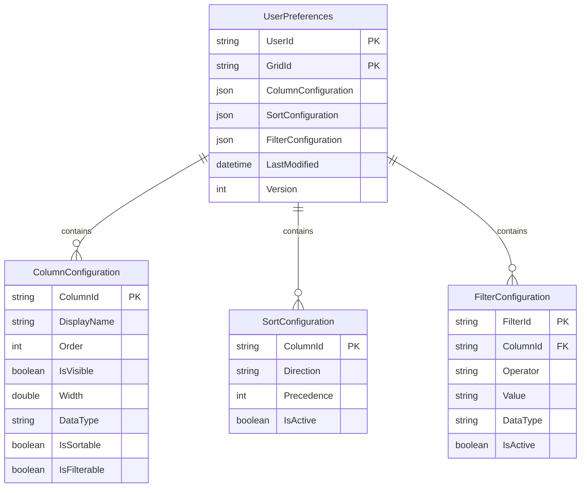
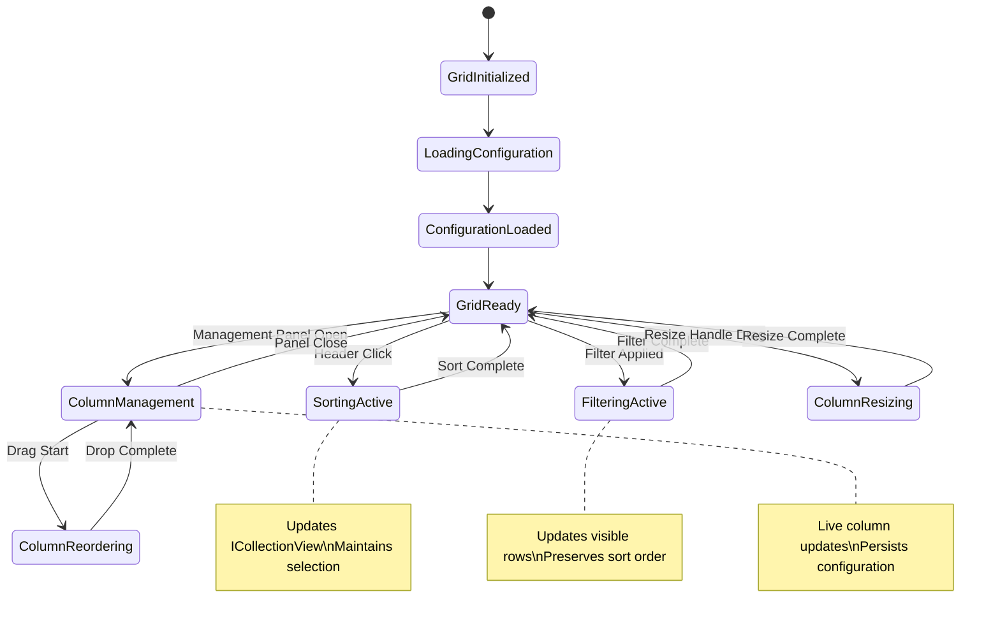

# Advanced CustomDataGrid Features - Implementation Plan

## Goal

Implement advanced data grid features (column sorting, management, resizing, and filtering) for the MTM CustomDataGrid control to provide enterprise-level functionality. This implementation will enhance the existing CustomDataGrid.axaml control with professional data manipulation capabilities while maintaining the established MTM design patterns and high performance characteristics.

## Requirements

- **Phase 2**: Column sorting with visual indicators and multi-column support
- **Phase 3**: Column management panel with visibility toggles and drag-drop reordering
- **Phase 4**: Interactive column resizing with live feedback and persistence
- **Phase 5**: Integrated filter panel with column-specific filtering capabilities
- Maintain virtual scrolling performance and existing selection functionality
- Full MTM theme integration with DynamicResource bindings
- Keyboard accessibility and ARIA compliance for all features

## Technical Considerations

### System Architecture Overview

```mermaid
graph TB
    subgraph "Frontend Layer - Avalonia UI"
        A[CustomDataGrid.axaml] --> A1[Header Grid]
        A[CustomDataGrid.axaml] --> A2[Virtual ScrollViewer]
        A[CustomDataGrid.axaml] --> A3[Column Management Panel]
        A[CustomDataGrid.axaml] --> A4[Filter Panel]
        
        A1 --> A11[Sort Indicators]
        A1 --> A12[Resize Handles]
        A2 --> A21[ListBox ItemTemplate]
        A3 --> A31[Column Toggles]
        A3 --> A32[Drag-Drop Handler]
        A4 --> A41[Filter Controls]
    end
    
    subgraph "Business Logic Layer"
        B[CustomDataGrid.axaml.cs] --> B1[Sort Manager]
        B[CustomDataGrid.axaml.cs] --> B2[Column Manager]
        B[CustomDataGrid.axaml.cs] --> B3[Filter Manager]
        B[CustomDataGrid.axaml.cs] --> B4[Layout Persistence]
        
        B1 --> B11[Multi-Column Sort Logic]
        B1 --> B12[Data Type Sort Handlers]
        B2 --> B21[Column Visibility Control]
        B2 --> B22[Drag-Drop Column Reorder]
        B3 --> B31[Filter Expression Builder]
        B3 --> B32[Column-Specific Filters]
    end
    
    subgraph "Data Layer"
        C[Configuration Models] --> C1[SortConfiguration]
        C[Configuration Models] --> C2[ColumnConfiguration]
        C[Configuration Models] --> C3[FilterConfiguration]
        C[Configuration Models] --> C4[UserPreferences]
        
        C1 --> C11[Sort Direction & Precedence]
        C2 --> C21[Column Order & Visibility]
        C3 --> C31[Filter Criteria & Operators]
        C4 --> C41[Layout Persistence Store]
    end
    
    subgraph "Integration Layer"
        D[MVVM Bindings] --> D1[Sort Commands]
        D[MVVM Bindings] --> D2[Column Management Events]
        D[MVVM Bindings] --> D3[Filter Change Notifications]
        D[MVVM Bindings] --> D4[Configuration Persistence]
    end
    
    A --> B
    B --> C
    B --> D
    C --> D
    
    classDef frontend fill:#e1f5fe
    classDef business fill:#f3e5f5
    classDef data fill:#e8f5e8
    classDef integration fill:#fff3e0
```



**Technology Stack Selection**:

- **Frontend**: Avalonia 11.3.4 with AXAML for consistent cross-platform UI
- **State Management**: MVVM Community Toolkit 8.3.2 for reactive properties and commands
- **Data Binding**: ICollectionView with ListCollectionView for sorting/filtering
- **Persistence**: JSON serialization for user preferences and configuration storage
- **Performance**: Virtual scrolling maintained through ListBox ItemTemplate pattern

**Integration Points**:

- Existing CustomDataGrid control as foundation
- MTM theme system through DynamicResource bindings  
- MVVM Community Toolkit patterns for commands and properties
- User preference system for configuration persistence

### Database Schema Design



**Table Specifications**:

- **UserPreferences**: Stores per-user grid configurations with JSON serialization
- **ColumnConfiguration**: Individual column display and behavior settings
- **SortConfiguration**: Multi-column sort state with precedence ordering
- **FilterConfiguration**: Column-specific filter criteria and operators

**Indexing Strategy**:

- Primary key indexes on UserId+GridId for fast user-specific lookups
- Composite index on ColumnId+Order for efficient column ordering
- Index on LastModified for configuration aging and cleanup

### API Design

#### Configuration Management Endpoints

```csharp
// Configuration persistence and retrieval
public interface IGridConfigurationService
{
    Task<UserGridConfiguration> GetUserConfigurationAsync(string userId, string gridId);
    Task SaveUserConfigurationAsync(string userId, string gridId, UserGridConfiguration config);
    Task<DefaultGridConfiguration> GetDefaultConfigurationAsync(string gridId);
    Task ResetUserConfigurationAsync(string userId, string gridId);
}

// Sort operation handling
public interface ISortManager
{
    void ApplySingleColumnSort(string columnId, SortDirection direction);
    void ApplyMultiColumnSort(IEnumerable<SortCriteria> sortCriteria);
    void ClearSort();
    ICollectionView GetSortedView(IEnumerable<object> data);
}

// Filter operation handling  
public interface IFilterManager
{
    void ApplyColumnFilter(string columnId, FilterCriteria criteria);
    void RemoveColumnFilter(string columnId);
    void ClearAllFilters();
    ICollectionView GetFilteredView(IEnumerable<object> data);
}
```

**Authentication and Authorization**:

- User-specific configuration access through current authentication context
- Administrative users can manage default configurations
- Configuration data isolated per user with no cross-user access

**Error Handling Strategies**:

- Graceful degradation when configuration load fails (use defaults)
- Validation of configuration data before persistence
- Rollback capability for invalid configuration attempts

### Frontend Architecture

#### Component Hierarchy Documentation

The enhanced CustomDataGrid will integrate seamlessly with the existing control structure while adding new interactive panels:

**Layout Structure:**

```
Enhanced CustomDataGrid (UserControl)
├── UserControl.Styles (Enhanced with sort/filter styling)
├── Grid MainGrid (RowDefinitions="Auto,*,Auto", ColumnDefinitions="*,Auto,Auto")
│   ├── Border HeaderSection (Grid.Row="0") - ENHANCED
│   │   └── Grid DynamicHeaderGrid (9 columns with identical sizing)
│   │       ├── Border SortableHeaderCell (with click handlers)
│   │       │   ├── TextBlock HeaderText
│   │       │   ├── MaterialIcon SortIndicator (↑↓)
│   │       │   └── Border ResizeHandle (drag target)
│   │       └── Border ActionHeaderCell (management buttons)
│   ├── ScrollViewer DataScrollViewer (Grid.Row="1") 
│   │   └── ListBox DataListBox (Virtual scrolling maintained)
│   ├── Border StatusBar (Grid.Row="2") - NEW
│   │   ├── TextBlock FilteredRowCount
│   │   ├── Button ClearFilters
│   │   └── StackPanel StatusIndicators
│   ├── Border ColumnManagementPanel (Grid.Column="1") - PHASE 3
│   │   ├── TextBlock PanelTitle "Column Management"
│   │   ├── ScrollViewer ColumnList
│   │   │   └── StackPanel DraggableColumns
│   │   │       └── Border DraggableColumnItem (repeating)
│   │   │           ├── CheckBox ColumnVisibility
│   │   │           ├── TextBlock ColumnName
│   │   │           └── MaterialIcon DragHandle
│   │   └── StackPanel ActionButtons
│   │       ├── Button ResetLayout
│   │       └── Button SaveLayout
│   └── Border FilterPanel (Grid.Column="2") - PHASE 5
│       ├── TextBlock PanelTitle "Filters"
│       ├── ScrollViewer FilterList
│       │   └── StackPanel FilterControls
│       │       └── Border FilterGroup (repeating per column)
│       │           ├── TextBlock ColumnLabel
│       │           ├── ComboBox FilterOperator
│       │           ├── Control FilterValue (type-specific)
│       │           └── Button RemoveFilter
│       └── StackPanel FilterActions
│           ├── Button ClearAllFilters
│           └── Button SaveFilterPreset
```

#### State Flow Diagram



**Component State Management**:

- **GridState**: Current view mode, active panels, loading states
- **SortState**: Active sort columns, directions, precedence
- **FilterState**: Active filters, operator selections, values
- **ColumnState**: Visibility, order, widths, resize states
- **ConfigurationState**: User preferences, default settings, persistence status

**Reusable Component Library Specifications**:

- **SortableHeaderCell**: Click-to-sort with visual indicators
- **ResizeHandle**: Drag handle with live resize feedback
- **DraggableColumnItem**: Column management with drag-drop
- **FilterControl**: Type-specific filter input (text, date, number, boolean)
- **StatusIndicator**: Filtering/sorting status with counts

### Security Performance

**Authentication/Authorization Requirements**:

- User-specific configuration access through established MTM authentication
- Administrative functions restricted to authorized roles
- Configuration data validated and sanitized before storage

**Data Validation and Sanitization**:

- Filter input validation to prevent injection attacks
- Configuration JSON schema validation before persistence
- Column width and order constraints to prevent UI corruption

**Performance Optimization Strategies**:

- Virtual scrolling maintained for large datasets (10,000+ items)
- Debounced filter operations to reduce computational overhead
- Efficient sorting algorithms with type-specific comparers
- Lazy loading of configuration data and panel content

**Caching Mechanisms**:

- In-memory caching of user configurations for session duration
- Memoized sort/filter results for repeated operations
- Configuration change batching to reduce persistence calls

## Implementation Plan

### Phase 2: Column Sorting Implementation

#### Frontend Components

```csharp
// Enhanced header cell with sort capability
public partial class SortableHeaderCell : UserControl
{
    [ObservableProperty]
    private SortDirection currentSortDirection = SortDirection.None;
    
    [ObservableProperty] 
    private bool isSecondarySorted;
    
    [RelayCommand]
    private void HandleHeaderClick(string columnId)
    {
        var sortRequest = new SortRequest 
        { 
            ColumnId = columnId,
            IsMultiColumn = Keyboard.IsKeyDown(Key.LeftShift)
        };
        
        SortRequested?.Invoke(sortRequest);
    }
}

// Sort management service
public class SortManager : ObservableObject, ISortManager
{
    [ObservableProperty]
    private ObservableCollection<SortCriteria> activeSorts = new();
    
    public ICollectionView ApplySingleColumnSort(IEnumerable<object> source, string columnId, SortDirection direction)
    {
        var view = CollectionViewSource.GetDefaultView(source);
        view.SortDescriptions.Clear();
        
        if (direction != SortDirection.None)
        {
            view.SortDescriptions.Add(new SortDescription(columnId, 
                direction == SortDirection.Ascending ? ListSortDirection.Ascending : ListSortDirection.Descending));
        }
        
        return view;
    }
}
```

#### AXAML Structure Enhancements

```xml
<!-- Enhanced header cell with sort indicators -->
<Border Grid.Column="1" Classes="header-cell sortable-header-cell">
    <Grid ColumnDefinitions="*,Auto">
        <TextBlock Grid.Column="0" Text="Part ID" />
        <StackPanel Grid.Column="1" Orientation="Horizontal" Spacing="2">
            <!-- Sort direction indicator -->
            <materialIcons:MaterialIcon Kind="ArrowUp" Width="12" Height="12"
                                        IsVisible="{Binding SortDirection, Converter={StaticResource SortDirectionToVisibilityConverter}, ConverterParameter=Ascending}" />
            <materialIcons:MaterialIcon Kind="ArrowDown" Width="12" Height="12"
                                        IsVisible="{Binding SortDirection, Converter={StaticResource SortDirectionToVisibilityConverter}, ConverterParameter=Descending}" />
        </StackPanel>
    </Grid>
    <Border.InputBindings>
        <PointerPressedEventBinding Command="{Binding SortCommand}" CommandParameter="PartId" />
    </Border.InputBindings>
</Border>
```

### Phase 3: Column Management Panel Implementation

#### Column Management Components

```csharp
// Column management panel with drag-drop support
public partial class ColumnManagementPanel : UserControl
{
    [ObservableProperty]
    private ObservableCollection<ColumnConfigurationItem> configurationItems = new();
    
    [RelayCommand]
    private async Task ReorderColumns(DragEventArgs e)
    {
        // Implement drag-drop column reordering logic
        var draggedItem = e.Data.Get("ColumnItem") as ColumnConfigurationItem;
        var targetIndex = GetDropTargetIndex(e.Position);
        
        if (draggedItem != null && targetIndex >= 0)
        {
            ConfigurationItems.Move(ConfigurationItems.IndexOf(draggedItem), targetIndex);
            await SaveConfigurationAsync();
        }
    }
    
    [RelayCommand]
    private async Task ToggleColumnVisibility(ColumnConfigurationItem item)
    {
        item.IsVisible = !item.IsVisible;
        await ApplyColumnVisibilityAsync(item);
    }
}

// Configuration persistence service
public class GridConfigurationService : IGridConfigurationService
{
    private readonly IUserPreferenceService _userPreferences;
    private readonly ILogger<GridConfigurationService> _logger;
    
    public async Task SaveUserConfigurationAsync(string userId, string gridId, UserGridConfiguration config)
    {
        try
        {
            var serializedConfig = JsonSerializer.Serialize(config);
            await _userPreferences.SavePreferenceAsync(userId, $"grid_{gridId}", serializedConfig);
            _logger.LogInformation("Saved grid configuration for user {UserId}, grid {GridId}", userId, gridId);
        }
        catch (Exception ex)
        {
            _logger.LogError(ex, "Failed to save grid configuration for user {UserId}", userId);
            throw;
        }
    }
}
```

### Phase 4: Interactive Column Resizing

#### Resizing Implementation

```csharp
// Column resize handle component
public partial class ColumnResizeHandle : UserControl
{
    private bool _isResizing;
    private double _initialWidth;
    private Point _startPoint;
    
    protected override void OnPointerPressed(PointerPressedEventArgs e)
    {
        _isResizing = true;
        _startPoint = e.Position;
        _initialWidth = TargetColumn?.Width ?? 0;
        
        this.CaptureMouse();
        Cursor = new Cursor(StandardCursorType.SizeWE);
    }
    
    protected override void OnPointerMoved(PointerEventArgs e)
    {
        if (_isResizing && TargetColumn != null)
        {
            var deltaX = e.Position.X - _startPoint.X;
            var newWidth = Math.Max(MinColumnWidth, _initialWidth + deltaX);
            
            TargetColumn.Width = newWidth;
            ColumnResized?.Invoke(new ColumnResizeEventArgs 
            { 
                ColumnId = TargetColumn.Id, 
                NewWidth = newWidth 
            });
        }
    }
}
```

### Phase 5: Integrated Filter Panel

#### Filter Panel Implementation

```csharp
// Filter panel with type-specific controls
public partial class FilterPanel : UserControl
{
    [ObservableProperty]
    private ObservableCollection<ColumnFilterGroup> filterGroups = new();
    
    [RelayCommand]
    private async Task ApplyColumnFilter(ColumnFilterRequest request)
    {
        var filterCriteria = new FilterCriteria
        {
            ColumnId = request.ColumnId,
            Operator = request.Operator,
            Value = request.Value,
            DataType = request.DataType
        };
        
        await _filterManager.ApplyColumnFilterAsync(filterCriteria);
        await RefreshFilteredDataAsync();
    }
    
    [RelayCommand]
    private async Task ClearAllFilters()
    {
        FilterGroups.Clear();
        await _filterManager.ClearAllFiltersAsync();
        await RefreshFilteredDataAsync();
    }
}

// Type-specific filter controls
public class TextFilterControl : UserControl
{
    // Text input with Contains/Equals/StartsWith operators
}

public class NumericFilterControl : UserControl  
{
    // Numeric input with Equals/GreaterThan/LessThan/Between operators
}

public class DateFilterControl : UserControl
{
    // Date picker with Before/After/Between operators
}

public class BooleanFilterControl : UserControl
{
    // CheckBox for True/False/All states
}
```

## Implementation Timeline

### Phase 2 - Column Sorting (Week 1-2)

- **Week 1**: Sort manager implementation and basic click-to-sort
- **Week 2**: Multi-column sorting, visual indicators, performance optimization

### Phase 3 - Column Management (Week 3-4)  

- **Week 3**: Column management panel UI and visibility toggles
- **Week 4**: Drag-drop reordering, configuration persistence

### Phase 4 - Column Resizing (Week 5)

- **Week 5**: Resize handles, live resizing, width persistence

### Phase 5 - Filter Panel (Week 6-7)

- **Week 6**: Filter panel UI and basic filtering
- **Week 7**: Type-specific filter controls, filter presets

### Integration & Testing (Week 8)

- **Week 8**: End-to-end testing, performance validation, documentation

## Acceptance Criteria Validation

Each phase includes comprehensive testing to ensure:

- **Performance**: All operations complete within specified time limits
- **Usability**: Keyboard accessibility and intuitive interactions
- **Integration**: Seamless integration with existing CustomDataGrid functionality
- **Persistence**: Configuration changes persist across sessions
- **Theme Compliance**: All new UI elements follow MTM design system patterns

## Risk Mitigation

- **Performance Risk**: Maintain virtual scrolling and implement operation debouncing
- **Complexity Risk**: Implement features incrementally with thorough testing
- **User Experience Risk**: Provide clear visual feedback for all operations
- **Integration Risk**: Extensive testing with existing MTM inventory workflows
