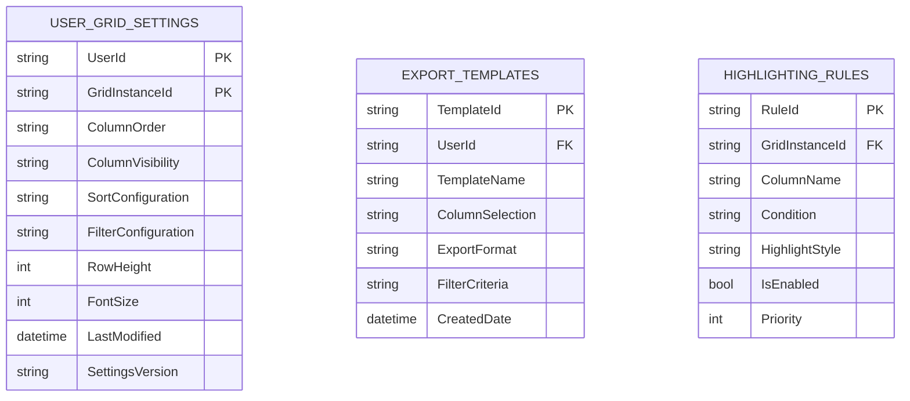
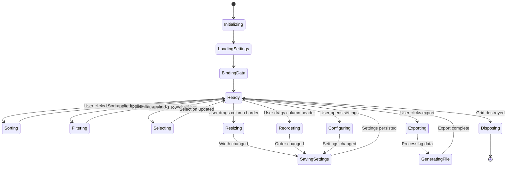

# MTM Custom Data Grid Control - Implementation Plan

## Goal

Implement a high-performance, customizable data grid control using Avalonia's ItemsRepeater to replace standard DataGrid implementations across MTM's inventory management views. The solution will provide superior performance for large datasets (5000+ items), extensive customization capabilities, persistent user preferences, and consistent user experience while maintaining the existing MVVM Community Toolkit patterns and MTM design system integration.

## Requirements

### Implementation Plan Specifics

#### Phase 1: Core Infrastructure (Week 1-2)
- ItemsRepeater-based grid foundation with virtual scrolling
- Basic column definition system and data binding
- MTM design system integration
- Dependency injection setup

#### Phase 2: Selection and Actions (Week 3)
- Multi-selection with checkboxes
- Row action buttons (delete, context menu)
- Selection state management

#### Phase 3: Column Management (Week 4-5)
- Show/hide columns functionality
- Drag-and-drop column reordering
- Column width resizing
- Sticky header implementation

#### Phase 4: Sorting and Filtering (Week 6)
- Single and multi-column sorting
- Per-column filtering capabilities
- Sort indicators and filter UI

#### Phase 5: Settings Persistence (Week 7)
- User settings service
- CollapsiblePanel settings UI
- Per-view configuration storage

#### Phase 6: Export and Polish (Week 8)
- CSV/Excel/PDF export functionality
- Visual enhancements and highlighting rules
- Performance optimization and testing

## Technical Considerations

### System Architecture Overview

```mermaid
graph TB
    subgraph "Presentation Layer"
        A[CustomDataGrid.axaml] --> B[CustomDataGridViewModel]
        C[RemoveTabView] --> A
        D[TransferTabView] --> A
        E[InventoryTabView] --> A
    end
    
    subgraph "Business Logic Layer"
        F[CustomDataGridService] --> G[DataGridSettingsService]
        H[ExportService] --> I[FilteringService]
        J[SortingService] --> K[ColumnManagementService]
        B --> F
    end
    
    subgraph "Data Layer"
        L[ObservableCollection<T>] --> M[CollectionView]
        N[SettingsStorage] --> O[AppData/UserProfile]
        G --> N
    end
    
    subgraph "Infrastructure Layer"
        P[MTM Design System] --> A
        Q[MVVM Community Toolkit] --> B
        R[Avalonia ItemsRepeater] --> A
    end
    
    A --|Data Binding| L
    B --|Commands| F
    F --|Persistence| G
    I --|Collection Updates| M
    J --|Collection Updates| M
```

### Technology Stack Selection

#### Frontend Layer (Avalonia/.NET 8)
- **ItemsRepeater**: Chosen for virtual scrolling performance and customization flexibility over DataGrid
- **MVVM Community Toolkit**: Maintains consistency with existing codebase patterns
- **DynamicResource**: Theme integration and runtime style updates
- **CollectionView**: Advanced sorting, filtering, and grouping capabilities

#### Business Logic Layer
- **Service-Oriented Architecture**: Follows established MTM patterns for maintainability
- **Dependency Injection**: Microsoft.Extensions.DI for service lifecycle management
- **Command Pattern**: RelayCommand for user interactions and undo/redo capability
- **Observer Pattern**: PropertyChanged notifications for reactive UI updates

#### Data Persistence Layer
- **JSON Configuration Files**: User settings stored in AppData for simplicity and portability
- **Per-View Configuration**: Isolated settings per grid implementation (RemoveTabView vs TransferTabView)
- **Validation Layer**: Settings integrity checks and migration support

### Integration Points

#### MVVM Community Toolkit Integration
```csharp
// Pseudocode for ViewModel integration
[ObservableObject]
public partial class CustomDataGridViewModel : BaseViewModel
{
    [ObservableProperty] private ObservableCollection<object> itemsSource;
    [ObservableProperty] private ObservableCollection<object> selectedItems;
    [ObservableProperty] private CustomDataGridColumn[] columnDefinitions;
    
    [RelayCommand] private async Task DeleteSelectedItemsAsync();
    [RelayCommand] private async Task ExportDataAsync(ExportFormat format);
}
```

#### MTM Design System Integration
- Dynamic resource binding for all colors and styles
- Theme-aware highlighting rules
- Consistent spacing and typography
- Material Icons for action buttons and indicators

### Database Schema Design

#### Settings Storage Schema


#### Settings File Structure
```json
{
  "userId": "JKOLL",
  "gridConfigurations": {
    "RemoveTabView": {
      "columnOrder": ["PartID", "Location", "Quantity", "ReceiveDate"],
      "columnVisibility": { "BatchNumber": false, "Notes": false },
      "sortConfiguration": [
        { "column": "ReceiveDate", "direction": "Descending", "priority": 1 }
      ],
      "displaySettings": {
        "rowHeight": "Normal",
        "fontSize": 12,
        "alternatingRows": true
      }
    }
  }
}
```

### Frontend Architecture

#### Component Hierarchy Documentation

The component structure leverages Avalonia UserControls and follows MTM design patterns:

```
CustomDataGrid (UserControl)
├── Grid (Root Container)
│   ├── HeaderSection (Border with sticky positioning)
│   │   ├── ColumnHeaders (ItemsControl)
│   │   │   ├── HeaderCell (Custom Control)
│   │   │   │   ├── HeaderContent (TextBlock)
│   │   │   │   ├── SortIndicator (MaterialIcon)
│   │   │   │   ├── FilterIndicator (MaterialIcon)
│   │   │   │   └── ResizeGrip (Thumb)
│   │   │   └── ColumnDragAdorner (Canvas overlay)
│   │   └── ToolbarPanel (StackPanel)
│   │       ├── SortControls (ComboBox)
│   │       ├── FilterToggle (ToggleButton)
│   │       └── ColumnVisibilityMenu (Flyout)
│   ├── DataSection (ScrollViewer with virtual scrolling)
│   │   └── RowsContainer (ItemsRepeater)
│   │       └── DataRow (Custom Control)
│   │           ├── SelectionCheckbox (CheckBox - conditional)
│   │           ├── CellsContainer (ItemsControl)
│   │           │   └── DataCell (ContentPresenter)
│   │           └── ActionsPanel (StackPanel - right aligned)
│   │               ├── DeleteButton (Button with trash icon)
│   │               └── ContextMenuButton (Button)
│   └── SettingsPanel (CollapsiblePanel)
│       ├── DisplaySettings (StackPanel)
│       │   ├── RowDensityComboBox
│       │   ├── FontSizeSlider
│       │   └── ThemeToggleButtons
│       ├── ColumnSettings (StackPanel)
│       │   ├── VisibilityCheckBoxes
│       │   └── OrderManagementList
│       └── ExportSettings (StackPanel)
│           ├── FormatSelection (RadioButtons)
│           ├── ColumnSelection (CheckBoxes)
│           └── ExportButton
```

#### State Flow Diagram



#### Reusable Component Specifications

##### CustomDataGridColumn Model
```csharp
public class CustomDataGridColumn
{
    public string PropertyName { get; set; }
    public string DisplayName { get; set; }
    public Type DataType { get; set; }
    public bool IsVisible { get; set; } = true;
    public double Width { get; set; } = double.NaN;
    public bool CanSort { get; set; } = true;
    public bool CanFilter { get; set; } = true;
    public bool CanResize { get; set; } = true;
    public DataTemplate CellTemplate { get; set; }
    public IValueConverter CellConverter { get; set; }
    public string StringFormat { get; set; }
}
```

##### Selection Management Service
```csharp
public interface ISelectionManager<T>
{
    ObservableCollection<T> SelectedItems { get; }
    T SelectedItem { get; set; }
    bool IsMultiSelectEnabled { get; set; }
    void SelectAll();
    void ClearSelection();
    void ToggleSelection(T item);
    event EventHandler<SelectionChangedEventArgs> SelectionChanged;
}
```

#### State Management Patterns

##### Settings Management
- **Centralized Settings Service**: Single source of truth for all grid configurations
- **Reactive Updates**: Settings changes immediately reflected in UI
- **Validation**: Input validation and error handling for corrupted settings
- **Migration**: Support for settings schema upgrades

##### Performance Optimization
- **Virtual Scrolling**: Only render visible rows to handle large datasets
- **Data Virtualization**: Load data on-demand for extremely large collections
- **Debounced Updates**: Batch rapid changes (typing, scrolling) to prevent UI freezing
- **Memory Management**: Proper disposal of event handlers and resources

### Security & Performance

#### Performance Optimization Strategies

##### Rendering Performance
- **ItemsRepeater Virtualization**: Efficient rendering of large datasets
- **Template Caching**: Reuse cell templates to minimize object creation
- **Background Threading**: Move heavy operations off UI thread
- **Lazy Loading**: Load column templates and converters on demand

##### Memory Management
- **Weak Event Patterns**: Prevent memory leaks from event subscriptions
- **Disposable Pattern**: Proper cleanup of resources and subscriptions
- **Object Pooling**: Reuse cell controls to minimize GC pressure
- **Data Binding Optimization**: Use OneTime binding where appropriate

#### Data Validation and Sanitization
- **Input Validation**: Validate all user settings before persistence
- **Type Safety**: Strong typing for all data operations
- **Null Handling**: Graceful handling of null and empty values
- **Format Validation**: Validate export formats and file paths

#### Caching Mechanisms
- **Settings Cache**: In-memory cache of user preferences
- **Column Template Cache**: Compiled templates for performance
- **Sort/Filter Cache**: Cache computed sort and filter operations
- **Export Template Cache**: Reuse export configurations

## File System Structure

```
MTM_WIP_Application_Avalonia/
├── Controls/
│   ├── CustomDataGrid/
│   │   ├── CustomDataGrid.axaml
│   │   ├── CustomDataGrid.axaml.cs
│   │   ├── CustomDataGridColumn.cs
│   │   ├── HeaderCell.axaml
│   │   ├── HeaderCell.axaml.cs
│   │   ├── DataCell.axaml
│   │   ├── DataCell.axaml.cs
│   │   └── SettingsPanel.axaml
│   └── SettingsPanel.axaml.cs
├── ViewModels/
│   └── Shared/
│       ├── CustomDataGridViewModel.cs
│       ├── ColumnDefinitionViewModel.cs
│       └── GridSettingsViewModel.cs
├── Services/
│   ├── DataGridSettingsService.cs
│   ├── ExportService.cs
│   ├── FilteringService.cs
│   ├── SortingService.cs
│   └── ColumnManagementService.cs
├── Models/
│   ├── CustomDataGridColumn.cs
│   ├── GridSettings.cs
│   ├── ExportConfiguration.cs
│   ├── FilterCriteria.cs
│   └── SortConfiguration.cs
├── Converters/
│   ├── DataTypeToTemplateConverter.cs
│   ├── HighlightRuleConverter.cs
│   └── ColumnVisibilityConverter.cs
└── Extensions/
    ├── ItemsRepeaterExtensions.cs
    └── CollectionViewExtensions.cs
```

## Implementation Phases

### Phase 1: Core Infrastructure (Weeks 1-2)
**Deliverables:**
- Basic CustomDataGrid UserControl with ItemsRepeater
- Column definition system and data binding
- Basic styling integration with MTM design system
- Service registration and dependency injection setup

**Technical Tasks:**
- Create CustomDataGrid UserControl with proper XAML structure
- Implement CustomDataGridColumn model and collection management
- Set up data binding with ObservableCollection support
- Integrate MTM theme resources and styling
- Create base ViewModel with MVVM Community Toolkit

### Phase 2: Selection and Actions (Week 3)
**Deliverables:**
- Multi-selection with configurable checkboxes
- Row action buttons (delete, context menu)
- Selection state binding to parent ViewModels

**Technical Tasks:**
- Implement selection manager service
- Add checkbox column with visibility binding
- Create action button templates and command binding
- Implement context menu framework
- Add selection changed event handling

### Phase 3: Column Management (Weeks 4-5)
**Deliverables:**
- Show/hide column functionality
- Drag-and-drop column reordering
- Column width resizing with mouse
- Sticky header implementation

**Technical Tasks:**
- Create column visibility management UI
- Implement drag-and-drop adorner system
- Add column resize grips and logic
- Implement sticky header with proper z-index
- Create column management settings panel

### Phase 4: Sorting and Filtering (Week 6)
**Deliverables:**
- Single and multi-column sorting
- Per-column text and range filtering
- Sort indicators in headers
- Filter UI integration

**Technical Tasks:**
- Implement sorting service with CollectionView integration
- Create filter UI components (text boxes, date pickers)
- Add sort indicator icons and state management
- Implement multi-column sort with priority
- Create filter criteria persistence

### Phase 5: Settings Persistence (Week 7)
**Deliverables:**
- User settings service with file persistence
- CollapsiblePanel settings UI
- Per-view configuration isolation

**Technical Tasks:**
- Create settings service with JSON persistence
- Implement settings validation and migration
- Build comprehensive settings UI panel
- Add per-grid-instance configuration support
- Create settings import/export functionality

### Phase 6: Export and Polish (Week 8)
**Deliverables:**
- CSV/Excel/PDF export with column selection
- Visual highlighting rules and themes
- Performance optimization and comprehensive testing

**Technical Tasks:**
- Implement export service with format support
- Create export UI with column and data selection
- Add highlighting rules engine and configuration
- Optimize performance for large datasets
- Comprehensive testing and bug fixes
- Documentation and deployment preparation
