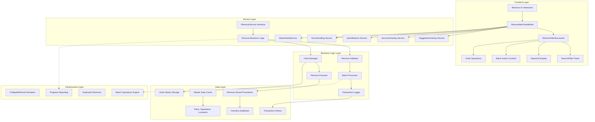
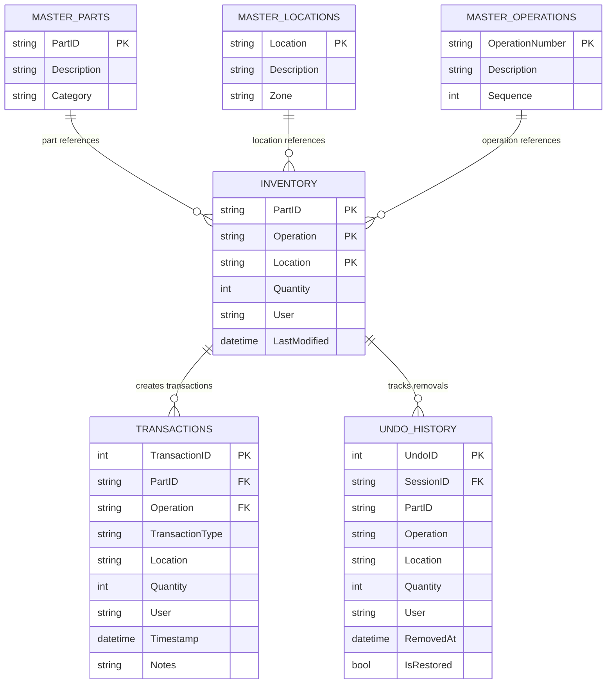
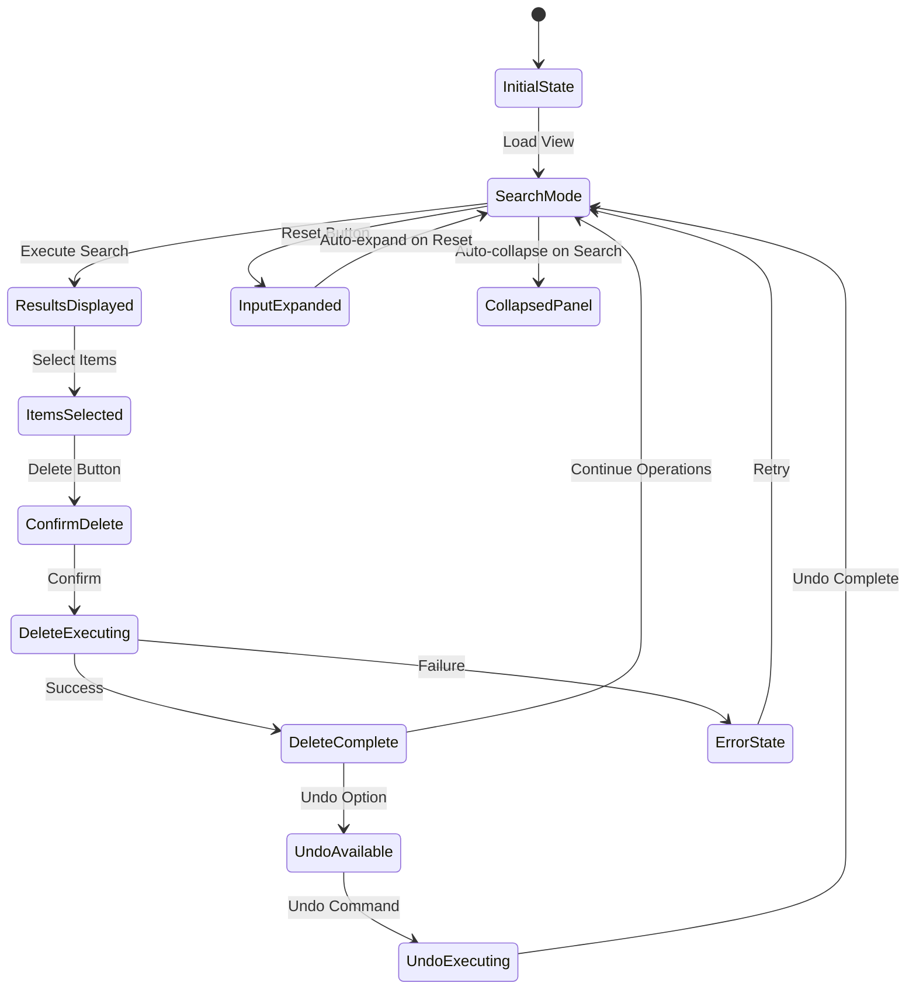

# Remove Service Implementation Plan

**Generated by**: Industry-veteran Software Engineer  
**Type**: Feature Implementation Plan  
**Target Framework**: .NET 8 Avalonia MVVM Application  
**Documentation Date**: 2025-01-09

## Goal

Implement a comprehensive Remove Service for the MTM WIP Application Avalonia that provides DataGrid-centric inventory removal capabilities with batch operations, comprehensive transaction logging, and professional user feedback. The service will integrate seamlessly with the existing RemoveItemViewModel (769 lines of business logic), supporting single and multi-row deletion operations with complete audit trails and undo functionality.

## Requirements

### Functional Requirements
- **DataGrid-Centric Layout**: Primary focus on inventory display with search/filter inputs positioned above DataGrid
- **Batch Operations**: Multi-row selection with batch deletion capabilities and progress indication
- **CollapsiblePanel Integration**: Auto-collapse on Search, auto-expand on Reset with smooth animations
- **SuggestionOverlay Integration**: Replace all ComboBoxes with TextBoxes + SuggestionOverlay for Part ID, Operation, and Location fields
- **Transaction Logging**: ALL removals create "OUT" transactions with complete audit trails
- **Undo Functionality**: Restore last deleted items with view-based undo capability
- **QuickButtons Integration**: Field population and RED-coded history logging for OUT operations
- **Success/Progress Feedback**: Professional user feedback with SuccessOverlay and MainView status bar integration

### Technical Requirements
- **MVVM Community Toolkit**: Use established patterns with `[ObservableProperty]` and `[RelayCommand]`
- **Avalonia UI Framework**: Native Avalonia controls with proper AXAML syntax following InventoryTabView patterns
- **Existing ViewModel Integration**: Leverage comprehensive RemoveItemViewModel (769 lines) with complete business logic
- **Service Integration**: Integration with SuggestionOverlay, SuccessOverlay, QuickButtons, and ErrorHandling services
- **Database Operations**: Use existing stored procedures for removal operations with atomic transaction handling
- **Theme Consistency**: Full MTM design system integration with 19-theme compatibility

## Technical Considerations

### System Architecture Overview



**Technology Stack Selection**:
- **Frontend**: Avalonia 11.3.4 with AXAML for cross-platform UI consistency
- **MVVM Framework**: MVVM Community Toolkit 8.3.2 for modern property/command patterns
- **Remove Logic**: Existing RemoveItemViewModel with 769 lines of comprehensive business logic
- **Database**: MySQL stored procedures for atomic removal operations with rollback capability
- **Validation**: Real-time input validation with visual feedback

**Integration Points**:
- RemoveItemViewModel: Complete 769-line business logic implementation ready for UI connection
- SuggestionOverlay: Fuzzy matching for Part ID, exact matching for Operations and Locations
- SuccessOverlay: Removal confirmation with item details and transaction information
- QuickButtons: Field population and red-coded OUT history logging
- CollapsiblePanel: Auto-collapse/expand behavior for optimal screen usage
- ErrorHandling: Centralized error management for all removal operations

**Deployment Architecture**:
- Existing ViewModel already implemented with comprehensive removal capabilities
- UI implementation connects to established business logic patterns
- Service integrations follow existing MTM patterns

**Scalability Considerations**:
- Efficient DataGrid rendering for large inventory datasets
- Asynchronous removal operations to prevent UI blocking
- Memory-efficient batch processing for multiple item operations
- Optimized suggestion caching for responsive overlay performance

### Database Schema Design

**Note**: Remove operations use existing inventory and transaction tables with established stored procedures.



**Remove Transaction Logic**:
- `TransactionType`: Always "OUT" for inventory removals
- `Location`: Source location of removed item
- `Quantity`: Amount removed (partial or complete removal)
- `Notes`: Reason for removal or additional context
- Operation numbers ("90", "100", "110") are workflow steps, NOT transaction type indicators

**Database Operations**:
- Single Removal: Delete inventory record, create OUT transaction
- Batch Removal: Process multiple records atomically with transaction rollback capability
- Undo Operation: Restore inventory from undo history, create IN transaction for restoration
- Audit Trail: Complete tracking of all removal operations with user attribution

### API Design

**Remove Service Interface Design**:

```csharp
public interface IRemoveService
{
    // Remove operation execution
    Task<RemovalResult> ExecuteRemovalAsync(RemovalRequest request);
    Task<BatchRemovalResult> ExecuteBatchRemovalAsync(List<RemovalRequest> requests);
    
    // Undo functionality
    Task<UndoResult> UndoLastRemovalAsync(string sessionId);
    Task<List<UndoHistoryItem>> GetUndoHistoryAsync(string sessionId);
    
    // Search and filtering
    Task<List<InventoryItem>> GetRemovalCandidatesAsync(string partId = "", string operation = "", string location = "");
    
    // Master data for suggestions
    Task<List<string>> GetAvailablePartsAsync();
    Task<List<string>> GetAvailableOperationsAsync();
    Task<List<string>> GetAvailableLocationsAsync();
    
    // Validation
    Task<ValidationResult> ValidateRemovalAsync(string partId, string operation, string location, int quantity);
    
    // Event notifications
    event EventHandler<RemovalCompletedEventArgs> RemovalCompleted;
    event EventHandler<RemovalErrorEventArgs> RemovalError;
    event EventHandler<UndoCompletedEventArgs> UndoCompleted;
}
```

**Request/Response Formats**:

```csharp
public class RemovalRequest
{
    public string PartId { get; set; } = string.Empty;
    public string Operation { get; set; } = string.Empty;
    public string Location { get; set; } = string.Empty;
    public int Quantity { get; set; }
    public string User { get; set; } = string.Empty;
    public string Reason { get; set; } = string.Empty;
    public bool IsCompleteRemoval { get; set; } // Remove entire quantity
}

public class RemovalResult
{
    public bool Success { get; set; }
    public string Message { get; set; } = string.Empty;
    public string TransactionId { get; set; } = string.Empty;
    public RemovalSummary Summary { get; set; } = new();
}

public class InventoryItem
{
    public string PartId { get; set; } = string.Empty;
    public string Operation { get; set; } = string.Empty;
    public string Location { get; set; } = string.Empty;
    public int Quantity { get; set; }
    public string Notes { get; set; } = string.Empty;
    public string User { get; set; } = string.Empty;
    public DateTime LastModified { get; set; }
}

public class UndoHistoryItem
{
    public string PartId { get; set; } = string.Empty;
    public string Operation { get; set; } = string.Empty;
    public string Location { get; set; } = string.Empty;
    public int Quantity { get; set; }
    public DateTime RemovedAt { get; set; }
    public bool CanUndo { get; set; }
}
```

**Error Handling Strategies**:
- Database failures: Transaction rollback with detailed error reporting
- Validation errors: Real-time feedback with specific error messages
- Batch operation failures: Partial success handling with detailed results
- Concurrent modifications: Optimistic concurrency handling with retry logic

### Frontend Architecture

#### Component Hierarchy Documentation

**Layout Structure leveraging Avalonia UI components:**

```
Remove Tab View (Following InventoryTabView Pattern)
├── ScrollViewer (Root - prevents overflow)
│   └── Main Grid (RowDefinitions="*,Auto")
│       ├── Content Area (Grid Row="*")
│       │   ├── CollapsiblePanel (Search/Filter Area)
│       │   │   ├── Search Row (First Grid Row)
│       │   │   │   ├── Part ID TextBox (with SuggestionOverlay)
│       │   │   │   ├── Operation TextBox (with SuggestionOverlay)
│       │   │   │   ├── Location TextBox (with SuggestionOverlay - optional)
│       │   │   │   ├── Search Button (Primary Style)
│       │   │   │   └── Reset Button (Secondary Style)
│       │   │   └── Advanced Filters (Second Grid Row - expandable)
│       │   │       ├── User Filter TextBox
│       │   │       ├── Date Range Filters
│       │   │       └── Quantity Range Filters
│       │   └── DataGrid Section (Inventory Display)
│       │       ├── Header Section (Title + Selection Summary)
│       │       ├── DataGrid (Multi-Selection Enabled)
│       │       │   ├── Selection Column (CheckBox)
│       │       │   ├── Location Column (Sortable)
│       │       │   ├── PartID Column (Sortable)
│       │       │   ├── Operation Column (Sortable)
│       │       │   ├── Quantity Column (Sortable)
│       │       │   └── Notes Column (Sortable)
│       │       └── Empty State ("Nothing Found" Visual)
│       └── Action Panel (Grid Row="Auto")
│           ├── Selection Actions (Left)
│           │   ├── Select All Button
│           │   ├── Select None Button
│           │   └── Invert Selection Button
│           ├── Primary Actions (Center)
│           │   ├── Delete Selected Button (Danger Style)
│           │   ├── Undo Button (Secondary Style)
│           │   └── Print Button (Secondary Style)
│           └── Panel Controls (Right)
│               ├── QuickButtons Toggle
│               └── Advanced Features Toggle
```

**State Flow Diagram**:



**Component State Management**:
- RemoveItemViewModel: Existing 769-line implementation with complete business logic
- CollapsiblePanel: Auto-collapse on Search, auto-expand on Reset
- SuggestionOverlay: Real-time filtering for Part ID (fuzzy), Operation/Location (exact)
- DataGrid: Multi-selection with batch operations support
- Undo System: Session-based undo history with restoration capabilities

#### Remove UI Component Specifications

**DataGrid Multi-Selection Implementation**:

```xml
<DataGrid x:Name="InventoryDataGrid"
          ItemsSource="{Binding InventoryItems}"
          SelectedItems="{Binding SelectedInventoryItems}"
          SelectionMode="Extended"
          IsReadOnly="True"
          GridLinesVisibility="Horizontal"
          HeadersVisibility="Column"
          CanUserReorderColumns="True"
          CanUserSortColumns="True">
    
    <DataGrid.Columns>
        <DataGridCheckBoxColumn Header="Select" 
                                Binding="{Binding IsSelected}"
                                Width="60" />
        <DataGridTextColumn Header="Location" 
                            Binding="{Binding Location}" 
                            Width="*" 
                            CanUserSort="True" />
        <DataGridTextColumn Header="Part ID" 
                            Binding="{Binding PartId}" 
                            Width="*" 
                            CanUserSort="True" />
        <DataGridTextColumn Header="Operation" 
                            Binding="{Binding Operation}" 
                            Width="100" 
                            CanUserSort="True" />
        <DataGridTextColumn Header="Quantity" 
                            Binding="{Binding Quantity}" 
                            Width="100" 
                            CanUserSort="True" />
        <DataGridTextColumn Header="Notes" 
                            Binding="{Binding Notes}" 
                            Width="*" 
                            CanUserSort="True" />
    </DataGrid.Columns>
    
</DataGrid>
```

**SuggestionOverlay Integration Pattern**:

```xml
<TextBox x:Name="PartIdTextBox"
         Text="{Binding PartId}"
         Watermark="Enter Part ID..."
         ToolTip.Tip="Start typing to see part suggestions"
         Classes="input-field">
    <TextBox.Styles>
        <Style Selector="TextBox:focus">
            <Setter Property="behaviors:SuggestionOverlay.IsEnabled" Value="True" />
            <Setter Property="behaviors:SuggestionOverlay.SuggestionSource" Value="{Binding PartSuggestions}" />
            <Setter Property="behaviors:SuggestionOverlay.FilterMode" Value="Fuzzy" />
        </Style>
    </TextBox.Styles>
</TextBox>
```

**CollapsiblePanel Integration**:

```xml
<CollapsiblePanel x:Name="SearchPanel"
                  Header="Search & Filter Options"
                  IsExpanded="{Binding IsSearchPanelExpanded}"
                  CollapseOnSearch="{Binding IsSearchExecuted}"
                  ExpandOnReset="{Binding IsResetExecuted}">
    <!-- Search and Filter Content -->
</CollapsiblePanel>
```

### Critical Business Logic Requirements

#### Transaction Type Logic (CRITICAL)

**All inventory removals MUST create "OUT" transactions**:

```csharp
// ✅ CORRECT: Remove operation classification
public TransactionType DetermineTransactionType(RemovalOperation operation)
{
    // ALL inventory removals are OUT type regardless of operation numbers
    return TransactionType.OUT; // Always OUT for removals
}

// ❌ WRONG: Don't use operation numbers to determine transaction type
public TransactionType DetermineTransactionType_WRONG(string operationNumber)
{
    return operationNumber switch
    {
        "90" => TransactionType.IN,    // WRONG - operations are workflow steps
        "100" => TransactionType.OUT,  // WRONG - not transaction indicators
        _ => TransactionType.TRANSFER  // WRONG - should always be OUT
    };
}
```

**Operation Numbers as Workflow Steps**:
- "90", "100", "110", "120": Manufacturing workflow sequence identifiers
- NOT transaction type indicators
- Used for inventory organization and process tracking
- Remove operations preserve operation context in transaction logs

#### Batch Operations Logic

**Multi-Item Removal with Atomic Transactions**:

```csharp
public async Task<BatchRemovalResult> ExecuteBatchRemovalAsync(List<RemovalRequest> requests)
{
    using var transaction = await _database.BeginTransactionAsync();
    
    try
    {
        var results = new List<RemovalResult>();
        var undoItems = new List<UndoHistoryItem>();
        
        foreach (var request in requests)
        {
            // Validate each item before processing
            var validation = await ValidateRemovalAsync(request);
            if (!validation.IsValid)
            {
                throw new InvalidOperationException($"Validation failed for {request.PartId}: {validation.ErrorMessage}");
            }
            
            // Store for undo before removal
            var undoItem = await CreateUndoHistoryItemAsync(request);
            undoItems.Add(undoItem);
            
            // Execute individual removal
            var result = await ExecuteIndividualRemovalAsync(request);
            results.Add(result);
            
            // Log as OUT transaction
            await LogTransactionAsync(new TransactionLog
            {
                Type = "OUT",
                PartId = request.PartId,
                Operation = request.Operation,
                Location = request.Location,
                Quantity = request.Quantity,
                User = request.User
            });
        }
        
        // Save undo history for session
        await SaveUndoHistoryAsync(undoItems);
        
        await transaction.CommitAsync();
        
        return new BatchRemovalResult
        {
            Success = true,
            ProcessedItems = results.Count,
            FailedItems = 0,
            Results = results
        };
    }
    catch (Exception ex)
    {
        await transaction.RollbackAsync();
        await Services.ErrorHandling.HandleErrorAsync(ex, "Batch removal failed");
        
        return new BatchRemovalResult
        {
            Success = false,
            ErrorMessage = ex.Message
        };
    }
}
```

#### Undo System Implementation

**Session-Based Undo with Restoration**:

```csharp
public async Task<UndoResult> UndoLastRemovalAsync(string sessionId)
{
    try
    {
        var undoItems = await GetLatestUndoHistoryAsync(sessionId);
        
        if (!undoItems.Any())
        {
            return new UndoResult
            {
                Success = false,
                Message = "No items available for undo"
            };
        }
        
        using var transaction = await _database.BeginTransactionAsync();
        
        foreach (var undoItem in undoItems)
        {
            // Restore inventory item
            await RestoreInventoryItemAsync(undoItem);
            
            // Log as IN transaction (restoration)
            await LogTransactionAsync(new TransactionLog
            {
                Type = "IN",
                PartId = undoItem.PartId,
                Operation = undoItem.Operation,
                Location = undoItem.Location,
                Quantity = undoItem.Quantity,
                User = CurrentUser,
                Notes = "Undo restoration"
            });
            
            // Mark as restored
            await MarkUndoItemAsRestoredAsync(undoItem.UndoId);
        }
        
        await transaction.CommitAsync();
        
        return new UndoResult
        {
            Success = true,
            RestoredItems = undoItems.Count,
            Message = $"Successfully restored {undoItems.Count} items"
        };
    }
    catch (Exception ex)
    {
        await Services.ErrorHandling.HandleErrorAsync(ex, "Undo operation failed");
        return new UndoResult
        {
            Success = false,
            Message = "Undo operation failed"
        };
    }
}
```

## Implementation Plan Details

### Phase 1: UI Structure Implementation (Days 1-3)

#### Remove View Implementation

**File**: `Views/RemoveTabView.axaml` (Update existing structure)

```xml
<UserControl xmlns="https://github.com/avaloniaui"
             xmlns:x="http://schemas.microsoft.com/winfx/2006/xaml"
             xmlns:vm="using:MTM_WIP_Application_Avalonia.ViewModels.MainForm"
             xmlns:behaviors="using:MTM_WIP_Application_Avalonia.Behaviors"
             xmlns:controls="using:MTM_WIP_Application_Avalonia.Controls"
             xmlns:materialIcons="clr-namespace:Material.Icons.Avalonia;assembly=Material.Icons.Avalonia"
             x:Class="MTM_WIP_Application_Avalonia.Views.MainForm.RemoveTabView"
             x:DataType="vm:RemoveItemViewModel">

    <ScrollViewer HorizontalScrollBarVisibility="Auto" VerticalScrollBarVisibility="Auto">
        <Grid x:Name="MainContainer" RowDefinitions="*,Auto" MinWidth="600" MinHeight="400" Margin="8">
            
            <!-- Content Border with Remove Layout -->
            <Border Grid.Row="0" Background="{DynamicResource MTM_Shared_Logic.CardBackgroundBrush}"
                    BorderBrush="{DynamicResource MTM_Shared_Logic.BorderLightBrush}" 
                    BorderThickness="1" CornerRadius="8" Padding="16" Margin="0,0,0,8">
                
                <Grid RowDefinitions="Auto,*">
                    
                    <!-- CollapsiblePanel for Search Controls -->
                    <controls:CollapsiblePanel Grid.Row="0" 
                                               Header="Search & Filter Options"
                                               IsExpanded="{Binding IsSearchPanelExpanded}"
                                               Margin="0,0,0,16">
                        
                        <StackPanel Spacing="12">
                            
                            <!-- Search Fields Row -->
                            <Grid ColumnDefinitions="*,*,*,Auto,Auto" ColumnGap="12">
                                
                                <!-- Part ID Search -->
                                <TextBox Grid.Column="0"
                                         Text="{Binding PartId}"
                                         Watermark="Enter Part ID..."
                                         ToolTip.Tip="Start typing to see part suggestions"
                                         Classes="input-field">
                                    <behaviors:TextBoxFuzzyValidationBehavior ValidationSource="{Binding PartSuggestions}" />
                                </TextBox>
                                
                                <!-- Operation Search -->
                                <TextBox Grid.Column="1"
                                         Text="{Binding Operation}"
                                         Watermark="Enter Operation..."
                                         ToolTip.Tip="Start typing to see operation suggestions"
                                         Classes="input-field">
                                    <behaviors:TextBoxFuzzyValidationBehavior ValidationSource="{Binding OperationSuggestions}" />
                                </TextBox>
                                
                                <!-- Location Search (Optional) -->
                                <TextBox Grid.Column="2"
                                         Text="{Binding Location}"
                                         Watermark="Enter Location..."
                                         ToolTip.Tip="Start typing to see location suggestions"
                                         Classes="input-field">
                                    <behaviors:TextBoxFuzzyValidationBehavior ValidationSource="{Binding LocationSuggestions}" />
                                </TextBox>
                                
                                <!-- Search Button -->
                                <Button Grid.Column="3" Content="Search" 
                                        Command="{Binding SearchCommand}"
                                        Background="{DynamicResource MTM_Shared_Logic.PrimaryButtonBackgroundBrush}"
                                        Foreground="White" Padding="16,8"
                                        ToolTip.Tip="Execute search (F5)" />
                                
                                <!-- Reset Button -->
                                <Button Grid.Column="4" Content="Reset"
                                        Command="{Binding ResetCommand}"
                                        Background="{DynamicResource MTM_Shared_Logic.SecondaryButtonBackgroundBrush}"
                                        Padding="16,8"
                                        ToolTip.Tip="Clear search and reset (Escape)" />
                                
                            </Grid>
                            
                        </StackPanel>
                        
                    </controls:CollapsiblePanel>
                    
                    <!-- Inventory DataGrid Section -->
                    <Border Grid.Row="1" Background="Transparent">
                        
                        <Grid RowDefinitions="Auto,*">
                            
                            <!-- DataGrid Header with Selection Summary -->
                            <Border Grid.Row="0" Background="{DynamicResource MTM_Shared_Logic.HeaderBackgroundBrush}"
                                    Padding="12,8" Margin="0,0,0,8">
                                <Grid ColumnDefinitions="*,Auto,Auto">
                                    <TextBlock Grid.Column="0" Text="Inventory Items"
                                               FontWeight="SemiBold" />
                                    <TextBlock Grid.Column="1" 
                                               Text="{Binding SelectedInventoryItems.Count, StringFormat='{0} selected'}"
                                               Margin="16,0,0,0" Opacity="0.7"
                                               IsVisible="{Binding HasSelectedItems}" />
                                    <TextBlock Grid.Column="2" 
                                               Text="{Binding InventoryItems.Count, StringFormat='{0} total'}"
                                               Margin="16,0,0,0" Opacity="0.7" />
                                </Grid>
                            </Border>
                            
                            <!-- DataGrid Content -->
                            <DataGrid Grid.Row="1"
                                      ItemsSource="{Binding InventoryItems}"
                                      SelectedItems="{Binding SelectedInventoryItems}"
                                      SelectionMode="Extended"
                                      IsReadOnly="True"
                                      GridLinesVisibility="Horizontal"
                                      HeadersVisibility="Column"
                                      CanUserReorderColumns="True"
                                      CanUserSortColumns="True">
                                
                                <DataGrid.Columns>
                                    <DataGridCheckBoxColumn Header="Select" 
                                                            Binding="{Binding IsSelected}"
                                                            Width="60" />
                                    <DataGridTextColumn Header="Location" 
                                                        Binding="{Binding Location}" 
                                                        Width="*" />
                                    <DataGridTextColumn Header="Part ID" 
                                                        Binding="{Binding PartId}" 
                                                        Width="*" />
                                    <DataGridTextColumn Header="Operation" 
                                                        Binding="{Binding Operation}" 
                                                        Width="100" />
                                    <DataGridTextColumn Header="Quantity" 
                                                        Binding="{Binding Quantity}" 
                                                        Width="100" />
                                    <DataGridTextColumn Header="Notes" 
                                                        Binding="{Binding Notes}" 
                                                        Width="*" />
                                </DataGrid.Columns>
                                
                                <DataGrid.ContextMenu>
                                    <ContextMenu>
                                        <MenuItem Header="Remove Item" Command="{Binding RemoveSelectedCommand}" />
                                        <MenuItem Header="View Details" Command="{Binding ViewDetailsCommand}" />
                                        <Separator />
                                        <MenuItem Header="Select All" Command="{Binding SelectAllCommand}" />
                                        <MenuItem Header="Select None" Command="{Binding SelectNoneCommand}" />
                                    </ContextMenu>
                                </DataGrid.ContextMenu>
                                
                            </DataGrid>
                            
                            <!-- Empty State -->
                            <Border Grid.Row="1" IsVisible="{Binding IsDataGridEmpty}">
                                <StackPanel HorizontalAlignment="Center" VerticalAlignment="Center" Spacing="12">
                                    <materialIcons:MaterialIcon Kind="SearchOff" Size="48" Opacity="0.5" />
                                    <TextBlock Text="No inventory items found" 
                                               FontSize="16" FontWeight="Medium"
                                               HorizontalAlignment="Center" Opacity="0.7" />
                                    <TextBlock Text="Try adjusting your search criteria"
                                               FontSize="12" HorizontalAlignment="Center" Opacity="0.5" />
                                </StackPanel>
                            </Border>
                            
                        </Grid>
                        
                    </Border>
                    
                </Grid>
                
            </Border>
            
            <!-- Action Panel -->
            <Border Grid.Row="1" Background="{DynamicResource MTM_Shared_Logic.PanelBackgroundBrush}"
                    BorderBrush="{DynamicResource MTM_Shared_Logic.BorderLightBrush}"
                    BorderThickness="1" CornerRadius="8" Padding="16,8">
                
                <Grid ColumnDefinitions="Auto,*,Auto">
                    
                    <!-- Selection Actions -->
                    <StackPanel Grid.Column="0" Orientation="Horizontal" Spacing="8">
                        <Button Content="Select All"
                                Command="{Binding SelectAllCommand}"
                                Background="{DynamicResource MTM_Shared_Logic.SecondaryButtonBackgroundBrush}"
                                Padding="12,6" />
                        <Button Content="Select None"
                                Command="{Binding SelectNoneCommand}"
                                Background="{DynamicResource MTM_Shared_Logic.SecondaryButtonBackgroundBrush}"
                                Padding="12,6" />
                    </StackPanel>
                    
                    <!-- Primary Actions -->
                    <StackPanel Grid.Column="1" Orientation="Horizontal" 
                                HorizontalAlignment="Center" Spacing="12">
                        
                        <!-- Delete Button -->
                        <Button Content="Delete Selected"
                                Command="{Binding DeleteSelectedCommand}"
                                Background="{DynamicResource MTM_Shared_Logic.DangerButtonBackgroundBrush}"
                                Foreground="White" Padding="16,8"
                                IsEnabled="{Binding HasSelectedItems}"
                                ToolTip.Tip="Delete selected items (Delete key)" />
                        
                        <!-- Undo Button -->
                        <Button Content="Undo"
                                Command="{Binding UndoCommand}"
                                Background="{DynamicResource MTM_Shared_Logic.SecondaryButtonBackgroundBrush}"
                                Padding="16,8"
                                IsEnabled="{Binding CanUndo}"
                                ToolTip.Tip="Undo last removal (Ctrl+Z)" />
                        
                        <!-- Print Button -->
                        <Button Content="Print"
                                Command="{Binding PrintCommand}"
                                Background="{DynamicResource MTM_Shared_Logic.SecondaryButtonBackgroundBrush}"
                                Padding="16,8"
                                ToolTip.Tip="Print inventory report (Ctrl+P)" />
                        
                    </StackPanel>
                    
                    <!-- Panel Controls -->
                    <StackPanel Grid.Column="2" Orientation="Horizontal" Spacing="8">
                        <Button Content="Quick Actions"
                                Command="{Binding ToggleQuickButtonsCommand}"
                                Background="{DynamicResource MTM_Shared_Logic.SecondaryButtonBackgroundBrush}"
                                Padding="12,6" />
                    </StackPanel>
                    
                </Grid>
                
            </Border>
            
        </Grid>
    </ScrollViewer>
    
</UserControl>
```

### Phase 2: ViewModel Integration (Days 4-5)

#### Connect Existing RemoveItemViewModel

**File**: `ViewModels/MainForm/RemoveItemViewModel.cs` (Existing 769-line implementation)

**Key Integration Points**:

```csharp
// Additional properties for UI integration
[ObservableProperty]
private bool _isSearchPanelExpanded = true;

[ObservableProperty]
private bool _isDataGridEmpty;

[ObservableProperty]
private bool _hasSelectedItems;

[ObservableProperty]
private string _statusMessage = "Ready for remove operations";

[ObservableProperty]
private ObservableCollection<InventoryItem> _selectedInventoryItems = new();

[ObservableProperty]
private bool _canUndo;

// Enhanced commands for UI behavior
[RelayCommand]
private async Task SearchAsync()
{
    try
    {
        IsLoading = true;
        StatusMessage = "Searching inventory items...";
        
        // Execute existing search logic
        await LoadInventoryItemsAsync();
        
        // Auto-collapse panel after search
        IsSearchPanelExpanded = false;
        
        UpdateDataGridState();
        StatusMessage = $"Found {InventoryItems.Count} inventory items";
    }
    catch (Exception ex)
    {
        await Services.ErrorHandling.HandleErrorAsync(ex, "Inventory search failed");
        StatusMessage = "Search failed - please try again";
    }
    finally
    {
        IsLoading = false;
    }
}

[RelayCommand]
private void Reset()
{
    // Clear all search fields
    PartId = string.Empty;
    Operation = string.Empty;
    Location = string.Empty;
    
    // Auto-expand panel for new search
    IsSearchPanelExpanded = true;
    
    // Clear results and selections
    InventoryItems.Clear();
    SelectedInventoryItems.Clear();
    UpdateDataGridState();
    
    StatusMessage = "Ready for new inventory search";
}

[RelayCommand]
private async Task DeleteSelectedAsync()
{
    if (!SelectedInventoryItems.Any())
    {
        StatusMessage = "Please select items to delete";
        return;
    }
    
    try
    {
        IsLoading = true;
        var itemCount = SelectedInventoryItems.Count;
        StatusMessage = $"Deleting {itemCount} items...";
        
        // Execute existing batch delete logic
        var result = await PerformBatchDeleteAsync(SelectedInventoryItems.ToList());
        
        if (result.Success)
        {
            // Show success overlay
            var successMessage = new SuccessMessage
            {
                Title = "Items Removed",
                Message = $"Successfully removed {result.ProcessedItems} inventory items",
                Details = "Items logged as OUT transactions",
                TransactionType = "OUT"
            };
            
            await _successOverlayService.ShowSuccessAsync(successMessage);
            
            // Log to QuickButtons history (Red = OUT)
            foreach (var item in SelectedInventoryItems)
            {
                await _quickButtonsService.LogRemovalHistoryAsync(new RemovalHistoryItem
                {
                    PartId = item.PartId,
                    Operation = item.Operation,
                    Location = item.Location,
                    Quantity = item.Quantity,
                    TransactionType = "OUT", // Always OUT
                    ColorCode = "Red" // OUT operations are red
                });
            }
            
            // Update undo availability
            CanUndo = true;
            
            // Refresh search results
            await SearchAsync();
            
            StatusMessage = $"Successfully removed {result.ProcessedItems} items";
        }
        else
        {
            StatusMessage = $"Delete failed: {result.ErrorMessage}";
        }
    }
    catch (Exception ex)
    {
        await Services.ErrorHandling.HandleErrorAsync(ex, "Delete operation failed");
        StatusMessage = "Delete failed - please try again";
    }
    finally
    {
        IsLoading = false;
    }
}

[RelayCommand]
private async Task UndoAsync()
{
    try
    {
        IsLoading = true;
        StatusMessage = "Undoing last removal...";
        
        // Execute existing undo logic
        var result = await PerformUndoAsync();
        
        if (result.Success)
        {
            var successMessage = new SuccessMessage
            {
                Title = "Removal Undone",
                Message = $"Successfully restored {result.RestoredItems} inventory items",
                Details = "Items restored with IN transactions"
            };
            
            await _successOverlayService.ShowSuccessAsync(successMessage);
            
            CanUndo = false;
            await SearchAsync(); // Refresh results
            
            StatusMessage = $"Successfully restored {result.RestoredItems} items";
        }
        else
        {
            StatusMessage = "Undo failed - no items to restore";
        }
    }
    catch (Exception ex)
    {
        await Services.ErrorHandling.HandleErrorAsync(ex, "Undo operation failed");
        StatusMessage = "Undo failed - please try again";
    }
    finally
    {
        IsLoading = false;
    }
}

// Selection management
[RelayCommand]
private void SelectAll()
{
    foreach (var item in InventoryItems)
    {
        if (!SelectedInventoryItems.Contains(item))
        {
            SelectedInventoryItems.Add(item);
        }
    }
    UpdateSelectionState();
}

[RelayCommand]
private void SelectNone()
{
    SelectedInventoryItems.Clear();
    UpdateSelectionState();
}

private void UpdateDataGridState()
{
    IsDataGridEmpty = !InventoryItems.Any();
}

private void UpdateSelectionState()
{
    HasSelectedItems = SelectedInventoryItems.Any();
}

// Collection change handlers
partial void OnInventoryItemsChanged(ObservableCollection<InventoryItem> value)
{
    if (value != null)
    {
        value.CollectionChanged += (_, _) => UpdateDataGridState();
    }
}

partial void OnSelectedInventoryItemsChanged(ObservableCollection<InventoryItem> value)
{
    if (value != null)
    {
        value.CollectionChanged += (_, _) => UpdateSelectionState();
    }
}
```

### Phase 3: Service Integration (Days 6-7)

#### Enhanced Service Integration

**Batch Operations with Progress Reporting**:

```csharp
private async Task<BatchRemovalResult> PerformBatchDeleteAsync(List<InventoryItem> items)
{
    var progress = new Progress<BatchOperationProgress>(p =>
    {
        StatusMessage = $"Processing item {p.Current} of {p.Total}: {p.CurrentItem}";
    });
    
    return await _removeService.ExecuteBatchRemovalAsync(
        items.Select(item => new RemovalRequest
        {
            PartId = item.PartId,
            Operation = item.Operation,
            Location = item.Location,
            Quantity = item.Quantity,
            User = CurrentUser
        }).ToList(),
        progress
    );
}
```

#### SuggestionOverlay Integration

**Real-Time Suggestion Loading**:

```csharp
public async Task<List<string>> GetPartSuggestionsAsync(string searchTerm)
{
    try
    {
        var suggestions = await _masterDataService.GetPartSuggestionsAsync(searchTerm);
        return suggestions.Take(10).ToList(); // Limit for performance
    }
    catch (Exception ex)
    {
        await Services.ErrorHandling.HandleErrorAsync(ex, "Failed to load part suggestions");
        return new List<string>();
    }
}

public async Task<List<string>> GetOperationSuggestionsAsync(string searchTerm)
{
    try
    {
        var suggestions = await _masterDataService.GetOperationSuggestionsAsync(searchTerm);
        return suggestions.Take(10).ToList();
    }
    catch (Exception ex)
    {
        await Services.ErrorHandling.HandleErrorAsync(ex, "Failed to load operation suggestions");
        return new List<string>();
    }
}
```

### Phase 4: Advanced Features Implementation (Days 8-10)

#### Keyboard Shortcuts Integration

**Comprehensive Keyboard Support**:

```csharp
// In RemoveTabView.axaml.cs code-behind
protected override void OnKeyDown(KeyEventArgs e)
{
    if (DataContext is not RemoveItemViewModel viewModel) return;
    
    switch (e.Key)
    {
        case Key.F5:
            viewModel.SearchCommand.Execute(null);
            e.Handled = true;
            break;
            
        case Key.Escape:
            viewModel.ResetCommand.Execute(null);
            e.Handled = true;
            break;
            
        case Key.Delete:
            if (viewModel.HasSelectedItems)
            {
                viewModel.DeleteSelectedCommand.Execute(null);
            }
            e.Handled = true;
            break;
            
        case Key.Z when e.KeyModifiers.HasFlag(KeyModifiers.Control):
            if (viewModel.CanUndo)
            {
                viewModel.UndoCommand.Execute(null);
            }
            e.Handled = true;
            break;
            
        case Key.A when e.KeyModifiers.HasFlag(KeyModifiers.Control):
            viewModel.SelectAllCommand.Execute(null);
            e.Handled = true;
            break;
            
        case Key.P when e.KeyModifiers.HasFlag(KeyModifiers.Control):
            viewModel.PrintCommand.Execute(null);
            e.Handled = true;
            break;
    }
    
    base.OnKeyDown(e);
}
```

#### Advanced Confirmation Dialog

**Batch Delete Confirmation**:

```csharp
[RelayCommand]
private async Task ConfirmDeleteSelectedAsync()
{
    if (!SelectedInventoryItems.Any()) return;
    
    var confirmDialog = new ConfirmationDialog
    {
        Title = "Confirm Batch Deletion",
        Message = $"Are you sure you want to remove {SelectedInventoryItems.Count} inventory items?",
        Details = "This action will create OUT transactions and can be undone using the Undo button.",
        PrimaryButtonText = "Delete Items",
        SecondaryButtonText = "Cancel",
        IsDangerous = true
    };
    
    var result = await _dialogService.ShowConfirmationAsync(confirmDialog);
    
    if (result == DialogResult.Primary)
    {
        await DeleteSelectedAsync();
    }
}
```

## Testing Strategy

### Integration Testing
- RemoveItemViewModel (769-line implementation) integration with new UI
- SuggestionOverlay functionality for all TextBox fields
- CollapsiblePanel auto-collapse/expand behavior
- DataGrid multi-selection with batch operations
- SuccessOverlay display for removal confirmations
- QuickButtons history logging with red OUT coding

### Business Logic Testing
- Single item removal with OUT transaction creation
- Batch removal operations with atomic transactions
- Undo functionality with IN transaction restoration
- Transaction type validation (always OUT for removals)
- Session-based undo history management
- Validation against non-existent inventory items

### User Experience Testing
- Keyboard shortcuts (F5=Search, Delete=Remove, Ctrl+Z=Undo, Escape=Reset)
- Auto-collapse behavior on Search execution
- Auto-expand behavior on Reset execution
- Multi-selection DataGrid interaction
- SuggestionOverlay fuzzy and exact matching
- Progress feedback during batch operations

## Success Criteria

### Functional Success Metrics
1. **Complete UI Implementation**: RemoveTabView.axaml fully functional with DataGrid-centric layout
2. **ViewModel Integration**: Existing 769-line RemoveItemViewModel successfully connected
3. **Remove Operations**: Single, batch, and undo operations working correctly
4. **Service Integration**: SuggestionOverlay, SuccessOverlay, QuickButtons fully integrated
5. **Transaction Logging**: All removals create OUT transactions with complete audit trails

### Technical Success Metrics
1. **Transaction Compliance**: ALL removals create "OUT" transactions (100% compliance)
2. **Performance**: Search results under 2 seconds for typical datasets
3. **Error Handling**: Graceful handling of all failure scenarios with rollback capability
4. **Memory Efficiency**: No memory leaks during batch operations
5. **MVVM Compliance**: Full adherence to established MVVM Community Toolkit patterns

### User Experience Success Metrics
1. **Intuitive Interface**: Users can complete removals without training
2. **Professional Feedback**: Success/error states clearly communicated
3. **Efficient Workflow**: Minimal clicks required for common removal operations
4. **Batch Operations**: Smooth multi-selection and batch processing
5. **Responsive UI**: No blocking during database operations

This comprehensive implementation plan leverages the existing 769-line RemoveItemViewModel business logic while providing a modern, user-friendly Avalonia UI that follows all established MTM patterns and architectural requirements. The DataGrid-centric layout with batch operations provides an optimal removal workflow while maintaining complete transaction audit trails and professional user feedback.
