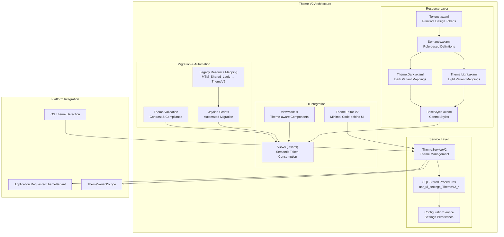
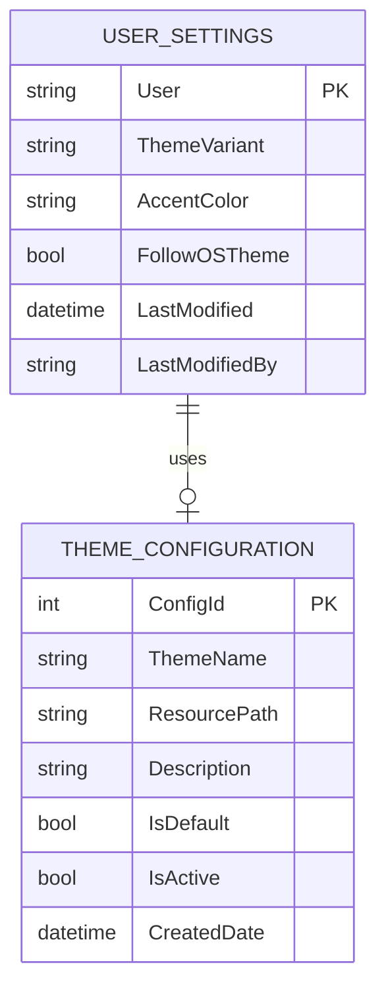

# Theme V2 — Full Implementation Plan and Resource Foundation

## Goal

Establish a complete foundation for the Theme V2 rebuild, implementing a semantic token system with Avalonia ThemeVariant support (Light/Dark) and comprehensive migration strategy. This modernizes the legacy MTM theme system to use Avalonia's native ThemeVariant system, enabling better OS integration, WCAG AA compliance, and maintainable semantic design tokens.

The implementation focuses on creating a layered architecture where primitive tokens (colors, spacing) are mapped to semantic roles (Text.Primary, Surface.Card, etc.), providing better maintainability and consistency across the entire MTM WIP Application while supporting both Light and Dark theme variants with a default #0078D4 accent color.

## Requirements

### Core System Requirements

- **Semantic Token System**: Create a layered token architecture (Primitives → Semantics → Variants → Styles)
- **Avalonia ThemeVariant Integration**: Leverage native Light/Dark theme variants for OS integration
- **WCAG AA Compliance**: Ensure 4.5:1 contrast ratios for all text elements
- **Migration Strategy**: Comprehensive plan for transitioning from `MTM_Shared_Logic.*` to `ThemeV2.*`
- **SQL Persistence**: Theme preferences stored via new stored procedures
- **Backward Compatibility**: Maintain existing functionality during transition
- **Cross-Platform Support**: Windows, macOS, Linux theme consistency
- **Performance Optimization**: Efficient resource loading and minimal memory impact

### Business Requirements

- **Default #0078D4 Accent**: Maintain MTM brand consistency with Windows 11 blue
- **OS Theme Following**: Automatic Light/Dark switching based on system preferences
- **User Override Capability**: Manual theme selection with persistence
- **Manufacturing Context**: Support for MTM-specific UI patterns and workflows
- **Legacy System Coexistence**: Smooth transition without disrupting operations

## Technical Considerations

### System Architecture Overview



#### Technology Stack Selection

- **UI Framework**: Avalonia UI 11.3.4 - Native ThemeVariant support for Light/Dark switching with OS integration
- **Theme System**: Avalonia's built-in theming with ResourceDictionary and ThemeVariantScope orchestration
- **Database**: MySQL 9.4.0 with new stored procedures for theme preference persistence
- **Automation**: Joyride ClojureScript for VS Code Extension API automation and migration scripts
- **Design Tokens**: AXAML-based token system with semantic role mapping
- **Color Science**: HSL-based tonal ramps for consistent hover/pressed/disabled states

#### Integration Points

- **Application.axaml**: Root resource dictionary integration with ThemeV2 resources
- **ThemeVariantScope**: Per-window and per-control theme variant application
- **Existing Services**: Integration with ConfigurationService and ErrorHandling patterns
- **Database Layer**: New stored procedures following `Helper_Database_StoredProcedure` pattern
- **Legacy Coexistence**: Namespace isolation using `x:Key="ThemeV2.*"` prefixes

#### Deployment Architecture

- **Resource Bundle**: All ThemeV2 resources deployed as embedded application resources
- **Configuration**: Theme preferences stored in MySQL database via existing connection patterns
- **Cross-Platform**: Consistent theme behavior across Windows, macOS, and Linux
- **Performance**: Lazy loading of theme resources and efficient variant switching

#### Scalability Considerations

- **Resource Efficiency**: Minimal memory footprint with shared resource dictionaries
- **Dynamic Loading**: Theme resources loaded on-demand to reduce startup time
- **Cache Strategy**: Theme variant resources cached for quick switching
- **Future Extensibility**: Architecture supports additional theme variants and accent colors

### Database Schema Design



#### Table Specifications

**USER_SETTINGS Enhancement**
- Add `ThemeVariant` (VARCHAR(20)): "Light", "Dark", or "System" 
- Add `AccentColor` (VARCHAR(10)): Hex color code (default "#0078D4")
- Add `FollowOSTheme` (BOOLEAN): Whether to follow OS theme changes
- Maintain existing columns for backward compatibility

**THEME_CONFIGURATION (New)**
- `ConfigId` (INT, PK, AUTO_INCREMENT): Unique configuration identifier
- `ThemeName` (VARCHAR(50)): Human-readable theme name
- `ResourcePath` (VARCHAR(255)): Path to theme resource file
- `Description` (TEXT): Theme description and metadata
- `IsDefault` (BOOLEAN): Whether this is the default theme
- `IsActive` (BOOLEAN): Whether theme is available for selection

#### Indexing Strategy

- **USER_SETTINGS**: Primary key on User for fast user preference lookups
- **THEME_CONFIGURATION**: Index on IsDefault and IsActive for theme enumeration

#### Database Migration Strategy

- Add new columns to existing USER_SETTINGS table with default values
- Create new THEME_CONFIGURATION table with initial theme entries
- Implement new stored procedures following existing naming conventions
- Maintain backward compatibility with existing user setting queries

### API Design

#### ThemeServiceV2 Interface

```csharp
public interface IThemeServiceV2
{
    // Theme variant management
    Task<ThemeVariant> GetCurrentThemeVariantAsync();
    Task SetThemeVariantAsync(ThemeVariant variant, string username);
    
    // OS theme integration
    Task<bool> GetFollowOSThemeAsync(string username);
    Task SetFollowOSThemeAsync(bool follow, string username);
    
    // Accent color management
    Task<Color> GetAccentColorAsync(string username);
    Task SetAccentColorAsync(Color color, string username);
    
    // Theme orchestration
    Task ApplyThemeToApplicationAsync();
    Task ApplyThemeToScopeAsync(ThemeVariantScope scope);
    
    // Configuration and validation
    Task<List<ThemeConfiguration>> GetAvailableThemesAsync();
    Task<ValidationResult> ValidateThemeConfigurationAsync(ThemeConfiguration config);
}
```

#### Stored Procedures

**Theme Management**
```sql
-- Get user theme settings
usr_ui_settings_ThemeV2_Get(@p_User VARCHAR(50))

-- Set user theme settings  
usr_ui_settings_ThemeV2_Set(
    @p_User VARCHAR(50),
    @p_ThemeVariant VARCHAR(20),
    @p_AccentColor VARCHAR(10),
    @p_FollowOSTheme BOOLEAN
)

-- Get available theme configurations
usr_ui_settings_ThemeV2_Configurations_Get()

-- Add new theme configuration
usr_ui_settings_ThemeV2_Configuration_Add(
    @p_ThemeName VARCHAR(50),
    @p_ResourcePath VARCHAR(255),
    @p_Description TEXT,
    @p_IsDefault BOOLEAN
)
```

#### Error Handling Strategies

- Use centralized `Services.ErrorHandling.HandleErrorAsync()` pattern
- Theme fallback to Light variant on configuration errors
- Database connection failures gracefully degrade to default theme
- Invalid accent colors fall back to MTM default #0078D4
- Theme switching errors logged with user context for troubleshooting

### Frontend Architecture

#### Resource Hierarchy Documentation

The Theme V2 resource structure leverages a semantic token approach with proper Avalonia integration:

**Resource Loading Order:**

```
App.axaml Resources
├── Tokens.axaml (Base primitive tokens)
│   ├── Color Primitives (Blue.500: #0078D4, etc.)
│   ├── Spacing Tokens (Space.Small: 8, Space.Medium: 16)
│   ├── Typography Tokens (FontSize.Body: 14, FontWeight.Medium: 500)
│   └── Border Radius Tokens (Radius.Small: 4, Radius.Medium: 8)
├── Semantic.axaml (Role-based definitions)
│   ├── Text Semantics (Text.Primary, Text.Secondary, Text.Disabled)
│   ├── Surface Semantics (Surface.Card, Surface.Panel, Surface.Overlay)
│   ├── Border Semantics (Border.Default, Border.Focus, Border.Error)
│   ├── Accent Semantics (Accent.Primary, Accent.Hover, Accent.Pressed)
│   └── State Semantics (State.Success, State.Warning, State.Error)
├── Theme.Light.axaml (Light variant mappings)
│   └── ThemeVariant="Light" specific resource assignments
├── Theme.Dark.axaml (Dark variant mappings)
│   └── ThemeVariant="Dark" specific resource assignments
└── BaseStyles.axaml (Control styles using semantic tokens)
    ├── Button Styles (consuming Accent.Primary, Text.Primary)
    ├── TextBox Styles (consuming Surface.Card, Border.Default)
    ├── Card Styles (consuming Surface.Card, Border.Default)
    └── DataGrid Styles (consuming Surface.Panel, Text.Secondary)
```

#### Component State Management

**ThemeEditorV2ViewModel Pattern**

```csharp
[ObservableObject]
public partial class ThemeEditorV2ViewModel : BaseViewModel
{
    [ObservableProperty]
    private ThemeVariant selectedThemeVariant = ThemeVariant.Light;

    [ObservableProperty] 
    private Color selectedAccentColor = Color.Parse("#0078D4");

    [ObservableProperty]
    private bool followOSTheme = true;

    [ObservableProperty]
    private bool isApplyingTheme;

    [RelayCommand]
    private async Task ApplyThemeAsync()
    {
        IsApplyingTheme = true;
        try
        {
            await _themeService.SetThemeVariantAsync(SelectedThemeVariant, _currentUser);
            await _themeService.SetAccentColorAsync(SelectedAccentColor, _currentUser);
            await _themeService.SetFollowOSThemeAsync(FollowOSTheme, _currentUser);
            await _themeService.ApplyThemeToApplicationAsync();
            
            // Show success notification
            await ShowSuccessNotificationAsync("Theme applied successfully");
        }
        catch (Exception ex)
        {
            await Services.ErrorHandling.HandleErrorAsync(ex, "Failed to apply theme settings");
        }
        finally
        {
            IsApplyingTheme = false;
        }
    }

    [RelayCommand]
    private async Task ResetToDefaultAsync()
    {
        SelectedThemeVariant = ThemeVariant.Light;
        SelectedAccentColor = Color.Parse("#0078D4");
        FollowOSTheme = true;
        
        await ApplyThemeAsync();
    }
}
```

#### AXAML Integration Pattern

**View Implementation**

```xml
<UserControl xmlns="https://github.com/avaloniaui"
             xmlns:x="http://schemas.microsoft.com/winfx/2006/xaml"
             xmlns:vm="using:MTM_WIP_Application_Avalonia.ViewModels.Settings"
             x:Class="MTM_WIP_Application_Avalonia.Views.Settings.ThemeEditorV2View">
    
    <ScrollViewer HorizontalScrollBarVisibility="Auto" VerticalScrollBarVisibility="Auto">
        <Grid x:Name="MainContainer" RowDefinitions="*,Auto" MinWidth="600" MinHeight="400" Margin="8">
            
            <!-- Theme Configuration Card -->
            <Border Grid.Row="0" 
                    Background="{DynamicResource ThemeV2.Surface.Card}"
                    BorderBrush="{DynamicResource ThemeV2.Border.Default}"
                    BorderThickness="1" 
                    CornerRadius="8" 
                    Padding="16" 
                    Margin="0,0,0,8">
                
                <Grid RowDefinitions="Auto,Auto,Auto,Auto,Auto" 
                      ColumnDefinitions="Auto,*" 
                      RowSpacing="16" 
                      ColumnSpacing="16">
                    
                    <!-- Theme Variant Selection -->
                    <TextBlock Grid.Row="0" Grid.Column="0" 
                               Text="Theme Variant:" 
                               Foreground="{DynamicResource ThemeV2.Text.Primary}"
                               FontWeight="Medium" 
                               VerticalAlignment="Center" />
                    <ComboBox Grid.Row="0" Grid.Column="1"
                              ItemsSource="{Binding AvailableThemeVariants}"
                              SelectedItem="{Binding SelectedThemeVariant}"
                              MinWidth="200" />
                    
                    <!-- Accent Color Selection -->
                    <TextBlock Grid.Row="1" Grid.Column="0" 
                               Text="Accent Color:" 
                               Foreground="{DynamicResource ThemeV2.Text.Primary}"
                               FontWeight="Medium" 
                               VerticalAlignment="Center" />
                    <Button Grid.Row="1" Grid.Column="1"
                            Background="{Binding SelectedAccentColor}"
                            BorderBrush="{DynamicResource ThemeV2.Border.Default}"
                            MinWidth="200" MinHeight="32"
                            Command="{Binding SelectAccentColorCommand}" />
                    
                    <!-- OS Theme Following -->
                    <TextBlock Grid.Row="2" Grid.Column="0" 
                               Text="Follow OS Theme:" 
                               Foreground="{DynamicResource ThemeV2.Text.Primary}"
                               FontWeight="Medium" 
                               VerticalAlignment="Center" />
                    <CheckBox Grid.Row="2" Grid.Column="1"
                              IsChecked="{Binding FollowOSTheme}" />
                    
                    <!-- Theme Preview Section -->
                    <TextBlock Grid.Row="3" Grid.Column="0" 
                               Text="Preview:" 
                               Foreground="{DynamicResource ThemeV2.Text.Primary}"
                               FontWeight="Medium" />
                    <Border Grid.Row="3" Grid.Column="1"
                            Background="{DynamicResource ThemeV2.Surface.Panel}"
                            BorderBrush="{DynamicResource ThemeV2.Border.Default}"
                            BorderThickness="1"
                            CornerRadius="4"
                            Padding="16">
                        <StackPanel Spacing="8">
                            <Button Content="Primary Button" 
                                    Background="{DynamicResource ThemeV2.Accent.Primary}"
                                    Foreground="{DynamicResource ThemeV2.Text.OnAccent}" />
                            <TextBox Text="Sample input text" 
                                     Background="{DynamicResource ThemeV2.Surface.Card}"
                                     BorderBrush="{DynamicResource ThemeV2.Border.Default}" />
                            <TextBlock Text="Sample text content"
                                       Foreground="{DynamicResource ThemeV2.Text.Primary}" />
                        </StackPanel>
                    </Border>
                </Grid>
            </Border>
            
            <!-- Action Buttons -->
            <Border Grid.Row="1" 
                    Background="{DynamicResource ThemeV2.Surface.Panel}"
                    BorderBrush="{DynamicResource ThemeV2.Border.Default}"
                    BorderThickness="1,0,1,1"
                    CornerRadius="0,0,8,8"
                    Padding="16,8">
                <StackPanel Orientation="Horizontal" 
                            HorizontalAlignment="Right" 
                            Spacing="8">
                    <Button Content="Reset to Default"
                            Command="{Binding ResetToDefaultCommand}"
                            Background="{DynamicResource ThemeV2.Surface.Card}"
                            BorderBrush="{DynamicResource ThemeV2.Border.Default}" />
                    <Button Content="Apply Theme"
                            Command="{Binding ApplyThemeCommand}"
                            Background="{DynamicResource ThemeV2.Accent.Primary}"
                            Foreground="{DynamicResource ThemeV2.Text.OnAccent}"
                            IsEnabled="{Binding !IsApplyingTheme}" />
                </StackPanel>
            </Border>
        </Grid>
    </ScrollViewer>
</UserControl>
```

### Security & Performance

#### Security Considerations

- **Input Validation**: All theme configuration inputs validated at service layer
- **Resource Security**: Theme resources served from embedded application resources
- **Database Security**: Parameterized stored procedures for theme preference storage
- **User Isolation**: Theme preferences isolated per user account
- **Audit Trail**: Theme changes logged with user and timestamp

#### Performance Optimization

- **Resource Caching**: Theme resources cached in memory for quick variant switching
- **Lazy Loading**: Theme configurations loaded on-demand to reduce startup time
- **Efficient Updates**: Incremental theme updates rather than full resource reloads
- **Memory Management**: Proper disposal of unused theme resources
- **Background Processing**: Theme application operations run on background threads

## Implementation Tasks

### Task 1 - Foundation Architecture
**Goal**: Establish the core Theme V2 resource foundation and service architecture

#### Sub-Task 1.1 - Resource System Implementation
**Goal**: Create the semantic token system with proper Avalonia ThemeVariant integration

##### Sub-Sub-Task 1.1.1 - Primitive Token Definition
- Create `Resources/ThemesV2/Tokens.axaml` with base design tokens
  - Define color primitives (Blue.500: #0078D4, Neutral.50-900 scale)
  - Define spacing tokens (4, 8, 16, 24, 32, 48, 64px scale)
  - Define typography tokens (FontSize.Small: 12, Body: 14, H1: 24)
  - Define border radius tokens (2, 4, 8, 16px scale)
  - Define elevation/shadow tokens for depth consistency

##### Sub-Sub-Task 1.1.2 - Semantic Token Mapping
- Create `Resources/ThemesV2/Semantic.axaml` with role-based definitions
  - Text semantics: Primary, Secondary, Disabled, OnAccent, OnSurface
  - Surface semantics: Card, Panel, Overlay, Input, Navigation
  - Border semantics: Default, Focus, Error, Success, Warning
  - Accent semantics: Primary, Hover, Pressed, Disabled
  - State semantics: Success, Warning, Error, Info backgrounds and foregrounds

##### Sub-Sub-Task 1.1.3 - Theme Variant Implementation
- Create `Resources/ThemesV2/Theme.Light.axaml` with light theme mappings
  - Map semantic tokens to light-appropriate primitive values
  - Ensure 4.5:1 contrast ratios for WCAG AA compliance
  - Define light-specific surface colors and elevation
- Create `Resources/ThemesV2/Theme.Dark.axaml` with dark theme mappings
  - Map semantic tokens to dark-appropriate primitive values
  - Maintain contrast ratios and visual hierarchy
  - Implement proper dark mode color science

#### Sub-Task 1.2 - Base Style System
**Goal**: Create control styles that consume semantic tokens

##### Sub-Sub-Task 1.2.1 - Core Control Styles
- Create `Resources/ThemesV2/BaseStyles.axaml` with fundamental control styles
  - Button styles using ThemeV2.Accent.Primary and hover/pressed states
  - TextBox/ComboBox styles using ThemeV2.Surface.Input and Border.Default
  - TextBlock styles using ThemeV2.Text.Primary/Secondary
  - Border/Card styles using ThemeV2.Surface.Card and Border.Default

##### Sub-Sub-Task 1.2.2 - Complex Control Integration
- DataGrid styles using ThemeV2 semantic tokens
- TabControl styles with proper variant support
- Menu/ContextMenu styles with semantic token consumption
- ProgressBar and other feedback controls with accent color integration

#### Sub-Task 1.3 - Application Integration
**Goal**: Integrate Theme V2 resources into the application resource dictionary

##### Sub-Sub-Task 1.3.1 - App.axaml Integration
- Add ThemeV2 resource dictionary references to App.axaml
- Ensure proper resource loading order (Tokens → Semantic → Variants → Styles)
- Implement resource dictionary merging without conflicts
- Test resource resolution and inheritance

##### Sub-Sub-Task 1.3.2 - Resource Validation
- Implement resource key validation to prevent missing references
- Create automated tests for resource resolution
- Validate contrast ratios meet WCAG AA standards
- Test resource loading performance and memory usage

### Task 2 - ThemeServiceV2 Implementation  
**Goal**: Create the service layer for theme management and persistence

#### Sub-Task 2.1 - Core Service Architecture
**Goal**: Implement the primary theme management service

##### Sub-Sub-Task 2.1.1 - Interface Definition and Registration
- Define `IThemeServiceV2` interface with all required methods
- Implement `ThemeServiceV2` class with dependency injection support
- Register service in `ServiceCollectionExtensions` with appropriate lifetime
- Create service configuration and initialization logic

##### Sub-Sub-Task 2.1.2 - Theme Variant Management
- Implement `GetCurrentThemeVariantAsync()` with OS detection
- Implement `SetThemeVariantAsync()` with validation and persistence
- Create theme variant change event handling
- Integrate with Avalonia's `Application.RequestedThemeVariant` property

##### Sub-Sub-Task 2.1.3 - Accent Color Management
- Implement accent color get/set operations with validation
- Create tonal ramp generation for hover/pressed/disabled states
- Implement dynamic resource updates for accent color changes
- Validate accent colors for accessibility compliance

#### Sub-Task 2.2 - OS Integration
**Goal**: Implement OS theme detection and following

##### Sub-Sub-Task 2.2.1 - OS Theme Detection
- Implement Windows theme detection via registry/API
- Implement macOS theme detection via system preferences
- Implement Linux theme detection via desktop environment APIs
- Create platform-abstracted theme detection interface

##### Sub-Sub-Task 2.2.2 - Theme Following Logic
- Implement automatic theme switching when OS theme changes
- Create user preference override logic (manual vs automatic)
- Handle theme change timing and resource update coordination
- Implement graceful fallbacks for unsupported platforms

#### Sub-Task 2.3 - Database Integration
**Goal**: Implement theme preference persistence via stored procedures

##### Sub-Sub-Task 2.3.1 - Stored Procedure Development
- Create `usr_ui_settings_ThemeV2_Get` stored procedure
- Create `usr_ui_settings_ThemeV2_Set` stored procedure
- Create `usr_ui_settings_ThemeV2_Configurations_Get` stored procedure
- Test stored procedures with existing database helper patterns

##### Sub-Sub-Task 2.3.2 - Service Database Integration
- Implement database calls using `Helper_Database_StoredProcedure.ExecuteDataTableWithStatus`
- Create error handling for database connectivity issues
- Implement caching for frequently accessed theme preferences
- Add logging for theme preference changes and database operations

### Task 3 - ThemeEditor V2 Implementation
**Goal**: Create a modern theme editor interface with minimal code-behind

#### Sub-Task 3.1 - ViewModel Implementation
**Goal**: Create the theme editor ViewModel using MVVM Community Toolkit patterns

##### Sub-Sub-Task 3.1.1 - Core ViewModel Structure
- Create `ThemeEditorV2ViewModel` inheriting from `BaseViewModel`
- Implement observable properties using `[ObservableProperty]` attributes
- Create relay commands using `[RelayCommand]` attributes
- Implement proper dependency injection with required services

##### Sub-Sub-Task 3.1.2 - Theme Configuration Properties
- Implement `SelectedThemeVariant` property with validation
- Implement `SelectedAccentColor` property with color picker integration
- Implement `FollowOSTheme` boolean property
- Create computed properties for theme preview and validation status

##### Sub-Sub-Task 3.1.3 - Command Implementation
- Implement `ApplyThemeCommand` with async execution and error handling
- Implement `ResetToDefaultCommand` for theme reset functionality
- Implement `SelectAccentColorCommand` for color picker integration
- Create `PreviewThemeCommand` for real-time theme preview

#### Sub-Task 3.2 - View Implementation
**Goal**: Create the theme editor UI following MTM design patterns

##### Sub-Sub-Task 3.2.1 - AXAML Structure Implementation
- Create `ThemeEditorV2View.axaml` following MTM tab view grid pattern
- Implement ScrollViewer and Grid structure for proper containment
- Use DynamicResource bindings for all ThemeV2 semantic tokens
- Implement proper spacing and layout following MTM design system

##### Sub-Sub-Task 3.2.2 - Theme Configuration Controls
- Implement ThemeVariant ComboBox with proper binding
- Create accent color selection button with color preview
- Implement FollowOSTheme CheckBox with proper styling
- Add theme preview panel showing sample controls

##### Sub-Sub-Task 3.2.3 - Action Buttons and Feedback
- Implement Apply/Reset action buttons with proper styling
- Add progress indicators for theme application operations
- Create success/error feedback notifications
- Implement proper button enablement based on ViewModel state

#### Sub-Task 3.3 - Integration and Testing
**Goal**: Integrate theme editor into the application and test functionality

##### Sub-Sub-Task 3.3.1 - MainWindow Integration
- Add ThemeEditor tab to MainWindow tab control
- Configure proper ViewModel dependency injection
- Test theme editor navigation and lifecycle
- Implement proper cleanup and resource disposal

##### Sub-Sub-Task 3.3.2 - Functional Testing
- Test theme variant switching with live preview
- Test accent color changes with real-time updates
- Test OS theme following functionality
- Validate database persistence of theme preferences

### Task 4 - Migration Strategy Implementation
**Goal**: Create comprehensive migration tools and processes

#### Sub-Task 4.1 - Legacy Resource Mapping
**Goal**: Create mapping between old and new resource systems

##### Sub-Sub-Task 4.1.1 - Resource Mapping Definition
- Create comprehensive mapping from `MTM_Shared_Logic.*` to `ThemeV2.*`
- Document all existing resource keys and their semantic equivalents
- Create migration lookup table for automated conversion
- Validate mapping completeness against existing AXAML files

##### Sub-Sub-Task 4.1.2 - Compatibility Layer
- Implement resource aliases for backward compatibility
- Create transition period support for mixed resource usage
- Implement warning system for deprecated resource usage
- Plan deprecation timeline and migration phases

#### Sub-Task 4.2 - Joyride Migration Scripts
**Goal**: Create automated migration tools using Joyride

##### Sub-Sub-Task 4.2.1 - Migration Script Development
- Create Joyride ClojureScript for automated AXAML resource replacement
- Implement batch processing for multiple files
- Create validation scripts for migration accuracy
- Implement rollback capability for failed migrations

##### Sub-Sub-Task 4.2.2 - Migration Orchestration
- Create migration plan execution scripts
- Implement progressive migration strategy (view-by-view)
- Create migration status tracking and reporting
- Implement pre and post-migration validation

#### Sub-Task 4.3 - Validation and Testing
**Goal**: Ensure migration accuracy and system stability

##### Sub-Sub-Task 4.3.1 - Migration Validation
- Create automated tests for resource key replacements
- Implement visual regression testing for migrated views
- Create WCAG compliance validation for migrated components
- Test cross-platform consistency after migration

##### Sub-Sub-Task 4.3.2 - Rollback and Recovery
- Implement automated rollback for failed migrations
- Create backup and restore procedures for AXAML files
- Implement migration state tracking and recovery
- Create emergency fallback to legacy theme system

### Task 5 - Testing and Validation
**Goal**: Comprehensive testing of the Theme V2 system

#### Sub-Task 5.1 - Unit Testing
**Goal**: Create comprehensive unit tests for all components

##### Sub-Sub-Task 5.1.1 - Service Layer Testing
- Create unit tests for `ThemeServiceV2` with mock dependencies
- Test theme variant switching logic with various inputs
- Test accent color validation and tonal ramp generation
- Test database integration with mock stored procedure responses

##### Sub-Sub-Task 5.1.2 - ViewModel Testing
- Create unit tests for `ThemeEditorV2ViewModel` command execution
- Test property validation and change notifications
- Test error handling and recovery scenarios
- Test async command execution and cancellation

#### Sub-Task 5.2 - Integration Testing
**Goal**: Test end-to-end theme system functionality

##### Sub-Sub-Task 5.2.1 - Database Integration Testing
- Test stored procedure execution with actual database
- Test theme preference persistence and retrieval
- Test database connection failure handling
- Test concurrent user theme preference management

##### Sub-Sub-Task 5.2.2 - UI Integration Testing
- Test theme switching with live UI updates
- Test resource resolution and binding updates
- Test ThemeVariantScope application and inheritance
- Test theme editor integration with main application

#### Sub-Task 5.3 - Cross-Platform Testing
**Goal**: Validate consistent behavior across all supported platforms

##### Sub-Sub-Task 5.3.1 - Platform-Specific Testing
- Test Windows theme detection and OS following
- Test macOS theme integration and system preference following
- Test Linux theme support across different desktop environments
- Validate font rendering and layout consistency

##### Sub-Sub-Task 5.3.2 - Performance and Accessibility Testing
- Test theme switching performance and resource usage
- Validate WCAG AA contrast ratio compliance
- Test screen reader compatibility with new theme system
- Test high contrast mode support and integration

### Task 6 - Documentation and Deployment
**Goal**: Create comprehensive documentation and deployment procedures

#### Sub-Task 6.1 - Technical Documentation
**Goal**: Document the Theme V2 system for developers and maintainers

##### Sub-Sub-Task 6.1.1 - Architecture Documentation
- Document semantic token system architecture and patterns
- Create developer guide for adding new theme components
- Document ThemeServiceV2 API and usage patterns
- Create troubleshooting guide for theme-related issues

##### Sub-Sub-Task 6.1.2 - Migration Documentation
- Create step-by-step migration guide for existing views
- Document Joyride script usage and customization
- Create rollback procedures and emergency protocols
- Document testing and validation procedures

#### Sub-Task 6.2 - User Documentation
**Goal**: Create user-facing documentation for theme features

##### Sub-Sub-Task 6.2.1 - Theme Editor Guide
- Create user guide for Theme Editor V2 interface
- Document theme variant selection and customization
- Create accent color selection guide with examples
- Document OS theme following configuration

##### Sub-Sub-Task 6.2.2 - Accessibility Guide
- Document accessibility features and compliance
- Create guide for high contrast and accessibility modes
- Document keyboard navigation and screen reader support
- Create guide for custom accessibility configurations

#### Sub-Task 6.3 - Deployment and Release
**Goal**: Prepare and execute Theme V2 system deployment

##### Sub-Sub-Task 6.3.1 - Release Preparation
- Create deployment checklist and validation procedures
- Prepare database migration scripts for production
- Create rollback procedures for production deployment
- Test deployment procedures in staging environment

##### Sub-Sub-Task 6.3.2 - Release Execution
- Execute phased rollout of Theme V2 system
- Monitor system performance and user feedback
- Execute view migration according to planned schedule
- Remove legacy theme system after successful migration

## Risk Assessment and Mitigation

### High Risk Items

**Resource Conflicts**: Risk of conflicts between legacy and new theme resources
- *Mitigation*: Use namespace isolation with `x:Key="ThemeV2.*"` prefixes
- *Contingency*: Implement resource alias system for backward compatibility

**Database Migration Issues**: Risk of theme preference data loss during migration
- *Mitigation*: Implement comprehensive backup procedures and rollback scripts
- *Contingency*: Maintain legacy database schema during transition period

**Cross-Platform Inconsistencies**: Risk of theme behavior differences across platforms
- *Mitigation*: Extensive cross-platform testing and validation
- *Contingency*: Platform-specific theme configuration overrides

### Medium Risk Items

**Performance Impact**: Risk of theme switching performance degradation
- *Mitigation*: Implement resource caching and efficient update mechanisms
- *Contingency*: Optimize resource loading and provide performance configuration

**OS Integration Failures**: Risk of OS theme detection failures
- *Mitigation*: Implement robust fallback mechanisms for unsupported platforms
- *Contingency*: Manual theme selection with graceful degradation

**Migration Script Failures**: Risk of automated migration script errors
- *Mitigation*: Extensive testing and validation of migration scripts
- *Contingency*: Manual migration procedures and rollback capabilities

### Mitigation Strategies

1. **Incremental Rollout**: Deploy Theme V2 components progressively to minimize risk
2. **Comprehensive Testing**: Implement extensive unit, integration, and cross-platform testing
3. **Backup and Recovery**: Maintain complete backup procedures and rollback capabilities
4. **Monitoring and Alerting**: Implement monitoring for theme system performance and errors
5. **User Communication**: Provide clear communication about theme system changes and benefits

## Acceptance Criteria

### Core Functionality

- [ ] Theme V2 resources (Tokens, Semantic, Light/Dark variants) load without conflicts
- [ ] ThemeServiceV2 successfully manages theme variants and accent colors
- [ ] Theme preferences persist correctly via MySQL stored procedures
- [ ] OS theme following works correctly on Windows, macOS, and Linux
- [ ] Theme Editor V2 provides intuitive interface for theme customization
- [ ] All migrated components maintain visual consistency and functionality

### Performance Standards

- [ ] Theme switching completes within 500ms on typical hardware
- [ ] Memory usage increase less than 10% compared to legacy theme system
- [ ] Application startup time impact less than 200ms
- [ ] Resource loading optimized for minimal initial footprint

### Accessibility Compliance

- [ ] All text combinations meet WCAG AA 4.5:1 contrast requirements
- [ ] High contrast mode properly supported
- [ ] Screen reader compatibility maintained for all theme components
- [ ] Keyboard navigation works correctly in Theme Editor V2

### Migration Success

- [ ] All existing views successfully migrate to ThemeV2 semantic tokens
- [ ] No functionality regression in migrated components
- [ ] Legacy resource system cleanly removed after migration
- [ ] Database migration completes without data loss

### Documentation Standards

- [ ] Complete technical documentation for developers
- [ ] User guide for Theme Editor V2 functionality
- [ ] Migration procedures documented and tested
- [ ] Troubleshooting guide covers common scenarios

## Timeline and Milestones

### Phase 1: Foundation (Week 1-2)
**Milestone**: Theme V2 resource foundation and ThemeServiceV2 implementation
- Tasks 1.1, 1.2, 1.3: Resource system implementation
- Tasks 2.1, 2.2, 2.3: ThemeServiceV2 development
- **Deliverables**: Working theme variant switching with semantic tokens

### Phase 2: User Interface (Week 3-4)
**Milestone**: Theme Editor V2 and user-facing functionality  
- Tasks 3.1, 3.2, 3.3: ThemeEditor V2 implementation
- **Deliverables**: Complete theme customization interface

### Phase 3: Migration Tools (Week 5-6)
**Milestone**: Migration strategy and automation tools
- Tasks 4.1, 4.2, 4.3: Migration implementation
- **Deliverables**: Automated migration scripts and validation tools

### Phase 4: Testing and Validation (Week 7-8)
**Milestone**: Comprehensive testing and quality assurance
- Tasks 5.1, 5.2, 5.3: Testing implementation
- **Deliverables**: Validated, production-ready Theme V2 system

### Phase 5: Documentation and Deployment (Week 9-10)
**Milestone**: Production deployment and documentation
- Tasks 6.1, 6.2, 6.3: Documentation and deployment
- **Deliverables**: Complete Theme V2 system deployed with documentation

**Total Estimated Timeline: 10 weeks**

## Success Metrics

### Technical Metrics
- Zero theme-related crashes or errors in production
- 100% of existing views successfully migrated to ThemeV2
- Performance benchmarks met or exceeded
- Cross-platform consistency verified

### User Experience Metrics
- Theme switching user satisfaction scores ≥ 4.5/5
- Theme customization feature adoption ≥ 70% of active users
- Support tickets related to theme issues reduced by 80%
- Accessibility compliance verified by third-party audit

### Business Metrics  
- Zero production downtime during theme system migration
- Development team productivity maintained during transition
- Future theme customization development time reduced by 50%
- MTM brand consistency improved across all application areas

This comprehensive implementation plan establishes the foundation for a modern, maintainable, and accessible theme system that will serve the MTM WIP Application's needs for years to come while ensuring a smooth transition from the legacy system.
