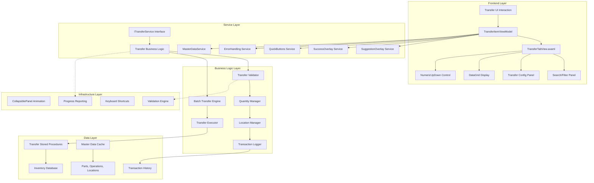
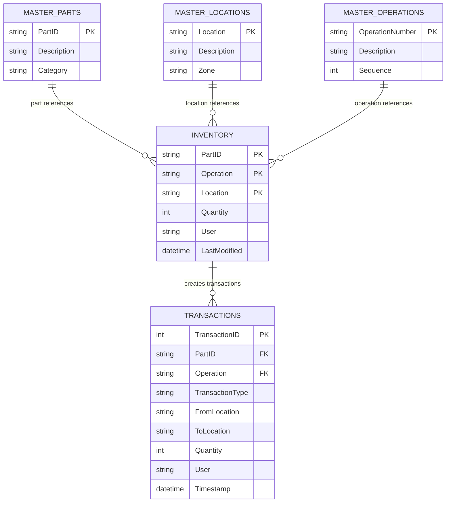
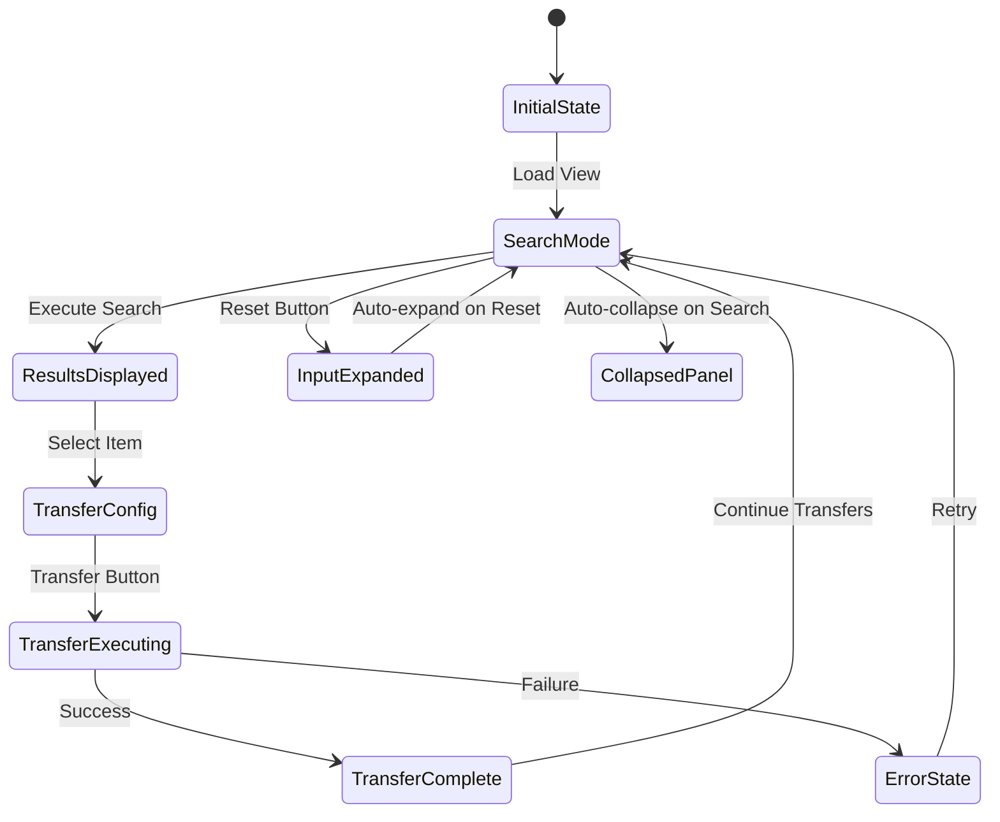

# Transfer Service Implementation Plan

**Generated by**: Industry-veteran Software Engineer  
**Type**: Feature Implementation Plan  
**Target Framework**: .NET 8 Avalonia MVVM Application  
**Documentation Date**: 2025-01-09

## Goal

Implement a comprehensive Transfer Service for the MTM WIP Application Avalonia that provides location-to-location inventory transfer capabilities with dual-panel layout, quantity management, and professional transaction tracking. The service will integrate seamlessly with the existing TransferItemViewModel (908 lines of business logic), supporting real-time transfer operations with professional validation and complete audit trails.

## Requirements

### Functional Requirements
- **Dual-Panel Transfer Layout**: Source selection panel and destination configuration panel above DataGrid
- **Transfer Configuration**: Part ID search, operation filtering, destination location selection, and quantity management
- **Quantity Management**: NumericUpDown control with automatic limits based on available inventory
- **Real-Time Search**: Dynamic filtering of transfer candidates with instant results
- **Batch Transfer Operations**: Support for multiple item transfers to same destination
- **Transaction Type Logic**: ALL transfers create "TRANSFER" transactions regardless of operation numbers
- **SuggestionOverlay Integration**: Replace all ComboBoxes with TextBoxes + SuggestionOverlay for Part ID, Operation, and Location fields
- **CollapsiblePanel Behavior**: Auto-collapse on Search, auto-expand on Reset with smooth animations
- **Complete Audit Trail**: From Location → To Location tracking with user and timestamp information

### Technical Requirements
- **MVVM Community Toolkit**: Use established patterns with `[ObservableProperty]` and `[RelayCommand]`
- **Avalonia UI Framework**: Native Avalonia controls with proper AXAML syntax following InventoryTabView patterns
- **Existing ViewModel Integration**: Leverage comprehensive TransferItemViewModel (908 lines) with complete business logic
- **Service Integration**: Integration with SuggestionOverlay, SuccessOverlay, QuickButtons, and ErrorHandling services
- **Database Operations**: Use existing stored procedures for transfer operations with atomic transaction handling
- **Theme Consistency**: Full MTM design system integration with 19-theme compatibility

## Technical Considerations

### System Architecture Overview



**Technology Stack Selection**:
- **Frontend**: Avalonia 11.3.4 with AXAML for cross-platform UI consistency
- **MVVM Framework**: MVVM Community Toolkit 8.3.2 for modern property/command patterns
- **Transfer Logic**: Existing TransferItemViewModel with 908 lines of comprehensive business logic
- **Database**: MySQL stored procedures for atomic transfer operations
- **Validation**: Real-time input validation with visual feedback

**Integration Points**:
- TransferItemViewModel: Complete 908-line business logic implementation ready for UI connection
- SuggestionOverlay: Fuzzy matching for Part ID, exact matching for Operations and Locations
- SuccessOverlay: Transfer confirmation with From→To location details
- QuickButtons: Field population and yellow-coded TRANSFER history logging
- CollapsiblePanel: Auto-collapse/expand behavior for optimal screen usage
- ErrorHandling: Centralized error management for all transfer operations

**Deployment Architecture**:
- Existing ViewModel already implemented with comprehensive transfer capabilities
- UI implementation connects to established business logic patterns
- Service integrations follow existing MTM patterns

**Scalability Considerations**:
- Efficient DataGrid rendering for large transfer candidate datasets
- Asynchronous transfer operations to prevent UI blocking
- Memory-efficient suggestion caching for responsive overlay performance
- Batch transfer optimization for multiple item operations

### Database Schema Design

**Note**: Transfer operations use existing inventory and transaction tables with established stored procedures.



**Transfer Transaction Logic**:
- `TransactionType`: Always "TRANSFER" for location-to-location moves
- `FromLocation`: Source location of transferred item
- `ToLocation`: Destination location of transferred item
- `Quantity`: Amount transferred (partial or complete)
- Operation numbers ("90", "100", "110") are workflow steps, NOT transaction type indicators

**Database Operations**:
- Partial Transfer: Reduce source quantity, create/update destination record
- Complete Transfer: Update location field of existing record
- Atomic Operations: All transfers use database transactions with rollback capability
- Audit Trail: Complete tracking of all transfer operations with user attribution

### API Design

**Transfer Service Interface Design**:

```csharp
public interface ITransferService
{
    // Transfer operation execution
    Task<TransferResult> ExecuteTransferAsync(TransferRequest request);
    Task<TransferResult> ExecuteBatchTransferAsync(List<TransferRequest> requests);
    
    // Transfer validation
    Task<ValidationResult> ValidateTransferAsync(string partId, string operation, 
        string fromLocation, string toLocation, int quantity);
    
    // Transfer candidate retrieval
    Task<List<TransferCandidate>> GetTransferCandidatesAsync(string partId = "", string operation = "");
    
    // Master data for suggestions
    Task<List<string>> GetAvailableLocationsAsync();
    Task<List<string>> GetAvailablePartsAsync();
    Task<List<string>> GetAvailableOperationsAsync();
    
    // Transfer history and audit
    Task<List<TransferHistoryItem>> GetTransferHistoryAsync(string partId, DateTime? from = null);
    
    // Event notifications
    event EventHandler<TransferCompletedEventArgs> TransferCompleted;
    event EventHandler<TransferErrorEventArgs> TransferError;
}
```

**Request/Response Formats**:

```csharp
public class TransferRequest
{
    public string PartId { get; set; } = string.Empty;
    public string Operation { get; set; } = string.Empty;
    public string FromLocation { get; set; } = string.Empty;
    public string ToLocation { get; set; } = string.Empty;
    public int Quantity { get; set; }
    public string User { get; set; } = string.Empty;
    public bool IsCompleteTransfer { get; set; } // Transfer entire quantity
}

public class TransferResult
{
    public bool Success { get; set; }
    public string Message { get; set; } = string.Empty;
    public string TransactionId { get; set; } = string.Empty;
    public TransferSummary Summary { get; set; } = new();
}

public class TransferCandidate
{
    public string PartId { get; set; } = string.Empty;
    public string Operation { get; set; } = string.Empty;
    public string Location { get; set; } = string.Empty;
    public int AvailableQuantity { get; set; }
    public string Notes { get; set; } = string.Empty;
    public DateTime LastModified { get; set; }
}

public class ValidationResult
{
    public bool IsValid { get; set; }
    public List<string> ValidationErrors { get; set; } = new();
    public int MaxAllowedQuantity { get; set; }
}
```

**Error Handling Strategies**:
- Invalid destination: Prevent same-location transfers with validation
- Insufficient quantity: Real-time validation against available inventory
- Database failures: Transaction rollback with detailed error reporting
- Concurrent modifications: Optimistic concurrency handling with retry logic

### Frontend Architecture

#### Component Hierarchy Documentation

**Layout Structure leveraging Avalonia UI components:**

```
Transfer Tab View (Following InventoryTabView Pattern)
├── ScrollViewer (Root - prevents overflow)
│   └── Main Grid (RowDefinitions="*,Auto")
│       ├── Content Area (Grid Row="*")
│       │   ├── CollapsiblePanel (Input Area)
│       │   │   ├── Search Panel (First Row)
│       │   │   │   ├── Part ID TextBox (with SuggestionOverlay)
│       │   │   │   ├── Operation TextBox (with SuggestionOverlay)
│       │   │   │   ├── Search Button (Primary Style)
│       │   │   │   └── Reset Button (Secondary Style)
│       │   │   └── Transfer Config Panel (Second Row)
│       │   │       ├── To Location TextBox (with SuggestionOverlay)
│       │   │       ├── NumericUpDown (Quantity Control)
│       │   │       │   ├── Increment Button
│       │   │       │   ├── Decrement Button
│       │   │       │   └── Direct Input TextBox
│       │   │       └── Transfer Button (Primary Style)
│       │   └── DataGrid Section (Transfer Candidates)
│       │       ├── Header Section (Title + Status)
│       │       ├── DataGrid (Transfer Source Selection)
│       │       │   ├── Location Column (Sortable)
│       │       │   ├── PartID Column (Sortable)
│       │       │   ├── Operation Column (Sortable)
│       │       │   ├── Available Quantity Column (Sortable)
│       │       │   └── Notes Column (Sortable)
│       │       └── Empty State ("Nothing Found" Visual)
│       └── Action Panel (Grid Row="Auto")
│           ├── QuickButtons Toggle (Left)
│           ├── Status Information (Center)
│           └── Additional Actions (Right)
```

**State Flow Diagram**:



**Component State Management**:
- TransferItemViewModel: Existing 908-line implementation with complete business logic
- CollapsiblePanel: Auto-collapse on Search, auto-expand on Reset
- SuggestionOverlay: Real-time filtering for Part ID (fuzzy), Operation/Location (exact)
- NumericUpDown: Dynamic maximum based on selected item's available quantity
- DataGrid: Single/multi-selection for individual/batch transfers

#### Transfer UI Component Specifications

**NumericUpDown Control Implementation**:

```xml
<NumericUpDown x:Name="QuantitySelector"
               Value="{Binding TransferQuantity}"
               Minimum="1"
               Maximum="{Binding MaximumTransferQuantity}"
               Increment="1"
               ShowButtonSpinner="True"
               AllowSpin="True"
               ParsingNumberStyle="Integer"
               Watermark="Enter quantity to transfer"
               ToolTip.Tip="Specify quantity to transfer (1 to available)"
               Width="120" />
```

**SuggestionOverlay Integration Pattern**:

```xml
<TextBox x:Name="PartIdTextBox"
         Text="{Binding PartId}"
         Watermark="Enter Part ID..."
         ToolTip.Tip="Start typing to see part suggestions">
    <TextBox.Styles>
        <Style Selector="TextBox:focus">
            <Setter Property="behaviors:SuggestionOverlay.IsEnabled" Value="True" />
            <Setter Property="behaviors:SuggestionOverlay.SuggestionSource" Value="{Binding PartSuggestions}" />
            <Setter Property="behaviors:SuggestionOverlay.FilterMode" Value="Fuzzy" />
        </Style>
    </TextBox.Styles>
</TextBox>
```

**CollapsiblePanel Integration**:

```xml
<CollapsiblePanel x:Name="InputPanel"
                  Header="Transfer Configuration"
                  IsExpanded="{Binding IsInputPanelExpanded}"
                  CollapseOnSearch="{Binding IsSearchExecuted}"
                  ExpandOnReset="{Binding IsResetExecuted}">
    <!-- Search and Transfer Configuration Content -->
</CollapsiblePanel>
```

### Critical Business Logic Requirements

#### Transaction Type Logic (CRITICAL)

**All location-to-location transfers MUST create "TRANSFER" transactions**:

```csharp
// ✅ CORRECT: Transfer operation classification
public TransactionType DetermineTransactionType(TransferOperation operation)
{
    // ALL location moves are TRANSFER type regardless of operation numbers
    if (operation.FromLocation != operation.ToLocation)
    {
        return TransactionType.TRANSFER; // Always TRANSFER for location changes
    }
    
    throw new InvalidOperationException("Cannot transfer to same location");
}

// ❌ WRONG: Don't use operation numbers to determine transaction type
public TransactionType DetermineTransactionType_WRONG(string operationNumber)
{
    return operationNumber switch
    {
        "90" => TransactionType.IN,    // WRONG - operations are workflow steps
        "100" => TransactionType.OUT,  // WRONG - not transaction indicators
        _ => TransactionType.TRANSFER  // WRONG - should always be TRANSFER
    };
}
```

**Operation Numbers as Workflow Steps**:
- "90", "100", "110", "120": Manufacturing workflow sequence identifiers
- NOT transaction type indicators
- Used for inventory organization and process tracking
- Transfer operations preserve operation numbers during location moves

#### Quantity Management Logic

**Partial vs Complete Transfer Handling**:

```csharp
public async Task<TransferResult> ExecuteTransferAsync(TransferRequest request)
{
    var sourceItem = await GetInventoryItemAsync(request.PartId, request.Operation, request.FromLocation);
    
    if (request.Quantity == sourceItem.AvailableQuantity)
    {
        // Complete Transfer: Move entire record to new location
        await UpdateInventoryLocationAsync(sourceItem, request.ToLocation);
    }
    else if (request.Quantity < sourceItem.AvailableQuantity)
    {
        // Partial Transfer: Reduce source, create/update destination
        await ReduceSourceQuantityAsync(sourceItem, request.Quantity);
        await CreateOrUpdateDestinationAsync(request);
    }
    
    // Always log as TRANSFER transaction
    await LogTransactionAsync(new TransactionLog
    {
        Type = "TRANSFER",
        FromLocation = request.FromLocation,
        ToLocation = request.ToLocation,
        Quantity = request.Quantity
    });
}
```

## Implementation Plan Details

### Phase 1: UI Structure Implementation (Days 1-3)

#### Transfer View Implementation

**File**: `Views/TransferTabView.axaml` (Update existing structure)

```xml
<UserControl xmlns="https://github.com/avaloniaui"
             xmlns:x="http://schemas.microsoft.com/winfx/2006/xaml"
             xmlns:vm="using:MTM_WIP_Application_Avalonia.ViewModels.MainForm"
             xmlns:behaviors="using:MTM_WIP_Application_Avalonia.Behaviors"
             xmlns:controls="using:MTM_WIP_Application_Avalonia.Controls"
             x:Class="MTM_WIP_Application_Avalonia.Views.MainForm.TransferTabView"
             x:DataType="vm:TransferItemViewModel">

    <ScrollViewer HorizontalScrollBarVisibility="Auto" VerticalScrollBarVisibility="Auto">
        <Grid x:Name="MainContainer" RowDefinitions="*,Auto" MinWidth="600" MinHeight="400" Margin="8">
            
            <!-- Content Border with Transfer Layout -->
            <Border Grid.Row="0" Background="{DynamicResource MTM_Shared_Logic.CardBackgroundBrush}"
                    BorderBrush="{DynamicResource MTM_Shared_Logic.BorderLightBrush}" 
                    BorderThickness="1" CornerRadius="8" Padding="16" Margin="0,0,0,8">
                
                <Grid RowDefinitions="Auto,*">
                    
                    <!-- CollapsiblePanel for Input Controls -->
                    <controls:CollapsiblePanel Grid.Row="0" 
                                               Header="Transfer Configuration"
                                               IsExpanded="{Binding IsInputPanelExpanded}"
                                               Margin="0,0,0,16">
                        
                        <StackPanel Spacing="12">
                            
                            <!-- Search Configuration Row -->
                            <Grid ColumnDefinitions="*,*,Auto,Auto" ColumnGap="12">
                                
                                <!-- Part ID Search -->
                                <TextBox Grid.Column="0"
                                         Text="{Binding PartId}"
                                         Watermark="Enter Part ID..."
                                         ToolTip.Tip="Start typing to see part suggestions">
                                    <behaviors:TextBoxFuzzyValidationBehavior ValidationSource="{Binding PartSuggestions}" />
                                </TextBox>
                                
                                <!-- Operation Search -->
                                <TextBox Grid.Column="1"
                                         Text="{Binding Operation}"
                                         Watermark="Enter Operation..."
                                         ToolTip.Tip="Start typing to see operation suggestions">
                                    <behaviors:TextBoxFuzzyValidationBehavior ValidationSource="{Binding OperationSuggestions}" />
                                </TextBox>
                                
                                <!-- Search Button -->
                                <Button Grid.Column="2" Content="Search" 
                                        Command="{Binding SearchCommand}"
                                        Background="{DynamicResource MTM_Shared_Logic.PrimaryButtonBackgroundBrush}"
                                        Foreground="White" Padding="16,8" />
                                
                                <!-- Reset Button -->
                                <Button Grid.Column="3" Content="Reset"
                                        Command="{Binding ResetCommand}"
                                        Background="{DynamicResource MTM_Shared_Logic.SecondaryButtonBackgroundBrush}"
                                        Padding="16,8" />
                                
                            </Grid>
                            
                            <!-- Transfer Configuration Row -->
                            <Grid ColumnDefinitions="*,Auto,Auto" ColumnGap="12">
                                
                                <!-- To Location -->
                                <TextBox Grid.Column="0"
                                         Text="{Binding ToLocation}"
                                         Watermark="Enter destination location..."
                                         ToolTip.Tip="Select destination location for transfer">
                                    <behaviors:TextBoxFuzzyValidationBehavior ValidationSource="{Binding LocationSuggestions}" />
                                </TextBox>
                                
                                <!-- Quantity Control -->
                                <NumericUpDown Grid.Column="1"
                                               Value="{Binding TransferQuantity}"
                                               Minimum="1"
                                               Maximum="{Binding MaximumTransferQuantity}"
                                               Increment="1"
                                               ShowButtonSpinner="True"
                                               Watermark="Qty"
                                               ToolTip.Tip="Transfer quantity (1 to available)"
                                               Width="100" />
                                
                                <!-- Transfer Button -->
                                <Button Grid.Column="2" Content="Transfer"
                                        Command="{Binding TransferCommand}"
                                        Background="{DynamicResource MTM_Shared_Logic.PrimaryButtonBackgroundBrush}"
                                        Foreground="White" Padding="16,8"
                                        IsEnabled="{Binding CanExecuteTransfer}" />
                                
                            </Grid>
                            
                        </StackPanel>
                        
                    </controls:CollapsiblePanel>
                    
                    <!-- Transfer Candidates DataGrid -->
                    <Border Grid.Row="1" Background="Transparent">
                        
                        <Grid RowDefinitions="Auto,*">
                            
                            <!-- DataGrid Header -->
                            <Border Grid.Row="0" Background="{DynamicResource MTM_Shared_Logic.HeaderBackgroundBrush}"
                                    Padding="12,8" Margin="0,0,0,8">
                                <Grid ColumnDefinitions="*,Auto">
                                    <TextBlock Grid.Column="0" Text="Transfer Candidates"
                                               FontWeight="SemiBold" />
                                    <TextBlock Grid.Column="1" 
                                               Text="{Binding TransferCandidates.Count, StringFormat='{0} items'}"
                                               Opacity="0.7" />
                                </Grid>
                            </Border>
                            
                            <!-- DataGrid Content -->
                            <DataGrid Grid.Row="1"
                                      ItemsSource="{Binding TransferCandidates}"
                                      SelectedItem="{Binding SelectedTransferCandidate}"
                                      SelectionMode="Extended"
                                      IsReadOnly="True"
                                      GridLinesVisibility="Horizontal"
                                      HeadersVisibility="Column">
                                
                                <DataGrid.Columns>
                                    <DataGridTextColumn Header="Location" Binding="{Binding Location}" Width="*" />
                                    <DataGridTextColumn Header="Part ID" Binding="{Binding PartId}" Width="*" />
                                    <DataGridTextColumn Header="Operation" Binding="{Binding Operation}" Width="100" />
                                    <DataGridTextColumn Header="Available Qty" Binding="{Binding AvailableQuantity}" Width="120" />
                                    <DataGridTextColumn Header="Notes" Binding="{Binding Notes}" Width="*" />
                                </DataGrid.Columns>
                                
                            </DataGrid>
                            
                            <!-- Empty State -->
                            <Border Grid.Row="1" IsVisible="{Binding IsDataGridEmpty}">
                                <StackPanel HorizontalAlignment="Center" VerticalAlignment="Center" Spacing="12">
                                    <TextBlock Text="🔍" FontSize="48" HorizontalAlignment="Center" Opacity="0.5" />
                                    <TextBlock Text="No transfer candidates found" 
                                               FontSize="16" FontWeight="Medium"
                                               HorizontalAlignment="Center" Opacity="0.7" />
                                    <TextBlock Text="Try adjusting your search criteria"
                                               FontSize="12" HorizontalAlignment="Center" Opacity="0.5" />
                                </StackPanel>
                            </Border>
                            
                        </Grid>
                        
                    </Border>
                    
                </Grid>
                
            </Border>
            
            <!-- Action Panel -->
            <Border Grid.Row="1" Background="{DynamicResource MTM_Shared_Logic.PanelBackgroundBrush}"
                    BorderBrush="{DynamicResource MTM_Shared_Logic.BorderLightBrush}"
                    BorderThickness="1" CornerRadius="8" Padding="16,8">
                
                <Grid ColumnDefinitions="Auto,*,Auto">
                    
                    <!-- QuickButtons Toggle -->
                    <Button Grid.Column="0" Content="Quick Actions"
                            Command="{Binding ToggleQuickButtonsCommand}"
                            Background="{DynamicResource MTM_Shared_Logic.SecondaryButtonBackgroundBrush}"
                            Padding="12,6" />
                    
                    <!-- Status Information -->
                    <TextBlock Grid.Column="1" 
                               Text="{Binding StatusMessage}"
                               VerticalAlignment="Center"
                               HorizontalAlignment="Center" />
                    
                    <!-- Additional Actions -->
                    <StackPanel Grid.Column="2" Orientation="Horizontal" Spacing="8">
                        <Button Content="Print View"
                                Command="{Binding PrintCommand}"
                                Background="{DynamicResource MTM_Shared_Logic.SecondaryButtonBackgroundBrush}"
                                Padding="12,6" />
                    </StackPanel>
                    
                </Grid>
                
            </Border>
            
        </Grid>
    </ScrollViewer>
    
</UserControl>
```

### Phase 2: ViewModel Integration (Days 4-5)

#### Connect Existing TransferItemViewModel

**File**: `ViewModels/MainForm/TransferItemViewModel.cs` (Existing 908-line implementation)

**Key Integration Points**:

```csharp
// Additional properties for UI integration
[ObservableProperty]
private bool _isInputPanelExpanded = true;

[ObservableProperty]
private bool _isDataGridEmpty;

[ObservableProperty]
private string _statusMessage = "Ready for transfer operations";

[ObservableProperty]
private int _maximumTransferQuantity = 1;

// Enhanced commands for UI behavior
[RelayCommand]
private async Task SearchAsync()
{
    try
    {
        IsLoading = true;
        StatusMessage = "Searching transfer candidates...";
        
        // Execute existing search logic
        await LoadTransferCandidatesAsync();
        
        // Auto-collapse panel after search
        IsInputPanelExpanded = false;
        
        UpdateDataGridEmptyState();
        StatusMessage = $"Found {TransferCandidates.Count} transfer candidates";
    }
    catch (Exception ex)
    {
        await Services.ErrorHandling.HandleErrorAsync(ex, "Transfer search failed");
        StatusMessage = "Search failed - please try again";
    }
    finally
    {
        IsLoading = false;
    }
}

[RelayCommand]
private void Reset()
{
    // Clear all search fields
    PartId = string.Empty;
    Operation = string.Empty;
    ToLocation = string.Empty;
    TransferQuantity = 1;
    
    // Auto-expand panel for new search
    IsInputPanelExpanded = true;
    
    // Clear results
    TransferCandidates.Clear();
    UpdateDataGridEmptyState();
    
    StatusMessage = "Ready for new transfer search";
}

// Selection change handler for quantity management
partial void OnSelectedTransferCandidateChanged(TransferCandidate? value)
{
    if (value != null)
    {
        MaximumTransferQuantity = value.AvailableQuantity;
        TransferQuantity = Math.Min(TransferQuantity, MaximumTransferQuantity);
    }
}

private void UpdateDataGridEmptyState()
{
    IsDataGridEmpty = !TransferCandidates.Any();
}
```

### Phase 3: Service Integration (Days 6-7)

#### SuggestionOverlay Integration

**Implementation Pattern for Each TextBox**:

```csharp
// In TransferItemViewModel - SuggestionOverlay support
public async Task<List<string>> GetPartSuggestionsAsync(string searchTerm)
{
    try
    {
        var suggestions = await _masterDataService.GetPartSuggestionsAsync(searchTerm);
        return suggestions.Take(10).ToList(); // Limit for performance
    }
    catch (Exception ex)
    {
        await Services.ErrorHandling.HandleErrorAsync(ex, "Failed to load part suggestions");
        return new List<string>();
    }
}

public async Task<List<string>> GetLocationSuggestionsAsync(string searchTerm)
{
    try
    {
        var suggestions = await _masterDataService.GetLocationSuggestionsAsync(searchTerm);
        // Filter out current source location to prevent same-location transfers
        return suggestions.Where(loc => loc != SelectedTransferCandidate?.Location)
                          .Take(10).ToList();
    }
    catch (Exception ex)
    {
        await Services.ErrorHandling.HandleErrorAsync(ex, "Failed to load location suggestions");
        return new List<string>();
    }
}
```

#### SuccessOverlay Integration

**Transfer Success Display**:

```csharp
[RelayCommand]
private async Task ExecuteTransferAsync()
{
    try
    {
        IsLoading = true;
        StatusMessage = "Executing transfer...";
        
        // Execute existing transfer logic (from 908-line implementation)
        var result = await PerformTransferOperationAsync();
        
        if (result.Success)
        {
            // Show success overlay with transfer details
            var successMessage = new SuccessMessage
            {
                Title = "Transfer Completed",
                Message = $"Transferred {TransferQuantity} units of {PartId} (Op: {Operation})",
                Details = $"From: {SelectedTransferCandidate?.Location} → To: {ToLocation}",
                TransactionId = result.TransactionId
            };
            
            await _successOverlayService.ShowSuccessAsync(successMessage);
            
            // Log to QuickButtons history (Yellow = TRANSFER)
            await _quickButtonsService.LogTransferHistoryAsync(new TransferHistoryItem
            {
                PartId = PartId,
                Operation = Operation,
                FromLocation = SelectedTransferCandidate?.Location ?? "",
                ToLocation = ToLocation,
                Quantity = TransferQuantity,
                TransactionType = "TRANSFER", // Always TRANSFER
                ColorCode = "Yellow" // TRANSFER operations are yellow
            });
            
            // Refresh search results
            await SearchAsync();
            
            StatusMessage = "Transfer completed successfully";
        }
        else
        {
            StatusMessage = $"Transfer failed: {result.Message}";
        }
    }
    catch (Exception ex)
    {
        await Services.ErrorHandling.HandleErrorAsync(ex, "Transfer operation failed");
        StatusMessage = "Transfer failed - please try again";
    }
    finally
    {
        IsLoading = false;
    }
}
```

### Phase 4: Advanced Features Implementation (Days 8-10)

#### Batch Transfer Operations

**Multi-Selection DataGrid Support**:

```csharp
[RelayCommand]
private async Task ExecuteBatchTransferAsync()
{
    var selectedItems = SelectedTransferCandidates.ToList();
    if (!selectedItems.Any())
    {
        StatusMessage = "Please select items for batch transfer";
        return;
    }
    
    try
    {
        IsLoading = true;
        var totalItems = selectedItems.Count;
        var completedItems = 0;
        
        foreach (var item in selectedItems)
        {
            StatusMessage = $"Processing transfer {completedItems + 1} of {totalItems}...";
            
            var transferRequest = new TransferRequest
            {
                PartId = item.PartId,
                Operation = item.Operation,
                FromLocation = item.Location,
                ToLocation = ToLocation,
                Quantity = TransferQuantity, // Could be per-item specific
                User = CurrentUser
            };
            
            var result = await ExecuteIndividualTransferAsync(transferRequest);
            
            if (result.Success)
            {
                completedItems++;
                // Log each transfer to history
                await LogTransferToHistoryAsync(transferRequest, result.TransactionId);
            }
        }
        
        // Show batch completion summary
        var successMessage = new SuccessMessage
        {
            Title = "Batch Transfer Completed",
            Message = $"Successfully transferred {completedItems} of {totalItems} items",
            Details = $"Destination: {ToLocation}"
        };
        
        await _successOverlayService.ShowSuccessAsync(successMessage);
        
        StatusMessage = $"Batch transfer completed: {completedItems}/{totalItems} items";
        
        // Refresh results
        await SearchAsync();
    }
    catch (Exception ex)
    {
        await Services.ErrorHandling.HandleErrorAsync(ex, "Batch transfer failed");
        StatusMessage = "Batch transfer failed - please review and retry";
    }
    finally
    {
        IsLoading = false;
    }
}
```

#### Keyboard Shortcuts Implementation

**Keyboard Navigation Support**:

```csharp
// In TransferTabView.axaml.cs code-behind
protected override void OnKeyDown(KeyEventArgs e)
{
    switch (e.Key)
    {
        case Key.F5:
            if (DataContext is TransferItemViewModel vm)
            {
                vm.SearchCommand.Execute(null);
            }
            e.Handled = true;
            break;
            
        case Key.Escape:
            if (DataContext is TransferItemViewModel vm)
            {
                vm.ResetCommand.Execute(null);
            }
            e.Handled = true;
            break;
            
        case Key.Enter:
            if (DataContext is TransferItemViewModel vm && vm.CanExecuteTransfer)
            {
                vm.TransferCommand.Execute(null);
            }
            e.Handled = true;
            break;
    }
    
    base.OnKeyDown(e);
}
```

## Testing Strategy

### Integration Testing
- TransferItemViewModel (908-line implementation) integration with new UI
- SuggestionOverlay functionality for all TextBox fields
- CollapsiblePanel auto-collapse/expand behavior
- NumericUpDown quantity management with dynamic limits
- SuccessOverlay display for transfer confirmations
- QuickButtons history logging with yellow TRANSFER coding

### Business Logic Testing
- Partial transfer operations (quantity reduction, destination creation)
- Complete transfer operations (location updates)
- Batch transfer processing with error handling
- Transaction type validation (always TRANSFER for location moves)
- Same-location transfer prevention
- Quantity validation against available inventory

### User Experience Testing
- Keyboard shortcuts (F5=Search, Escape=Reset, Enter=Transfer)
- Auto-collapse behavior on Search execution
- Auto-expand behavior on Reset execution
- Real-time quantity validation feedback
- SuggestionOverlay fuzzy matching for Part ID
- SuggestionOverlay exact matching for Operation and Location

## Success Criteria

### Functional Success Metrics
1. **Complete UI Implementation**: TransferTabView.axaml fully functional with dual-panel layout
2. **ViewModel Integration**: Existing 908-line TransferItemViewModel successfully connected
3. **Transfer Operations**: Partial, complete, and batch transfers working correctly
4. **Service Integration**: SuggestionOverlay, SuccessOverlay, QuickButtons fully integrated
5. **Validation System**: Real-time input validation with visual feedback

### Technical Success Metrics
1. **Transaction Compliance**: ALL transfers create "TRANSFER" transactions (100% compliance)
2. **Performance**: Search results under 2 seconds for typical datasets
3. **Error Handling**: Graceful handling of all failure scenarios
4. **Memory Efficiency**: No memory leaks during repeated transfer operations
5. **MVVM Compliance**: Full adherence to established MVVM Community Toolkit patterns

### User Experience Success Metrics
1. **Intuitive Interface**: Users can complete transfers without training
2. **Professional Feedback**: Success/error states clearly communicated
3. **Efficient Workflow**: Minimal clicks required for common transfer operations
4. **Visual Consistency**: Perfect alignment with existing MTM design patterns
5. **Responsive UI**: No blocking during database operations

This comprehensive implementation plan leverages the existing 908-line TransferItemViewModel business logic while providing a modern, user-friendly Avalonia UI that follows all established MTM patterns and architectural requirements. The dual-panel layout with quantity management provides an optimal transfer workflow while maintaining complete transaction audit trails and professional user feedback.
