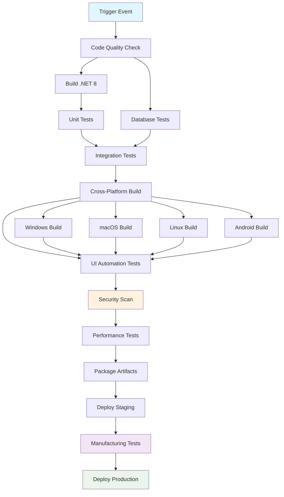

## Workflow Overview

**Purpose**: Automated build, test, and deployment pipeline for MTM WIP Application ensuring cross-platform compatibility and manufacturing system reliability.

**Trigger Events**:

- Push to `master` or `develop` branches
- Pull requests targeting `master`
- Manual workflow dispatch
- Scheduled nightly builds

**Target Environments**:

- Development, Staging, Production
- Cross-platform: Windows, macOS, Linux, Android

## Execution Flow Diagram



## Jobs & Dependencies

| Job Name | Purpose | Dependencies | Execution Context |
|----------|---------|--------------|-------------------|
| code-quality | Lint, format validation, static analysis | none | ubuntu-latest |
| build-dotnet | Compile .NET 8 application | code-quality | ubuntu-latest |
| unit-tests | Run isolated component tests | build-dotnet | ubuntu-latest |
| database-tests | Validate MySQL stored procedures | code-quality | ubuntu-latest |
| integration-tests | Test service interactions | unit-tests, database-tests | ubuntu-latest |
| build-windows | Windows-specific build | build-dotnet | windows-latest |
| build-macos | macOS-specific build | build-dotnet | macos-latest |
| build-linux | Linux-specific build | build-dotnet | ubuntu-latest |
| build-android | Android mobile build | build-dotnet | ubuntu-latest |
| ui-tests | Avalonia UI automation tests | build-* (all platforms) | matrix: [windows, macos, ubuntu] |
| security-scan | SAST/dependency vulnerability scan | build-dotnet | ubuntu-latest |
| performance-tests | Load testing for inventory operations | integration-tests | ubuntu-latest |
| package-artifacts | Create deployment packages | ui-tests, security-scan | ubuntu-latest |
| deploy-staging | Deploy to staging environment | package-artifacts | ubuntu-latest |
| manufacturing-tests | End-to-end manufacturing workflows | deploy-staging | ubuntu-latest |
| deploy-production | Production deployment | manufacturing-tests | ubuntu-latest |

## Requirements Matrix

### Functional Requirements

| ID | Requirement | Priority | Acceptance Criteria |
|----|-------------|----------|-------------------|
| REQ-001 | Cross-platform build success | High | All 4 platforms build without errors |
| REQ-002 | Database schema validation | High | All 45+ stored procedures execute successfully |
| REQ-003 | MVVM pattern compliance | High | ViewModels pass dependency injection tests |
| REQ-004 | Manufacturing workflow validation | High | Core operations (90, 100, 110) function correctly |
| REQ-005 | Theme system validation | Medium | All 15+ themes render properly on each platform |
| REQ-006 | Session management testing | High | 60-minute timeout and persistence work |
| REQ-007 | Quick buttons functionality | Medium | Maximum 10 quick buttons per user validated |

### Security Requirements

| ID | Requirement | Implementation Constraint |
|----|-------------|---------------------------|
| SEC-001 | Connection string encryption | No plaintext secrets in artifacts |
| SEC-002 | SQL injection prevention | All Dapper queries parameterized |
| SEC-003 | Dependency vulnerability scan | No high/critical vulnerabilities |
| SEC-004 | Secure logging validation | No sensitive data in log outputs |
| SEC-005 | File path traversal prevention | All file operations validated |

### Performance Requirements

| ID | Metric | Target | Measurement Method |
|----|-------|--------|-------------------|
| PERF-001 | Application startup time | < 5 seconds | Automated timing tests |
| PERF-002 | Database query performance | < 2 seconds per operation | Query execution monitoring |
| PERF-003 | Memory usage | < 500MB working set | Performance counter monitoring |
| PERF-004 | UI responsiveness | < 100ms UI updates | Avalonia performance profiling |
| PERF-005 | Cross-platform consistency | ±10% performance variance | Comparative benchmarking |

## Input/Output Contracts

### Inputs

```yaml
# Environment Variables
MYSQL_CONNECTION_STRING: secret  # Purpose: Database connectivity for testing
NETWORK_LOG_PATH: string         # Purpose: Shared network logging location
ENCRYPTION_KEY: secret           # Purpose: Configuration encryption
TEST_DATABASE_NAME: string       # Purpose: Isolated test database

# Repository Triggers
paths: 
  - "src/**"
  - "Config/**" 
  - "Resources/Themes/**"
  - "*.csproj"
branches: ["master", "develop"]
```

### Outputs

```yaml
# Job Outputs
build-version: string           # Description: Semantic version for release
test-coverage: number          # Description: Code coverage percentage
security-report: file         # Description: SARIF security scan results
performance-metrics: file     # Description: JSON performance benchmarks
cross-platform-artifacts: file # Description: ZIP containing all platform builds
deployment-manifest: file     # Description: YAML deployment configuration
```

### Secrets & Variables

| Type | Name | Purpose | Scope |
|------|------|---------|-------|
| Secret | MYSQL_CONNECTION | Database access for testing | Workflow |
| Secret | DEPLOYMENT_KEY | Production deployment access | Workflow |
| Secret | ENCRYPTION_SECRET | Configuration file encryption | Repository |
| Variable | TEST_TIMEOUT | Test execution timeout | Repository |
| Variable | PERFORMANCE_THRESHOLD | Performance benchmark limits | Repository |
| Variable | SUPPORTED_PLATFORMS | Platform build matrix | Repository |

## Execution Constraints

### Runtime Constraints

- **Timeout**: 45 minutes total workflow execution
- **Concurrency**: Maximum 3 concurrent platform builds
- **Resource Limits**: 7GB memory per runner, 2 CPU cores

### Environmental Constraints

- **Runner Requirements**:
  - Windows: windows-2022 or later
  - macOS: macos-12 or later  
  - Linux: ubuntu-22.04 or later
- **Network Access**: MySQL database, NuGet packages, npm registries
- **Permissions**: Read repository, write packages, deploy to environments

## Error Handling Strategy

| Error Type | Response | Recovery Action |
|------------|----------|-----------------|
| Build Failure | Fail fast, notify team | Review compilation errors, dependency issues |
| Test Failure | Continue with warnings | Generate detailed test report, flag for review |
| Security Scan Failure | Block deployment | Review vulnerabilities, update dependencies |
| Database Test Failure | Fail workflow | Validate stored procedures, connection strings |
| Cross-Platform Build Failure | Continue with available platforms | Platform-specific investigation |
| Deployment Failure | Rollback to previous version | Investigate infrastructure, retry deployment |
| Performance Regression | Warn but continue | Generate performance comparison report |

## Quality Gates

### Gate Definitions

| Gate | Criteria | Bypass Conditions |
|------|----------|-------------------|
| Code Quality | 95% lint compliance, zero critical warnings | Hotfix emergency deployment |
| Test Coverage | ≥80% unit test coverage | Legacy code modules (documented) |
| Security Scan | Zero high/critical vulnerabilities | False positive with justification |
| Performance | No >10% regression from baseline | Infrastructure changes documented |
| Cross-Platform | All targeted platforms build successfully | Platform-specific known issues documented |
| Database Schema | All stored procedures validate | Development environment only |

## Monitoring & Observability

### Key Metrics

- **Success Rate**: ≥95% workflow success rate
- **Execution Time**: Average <30 minutes end-to-end
- **Resource Usage**: CPU/memory utilization monitoring

### Alerting

| Condition | Severity | Notification Target |
|-----------|----------|-------------------|
| Workflow failure | High | Development team Slack channel |
| Security vulnerability | Critical | Security team + DevOps lead |
| Performance regression >20% | Medium | Performance team |
| Cross-platform build failure | Medium | Platform-specific maintainer |
| Production deployment failure | Critical | On-call engineer + management |

## Integration Points

### External Systems

| System | Integration Type | Data Exchange | SLA Requirements |
|--------|------------------|---------------|------------------|
| MySQL Database | Direct connection | SQL queries/results | 99.9% availability |
| NuGet Package Registry | Package download | Binary packages | 99.5% availability |
| Manufacturing Test Systems | API calls | JSON test results | Best effort |
| File Server Logging | Network file share | Log file writes | Optional (degraded mode available) |
| Performance Monitoring | Metrics API | JSON metrics data | Best effort |

### Dependent Workflows

| Workflow | Relationship | Trigger Mechanism |
|----------|--------------|-------------------|
| Database Migration | Prerequisite | Manual trigger before deployment |
| Security Audit | Parallel | Scheduled weekly execution |
| Documentation Update | Triggered by | Successful production deployment |

## Compliance & Governance

### Audit Requirements

- **Execution Logs**: 90-day retention in GitHub Actions
- **Approval Gates**: Manual approval required for production deployment
- **Change Control**: All workflow modifications require pull request review

### Security Controls

- **Access Control**: Role-based permissions for workflow modification
- **Secret Management**: 90-day rotation for database credentials
- **Vulnerability Scanning**: Weekly dependency audits

## Edge Cases & Exceptions

### Scenario Matrix

| Scenario | Expected Behavior | Validation Method |
|----------|-------------------|-------------------|
| Partial platform build failure | Continue with successful platforms | Test artifact generation |
| Database connection timeout | Fail gracefully with retry logic | Connection resilience tests |
| Large dataset performance test | Scale test execution time appropriately | Dynamic timeout adjustment |
| Theme rendering failure | Isolate to specific theme, continue others | Theme-specific validation |
| Network logging unavailable | Fall back to local logging | Logging fallback mechanism |
| Quick button limit exceeded | Validation error, prevent deployment | Configuration validation tests |

## Validation Criteria

### Workflow Validation

- **VLD-001**: All job dependencies execute in correct order
- **VLD-002**: Cross-platform artifacts contain expected binaries
- **VLD-003**: Database tests validate all required stored procedures
- **VLD-004**: Security scans complete without blocking issues
- **VLD-005**: Performance tests execute within resource constraints

### Performance Benchmarks

- **PERF-001**: Inventory operations complete within 2-second SLA
- **PERF-002**: Theme switching completes within 500ms
- **PERF-003**: Database connection pooling maintains 5-100 connection range
- **PERF-004**: Application memory usage remains under 500MB baseline

## Change Management

### Update Process

1. **Specification Update**: Modify this document first with version increment
2. **Review & Approval**: Technical lead + manufacturing domain expert approval
3. **Implementation**: Apply changes to workflow YAML files
4. **Testing**: Validate in development environment with full test suite
5. **Deployment**: Gradual rollout with rollback plan prepared

### Version History

| Version | Date | Changes | Author |
|---------|------|---------|--------|
| 1.0 | 2025-09-21 | Initial specification for MTM CI/CD workflow | GitHub Copilot |

## Related Specifications

- [MTM Database Schema Specification](../database/spec-database-schema.md)
- [Cross-Platform Testing Standards](../testing/spec-testing-cross-platform.md)
- [Manufacturing Compliance Requirements](../compliance/spec-manufacturing-compliance.md)
- [Security Standards for Manufacturing Systems](../security/spec-security-manufacturing.md)